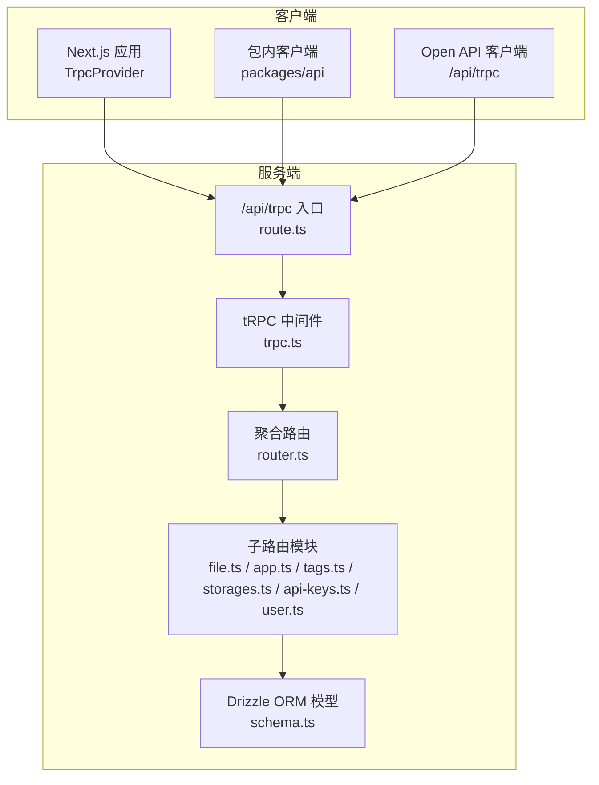
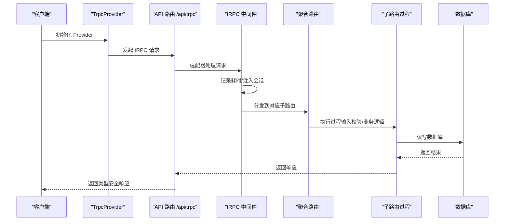
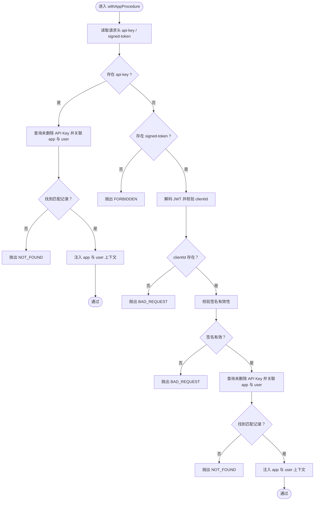
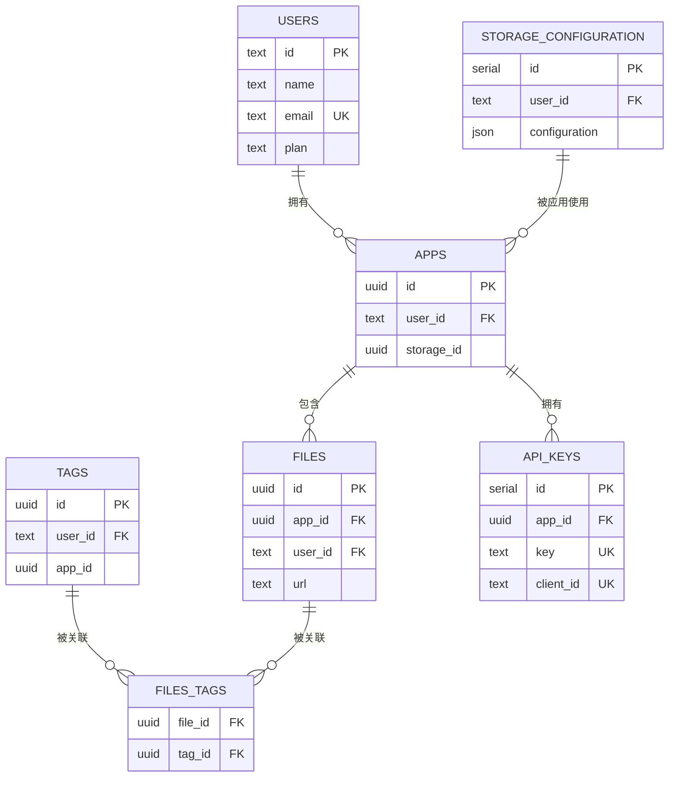
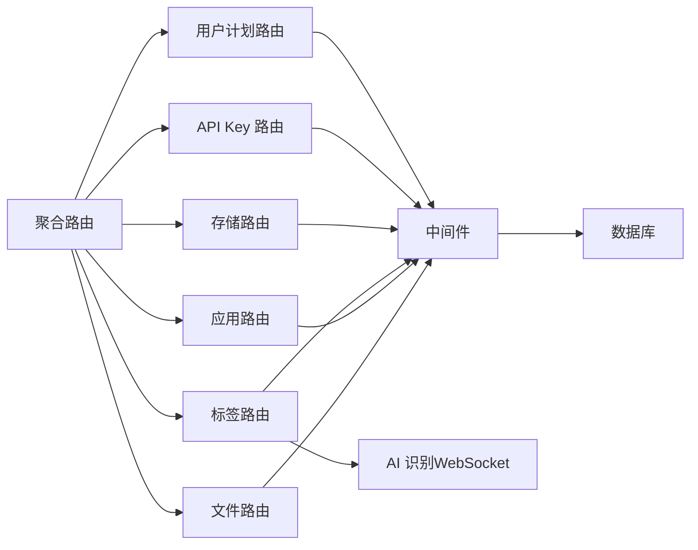

# API 接口文档

<cite>
**本文引用的文件**
- [src/server/trpc-middlewares/router.ts](file://src/server/trpc-middlewares/router.ts)
- [src/server/trpc-middlewares/trpc.ts](file://src/server/trpc-middlewares/trpc.ts)
- [src/app/api/trpc/[...trpc]/route.ts](file://src/app/api/trpc/[...trpc]/route.ts)
- [src/utils/trpc.ts](file://src/utils/trpc.ts)
- [packages/api/src/index.ts](file://packages/api/src/index.ts)
- [src/server/routes/file.ts](file://src/server/routes/file.ts)
- [src/server/routes/app.ts](file://src/server/routes/app.ts)
- [src/server/routes/api-keys.ts](file://src/server/routes/api-keys.ts)
- [src/server/routes/storages.ts](file://src/server/routes/storages.ts)
- [src/server/routes/tags.ts](file://src/server/routes/tags.ts)
- [src/server/routes/user.ts](file://src/server/routes/user.ts)
- [src/server/db/schema.ts](file://src/server/db/schema.ts)
- [src/app/trpc-provider.tsx](file://src/app/trpc-provider.tsx)
- [src/lib/auth.ts](file://src/lib/auth.ts)
- [src/utils/open-api.ts](file://src/utils/open-api.ts)
</cite>

## 目录

1. [简介](#简介)
2. [项目结构](#项目结构)
3. [核心组件](#核心组件)
4. [架构总览](#架构总览)
5. [详细组件分析](#详细组件分析)
6. [依赖关系分析](#依赖关系分析)
7. [性能考虑](#性能考虑)
8. [故障排查指南](#故障排查指南)
9. [结论](#结论)
10. [附录](#附录)

## 简介

本文件为 Image SaaS 项目的 API 接口参考与最佳实践指南，聚焦于基于 tRPC 的端到端类型安全接口设计、过程调用模式与实时能力说明。文档覆盖：

- 路由组织与中间件体系
- 认证与授权策略（会话与 API Key/Signed Token）
- 请求/响应格式与参数校验
- 错误处理与状态码语义
- 客户端集成方式（Next.js App Router、包内客户端、Open API）
- 性能优化与监控建议
- 版本控制、兼容性与弃用迁移指引
- 使用限制、速率限制与可观测性指标

## 项目结构

- tRPC 路由入口位于 App Router 的 API 路径，通过适配器将请求交由 tRPC 处理。
- 应用层路由按功能拆分为多个子路由模块（文件、应用、标签、存储、API Key、用户计划）。
- 中间件统一处理日志、会话注入与认证（API Key/Signed Token）。
- 数据模型采用 Drizzle ORM 定义，涵盖用户、应用、文件、标签、存储配置与 API Key。

图表来源

- [src/app/api/trpc/[...trpc]/route.ts:1-14](file://src/app/api/trpc/[...trpc]/route.ts#L1-L14)
- [src/server/trpc-middlewares/trpc.ts:1-130](file://src/server/trpc-middlewares/trpc.ts#L1-L130)
- [src/server/trpc-middlewares/router.ts:1-20](file://src/server/trpc-middlewares/router.ts#L1-L20)
- [src/server/routes/file.ts:1-561](file://src/server/routes/file.ts#L1-L561)
- [src/server/routes/app.ts:1-88](file://src/server/routes/app.ts#L1-L88)
- [src/server/routes/tags.ts:1-735](file://src/server/routes/tags.ts#L1-L735)
- [src/server/routes/storages.ts:1-74](file://src/server/routes/storages.ts#L1-L74)
- [src/server/routes/api-keys.ts:1-38](file://src/server/routes/api-keys.ts#L1-L38)
- [src/server/routes/user.ts:1-26](file://src/server/routes/user.ts#L1-L26)
- [src/server/db/schema.ts:1-270](file://src/server/db/schema.ts#L1-L270)

章节来源

- [src/app/api/trpc/[...trpc]/route.ts:1-14](file://src/app/api/trpc/[...trpc]/route.ts#L1-L14)
- [src/server/trpc-middlewares/router.ts:1-20](file://src/server/trpc-middlewares/router.ts#L1-L20)
- [src/server/db/schema.ts:1-270](file://src/server/db/schema.ts#L1-L270)

## 核心组件

- 聚合路由 appRouter：将 file、apps、tags、storages、apiKeys、plan 子路由整合。
- 中间件体系：
  - 日志中间件：记录每个过程耗时。
  - 会话中间件：注入当前用户会话上下文。
  - 受保护过程：要求已登录用户。
  - 应用级认证过程：支持 API Key 或 Signed Token 两种凭据，校验并注入 app 与 user 上下文。
- 子路由模块：按领域划分职责，统一使用 Zod 输入校验与 Drizzle ORM 数据访问。

章节来源

- [src/server/trpc-middlewares/router.ts:1-20](file://src/server/trpc-middlewares/router.ts#L1-L20)
- [src/server/trpc-middlewares/trpc.ts:1-130](file://src/server/trpc-middlewares/trpc.ts#L1-L130)

## 架构总览

下图展示客户端到服务端的端到端调用链路，包括认证与数据持久化路径。

图表来源

- [src/app/trpc-provider.tsx:1-18](file://src/app/trpc-provider.tsx#L1-L18)
- [src/app/api/trpc/[...trpc]/route.ts:1-14](file://src/app/api/trpc/[...trpc]/route.ts#L1-L14)
- [src/server/trpc-middlewares/trpc.ts:1-130](file://src/server/trpc-middlewares/trpc.ts#L1-L130)
- [src/server/trpc-middlewares/router.ts:1-20](file://src/server/trpc-middlewares/router.ts#L1-L20)
- [src/server/db/schema.ts:1-270](file://src/server/db/schema.ts#L1-L270)

## 详细组件分析

### 文件管理 API（file）

- 功能范围：预签名上传 URL 生成、保存文件元数据、分页/无限滚动查询、软删除与批量操作、回收站查询、按标签筛选、永久删除。
- 认证要求：受保护过程，需登录用户上下文。
- 关键过程与输入输出要点：
  - createPresignedUrl：输入包含文件名、内容类型、大小与 appId；输出预签名 URL 与方法。
  - saveFile：输入文件元信息与 appId；输出保存后的文件记录。
  - listFiles：按 appId 查询当前用户下的文件列表。
  - infinityQueryFiles：支持游标分页、排序字段与时间范围搜索、名称/标签模糊匹配。
  - deleteFile/batchDeleteFiles：软删除，带过期时间。
  - restoreFile/batchRestoreFiles：恢复软删除。
  - getDeletedFiles：回收站查询，支持游标分页。
  - infinityQueryFilesByTag：按标签过滤的无限滚动查询。
  - permanentlyDeleteFile/batchPermanentlyDeleteFiles：永久删除（注释提示需同步清理对象存储）。
- 参数验证：Zod Schema 校验输入字段与长度约束。
- 错误处理：针对资源不存在、权限不足、存储未配置等场景抛出相应状态码。

章节来源

- [src/server/routes/file.ts:1-561](file://src/server/routes/file.ts#L1-L561)

### 应用管理 API（apps）

- 功能范围：创建应用、列出应用、切换应用绑定的存储。
- 认证要求：受保护过程。
- 关键过程：
  - createApp：输入名称与描述，自动为新应用创建默认标签集。
  - listApps：按用户过滤，排除已删除应用。
  - changeStorage：将应用绑定到指定存储配置（校验所有权）。

章节来源

- [src/server/routes/app.ts:1-88](file://src/server/routes/app.ts#L1-L88)

### 标签管理 API（tags）

- 功能范围：获取用户标签、按分类分组标签、创建/更新/删除标签、为文件创建或获取标签、添加/移除文件标签、清理未使用标签、AI 图片标签识别。
- 认证要求：受保护过程。
- 关键过程：
  - getUserTags/getTagsByCategory：统计标签使用次数与分类计数。
  - createTag/updateTag/deleteTag：标签增删改与唯一性约束。
  - createOrGetTags/addTagsToFile：批量创建或获取标签并关联文件。
  - getFileTags/removeTagsFromFile：查询与移除文件标签。
  - cleanupUnusedTags：清理无引用标签。
  - recognizeImageTags：调用 AI 服务识别图片标签（WebSocket 实现）。
- 参数验证与业务规则：名称长度限制、颜色生成、重复关联避免、事务一致性保证。
- 错误处理：冲突、未找到、内部错误等。

章节来源

- [src/server/routes/tags.ts:1-735](file://src/server/routes/tags.ts#L1-L735)

### 存储配置 API（storages）

- 功能范围：列出存储、创建存储、更新存储。
- 认证要求：受保护过程。
- 关键过程：
  - listStorages：按用户过滤，排除已删除存储。
  - createStorage/updateStorage：输入包含名称、桶、区域、凭证与可选 API 端点，更新时校验所有权。

章节来源

- [src/server/routes/storages.ts:1-74](file://src/server/routes/storages.ts#L1-L74)

### API Key 管理 API（api-keys）

- 功能范围：列出 API Key、创建 API Key（生成 key 与 clientId）。
- 认证要求：受保护过程。
- 关键过程：
  - listApiKeys：按 appId 过滤，排除已删除。
  - createApiKey：输入名称与 appId，返回生成的 key 与 clientId。

章节来源

- [src/server/routes/api-keys.ts:1-38](file://src/server/routes/api-keys.ts#L1-L38)

### 用户计划 API（plan）

- 功能范围：查询当前用户所属计划。
- 认证要求：受保护过程。
- 关键过程：
  - getPlan：根据用户记录中的 planId 查询计划详情。

章节来源

- [src/server/routes/user.ts:1-26](file://src/server/routes/user.ts#L1-L26)

### 认证与授权机制

- 会话认证：受保护过程要求已登录用户，上下文注入 session。
- 应用级认证：支持两种凭据：
  - API Key：通过请求头 api-key 校验，需未删除且关联应用与用户。
  - Signed Token：通过请求头 signed-token 解码，校验 clientId 存在与签名有效，随后进行相同校验。
- 中间件行为：
  - 日志中间件：记录过程执行耗时。
  - 应用级中间件：优先尝试 API Key，其次尝试 Signed Token，均不满足则拒绝访问。

图表来源

- [src/server/trpc-middlewares/trpc.ts:47-127](file://src/server/trpc-middlewares/trpc.ts#L47-L127)

章节来源

- [src/server/trpc-middlewares/trpc.ts:1-130](file://src/server/trpc-middlewares/trpc.ts#L1-L130)

### 数据模型与关系

- 主要实体：users、apps、files、tags、files_tags、storageConfiguration、apiKeys。
- 关系概览：
  - users 与 apps 一对多
  - apps 与 files 一对多
  - apps 与 storageConfiguration 多对一
  - apps 与 apiKeys 一对多
  - files 与 tags 通过 files_tags 多对多

图表来源

- [src/server/db/schema.ts:1-270](file://src/server/db/schema.ts#L1-L270)

章节来源

- [src/server/db/schema.ts:1-270](file://src/server/db/schema.ts#L1-L270)

### 客户端集成指南

- Next.js 应用内集成：
  - 在应用根部包裹 TrpcProvider，初始化 QueryClient。
  - 通过 utils/api 导出的客户端发起请求。
- 包内客户端（packages/api）：
  - 支持传入 apiKey 或 signedToken，自动设置请求头。
  - 基于 httpBatchLink 批量传输，提升网络效率。
- Open API 客户端：
  - 通过 /api/trpc 直接访问，适用于无需 React Query 的场景。

章节来源

- [src/app/trpc-provider.tsx:1-18](file://src/app/trpc-provider.tsx#L1-L18)
- [packages/api/src/index.ts:1-35](file://packages/api/src/index.ts#L1-L35)
- [src/utils/open-api.ts:1-14](file://src/utils/open-api.ts#L1-L14)

### API 调用示例（步骤说明）

- 生成上传预签名 URL：
  - 步骤：调用 createPresignedUrl，传入文件名、类型、大小与 appId，获得 URL 与方法。
  - 说明：随后使用该 URL 直接向对象存储上传。
- 保存文件元数据：
  - 步骤：调用 saveFile，传入文件名、路径、类型与 appId，返回文件记录。
- 列表与搜索：
  - 步骤：调用 infinityQueryFiles，传入游标、limit、排序字段与搜索条件（名称/日期范围），循环获取下一页。
- 标签管理：
  - 步骤：调用 createOrGetTags 获取标签集合，再调用 addTagsToFile 关联到文件。
- API Key 访问：
  - 步骤：在请求头设置 api-key 或 signed-token，调用任意受保护过程。

章节来源

- [src/server/routes/file.ts:26-90](file://src/server/routes/file.ts#L26-L90)
- [src/server/routes/file.ts:91-133](file://src/server/routes/file.ts#L91-L133)
- [src/server/routes/file.ts:135-234](file://src/server/routes/file.ts#L135-L234)
- [src/server/routes/tags.ts:246-353](file://src/server/routes/tags.ts#L246-L353)
- [src/server/trpc-middlewares/trpc.ts:47-127](file://src/server/trpc-middlewares/trpc.ts#L47-L127)

## 依赖关系分析

- 组件耦合：
  - 聚合路由依赖各子路由模块，子路由依赖中间件与数据库。
  - 中间件依赖会话与数据库，用于注入上下文与鉴权。
- 外部依赖：
  - 对象存储 SDK 与预签名 URL 生成。
  - WebSocket 用于 AI 识别服务。
  - Drizzle ORM 与 PostgreSQL。
- 循环依赖：未发现明显循环依赖。

图表来源

- [src/server/trpc-middlewares/router.ts:1-20](file://src/server/trpc-middlewares/router.ts#L1-L20)
- [src/server/trpc-middlewares/trpc.ts:1-130](file://src/server/trpc-middlewares/trpc.ts#L1-L130)
- [src/server/routes/file.ts:1-561](file://src/server/routes/file.ts#L1-L561)
- [src/server/routes/app.ts:1-88](file://src/server/routes/app.ts#L1-L88)
- [src/server/routes/tags.ts:1-735](file://src/server/routes/tags.ts#L1-L735)
- [src/server/routes/storages.ts:1-74](file://src/server/routes/storages.ts#L1-L74)
- [src/server/routes/api-keys.ts:1-38](file://src/server/routes/api-keys.ts#L1-L38)
- [src/server/routes/user.ts:1-26](file://src/server/routes/user.ts#L1-L26)

章节来源

- [src/server/trpc-middlewares/router.ts:1-20](file://src/server/trpc-middlewares/router.ts#L1-L20)
- [src/server/trpc-middlewares/trpc.ts:1-130](file://src/server/trpc-middlewares/trpc.ts#L1-L130)

## 性能考虑

- 批量请求：使用 httpBatchLink 合并多次调用，减少往返开销。
- 分页与游标：infinityQuery 系列过程采用游标分页，避免大偏移导致的性能问题。
- 索引优化：数据库表在常用查询字段上建立索引（如文件表的复合索引）。
- 缓存策略：结合 React Query 的缓存与失效策略，合理设置 staleTime/cacheTime。
- 上传优化：预签名 URL 直传对象存储，避免经由应用服务器中转。
- AI 识别：WebSocket 调用具备超时控制，避免长时间占用连接。

章节来源

- [packages/api/src/index.ts:24-30](file://packages/api/src/index.ts#L24-L30)
- [src/server/routes/file.ts:135-234](file://src/server/routes/file.ts#L135-L234)
- [src/server/db/schema.ts:135](file://src/server/db/schema.ts#L135)
- [src/server/routes/tags.ts:629-703](file://src/server/routes/tags.ts#L629-L703)

## 故障排查指南

- 常见错误码与场景：
  - FORBIDDEN：未登录或缺少凭据（API Key/Signed Token）。
  - NOT_FOUND：资源不存在（应用、存储、API Key、文件）。
  - BAD_REQUEST：输入参数非法或签名无效。
  - CONFLICT：标签名称冲突。
  - INTERNAL_SERVER_ERROR：AI 识别服务异常。
- 排查步骤：
  - 检查请求头是否正确设置 api-key 或 signed-token。
  - 确认 appId 与用户身份匹配，应用已绑定存储。
  - 核对文件上传流程：先调用 createPresignedUrl，再直传对象存储。
  - 查看服务端日志（中间件记录的耗时）定位慢查询。
- 监控建议：
  - 记录过程耗时分布（P50/P95）。
  - 监控 API Key 与 Signed Token 的使用量与错误率。
  - 观察 AI 识别成功率与超时比例。

章节来源

- [src/server/trpc-middlewares/trpc.ts:11-45](file://src/server/trpc-middlewares/trpc.ts#L11-L45)
- [src/server/routes/file.ts:46-61](file://src/server/routes/file.ts#L46-L61)
- [src/server/routes/file.ts:508-531](file://src/server/routes/file.ts#L508-L531)
- [src/server/routes/tags.ts:523-529](file://src/server/routes/tags.ts#L523-L529)

## 结论

本项目通过 tRPC 实现了类型安全、可维护的 API 层，配合严格的输入校验、会话与应用级认证、完善的分页与搜索能力，以及可扩展的标签与存储体系，为图像管理场景提供了清晰的接口契约与良好的开发体验。建议在生产环境中结合批量传输、游标分页与缓存策略进一步优化性能，并完善对象存储的同步删除与 AI 识别的降级策略。

## 附录

### API 版本控制、兼容性与弃用迁移

- 版本控制建议：
  - 采用路径版本（如 /api/v1/trpc），逐步迁移旧过程。
  - 新增过程时保持向后兼容，避免破坏现有客户端。
- 兼容性策略：
  - 字段新增使用可选属性，避免强制变更。
  - 对于废弃字段，保留读取但不再写入，标注 deprecation。
- 迁移指引：
  - 提前发布弃用通知，提供替代过程与迁移脚本。
  - 通过双写与回滚策略降低迁移风险。

### 使用限制、速率限制与监控指标

- 使用限制：
  - 单次批量操作上限（如批量删除条数）可在过程内限制。
  - 文件大小与数量限制可通过输入校验与存储配额控制。
- 速率限制：
  - 建议在网关或边缘层实施基于 IP/Key 的限流。
  - 对高频查询（如无限滚动）增加缓存与节流。
- 监控指标：
  - 请求量、错误率、P95 延迟、AI 识别成功率、对象存储上传成功率。

### 最佳实践清单

- 客户端侧：
  - 使用 React Query 管理缓存与重试。
  - 上传前先调用预签名 URL，失败即刻重试。
- 服务端侧：
  - 严格区分受保护过程与应用级过程。
  - 对外部服务调用设置超时与重试。
  - 定期清理未使用标签与软删除过期数据。
