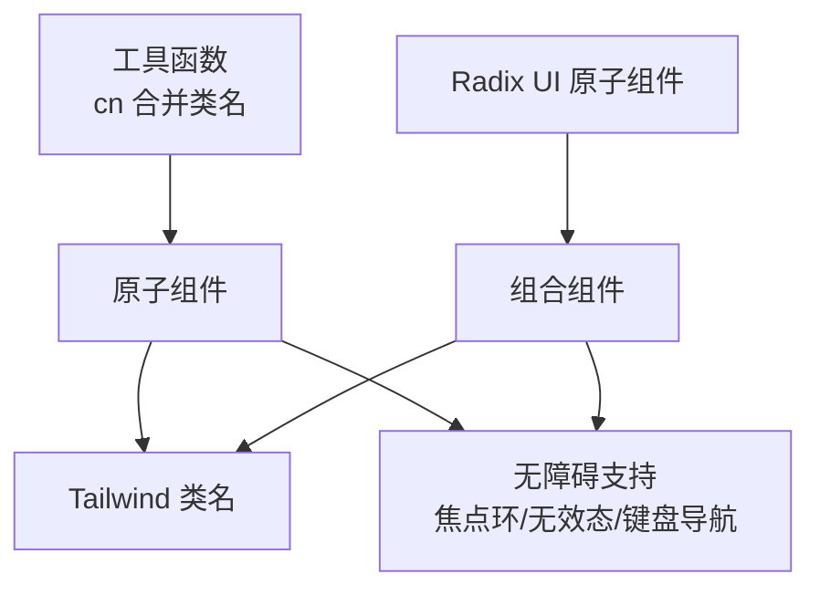
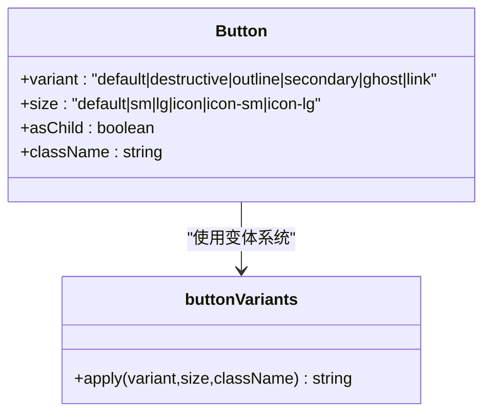
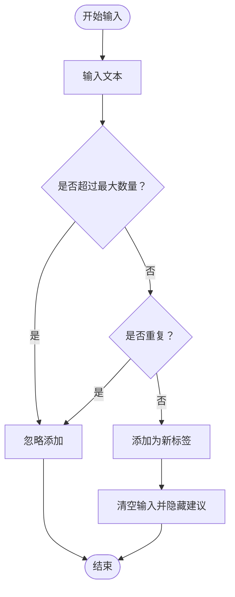
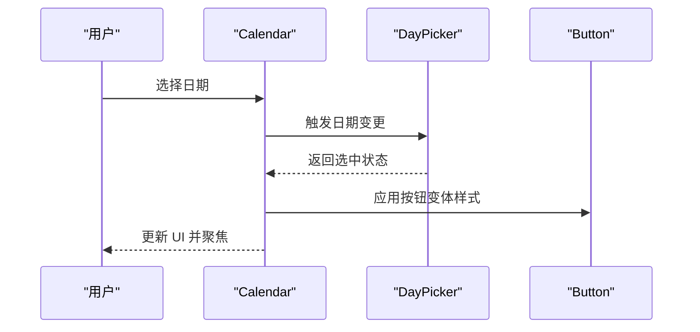
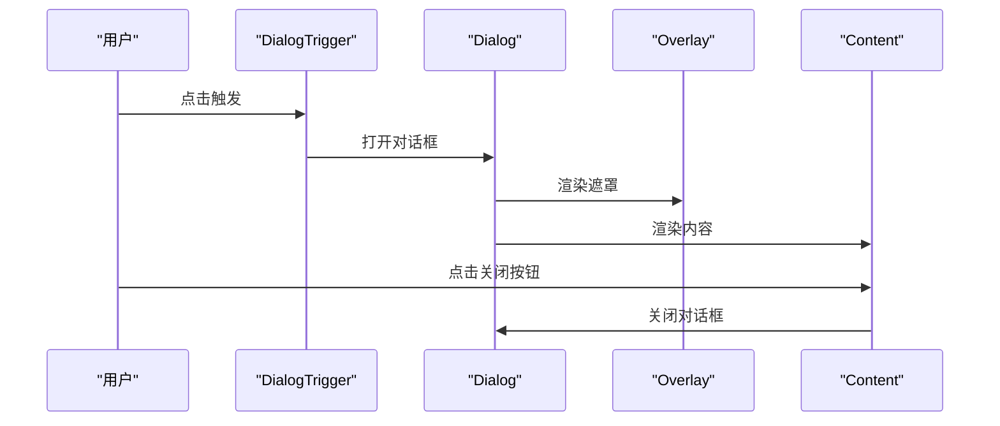
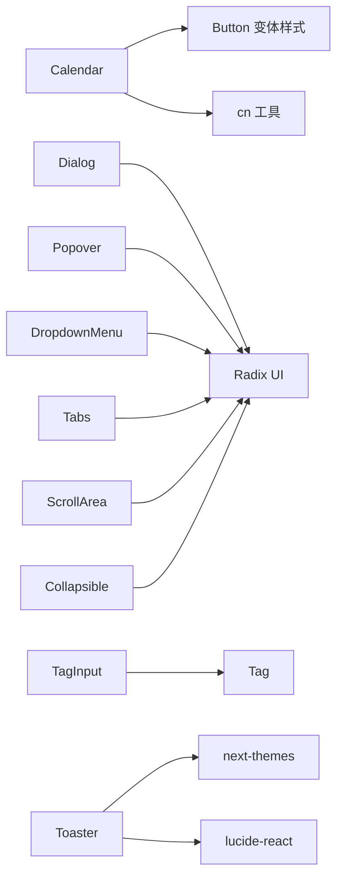

# UI 组件库

<cite>
**本文引用的文件**
- [src/components/ui/button.tsx](file://src/components/ui/button.tsx)
- [src/components/ui/input.tsx](file://src/components/ui/input.tsx)
- [src/components/ui/dialog.tsx](file://src/components/ui/dialog.tsx)
- [src/components/ui/alert.tsx](file://src/components/ui/alert.tsx)
- [src/components/ui/avatar.tsx](file://src/components/ui/avatar.tsx)
- [src/components/ui/calendar.tsx](file://src/components/ui/calendar.tsx)
- [src/components/ui/checkbox.tsx](file://src/components/ui/checkbox.tsx)
- [src/components/ui/dropdown-menu.tsx](file://src/components/ui/dropdown-menu.tsx)
- [src/components/ui/popover.tsx](file://src/components/ui/popover.tsx)
- [src/components/ui/tabs.tsx](file://src/components/ui/tabs.tsx)
- [src/components/ui/textarea.tsx](file://src/components/ui/textarea.tsx)
- [src/components/ui/tag.tsx](file://src/components/ui/tag.tsx)
- [src/components/ui/tag-input.tsx](file://src/components/ui/tag-input.tsx)
- [src/components/ui/scroll-area.tsx](file://src/components/ui/scroll-area.tsx)
- [src/components/ui/collapsible.tsx](file://src/components/ui/collapsible.tsx)
- [src/components/ui/label.tsx](file://src/components/ui/label.tsx)
- [src/components/ui/sonner.tsx](file://src/components/ui/sonner.tsx)
- [src/lib/utils.ts](file://src/lib/utils.ts)
</cite>

## 目录
1. [简介](#简介)
2. [项目结构](#项目结构)
3. [核心组件](#核心组件)
4. [架构总览](#架构总览)
5. [详细组件分析](#详细组件分析)
6. [依赖关系分析](#依赖关系分析)
7. [性能考量](#性能考量)
8. [故障排查指南](#故障排查指南)
9. [结论](#结论)
10. [附录](#附录)

## 简介
本文件为 Image SaaS 项目的 UI 组件库文档，聚焦于基于 Radix UI 与 Tailwind CSS 的组件系统设计与实现。文档覆盖基础 UI 组件的功能特性、属性配置、变体系统、尺寸规格、样式定制、交互行为与无障碍支持，并提供组件组合使用示例与最佳实践，帮助 UI 开发者高效构建一致、可维护且可扩展的界面。

## 项目结构
UI 组件集中位于 src/components/ui 目录下，采用“按功能分层”的组织方式：基础控件（按钮、输入框、文本域）、表单控件（复选框、标签输入）、浮层与对话（弹出框、下拉菜单、对话框、手风琴）、展示与导航（标签页、滚动区域、头像）、日历与提示（日历、警告、通知）等模块清晰划分，便于查找与复用。

```mermaid
graph TB
subgraph "UI 组件层"
Btn["Button<br/>按钮"]
Inp["Input<br/>输入框"]
Txt["Textarea<br/>多行文本"]
Ckb["Checkbox<br/>复选框"]
Tag["Tag / TagList / TagInput<br/>标签"]
Cal["Calendar<br/>日历"]
Dia["Dialog<br/>对话框"]
Pop["Popover<br/>弹出框"]
Drop["DropdownMenu<br/>下拉菜单"]
Tab["Tabs<br/>标签页"]
Scroll["ScrollArea<br/>滚动区域"]
Coll["Collapsible<br/>手风琴"]
Av["Avatar<br/>头像"]
Alert["Alert<br/>警告"]
Sonner["Toaster<br/>通知"]
Label["Label<br/>标签"]
end
Btn --> Radix["Radix UI 原子组件"]
Dia --> Radix
Pop --> Radix
Drop --> Radix
Tab --> Radix
Scroll --> Radix
Coll --> Radix
Av --> Radix
Ckb --> Radix
Label --> Radix
Btn --> Tailwind["Tailwind CSS 类名"]
Inp --> Tailwind
Txt --> Tailwind
Tag --> Tailwind
Cal --> Tailwind
Dia --> Tailwind
Pop --> Tailwind
Drop --> Tailwind
Tab --> Tailwind
Scroll --> Tailwind
Coll --> Tailwind
Av --> Tailwind
Alert --> Tailwind
Sonner --> Tailwind
Label --> Tailwind
```

图表来源
- [src/components/ui/button.tsx:1-63](file://src/components/ui/button.tsx#L1-L63)
- [src/components/ui/dialog.tsx:1-144](file://src/components/ui/dialog.tsx#L1-L144)
- [src/components/ui/popover.tsx:1-49](file://src/components/ui/popover.tsx#L1-L49)
- [src/components/ui/dropdown-menu.tsx:1-258](file://src/components/ui/dropdown-menu.tsx#L1-L258)
- [src/components/ui/tabs.tsx:1-67](file://src/components/ui/tabs.tsx#L1-L67)
- [src/components/ui/scroll-area.tsx:1-59](file://src/components/ui/scroll-area.tsx#L1-L59)
- [src/components/ui/collapsible.tsx:1-34](file://src/components/ui/collapsible.tsx#L1-L34)
- [src/components/ui/avatar.tsx:1-54](file://src/components/ui/avatar.tsx#L1-L54)
- [src/components/ui/alert.tsx:1-67](file://src/components/ui/alert.tsx#L1-L67)
- [src/components/ui/sonner.tsx:1-41](file://src/components/ui/sonner.tsx#L1-L41)
- [src/components/ui/label.tsx:1-25](file://src/components/ui/label.tsx#L1-L25)
- [src/components/ui/input.tsx:1-22](file://src/components/ui/input.tsx#L1-L22)
- [src/components/ui/textarea.tsx:1-19](file://src/components/ui/textarea.tsx#L1-L19)
- [src/components/ui/checkbox.tsx:1-33](file://src/components/ui/checkbox.tsx#L1-L33)
- [src/components/ui/tag.tsx:1-204](file://src/components/ui/tag.tsx#L1-L204)
- [src/components/ui/tag-input.tsx:1-158](file://src/components/ui/tag-input.tsx#L1-L158)
- [src/components/ui/calendar.tsx:1-221](file://src/components/ui/calendar.tsx#L1-L221)

章节来源
- [src/components/ui/button.tsx:1-63](file://src/components/ui/button.tsx#L1-L63)
- [src/components/ui/dialog.tsx:1-144](file://src/components/ui/dialog.tsx#L1-L144)
- [src/components/ui/popover.tsx:1-49](file://src/components/ui/popover.tsx#L1-L49)
- [src/components/ui/dropdown-menu.tsx:1-258](file://src/components/ui/dropdown-menu.tsx#L1-L258)
- [src/components/ui/tabs.tsx:1-67](file://src/components/ui/tabs.tsx#L1-L67)
- [src/components/ui/scroll-area.tsx:1-59](file://src/components/ui/scroll-area.tsx#L1-L59)
- [src/components/ui/collapsible.tsx:1-34](file://src/components/ui/collapsible.tsx#L1-L34)
- [src/components/ui/avatar.tsx:1-54](file://src/components/ui/avatar.tsx#L1-L54)
- [src/components/ui/alert.tsx:1-67](file://src/components/ui/alert.tsx#L1-L67)
- [src/components/ui/sonner.tsx:1-41](file://src/components/ui/sonner.tsx#L1-L41)
- [src/components/ui/label.tsx:1-25](file://src/components/ui/label.tsx#L1-L25)
- [src/components/ui/input.tsx:1-22](file://src/components/ui/input.tsx#L1-L22)
- [src/components/ui/textarea.tsx:1-19](file://src/components/ui/textarea.tsx#L1-L19)
- [src/components/ui/checkbox.tsx:1-33](file://src/components/ui/checkbox.tsx#L1-L33)
- [src/components/ui/tag.tsx:1-204](file://src/components/ui/tag.tsx#L1-L204)
- [src/components/ui/tag-input.tsx:1-158](file://src/components/ui/tag-input.tsx#L1-L158)
- [src/components/ui/calendar.tsx:1-221](file://src/components/ui/calendar.tsx#L1-L221)

## 核心组件
本节概述各组件的核心职责、关键属性与典型使用场景，帮助快速定位与选用。

- 按钮 Button
  - 功能：统一的触发器，支持多种语义变体与尺寸；支持作为容器渲染以嵌套图标或文本。
  - 关键属性：variant（默认/危险/描边/次级/幽暗/链接）、size（默认/小/大/图标/图标-小/图标-大）、asChild（是否以子元素渲染）。
  - 使用场景：主操作、次要操作、危险操作、图标按钮、链接式按钮。
  - 参考路径：[src/components/ui/button.tsx:1-63](file://src/components/ui/button.tsx#L1-L63)

- 输入 Input
  - 功能：基础文本输入，内置焦点态与无效态样式，支持文件选择器文本样式对齐。
  - 关键属性：type、className。
  - 使用场景：表单文本输入、搜索框、过滤器。
  - 参考路径：[src/components/ui/input.tsx:1-22](file://src/components/ui/input.tsx#L1-L22)

- 多行文本 Textarea
  - 功能：多行文本输入，具备焦点态与无效态样式。
  - 关键属性：className。
  - 使用场景：备注、描述、富文本编辑器前段。
  - 参考路径：[src/components/ui/textarea.tsx:1-19](file://src/components/ui/textarea.tsx#L1-L19)

- 复选框 Checkbox
  - 功能：二元选择控件，支持选中态与焦点态样式。
  - 关键属性：className。
  - 使用场景：同意条款、批量选择、偏好设置。
  - 参考路径：[src/components/ui/checkbox.tsx:1-33](file://src/components/ui/checkbox.tsx#L1-L33)

- 标签 Tag / TagList / TagInput
  - 功能：标签展示、列表与输入；支持移除、建议、最大数量限制。
  - 关键属性：Tag(name/color/size/removable/onRemove)、TagList(tags/size/removable/onRemoveTag)、TagInput(value/onChange/suggestions/maxTags)。
  - 使用场景：内容分类、筛选条件、标签云。
  - 参考路径：
    - [src/components/ui/tag.tsx:1-204](file://src/components/ui/tag.tsx#L1-L204)
    - [src/components/ui/tag-input.tsx:1-158](file://src/components/ui/tag-input.tsx#L1-L158)

- 日历 Calendar
  - 功能：日期选择器，支持范围选择、外层日期显示、自定义按钮样式与格式化。
  - 关键属性：showOutsideDays、captionLayout、buttonVariant、formatters、components。
  - 使用场景：生日选择、起止日期选择、日程安排。
  - 参考路径：[src/components/ui/calendar.tsx:1-221](file://src/components/ui/calendar.tsx#L1-L221)

- 对话框 Dialog
  - 功能：模态对话，包含遮罩、内容区、标题、描述、底部按钮区与关闭按钮。
  - 关键属性：showCloseButton（是否显示关闭按钮）、className。
  - 使用场景：确认对话、设置面板、信息弹窗。
  - 参考路径：[src/components/ui/dialog.tsx:1-144](file://src/components/ui/dialog.tsx#L1-L144)

- 弹出框 Popover
  - 功能：非模态弹出，常用于轻量菜单或快捷操作。
  - 关键属性：align、sideOffset。
  - 使用场景：用户菜单、快捷设置、日期选择器。
  - 参考路径：[src/components/ui/popover.tsx:1-49](file://src/components/ui/popover.tsx#L1-L49)

- 下拉菜单 DropdownMenu
  - 功能：复杂上下文菜单，支持子菜单、勾选项、单选项、分隔符与快捷键提示。
  - 关键属性：variant（default/destructive）、inset、sideOffset。
  - 使用场景：操作菜单、设置项、排序与筛选。
  - 参考路径：[src/components/ui/dropdown-menu.tsx:1-258](file://src/components/ui/dropdown-menu.tsx#L1-L258)

- 标签页 Tabs
  - 功能：内容分区切换，支持激活态样式与键盘导航。
  - 关键属性：className。
  - 使用场景：设置分组、详情页、多视图。
  - 参考路径：[src/components/ui/tabs.tsx:1-67](file://src/components/ui/tabs.tsx#L1-L67)

- 滚动区域 ScrollArea
  - 功能：自定义滚动条，支持水平/垂直滚动。
  - 关键属性：orientation。
  - 使用场景：长列表、侧边栏、内容容器。
  - 参考路径：[src/components/ui/scroll-area.tsx:1-59](file://src/components/ui/scroll-area.tsx#L1-L59)

- 手风琴 Collapsible
  - 功能：可折叠/展开内容块。
  - 关键属性：无特殊属性，通过原生 API 控制。
  - 使用场景：FAQ、设置项、折叠面板。
  - 参考路径：[src/components/ui/collapsible.tsx:1-34](file://src/components/ui/collapsible.tsx#L1-L34)

- 头像 Avatar
  - 功能：用户头像占位与回退。
  - 关键属性：className。
  - 使用场景：用户资料、评论列表、消息气泡。
  - 参考路径：[src/components/ui/avatar.tsx:1-54](file://src/components/ui/avatar.tsx#L1-L54)

- 警告 Alert
  - 功能：信息提示，支持破坏性样式。
  - 关键属性：variant（default/destructive）。
  - 使用场景：错误提示、成功反馈、一般性提示。
  - 参考路径：[src/components/ui/alert.tsx:1-67](file://src/components/ui/alert.tsx#L1-L67)

- 通知 Toaster
  - 功能：全局通知，支持主题适配与图标映射。
  - 关键属性：ToasterProps（由第三方库提供）。
  - 使用场景：异步结果反馈、加载状态、错误提示。
  - 参考路径：[src/components/ui/sonner.tsx:1-41](file://src/components/ui/sonner.tsx#L1-L41)

- 标签 Label
  - 功能：表单控件标签，支持禁用态与焦点态样式。
  - 关键属性：className。
  - 使用场景：表单说明、提示文字。
  - 参考路径：[src/components/ui/label.tsx:1-25](file://src/components/ui/label.tsx#L1-L25)

章节来源
- [src/components/ui/button.tsx:1-63](file://src/components/ui/button.tsx#L1-L63)
- [src/components/ui/input.tsx:1-22](file://src/components/ui/input.tsx#L1-L22)
- [src/components/ui/textarea.tsx:1-19](file://src/components/ui/textarea.tsx#L1-L19)
- [src/components/ui/checkbox.tsx:1-33](file://src/components/ui/checkbox.tsx#L1-L33)
- [src/components/ui/tag.tsx:1-204](file://src/components/ui/tag.tsx#L1-L204)
- [src/components/ui/tag-input.tsx:1-158](file://src/components/ui/tag-input.tsx#L1-L158)
- [src/components/ui/calendar.tsx:1-221](file://src/components/ui/calendar.tsx#L1-L221)
- [src/components/ui/dialog.tsx:1-144](file://src/components/ui/dialog.tsx#L1-L144)
- [src/components/ui/popover.tsx:1-49](file://src/components/ui/popover.tsx#L1-L49)
- [src/components/ui/dropdown-menu.tsx:1-258](file://src/components/ui/dropdown-menu.tsx#L1-L258)
- [src/components/ui/tabs.tsx:1-67](file://src/components/ui/tabs.tsx#L1-L67)
- [src/components/ui/scroll-area.tsx:1-59](file://src/components/ui/scroll-area.tsx#L1-L59)
- [src/components/ui/collapsible.tsx:1-34](file://src/components/ui/collapsible.tsx#L1-L34)
- [src/components/ui/avatar.tsx:1-54](file://src/components/ui/avatar.tsx#L1-L54)
- [src/components/ui/alert.tsx:1-67](file://src/components/ui/alert.tsx#L1-L67)
- [src/components/ui/sonner.tsx:1-41](file://src/components/ui/sonner.tsx#L1-L41)
- [src/components/ui/label.tsx:1-25](file://src/components/ui/label.tsx#L1-L25)

## 架构总览
组件系统遵循“原子化 + 组合”的设计原则：
- 原子组件：Button、Input、Textarea、Checkbox、Label 等，提供最小可用能力。
- 组合组件：Dialog、Popover、DropdownMenu、Tabs、ScrollArea、Calendar、Alert、Tag、TagInput 等，基于 Radix UI 提供可访问性与状态管理。
- 样式系统：统一使用 Tailwind CSS 类名与 cn 工具函数进行合并与覆盖，确保一致性与可定制性。
- 主题与无障碍：组件普遍支持焦点环、无效态、深色模式、键盘导航与屏幕阅读器友好。

图表来源
- [src/lib/utils.ts:1-7](file://src/lib/utils.ts#L1-L7)
- [src/components/ui/button.tsx:1-63](file://src/components/ui/button.tsx#L1-L63)
- [src/components/ui/dialog.tsx:1-144](file://src/components/ui/dialog.tsx#L1-L144)
- [src/components/ui/dropdown-menu.tsx:1-258](file://src/components/ui/dropdown-menu.tsx#L1-L258)
- [src/components/ui/popover.tsx:1-49](file://src/components/ui/popover.tsx#L1-L49)
- [src/components/ui/tabs.tsx:1-67](file://src/components/ui/tabs.tsx#L1-L67)
- [src/components/ui/scroll-area.tsx:1-59](file://src/components/ui/scroll-area.tsx#L1-L59)
- [src/components/ui/calendar.tsx:1-221](file://src/components/ui/calendar.tsx#L1-L221)
- [src/components/ui/alert.tsx:1-67](file://src/components/ui/alert.tsx#L1-L67)
- [src/components/ui/tag.tsx:1-204](file://src/components/ui/tag.tsx#L1-L204)
- [src/components/ui/tag-input.tsx:1-158](file://src/components/ui/tag-input.tsx#L1-L158)

## 详细组件分析

### 按钮 Button
- 设计要点
  - 变体系统：default、destructive、outline、secondary、ghost、link。
  - 尺寸系统：default、sm、lg、icon、icon-sm、icon-lg。
  - 渲染策略：支持 asChild，允许将按钮渲染为任意元素（如链接）。
  - 状态样式：聚焦态带 ring 边框与阴影；无效态带 destructive 颜色。
- 交互行为
  - 支持禁用态与指针事件控制。
  - 图标尺寸自动适配，避免额外 size 类名。
- 最佳实践
  - 主要动作使用 default 或 destructive；图标按钮使用 icon 变体。
  - 在表单中优先使用原生 button，避免误用 asChild 导致可访问性问题。
- 参考路径
  - [src/components/ui/button.tsx:1-63](file://src/components/ui/button.tsx#L1-L63)

图表来源
- [src/components/ui/button.tsx:7-37](file://src/components/ui/button.tsx#L7-L37)

章节来源
- [src/components/ui/button.tsx:1-63](file://src/components/ui/button.tsx#L1-L63)

### 输入 Input 与多行文本 Textarea
- 设计要点
  - 统一圆角、边框、背景与过渡动画。
  - 焦点态：ring 边框与阴影；无效态：destructive 颜色。
  - 文件选择器文本样式对齐，提升一致性。
- 交互行为
  - 禁用态：不可交互、透明度降低。
  - 支持 placeholder 文本与选择态高亮。
- 最佳实践
  - 表单校验失败时配合 aria-invalid 使用无效态。
  - 长文本使用 Textarea，短文本使用 Input。
- 参考路径
  - [src/components/ui/input.tsx:1-22](file://src/components/ui/input.tsx#L1-L22)
  - [src/components/ui/textarea.tsx:1-19](file://src/components/ui/textarea.tsx#L1-L19)

章节来源
- [src/components/ui/input.tsx:1-22](file://src/components/ui/input.tsx#L1-L22)
- [src/components/ui/textarea.tsx:1-19](file://src/components/ui/textarea.tsx#L1-L19)

### 复选框 Checkbox
- 设计要点
  - 选中态：背景与前景色随 primary 变量变化。
  - 焦点态：ring 边框与阴影；无效态：destructive 颜色。
- 交互行为
  - 支持受控与非受控两种模式。
  - 内置指示器图标，尺寸与主题自适应。
- 最佳实践
  - 与 Label 组合使用，提升可访问性。
  - 大面积选择场景使用 Switch 或自定义组件。
- 参考路径
  - [src/components/ui/checkbox.tsx:1-33](file://src/components/ui/checkbox.tsx#L1-L33)

章节来源
- [src/components/ui/checkbox.tsx:1-33](file://src/components/ui/checkbox.tsx#L1-L33)

### 标签 Tag / TagList / TagInput
- 设计要点
  - Tag：颜色可配、尺寸（sm/md/lg）、可移除。
  - TagList：空状态文案、自动换行。
  - TagInput：输入、回车添加、建议列表、最大数量限制、点击建议添加。
- 交互行为
  - 支持键盘删除最后标签、Esc 关闭建议。
  - 点击外部关闭建议列表。
- 最佳实践
  - 建议列表来源于后端接口或本地字典，注意去重与长度限制。
  - 移除回调需同步更新父组件状态。
- 参考路径
  - [src/components/ui/tag.tsx:1-204](file://src/components/ui/tag.tsx#L1-L204)
  - [src/components/ui/tag-input.tsx:1-158](file://src/components/ui/tag-input.tsx#L1-L158)

图表来源
- [src/components/ui/tag-input.tsx:63-77](file://src/components/ui/tag-input.tsx#L63-L77)

章节来源
- [src/components/ui/tag.tsx:1-204](file://src/components/ui/tag.tsx#L1-L204)
- [src/components/ui/tag-input.tsx:1-158](file://src/components/ui/tag-input.tsx#L1-L158)

### 日历 Calendar
- 设计要点
  - 默认类名继承 react-day-picker，支持 RTL 翻转箭头方向。
  - 自定义按钮样式：通过 buttonVariant 应用 Button 变体。
  - 选中态：单选/范围起止/中间段不同样式。
- 交互行为
  - 焦点态自动聚焦到当前选中日期。
  - 支持月份/年份下拉、外层日期显示控制。
- 最佳实践
  - 范围选择场景建议同时提供起止日期输入框与日历联动。
  - 自定义格式化器用于国际化。
- 参考路径
  - [src/components/ui/calendar.tsx:1-221](file://src/components/ui/calendar.tsx#L1-L221)

图表来源
- [src/components/ui/calendar.tsx:182-218](file://src/components/ui/calendar.tsx#L182-L218)

章节来源
- [src/components/ui/calendar.tsx:1-221](file://src/components/ui/calendar.tsx#L1-L221)

### 对话框 Dialog
- 设计要点
  - Portal 渲染，固定定位，居中布局。
  - 遮罩：淡入淡出动画；内容区：缩放与淡入淡出动画。
  - 可选关闭按钮，含无障碍文本。
- 交互行为
  - ESC 关闭；点击遮罩可配置是否关闭。
  - 键盘焦点管理：打开时锁定焦点，关闭时归还焦点。
- 最佳实践
  - 标题与描述明确告知用户操作目的。
  - 危险操作使用 destructive 变体按钮。
- 参考路径
  - [src/components/ui/dialog.tsx:1-144](file://src/components/ui/dialog.tsx#L1-L144)

图表来源
- [src/components/ui/dialog.tsx:9-81](file://src/components/ui/dialog.tsx#L9-L81)

章节来源
- [src/components/ui/dialog.tsx:1-144](file://src/components/ui/dialog.tsx#L1-L144)

### 弹出框 Popover
- 设计要点
  - 非模态弹出，支持对齐与偏移。
  - 动画入场/出场，边缘吸附。
- 交互行为
  - 触发器可为任意元素；支持锚点定位。
- 最佳实践
  - 与下拉菜单组合使用，形成二级菜单。
- 参考路径
  - [src/components/ui/popover.tsx:1-49](file://src/components/ui/popover.tsx#L1-L49)

章节来源
- [src/components/ui/popover.tsx:1-49](file://src/components/ui/popover.tsx#L1-L49)

### 下拉菜单 DropdownMenu
- 设计要点
  - 支持普通项、勾选项、单选项、分隔符、快捷键提示与子菜单。
  - 焦点态：高亮背景与前景色；禁用态：半透明与不可交互。
- 交互行为
  - 子菜单展开/收起；Esc 关闭层级。
- 最佳实践
  - 危险操作使用 destructive 变体。
  - 大型菜单使用 ScrollArea 包裹。
- 参考路径
  - [src/components/ui/dropdown-menu.tsx:1-258](file://src/components/ui/dropdown-menu.tsx#L1-L258)

章节来源
- [src/components/ui/dropdown-menu.tsx:1-258](file://src/components/ui/dropdown-menu.tsx#L1-L258)

### 标签页 Tabs
- 设计要点
  - 列表容器：背景与圆角；触发器：激活态阴影与边框。
  - 支持禁用态与键盘导航。
- 交互行为
  - 切换内容区；保持焦点在触发器上。
- 最佳实践
  - 标签数量较多时使用 ScrollArea 或横向滚动。
- 参考路径
  - [src/components/ui/tabs.tsx:1-67](file://src/components/ui/tabs.tsx#L1-L67)

章节来源
- [src/components/ui/tabs.tsx:1-67](file://src/components/ui/tabs.tsx#L1-L67)

### 滚动区域 ScrollArea
- 设计要点
  - 自定义滚动条：垂直/水平；透明边框与过渡。
  - 容器与视口分离，保证样式隔离。
- 交互行为
  - 滚动时显示滚动条；触摸设备优化。
- 最佳实践
  - 长列表与侧边栏必备。
- 参考路径
  - [src/components/ui/scroll-area.tsx:1-59](file://src/components/ui/scroll-area.tsx#L1-L59)

章节来源
- [src/components/ui/scroll-area.tsx:1-59](file://src/components/ui/scroll-area.tsx#L1-L59)

### 手风琴 Collapsible
- 设计要点
  - 原子组件封装，暴露根、触发器、内容三部分。
- 交互行为
  - 展开/折叠动画；键盘控制。
- 最佳实践
  - 与 Accordion 组合使用，形成复合组件。
- 参考路径
  - [src/components/ui/collapsible.tsx:1-34](file://src/components/ui/collapsible.tsx#L1-L34)

章节来源
- [src/components/ui/collapsible.tsx:1-34](file://src/components/ui/collapsible.tsx#L1-L34)

### 头像 Avatar
- 设计要点
  - 圆形裁剪，占位与回退文本。
- 交互行为
  - 图片加载失败时显示回退。
- 最佳实践
  - 与用户信息卡片组合使用。
- 参考路径
  - [src/components/ui/avatar.tsx:1-54](file://src/components/ui/avatar.tsx#L1-L54)

章节来源
- [src/components/ui/avatar.tsx:1-54](file://src/components/ui/avatar.tsx#L1-L54)

### 警告 Alert
- 设计要点
  - 默认与破坏性两种样式；支持图标与描述区网格布局。
- 交互行为
  - 角色声明为 alert，便于读屏识别。
- 最佳实践
  - 错误信息使用破坏性样式。
- 参考路径
  - [src/components/ui/alert.tsx:1-67](file://src/components/ui/alert.tsx#L1-L67)

章节来源
- [src/components/ui/alert.tsx:1-67](file://src/components/ui/alert.tsx#L1-L67)

### 通知 Toaster
- 设计要点
  - 主题感知：跟随系统/浅色/深色；图标映射。
  - CSS 变量：与主题变量对齐。
- 交互行为
  - 全局注册，按队列显示。
- 最佳实践
  - 成功/错误/警告/信息/加载分别使用对应类型。
- 参考路径
  - [src/components/ui/sonner.tsx:1-41](file://src/components/ui/sonner.tsx#L1-L41)

章节来源
- [src/components/ui/sonner.tsx:1-41](file://src/components/ui/sonner.tsx#L1-L41)

### 标签 Label
- 设计要点
  - 与表单控件配对使用；禁用态与焦点态样式。
- 交互行为
  - 点击标签可聚焦关联控件。
- 最佳实践
  - 与 Input/Checkbox/Textarea 等组合。
- 参考路径
  - [src/components/ui/label.tsx:1-25](file://src/components/ui/label.tsx#L1-L25)

章节来源
- [src/components/ui/label.tsx:1-25](file://src/components/ui/label.tsx#L1-L25)

## 依赖关系分析
- 组件间依赖
  - Calendar 依赖 Button 变体样式与 cn 工具。
  - Dialog/Popover/DropdownMenu/Tabs/ScrollArea/Collapsible 均依赖 Radix UI 原子组件。
  - TagInput 依赖 Tag 组件。
  - Toaster 依赖主题钩子与第三方通知库。
- 工具函数
  - cn 工具负责类名合并与冲突修复，确保样式链路稳定。
- 外部依赖
  - Radix UI：可访问性与状态管理。
  - Tailwind CSS：原子化样式。
  - lucide-react：图标库。
  - react-day-picker：日历组件。
  - next-themes：主题感知。
  - sonner：通知系统。

图表来源
- [src/components/ui/calendar.tsx:16-16](file://src/components/ui/calendar.tsx#L16-L16)
- [src/components/ui/button.tsx:3-3](file://src/components/ui/button.tsx#L3-L3)
- [src/components/ui/dialog.tsx:4-4](file://src/components/ui/dialog.tsx#L4-L4)
- [src/components/ui/popover.tsx:4-4](file://src/components/ui/popover.tsx#L4-L4)
- [src/components/ui/dropdown-menu.tsx:4-4](file://src/components/ui/dropdown-menu.tsx#L4-L4)
- [src/components/ui/tabs.tsx:4-4](file://src/components/ui/tabs.tsx#L4-L4)
- [src/components/ui/scroll-area.tsx:4-4](file://src/components/ui/scroll-area.tsx#L4-L4)
- [src/components/ui/collapsible.tsx:4-4](file://src/components/ui/collapsible.tsx#L4-L4)
- [src/components/ui/tag-input.tsx:1-3](file://src/components/ui/tag-input.tsx#L1-L3)
- [src/components/ui/tag.tsx:1-3](file://src/components/ui/tag.tsx#L1-L3)
- [src/components/ui/sonner.tsx:10-11](file://src/components/ui/sonner.tsx#L10-L11)

章节来源
- [src/components/ui/calendar.tsx:1-221](file://src/components/ui/calendar.tsx#L1-L221)
- [src/components/ui/button.tsx:1-63](file://src/components/ui/button.tsx#L1-L63)
- [src/components/ui/dialog.tsx:1-144](file://src/components/ui/dialog.tsx#L1-L144)
- [src/components/ui/popover.tsx:1-49](file://src/components/ui/popover.tsx#L1-L49)
- [src/components/ui/dropdown-menu.tsx:1-258](file://src/components/ui/dropdown-menu.tsx#L1-L258)
- [src/components/ui/tabs.tsx:1-67](file://src/components/ui/tabs.tsx#L1-L67)
- [src/components/ui/scroll-area.tsx:1-59](file://src/components/ui/scroll-area.tsx#L1-L59)
- [src/components/ui/collapsible.tsx:1-34](file://src/components/ui/collapsible.tsx#L1-L34)
- [src/components/ui/tag-input.tsx:1-158](file://src/components/ui/tag-input.tsx#L1-L158)
- [src/components/ui/tag.tsx:1-204](file://src/components/ui/tag.tsx#L1-L204)
- [src/components/ui/sonner.tsx:1-41](file://src/components/ui/sonner.tsx#L1-L41)

## 性能考量
- 样式合并
  - 使用 cn 工具减少类名冲突与冗余，避免重复覆盖。
- 动画与渲染
  - 对话框、下拉菜单、弹出框均使用 Radix UI 的动画系统，确保流畅与可访问。
- 计算复杂度
  - TagInput 的建议过滤在输入时进行，建议使用防抖或虚拟化长列表。
- 主题切换
  - Toaster 与组件均支持主题感知，避免频繁重绘。
- 建议
  - 大型列表使用虚拟滚动或分页。
  - 图标使用 lucide-react，按需引入以减小包体积。

## 故障排查指南
- 焦点与键盘导航
  - 若发现无法通过键盘操作，请检查是否正确包裹在 Tabs、DropdownMenu、Dialog 等容器内。
- 无效态样式未生效
  - 确认表单控件已正确绑定 aria-invalid 属性并与组件样式联动。
- 图标尺寸异常
  - 确保未手动覆盖 size 类名，或使用组件提供的 icon 变体。
- 日历焦点未对齐
  - 确认已启用焦点修饰符，组件会在选中日期时自动聚焦。
- 通知未显示
  - 确认 Toaster 已在应用根部注册，且主题配置正确。
- 标签输入不响应
  - 检查最大数量与重复校验逻辑，确保 onChange 回调被正确调用。

章节来源
- [src/components/ui/dialog.tsx:1-144](file://src/components/ui/dialog.tsx#L1-L144)
- [src/components/ui/dropdown-menu.tsx:1-258](file://src/components/ui/dropdown-menu.tsx#L1-L258)
- [src/components/ui/tabs.tsx:1-67](file://src/components/ui/tabs.tsx#L1-L67)
- [src/components/ui/calendar.tsx:182-218](file://src/components/ui/calendar.tsx#L182-L218)
- [src/components/ui/sonner.tsx:1-41](file://src/components/ui/sonner.tsx#L1-L41)
- [src/components/ui/tag-input.tsx:1-158](file://src/components/ui/tag-input.tsx#L1-L158)

## 结论
该 UI 组件库以 Radix UI 为核心，结合 Tailwind CSS 实现了高可访问性、强一致性的组件体系。通过变体系统与尺寸规范，组件在不同场景下保持统一风格；通过 cn 工具与主题感知，实现灵活定制与良好体验。建议在实际项目中遵循本文档的最佳实践，合理组合组件，确保可维护性与可扩展性。

## 附录
- 变体与尺寸速览
  - Button：variant(default/destructive/outline/secondary/ghost/link)，size(default/sm/lg/icon/icon-sm/icon-lg)
  - Input/Textarea：基础样式，支持无效态与焦点态
  - Checkbox：选中态与无效态
  - Tag：size(sm/md/lg)，可配色与可移除
  - Alert：variant(default/destructive)
  - DropdownMenu：item/radio/checkbox/label/separator/sub
  - Tabs：激活态样式
  - ScrollArea：vertical/horizontal
  - Calendar：buttonVariant 与多种修饰符
- 无障碍支持
  - 焦点环与键盘导航：Button、Input、Textarea、Checkbox、Tabs、DropdownMenu、Calendar
  - 屏幕阅读器角色：Alert、Dialog、Label
  - 无障碍文本：Dialog 关闭按钮包含 sr-only 文本
- 样式定制
  - 使用 cn 工具合并类名，避免样式冲突
  - 通过主题变量与 CSS 变量统一外观