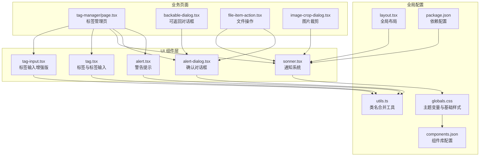
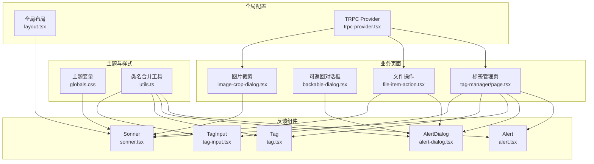
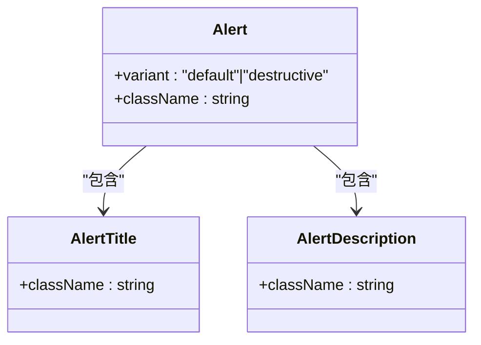
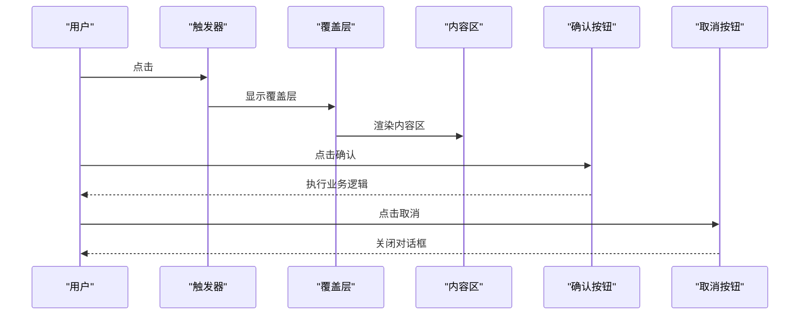
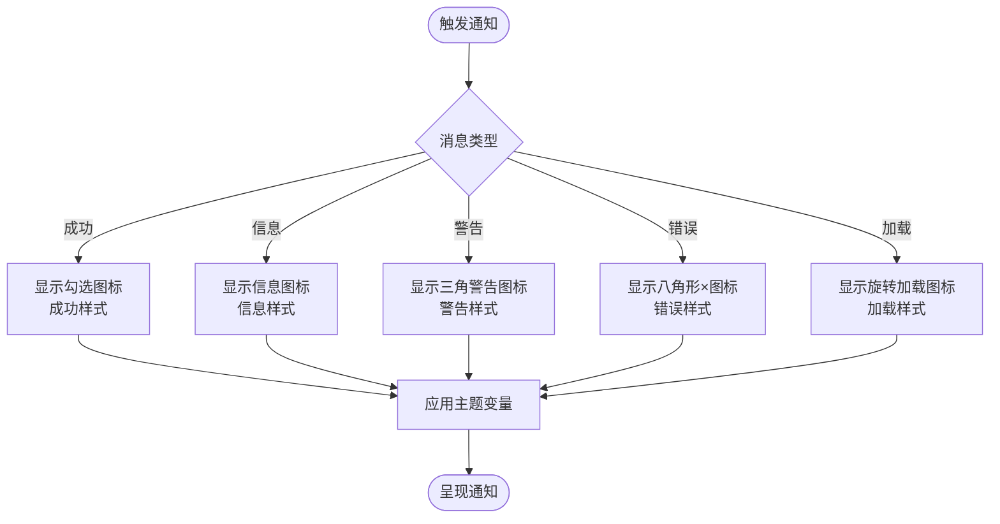
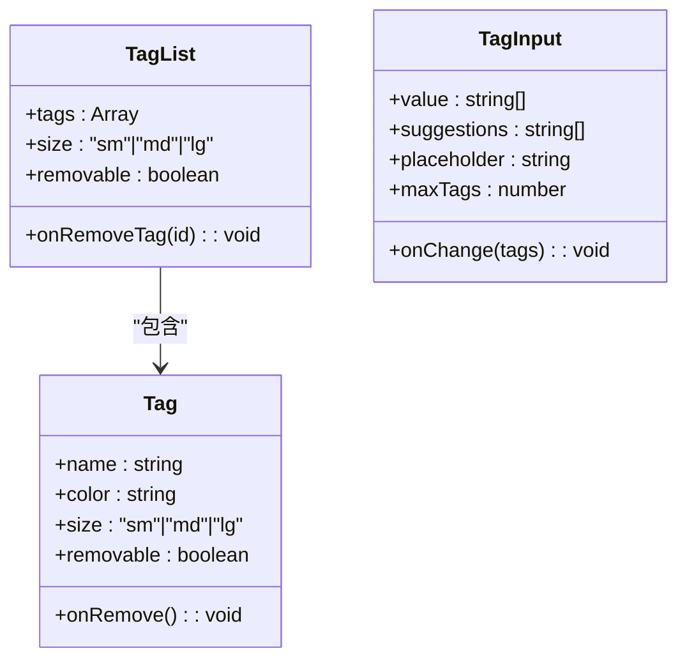
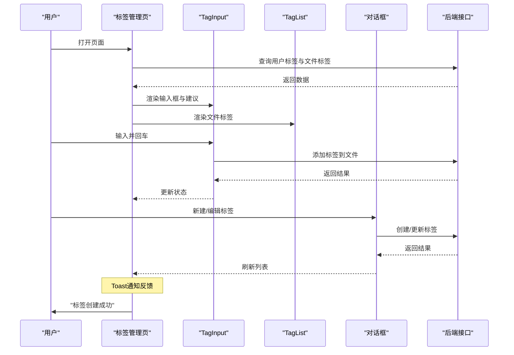
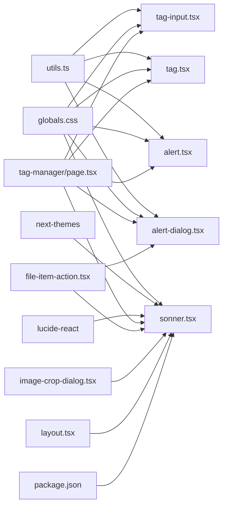

# 反馈组件

<cite>
**本文引用的文件**
- [src/components/ui/alert.tsx](file://src/components/ui/alert.tsx)
- [src/components/ui/alert-dialog.tsx](file://src/components/ui/alert-dialog.tsx)
- [src/components/ui/sonner.tsx](file://src/components/ui/sonner.tsx)
- [src/components/ui/tag.tsx](file://src/components/ui/tag.tsx)
- [src/components/ui/tag-input.tsx](file://src/components/ui/tag-input.tsx)
- [src/app/dashboard/apps/[appId]/setting/tag-manager/page.tsx](file://src/app/dashboard/apps/[appId]/setting/tag-manager/page.tsx)
- [src/app/dashboard/apps/@intercepting/(.)new/backable-dialog.tsx](file://src/app/dashboard/apps/@intercepting/(.)new/backable-dialog.tsx)
- [src/app/layout.tsx](file://src/app/layout.tsx)
- [src/app/globals.css](file://src/app/globals.css)
- [src/lib/utils.ts](file://src/lib/utils.ts)
- [src/components/feature/file-item-action.tsx](file://src/components/feature/file-item-action.tsx)
- [src/components/feature/image-crop-dialog.tsx](file://src/components/feature/image-crop-dialog.tsx)
- [src/app/trpc-provider.tsx](file://src/app/trpc-provider.tsx)
- [components.json](file://components.json)
- [package.json](file://package.json)
</cite>

## 更新摘要
**变更内容**
- 新增Sonner通知系统的完整集成文档
- 添加Toast通知组件的使用示例和最佳实践
- 更新通知系统在全局布局中的配置
- 增加实际业务场景中的Toast使用案例
- 完善通知系统的架构图和依赖关系

## 目录
1. [简介](#简介)
2. [项目结构](#项目结构)
3. [核心组件](#核心组件)
4. [架构总览](#架构总览)
5. [组件详解](#组件详解)
6. [依赖关系分析](#依赖关系分析)
7. [性能考量](#性能考量)
8. [故障排查指南](#故障排查指南)
9. [结论](#结论)
10. [附录](#附录)

## 简介
本文件聚焦 Image SaaS 项目中的"反馈类"组件体系，包括警告提示（Alert）、确认对话框（AlertDialog）、通知系统（Sonner）与标签（Tag）。我们将从设计理念、实现细节、信息层级与视觉层次、交互时机、消息类型与样式变体、动画效果、业务场景使用策略与用户体验优化等方面进行系统化文档化，并提供错误处理、成功提示与一般信息的展示模式与最佳实践。

**更新** 本版本新增了完整的Sonner通知系统集成文档，包括Toast通知的使用示例和最佳实践。

## 项目结构
反馈组件主要位于 src/components/ui 下，配合全局样式与工具函数实现一致的视觉与交互体验；部分业务页面（如标签管理）展示了这些组件在真实场景中的组合使用方式。**更新** 新增了Sonner通知系统的全局集成和多处业务场景使用。

**图表来源**
- [src/components/ui/alert.tsx:1-67](file://src/components/ui/alert.tsx#L1-L67)
- [src/components/ui/alert-dialog.tsx:1-158](file://src/components/ui/alert-dialog.tsx#L1-L158)
- [src/components/ui/sonner.tsx:1-41](file://src/components/ui/sonner.tsx#L1-L41)
- [src/components/ui/tag.tsx:1-204](file://src/components/ui/tag.tsx#L1-L204)
- [src/components/ui/tag-input.tsx:1-158](file://src/components/ui/tag-input.tsx#L1-L158)
- [src/app/dashboard/apps/[appId]/setting/tag-manager/page.tsx](file://src/app/dashboard/apps/[appId]/setting/tag-manager/page.tsx#L1-L530)
- [src/app/dashboard/apps/@intercepting/(.)new/backable-dialog.tsx](file://src/app/dashboard/apps/@intercepting/(.)new/backable-dialog.tsx#L1-L25)
- [src/app/layout.tsx:1-47](file://src/app/layout.tsx#L1-L47)
- [src/app/globals.css:1-162](file://src/app/globals.css#L1-L162)
- [src/lib/utils.ts:1-7](file://src/lib/utils.ts#L1-L7)
- [src/components/feature/file-item-action.tsx:1-146](file://src/components/feature/file-item-action.tsx#L1-L146)
- [src/components/feature/image-crop-dialog.tsx:1-281](file://src/components/feature/image-crop-dialog.tsx#L1-L281)
- [components.json:1-23](file://components.json#L1-L23)
- [package.json:62](file://package.json#L62)

**章节来源**
- [src/components/ui/alert.tsx:1-67](file://src/components/ui/alert.tsx#L1-L67)
- [src/components/ui/alert-dialog.tsx:1-158](file://src/components/ui/alert-dialog.tsx#L1-L158)
- [src/components/ui/sonner.tsx:1-41](file://src/components/ui/sonner.tsx#L1-L41)
- [src/components/ui/tag.tsx:1-204](file://src/components/ui/tag.tsx#L1-L204)
- [src/components/ui/tag-input.tsx:1-158](file://src/components/ui/tag-input.tsx#L1-L158)
- [src/app/dashboard/apps/[appId]/setting/tag-manager/page.tsx:1-530](file://src/app/dashboard/apps/[appId]/setting/tag-manager/page.tsx#L1-L530)
- [src/app/layout.tsx:1-47](file://src/app/layout.tsx#L1-L47)
- [src/app/globals.css:1-162](file://src/app/globals.css#L1-L162)
- [src/lib/utils.ts:1-7](file://src/lib/utils.ts#L1-L7)
- [src/components/feature/file-item-action.tsx:1-146](file://src/components/feature/file-item-action.tsx#L1-L146)
- [src/components/feature/image-crop-dialog.tsx:1-281](file://src/components/feature/image-crop-dialog.tsx#L1-L281)
- [components.json:1-23](file://components.json#L1-L23)
- [package.json:62](file://package.json#L62)

## 核心组件
- 警告提示（Alert）
  - 设计理念：用于向用户传达重要信息，支持默认与破坏性两种语义变体，强调可读性与一致性。
  - 关键点：通过变体系统控制背景与文本色；标题与描述分别由独立子组件承载，便于无障碍访问与样式定制。
- 确认对话框（AlertDialog）
  - 设计理念：基于 Radix UI 构建，提供覆盖层、内容区、标题、描述、操作按钮等结构化元素，确保明确的确认/取消路径。
  - 关键点：内置淡入淡出与缩放动画；触发器、门户、覆盖层等模块化拆分，便于在不同上下文中复用。
- 通知系统（Sonner）
  - 设计理念：统一的全局通知入口，支持成功、信息、警告、错误、加载等消息类型，自动适配明暗主题。
  - 关键点：图标映射与 CSS 变量桥接，保证与设计系统一致的视觉表现。**更新** 通过自定义Toaster组件实现主题适配和样式定制，提供实时用户反馈能力。
- 标签（Tag）
  - 设计理念：轻量级信息标记，支持尺寸、颜色、可移除等属性；提供 Tag、TagList、TagInput 三种形态，满足不同交互需求。
  - 关键点：可配置颜色与尺寸；输入组件支持建议、回车添加、退格删除、点击移除等行为。

**更新** 通知系统现已完全集成，提供实时用户反馈能力。

**章节来源**
- [src/components/ui/alert.tsx:22-66](file://src/components/ui/alert.tsx#L22-L66)
- [src/components/ui/alert-dialog.tsx:9-157](file://src/components/ui/alert-dialog.tsx#L9-L157)
- [src/components/ui/sonner.tsx:13-40](file://src/components/ui/sonner.tsx#L13-L40)
- [src/components/ui/tag.tsx:20-203](file://src/components/ui/tag.tsx#L20-L203)

## 架构总览
反馈组件在项目中的协作关系如下：**更新** 新增了Sonner通知系统的全局集成和多处业务场景使用。

**图表来源**
- [src/app/globals.css:1-162](file://src/app/globals.css#L1-L162)
- [src/lib/utils.ts:1-7](file://src/lib/utils.ts#L1-L7)
- [src/components/ui/alert.tsx:1-67](file://src/components/ui/alert.tsx#L1-L67)
- [src/components/ui/alert-dialog.tsx:1-158](file://src/components/ui/alert-dialog.tsx#L1-L158)
- [src/components/ui/sonner.tsx:1-41](file://src/components/ui/sonner.tsx#L1-L41)
- [src/components/ui/tag.tsx:1-204](file://src/components/ui/tag.tsx#L1-L204)
- [src/components/ui/tag-input.tsx:1-158](file://src/components/ui/tag-input.tsx#L1-L158)
- [src/app/dashboard/apps/[appId]/setting/tag-manager/page.tsx](file://src/app/dashboard/apps/[appId]/setting/tag-manager/page.tsx#L1-L530)
- [src/app/dashboard/apps/@intercepting/(.)new/backable-dialog.tsx](file://src/app/dashboard/apps/@intercepting/(.)new/backable-dialog.tsx#L1-L25)
- [src/app/layout.tsx:1-47](file://src/app/layout.tsx#L1-L47)
- [src/app/trpc-provider.tsx:1-18](file://src/app/trpc-provider.tsx#L1-L18)

## 组件详解

### 警告提示（Alert）
- 信息层级与视觉层次
  - 默认变体用于一般性提示，背景与前景色来自卡片与文本色变量，保持与整体设计一致。
  - 破坏性变体用于错误或危险提示，文本与图标颜色被约束为破坏性色系，提升警示性。
- 样式变体
  - 变体：default、destructive
  - 子组件：AlertTitle、AlertDescription，分别承载标题与描述文本，具备网格布局与对齐规则。
- 交互时机
  - 在表单校验失败、业务流程异常、或需要强调某条信息时使用。
- 最佳实践
  - 避免在同一界面出现过多破坏性提示；必要时结合通知系统进行补充。
  - 标题简短明确，描述提供具体操作指引或原因说明。

**图表来源**
- [src/components/ui/alert.tsx:22-66](file://src/components/ui/alert.tsx#L22-L66)

**章节来源**
- [src/components/ui/alert.tsx:6-20](file://src/components/ui/alert.tsx#L6-L20)
- [src/components/ui/alert.tsx:22-66](file://src/components/ui/alert.tsx#L22-L66)

### 确认对话框（AlertDialog）
- 信息层级与视觉层次
  - 覆盖层提供全局阻断，内容区居中显示，标题与描述清晰分层，操作区支持主次按钮分离。
- 样式与动画
  - 打开/关闭均带有淡入淡出与缩放动画，提升过渡自然度。
  - 触发器、门户、覆盖层、内容区、头部/尾部等模块化结构，便于在不同页面灵活复用。
- 交互时机
  - 删除、撤销、退出等高风险或不可逆操作前，必须弹出确认对话框。
- 最佳实践
  - 明确"确认"与"取消"的语义与顺序；优先使用"取消"作为默认动作。
  - 描述中说明后果与可能的补救措施，必要时提供"仅本次"或"不再提示"选项。

**图表来源**
- [src/components/ui/alert-dialog.tsx:9-157](file://src/components/ui/alert-dialog.tsx#L9-L157)

**章节来源**
- [src/components/ui/alert-dialog.tsx:31-64](file://src/components/ui/alert-dialog.tsx#L31-L64)
- [src/components/ui/alert-dialog.tsx:121-143](file://src/components/ui/alert-dialog.tsx#L121-L143)

### 通知系统（Sonner）
- 消息类型与图标
  - 成功：勾选图标
  - 信息：信息图标
  - 警告：三角警告图标
  - 错误：八角形×图标
  - 加载：旋转加载图标
- 样式与主题
  - 自动读取当前主题（明/暗），并通过 CSS 变量映射到通知容器的背景、文字、边框与圆角。
  - **更新** 通过自定义Toaster组件实现主题适配，确保与全局设计系统一致。
- 交互时机
  - 后台任务执行、异步操作完成或失败、批量操作结果汇总等场景。
- 最佳实践
  - 控制通知数量与停留时间，避免刷屏；对重复/相似通知进行去重或聚合。
  - 成功与错误通知应简洁明确，必要时提供"查看详情"链接。
  - **更新** 在多个业务场景中使用Toast通知，提供实时用户反馈。

**更新** Sonner通知系统已完全集成，提供统一的实时用户反馈机制。

**图表来源**
- [src/components/ui/sonner.tsx:13-40](file://src/components/ui/sonner.tsx#L13-L40)

**章节来源**
- [src/components/ui/sonner.tsx:13-40](file://src/components/ui/sonner.tsx#L13-L40)
- [src/app/globals.css:1-162](file://src/app/globals.css#L1-L162)
- [src/app/layout.tsx:41](file://src/app/layout.tsx#L41)

### 标签（Tag 与 TagInput）
- 信息层级与视觉层次
  - Tag 作为轻量级标记，突出颜色与可读性；TagList 用于展示多个标签；TagInput 支持输入、建议、回车添加、退格删除、点击移除等。
- 样式与交互
  - 支持 sm/md/lg 尺寸；颜色可自定义；可移除标签时右侧提供×按钮。
  - TagInput 内置建议过滤、最大标签数限制、长度限制与点击外部关闭建议列表等行为。
- 业务场景
  - 文件打标、分类筛选、权限标识等高频场景。
- 最佳实践
  - 建议列表应按已选标签过滤，避免重复；输入长度与数量限制需与后端一致。
  - 移除标签时可结合确认对话框，防止误删。

**图表来源**
- [src/components/ui/tag.tsx:20-87](file://src/components/ui/tag.tsx#L20-L87)
- [src/components/ui/tag.tsx:89-203](file://src/components/ui/tag.tsx#L89-L203)

**章节来源**
- [src/components/ui/tag.tsx:20-203](file://src/components/ui/tag.tsx#L20-L203)
- [src/components/ui/tag-input.tsx:14-157](file://src/components/ui/tag-input.tsx#L14-L157)

### 业务场景使用策略与用户体验优化
- 标签管理页（TagManager）
  - 场景：创建/编辑/删除标签、为文件添加/移除标签、展示用户标签与文件标签。
  - 交互策略：使用对话框承载新增/编辑表单；使用 TagList 展示文件标签并支持移除；使用 TagInput 输入新标签并提供建议。
  - 错误处理：查询与变更失败时，页面顶部显示破坏性提示；提交过程禁用按钮并显示加载文案。
  - 用户体验：建议列表即时过滤；回车快速添加；退格删除最后一个标签；颜色可直观区分标签类别。
  - **更新** 全面集成Toast通知，在标签创建、更新、删除等操作中提供实时反馈。
- 文件操作（FileItemAction）
  - 场景：文件删除、URL复制、预览、裁剪等操作。
  - 交互策略：删除操作使用确认对话框，成功后通过Toast通知反馈；URL复制成功后显示Toast提示。
  - 用户体验：操作完成后立即反馈结果，提升用户操作信心。
- 图片裁剪（ImageCropDialog）
  - 场景：图片裁剪、上传、分享链接生成。
  - 交互策略：裁剪区域验证、上传进度反馈、成功/失败通知。
  - 用户体验：复杂的异步操作通过Toast提供阶段性反馈，避免用户困惑。

**更新** 新增了多个业务场景中Toast通知的使用示例，提供更丰富的用户反馈体验。

**图表来源**
- [src/app/dashboard/apps/[appId]/setting/tag-manager/page.tsx](file://src/app/dashboard/apps/[appId]/setting/tag-manager/page.tsx#L1-L530)
- [src/components/ui/tag.tsx:1-204](file://src/components/ui/tag.tsx#L1-L204)
- [src/components/ui/tag-input.tsx:1-158](file://src/components/ui/tag-input.tsx#L1-L158)

**章节来源**
- [src/app/dashboard/apps/[appId]/setting/tag-manager/page.tsx:30-L530](file://src/app/dashboard/apps/[appId]/setting/tag-manager/page.tsx#L30-L530)
- [src/components/feature/file-item-action.tsx:25-96](file://src/components/feature/file-item-action.tsx#L25-L96)
- [src/components/feature/image-crop-dialog.tsx:112-175](file://src/components/feature/image-crop-dialog.tsx#L112-L175)

## 依赖关系分析
- 组件依赖
  - Alert/AlertDialog/Tag/TagInput 依赖类名合并工具以统一样式拼接。
  - Sonner 依赖主题钩子与 CSS 变量，确保与全局主题一致。
  - **更新** Sonner 依赖 next-themes 实现主题切换，依赖 lucide-react 提供图标。
- 页面依赖
  - 标签管理页同时依赖多种反馈组件，形成"输入—展示—确认—通知"的闭环。
  - **更新** 多个业务页面都集成了Toast通知，提供统一的用户反馈体验。
- 外部依赖
  - AlertDialog 基于 Radix UI；Sonner 基于第三方通知库；TagInput 内置建议与过滤逻辑。
  - **更新** package.json 中包含 sonner@^2.0.7 依赖版本。

**更新** 新增了Sonner通知系统的依赖关系分析。

**图表来源**
- [src/lib/utils.ts:1-7](file://src/lib/utils.ts#L1-L7)
- [src/app/globals.css:1-162](file://src/app/globals.css#L1-L162)
- [src/components/ui/alert.tsx:1-67](file://src/components/ui/alert.tsx#L1-L67)
- [src/components/ui/alert-dialog.tsx:1-158](file://src/components/ui/alert-dialog.tsx#L1-L158)
- [src/components/ui/sonner.tsx:1-41](file://src/components/ui/sonner.tsx#L1-L41)
- [src/components/ui/tag.tsx:1-204](file://src/components/ui/tag.tsx#L1-L204)
- [src/components/ui/tag-input.tsx:1-158](file://src/components/ui/tag-input.tsx#L1-L158)
- [src/app/dashboard/apps/[appId]/setting/tag-manager/page.tsx](file://src/app/dashboard/apps/[appId]/setting/tag-manager/page.tsx#L1-L530)
- [src/components/feature/file-item-action.tsx:1-146](file://src/components/feature/file-item-action.tsx#L1-L146)
- [src/components/feature/image-crop-dialog.tsx:1-281](file://src/components/feature/image-crop-dialog.tsx#L1-L281)
- [src/app/layout.tsx:1-47](file://src/app/layout.tsx#L1-L47)
- [package.json:62](file://package.json#L62)

**章节来源**
- [src/lib/utils.ts:4-6](file://src/lib/utils.ts#L4-L6)
- [src/app/globals.css:77-117](file://src/app/globals.css#L77-L117)
- [src/app/dashboard/apps/[appId]/setting/tag-manager/page.tsx:1-L530](file://src/app/dashboard/apps/[appId]/setting/tag-manager/page.tsx#L1-L530)
- [package.json:62](file://package.json#L62)

## 性能考量
- 渲染优化
  - TagInput 建议过滤使用防抖式延迟计算，避免频繁重渲染。
  - TagList 在空数据时直接渲染"暂无标签"占位，减少不必要的 DOM 结构。
  - **更新** Toast通知采用轻量级实现，避免对性能造成影响。
- 动画与交互
  - AlertDialog 的动画参数固定，避免过度复杂动画影响首屏与滚动性能。
  - Sonner 的图标为轻量 SVG，加载成本低。
  - **更新** Toast通知具有良好的性能表现，适合频繁使用。
- 数据流
  - 标签管理页通过查询与变更的异步状态控制按钮可用性，减少无效请求。
  - **更新** Toast通知与异步操作状态保持同步，提供准确的用户反馈。

**更新** 新增了Toast通知系统的性能考量。

## 故障排查指南
- 警告提示（Alert）
  - 症状：破坏性提示颜色不符合预期
  - 排查：检查主题变量与变体是否正确传入；确认未被上层样式覆盖。
- 确认对话框（AlertDialog）
  - 症状：无法关闭或遮罩层不生效
  - 排查：确认 Portal 是否挂载到正确节点；检查覆盖层与内容区的动画类是否冲突。
- 通知系统（Sonner）
  - 症状：通知图标或样式错乱
  - 排查：确认主题钩子返回值与 CSS 变量映射；检查容器样式是否被覆盖。
  - **更新** 症状：Toast通知不显示或显示异常
  - 排查：确认全局布局中已正确引入Toaster组件；检查主题配置和CSS变量；验证Toast调用语法。
- 标签（Tag/TagInput）
  - 症状：标签无法移除或建议列表不消失
  - 排查：检查事件绑定与外部点击关闭逻辑；确认最大数量与长度限制与后端一致。

**更新** 新增了Toast通知系统的故障排查指南。

**章节来源**
- [src/components/ui/alert.tsx:6-20](file://src/components/ui/alert.tsx#L6-L20)
- [src/components/ui/alert-dialog.tsx:31-64](file://src/components/ui/alert-dialog.tsx#L31-L64)
- [src/components/ui/sonner.tsx:13-40](file://src/components/ui/sonner.tsx#L13-L40)
- [src/components/ui/tag.tsx:144-156](file://src/components/ui/tag.tsx#L144-L156)
- [src/components/ui/tag-input.tsx:87-99](file://src/components/ui/tag-input.tsx#L87-L99)

## 结论
本项目反馈组件体系以"清晰的信息层级、一致的主题风格、自然的交互动效"为核心目标，结合业务场景形成了从输入、展示到确认与通知的完整闭环。**更新** 通过集成Sonner通知系统，项目现在提供了统一的实时用户反馈机制，覆盖了标签管理、文件操作、图片裁剪等多个业务场景。通过合理使用 Alert、AlertDialog、Sonner 与 Tag/TagInput，可在保障可用性的同时提升用户的感知质量与操作效率。建议在后续迭代中持续关注通知去重、建议智能排序与无障碍可达性，进一步完善反馈体验。

## 附录
- 组件库配置参考
  - 组件别名与样式配置见组件库配置文件，确保全局样式与工具函数的一致性。
- **更新** 依赖配置参考
  - Sonner通知系统版本：^2.0.7
  - 主题适配：next-themes ^0.4.6
  - 图标系统：lucide-react ^0.544.0

**更新** 新增了依赖配置参考信息。

**章节来源**
- [components.json:1-23](file://components.json#L1-L23)
- [package.json:62](file://package.json#L62)