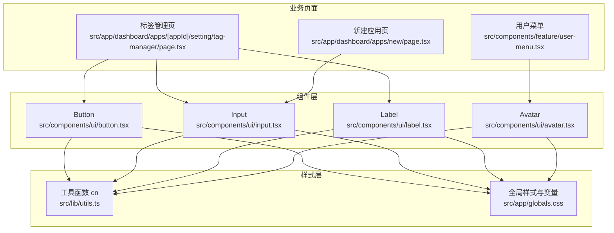
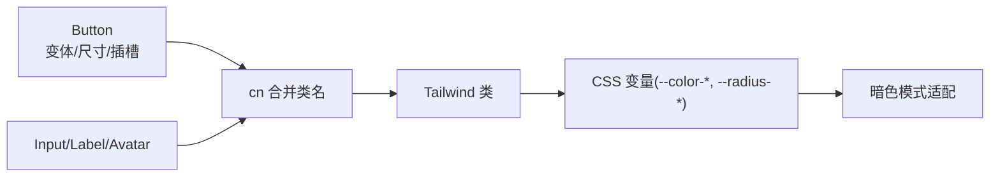
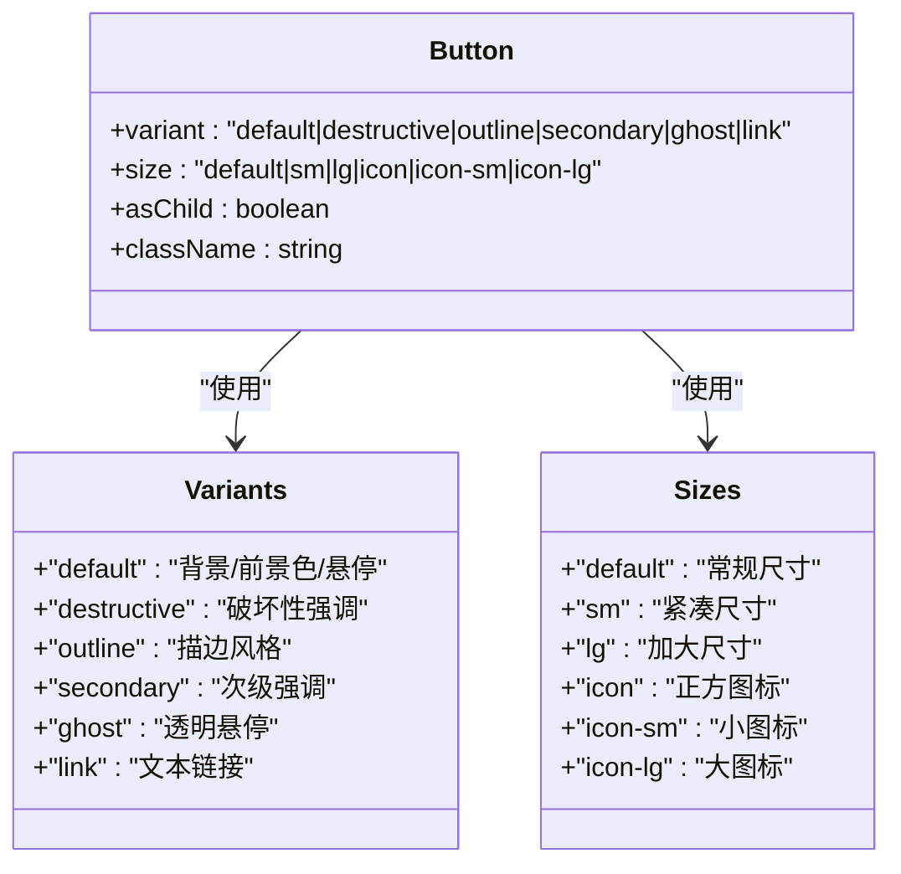
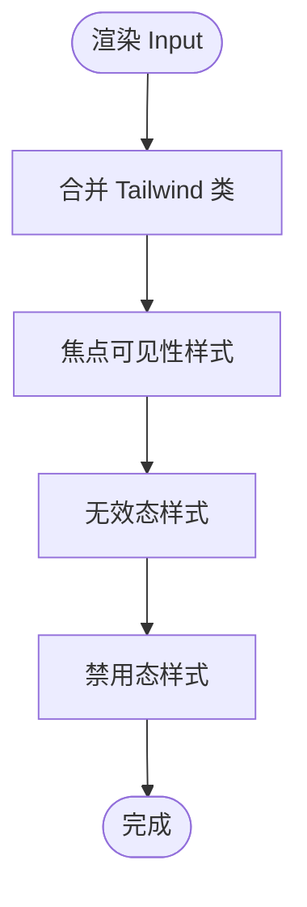
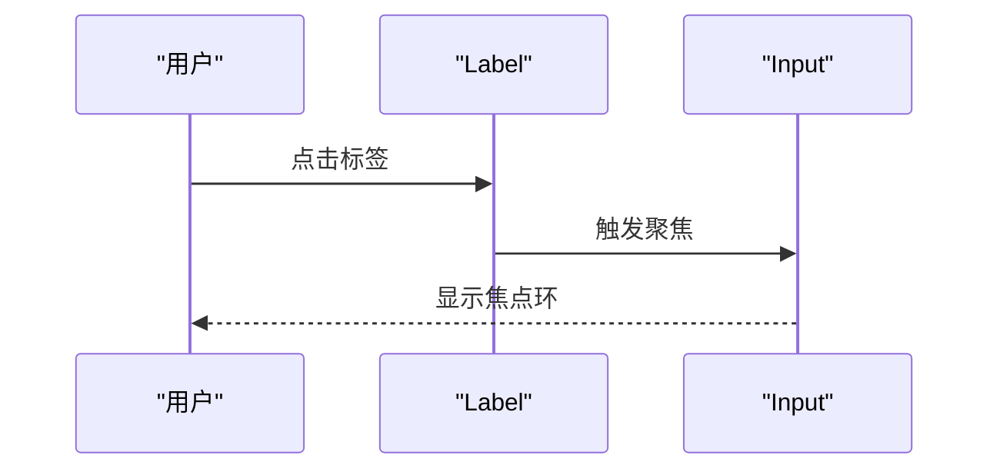
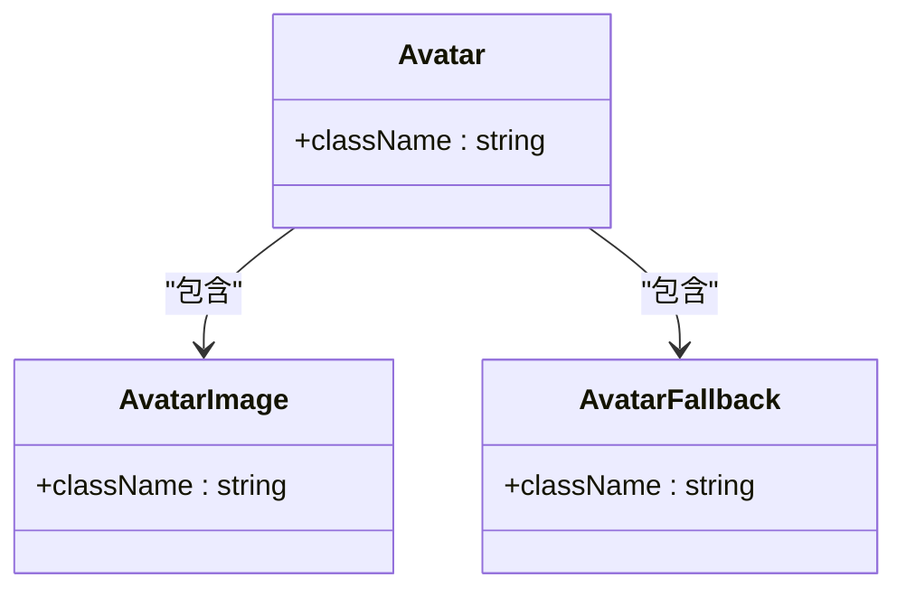
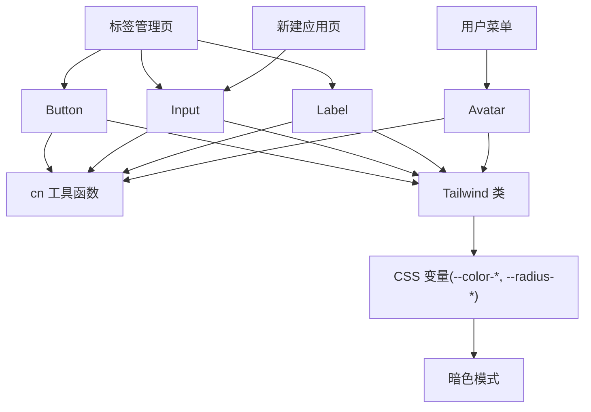

# 基础组件

<cite>
**本文引用的文件**
- [src/components/ui/button.tsx](file://src/components/ui/button.tsx)
- [src/components/ui/input.tsx](file://src/components/ui/input.tsx)
- [src/components/ui/label.tsx](file://src/components/ui/label.tsx)
- [src/components/ui/avatar.tsx](file://src/components/ui/avatar.tsx)
- [src/lib/utils.ts](file://src/lib/utils.ts)
- [src/app/globals.css](file://src/app/globals.css)
- [src/app/dashboard/apps/[appId]/setting/tag-manager/page.tsx](file://src/app/dashboard/apps/[appId]/setting/tag-manager/page.tsx)
- [src/app/dashboard/apps/new/page.tsx](file://src/app/dashboard/apps/new/page.tsx)
- [src/components/feature/user-menu.tsx](file://src/components/feature/user-menu.tsx)
</cite>

## 目录
1. [简介](#简介)
2. [项目结构](#项目结构)
3. [核心组件](#核心组件)
4. [架构总览](#架构总览)
5. [详细组件分析](#详细组件分析)
6. [依赖关系分析](#依赖关系分析)
7. [性能考量](#性能考量)
8. [故障排查指南](#故障排查指南)
9. [结论](#结论)
10. [附录](#附录)

## 简介
本文件面向 Image SaaS 项目的基础 UI 组件，聚焦按钮(Button)、输入框(Input)、标签(Label)与头像(Avatar)四大核心组件。文档从设计理念、实现细节、变体与尺寸配置、样式定制、状态与事件处理、无障碍支持到使用示例与最佳实践进行系统化梳理，并结合项目中的真实页面用例，帮助开发者快速理解与正确使用这些组件。

## 项目结构
基础组件位于 src/components/ui 下，采用“单文件一组件”的组织方式；样式系统基于 Tailwind CSS 与自定义 CSS 变量，主题通过 CSS 变量与暗色模式适配实现；工具函数 cn 负责类名合并与冲突修复。

图表来源
- [src/components/ui/button.tsx:1-63](file://src/components/ui/button.tsx#L1-L63)
- [src/components/ui/input.tsx:1-22](file://src/components/ui/input.tsx#L1-L22)
- [src/components/ui/label.tsx:1-25](file://src/components/ui/label.tsx#L1-L25)
- [src/components/ui/avatar.tsx:1-54](file://src/components/ui/avatar.tsx#L1-L54)
- [src/lib/utils.ts:1-7](file://src/lib/utils.ts#L1-L7)
- [src/app/globals.css:1-162](file://src/app/globals.css#L1-L162)
- [src/app/dashboard/apps/[appId]/setting/tag-manager/page.tsx](file://src/app/dashboard/apps/[appId]/setting/tag-manager/page.tsx#L1-L200)
- [src/app/dashboard/apps/new/page.tsx:1-38](file://src/app/dashboard/apps/new/page.tsx#L1-L38)
- [src/components/feature/user-menu.tsx:1-65](file://src/components/feature/user-menu.tsx#L1-L65)

章节来源
- [src/components/ui/button.tsx:1-63](file://src/components/ui/button.tsx#L1-L63)
- [src/components/ui/input.tsx:1-22](file://src/components/ui/input.tsx#L1-L22)
- [src/components/ui/label.tsx:1-25](file://src/components/ui/label.tsx#L1-L25)
- [src/components/ui/avatar.tsx:1-54](file://src/components/ui/avatar.tsx#L1-L54)
- [src/lib/utils.ts:1-7](file://src/lib/utils.ts#L1-L7)
- [src/app/globals.css:1-162](file://src/app/globals.css#L1-L162)
- [src/app/dashboard/apps/[appId]/setting/tag-manager/page.tsx:1-200](file://src/app/dashboard/apps/[appId]/setting/tag-manager/page.tsx#L1-L200)
- [src/app/dashboard/apps/new/page.tsx:1-38](file://src/app/dashboard/apps/new/page.tsx#L1-L38)
- [src/components/feature/user-menu.tsx:1-65](file://src/components/feature/user-menu.tsx#L1-L65)

## 核心组件
- 按钮(Button): 支持多种变体与尺寸，具备可插槽渲染能力，内置焦点可见性与无效态样式。
- 输入框(Input): 提供统一的边框、阴影、选中高亮与焦点环样式，支持禁用与无效态。
- 标签(Label): 用于关联表单控件，支持分组禁用与 peer 禁用态，便于无障碍与交互一致性。
- 头像(Avatar): 提供容器、图片与占位符三段式结构，支持图片加载失败回退。

章节来源
- [src/components/ui/button.tsx:7-37](file://src/components/ui/button.tsx#L7-L37)
- [src/components/ui/input.tsx:5-19](file://src/components/ui/input.tsx#L5-L19)
- [src/components/ui/label.tsx:8-22](file://src/components/ui/label.tsx#L8-L22)
- [src/components/ui/avatar.tsx:8-51](file://src/components/ui/avatar.tsx#L8-L51)

## 架构总览
组件通过 cn 工具函数合并类名，样式由 Tailwind 类与 CSS 变量共同驱动；暗色模式通过 CSS 变量与选择器切换实现；组件内部通过 data-* 属性暴露语义化数据槽，便于测试与调试。

图表来源
- [src/lib/utils.ts:4-6](file://src/lib/utils.ts#L4-L6)
- [src/app/globals.css:6-40](file://src/app/globals.css#L6-L40)
- [src/app/globals.css:119-127](file://src/app/globals.css#L119-L127)

## 详细组件分析

### 按钮(Button)
- 设计理念
  - 通过变体(variant)与尺寸(size)参数化外观与布局，遵循“最小必要接口”原则，保持一致的交互反馈。
  - 支持 asChild 插槽渲染，便于与路由或链接组件组合。
- 关键实现点
  - 使用 class-variance-authority 定义变体与尺寸映射，集中管理样式规则。
  - 内置焦点可见性与无效态样式，提升可访问性与一致性。
  - 通过 data-slot、data-variant、data-size 暴露语义化属性，便于测试与调试。
- 变体与尺寸
  - 变体: default、destructive、outline、secondary、ghost、link
  - 尺寸: default、sm、lg、icon、icon-sm、icon-lg
- 样式定制
  - 可通过 className 扩展或覆盖默认样式；建议优先使用变体/尺寸参数，减少自定义成本。
  - 暗色模式下无效态与焦点环颜色自动调整。
- 状态与事件
  - 支持 disabled 等原生状态；事件透传至底层元素。
- 无障碍
  - 内置 focus-visible 与 aria-invalid 样式，配合表单使用时可直接获得可访问性支持。
- 使用示例与最佳实践
  - 在标签管理页中作为对话框触发器与操作按钮使用，体现 outline 与 sm 尺寸的组合。
  - 在新建应用页中作为提交按钮使用，体现 default 变体与表单联动。
- 相关页面
  - 标签管理页: [src/app/dashboard/apps/[appId]/setting/tag-manager/page.tsx](file://src/app/dashboard/apps/[appId]/setting/tag-manager/page.tsx#L253-L275)
  - 新建应用页: [src/app/dashboard/apps/new/page.tsx:29-34](file://src/app/dashboard/apps/new/page.tsx#L29-L34)

图表来源
- [src/components/ui/button.tsx:7-37](file://src/components/ui/button.tsx#L7-L37)

章节来源
- [src/components/ui/button.tsx:7-37](file://src/components/ui/button.tsx#L7-L37)
- [src/components/ui/button.tsx:39-60](file://src/components/ui/button.tsx#L39-L60)
- [src/app/dashboard/apps/[appId]/setting/tag-manager/page.tsx:253-L275](file://src/app/dashboard/apps/[appId]/setting/tag-manager/page.tsx#L253-L275)
- [src/app/dashboard/apps/new/page.tsx:29-34](file://src/app/dashboard/apps/new/page.tsx#L29-L34)

### 输入框(Input)
- 设计理念
  - 统一的边框、阴影、选中高亮与焦点环样式，确保在不同表单场景下的一致体验。
  - 支持禁用与无效态样式，便于与表单验证集成。
- 关键实现点
  - 通过 cn 合并 Tailwind 类，包含文件上传文本、占位符、选中高亮等样式。
  - 内置 focus-visible 与 aria-invalid 样式，提升可访问性。
- 样式定制
  - 可通过 className 扩展宽度、内边距等布局属性；不建议覆盖核心视觉变量。
- 状态与事件
  - 支持 type、disabled、aria-invalid 等原生属性；事件透传。
- 无障碍
  - 内置 focus-visible 与 aria-invalid 样式，配合 Label 使用时可获得良好可访问性。
- 使用示例与最佳实践
  - 在新建应用页中作为表单输入使用，体现与表单结构的协同。
  - 在标签管理页中作为颜色选择与文本输入使用，体现多场景组合。
- 相关页面
  - 新建应用页: [src/app/dashboard/apps/new/page.tsx:29-34](file://src/app/dashboard/apps/new/page.tsx#L29-L34)
  - 标签管理页: [src/app/dashboard/apps/[appId]/setting/tag-manager/page.tsx](file://src/app/dashboard/apps/[appId]/setting/tag-manager/page.tsx#L269-L284)

图表来源
- [src/components/ui/input.tsx:5-19](file://src/components/ui/input.tsx#L5-L19)

章节来源
- [src/components/ui/input.tsx:5-19](file://src/components/ui/input.tsx#L5-L19)
- [src/app/dashboard/apps/new/page.tsx:29-34](file://src/app/dashboard/apps/new/page.tsx#L29-L34)
- [src/app/dashboard/apps/[appId]/setting/tag-manager/page.tsx:269-L284](file://src/app/dashboard/apps/[appId]/setting/tag-manager/page.tsx#L269-L284)

### 标签(Label)
- 设计理念
  - 用于与表单控件建立语义关联，支持分组禁用与 peer 禁用态，提升可访问性与交互一致性。
- 关键实现点
  - 基于 Radix UI Label Root，提供统一的字体、行高与禁用态样式。
  - 支持与表单控件组合使用，实现点击标签即聚焦控件的行为。
- 样式定制
  - 可通过 className 调整对齐、间距与文字样式。
- 状态与事件
  - 通过 group-data 与 peer 伪类实现与父容器及关联控件的状态联动。
- 无障碍
  - 与表单控件配合使用时，天然具备可访问性优势。
- 使用示例与最佳实践
  - 在标签管理页中与 Input 配合使用，形成清晰的表单标签-输入关系。
- 相关页面
  - 标签管理页: [src/app/dashboard/apps/[appId]/setting/tag-manager/page.tsx](file://src/app/dashboard/apps/[appId]/setting/tag-manager/page.tsx#L266-L275)

图表来源
- [src/components/ui/label.tsx:8-22](file://src/components/ui/label.tsx#L8-L22)
- [src/components/ui/input.tsx:5-19](file://src/components/ui/input.tsx#L5-L19)

章节来源
- [src/components/ui/label.tsx:8-22](file://src/components/ui/label.tsx#L8-L22)
- [src/app/dashboard/apps/[appId]/setting/tag-manager/page.tsx:266-L275](file://src/app/dashboard/apps/[appId]/setting/tag-manager/page.tsx#L266-L275)

### 头像(Avatar)
- 设计理念
  - 提供容器、图片与占位符三段式结构，支持图片加载失败回退，保证界面稳定性。
- 关键实现点
  - Avatar 容器负责尺寸与圆角控制；AvatarImage 负责图片填充；AvatarFallback 负责占位符展示。
  - 通过 data-slot 暴露语义化属性，便于测试与调试。
- 样式定制
  - 可通过 className 调整尺寸、圆角与背景；不建议覆盖核心布局。
- 状态与事件
  - 图片加载失败时自动回退到占位符；事件透传。
- 无障碍
  - 作为装饰性组件，建议在需要时提供合适的 alt 或替代文本（由上层决定）。
- 使用示例与最佳实践
  - 在用户菜单中作为触发器使用，体现与下拉菜单的组合。
- 相关页面
  - 用户菜单: [src/components/feature/user-menu.tsx:31-36](file://src/components/feature/user-menu.tsx#L31-L36)

图表来源
- [src/components/ui/avatar.tsx:8-51](file://src/components/ui/avatar.tsx#L8-L51)

章节来源
- [src/components/ui/avatar.tsx:8-51](file://src/components/ui/avatar.tsx#L8-L51)
- [src/components/feature/user-menu.tsx:31-36](file://src/components/feature/user-menu.tsx#L31-L36)

## 依赖关系分析
- 组件到工具函数
  - Button/Input/Label/Avatar 均依赖 cn 工具函数进行类名合并。
- 组件到样式系统
  - 组件样式依赖 Tailwind 类与 CSS 变量；暗色模式通过 CSS 变量与选择器切换实现。
- 页面到组件
  - 标签管理页与新建应用页展示了 Button、Input、Label 的典型组合；用户菜单展示了 Avatar 的典型组合。

图表来源
- [src/lib/utils.ts:4-6](file://src/lib/utils.ts#L4-L6)
- [src/app/globals.css:6-40](file://src/app/globals.css#L6-L40)
- [src/app/globals.css:119-127](file://src/app/globals.css#L119-L127)
- [src/app/dashboard/apps/[appId]/setting/tag-manager/page.tsx](file://src/app/dashboard/apps/[appId]/setting/tag-manager/page.tsx#L1-L200)
- [src/app/dashboard/apps/new/page.tsx:1-38](file://src/app/dashboard/apps/new/page.tsx#L1-L38)
- [src/components/feature/user-menu.tsx:1-65](file://src/components/feature/user-menu.tsx#L1-L65)

章节来源
- [src/lib/utils.ts:4-6](file://src/lib/utils.ts#L4-L6)
- [src/app/globals.css:6-40](file://src/app/globals.css#L6-L40)
- [src/app/globals.css:119-127](file://src/app/globals.css#L119-L127)
- [src/app/dashboard/apps/[appId]/setting/tag-manager/page.tsx:1-L200](file://src/app/dashboard/apps/[appId]/setting/tag-manager/page.tsx#L1-L200)
- [src/app/dashboard/apps/new/page.tsx:1-38](file://src/app/dashboard/apps/new/page.tsx#L1-L38)
- [src/components/feature/user-menu.tsx:1-65](file://src/components/feature/user-menu.tsx#L1-L65)

## 性能考量
- 类名合并
  - 使用 twMerge 可避免重复类名导致的样式冲突与重绘开销。
- 样式体积
  - Tailwind 类按需引入，建议在构建阶段启用摇树优化，避免未使用类进入产物。
- 暗色模式
  - CSS 变量切换比运行时替换类名更高效，注意避免在 JS 中频繁切换根节点类名。
- 渲染策略
  - Button 的 asChild 插槽渲染可减少额外 DOM 节点，降低渲染负担。

## 故障排查指南
- 焦点可见性问题
  - 若发现焦点环不可见，请检查是否正确引入全局样式与暗色模式变量。
  - 参考路径: [src/app/globals.css:119-127](file://src/app/globals.css#L119-L127)
- 无效态样式异常
  - 确认表单控件是否正确传递 aria-invalid 属性，无效态样式依赖该属性。
  - 参考路径: [src/components/ui/input.tsx:11-15](file://src/components/ui/input.tsx#L11-L15)
- 暗色模式不生效
  - 确认根节点或容器上是否存在 data-theme 或 .dark 类，以及 CSS 变量是否被覆盖。
  - 参考路径: [src/app/globals.css:42-75](file://src/app/globals.css#L42-L75)
- 组件尺寸不一致
  - 检查是否混用自定义 className 与内置尺寸；建议优先使用 size 参数。
  - 参考路径: [src/components/ui/button.tsx:23-30](file://src/components/ui/button.tsx#L23-L30)

章节来源
- [src/app/globals.css:42-75](file://src/app/globals.css#L42-L75)
- [src/app/globals.css:119-127](file://src/app/globals.css#L119-L127)
- [src/components/ui/input.tsx:11-15](file://src/components/ui/input.tsx#L11-L15)
- [src/components/ui/button.tsx:23-30](file://src/components/ui/button.tsx#L23-L30)

## 结论
Image SaaS 项目的基础组件以简洁、可组合为核心设计目标：Button 通过变体与尺寸参数化外观；Input/Label 提供一致的表单体验与可访问性；Avatar 则保证了头像场景的稳定性与一致性。结合 CSS 变量与暗色模式体系，组件在不同主题与场景下均能保持良好的视觉与交互体验。建议在实际开发中优先使用内置变体与尺寸，配合 className 进行局部定制，并与表单与路由组件进行合理组合。

## 附录
- CSS 变量系统与主题定制
  - 全局变量定义于 :root 与 [data-theme='dark']，并通过 @theme inline 导出为 --color-* 与 --radius-*。
  - 暗色模式通过 CSS 变量切换实现，无需在 JS 中频繁变更类名。
  - 参考路径: [src/app/globals.css:6-40](file://src/app/globals.css#L6-L40), [src/app/globals.css:119-117](file://src/app/globals.css#L119-L117), [src/app/globals.css:129-161](file://src/app/globals.css#L129-L161)
- 类名合并工具
  - cn 函数基于 clsx 与 tailwind-merge，确保类名合并的正确性与最小化冲突。
  - 参考路径: [src/lib/utils.ts:4-6](file://src/lib/utils.ts#L4-L6)