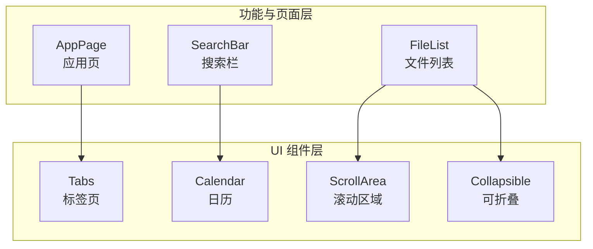
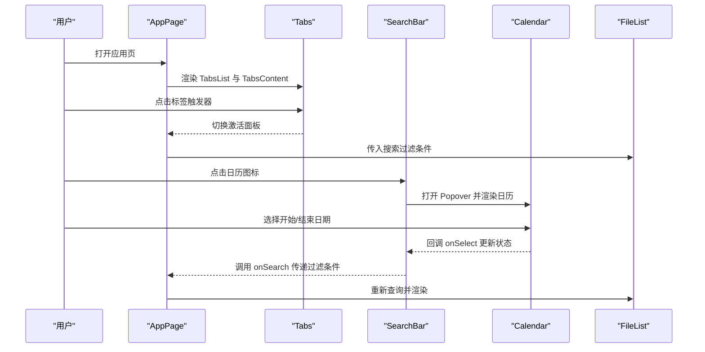
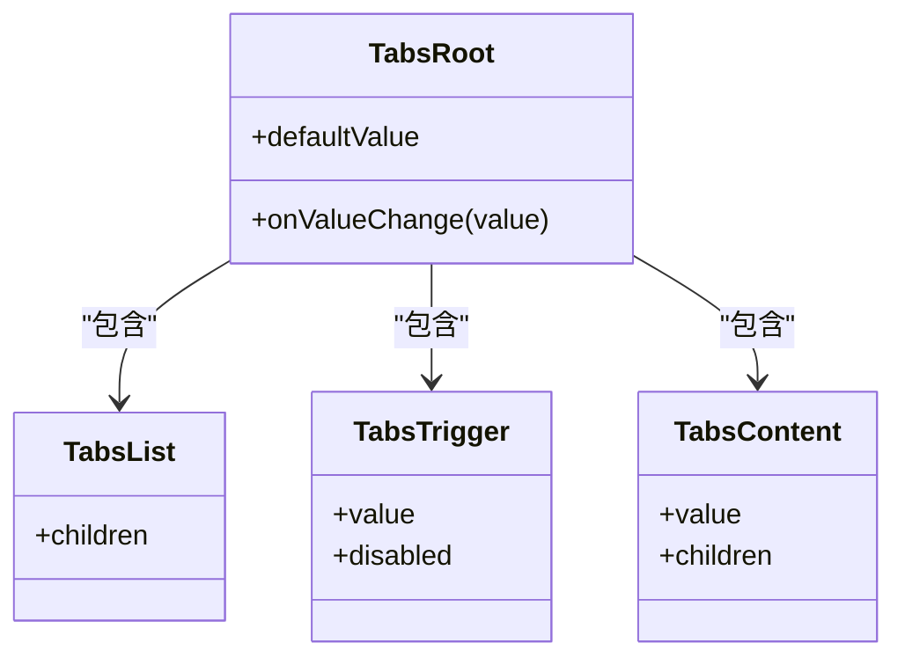
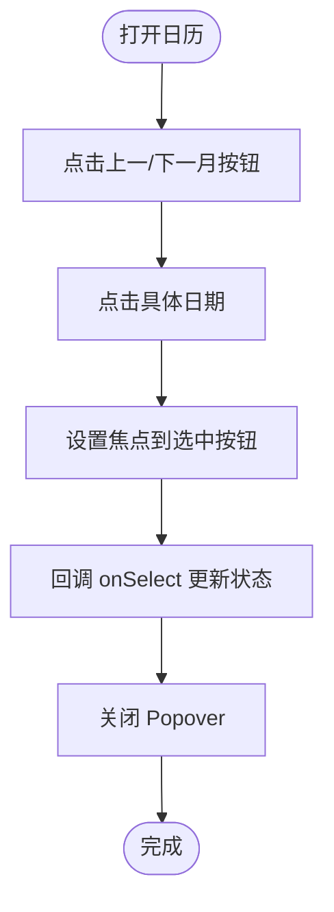
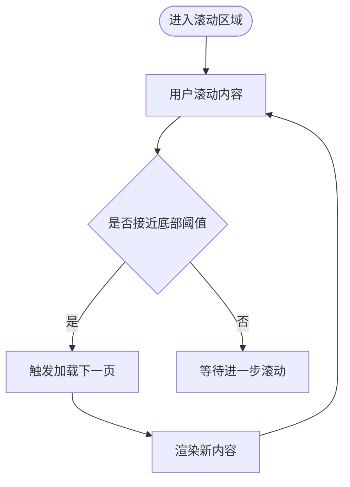
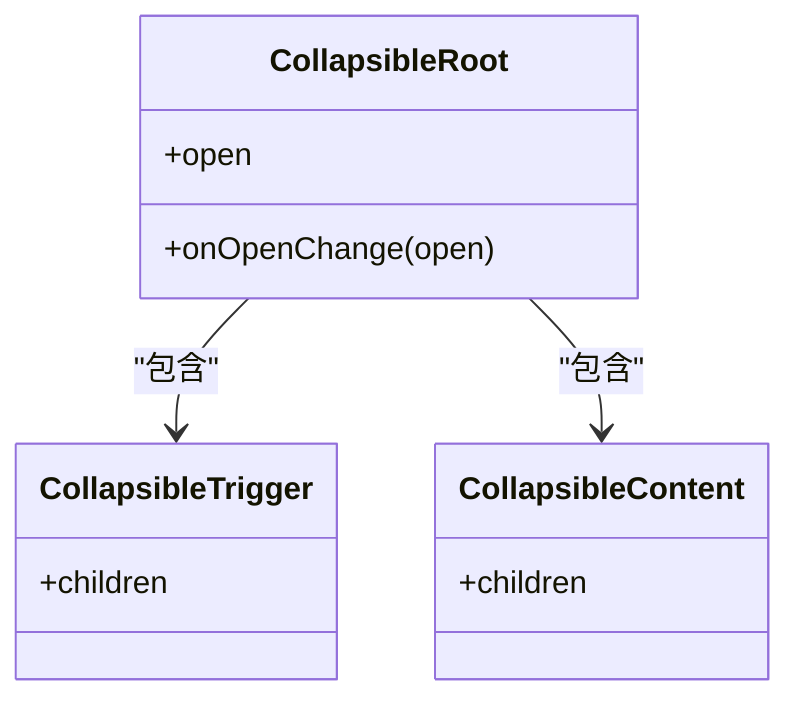
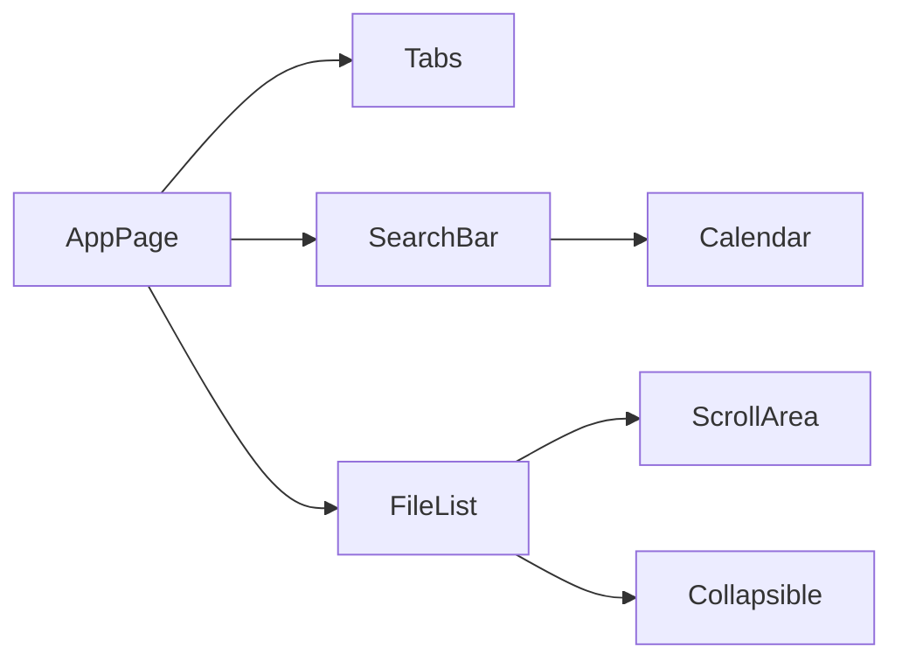

# 导航组件

<cite>
**本文引用的文件**
- [src/components/ui/tabs.tsx](file://src/components/ui/tabs.tsx)
- [src/components/ui/calendar.tsx](file://src/components/ui/calendar.tsx)
- [src/components/ui/scroll-area.tsx](file://src/components/ui/scroll-area.tsx)
- [src/components/ui/collapsible.tsx](file://src/components/ui/collapsible.tsx)
- [src/app/dashboard/apps/[appId]/page.tsx](file://src/app/dashboard/apps/[appId]/page.tsx)
- [src/components/feature/search-bar.tsx](file://src/components/feature/search-bar.tsx)
- [src/components/feature/FileList.tsx](file://src/components/feature/FileList.tsx)
- [src/components/feature/file-list.tsx](file://src/components/feature/file-list.tsx)
</cite>

## 目录

1. [简介](#简介)
2. [项目结构](#项目结构)
3. [核心组件](#核心组件)
4. [架构总览](#架构总览)
5. [详细组件分析](#详细组件分析)
6. [依赖关系分析](#依赖关系分析)
7. [性能考虑](#性能考虑)
8. [故障排查指南](#故障排查指南)
9. [结论](#结论)
10. [附录](#附录)

## 简介

本文件聚焦 Image SaaS 项目中的导航与内容展示组件，系统性梳理标签页（Tabs）、日历（Calendar）、滚动区域（ScrollArea）与可折叠（Collapsible）等组件的功能特性、状态管理、交互设计与组合使用方式。文档同时覆盖响应式布局与无障碍访问支持，并提供复杂导航场景下的最佳实践与性能优化建议。

## 项目结构

导航组件主要分布在以下位置：

- UI 组件层：标签页、日历、滚动区域、可折叠组件位于统一的 UI 组件目录中，封装了基础交互与样式。
- 页面与功能层：在仪表盘应用页中使用 Tabs 进行内容分区；在搜索栏中集成 Calendar 与 Popover 实现日期筛选；在文件列表中使用 ScrollArea 与 Collapsible 实现分组折叠与无限滚动。

图表来源

- [src/components/ui/tabs.tsx:1-67](file://src/components/ui/tabs.tsx#L1-L67)
- [src/components/ui/calendar.tsx:1-221](file://src/components/ui/calendar.tsx#L1-L221)
- [src/components/ui/scroll-area.tsx:1-59](file://src/components/ui/scroll-area.tsx#L1-L59)
- [src/components/ui/collapsible.tsx:1-34](file://src/components/ui/collapsible.tsx#L1-L34)
- [src/app/dashboard/apps/[appId]/page.tsx](file://src/app/dashboard/apps/[appId]/page.tsx#L15-L266)
- [src/components/feature/search-bar.tsx:1-199](file://src/components/feature/search-bar.tsx#L1-L199)
- [src/components/feature/FileList.tsx:1-366](file://src/components/feature/FileList.tsx#L1-L366)

章节来源

- [src/app/dashboard/apps/[appId]/page.tsx](file://src/app/dashboard/apps/[appId]/page.tsx#L15-L266)
- [src/components/feature/search-bar.tsx:1-199](file://src/components/feature/search-bar.tsx#L1-L199)
- [src/components/feature/FileList.tsx:1-366](file://src/components/feature/FileList.tsx#L1-L366)

## 核心组件

本节从功能、状态与交互三个维度，对四个组件进行深入解析。

- 标签页（Tabs）
  - 功能：提供多面板内容切换，支持动态生成标签项与内容区。
  - 状态：通过默认值与触发器的 value 值驱动激活状态；内容区根据 value 显示对应面板。
  - 交互：触发器具备焦点可见环、禁用态与激活态视觉反馈；内容区具备可聚焦的 outline。
  - 在应用页中，TabsList 动态渲染人物/地点/事件三类标签，TabsContent 分别挂载对应的列表组件。

- 日历（Calendar）
  - 功能：单选日期选择，支持月份导航、外层日期显示控制与可访问性焦点管理。
  - 状态：通过 selected/onSelect 控制当前选中日期；内部维护焦点修饰符以实现键盘可达。
  - 交互：左右箭头按钮与下拉菜单配合导航；选中态与范围选择态有明确视觉区分。
  - 在搜索栏中作为 Popover 内容使用，支持开始/结束日期分别选择。

- 滚动区域（ScrollArea）
  - 功能：提供自定义滚动条与容器视口，保证跨平台滚动一致性。
  - 行为：视口在获得焦点时显示环形轮廓；滚动条随滚动出现并保持触控友好宽度。
  - 在文件列表中用于承载大量卡片，结合 onScrollEnd 触发无限滚动加载。

- 可折叠（Collapsible）
  - 功能：实现内容分组的展开/收起，支持受控与非受控两种模式。
  - 状态：通过 open/onOpenChange 管理展开状态；触发器与内容区通过 data-slot 标识便于样式覆盖。
  - 交互：触发器通常为可点击元素，内容区动画过渡，适合大列表分组展示。

章节来源

- [src/components/ui/tabs.tsx:1-67](file://src/components/ui/tabs.tsx#L1-L67)
- [src/components/ui/calendar.tsx:1-221](file://src/components/ui/calendar.tsx#L1-L221)
- [src/components/ui/scroll-area.tsx:1-59](file://src/components/ui/scroll-area.tsx#L1-L59)
- [src/components/ui/collapsible.tsx:1-34](file://src/components/ui/collapsible.tsx#L1-L34)

## 架构总览

导航与内容展示的典型流程如下：用户在应用页通过 Tabs 切换不同类别（全部/人物/地点/事件），每个面板由独立组件渲染；搜索栏通过 Calendar 提供日期筛选能力；文件列表使用 ScrollArea 承载内容并结合 Collapsible 实现按日期分组的折叠展示。

图表来源

- [src/app/dashboard/apps/[appId]/page.tsx](file://src/app/dashboard/apps/[appId]/page.tsx#L15-L266)
- [src/components/feature/search-bar.tsx:1-199](file://src/components/feature/search-bar.tsx#L1-L199)
- [src/components/feature/FileList.tsx:1-366](file://src/components/feature/FileList.tsx#L1-L366)

## 详细组件分析

### 标签页（Tabs）分析

- 设计要点
  - 使用 Radix UI 原生 TabsPrimitive，确保可访问性与键盘操作一致性。
  - 触发器在激活态与焦点态具有明确视觉反馈，适配深浅色主题。
  - 内容区具备 outline，便于键盘导航定位。
- 数据流
  - 应用页根据标签分类动态生成 TabsTrigger 与 TabsContent，value 与标签类型绑定。
  - 每个面板挂载独立组件（如人物列表、事件列表、地点列表），减少不必要的重渲染。
- 复杂场景
  - 动态标签：根据服务端返回的标签分类与数量动态渲染触发器。
  - 多面板联动：同一页面内多个面板共享搜索过滤条件，实现“全局筛选”。

图表来源

- [src/components/ui/tabs.tsx:1-67](file://src/components/ui/tabs.tsx#L1-L67)

章节来源

- [src/components/ui/tabs.tsx:1-67](file://src/components/ui/tabs.tsx#L1-L67)
- [src/app/dashboard/apps/[appId]/page.tsx](file://src/app/dashboard/apps/[appId]/page.tsx#L155-L256)

### 日历（Calendar）分析

- 设计要点
  - 基于 react-day-picker，默认类名体系与自定义样式结合，支持多种尺寸与布局。
  - 导航按钮与下拉菜单配合，支持月份/年份快速跳转。
  - 选中态与范围选择态通过 data-\* 属性标识，便于样式覆盖。
- 可访问性
  - 焦点修饰符自动聚焦到被选中的日期按钮，提升键盘可达性。
  - 支持 RTL 布局旋转方向，保证国际化体验。
- 组合使用
  - 在搜索栏中作为 Popover 的内容，分别处理开始/结束日期选择。

图表来源

- [src/components/ui/calendar.tsx:1-221](file://src/components/ui/calendar.tsx#L1-L221)
- [src/components/feature/search-bar.tsx:108-164](file://src/components/feature/search-bar.tsx#L108-L164)

章节来源

- [src/components/ui/calendar.tsx:1-221](file://src/components/ui/calendar.tsx#L1-L221)
- [src/components/feature/search-bar.tsx:1-199](file://src/components/feature/search-bar.tsx#L1-L199)

### 滚动区域（ScrollArea）分析

- 设计要点
  - 自定义滚动条：垂直/水平滚动条宽度与边框透明度可配置，触控友好。
  - 视口焦点：获得焦点时显示环形轮廓，提升键盘可用性。
- 行为特征
  - 在文件列表中作为容器承载大量卡片，避免浏览器默认滚动条影响布局。
  - 结合 onScrollEnd 与 IntersectionObserver 实现“接近底部”触发加载更多。
- 性能注意
  - 滚动区域应限制包裹内容的最大高度，避免一次性渲染过多节点。

图表来源

- [src/components/ui/scroll-area.tsx:1-59](file://src/components/ui/scroll-area.tsx#L1-L59)
- [src/components/feature/FileList.tsx:132-150](file://src/components/feature/FileList.tsx#L132-L150)
- [src/components/feature/file-list.tsx:132-150](file://src/components/feature/file-list.tsx#L132-L150)

章节来源

- [src/components/ui/scroll-area.tsx:1-59](file://src/components/ui/scroll-area.tsx#L1-L59)
- [src/components/feature/FileList.tsx:335-362](file://src/components/feature/FileList.tsx#L335-L362)
- [src/components/feature/file-list.tsx:342-369](file://src/components/feature/file-list.tsx#L342-L369)

### 可折叠（Collapsible）分析

- 设计要点
  - 触发器与内容区通过 data-slot 标识，便于主题与样式覆盖。
  - 支持受控模式（open/onOpenChange），适合需要集中管理展开状态的场景。
- 数据流
  - 文件列表按日期分组，每组一个 Collapsible，展开状态以键值对记录。
  - 触发器显示分组标题与数量，内容区渲染该日期下的所有文件卡片。
- 交互细节
  - 触发器内置旋转动画指示展开状态；内容区提供内边距与间距，保证视觉层次。

图表来源

- [src/components/ui/collapsible.tsx:1-34](file://src/components/ui/collapsible.tsx#L1-L34)
- [src/components/feature/FileList.tsx:241-332](file://src/components/feature/FileList.tsx#L241-L332)
- [src/components/feature/file-list.tsx:241-339](file://src/components/feature/file-list.tsx#L241-L339)

章节来源

- [src/components/ui/collapsible.tsx:1-34](file://src/components/ui/collapsible.tsx#L1-L34)
- [src/components/feature/FileList.tsx:92-102](file://src/components/feature/FileList.tsx#L92-L102)
- [src/components/feature/file-list.tsx:92-102](file://src/components/feature/file-list.tsx#L92-L102)

## 依赖关系分析

- 组件间耦合
  - AppPage 依赖 Tabs 进行内容分区；SearchBar 依赖 Calendar 与 Popover 实现日期筛选；FileList 依赖 ScrollArea 与 Collapsible 实现分组与滚动。
- 外部依赖
  - Tabs 基于 Radix UI；Calendar 基于 react-day-picker；ScrollArea/Collapsible 同样基于 Radix UI。
- 潜在循环依赖
  - 当前文件未发现直接循环导入；各组件职责清晰，通过 props 传递状态与回调。

图表来源

- [src/app/dashboard/apps/[appId]/page.tsx](file://src/app/dashboard/apps/[appId]/page.tsx#L15-L266)
- [src/components/feature/search-bar.tsx:1-199](file://src/components/feature/search-bar.tsx#L1-L199)
- [src/components/feature/FileList.tsx:1-366](file://src/components/feature/FileList.tsx#L1-L366)

章节来源

- [src/app/dashboard/apps/[appId]/page.tsx](file://src/app/dashboard/apps/[appId]/page.tsx#L15-L266)
- [src/components/feature/search-bar.tsx:1-199](file://src/components/feature/search-bar.tsx#L1-L199)
- [src/components/feature/FileList.tsx:1-366](file://src/components/feature/FileList.tsx#L1-L366)

## 性能考虑

- 惰性渲染与分组
  - 使用 Collapsible 将大列表按日期分组，仅渲染当前展开组，降低首屏渲染压力。
- 无限滚动
  - ScrollArea 与 IntersectionObserver 结合，在接近底部时才加载下一页，避免一次性渲染过多节点。
- 状态最小化
  - Tabs 的激活面板通过 value 管理，避免在非激活面板上执行昂贵计算。
- 图片与预览
  - 文件列表中的图片采用懒加载与缩略图尺寸，上传中的文件以本地 URL 预览，减少网络请求。
- 主题与样式
  - 使用 data-slot 与工具函数组合样式，避免重复计算与样式抖动。

## 故障排查指南

- 日历无法聚焦
  - 检查焦点修饰符是否正确传递至按钮；确认 onSelect 回调已更新父组件状态。
- 滚动区域不触发加载
  - 确认 onScrollEnd 或 IntersectionObserver 的阈值与目标元素是否正确设置。
- 可折叠状态异常
  - 确认 open/onOpenChange 是否与分组键一致；避免在受控模式下混用默认值。
- Tabs 切换无效
  - 检查 TabsTrigger 的 value 与 TabsContent 的 value 是否匹配；确认 defaultValue 与受控值冲突。

章节来源

- [src/components/ui/calendar.tsx:190-194](file://src/components/ui/calendar.tsx#L190-L194)
- [src/components/feature/FileList.tsx:132-150](file://src/components/feature/FileList.tsx#L132-L150)
- [src/components/feature/file-list.tsx:132-150](file://src/components/feature/file-list.tsx#L132-L150)
- [src/components/ui/collapsible.tsx:1-34](file://src/components/ui/collapsible.tsx#L1-L34)
- [src/components/ui/tabs.tsx:1-67](file://src/components/ui/tabs.tsx#L1-L67)

## 结论

本项目通过标准化的 UI 组件与清晰的数据流，实现了高效的导航与内容展示。Tabs 提供灵活的内容分区，Calendar 与 Popover 协作实现日期筛选，ScrollArea 与 Collapsible 共同支撑大列表的滚动与分组展示。遵循本文的响应式与无障碍建议及性能优化策略，可在不同设备与场景下稳定运行。

## 附录

- 响应式设计建议
  - 移动端优先：Tabs 触发器在窄屏下可改为堆叠布局；日历在移动端建议使用全屏弹窗。
  - 滚动区域：在小屏设备上限制最大高度，避免遮挡操作区。
- 无障碍访问支持
  - 确保所有交互元素具备键盘可达性与焦点可见环；为日历按钮提供 ARIA 标签与描述。
  - 使用语义化标签与正确的 role，保证屏幕阅读器可读性。
