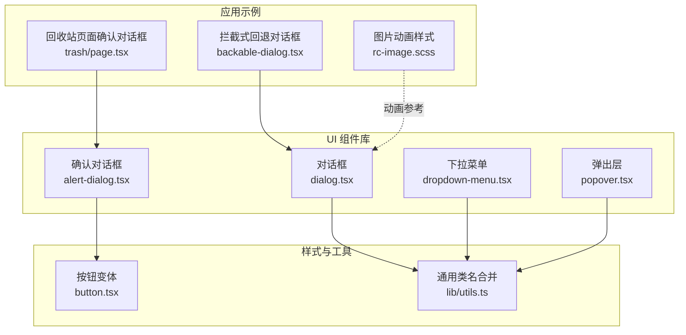
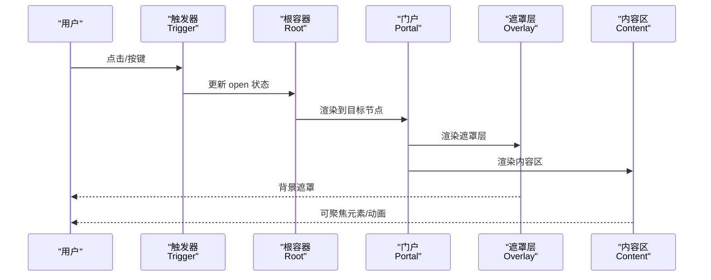
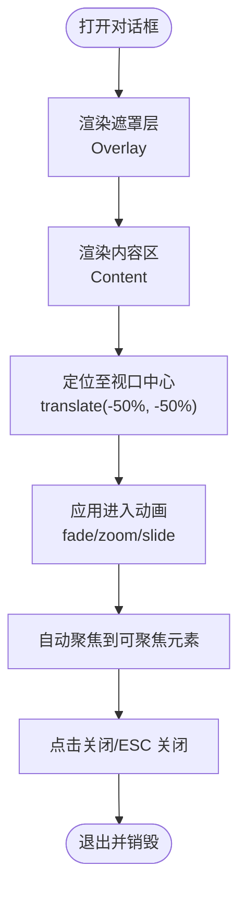
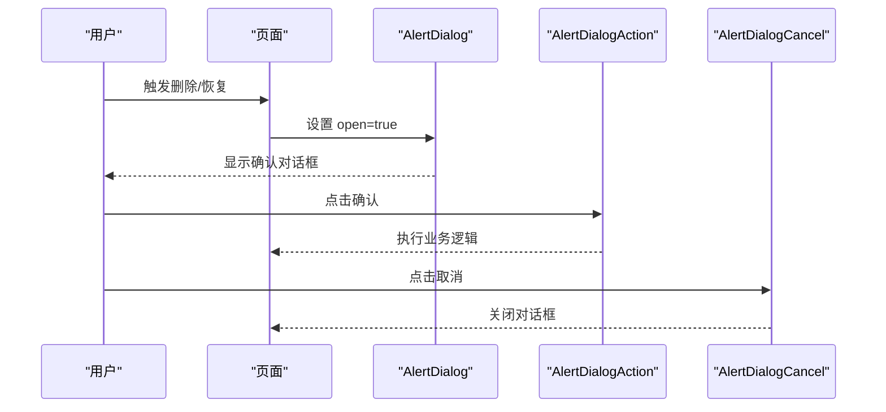
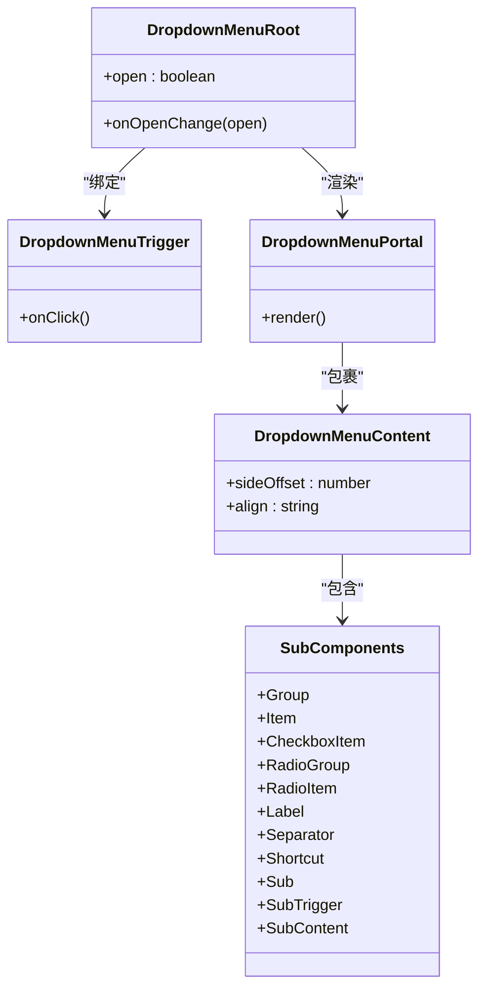
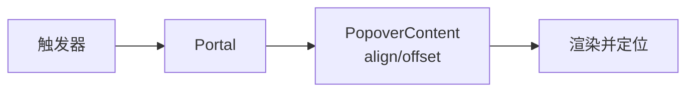
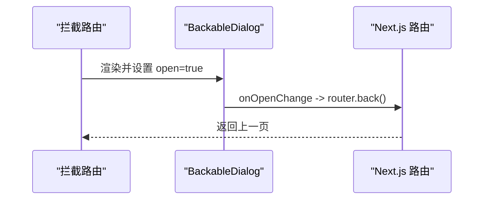
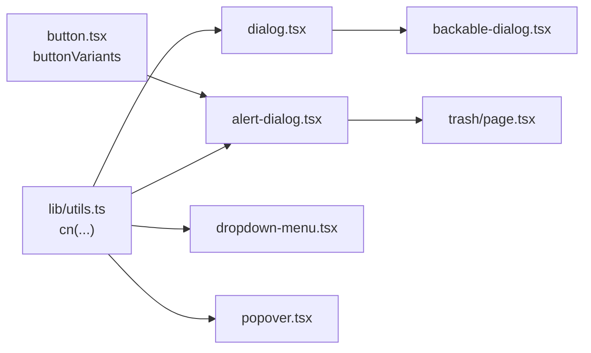

# 浮层组件

<cite>
**本文引用的文件**
- [src/components/ui/dialog.tsx](file://src/components/ui/dialog.tsx)
- [src/components/ui/alert-dialog.tsx](file://src/components/ui/alert-dialog.tsx)
- [src/components/ui/dropdown-menu.tsx](file://src/components/ui/dropdown-menu.tsx)
- [src/components/ui/popover.tsx](file://src/components/ui/popover.tsx)
- [src/components/ui/button.tsx](file://src/components/ui/button.tsx)
- [src/lib/utils.ts](file://src/lib/utils.ts)
- [src/app/dashboard/apps/@intercepting/(.)new/backable-dialog.tsx](file://src/app/dashboard/apps/@intercepting/(.)new/backable-dialog.tsx)
- [src/app/dashboard/apps/[appId]/trash/page.tsx](file://src/app/dashboard/apps/[appId]/trash/page.tsx)
- [src/app/rc-image.scss](file://src/app/rc-image.scss)
</cite>

## 目录

1. [简介](#简介)
2. [项目结构](#项目结构)
3. [核心组件](#核心组件)
4. [架构总览](#架构总览)
5. [组件详解](#组件详解)
6. [依赖关系分析](#依赖关系分析)
7. [性能与适配](#性能与适配)
8. [故障排查指南](#故障排查指南)
9. [结论](#结论)
10. [附录](#附录)

## 简介

本文件系统性梳理 Image SaaS 项目中的浮层组件：对话框（Dialog）、确认对话框（AlertDialog）、下拉菜单（DropdownMenu）与弹出层（Popover）。重点覆盖以下方面：

- 定位算法与布局策略（基于 Radix UI 的可访问性定位）
- 遮罩层处理与背景滚动控制
- 焦点管理与键盘导航支持
- 触发方式、显示/隐藏动画与可定制行为
- 在不同设备上的适配方案与性能优化策略
- 复杂交互场景下的嵌套使用示例与常见问题解决

## 项目结构

浮层组件位于统一的 UI 组件库目录，采用“按功能分层”的组织方式，每个组件独立封装，通过 Radix UI 原语实现可访问性与状态管理，并结合 Tailwind/CVA 实现样式与变体。

**图表来源**

- [src/components/ui/dialog.tsx:1-144](file://src/components/ui/dialog.tsx#L1-L144)
- [src/components/ui/alert-dialog.tsx:1-158](file://src/components/ui/alert-dialog.tsx#L1-L158)
- [src/components/ui/dropdown-menu.tsx:1-258](file://src/components/ui/dropdown-menu.tsx#L1-L258)
- [src/components/ui/popover.tsx:1-49](file://src/components/ui/popover.tsx#L1-L49)
- [src/components/ui/button.tsx:1-63](file://src/components/ui/button.tsx#L1-L63)
- [src/lib/utils.ts:1-7](file://src/lib/utils.ts#L1-L7)
- [src/app/dashboard/apps/@intercepting/(.)new/backable-dialog.tsx](<file://src/app/dashboard/apps/@intercepting/(.)new/backable-dialog.tsx#L1-L24>)
- [src/app/dashboard/apps/[appId]/trash/page.tsx](file://src/app/dashboard/apps/[appId]/trash/page.tsx#L536-L574)
- [src/app/rc-image.scss:289-387](file://src/app/rc-image.scss#L289-L387)

**章节来源**

- [src/components/ui/dialog.tsx:1-144](file://src/components/ui/dialog.tsx#L1-L144)
- [src/components/ui/alert-dialog.tsx:1-158](file://src/components/ui/alert-dialog.tsx#L1-L158)
- [src/components/ui/dropdown-menu.tsx:1-258](file://src/components/ui/dropdown-menu.tsx#L1-L258)
- [src/components/ui/popover.tsx:1-49](file://src/components/ui/popover.tsx#L1-L49)
- [src/lib/utils.ts:1-7](file://src/lib/utils.ts#L1-L7)

## 核心组件

- 对话框（Dialog）：用于承载重要信息或需要用户确认的操作，支持遮罩层、居中定位、可选关闭按钮与标题/描述/页脚容器。
- 确认对话框（AlertDialog）：强调危险或不可逆操作，内置“确认/取消”动作按钮，样式与按钮变体集成。
- 下拉菜单（DropdownMenu）：上下文菜单，支持子菜单、复选/单选项、快捷键提示与多级嵌套。
- 弹出层（Popover）：轻量信息展示或简短表单输入，支持对齐与偏移配置。

以上组件均以 Radix UI 原语为基础，确保可访问性与跨平台一致性；样式通过 cn 合并与 CVA 变体组合实现。

**章节来源**

- [src/components/ui/dialog.tsx:9-143](file://src/components/ui/dialog.tsx#L9-L143)
- [src/components/ui/alert-dialog.tsx:9-157](file://src/components/ui/alert-dialog.tsx#L9-L157)
- [src/components/ui/dropdown-menu.tsx:9-257](file://src/components/ui/dropdown-menu.tsx#L9-L257)
- [src/components/ui/popover.tsx:8-48](file://src/components/ui/popover.tsx#L8-L48)

## 架构总览

浮层组件遵循“根容器 + 触发器 + 门户 + 内容”的结构模式：

- 根容器负责状态管理与生命周期
- 触发器绑定用户交互
- 门户将内容渲染到 DOM 树的指定位置（通常为 body 子树），避免层级与定位问题
- 内容区域承载动画、定位与交互逻辑

**图表来源**

- [src/components/ui/dialog.tsx:15-81](file://src/components/ui/dialog.tsx#L15-L81)
- [src/components/ui/alert-dialog.tsx:15-64](file://src/components/ui/alert-dialog.tsx#L15-L64)
- [src/components/ui/dropdown-menu.tsx:23-52](file://src/components/ui/dropdown-menu.tsx#L23-L52)
- [src/components/ui/popover.tsx:14-40](file://src/components/ui/popover.tsx#L14-L40)

## 组件详解

### 对话框（Dialog）

- 触发与状态：通过 Trigger 控制 Root 的 open 状态；支持 onOpenChange 回调
- 定位与动画：内容固定在视口中心，使用 translate(-50%) 居中；通过 data-[state=...] 类名驱动淡入/缩放/滑入动画
- 遮罩层：Overlay 固定全屏，z-index 较高，保证层级优先
- 关闭按钮：可选，支持无障碍读屏标签
- 结构化容器：Header/Footer/Title/Description 便于布局与可访问性

**图表来源**

- [src/components/ui/dialog.tsx:33-81](file://src/components/ui/dialog.tsx#L33-L81)

**章节来源**

- [src/components/ui/dialog.tsx:9-143](file://src/components/ui/dialog.tsx#L9-L143)

### 确认对话框（AlertDialog）

- 用途：用于危险或不可逆操作的二次确认
- 行为：Action 与 Cancel 按钮通过按钮变体统一风格；支持禁用态与加载态
- 使用示例：在回收站页面中根据操作类型动态渲染标题与描述，支持批量操作提示

**图表来源**

- [src/app/dashboard/apps/[appId]/trash/page.tsx](file://src/app/dashboard/apps/[appId]/trash/page.tsx#L536-L574)
- [src/components/ui/alert-dialog.tsx:121-143](file://src/components/ui/alert-dialog.tsx#L121-L143)
- [src/components/ui/button.tsx:7-37](file://src/components/ui/button.tsx#L7-L37)

**章节来源**

- [src/components/ui/alert-dialog.tsx:9-157](file://src/components/ui/alert-dialog.tsx#L9-L157)
- [src/app/dashboard/apps/[appId]/trash/page.tsx](file://src/app/dashboard/apps/[appId]/trash/page.tsx#L536-L574)

### 下拉菜单（DropdownMenu）

- 定位算法：基于 Radix UI 的可访问性定位，支持 side/align/offset；内容区使用 CSS 变量记录可用高度与原点，避免溢出
- 动画：进入/退出时的淡入/缩放与从边侧滑入
- 交互：支持子菜单（Sub/SubTrigger/SubContent）、复选/单选项、分隔符与快捷键提示
- 可访问性：键盘导航、焦点管理、状态类名驱动动画

**图表来源**

- [src/components/ui/dropdown-menu.tsx:9-257](file://src/components/ui/dropdown-menu.tsx#L9-L257)

**章节来源**

- [src/components/ui/dropdown-menu.tsx:9-257](file://src/components/ui/dropdown-menu.tsx#L9-L257)

### 弹出层（Popover）

- 定位：与下拉菜单类似，支持 align 与 sideOffset；内容区同样具备动画与原点变量
- 场景：适合轻量信息展示或简短输入，不强制覆盖全屏
- 锚点：可选 Anchor，用于将弹出层与特定元素对齐

**图表来源**

- [src/components/ui/popover.tsx:20-40](file://src/components/ui/popover.tsx#L20-L40)

**章节来源**

- [src/components/ui/popover.tsx:8-48](file://src/components/ui/popover.tsx#L8-L48)

### 触发方式与键盘导航

- 触发器：所有浮层均通过 Trigger 绑定事件；Dialog/AlertDialog 支持外部 open/onOpenChange 控制
- 键盘导航：基于 Radix UI 的可访问性实现，支持 Tab 切换、Enter/Space 激活、Esc 关闭
- 焦点管理：打开时自动聚焦到首个可聚焦元素，关闭时返回触发元素（由 Radix UI 管理）

**章节来源**

- [src/components/ui/dialog.tsx:15-19](file://src/components/ui/dialog.tsx#L15-L19)
- [src/components/ui/alert-dialog.tsx:15-21](file://src/components/ui/alert-dialog.tsx#L15-L21)
- [src/components/ui/dropdown-menu.tsx:23-32](file://src/components/ui/dropdown-menu.tsx#L23-L32)
- [src/components/ui/popover.tsx:14-18](file://src/components/ui/popover.tsx#L14-L18)

### 显示/隐藏动画与可定制行为

- 动画：通过 data-[state=...] 类名驱动进入/退出动画（淡入/淡出、缩放、从边侧滑入）
- 可定制：Dialog 支持 showCloseButton；DropdownMenu/Popover 支持 sideOffset、align；AlertDialog 支持 Action/Cancel 样式变体
- 动画参考：项目内存在图片预览的动画样式，可作为浮层动画的参考实现思路

**章节来源**

- [src/components/ui/dialog.tsx:49-81](file://src/components/ui/dialog.tsx#L49-L81)
- [src/components/ui/alert-dialog.tsx:47-64](file://src/components/ui/alert-dialog.tsx#L47-L64)
- [src/components/ui/dropdown-menu.tsx:34-52](file://src/components/ui/dropdown-menu.tsx#L34-L52)
- [src/components/ui/popover.tsx:20-40](file://src/components/ui/popover.tsx#L20-L40)
- [src/app/rc-image.scss:289-387](file://src/app/rc-image.scss#L289-L387)

### 复杂交互场景与嵌套使用

- 拦截式回退对话框：在 Next.js 拦截路由中以 open=true 初始化，onOpenChange 中调用 router.back() 实现“点击遮罩即回退”的交互
- 回收站确认对话框：根据操作类型动态渲染标题与描述，Action/Cancel 支持禁用与加载态

**图表来源**

- [src/app/dashboard/apps/@intercepting/(.)new/backable-dialog.tsx](<file://src/app/dashboard/apps/@intercepting/(.)new/backable-dialog.tsx#L10-L24>)

**章节来源**

- [src/app/dashboard/apps/@intercepting/(.)new/backable-dialog.tsx](<file://src/app/dashboard/apps/@intercepting/(.)new/backable-dialog.tsx#L1-L24>)
- [src/app/dashboard/apps/[appId]/trash/page.tsx](file://src/app/dashboard/apps/[appId]/trash/page.tsx#L536-L574)

## 依赖关系分析

- 组件依赖：各浮层组件均依赖 Radix UI 原语与通用工具函数 cn
- 样式依赖：按钮变体与浮层组件样式解耦，通过 CVA 与 Tailwind 类名组合
- 应用示例：页面通过组件组合实现复杂交互，如确认对话框与路由回退联动

**图表来源**

- [src/lib/utils.ts:4-6](file://src/lib/utils.ts#L4-L6)
- [src/components/ui/button.tsx:7-37](file://src/components/ui/button.tsx#L7-L37)
- [src/components/ui/dialog.tsx:1-144](file://src/components/ui/dialog.tsx#L1-L144)
- [src/components/ui/alert-dialog.tsx:1-158](file://src/components/ui/alert-dialog.tsx#L1-L158)
- [src/components/ui/dropdown-menu.tsx:1-258](file://src/components/ui/dropdown-menu.tsx#L1-L258)
- [src/components/ui/popover.tsx:1-49](file://src/components/ui/popover.tsx#L1-L49)
- [src/app/dashboard/apps/@intercepting/(.)new/backable-dialog.tsx](<file://src/app/dashboard/apps/@intercepting/(.)new/backable-dialog.tsx#L1-L24>)
- [src/app/dashboard/apps/[appId]/trash/page.tsx](file://src/app/dashboard/apps/[appId]/trash/page.tsx#L536-L574)

**章节来源**

- [src/lib/utils.ts:1-7](file://src/lib/utils.ts#L1-L7)
- [src/components/ui/button.tsx:1-63](file://src/components/ui/button.tsx#L1-L63)

## 性能与适配

- 定位与溢出：下拉菜单与弹出层内容区使用 CSS 变量记录可用高度与原点，避免溢出与重排
- 动画开销：动画通过 CSS 类名切换，尽量避免 JS 计算；建议在长列表场景中延迟渲染非首屏内容
- 触发器与门户：将内容挂载到门户，减少父级样式影响与重绘范围
- 移动端适配：在小屏设备上优先使用较小的 sideOffset 与紧凑的尺寸；必要时限制最大宽度
- 可访问性：保持键盘可达与焦点顺序一致，避免阻塞背景滚动

[本节为通用指导，无需具体文件引用]

## 故障排查指南

- 打不开或无法关闭
  - 检查触发器是否正确绑定；确认 Root 的 open/onOpenChange 是否生效
  - 确认遮罩层点击回调未被覆盖
- 焦点未聚焦
  - 确保内容区内存在可聚焦元素；检查动画类名是否正确应用
- 定位异常
  - 检查 Portal 是否正确挂载；确认父级容器无 transform/overflow 影响
  - 下拉菜单/弹出层的 sideOffset/align 是否合理
- 动画不生效
  - 确认 data-[state=...] 类名是否随状态变化；检查 CSS 动画类是否存在
- 确认对话框按钮样式
  - 确认按钮变体与 Alert 的 Action/Cancel 组合使用

**章节来源**

- [src/components/ui/dialog.tsx:33-81](file://src/components/ui/dialog.tsx#L33-L81)
- [src/components/ui/alert-dialog.tsx:47-64](file://src/components/ui/alert-dialog.tsx#L47-L64)
- [src/components/ui/dropdown-menu.tsx:34-52](file://src/components/ui/dropdown-menu.tsx#L34-L52)
- [src/components/ui/popover.tsx:20-40](file://src/components/ui/popover.tsx#L20-L40)

## 结论

本项目通过 Radix UI 原语与统一的样式体系，构建了高可访问性、可定制且性能友好的浮层组件集合。Dialog/AlertDialog/DropdownMenu/Popover 在定位、动画、遮罩与焦点管理方面形成一致的设计语言，配合应用层示例实现了拦截式回退与确认流程等复杂交互。建议在实际使用中关注移动端适配与动画性能，并充分利用 Portal 与 CSS 变量提升定位稳定性。

[本节为总结，无需具体文件引用]

## 附录

- 术语
  - 门户（Portal）：将浮层内容渲染到 DOM 树特定节点，避免层级与定位问题
  - 可访问性（a11y）：键盘导航、焦点管理、屏幕阅读器支持
- 参考实现
  - 图片动画样式可作为浮层动画的参考实现思路

**章节来源**

- [src/app/rc-image.scss:289-387](file://src/app/rc-image.scss#L289-L387)
