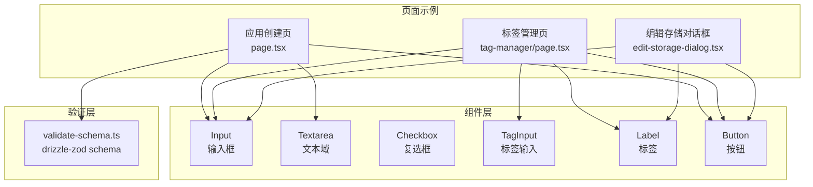
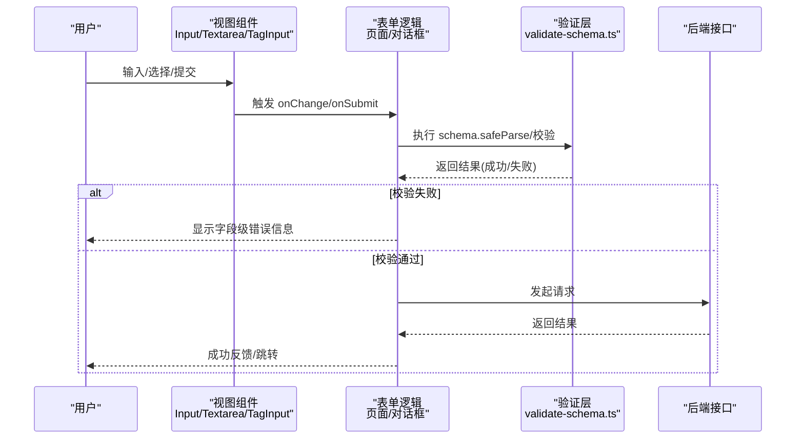
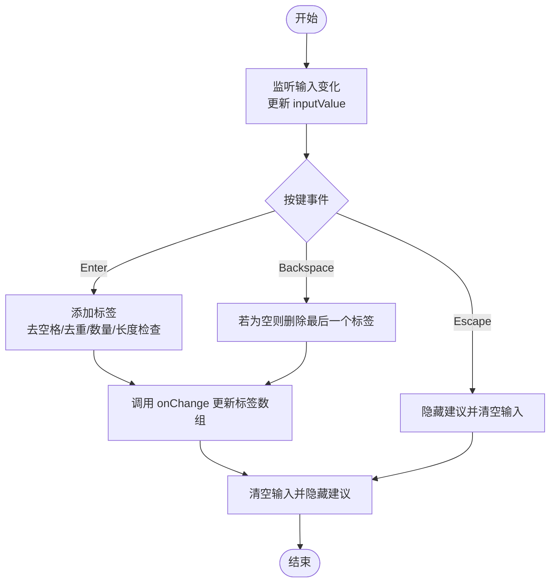
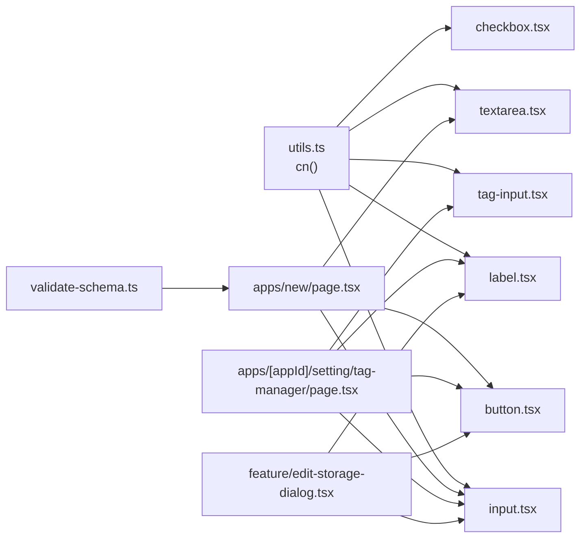
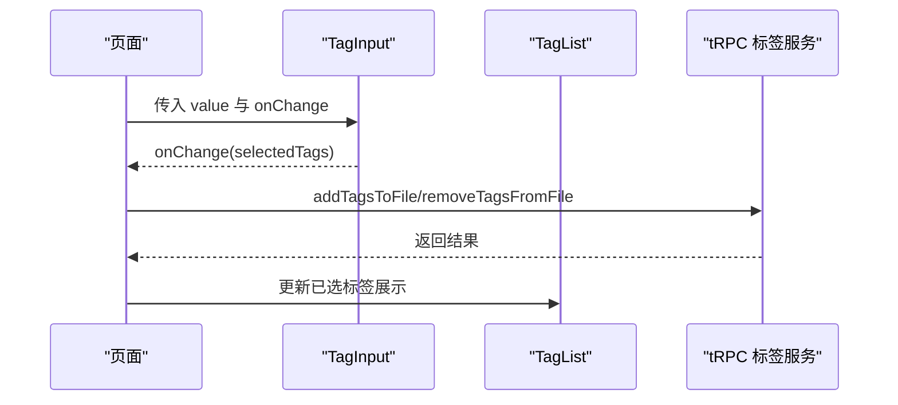

# 表单组件

<cite>
**本文引用的文件**
- [src/components/ui/input.tsx](file://src/components/ui/input.tsx)
- [src/components/ui/textarea.tsx](file://src/components/ui/textarea.tsx)
- [src/components/ui/checkbox.tsx](file://src/components/ui/checkbox.tsx)
- [src/components/ui/tag-input.tsx](file://src/components/ui/tag-input.tsx)
- [src/components/ui/label.tsx](file://src/components/ui/label.tsx)
- [src/app/dashboard/apps/new/page.tsx](file://src/app/dashboard/apps/new/page.tsx)
- [src/app/dashboard/apps/[appId]/setting/tag-manager/page.tsx](file://src/app/dashboard/apps/[appId]/setting/tag-manager/page.tsx)
- [src/components/feature/edit-storage-dialog.tsx](file://src/components/feature/edit-storage-dialog.tsx)
- [src/server/db/validate-schema.ts](file://src/server/db/validate-schema.ts)
- [src/lib/utils.ts](file://src/lib/utils.ts)
- [src/components/ui/button.tsx](file://src/components/ui/button.tsx)
</cite>

## 目录

1. [简介](#简介)
2. [项目结构](#项目结构)
3. [核心组件](#核心组件)
4. [架构总览](#架构总览)
5. [详细组件分析](#详细组件分析)
6. [依赖关系分析](#依赖关系分析)
7. [性能考量](#性能考量)
8. [故障排查指南](#故障排查指南)
9. [结论](#结论)
10. [附录](#附录)

## 简介

本文件面向 Image SaaS 项目中的表单组件，系统性梳理输入框(Input)、文本域(Textarea)、复选框(Checkbox)与标签输入(TagInput)等 UI 组件的功能特性、数据绑定机制、验证规则与错误处理策略，并结合实际页面示例说明受控/非受控模式、事件回调与状态同步方式。同时提供表单布局设计模式与用户体验优化建议，并给出复杂表单场景下的组件组合使用范式与调试技巧。

## 项目结构

- 表单基础 UI 组件位于 src/components/ui 下，包含 Input、Textarea、Checkbox、TagInput、Label 等。
- 页面级表单示例：
  - 应用创建页：展示服务端校验与客户端提交流程。
  - 标签管理页：展示 TagInput 与多标签交互、建议补全、增删改查联动。
  - 存储配置编辑对话框：展示基于 react-hook-form 的受控表单与字段级错误提示。
- 验证层位于 src/server/db/validate-schema.ts，定义了 drizzle-zod schema 与自定义约束（如最小长度）。
- 工具函数 cn 用于合并 Tailwind 类名，统一组件样式拼接。

**图表来源**

- [src/components/ui/input.tsx](file://src/components/ui/input.tsx)
- [src/components/ui/textarea.tsx](file://src/components/ui/textarea.tsx)
- [src/components/ui/checkbox.tsx](file://src/components/ui/checkbox.tsx)
- [src/components/ui/tag-input.tsx](file://src/components/ui/tag-input.tsx)
- [src/components/ui/label.tsx](file://src/components/ui/label.tsx)
- [src/components/ui/button.tsx](file://src/components/ui/button.tsx)
- [src/app/dashboard/apps/new/page.tsx](file://src/app/dashboard/apps/new/page.tsx)
- [src/app/dashboard/apps/[appId]/setting/tag-manager/page.tsx](file://src/app/dashboard/apps/[appId]/setting/tag-manager/page.tsx)
- [src/components/feature/edit-storage-dialog.tsx](file://src/components/feature/edit-storage-dialog.tsx)
- [src/server/db/validate-schema.ts](file://src/server/db/validate-schema.ts)

**章节来源**

- [src/lib/utils.ts](file://src/lib/utils.ts)

## 核心组件

- 输入框(Input)：支持原生 input 属性透传，内置聚焦、禁用、无效态样式；通过 aria-invalid 与 ring 辅助反馈。
- 文本域(Textarea)：支持多行文本输入，具备聚焦、禁用、无效态样式；通过 data-slot 标识便于主题与测试定位。
- 复选框(Checkbox)：基于 Radix UI 原子组件，支持受控 checked 与 indeterminate 状态，提供视觉指示器。
- 标签输入(TagInput)：受控数组型标签输入，支持回车添加、退格删除最后标签、点击建议项、点击外部关闭建议、最大数量限制、长度限制与实时建议过滤。
- 标签(Label)：基于 Radix UI Label，提供与表单控件的语义关联与禁用态样式。

**章节来源**

- [src/components/ui/input.tsx](file://src/components/ui/input.tsx)
- [src/components/ui/textarea.tsx](file://src/components/ui/textarea.tsx)
- [src/components/ui/checkbox.tsx](file://src/components/ui/checkbox.tsx)
- [src/components/ui/tag-input.tsx](file://src/components/ui/tag-input.tsx)
- [src/components/ui/label.tsx](file://src/components/ui/label.tsx)

## 架构总览

下图展示了页面如何组合基础表单组件与验证层，形成“视图-状态-校验-提交”的闭环：

**图表来源**

- [src/app/dashboard/apps/new/page.tsx](file://src/app/dashboard/apps/new/page.tsx)
- [src/app/dashboard/apps/[appId]/setting/tag-manager/page.tsx](file://src/app/dashboard/apps/[appId]/setting/tag-manager/page.tsx)
- [src/components/feature/edit-storage-dialog.tsx](file://src/components/feature/edit-storage-dialog.tsx)
- [src/server/db/validate-schema.ts](file://src/server/db/validate-schema.ts)

## 详细组件分析

### 输入框 Input

- 功能特性
  - 支持 type、className 等原生属性透传。
  - 内置聚焦、禁用、无效态样式，通过 aria-invalid 与 ring 反馈错误状态。
  - 使用 data-slot="input" 便于主题覆盖与自动化测试定位。
- 数据绑定与事件
  - 作为受控组件，通常由父组件传入 value 与 onChange。
  - 建议配合 form 元素或 react-hook-form 使用，实现统一校验与错误提示。
- 使用场景
  - 应用名称、描述、颜色选择、存储配置项等。
- 最佳实践
  - 对必填字段设置 required 或 minLength 等 HTML5 属性。
  - 结合 Label 提升可访问性。

**章节来源**

- [src/components/ui/input.tsx](file://src/components/ui/input.tsx)
- [src/app/dashboard/apps/new/page.tsx](file://src/app/dashboard/apps/new/page.tsx)
- [src/components/feature/edit-storage-dialog.tsx](file://src/components/feature/edit-storage-dialog.tsx)

### 文本域 Textarea

- 功能特性
  - 支持多行文本输入，具备聚焦、禁用、无效态样式。
  - 通过 data-slot="textarea" 标识，便于主题与测试。
- 数据绑定与事件
  - 受控模式下由父组件维护 value 与 onChange。
  - 适合长文本输入，如描述、备注等。
- 使用场景
  - 应用描述、存储配置说明等。
- 最佳实践
  - 合理设置最小高度与最大高度，避免影响布局。
  - 与 Label 搭配提升可访问性。

**章节来源**

- [src/components/ui/textarea.tsx](file://src/components/ui/textarea.tsx)
- [src/app/dashboard/apps/new/page.tsx](file://src/app/dashboard/apps/new/page.tsx)

### 复选框 Checkbox

- 功能特性
  - 基于 Radix UI，支持 checked、indeterminate 状态。
  - 提供视觉指示器，支持聚焦与禁用态样式。
  - 使用 data-slot="checkbox" 与 data-slot="checkbox-indicator"。
- 数据绑定与事件
  - 受控模式下由父组件传入 checked 与 onCheckedChange。
  - 常用于“同意条款”、“批量选择”等场景。
- 使用场景
  - 用户协议勾选、批量操作确认等。
- 最佳实践
  - 与 Label 关联，确保可访问性。
  - 注意 indeterminate 场景下的状态同步。

**章节来源**

- [src/components/ui/checkbox.tsx](file://src/components/ui/checkbox.tsx)

### 标签输入 TagInput

- 功能特性
  - 受控数组型标签输入，支持回车添加、退格删除最后标签、点击建议项、点击外部关闭建议。
  - 支持最大标签数与单标签长度限制。
  - 实时过滤建议列表，避免重复标签。
- 数据绑定与事件
  - value: string[]；onChange: (tags: string[]) => void。
  - 内部维护 inputValue、showSuggestions、filteredSuggestions 等状态。
- 使用场景
  - 文件打标签、关键词输入、权限角色选择等。
- 最佳实践
  - 建议传入 suggestions 以提升输入效率。
  - 控制 maxTags 与单标签长度，避免过度拥挤。
  - 与 TagList/Tag 组件配合展示已选标签。

**图表来源**

- [src/components/ui/tag-input.tsx](file://src/components/ui/tag-input.tsx)

**章节来源**

- [src/components/ui/tag-input.tsx](file://src/components/ui/tag-input.tsx)
- [src/app/dashboard/apps/[appId]/setting/tag-manager/page.tsx](file://src/app/dashboard/apps/[appId]/setting/tag-manager/page.tsx)

### 标签 Label

- 功能特性
  - 基于 Radix UI Label，提供与表单控件的语义关联。
  - 支持禁用态样式与分组禁用态。
- 使用场景
  - 与 Input、Textarea、Checkbox、TagInput 等配套使用。
- 最佳实践
  - 为每个输入控件提供明确的 Label，提升可访问性。

**章节来源**

- [src/components/ui/label.tsx](file://src/components/ui/label.tsx)

## 依赖关系分析

- 组件样式工具
  - cn 函数用于合并类名，保证 Tailwind 样式正确叠加与覆盖。
- 页面与组件的关系
  - 应用创建页：使用 Input、Textarea、Button，结合 validate-schema 进行服务端校验。
  - 标签管理页：使用 TagInput、Input、Label、Button，结合 tRPC 完成标签增删改查。
  - 编辑存储对话框：使用 react-hook-form 管理受控表单，Input、Label、Button 提供输入与提交能力。
- 验证层
  - validate-schema.ts 定义 schema 并可扩展自定义约束（如最小长度），页面侧进行 safeParse 校验。

**图表来源**

- [src/lib/utils.ts](file://src/lib/utils.ts)
- [src/components/ui/input.tsx](file://src/components/ui/input.tsx)
- [src/components/ui/textarea.tsx](file://src/components/ui/textarea.tsx)
- [src/components/ui/checkbox.tsx](file://src/components/ui/checkbox.tsx)
- [src/components/ui/tag-input.tsx](file://src/components/ui/tag-input.tsx)
- [src/components/ui/label.tsx](file://src/components/ui/label.tsx)
- [src/components/ui/button.tsx](file://src/components/ui/button.tsx)
- [src/app/dashboard/apps/new/page.tsx](file://src/app/dashboard/apps/new/page.tsx)
- [src/app/dashboard/apps/[appId]/setting/tag-manager/page.tsx](file://src/app/dashboard/apps/[appId]/setting/tag-manager/page.tsx)
- [src/components/feature/edit-storage-dialog.tsx](file://src/components/feature/edit-storage-dialog.tsx)
- [src/server/db/validate-schema.ts](file://src/server/db/validate-schema.ts)

**章节来源**

- [src/lib/utils.ts](file://src/lib/utils.ts)
- [src/server/db/validate-schema.ts](file://src/server/db/validate-schema.ts)

## 性能考量

- TagInput 建议
  - 建议对 suggestions 做防抖或节流，避免高频输入导致的过滤开销。
  - 控制 maxTags 与单标签长度，减少 DOM 节点数量与渲染压力。
  - 使用虚拟滚动展示大量建议项（如后续扩展）。
- 表单提交
  - 使用 react-hook-form 的字段级校验与懒校验，减少不必要的 re-render。
  - 在服务端校验失败时尽早返回，避免冗余网络请求。
- 样式合并
  - 使用 cn 合并类名，避免重复样式覆盖导致的重绘。

[本节为通用指导，无需特定文件引用]

## 故障排查指南

- 校验失败
  - 服务端校验：在应用创建页中，若 schema.safeParse 失败会抛出错误，需在页面侧捕获并展示。
  - 字段级错误：在编辑存储对话框中，通过 react-hook-form 的 errors 显示具体字段错误信息。
- 状态不同步
  - TagInput 为受控组件，必须确保父组件传入的 value 与 onChange 正确同步，避免显示与真实值不一致。
  - Checkbox 与 Input/Textarea 同样需要受控模式，避免半受控状态。
- 交互异常
  - TagInput 建议列表未关闭：检查点击外部关闭逻辑与容器 ref 是否正确。
  - 回车/退格行为异常：确认键盘事件处理顺序与 preventDefault 使用是否合理。
- 可访问性
  - 确保每个输入控件都有对应的 Label 关联，避免仅靠占位符提示。

**章节来源**

- [src/app/dashboard/apps/new/page.tsx](file://src/app/dashboard/apps/new/page.tsx)
- [src/components/feature/edit-storage-dialog.tsx](file://src/components/feature/edit-storage-dialog.tsx)
- [src/components/ui/tag-input.tsx](file://src/components/ui/tag-input.tsx)

## 结论

本项目表单组件以基础 UI 组件为核心，结合页面级表单示例与验证层，形成了清晰的“视图-状态-校验-提交”闭环。Input、Textarea、Checkbox、TagInput、Label 等组件在多个页面中被灵活组合，满足从简单输入到复杂标签管理的多种场景。通过受控模式、事件回调与状态同步，以及合理的错误处理与可访问性设计，能够有效提升用户体验与开发效率。

[本节为总结性内容，无需特定文件引用]

## 附录

### 复杂表单场景示例与组合建议

- 应用创建表单
  - 组合：Input(名称)、Textarea(描述)、Button(提交)。
  - 验证：validate-schema.ts 中的 createAppSchema，服务端 safeParse。
  - 错误处理：页面捕获错误并提示。
- 标签管理表单
  - 组合：Label、TagInput、TagList、Button。
  - 数据流：父组件维护 selectedTags，TagInput onChange 同步更新；tRPC 调用完成增删改查。
- 存储配置编辑对话框
  - 组合：Label、Input(名称/Bucket/Region/Access Key/Secret Key/API Endpoint)、Button。
  - 验证：react-hook-form 字段级校验，errors 显示错误信息。
  - 状态：打开时重置表单至当前值，成功后关闭并刷新列表。

**图表来源**

- [src/app/dashboard/apps/[appId]/setting/tag-manager/page.tsx](file://src/app/dashboard/apps/[appId]/setting/tag-manager/page.tsx)
- [src/components/ui/tag-input.tsx](file://src/components/ui/tag-input.tsx)
