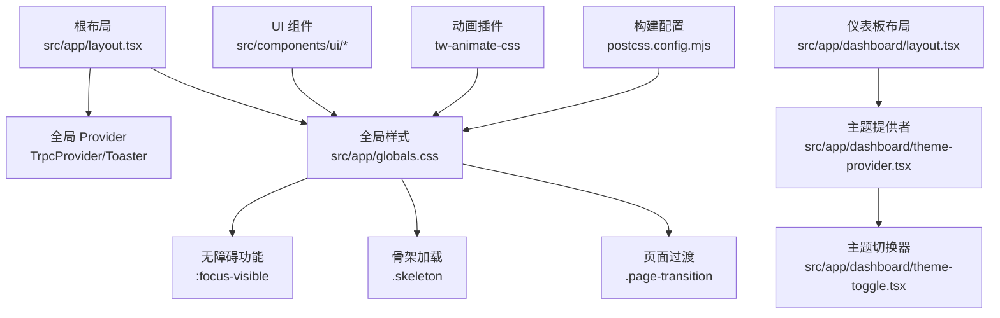
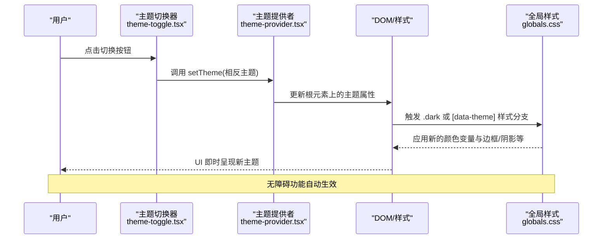
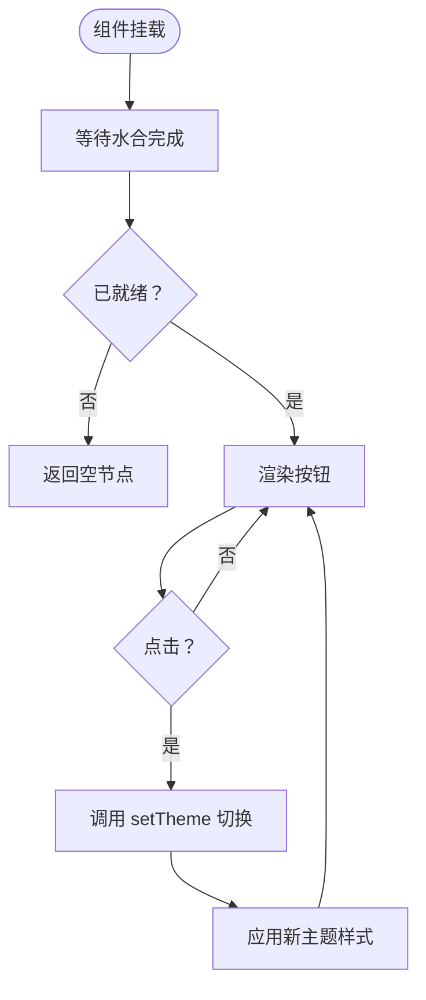
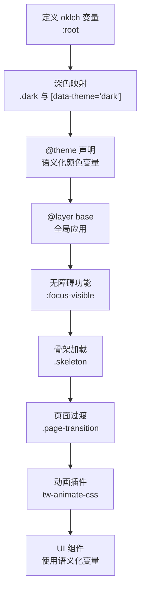
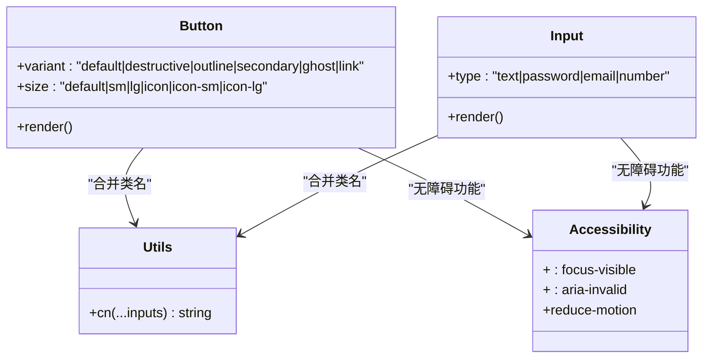
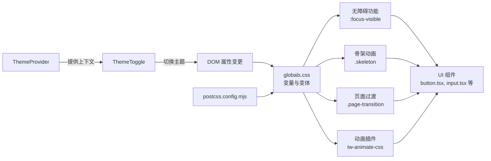

# 主题系统

<cite>
**本文引用的文件**
- [theme-provider.tsx](file://src/app/dashboard/theme-provider.tsx)
- [theme-toggle.tsx](file://src/app/dashboard/theme-toggle.tsx)
- [layout.tsx（仪表板）](file://src/app/dashboard/layout.tsx)
- [layout.tsx（根）](file://src/app/layout.tsx)
- [globals.css](file://src/app/globals.css)
- [package.json](file://package.json)
- [components.json](file://components.json)
- [button.tsx](file://src/components/ui/button.tsx)
- [input.tsx](file://src/components/ui/input.tsx)
- [utils.ts](file://src/lib/utils.ts)
- [postcss.config.mjs](file://postcss.config.mjs)
- [rc-image.scss](file://src/app/rc-image.scss)
</cite>

## 更新摘要
**变更内容**
- 新增无障碍功能支持，包括键盘焦点可见环
- 添加骨架加载动画系统，提升加载体验
- 实现平滑页面过渡动画，改善页面切换流畅度
- 支持减少运动偏好设置，提供更包容的用户体验
- 集成Tw-animate-css动画插件，增强动画效果

## 目录
1. [简介](#简介)
2. [项目结构](#项目结构)
3. [核心组件](#核心组件)
4. [架构总览](#架构总览)
5. [详细组件分析](#详细组件分析)
6. [无障碍功能增强](#无障碍功能增强)
7. [骨架加载动画系统](#骨架加载动画系统)
8. [平滑页面过渡动画](#平滑页面过渡动画)
9. [减少运动支持](#减少运动支持)
10. [动画系统集成](#动画系统集成)
11. [依赖关系分析](#依赖关系分析)
12. [性能考虑](#性能考虑)
13. [故障排查指南](#故障排查指南)
14. [结论](#结论)
15. [附录](#附录)

## 简介
本文件为 Image SaaS 项目的主题系统提供完整文档，涵盖深色/浅色主题切换机制、主题提供者架构、状态管理与持久化策略、主题变量与颜色系统、样式覆盖规则、用户体验设计与性能优化、自定义主题开发指南与最佳实践，以及样式组织结构与组件主题集成模式。本次更新特别强化了无障碍功能支持、骨架加载动画、平滑页面过渡动画和减少运动偏好等现代Web标准特性。

## 项目结构
主题系统由以下层次组成：
- 根布局：负责注入全局样式与字体变量，并挂载应用 Provider。
- 仪表板布局：在页面导航区域集成主题切换按钮，并包裹主题提供者。
- 主题提供者：基于第三方库封装，统一管理主题状态与持久化。
- 主题切换器：读取当前主题并触发切换，支持 SSR 安全与水合保护。
- 全局样式：通过 CSS 变量与 Tailwind v4 的 @theme 声明构建颜色系统，并提供深色变体。
- 无障碍增强：键盘焦点可见环、减少运动支持等无障碍功能。
- 骨架加载：骨架动画系统，提供更好的加载体验。
- 平滑过渡：页面切换动画，提升用户体验。
- UI 组件：基于颜色变量与变体类名进行主题感知渲染。
- 动画系统：Tw-animate-css 插件支持，增强动画效果。
- 构建配置：PostCSS 与 Tailwind v4 插件启用，确保变量与变体生效。

**图表来源**
- [layout.tsx（根）:21-36](file://src/app/layout.tsx#L21-L36)
- [layout.tsx（仪表板）:23-47](file://src/app/dashboard/layout.tsx#L23-L47)
- [theme-provider.tsx:1-9](file://src/app/dashboard/theme-provider.tsx#L1-L9)
- [theme-toggle.tsx:1-33](file://src/app/dashboard/theme-toggle.tsx#L1-L33)
- [globals.css:1-222](file://src/app/globals.css#L1-L222)
- [postcss.config.mjs:1-6](file://postcss.config.mjs#L1-L6)

**章节来源**
- [layout.tsx（根）:1-37](file://src/app/layout.tsx#L1-L37)
- [layout.tsx（仪表板）:1-49](file://src/app/dashboard/layout.tsx#L1-L49)
- [theme-provider.tsx:1-9](file://src/app/dashboard/theme-provider.tsx#L1-L9)
- [theme-toggle.tsx:1-33](file://src/app/dashboard/theme-toggle.tsx#L1-L33)
- [globals.css:1-222](file://src/app/globals.css#L1-L222)
- [postcss.config.mjs:1-6](file://postcss.config.mjs#L1-L6)

## 核心组件
- 主题提供者：封装第三方库，暴露统一的 Provider 接口，便于后续扩展。
- 主题切换器：读取当前主题，根据 isDark 切换到另一主题；使用水合钩子避免 SSR 闪烁。
- 全局样式：定义 CSS 变量与 @theme 声明，提供深色与浅色两套颜色映射，并通过 .dark 类与 [data-theme] 属性协同工作。
- 无障碍增强：`:focus-visible` 伪类选择器为键盘导航用户提供可见的焦点环。
- 骨架加载：`.skeleton` 类提供平滑的加载动画效果。
- 页面过渡：`.page-transition` 类实现页面切换的淡入动画。
- UI 组件：使用颜色变量与变体类名，自动适配当前主题。
- 动画系统：Tw-animate-css 插件提供丰富的动画效果支持。
- 构建配置：启用 Tailwind v4 与 PostCSS 插件，确保变量与变体在产物中生效。

**章节来源**
- [theme-provider.tsx:1-9](file://src/app/dashboard/theme-provider.tsx#L1-L9)
- [theme-toggle.tsx:1-33](file://src/app/dashboard/theme-toggle.tsx#L1-L33)
- [globals.css:4-222](file://src/app/globals.css#L4-L222)
- [button.tsx:7-37](file://src/components/ui/button.tsx#L7-L37)
- [input.tsx:1-22](file://src/components/ui/input.tsx#L1-L22)
- [postcss.config.mjs:1-6](file://postcss.config.mjs#L1-L6)

## 架构总览
主题系统采用"Provider + Hook + CSS 变量 + 无障碍增强"的分层架构：
- Provider 负责状态与持久化（由第三方库处理）。
- Hook 读取/写入主题状态，驱动 UI 切换。
- CSS 变量与 @theme 提供跨组件的颜色与半径等主题变量，Tailwind v4 变体确保选择器按主题生效。
- 无障碍功能通过 `:focus-visible` 和媒体查询提供包容性体验。
- 骨架加载和页面过渡动画提升用户体验。
- UI 组件通过变体类名与颜色变量实现主题感知。

**图表来源**
- [theme-toggle.tsx:8-32](file://src/app/dashboard/theme-toggle.tsx#L8-L32)
- [theme-provider.tsx:1-9](file://src/app/dashboard/theme-provider.tsx#L1-L9)
- [globals.css:4-222](file://src/app/globals.css#L4-L222)

## 详细组件分析

### 主题提供者（ThemeProvider）
- 设计要点
  - 作为轻量封装，直接透传第三方 Provider 的参数，便于未来替换或增强。
  - 在仪表板布局中被引入，确保导航区域具备主题切换能力。
- 状态与持久化
  - 由第三方库负责主题状态与持久化（如本地存储），此处不做额外状态逻辑。
- 扩展建议
  - 如需服务端默认主题或用户偏好同步，可在 Provider 外层增加初始化逻辑。

**章节来源**
- [theme-provider.tsx:1-9](file://src/app/dashboard/theme-provider.tsx#L1-L9)
- [layout.tsx（仪表板）:23-47](file://src/app/dashboard/layout.tsx#L23-L47)

### 主题切换器（ThemeToggle）
- 设计要点
  - 使用 Hook 读取当前主题并判断是否为深色。
  - 使用水合钩子保证 SSR 渲染后才显示按钮，避免闪烁。
  - 根据当前主题动态渲染太阳/月亮图标。
- 切换机制
  - 点击时调用 setTheme 切换到相反主题，立即触发布局样式更新。
- 用户体验
  - 按钮为幽灵样式，点击无副作用，仅改变主题。
  - 通过 ready 状态避免首屏闪烁。

**图表来源**
- [theme-toggle.tsx:8-32](file://src/app/dashboard/theme-toggle.tsx#L8-L32)

**章节来源**
- [theme-toggle.tsx:1-33](file://src/app/dashboard/theme-toggle.tsx#L1-L33)

### 全局样式与颜色系统（globals.css）
- CSS 变量与颜色空间
  - 使用 oklch 颜色空间定义基础变量，覆盖背景、前景、卡片、弹出层、主要/次要/强调/破坏性、边框、输入、环形光晕、侧边栏及图表系列。
  - 浅色与深色两套映射，分别在 :root 与 .dark 与 [data-theme] 中声明。
- @theme 声明
  - 将 CSS 变量映射为 Tailwind v4 的主题变量，使组件可直接使用语义化颜色。
- Tailwind v4 变体
  - 自定义 dark 变体选择器，确保在 .dark 上下文中正确应用样式。
- 基础层（@layer base）
  - 对全局元素与 body 应用颜色变量，保证一致性。
- 动画支持
  - 引入 Tw-animate-css 插件，支持动画类名。

**图表来源**
- [globals.css:6-222](file://src/app/globals.css#L6-L222)

**章节来源**
- [globals.css:1-222](file://src/app/globals.css#L1-L222)

### UI 组件与主题集成（以 Button 和 Input 为例）
- 组件设计
  - 使用变体函数定义不同风格与尺寸，内部通过颜色变量与变体类名组合生成最终样式。
  - 输入组件和按钮都集成了无障碍功能，包括焦点可见环和错误状态样式。
- 主题适配
  - 按钮和输入在不同主题下自动匹配主色、强调色、边框、悬停态与焦点态，无需额外主题逻辑。
- 无障碍增强
  - `:focus-visible` 伪类为键盘导航用户提供可见的焦点环。
  - `aria-invalid` 属性支持错误状态的视觉反馈。
- 工具函数
  - 使用工具函数合并类名，确保变体与自定义类名正确叠加。

**图表来源**
- [button.tsx:7-62](file://src/components/ui/button.tsx#L7-L62)
- [input.tsx:1-22](file://src/components/ui/input.tsx#L1-L22)
- [utils.ts:4-6](file://src/lib/utils.ts#L4-L6)

**章节来源**
- [button.tsx:1-63](file://src/components/ui/button.tsx#L1-L63)
- [input.tsx:1-22](file://src/components/ui/input.tsx#L1-L22)
- [utils.ts:1-7](file://src/lib/utils.ts#L1-L7)

### 构建与样式管线（postcss.config.mjs）
- PostCSS 插件
  - 启用 Tailwind v4 插件，确保 @theme、自定义变体与 CSS 变量在构建后生效。
  - 新增 Tw-animate-css 插件支持，提供动画类名。
- 与全局样式的配合
  - 保证 .dark 与 [data-theme] 分支在产物中可用，UI 组件可正常响应主题变化。

**章节来源**
- [postcss.config.mjs:1-6](file://postcss.config.mjs#L1-L6)
- [globals.css:4-222](file://src/app/globals.css#L4-L222)

### 根布局与 Provider 注入（layout.tsx）
- 根布局
  - 注入字体变量、全局样式与通知组件，保证主题样式与通知在整站生效。
- 仪表板布局
  - 在导航区域放置主题切换器，并包裹主题提供者，确保切换器具备主题上下文。

**章节来源**
- [layout.tsx（根）:1-37](file://src/app/layout.tsx#L1-L37)
- [layout.tsx（仪表板）:1-49](file://src/app/dashboard/layout.tsx#L1-L49)

### 第三方依赖与主题生态（package.json）
- 依赖说明
  - 引入主题相关依赖，用于主题提供与切换。
  - 新增 tw-animate-css 动画插件支持。
- 版本与兼容性
  - 与 Next.js 与 Tailwind v4 生态保持一致，确保变量与变体稳定运行。

**章节来源**
- [package.json:49-51](file://package.json#L49-L51)
- [package.json:91](file://package.json#L91](file://package.json#L91))

### 组件别名与主题配置（components.json）
- 配置要点
  - Tailwind CSS 配置指向全局样式文件，启用 CSS 变量，便于主题变量在组件中使用。
  - 组件别名与 UI 目录约定，提升主题扩展的一致性。

**章节来源**
- [components.json:6-12](file://components.json#L6-L12)

### 图片预览样式与主题无关性（rc-image.scss）
- 样式范围
  - 该 SCSS 文件定义图片预览组件的视觉与交互行为，不依赖主题变量，与主题系统解耦。
- 集成方式
  - 在根布局中引入，确保全局可用但不影响主题切换。

**章节来源**
- [rc-image.scss:1-388](file://src/app/rc-image.scss#L1-L388)
- [layout.tsx（根）:7-8](file://src/app/layout.tsx#L7-L8)

## 无障碍功能增强

### 键盘焦点可见环
系统通过 `:focus-visible` 伪类选择器为键盘导航用户提供清晰的焦点指示：
- 使用 `outline: 2px solid var(--ring)` 创建可见的焦点环
- `outline-offset: 2px` 确保焦点环与元素边界保持适当间距
- 自动适配当前主题的颜色变量，确保在深色和浅色模式下都有良好的对比度

### 错误状态无障碍支持
输入组件和按钮都支持 `aria-invalid` 属性：
- 错误状态下的焦点环使用破坏性颜色
- 深色模式下错误状态的透明度更高，提高可读性
- 与屏幕阅读器兼容，提供语义化的错误信息

**章节来源**
- [globals.css:183-187](file://src/app/globals.css#L183-L187)
- [button.tsx:8](file://src/components/ui/button.tsx#L8)
- [input.tsx:12-13](file://src/components/ui/input.tsx#L12-L13)

## 骨架加载动画系统

### 骨架动画实现
系统提供完整的骨架加载动画解决方案：
- `.skeleton` 类使用渐变背景模拟占位符
- `@keyframes skeleton-pulse` 实现呼吸式动画效果
- `background-size: 200% 100%` 创建平滑的渐变移动效果
- `animation: skeleton-pulse 1.5s ease-in-out infinite` 设置动画参数

### 动画特性
- **平滑过渡**：1.5秒周期的缓入缓出动画，避免突兀感
- **无限循环**：持续播放的动画，适合长时间加载场景
- **主题适配**：使用 `var(--muted)` 和 `var(--accent)` 变量，自动适配当前主题
- **圆角支持**：继承 `var(--radius)` 圆角变量，保持视觉一致性

### 使用场景
- 图片加载前的占位符
- 表单字段的加载状态
- 列表项的数据加载
- 模态框内容的延迟加载

**章节来源**
- [globals.css:142-165](file://src/app/globals.css#L142-L165)

## 平滑页面过渡动画

### 页面过渡实现
系统通过 `.page-transition` 类提供平滑的页面切换体验：
- `animation: fadeIn 200ms ease-out` 设置淡入动画
- `@keyframes fadeIn` 定义从上到下的淡入效果
- `translateY(4px)` 初始位置偏移，创造下拉的视觉效果
- `translateY(0)` 动画结束时回到原位

### 动画参数
- **持续时间**：200毫秒，足够快以避免感知延迟
- **缓动函数**：`ease-out`，创造自然的减速效果
- **位移距离**：4像素，提供明显的视觉反馈但不过于突兀
- **透明度变化**：从完全透明到完全不透明，确保平滑过渡

### 应用场景
- 路由跳转时的页面切换
- 内容区域的重新渲染
- 模态框的打开和关闭
- 任何需要视觉引导的界面变化

**章节来源**
- [globals.css:167-181](file://src/app/globals.css#L167-L181)

## 减少运动支持

### 减少运动偏好检测
系统通过媒体查询支持用户的减少运动偏好：
- `@media (prefers-reduced-motion: reduce)` 检测用户偏好
- 对所有元素应用减少动画的规则
- `animation-duration: 0.01ms !important` 将动画时长设为极短
- `scroll-behavior: auto !important` 禁用滚动动画

### 支持的减少运动效果
- **动画减少**：禁用所有关键帧动画
- **过渡减少**：禁用所有过渡效果
- **滚动行为**：恢复到默认的滚动行为
- **交互反馈**：保留必要的视觉反馈，但减少动画效果

### 包容性设计
- 遵循 Web Content Accessibility Guidelines (WCAG)
- 支持运动敏感障碍用户
- 不影响有正常运动感知的用户
- 保持界面的功能性和可用性

**章节来源**
- [globals.css:130-140](file://src/app/globals.css#L130-L140)

## 动画系统集成

### Tw-animate-css 插件
系统集成了 Tw-animate-css 插件，提供丰富的动画效果：
- **插件配置**：在 `postcss.config.mjs` 中启用
- **类名支持**：支持各种动画类名，如 `animate-pulse`、`animate-bounce` 等
- **主题适配**：动画效果自动适配当前主题的颜色和样式
- **性能优化**：仅输出实际使用的动画类名

### 动画系统优势
- **开箱即用**：无需额外配置即可使用丰富的动画效果
- **主题一致**：动画颜色和样式与整体设计系统保持一致
- **性能友好**：通过 Tailwind v4 的按需输出机制优化构建体积
- **可扩展性**：支持自定义动画和第三方动画库

**章节来源**
- [postcss.config.mjs:1-6](file://postcss.config.mjs#L1-L6)
- [globals.css:2](file://src/app/globals.css#L2)

## 依赖关系分析
- 组件耦合
  - ThemeToggle 依赖 ThemeProvider 提供的状态；UI 组件依赖全局样式中的颜色变量。
  - 无障碍功能通过 CSS 变量和伪类选择器实现，无需额外依赖。
  - 骨架加载和页面过渡动画通过类名直接应用，与业务逻辑解耦。
- 外部依赖
  - 第三方主题库负责状态与持久化；Tailwind v4 插件负责变量与变体编译。
  - Tw-animate-css 插件提供动画支持；减少运动媒体查询提供无障碍支持。
- 潜在风险
  - 若未正确引入全局样式或插件，可能导致主题变量未生效或变体不工作。
  - 动画效果可能影响性能，特别是在低端设备上。

**图表来源**
- [theme-provider.tsx:1-9](file://src/app/dashboard/theme-provider.tsx#L1-L9)
- [theme-toggle.tsx:1-33](file://src/app/dashboard/theme-toggle.tsx#L1-L33)
- [globals.css:1-222](file://src/app/globals.css#L1-L222)
- [button.tsx:1-63](file://src/components/ui/button.tsx#L1-L63)
- [input.tsx:1-22](file://src/components/ui/input.tsx#L1-L22)
- [postcss.config.mjs:1-6](file://postcss.config.mjs#L1-L6)

**章节来源**
- [theme-provider.tsx:1-9](file://src/app/dashboard/theme-provider.tsx#L1-L9)
- [theme-toggle.tsx:1-33](file://src/app/dashboard/theme-toggle.tsx#L1-L33)
- [globals.css:1-222](file://src/app/globals.css#L1-L222)
- [button.tsx:1-63](file://src/components/ui/button.tsx#L1-L63)
- [input.tsx:1-22](file://src/components/ui/input.tsx#L1-L22)
- [postcss.config.mjs:1-6](file://postcss.config.mjs#L1-L6)

## 性能考虑
- 初始渲染
  - 使用水合钩子避免 SSR 闪烁，减少不必要的重绘。
  - 减少运动支持通过媒体查询实现，不会影响正常用户的性能。
- 样式体积
  - 通过 CSS 变量集中管理颜色，避免重复定义与冗余样式。
  - 动画类名通过 Tailwind v4 的按需输出机制优化构建体积。
- 构建优化
  - Tailwind v4 插件仅输出实际使用的变体与颜色，降低产物体积。
  - Tw-animate-css 插件只包含实际使用的动画类名。
- 交互流畅度
  - 主题切换为纯 CSS 变量切换，避免 JS 重排与重绘，保证即时反馈。
  - 页面过渡动画使用硬件加速的 transform 和 opacity 属性。
- 无障碍性能
  - `:focus-visible` 伪类选择器比 JavaScript 更高效。
  - 减少运动支持通过 CSS 媒体查询实现，无需额外脚本。

## 故障排查指南
- 症状：主题切换无效
  - 检查是否在根布局引入全局样式与字体变量。
  - 确认 Tailwind v4 插件已启用且构建成功。
  - 验证 ThemeProvider 是否包裹了需要的主题上下文组件。
- 症状：深色/浅色样式不一致
  - 检查 .dark 与 [data-theme='dark'] 分支是否完整覆盖所需变量。
  - 确保 @theme 声明与 CSS 变量一一对应。
- 症状：按钮或其他组件颜色异常
  - 检查组件是否使用语义化颜色变量而非硬编码颜色。
  - 确认变体类名拼写与默认值一致。
- 症状：无障碍功能不工作
  - 检查 `:focus-visible` 伪类选择器是否被覆盖。
  - 确认 CSS 变量 `--ring` 是否正确定义。
  - 验证 `aria-invalid` 属性是否正确应用。
- 症状：骨架动画不显示
  - 检查 `.skeleton` 类是否正确应用到元素上。
  - 确认 CSS 变量 `--muted` 和 `--accent` 是否正确定义。
  - 验证动画关键帧是否正确导入。
- 症状：页面过渡动画异常
  - 检查 `.page-transition` 类是否正确应用。
  - 确认 `fadeIn` 关键帧动画是否正确定义。
  - 验证动画持续时间和缓动函数设置。

**章节来源**
- [layout.tsx（根）:7-8](file://src/app/layout.tsx#L7-L8)
- [postcss.config.mjs:1-6](file://postcss.config.mjs#L1-L6)
- [globals.css:4-222](file://src/app/globals.css#L4-L222)
- [button.tsx:7-37](file://src/components/ui/button.tsx#L7-L37)
- [input.tsx:1-22](file://src/components/ui/input.tsx#L1-L22)

## 结论
本主题系统以 CSS 变量为核心，结合 Tailwind v4 的 @theme 与自定义变体，实现了简洁而强大的主题管理。通过 Provider + Hook 的模式，既保证了 SSR 安全与水合保护，又提供了即时的主题切换体验。本次更新进一步增强了系统的包容性和用户体验，通过无障碍功能支持、骨架加载动画、平滑页面过渡动画和减少运动偏好等现代Web标准特性，为所有用户提供了更好的使用体验。UI 组件通过语义化颜色变量与变体类名实现主题感知，整体架构清晰、易于扩展与维护。

## 附录

### 主题变量与颜色系统速查
- 基础变量（覆盖背景、前景、卡片、弹出层、主要/次要/强调/破坏性、边框、输入、环形光晕、侧边栏、图表系列）
- 深色映射：.dark 与 [data-theme='dark']
- 语义化变量：@theme 声明
- 基础层：@layer base 对全局元素应用颜色
- 动画支持：Tw-animate-css 插件

**章节来源**
- [globals.css:6-222](file://src/app/globals.css#L6-L222)

### 无障碍功能速查
- 键盘焦点：`:focus-visible` 伪类选择器
- 错误状态：`aria-invalid` 属性支持
- 减少运动：`@media (prefers-reduced-motion: reduce)` 媒体查询
- 颜色对比：自动适配当前主题的颜色变量

**章节来源**
- [globals.css:130-187](file://src/app/globals.css#L130-L187)
- [button.tsx:8](file://src/components/ui/button.tsx#L8)
- [input.tsx:12-13](file://src/components/ui/input.tsx#L12-L13)

### 动画系统速查
- 骨架动画：`.skeleton` 类和 `skeleton-pulse` 关键帧
- 页面过渡：`.page-transition` 类和 `fadeIn` 关键帧
- 动画插件：Tw-animate-css 支持
- 性能优化：按需输出的动画类名

**章节来源**
- [globals.css:142-181](file://src/app/globals.css#L142-L181)

### 自定义主题开发指南与最佳实践
- 新增主题变量
  - 在 :root 中定义新变量，在 .dark 与 [data-theme='dark'] 中提供映射。
  - 通过 @theme 声明导出为语义化变量，供组件使用。
- 组件主题集成
  - 优先使用语义化颜色变量与变体类名，避免硬编码颜色。
  - 使用工具函数合并类名，确保变体与自定义类名正确叠加。
- 无障碍开发
  - 始终为交互元素提供键盘焦点可见环。
  - 支持 `aria-invalid` 等无障碍属性。
  - 考虑减少运动偏好的用户需求。
- 动画开发
  - 使用硬件加速的 transform 和 opacity 属性。
  - 控制动画时长和缓动函数，避免影响性能。
  - 为骨架加载和页面过渡提供合适的动画效果。
- 用户体验
  - 保持切换即时性，避免复杂动画导致卡顿。
  - 使用水合钩子避免 SSR 闪烁。
  - 确保所有动画效果都有减少运动的降级方案。
- 性能优化
  - 控制变量数量，避免过度细分。
  - 仅在必要时引入额外样式文件（如图片预览样式），并与主题系统解耦。
  - 利用 Tailwind v4 的按需输出机制优化构建体积。

**章节来源**
- [globals.css:6-222](file://src/app/globals.css#L6-L222)
- [button.tsx:7-37](file://src/components/ui/button.tsx#L7-L37)
- [input.tsx:1-22](file://src/components/ui/input.tsx#L1-L22)
- [utils.ts:4-6](file://src/lib/utils.ts#L4-L6)
- [rc-image.scss:1-388](file://src/app/rc-image.scss#L1-L388)
- [postcss.config.mjs:1-6](file://postcss.config.mjs#L1-L6)