# 前端组件架构

<cite>
**本文引用的文件**
- [src/app/layout.tsx](file://src/app/layout.tsx)
- [src/app/globals.css](file://src/app/globals.css)
- [src/app/rc-image.scss](file://src/app/rc-image.scss)
- [src/components/ui/button.tsx](file://src/components/ui/button.tsx)
- [src/components/ui/dialog.tsx](file://src/components/ui/dialog.tsx)
- [src/components/ui/input.tsx](file://src/components/ui/input.tsx)
- [src/components/ui/avatar.tsx](file://src/components/ui/avatar.tsx)
- [src/components/ui/sonner.tsx](file://src/components/ui/sonner.tsx)
- [src/components/ui/tag.tsx](file://src/components/ui/tag.tsx)
- [src/components/ui/tag-input.tsx](file://src/components/ui/tag-input.tsx)
- [src/components/ui/checkbox.tsx](file://src/components/ui/checkbox.tsx)
- [src/components/ui/tabs.tsx](file://src/components/ui/tabs.tsx)
- [src/components/feature/FileList.tsx](file://src/components/feature/FileList.tsx)
- [src/components/feature/dropzone.tsx](file://src/components/feature/dropzone.tsx)
- [src/components/feature/search-bar.tsx](file://src/components/feature/search-bar.tsx)
- [src/components/ui/collapsible.tsx](file://src/components/ui/collapsible.tsx)
- [src/components/feature/file-item.tsx](file://src/components/feature/file-item.tsx)
- [src/components/feature/file-item-action.tsx](file://src/components/feature/file-item-action.tsx)
- [src/components/ui/image-review/index.tsx](file://src/components/ui/image-review/index.tsx)
- [src/components/ui/image-review/common.tsx](file://src/components/ui/image-review/common.tsx)
- [src/components/ui/scroll-area.tsx](file://src/components/ui/scroll-area.tsx)
- [src/app/dashboard/apps/[appId]/tag-file-list.tsx](file://src/app/dashboard/apps/[appId]/tag-file-list.tsx)
- [src/app/dashboard/apps/[appId]/page.tsx](file://src/app/dashboard/apps/[appId]/page.tsx)
- [src/server/routes/tags.ts](file://src/server/routes/tags.ts)
- [src/server/routes/file.ts](file://src/server/routes/file.ts)
- [src/server/db/schema.ts](file://src/server/db/schema.ts)
- [scripts/init-default-tags.ts](file://scripts/init-default-tags.ts)
- [src/server/routes/app.ts](file://src/server/routes/app.ts)
- [package.json](file://package.json)
- [.aone_copilot/skills/ui-ux-pro-max/data/colors.csv](file://.aone_copilot/skills/ui-ux-pro-max/data/colors.csv)
- [.aone_copilot/skills/ui-ux-pro-max/data/ux-guidelines.csv](file://.aone_copilot/skills/ui-ux-pro-max/data/ux-guidelines.csv)
- [.aone_copilot/skills/ui-ux-pro-max/data/styles.csv](file://.aone_copilot/skills/ui-ux-pro-max/data/styles.csv)
- [.aone_copilot/skills/ui-ux-pro-max/data/typography.csv](file://.aone_copilot/skills/ui-ux-pro-max/data/typography.csv)
- [.aone_copilot/skills/ui-ux-pro-max/data/icons.csv](file://.aone_copilot/skills/ui-ux-pro-max/data/icons.csv)
</cite>

## 更新摘要
**所做更改**
- 新增 TagFileList 组件章节，详细描述统一的分类文件列表展示逻辑
- 更新架构图表以反映 TagFileList 组件的引入和分类系统的统一
- 新增分类类型系统和动态标签管理的详细分析
- 更新文件列表组件章节，增加 TagFileList 的集成和统一化优势
- 新增分类标签管理页面的详细分析
- 更新数据库架构章节，增加分类类型字段的说明

## 目录
1. [引言](#引言)
2. [项目结构](#项目结构)
3. [核心组件](#核心组件)
4. [架构总览](#架构总览)
5. [详细组件分析](#详细组件分析)
6. [UI/UX 设计系统](#uiux-设计系统)
7. [依赖分析](#依赖分析)
8. [性能考虑](#性能考虑)
9. [故障排查指南](#故障排查指南)
10. [结论](#结论)
11. [附录](#附录)

## 引言
本文件面向 UI 开发者，系统性梳理 Image SaaS 项目的前端组件架构，覆盖组件层次结构、状态管理策略、UI 组件库设计理念、自定义组件与第三方库的集成方式、组件组合模式与样式系统，并给出响应式设计与无障碍访问的实现指南、动画与过渡效果说明、性能优化策略、测试方法与维护最佳实践。

## 项目结构
项目采用 Next.js 应用程序目录结构，根布局负责全局主题注入与 Provider 包裹；组件分为通用 UI 组件与业务特性组件两大类：
- 通用 UI 组件：位于 src/components/ui，基于 Radix UI 原子组件与 TailwindCSS 实现，遵循变体（variants）与组合模式（asChild）设计，统一风格与可访问性。
- 业务特性组件：位于 src/components/feature，围绕文件上传、列表展示、搜索过滤等场景构建，整合 Uppy、trpc、TanStack Query 等能力。
- **新增** 应用页面组件：位于 src/app/dashboard/apps/[appId]，包含应用级别的文件管理和标签管理功能。

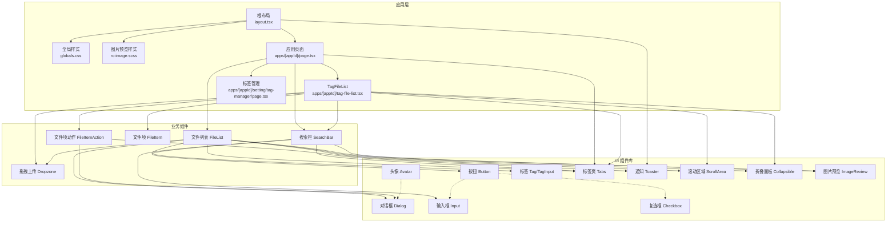

**图表来源**
- [src/app/layout.tsx:1-37](file://src/app/layout.tsx#L1-L37)
- [src/app/globals.css:1-222](file://src/app/globals.css#L1-L222)
- [src/app/rc-image.scss:1-388](file://src/app/rc-image.scss#L1-L388)
- [src/app/dashboard/apps/[appId]/page.tsx:1-234](file://src/app/dashboard/apps/[appId]/page.tsx#L1-L234)
- [src/app/dashboard/apps/[appId]/tag-file-list.tsx:1-336](file://src/app/dashboard/apps/[appId]/tag-file-list.tsx#L1-L336)
- [src/app/dashboard/apps/[appId]/setting/tag-manager/page.tsx:1-398](file://src/app/dashboard/apps/[appId]/setting/tag-manager/page.tsx#L1-L398)
- [src/components/ui/button.tsx:1-63](file://src/components/ui/button.tsx#L1-L63)
- [src/components/ui/dialog.tsx:1-144](file://src/components/ui/dialog.tsx#L1-L144)
- [src/components/ui/input.tsx:1-22](file://src/components/ui/input.tsx#L1-L22)
- [src/components/ui/avatar.tsx:1-54](file://src/components/ui/avatar.tsx#L1-L54)
- [src/components/ui/tag.tsx:1-204](file://src/components/ui/tag.tsx#L1-L204)
- [src/components/ui/tag-input.tsx:1-158](file://src/components/ui/tag-input.tsx#L1-L158)
- [src/components/ui/checkbox.tsx:1-33](file://src/components/ui/checkbox.tsx#L1-L33)
- [src/components/ui/tabs.tsx:1-67](file://src/components/ui/tabs.tsx#L1-L67)
- [src/components/ui/sonner.tsx:1-41](file://src/components/ui/sonner.tsx#L1-L41)
- [src/components/feature/FileList.tsx:1-444](file://src/components/feature/FileList.tsx#L1-L444)
- [src/components/feature/dropzone.tsx:1-52](file://src/components/feature/dropzone.tsx#L1-L52)
- [src/components/feature/search-bar.tsx:1-201](file://src/components/feature/search-bar.tsx#L1-L201)
- [src/components/ui/collapsible.tsx:1-34](file://src/components/ui/collapsible.tsx#L1-L34)
- [src/components/feature/file-item.tsx:1-138](file://src/components/feature/file-item.tsx#L1-L138)
- [src/components/feature/file-item-action.tsx:1-112](file://src/components/feature/file-item-action.tsx#L1-L112)
- [src/components/ui/image-review/index.tsx:1-25](file://src/components/ui/image-review/index.tsx#L1-L25)
- [src/components/ui/image-review/common.tsx:1-26](file://src/components/ui/image-review/common.tsx#L1-L26)
- [src/components/ui/scroll-area.tsx:1-59](file://src/components/ui/scroll-area.tsx#L1-L59)

**章节来源**
- [src/app/layout.tsx:1-37](file://src/app/layout.tsx#L1-L37)
- [src/app/globals.css:1-222](file://src/app/globals.css#L1-L222)
- [src/app/rc-image.scss:1-388](file://src/app/rc-image.scss#L1-L388)
- [src/app/dashboard/apps/[appId]/page.tsx:1-234](file://src/app/dashboard/apps/[appId]/page.tsx#L1-L234)

## 核心组件
本节聚焦 UI 组件库中的关键原子组件与复合组件，阐述其设计原则、属性与行为特征。

- 按钮 Button
  - 设计理念：通过变体（variant/size）与组合模式（asChild）统一风格与语义，支持 SVG 图标内嵌与无障碍属性。
  - 关键属性：className、variant、size、asChild、禁用态与焦点态样式。
  - 行为特征：聚焦可见边框与 ring 效果，支持 aria-invalid 与 invalid 边框。
  - 参考路径：[src/components/ui/button.tsx:1-63](file://src/components/ui/button.tsx#L1-L63)

- 输入框 Input
  - 设计理念：统一边框、颜色、阴影与聚焦 ring 的视觉反馈，支持 aria-invalid。
  - 关键属性：type、className、禁用态与聚焦态。
  - 参考路径：[src/components/ui/input.tsx:1-22](file://src/components/ui/input.tsx#L1-L22)

- 复选框 Checkbox
  - 设计理念：Radix UI 原子组件封装，提供 checked 状态下的背景色与图标指示。
  - 关键属性：className、禁用态与聚焦 ring。
  - 参考路径：[src/components/ui/checkbox.tsx:1-33](file://src/components/ui/checkbox.tsx#L1-L33)

- 对话框 Dialog
  - 设计理念：Portal 渲染、Overlay 动画、内容居中与关闭按钮，支持 showCloseButton 控制。
  - 关键属性：Root/Trigger/Portal/Overlay/Content/Close/Header/Footer/Title/Description。
  - 参考路径：[src/components/ui/dialog.tsx:1-144](file://src/components/ui/dialog.tsx#L1-L144)

- 标签 Tag 与 TagInput
  - 设计理念：Tag 支持颜色、尺寸与移除按钮；TagInput 提供多标签输入、建议选择与最大数量限制。
  - 关键属性：Tag(name/color/size/removable/onRemove)，TagInput(value/onChange/suggestions/maxTags/placeholder)。
  - 参考路径：
    - [src/components/ui/tag.tsx:1-204](file://src/components/ui/tag.tsx#L1-L204)
    - [src/components/ui/tag-input.tsx:1-158](file://src/components/ui/tag-input.tsx#L1-L158)

- 标签页 Tabs
  - 设计理念：列表与触发器的组合，激活态样式与禁用态控制。
  - 关键属性：Root/List/Trigger/Content。
  - 参考路径：[src/components/ui/tabs.tsx:1-67](file://src/components/ui/tabs.tsx#L1-L67)

- 头像 Avatar
  - 设计理念：Root/Image/Fallback 三段式结构，支持占位与降级。
  - 关键属性：className。
  - 参考路径：[src/components/ui/avatar.tsx:1-54](file://src/components/ui/avatar.tsx#L1-L54)

- 通知 Toaster
  - 设计理念：基于 next-themes 主题切换，映射图标与 CSS 变量，统一通知容器样式。
  - 关键属性：ToasterProps。
  - 参考路径：[src/components/ui/sonner.tsx:1-41](file://src/components/ui/sonner.tsx#L1-L41)

- 滚动区域 ScrollArea
  - 设计理念：基于 Radix UI 的自定义滚动条，支持焦点可见性与平滑滚动。
  - 关键属性：Root/Viewport/Scrollbar/Thumb，支持 onScrollEnd 回调。
  - 参考路径：[src/components/ui/scroll-area.tsx:1-59](file://src/components/ui/scroll-area.tsx#L1-L59)

- 折叠面板 Collapsible
  - 设计理念：Radix UI 封装，支持展开/收起动画与状态管理。
  - 关键属性：Root/Trigger/Content，支持 open/onOpenChange 控制。
  - 参考路径：[src/components/ui/collapsible.tsx:1-34](file://src/components/ui/collapsible.tsx#L1-L34)

- 图片预览 ImageReview
  - 设计理念：基于 rc-image 的增强版图片预览组件，支持自定义图标与预览配置。
  - 关键属性：preview 配置，支持缩放、旋转、翻转等操作。
  - 参考路径：
    - [src/components/ui/image-review/index.tsx:1-25](file://src/components/ui/image-review/index.tsx#L1-L25)
    - [src/components/ui/image-review/common.tsx:1-26](file://src/components/ui/image-review/common.tsx#L1-L26)

章节来源
- [src/components/ui/button.tsx:1-63](file://src/components/ui/button.tsx#L1-L63)
- [src/components/ui/input.tsx:1-22](file://src/components/ui/input.tsx#L1-L22)
- [src/components/ui/checkbox.tsx:1-33](file://src/components/ui/checkbox.tsx#L1-L33)
- [src/components/ui/dialog.tsx:1-144](file://src/components/ui/dialog.tsx#L1-L144)
- [src/components/ui/tag.tsx:1-204](file://src/components/ui/tag.tsx#L1-L204)
- [src/components/ui/tag-input.tsx:1-158](file://src/components/ui/tag-input.tsx#L1-L158)
- [src/components/ui/tabs.tsx:1-67](file://src/components/ui/tabs.tsx#L1-L67)
- [src/components/ui/avatar.tsx:1-54](file://src/components/ui/avatar.tsx#L1-L54)
- [src/components/ui/sonner.tsx:1-41](file://src/components/ui/sonner.tsx#L1-L41)
- [src/components/ui/scroll-area.tsx:1-59](file://src/components/ui/scroll-area.tsx#L1-L59)
- [src/components/ui/collapsible.tsx:1-34](file://src/components/ui/collapsible.tsx#L1-L34)
- [src/components/ui/image-review/index.tsx:1-25](file://src/components/ui/image-review/index.tsx#L1-L25)
- [src/components/ui/image-review/common.tsx:1-26](file://src/components/ui/image-review/common.tsx#L1-L26)

## 架构总览
整体架构以"布局与主题""UI 组件库""业务组件"三层组织，配合全局样式与第三方库实现一致的视觉与交互体验。**更新** 新增了应用页面层，包含 TagFileList 组件和标签管理功能，实现了分类系统的统一化。

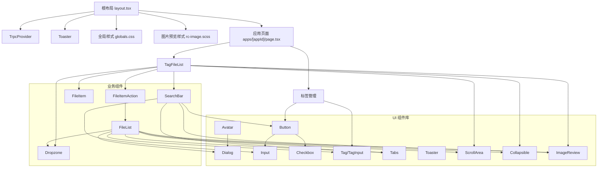

**图表来源**
- [src/app/layout.tsx:1-37](file://src/app/layout.tsx#L1-L37)
- [src/app/globals.css:1-222](file://src/app/globals.css#L1-L222)
- [src/app/rc-image.scss:1-388](file://src/app/rc-image.scss#L1-L388)
- [src/app/dashboard/apps/[appId]/page.tsx:1-234](file://src/app/dashboard/apps/[appId]/page.tsx#L1-L234)
- [src/app/dashboard/apps/[appId]/tag-file-list.tsx:1-336](file://src/app/dashboard/apps/[appId]/tag-file-list.tsx#L1-L336)
- [src/app/dashboard/apps/[appId]/setting/tag-manager/page.tsx:1-398](file://src/app/dashboard/apps/[appId]/setting/tag-manager/page.tsx#L1-L398)
- [src/components/ui/button.tsx:1-63](file://src/components/ui/button.tsx#L1-L63)
- [src/components/ui/dialog.tsx:1-144](file://src/components/ui/dialog.tsx#L1-L144)
- [src/components/ui/input.tsx:1-22](file://src/components/ui/input.tsx#L1-L22)
- [src/components/ui/checkbox.tsx:1-33](file://src/components/ui/checkbox.tsx#L1-L33)
- [src/components/ui/tag.tsx:1-204](file://src/components/ui/tag.tsx#L1-L204)
- [src/components/ui/tag-input.tsx:1-158](file://src/components/ui/tag-input.tsx#L1-L158)
- [src/components/ui/tabs.tsx:1-67](file://src/components/ui/tabs.tsx#L1-L67)
- [src/components/ui/avatar.tsx:1-54](file://src/components/ui/avatar.tsx#L1-L54)
- [src/components/ui/sonner.tsx:1-41](file://src/components/ui/sonner.tsx#L1-L41)
- [src/components/feature/FileList.tsx:1-444](file://src/components/feature/FileList.tsx#L1-L444)
- [src/components/feature/dropzone.tsx:1-52](file://src/components/feature/dropzone.tsx#L1-L52)
- [src/components/feature/search-bar.tsx:1-201](file://src/components/feature/search-bar.tsx#L1-L201)
- [src/components/ui/collapsible.tsx:1-34](file://src/components/ui/collapsible.tsx#L1-L34)
- [src/components/feature/file-item.tsx:1-138](file://src/components/feature/file-item.tsx#L1-L138)
- [src/components/feature/file-item-action.tsx:1-112](file://src/components/feature/file-item-action.tsx#L1-L112)
- [src/components/ui/image-review/index.tsx:1-25](file://src/components/ui/image-review/index.tsx#L1-L25)
- [src/components/ui/image-review/common.tsx:1-26](file://src/components/ui/image-review/common.tsx#L1-L26)
- [src/components/ui/scroll-area.tsx:1-59](file://src/components/ui/scroll-area.tsx#L1-L59)

## 详细组件分析

### TagFileList 组件
**新增** TagFileList 是本次重大重构的核心组件，统一了原本分散的分类专用组件，支持动态分类类型和统一的文件列表展示逻辑。

职责与架构
- 职责：作为统一的文件列表组件，支持按标签分类的文件展示，动态支持任意分类类型（person/location/event 等），提供统一的无限滚动加载、分组展示和操作功能。
- 架构：基于 trpc 的无限查询，支持按 tagId 过滤，动态分组显示，支持 person 和 default 两种展示变体。

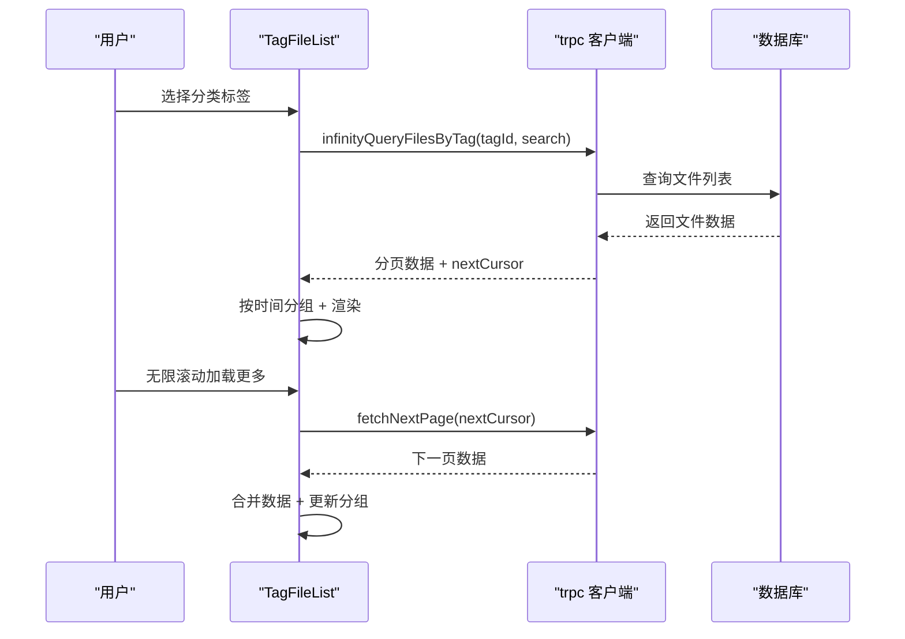

**更新** 主要功能特性：
- **动态分类支持**：支持任意分类类型（person/location/event/自定义），通过 categoryType 字段实现
- **统一展示逻辑**：person 变体使用圆形头像样式，default 变体使用网格样式
- **无限滚动**：基于 trpc 的无限查询，支持分页加载和 nextCursor 机制
- **智能分组**：按今天/昨天/月日/年月日自动分组，支持 Collapsible 展开/收起
- **上传集成**：与 Uppy 无缝集成，支持上传成功后的数据刷新和 AI 标签识别

**章节来源**
- [src/app/dashboard/apps/[appId]/tag-file-list.tsx:1-336](file://src/app/dashboard/apps/[appId]/tag-file-list.tsx#L1-L336)

### 应用页面组件
**更新** 应用页面组件集成了 TagFileList，实现了分类系统的统一化管理。

职责与流程
- 职责：管理应用级别的文件展示，动态生成分类标签页，集成搜索功能和上传功能。
- 流程：获取分类标签 -> 动态生成 Tabs -> 为每个标签渲染对应的 TagFileList -> 支持搜索过滤和上传。

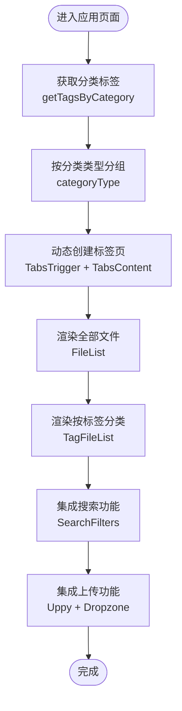

**更新** 主要功能特性：
- **动态标签页**：根据用户标签自动生成分类标签页，支持 person/location/event 等分类类型
- **统一搜索**：所有分类共享同一个搜索栏，支持关键词和日期过滤
- **分类变体**：根据分类类型自动选择 person 或 default 展示样式
- **标签管理**：集成标签管理功能，支持标签的创建、编辑、删除和分配

**章节来源**
- [src/app/dashboard/apps/[appId]/page.tsx:1-234](file://src/app/dashboard/apps/[appId]/page.tsx#L1-L234)

### 标签管理页面
**新增** 标签管理页面提供了完整的标签生命周期管理功能。

职责与流程
- 职责：提供标签的创建、编辑、删除和分配管理界面，支持用户标签和文件标签的双向管理。
- 流程：获取用户标签 -> 显示标签列表 -> 支持标签操作 -> 管理文件标签关联。

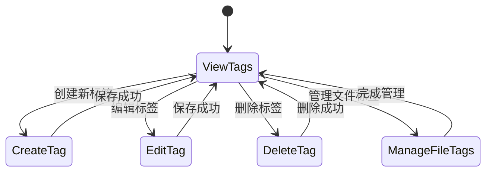

**更新** 主要功能特性：
- **标签 CRUD**：完整的标签创建、读取、更新、删除功能
- **文件标签管理**：支持将标签分配给特定文件，提供标签列表和移除功能
- **标签建议**：TagInput 组件提供标签名称建议和自动补全
- **批量操作**：支持标签的批量创建和管理

**章节来源**
- [src/app/dashboard/apps/[appId]/setting/tag-manager/page.tsx:1-398](file://src/app/dashboard/apps/[appId]/setting/tag-manager/page.tsx#L1-L398)

### 文件列表组件 FileList
**更新** 增加了与 TagFileList 的对比分析和统一化优势说明

职责与流程
- 职责：展示应用中的所有文件，按日期分组，支持无限滚动加载、上传进度可视化、删除与复制链接操作、AI 标签识别联动。
- 流程：订阅 trpc 无限查询，分组聚合，Collapsible 展开/收起，IntersectionObserver 触发下一页，Uppy 事件监听处理上传完成与进度，本地缓存更新与远端同步。

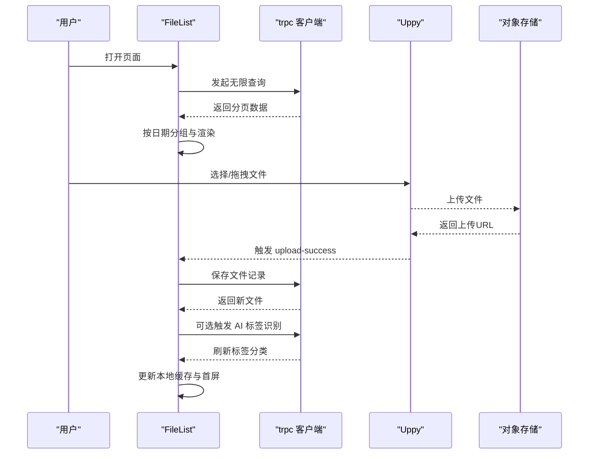

**更新** 与 TagFileList 的对比：
- **适用场景**：FileList 用于展示所有文件，TagFileList 用于按标签分类展示
- **数据源**：FileList 基于文件表查询，TagFileList 基于文件标签关联查询
- **分组逻辑**：FileList 按时间分组，TagFileList 按标签分组
- **展示变体**：FileList 不支持变体，TagFileList 支持 person/default 两种变体

**章节来源**
- [src/components/feature/FileList.tsx:1-444](file://src/components/feature/FileList.tsx#L1-L444)

### 搜索栏组件 SearchBar
**更新** 增加了与分类系统的集成说明

职责与流程
- 职责：提供基础搜索与高级日期筛选功能，支持关键词搜索、开始/结束日期过滤和实时搜索提示。
- 流程：管理查询状态、日期选择器状态，处理搜索与清除操作，动态显示过滤器提示。

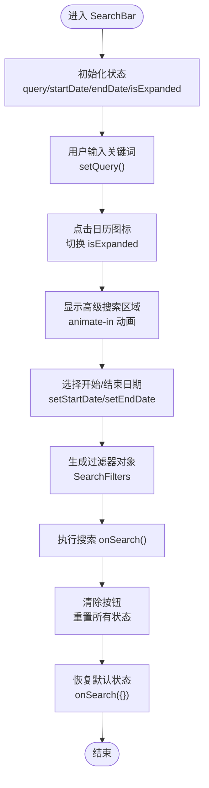

**更新** 与分类系统的集成：
- **统一搜索**：所有分类标签页共享同一个搜索栏，搜索结果会应用到所有分类
- **过滤器传递**：SearchFilters 通过 props 传递给 TagFileList 和 FileList
- **实时更新**：搜索条件变化时，所有相关组件都会重新查询数据

**章节来源**
- [src/components/feature/search-bar.tsx:1-201](file://src/components/feature/search-bar.tsx#L1-L201)

### 文件项组件 FileItem
职责与流程
- 职责：封装单个文件项的展示逻辑，支持本地文件与远程文件的不同处理方式，提供预览与操作按钮的容器。
- 流程：根据文件类型决定渲染方式，支持图片预览组件与占位符，提供子组件插槽机制。

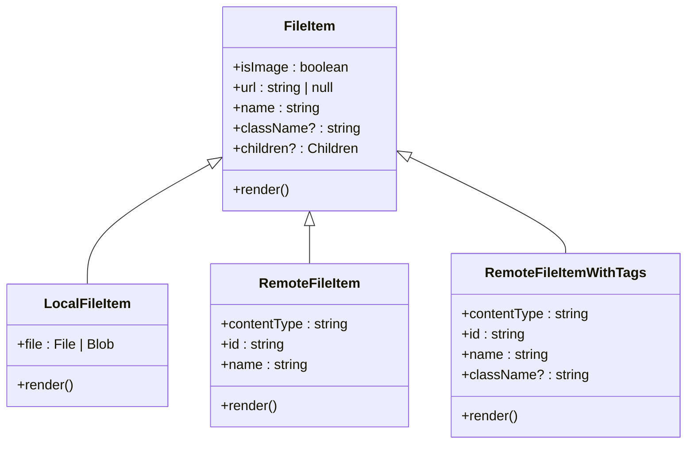

**更新** 与 TagFileList 的关系：
- **统一渲染**：RemoteFileItemWithTags 专门用于 TagFileList 的文件项渲染
- **操作集成**：支持复制链接、删除、预览等操作，这些操作在 TagFileList 中统一处理
- **样式变体**：根据 TagFileList 的 variant prop 应用不同的样式类名

**章节来源**
- [src/components/feature/file-item.tsx:1-138](file://src/components/feature/file-item.tsx#L1-L138)

### 文件项动作组件 FileItemAction
职责与流程
- 职责：提供文件项的操作按钮，包括删除确认对话框、复制链接和预览功能。
- 流程：管理确认对话框状态，处理删除请求与成功反馈，提供复制链接的即时反馈。

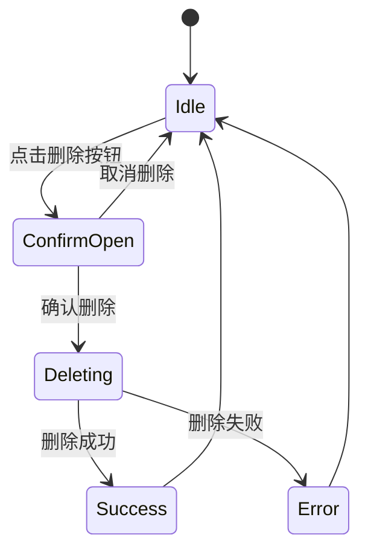

**更新** 与 TagFileList 的协作：
- **统一删除**：删除操作通过 TagFileList 的 handleFileDelete 方法统一处理
- **缓存更新**：删除成功后更新 trpc 缓存，确保 UI 即时反映
- **错误处理**：统一的错误处理和用户反馈机制

**章节来源**
- [src/components/feature/file-item-action.tsx:1-112](file://src/components/feature/file-item-action.tsx#L1-L112)

### UI 组件库类图
展示 UI 组件库中复合组件与原子组件的关系与职责划分。

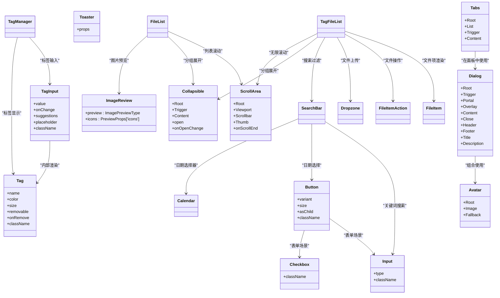

**图表来源**
- [src/components/ui/button.tsx:1-63](file://src/components/ui/button.tsx#L1-L63)
- [src/components/ui/input.tsx:1-22](file://src/components/ui/input.tsx#L1-L22)
- [src/components/ui/checkbox.tsx:1-33](file://src/components/ui/checkbox.tsx#L1-L33)
- [src/components/ui/dialog.tsx:1-144](file://src/components/ui/dialog.tsx#L1-L144)
- [src/components/ui/tag.tsx:1-204](file://src/components/ui/tag.tsx#L1-L204)
- [src/components/ui/tag-input.tsx:1-158](file://src/components/ui/tag-input.tsx#L1-L158)
- [src/components/ui/tabs.tsx:1-67](file://src/components/ui/tabs.tsx#L1-L67)
- [src/components/ui/avatar.tsx:1-54](file://src/components/ui/avatar.tsx#L1-L54)
- [src/components/ui/sonner.tsx:1-41](file://src/components/ui/sonner.tsx#L1-L41)
- [src/components/ui/scroll-area.tsx:1-59](file://src/components/ui/scroll-area.tsx#L1-L59)
- [src/components/ui/collapsible.tsx:1-34](file://src/components/ui/collapsible.tsx#L1-L34)
- [src/components/ui/image-review/index.tsx:1-25](file://src/components/ui/image-review/index.tsx#L1-L25)
- [src/components/ui/image-review/common.tsx:1-26](file://src/components/ui/image-review/common.tsx#L1-L26)
- [src/app/dashboard/apps/[appId]/tag-file-list.tsx:1-336](file://src/app/dashboard/apps/[appId]/tag-file-list.tsx#L1-L336)
- [src/app/dashboard/apps/[appId]/setting/tag-manager/page.tsx:1-398](file://src/app/dashboard/apps/[appId]/setting/tag-manager/page.tsx#L1-L398)

## UI/UX 设计系统

### 颜色系统
项目采用了完整的 UI/UX 设计系统资源，包含多种颜色方案和设计指导原则：

- **OKLCH 颜色空间支持**：全局样式使用 OKLCH 颜色模型，提供更自然的颜色感知和更好的对比度控制
- **明暗主题适配**：支持标准模式和深色模式的完整颜色映射
- **品牌色彩系统**：包含主色调、辅助色、强调色和状态色的完整体系

**章节来源**
- [.aone_copilot/skills/ui-ux-pro-max/data/colors.csv:1-98](file://.aone_copilot/skills/ui-ux-pro-max/data/colors.csv#L1-L98)
- [src/app/globals.css:6-75](file://src/app/globals.css#L6-L75)

### 字体系统
设计系统提供了多种字体搭配方案，适用于不同的品牌定位和应用场景：

- **现代专业字体**：Poppins + Open Sans，适合企业级应用
- **科技启动字体**：Space Grotesk + DM Sans，适合科技产品
- **极简瑞士字体**：Inter，适合仪表板和管理系统
- **创意友好字体**：Fredoka + Nunito，适合儿童和创意应用

**章节来源**
- [.aone_copilot/skills/ui-ux-pro-max/data/typography.csv:1-58](file://.aone_copilot/skills/ui-ux-pro-max/data/typography.csv#L1-L58)

### 图标系统
完整的图标库支持，包含 100+ 个常用图标，涵盖导航、操作、状态、媒体等多个类别：

- **Lucide 图标库**：统一的线条图标风格，支持 24px 规格
- **分类明确**：导航、动作、状态、通信、用户、媒体、商业、数据等类别
- **使用规范**：每个图标都有明确的使用场景和最佳实践

**章节来源**
- [.aone_copilot/skills/ui-ux-pro-max/data/icons.csv:1-102](file://.aone_copilot/skills/ui-ux-pro-max/data/icons.csv#L1-L102)

### 设计风格指南
项目包含了全面的设计风格指南，涵盖 69 种不同的设计风格：

- **现代简约风格**：Minimalism & Swiss Style，适合企业应用
- **玻璃拟态风格**：Glassmorphism，适合现代 SaaS 平台
- **神经拟态风格**：Neumorphism，适合健康/健身应用
- **复古未来主义**：Retro-Futurism，适合娱乐和游戏应用
- **无障碍设计**：Accessible & Ethical，适合公共服务

**章节来源**
- [.aone_copilot/skills/ui-ux-pro-max/data/styles.csv:1-69](file://.aone_copilot/skills/ui-ux-pro-max/data/styles.csv#L1-L69)

### UX 指导原则
设计系统提供了 100 条 UX 指导原则，涵盖动画、布局、触摸、交互、可访问性、性能等方面：

- **动画指导**：过度动画、持续动画、变换性能、缓动函数等
- **布局指导**：Z-index 管理、溢出隐藏、固定定位、堆叠上下文等
- **触摸指导**：触摸目标大小、触摸间距、手势冲突、触摸延迟等
- **交互指导**：焦点状态、悬停状态、活动状态、禁用状态等
- **可访问性指导**：颜色对比、仅颜色传达信息、替代文本、标题层级等
- **性能指导**：图像优化、懒加载、代码分割、缓存策略等

**章节来源**
- [.aone_copilot/skills/ui-ux-pro-max/data/ux-guidelines.csv:1-100](file://.aone_copilot/skills/ui-ux-pro-max/data/ux-guidelines.csv#L1-L100)

## 依赖分析
- 主题与样式
  - 全局 CSS 使用 Tailwind v4 与自定义主题变量，支持明暗主题切换与 CSS 变量映射。
  - 图片预览样式来自 rc-image，提供淡入淡出与缩放动画。
  - **新增** OKLCH 颜色空间支持，提供更自然的颜色感知和更好的对比度控制。
- UI 组件库
  - 基于 Radix UI 原子组件与 class-variance-authority 实现变体与组合模式。
  - 使用 lucide-react 提供图标，next-themes 提供主题感知。
- 业务组件
  - FileList 依赖 trpc 无限查询、TanStack Query 缓存、Uppy 上传流与 IntersectionObserver。
  - Dropzone 作为上传入口，与 Uppy 协作。
  - SearchBar 提供搜索过滤功能，与 FileList 数据流集成。
  - **新增** TagFileList 作为统一的分类文件列表组件，集成分类系统与无限滚动。
- **新增** 分类系统
  - 支持任意分类类型，通过 categoryType 字段实现动态分类
  - 默认包含 person、location、event 三种分类类型
  - 支持标签的层级结构和排序

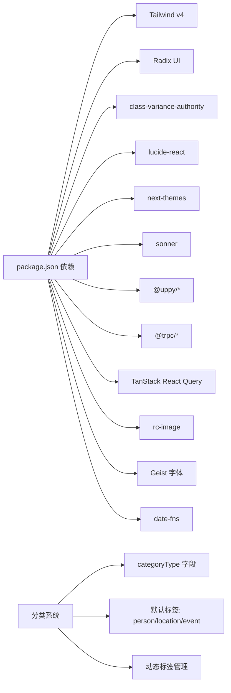

**图表来源**
- [package.json:1-94](file://package.json#L1-L94)
- [src/server/db/schema.ts:202-224](file://src/server/db/schema.ts#L202-L224)
- [src/server/routes/app.ts:10-15](file://src/server/routes/app.ts#L10-L15)
- [scripts/init-default-tags.ts:7-12](file://scripts/init-default-tags.ts#L7-L12)

**章节来源**
- [package.json:1-94](file://package.json#L1-L94)

## 性能考虑
- 列表渲染与懒加载
  - FileList 使用无限滚动与 IntersectionObserver，仅在接近底部时触发下一页加载，减少一次性渲染压力。
  - 分组渲染与 Collapsible 控制展开范围，避免大列表全量展开。
  - **新增** TagFileList 优化了无限滚动性能，支持按标签的独立分页加载。
  - **新增** 分类标签的缓存策略，避免重复查询相同分类的数据。
- 本地缓存与远端同步
  - 上传完成后优先更新本地缓存，再异步拉取远端数据，提升交互流畅度。
  - **新增** 上传成功后自动刷新相关分类的缓存，确保数据一致性。
  - **新增** AI 标签识别后的缓存更新，避免重复识别。
- 图片预览与资源
  - rc-image 提供渐进式加载与动画，避免闪烁；图片缩略图尺寸固定，降低内存占用。
  - **新增** TagFileList 的图片预览支持，提供统一的预览体验。
- 样式与主题
  - 全局 CSS 通过 CSS 变量与暗色主题适配，减少重复计算与重绘。
  - **新增** OKLCH 颜色空间支持，提供更自然的颜色感知和更好的对比度控制。
  - **新增** 分类样式的动态应用，根据分类类型自动选择合适的样式。
- 无障碍与可访问性
  - 所有交互组件均设置 aria-* 属性与键盘可达性，焦点环与提示文本完善。
  - **新增** 分类标签的无障碍支持，确保屏幕阅读器正确读取分类信息。
  - **新增** 动态标签页的无障碍文本，提供清晰的分类状态信息。
- 动画与过渡
  - 对话框 Overlay 与 Content 使用 fade/zoom 动画，rc-image 提供淡入淡出与缩放动画，增强反馈但避免过度复杂。
  - **新增** TagFileList 的 Collapsible 动画，提供平滑的分组展开/收起体验。
  - **新增** 分类标签页的切换动画，提升用户体验。
- **新增** 分类系统性能优化
  - 分类标签的按需加载，避免一次性加载所有分类
  - 分类数据的智能缓存，减少重复查询
  - 分类变体的样式复用，避免重复计算

**章节来源**
- [src/app/dashboard/apps/[appId]/tag-file-list.tsx:142-152](file://src/app/dashboard/apps/[appId]/tag-file-list.tsx#L142-L152)
- [src/app/dashboard/apps/[appId]/page.tsx:44-54](file://src/app/dashboard/apps/[appId]/page.tsx#L44-L54)
- [src/app/globals.css:142-187](file://src/app/globals.css#L142-L187)

## 故障排查指南
- 上传未生效或未显示
  - 检查 Uppy 事件监听是否注册与注销，确认 upload-success 与 complete 回调链路。
  - 确认 trpc 保存接口返回与本地缓存更新逻辑。
  - **新增** 检查上传进度状态管理，确认 uploadingFilesIds 的更新。
  - **新增** 检查 TagFileList 的缓存更新逻辑，确保按标签分类的正确更新。
  - 参考路径：[src/app/dashboard/apps/[appId]/tag-file-list.tsx:58-125](file://src/app/dashboard/apps/[appId]/tag-file-list.tsx#L58-L125)
- 对话框无法关闭或遮罩层异常
  - 检查 Portal 渲染与 Overlay 动画类名，确认 showCloseButton 与关闭按钮事件绑定。
  - 参考路径：[src/components/ui/dialog.tsx:50-81](file://src/components/ui/dialog.tsx#L50-L81)
- 标签输入无建议或无法移除
  - 检查 TagInput 的过滤逻辑、点击建议项与回车添加行为，确认移除回调链路。
  - **新增** 检查标签管理页面的标签建议功能，确认用户标签的正确加载。
  - 参考路径：[src/components/ui/tag-input.tsx:28-99](file://src/components/ui/tag-input.tsx#L28-L99)
- 主题切换不生效
  - 检查 next-themes 主题状态与 CSS 变量映射，确认 Toaster 主题传递。
  - **新增** 检查 OKLCH 颜色空间的正确应用，确认颜色变量的继承关系。
  - **新增** 检查分类样式的主题适配，确保不同主题下的正确显示。
  - 参考路径：[src/components/ui/sonner.tsx:13-38](file://src/components/ui/sonner.tsx#L13-L38)
- **新增** 分类标签功能异常
  - 检查 getTagsByCategory 查询是否正确返回分类标签，确认 categoryType 字段的正确性。
  - 确认动态标签页的创建逻辑，检查标签 ID 与分类类型的匹配。
  - 参考路径：[src/app/dashboard/apps/[appId]/page.tsx:34-42](file://src/app/dashboard/apps/[appId]/page.tsx#L34-L42)
- **新增** TagFileList 组件问题
  - 检查 trpc 的 infinityQueryFilesByTag 查询参数，确认 tagId 和 searchFilters 的正确传递。
  - 确认无限滚动的 nextCursor 机制，检查分页加载的正确性。
  - 参考路径：[src/app/dashboard/apps/[appId]/tag-file-list.tsx:34-54](file://src/app/dashboard/apps/[appId]/tag-file-list.tsx#L34-L54)
- **新增** 标签管理页面问题
  - 检查标签 CRUD 操作的正确性，确认权限验证和错误处理。
  - 确认文件标签关联的正确性，检查标签分配和移除功能。
  - 参考路径：[src/app/dashboard/apps/[appId]/setting/tag-manager/page.tsx:48-71](file://src/app/dashboard/apps/[appId]/setting/tag-manager/page.tsx#L48-L71)
- **新增** 设计系统资源问题
  - 检查颜色、字体、图标资源的正确导入与使用。
  - 确认设计风格指南的实施符合项目需求。
  - **新增** 检查分类样式的资源应用，确保分类标签的颜色和样式正确。
  - 参考路径：[.aone_copilot/skills/ui-ux-pro-max/data/colors.csv:1-98](file://.aone_copilot/skills/ui-ux-pro-max/data/colors.csv#L1-L98)

**章节来源**
- [src/app/dashboard/apps/[appId]/tag-file-list.tsx:58-125](file://src/app/dashboard/apps/[appId]/tag-file-list.tsx#L58-L125)
- [src/components/ui/dialog.tsx:50-81](file://src/components/ui/dialog.tsx#L50-L81)
- [src/components/ui/tag-input.tsx:28-99](file://src/components/ui/tag-input.tsx#L28-L99)
- [src/components/ui/sonner.tsx:13-38](file://src/components/ui/sonner.tsx#L13-L38)
- [src/app/dashboard/apps/[appId]/page.tsx:34-42](file://src/app/dashboard/apps/[appId]/page.tsx#L34-L42)
- [src/app/dashboard/apps/[appId]/setting/tag-manager/page.tsx:48-71](file://src/app/dashboard/apps/[appId]/setting/tag-manager/page.tsx#L48-L71)

## 结论
本项目通过清晰的三层结构与统一的 UI 组件库，实现了从主题与样式到业务组件的完整前端体系。**更新** 最重要的重构是将原本分散的分类专用组件统一为 TagFileList 组件，这一变化带来了以下显著优势：

- **架构统一化**：所有分类展示逻辑集中在单一组件中，减少了代码重复和维护成本
- **动态分类支持**：支持任意分类类型，无需为新分类创建专用组件
- **性能优化**：统一的无限滚动和缓存机制，提升了数据加载效率
- **用户体验提升**：统一的交互模式和视觉风格，提供了更好的用户体验
- **扩展性强**：新的分类系统易于扩展，支持更多分类类型和自定义需求

UI 组件库以变体与组合模式为核心设计思想，结合 Radix UI 与 TailwindCSS，确保一致性与可扩展性。业务组件围绕上传、列表、搜索与标签等场景，采用 trpc 与 Uppy 的协同方案，兼顾性能与用户体验。

**更新** 最新的组件改进进一步提升了用户体验：
- TagFileList 组件提供了统一的分类文件列表展示逻辑
- 应用页面集成了动态分类标签页，实现了分类系统的统一化管理
- 标签管理页面提供了完整的标签生命周期管理功能
- 分类系统支持任意分类类型，通过 categoryType 字段实现动态分类
- **新增** 完整的 UI/UX 设计系统资源，包括颜色、字体、图标和设计风格指南
- **新增** OKLCH 颜色空间支持，提供更自然的颜色感知和更好的对比度控制

建议在后续迭代中持续完善测试覆盖与无障碍细节，保持组件库的演进与稳定性。同时充分利用设计系统资源，确保设计的一致性和可维护性。分类系统的统一化为未来的功能扩展奠定了坚实的基础。

## 附录

### 响应式设计与无障碍访问指南
- 响应式设计
  - 使用容器查询与 @container 指令，确保卡片网格在不同视口下的自适应排列。
  - **新增** TagFileList 的响应式设计，确保分类标签在移动设备上的良好显示。
  - **新增** 分类样式的响应式适配，确保不同屏幕尺寸下的正确布局。
  - **新增** OKLCH 颜色空间在不同视口下的表现，确保颜色在各种设备上的一致性。
  - 参考路径：[src/app/dashboard/apps/[appId]/tag-file-list.tsx:288-292](file://src/app/dashboard/apps/[appId]/tag-file-list.tsx#L288-L292)
- 无障碍访问
  - 所有交互元素具备键盘可达性与焦点可见性，表单控件支持 aria-invalid。
  - 对话框提供关闭按钮的隐藏文本与 Portal 渲染，避免 DOM 结构错乱。
  - **新增** 分类标签的无障碍支持，确保屏幕阅读器正确读取分类信息。
  - **新增** 动态标签页的无障碍文本，提供清晰的分类状态信息。
  - **新增** OKLCH 颜色空间的无障碍考虑，确保足够的颜色对比度。
  - **新增** TagFileList 的无障碍优化，确保文件项操作的正确读取。
  - 参考路径：
    - [src/components/ui/button.tsx:7-37](file://src/components/ui/button.tsx#L7-L37)
    - [src/components/ui/dialog.tsx:33-81](file://src/components/ui/dialog.tsx#L33-L81)
    - [src/app/dashboard/apps/[appId]/tag-file-list.tsx:300-318](file://src/app/dashboard/apps/[appId]/tag-file-list.tsx#L300-L318)

### 动画与过渡效果
- 对话框：fadeIn/fadeOut 与 zoom 动画，提升打开/关闭的自然感。
- 图片预览：rc-image 提供淡入淡出与缩放动画，增强加载体验。
- **新增** TagFileList：Collapsible 的展开/收起动画，提供平滑的分组切换体验。
- **新增** 分类标签页：动态创建和切换的动画效果，提升用户体验。
- **新增** 文件项悬停：opacity 过渡动画，提供平滑的视觉反馈。
- **新增** OKLCH 颜色空间的动画支持，确保颜色过渡的自然性。
- 参考路径：
  - [src/components/ui/dialog.tsx:33-81](file://src/components/ui/dialog.tsx#L33-L81)
  - [src/app/rc-image.scss:289-387](file://src/app/rc-image.scss#L289-L387)
  - [src/app/dashboard/apps/[appId]/tag-file-list.tsx:273-281](file://src/app/dashboard/apps/[appId]/tag-file-list.tsx#L273-L281)
  - [src/app/dashboard/apps/[appId]/tag-file-list.tsx:300](file://src/app/dashboard/apps/[appId]/tag-file-list.tsx#L300)

### 组件测试方法与维护最佳实践
- 单元测试
  - 对 TagInput 的输入、过滤、移除逻辑进行断言，覆盖边界条件（空值、超长、重复）。
  - 对 Button 的变体与尺寸渲染进行快照或断言。
  - **新增** 对 TagFileList 的分类渲染、无限滚动、缓存更新进行测试。
  - **新增** 对应用页面的动态标签页创建、分类切换进行测试。
  - **新增** 对标签管理页面的 CRUD 操作、文件标签关联进行测试。
  - **新增** 对分类系统的数据结构、查询逻辑进行测试。
  - **新增** 对设计系统资源的正确使用进行测试，包括颜色、字体、图标的验证。
- 集成测试
  - 模拟 Uppy 事件与 trpc 调用，验证 TagFileList 的缓存更新与分组渲染。
  - **新增** 测试分类标签的动态创建和管理功能。
  - **新增** 测试搜索功能在分类系统中的应用效果。
  - **新增** 测试设计系统资源在实际组件中的应用效果。
- 维护最佳实践
  - 保持 UI 组件的最小公共接口，避免过度耦合。
  - 在新增变体时统一在 cva 中扩展，确保样式一致性。
  - 对第三方库升级进行回归测试，关注 API 变更与破坏性更新。
  - **新增** 为 TagFileList 组件编写详细的文档注释与示例代码。
  - **新增** 建立分类系统的测试用例，确保向后兼容性。
  - **新增** 定期审查设计系统资源的使用情况，确保设计一致性。
  - **新增** 监控 OKLCH 颜色空间的浏览器兼容性，提供降级方案。
  - **新增** 分类系统的性能监控，确保大规模数据下的稳定运行。

**章节来源**
- [src/app/dashboard/apps/[appId]/tag-file-list.tsx:142-152](file://src/app/dashboard/apps/[appId]/tag-file-list.tsx#L142-L152)
- [src/app/dashboard/apps/[appId]/page.tsx:44-54](file://src/app/dashboard/apps/[appId]/page.tsx#L44-L54)
- [src/app/dashboard/apps/[appId]/setting/tag-manager/page.tsx:48-71](file://src/app/dashboard/apps/[appId]/setting/tag-manager/page.tsx#L48-L71)
- [.aone_copilot/skills/ui-ux-pro-max/data/ux-guidelines.csv:1-100](file://.aone_copilot/skills/ui-ux-pro-max/data/ux-guidelines.csv#L1-L100)
- [.aone_copilot/skills/ui-ux-pro-max/data/styles.csv:1-69](file://.aone_copilot/skills/ui-ux-pro-max/data/styles.csv#L1-L69)

### 数据库架构与分类系统
**新增** 分类系统是本次重构的重要组成部分，提供了灵活的标签管理能力。

- **分类类型支持**：支持任意字符串作为分类类型，通过 categoryType 字段实现
- **默认分类**：系统初始化时创建 person、location、event 三种默认分类
- **标签层级**：支持标签的父子关系，通过 parentId 字段实现层级结构
- **排序机制**：支持标签的排序，通过 sort 字段实现自定义排序
- **应用隔离**：每个应用拥有独立的标签系统，通过 appId 字段实现隔离

**章节来源**
- [src/server/db/schema.ts:202-224](file://src/server/db/schema.ts#L202-L224)
- [src/server/routes/tags.ts:11-12](file://src/server/routes/tags.ts#L11-L12)
- [src/server/routes/app.ts:10-15](file://src/server/routes/app.ts#L10-L15)
- [scripts/init-default-tags.ts:7-12](file://scripts/init-default-tags.ts#L7-L12)