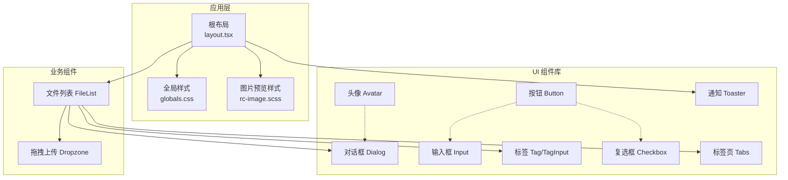
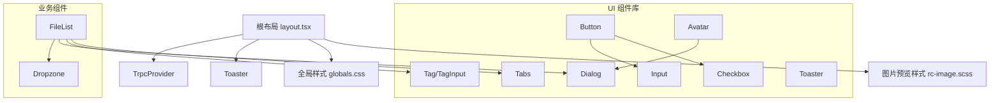
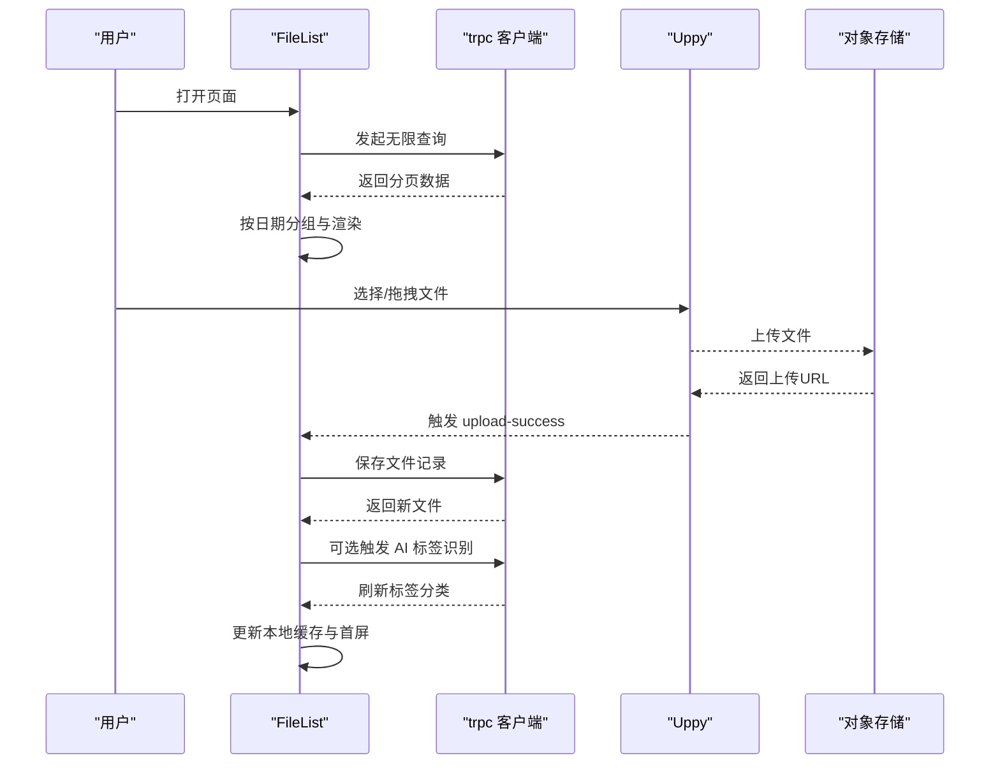
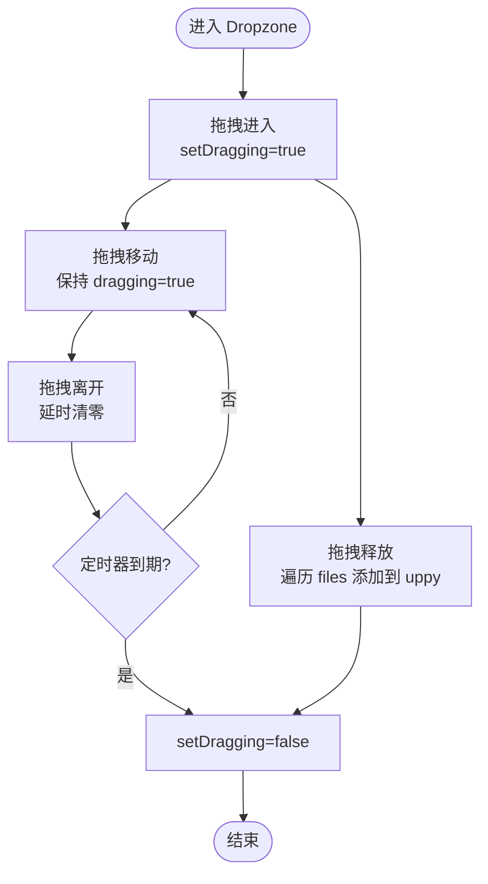
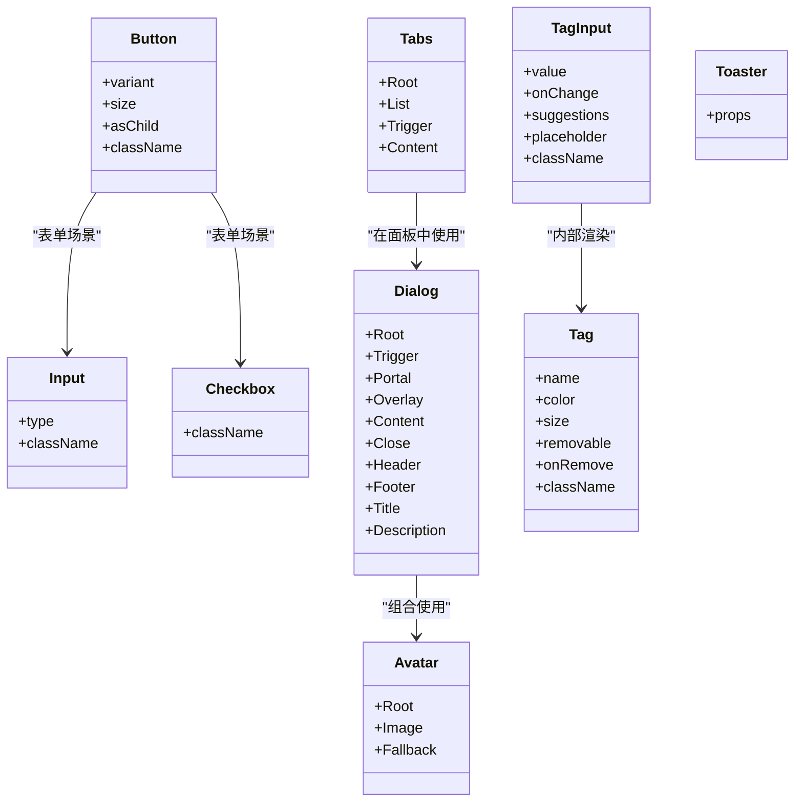
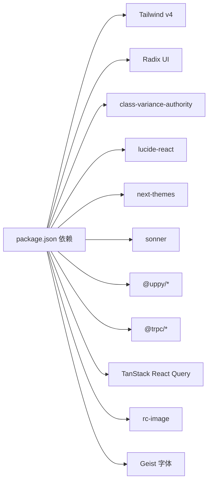

# 前端组件架构

<cite>
**本文引用的文件**
- [src/app/layout.tsx](file://src/app/layout.tsx)
- [src/app/globals.css](file://src/app/globals.css)
- [src/app/rc-image.scss](file://src/app/rc-image.scss)
- [src/components/ui/button.tsx](file://src/components/ui/button.tsx)
- [src/components/ui/dialog.tsx](file://src/components/ui/dialog.tsx)
- [src/components/ui/input.tsx](file://src/components/ui/input.tsx)
- [src/components/ui/avatar.tsx](file://src/components/ui/avatar.tsx)
- [src/components/ui/sonner.tsx](file://src/components/ui/sonner.tsx)
- [src/components/ui/tag.tsx](file://src/components/ui/tag.tsx)
- [src/components/ui/tag-input.tsx](file://src/components/ui/tag-input.tsx)
- [src/components/ui/checkbox.tsx](file://src/components/ui/checkbox.tsx)
- [src/components/ui/tabs.tsx](file://src/components/ui/tabs.tsx)
- [src/components/feature/FileList.tsx](file://src/components/feature/FileList.tsx)
- [src/components/feature/dropzone.tsx](file://src/components/feature/dropzone.tsx)
- [package.json](file://package.json)
</cite>

## 目录
1. [引言](#引言)
2. [项目结构](#项目结构)
3. [核心组件](#核心组件)
4. [架构总览](#架构总览)
5. [详细组件分析](#详细组件分析)
6. [依赖分析](#依赖分析)
7. [性能考虑](#性能考虑)
8. [故障排查指南](#故障排查指南)
9. [结论](#结论)
10. [附录](#附录)

## 引言
本文件面向 UI 开发者，系统性梳理 Image SaaS 项目的前端组件架构，覆盖组件层次结构、状态管理策略、UI 组件库设计理念、自定义组件与第三方库的集成方式、组件组合模式与样式系统，并给出响应式设计与无障碍访问的实现指南、动画与过渡效果说明、性能优化策略、测试方法与维护最佳实践。

## 项目结构
项目采用 Next.js 应用程序目录结构，根布局负责全局主题注入与 Provider 包裹；组件分为通用 UI 组件与业务特性组件两大类：
- 通用 UI 组件：位于 src/components/ui，基于 Radix UI 原子组件与 TailwindCSS 实现，遵循变体（variants）与组合模式（asChild）设计，统一风格与可访问性。
- 业务特性组件：位于 src/components/feature，围绕文件上传、列表展示、搜索过滤等场景构建，整合 Uppy、trpc、TanStack Query 等能力。

图表来源
- [src/app/layout.tsx:1-37](file://src/app/layout.tsx#L1-L37)
- [src/app/globals.css:1-162](file://src/app/globals.css#L1-L162)
- [src/app/rc-image.scss:1-388](file://src/app/rc-image.scss#L1-L388)
- [src/components/ui/button.tsx:1-63](file://src/components/ui/button.tsx#L1-L63)
- [src/components/ui/dialog.tsx:1-144](file://src/components/ui/dialog.tsx#L1-L144)
- [src/components/ui/input.tsx:1-22](file://src/components/ui/input.tsx#L1-L22)
- [src/components/ui/avatar.tsx:1-54](file://src/components/ui/avatar.tsx#L1-L54)
- [src/components/ui/tag.tsx:1-204](file://src/components/ui/tag.tsx#L1-L204)
- [src/components/ui/tag-input.tsx:1-158](file://src/components/ui/tag-input.tsx#L1-L158)
- [src/components/ui/checkbox.tsx:1-33](file://src/components/ui/checkbox.tsx#L1-L33)
- [src/components/ui/tabs.tsx:1-67](file://src/components/ui/tabs.tsx#L1-L67)
- [src/components/ui/sonner.tsx:1-41](file://src/components/ui/sonner.tsx#L1-L41)
- [src/components/feature/FileList.tsx:1-366](file://src/components/feature/FileList.tsx#L1-L366)
- [src/components/feature/dropzone.tsx:1-52](file://src/components/feature/dropzone.tsx#L1-L52)

章节来源
- [src/app/layout.tsx:1-37](file://src/app/layout.tsx#L1-L37)
- [src/app/globals.css:1-162](file://src/app/globals.css#L1-L162)
- [src/app/rc-image.scss:1-388](file://src/app/rc-image.scss#L1-L388)

## 核心组件
本节聚焦 UI 组件库中的关键原子组件与复合组件，阐述其设计原则、属性与行为特征。

- 按钮 Button
  - 设计理念：通过变体（variant/size）与组合模式（asChild）统一风格与语义，支持 SVG 图标内嵌与无障碍属性。
  - 关键属性：className、variant、size、asChild、禁用态与焦点态样式。
  - 行为特征：聚焦可见边框与 ring 效果，支持 aria-invalid 与 invalid 边框。
  - 参考路径：[src/components/ui/button.tsx:1-63](file://src/components/ui/button.tsx#L1-L63)

- 输入框 Input
  - 设计理念：统一边框、颜色、阴影与聚焦 ring 的视觉反馈，支持 aria-invalid。
  - 关键属性：type、className、禁用态与聚焦态。
  - 参考路径：[src/components/ui/input.tsx:1-22](file://src/components/ui/input.tsx#L1-L22)

- 复选框 Checkbox
  - 设计理念：Radix UI 原子组件封装，提供 checked 状态下的背景色与图标指示。
  - 关键属性：className、禁用态与聚焦 ring。
  - 参考路径：[src/components/ui/checkbox.tsx:1-33](file://src/components/ui/checkbox.tsx#L1-L33)

- 对话框 Dialog
  - 设计理念：Portal 渲染、Overlay 动画、内容居中与关闭按钮，支持 showCloseButton 控制。
  - 关键属性：Root/Trigger/Portal/Overlay/Content/Close/Header/Footer/Title/Description。
  - 参考路径：[src/components/ui/dialog.tsx:1-144](file://src/components/ui/dialog.tsx#L1-L144)

- 标签 Tag 与 TagInput
  - 设计理念：Tag 支持颜色、尺寸与移除按钮；TagInput 提供多标签输入、建议选择与最大数量限制。
  - 关键属性：Tag(name/color/size/removable/onRemove)，TagInput(value/onChange/suggestions/maxTags/placeholder)。
  - 参考路径：
    - [src/components/ui/tag.tsx:1-204](file://src/components/ui/tag.tsx#L1-L204)
    - [src/components/ui/tag-input.tsx:1-158](file://src/components/ui/tag-input.tsx#L1-L158)

- 标签页 Tabs
  - 设计理念：列表与触发器的组合，激活态样式与禁用态控制。
  - 关键属性：Root/List/Trigger/Content。
  - 参考路径：[src/components/ui/tabs.tsx:1-67](file://src/components/ui/tabs.tsx#L1-L67)

- 头像 Avatar
  - 设计理念：Root/Image/Fallback 三段式结构，支持占位与降级。
  - 关键属性：className。
  - 参考路径：[src/components/ui/avatar.tsx:1-54](file://src/components/ui/avatar.tsx#L1-L54)

- 通知 Toaster
  - 设计理念：基于 next-themes 主题切换，映射图标与 CSS 变量，统一通知容器样式。
  - 关键属性：ToasterProps。
  - 参考路径：[src/components/ui/sonner.tsx:1-41](file://src/components/ui/sonner.tsx#L1-L41)

章节来源
- [src/components/ui/button.tsx:1-63](file://src/components/ui/button.tsx#L1-L63)
- [src/components/ui/input.tsx:1-22](file://src/components/ui/input.tsx#L1-L22)
- [src/components/ui/checkbox.tsx:1-33](file://src/components/ui/checkbox.tsx#L1-L33)
- [src/components/ui/dialog.tsx:1-144](file://src/components/ui/dialog.tsx#L1-L144)
- [src/components/ui/tag.tsx:1-204](file://src/components/ui/tag.tsx#L1-L204)
- [src/components/ui/tag-input.tsx:1-158](file://src/components/ui/tag-input.tsx#L1-L158)
- [src/components/ui/tabs.tsx:1-67](file://src/components/ui/tabs.tsx#L1-L67)
- [src/components/ui/avatar.tsx:1-54](file://src/components/ui/avatar.tsx#L1-L54)
- [src/components/ui/sonner.tsx:1-41](file://src/components/ui/sonner.tsx#L1-L41)

## 架构总览
整体架构以“布局与主题”“UI 组件库”“业务组件”三层组织，配合全局样式与第三方库实现一致的视觉与交互体验。

图表来源
- [src/app/layout.tsx:1-37](file://src/app/layout.tsx#L1-L37)
- [src/app/globals.css:1-162](file://src/app/globals.css#L1-L162)
- [src/app/rc-image.scss:1-388](file://src/app/rc-image.scss#L1-L388)
- [src/components/ui/button.tsx:1-63](file://src/components/ui/button.tsx#L1-L63)
- [src/components/ui/dialog.tsx:1-144](file://src/components/ui/dialog.tsx#L1-L144)
- [src/components/ui/input.tsx:1-22](file://src/components/ui/input.tsx#L1-L22)
- [src/components/ui/checkbox.tsx:1-33](file://src/components/ui/checkbox.tsx#L1-L33)
- [src/components/ui/tag.tsx:1-204](file://src/components/ui/tag.tsx#L1-L204)
- [src/components/ui/tag-input.tsx:1-158](file://src/components/ui/tag-input.tsx#L1-L158)
- [src/components/ui/tabs.tsx:1-67](file://src/components/ui/tabs.tsx#L1-L67)
- [src/components/ui/avatar.tsx:1-54](file://src/components/ui/avatar.tsx#L1-L54)
- [src/components/ui/sonner.tsx:1-41](file://src/components/ui/sonner.tsx#L1-L41)
- [src/components/feature/FileList.tsx:1-366](file://src/components/feature/FileList.tsx#L1-L366)
- [src/components/feature/dropzone.tsx:1-52](file://src/components/feature/dropzone.tsx#L1-L52)

## 详细组件分析

### 文件列表组件 FileList
职责与流程
- 职责：展示图片文件列表，按日期分组，支持无限滚动加载、上传进度可视化、删除与复制链接操作、AI 标签识别联动。
- 流程：订阅 trpc 无限查询，分组聚合，Collapsible 展开/收起，IntersectionObserver 触发下一页，Uppy 事件监听处理上传完成与进度，本地缓存更新与远端同步。

图表来源
- [src/components/feature/FileList.tsx:1-366](file://src/components/feature/FileList.tsx#L1-L366)

章节来源
- [src/components/feature/FileList.tsx:1-366](file://src/components/feature/FileList.tsx#L1-L366)

### 拖拽上传组件 Dropzone
职责与流程
- 职责：提供拖拽区域，接收拖拽进入/离开/移动/释放事件，批量添加文件到 Uppy。
- 流程：防抖控制 dragging 状态，onDrop 遍历 files 并逐个加入 uppy。

图表来源
- [src/components/feature/dropzone.tsx:1-52](file://src/components/feature/dropzone.tsx#L1-L52)

章节来源
- [src/components/feature/dropzone.tsx:1-52](file://src/components/feature/dropzone.tsx#L1-L52)

### UI 组件库类图
展示 UI 组件库中复合组件与原子组件的关系与职责划分。

图表来源
- [src/components/ui/button.tsx:1-63](file://src/components/ui/button.tsx#L1-L63)
- [src/components/ui/input.tsx:1-22](file://src/components/ui/input.tsx#L1-L22)
- [src/components/ui/checkbox.tsx:1-33](file://src/components/ui/checkbox.tsx#L1-L33)
- [src/components/ui/dialog.tsx:1-144](file://src/components/ui/dialog.tsx#L1-L144)
- [src/components/ui/tag.tsx:1-204](file://src/components/ui/tag.tsx#L1-L204)
- [src/components/ui/tag-input.tsx:1-158](file://src/components/ui/tag-input.tsx#L1-L158)
- [src/components/ui/tabs.tsx:1-67](file://src/components/ui/tabs.tsx#L1-L67)
- [src/components/ui/avatar.tsx:1-54](file://src/components/ui/avatar.tsx#L1-L54)
- [src/components/ui/sonner.tsx:1-41](file://src/components/ui/sonner.tsx#L1-L41)

## 依赖分析
- 主题与样式
  - 全局 CSS 使用 Tailwind v4 与自定义主题变量，支持明暗主题切换与 CSS 变量映射。
  - 图片预览样式来自 rc-image，提供淡入淡出与缩放动画。
- UI 组件库
  - 基于 Radix UI 原子组件与 class-variance-authority 实现变体与组合模式。
  - 使用 lucide-react 提供图标，next-themes 提供主题感知。
- 业务组件
  - FileList 依赖 trpc 无限查询、TanStack Query 缓存、Uppy 上传流与 IntersectionObserver。
  - Dropzone 作为上传入口，与 Uppy 协作。

图表来源
- [package.json:1-94](file://package.json#L1-L94)

章节来源
- [package.json:1-94](file://package.json#L1-L94)

## 性能考虑
- 列表渲染与懒加载
  - FileList 使用无限滚动与 IntersectionObserver，仅在接近底部时触发下一页加载，减少一次性渲染压力。
  - 分组渲染与 Collapsible 控制展开范围，避免大列表全量展开。
- 本地缓存与远端同步
  - 上传完成后优先更新本地缓存，再异步拉取远端数据，提升交互流畅度。
- 图片预览与资源
  - rc-image 提供渐进式加载与动画，避免闪烁；图片缩略图尺寸固定，降低内存占用。
- 样式与主题
  - 全局 CSS 通过 CSS 变量与暗色主题适配，减少重复计算与重绘。
- 无障碍与可访问性
  - 所有交互组件均设置 aria-* 属性与键盘可达性，焦点环与提示文本完善。
- 动画与过渡
  - 对话框 Overlay 与 Content 使用 fade/zoom 动画，rc-image 提供淡入淡出与缩放动画，增强反馈但避免过度复杂。

[本节为通用指导，无需特定文件引用]

## 故障排查指南
- 上传未生效或未显示
  - 检查 Uppy 事件监听是否注册与注销，确认 upload-success 与 complete 回调链路。
  - 确认 trpc 保存接口返回与本地缓存更新逻辑。
  - 参考路径：[src/components/feature/FileList.tsx:206-235](file://src/components/feature/FileList.tsx#L206-L235)
- 对话框无法关闭或遮罩层异常
  - 检查 Portal 渲染与 Overlay 动画类名，确认 showCloseButton 与关闭按钮事件绑定。
  - 参考路径：[src/components/ui/dialog.tsx:50-81](file://src/components/ui/dialog.tsx#L50-L81)
- 标签输入无建议或无法移除
  - 检查 TagInput 的过滤逻辑、点击建议项与回车添加行为，确认移除回调链路。
  - 参考路径：[src/components/ui/tag-input.tsx:28-99](file://src/components/ui/tag-input.tsx#L28-L99)
- 主题切换不生效
  - 检查 next-themes 主题状态与 CSS 变量映射，确认 Toaster 主题传递。
  - 参考路径：[src/components/ui/sonner.tsx:13-38](file://src/components/ui/sonner.tsx#L13-L38)

章节来源
- [src/components/feature/FileList.tsx:206-235](file://src/components/feature/FileList.tsx#L206-L235)
- [src/components/ui/dialog.tsx:50-81](file://src/components/ui/dialog.tsx#L50-L81)
- [src/components/ui/tag-input.tsx:28-99](file://src/components/ui/tag-input.tsx#L28-L99)
- [src/components/ui/sonner.tsx:13-38](file://src/components/ui/sonner.tsx#L13-L38)

## 结论
本项目通过清晰的三层结构与统一的 UI 组件库，实现了从主题与样式到业务组件的完整前端体系。UI 组件库以变体与组合模式为核心设计思想，结合 Radix UI 与 TailwindCSS，确保一致性与可扩展性。业务组件围绕上传、列表、搜索与标签等场景，采用 trpc 与 Uppy 的协同方案，兼顾性能与用户体验。建议在后续迭代中持续完善测试覆盖与无障碍细节，保持组件库的演进与稳定性。

[本节为总结性内容，无需特定文件引用]

## 附录

### 响应式设计与无障碍访问指南
- 响应式设计
  - 使用容器查询与 @container 指令，确保卡片网格在不同视口下的自适应排列。
  - 参考路径：[src/components/feature/FileList.tsx:336-341](file://src/components/feature/FileList.tsx#L336-L341)
- 无障碍访问
  - 所有交互元素具备键盘可达性与焦点可见性，表单控件支持 aria-invalid。
  - 对话框提供关闭按钮的隐藏文本与 Portal 渲染，避免 DOM 结构错乱。
  - 参考路径：
    - [src/components/ui/button.tsx:7-37](file://src/components/ui/button.tsx#L7-L37)
    - [src/components/ui/dialog.tsx:33-81](file://src/components/ui/dialog.tsx#L33-L81)

### 动画与过渡效果
- 对话框：fadeIn/fadeOut 与 zoom 动画，提升打开/关闭的自然感。
- 图片预览：rc-image 提供淡入淡出与缩放动画，增强加载体验。
- 参考路径：
  - [src/components/ui/dialog.tsx:33-81](file://src/components/ui/dialog.tsx#L33-L81)
  - [src/app/rc-image.scss:289-387](file://src/app/rc-image.scss#L289-L387)

### 组件测试方法与维护最佳实践
- 单元测试
  - 对 TagInput 的输入、过滤、移除逻辑进行断言，覆盖边界条件（空值、超长、重复）。
  - 对 Button 的变体与尺寸渲染进行快照或断言。
- 集成测试
  - 模拟 Uppy 事件与 trpc 调用，验证 FileList 的缓存更新与分组渲染。
- 维护最佳实践
  - 保持 UI 组件的最小公共接口，避免过度耦合。
  - 在新增变体时统一在 cva 中扩展，确保样式一致性。
  - 对第三方库升级进行回归测试，关注 API 变更与破坏性更新。

[本节为通用指导，无需特定文件引用]