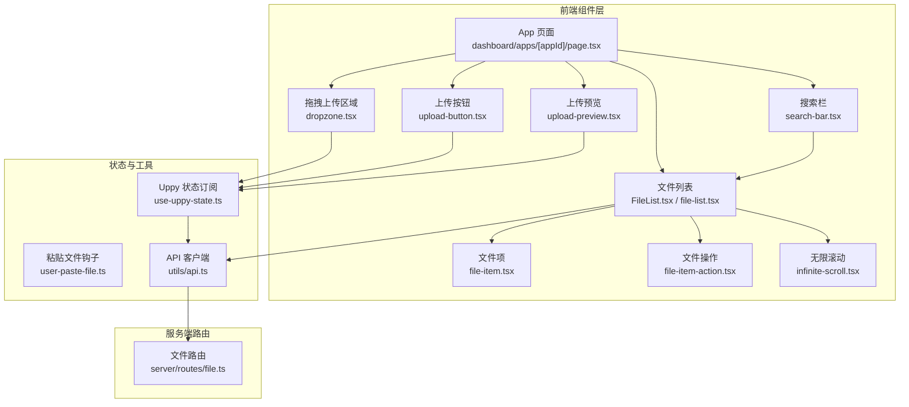
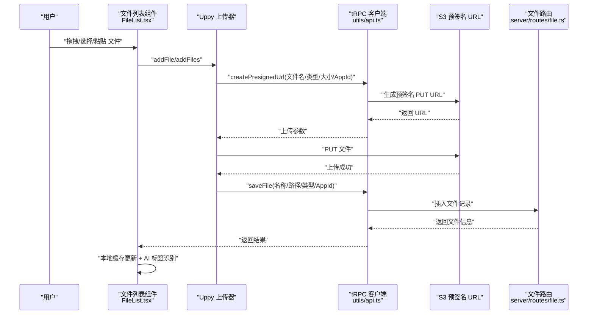
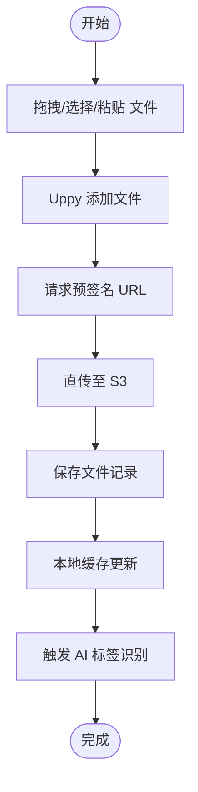
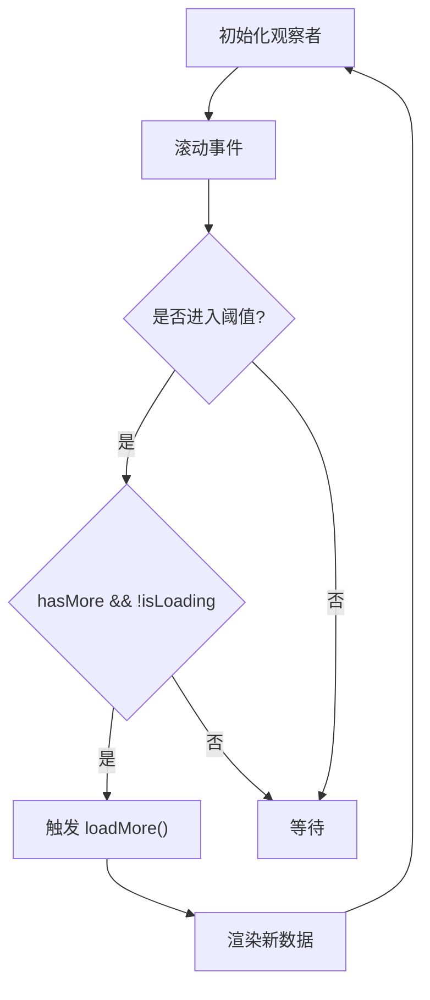
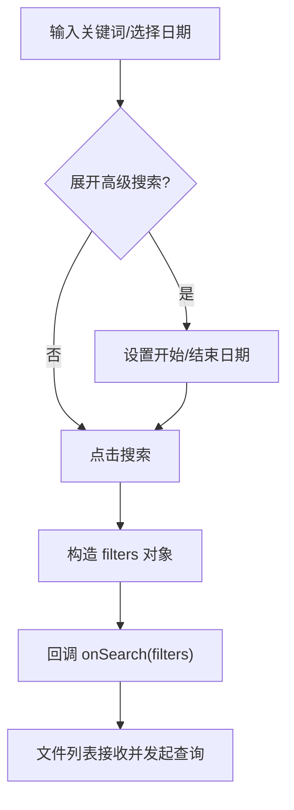
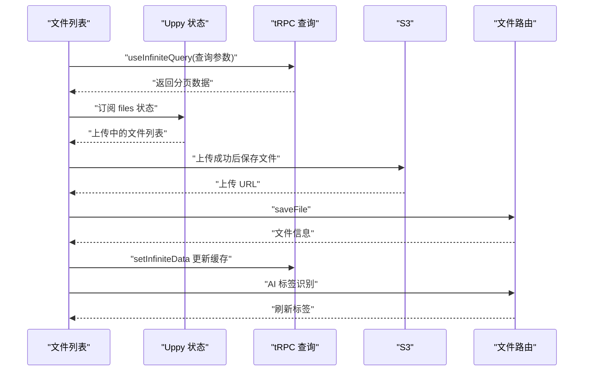
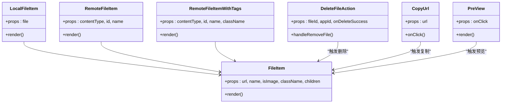
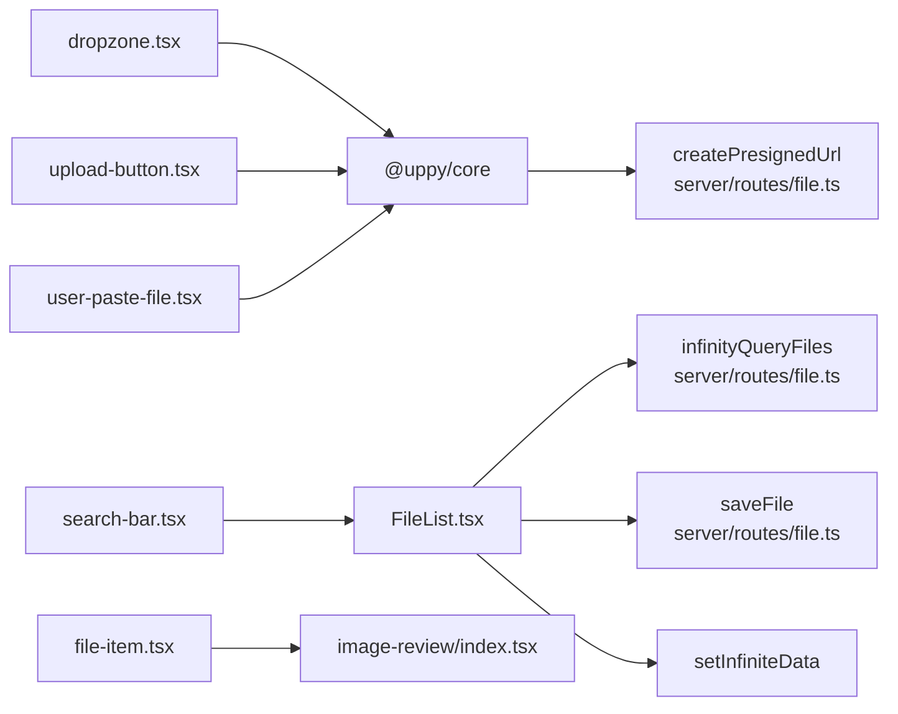

# 功能组件

<cite>
**本文引用的文件**
- [src/components/feature/FileList.tsx](file://src/components/feature/FileList.tsx)
- [src/components/feature/file-list.tsx](file://src/components/feature/file-list.tsx)
- [src/components/feature/dropzone.tsx](file://src/components/feature/dropzone.tsx)
- [src/components/feature/infinite-scroll.tsx](file://src/components/feature/infinite-scroll.tsx)
- [src/components/feature/search-bar.tsx](file://src/components/feature/search-bar.tsx)
- [src/components/feature/file-item.tsx](file://src/components/feature/file-item.tsx)
- [src/components/feature/file-item-action.tsx](file://src/components/feature/file-item-action.tsx)
- [src/components/feature/upload-button.tsx](file://src/components/feature/upload-button.tsx)
- [src/components/feature/upload-preview.tsx](file://src/components/feature/upload-preview.tsx)
- [src/hooks/use-uppy-state.ts](file://src/hooks/use-uppy-state.ts)
- [src/hooks/user-paste-file.ts](file://src/hooks/user-paste-file.ts)
- [src/utils/api.ts](file://src/utils/api.ts)
- [src/app/dashboard/apps/[appId]/page.tsx](file://src/app/dashboard/apps/[appId]/page.tsx)
- [src/app/dashboard/page.tsx](file://src/app/dashboard/page.tsx)
- [src/server/routes/file.ts](file://src/server/routes/file.ts)
- [src/components/ui/image-review/index.tsx](file://src/components/ui/image-review/index.tsx)
</cite>

## 目录

1. [简介](#简介)
2. [项目结构](#项目结构)
3. [核心组件](#核心组件)
4. [架构总览](#架构总览)
5. [组件详解](#组件详解)
6. [依赖关系分析](#依赖关系分析)
7. [性能考量](#性能考量)
8. [故障排查指南](#故障排查指南)
9. [结论](#结论)
10. [附录：集成与配置示例](#附录集成与配置示例)

## 简介

本文件面向 Image SaaS 项目的功能组件，系统性阐述文件上传、无限滚动、搜索等关键能力的设计思路、实现架构与使用方式。文档覆盖组件的业务逻辑、数据流、用户交互模式、状态管理、错误处理与性能优化策略，并提供可复用的集成示例与配置说明，帮助开发者快速上手与扩展。

## 项目结构

功能组件主要位于 src/components/feature 目录，围绕“上传-展示-搜索-无限滚动”闭环构建；同时通过 hooks 与 utils 提供状态订阅与 API 客户端能力；服务端路由在 src/server/routes 下定义，负责预签名 URL、文件列表查询、删除与恢复等操作。

图表来源

- [src/app/dashboard/apps/[appId]/page.tsx](file://src/app/dashboard/apps/[appId]/page.tsx#L178-L206)
- [src/components/feature/dropzone.tsx:1-52](file://src/components/feature/dropzone.tsx#L1-L52)
- [src/components/feature/FileList.tsx:1-366](file://src/components/feature/FileList.tsx#L1-L366)
- [src/components/feature/search-bar.tsx:1-199](file://src/components/feature/search-bar.tsx#L1-L199)
- [src/components/feature/upload-button.tsx:1-46](file://src/components/feature/upload-button.tsx#L1-L46)
- [src/components/feature/file-item.tsx:1-138](file://src/components/feature/file-item.tsx#L1-L138)
- [src/components/feature/file-item-action.tsx:1-112](file://src/components/feature/file-item-action.tsx#L1-L112)
- [src/components/feature/infinite-scroll.tsx:1-55](file://src/components/feature/infinite-scroll.tsx#L1-L55)
- [src/hooks/use-uppy-state.ts:1-17](file://src/hooks/use-uppy-state.ts#L1-L17)
- [src/hooks/user-paste-file.ts:1-34](file://src/hooks/user-paste-file.ts#L1-L34)
- [src/utils/api.ts:1-17](file://src/utils/api.ts#L1-L17)
- [src/server/routes/file.ts:1-561](file://src/server/routes/file.ts#L1-L561)

章节来源

- [src/app/dashboard/apps/[appId]/page.tsx](file://src/app/dashboard/apps/[appId]/page.tsx#L1-L266)
- [src/components/feature/FileList.tsx:1-366](file://src/components/feature/FileList.tsx#L1-L366)
- [src/components/feature/dropzone.tsx:1-52](file://src/components/feature/dropzone.tsx#L1-L52)
- [src/components/feature/search-bar.tsx:1-199](file://src/components/feature/search-bar.tsx#L1-L199)
- [src/components/feature/upload-button.tsx:1-46](file://src/components/feature/upload-button.tsx#L1-L46)
- [src/components/feature/file-item.tsx:1-138](file://src/components/feature/file-item.tsx#L1-L138)
- [src/components/feature/file-item-action.tsx:1-112](file://src/components/feature/file-item-action.tsx#L1-L112)
- [src/components/feature/infinite-scroll.tsx:1-55](file://src/components/feature/infinite-scroll.tsx#L1-L55)
- [src/hooks/use-uppy-state.ts:1-17](file://src/hooks/use-uppy-state.ts#L1-L17)
- [src/hooks/user-paste-file.ts:1-34](file://src/hooks/user-paste-file.ts#L1-L34)
- [src/utils/api.ts:1-17](file://src/utils/api.ts#L1-L17)
- [src/server/routes/file.ts:1-561](file://src/server/routes/file.ts#L1-L561)

## 核心组件

- 文件上传与预签名：通过 Uppy + AWS S3 预签名 URL 完成直传，支持拖拽、点击选择与剪贴板粘贴。
- 文件列表与分组：基于 tRPC 无限查询，按“今天/昨天/日期/年份”分组展示，支持折叠展开与懒加载。
- 搜索与过滤：关键词+日期范围搜索，联动文件列表查询参数。
- 图片预览：基于 rc-image 的增强预览组件，支持缩放、旋转、关闭回调等。
- 文件操作：复制链接、删除（软删除，保留7天）、预览弹窗。

章节来源

- [src/app/dashboard/apps/[appId]/page.tsx](file://src/app/dashboard/apps/[appId]/page.tsx#L56-L72)
- [src/components/feature/FileList.tsx:28-49](file://src/components/feature/FileList.tsx#L28-L49)
- [src/components/feature/search-bar.tsx:27-51](file://src/components/feature/search-bar.tsx#L27-L51)
- [src/components/feature/file-item.tsx:30-59](file://src/components/feature/file-item.tsx#L30-L59)
- [src/components/feature/file-item-action.tsx:24-79](file://src/components/feature/file-item-action.tsx#L24-L79)

## 架构总览

前端通过 tRPC 客户端调用后端路由，后端根据应用配置生成 S3 预签名 URL 并持久化文件元信息。文件列表采用“游标+分页”的无限查询，结合 IntersectionObserver 触发下一页加载；上传完成后即时更新本地缓存并触发 AI 标签识别。

图表来源

- [src/app/dashboard/apps/[appId]/page.tsx](file://src/app/dashboard/apps/[appId]/page.tsx#L56-L72)
- [src/utils/api.ts:1-17](file://src/utils/api.ts#L1-L17)
- [src/server/routes/file.ts:27-90](file://src/server/routes/file.ts#L27-L90)
- [src/components/feature/FileList.tsx:162-202](file://src/components/feature/FileList.tsx#L162-L202)

## 组件详解

### 文件上传组件

- 职责：提供拖拽、点击与粘贴三种上传入口，统一接入 Uppy，生成预签名 URL 并发起直传。
- 关键点：
  - 预签名 URL 由后端路由生成，携带 AppId、文件名、类型与大小。
  - 上传成功后调用保存接口写入数据库，并触发 AI 标签识别与缓存更新。
  - 支持多文件批量添加与进度收集，用于“今日上传”占位展示。

图表来源

- [src/app/dashboard/apps/[appId]/page.tsx](file://src/app/dashboard/apps/[appId]/page.tsx#L56-L72)
- [src/server/routes/file.ts:27-90](file://src/server/routes/file.ts#L27-L90)
- [src/components/feature/FileList.tsx:162-202](file://src/components/feature/FileList.tsx#L162-L202)

章节来源

- [src/components/feature/dropzone.tsx:1-52](file://src/components/feature/dropzone.tsx#L1-L52)
- [src/components/feature/upload-button.tsx:1-46](file://src/components/feature/upload-button.tsx#L1-L46)
- [src/hooks/user-paste-file.ts:1-34](file://src/hooks/user-paste-file.ts#L1-L34)
- [src/app/dashboard/apps/[appId]/page.tsx](file://src/app/dashboard/apps/[appId]/page.tsx#L56-L72)
- [src/server/routes/file.ts:27-90](file://src/server/routes/file.ts#L27-L90)
- [src/components/feature/FileList.tsx:162-202](file://src/components/feature/FileList.tsx#L162-L202)

### 无限滚动组件

- 职责：监听滚动到底部，触发加载更多，避免重复请求与空请求。
- 关键点：
  - 使用 IntersectionObserver 在阈值内触发 loadMore。
  - 通过 hasMore 与 isLoading 控制加载状态显示。
  - 与文件列表的游标分页配合，实现平滑下拉加载。

图表来源

- [src/components/feature/infinite-scroll.tsx:1-55](file://src/components/feature/infinite-scroll.tsx#L1-L55)
- [src/components/feature/FileList.tsx:132-150](file://src/components/feature/FileList.tsx#L132-L150)

章节来源

- [src/components/feature/infinite-scroll.tsx:1-55](file://src/components/feature/infinite-scroll.tsx#L1-L55)
- [src/components/feature/FileList.tsx:132-150](file://src/components/feature/FileList.tsx#L132-L150)

### 搜索组件

- 职责：支持关键词与日期范围搜索，提供展开/收起高级面板与清除功能。
- 关键点：
  - 输入变更不立即触发查询，点击搜索或回车时统一构造 filters。
  - 日期格式化为 yyyy-MM-dd，便于后端比较。
  - 将 filters 透传给文件列表查询，实现搜索联动。

图表来源

- [src/components/feature/search-bar.tsx:27-51](file://src/components/feature/search-bar.tsx#L27-L51)
- [src/components/feature/FileList.tsx:29-38](file://src/components/feature/FileList.tsx#L29-L38)

章节来源

- [src/components/feature/search-bar.tsx:1-199](file://src/components/feature/search-bar.tsx#L1-L199)
- [src/components/feature/FileList.tsx:29-38](file://src/components/feature/FileList.tsx#L29-L38)

### 文件列表组件

- 职责：展示文件列表，按日期分组与折叠，支持“今日上传”占位、删除、复制链接、预览。
- 关键点：
  - 使用 tRPC 无限查询，游标分页 + 分组展示。
  - 通过 useUppyState 订阅 Uppy 文件状态，渲染“正在上传”的占位图。
  - 上传成功后，优先更新第一页数据，再触发 AI 标签刷新。
  - 删除成功回调中，同步从本地缓存移除对应条目。

图表来源

- [src/components/feature/FileList.tsx:28-49](file://src/components/feature/FileList.tsx#L28-L49)
- [src/components/feature/FileList.tsx:126-235](file://src/components/feature/FileList.tsx#L126-L235)
- [src/server/routes/file.ts:135-234](file://src/server/routes/file.ts#L135-L234)

章节来源

- [src/components/feature/FileList.tsx:1-366](file://src/components/feature/FileList.tsx#L1-L366)
- [src/components/feature/file-list.tsx:1-373](file://src/components/feature/file-list.tsx#L1-L373)
- [src/hooks/use-uppy-state.ts:1-17](file://src/hooks/use-uppy-state.ts#L1-L17)
- [src/server/routes/file.ts:135-234](file://src/server/routes/file.ts#L135-L234)

### 文件项与操作

- 文件项组件：统一渲染图片/非图片占位，支持预览弹窗。
- 操作组件：复制链接、删除（软删除）、预览按钮；删除前二次确认，删除成功后通知与缓存更新。

图表来源

- [src/components/feature/file-item.tsx:1-138](file://src/components/feature/file-item.tsx#L1-L138)
- [src/components/feature/file-item-action.tsx:1-112](file://src/components/feature/file-item-action.tsx#L1-L112)

章节来源

- [src/components/feature/file-item.tsx:1-138](file://src/components/feature/file-item.tsx#L1-L138)
- [src/components/feature/file-item-action.tsx:1-112](file://src/components/feature/file-item-action.tsx#L1-L112)

### 图片预览组件

- 基于 rc-image 的增强封装，支持自定义图标与预览回调，如关闭时清空预览状态。
- 在文件项中作为图片渲染容器，提供缩放、旋转等交互。

章节来源

- [src/components/ui/image-review/index.tsx:1-25](file://src/components/ui/image-review/index.tsx#L1-L25)
- [src/components/feature/file-item.tsx:30-59](file://src/components/feature/file-item.tsx#L30-L59)

## 依赖关系分析

- 组件耦合：
  - 文件列表强依赖 tRPC 查询与 Uppy 状态；与搜索栏通过 filters 解耦。
  - 拖拽/上传按钮与粘贴钩子共同汇聚到 Uppy。
- 外部依赖：
  - Uppy + AWS S3 预签名直传。
  - rc-image 提供图片预览能力。
  - tRPC React Query 客户端与服务端路由对接。
- 可能的循环依赖：未发现直接循环导入；组件间通过 props 与回调传递数据。

图表来源

- [src/components/feature/dropzone.tsx:1-52](file://src/components/feature/dropzone.tsx#L1-L52)
- [src/components/feature/upload-button.tsx:1-46](file://src/components/feature/upload-button.tsx#L1-L46)
- [src/hooks/user-paste-file.ts:1-34](file://src/hooks/user-paste-file.ts#L1-L34)
- [src/server/routes/file.ts:27-90](file://src/server/routes/file.ts#L27-L90)
- [src/components/feature/FileList.tsx:28-49](file://src/components/feature/FileList.tsx#L28-L49)
- [src/components/feature/search-bar.tsx:27-51](file://src/components/feature/search-bar.tsx#L27-L51)
- [src/components/ui/image-review/index.tsx:1-25](file://src/components/ui/image-review/index.tsx#L1-L25)

章节来源

- [src/components/feature/FileList.tsx:1-366](file://src/components/feature/FileList.tsx#L1-L366)
- [src/server/routes/file.ts:135-234](file://src/server/routes/file.ts#L135-L234)
- [src/utils/api.ts:1-17](file://src/utils/api.ts#L1-L17)

## 性能考量

- 列表渲染优化：
  - 使用 useMemo 缓存分组与查询参数，减少无效重渲染。
  - 仅对第一页进行“今日上传”占位更新，降低全量 diff。
- 无限滚动：
  - IntersectionObserver 阈值控制与 hasMore/isLoading 防抖，避免重复请求。
- 本地缓存：
  - 使用 tRPC 的 setInfiniteData 原地更新，减少网络往返。
- 图片预览：
  - 预览时动态拼接尺寸参数，避免大图频繁加载。
- 错误与降级：
  - 上传失败时保持本地状态，允许重新上传；AI 识别异常不影响主流程。

章节来源

- [src/components/feature/FileList.tsx:50-90](file://src/components/feature/FileList.tsx#L50-L90)
- [src/components/feature/infinite-scroll.tsx:12-37](file://src/components/feature/infinite-scroll.tsx#L12-L37)
- [src/components/feature/file-item.tsx:40-58](file://src/components/feature/file-item.tsx#L40-L58)

## 故障排查指南

- 无法生成预签名 URL
  - 检查 App 是否配置存储、用户权限是否匹配。
  - 查看后端错误码与消息，确认请求参数（文件名/类型/大小/AppId）。
- 上传成功但列表未更新
  - 确认上传成功回调已触发 saveFile 与 setInfiniteData。
  - 检查 appId 与当前应用一致。
- AI 标签识别失败
  - 后端识别接口抛错会捕获并打印日志，不影响文件入库。
- 删除后仍可见
  - 确认删除 mutation 成功且本地缓存已更新；检查 isPending 与回调时机。

章节来源

- [src/server/routes/file.ts:40-61](file://src/server/routes/file.ts#L40-L61)
- [src/components/feature/FileList.tsx:170-202](file://src/components/feature/FileList.tsx#L170-L202)
- [src/components/feature/file-item-action.tsx:24-38](file://src/components/feature/file-item-action.tsx#L24-L38)

## 结论

本项目以 Uppy + S3 预签名直传为核心，结合 tRPC 无限查询与本地缓存，实现了高效、可扩展的图片管理能力。文件列表、搜索与无限滚动三大组件协同工作，既保证了良好的用户体验，也兼顾了性能与可维护性。通过清晰的职责划分与稳定的通信机制，开发者可以在此基础上快速扩展更多功能。

## 附录：集成与配置示例

### 在页面中集成上传与列表

- 在应用页面中初始化 Uppy 并注入 AWS S3 插件，随后将 uppy 与搜索 filters 传入文件列表组件。
- 示例路径参考：
  - [Uppy 初始化与粘贴钩子:56-82](file://src/app/dashboard/apps/[appId]/page.tsx#L56-L82)
  - [文件列表渲染与 Tabs 切换:178-256](file://src/app/dashboard/apps/[appId]/page.tsx#L178-L256)

章节来源

- [src/app/dashboard/apps/[appId]/page.tsx](file://src/app/dashboard/apps/[appId]/page.tsx#L56-L82)
- [src/app/dashboard/apps/[appId]/page.tsx](file://src/app/dashboard/apps/[appId]/page.tsx#L178-L256)

### 配置项与行为说明

- 文件列表
  - 参数：uppy、appId、orderBy、searchFilters
  - 行为：无限查询、分组展示、折叠控制、删除回调、上传占位
  - 参考：[文件列表实现:21-366](file://src/components/feature/FileList.tsx#L21-L366)
- 搜索栏
  - 参数：onSearch、className
  - 行为：关键词与日期范围过滤，展开/收起高级面板，清除按钮
  - 参考：[搜索栏实现:22-199](file://src/components/feature/search-bar.tsx#L22-L199)
- 无限滚动
  - 参数：children、loadMore、hasMore、isLoading、threshold
  - 行为：底部哨兵触发加载
  - 参考：[无限滚动实现:4-55](file://src/components/feature/infinite-scroll.tsx#L4-L55)
- 上传入口
  - 拖拽：[dropzone:4-52](file://src/components/feature/dropzone.tsx#L4-L52)
  - 点击：[upload-button:6-46](file://src/components/feature/upload-button.tsx#L6-L46)
  - 粘贴：[user-paste-file:3-34](file://src/hooks/user-paste-file.ts#L3-L34)

章节来源

- [src/components/feature/FileList.tsx:21-366](file://src/components/feature/FileList.tsx#L21-L366)
- [src/components/feature/search-bar.tsx:22-199](file://src/components/feature/search-bar.tsx#L22-L199)
- [src/components/feature/infinite-scroll.tsx:4-55](file://src/components/feature/infinite-scroll.tsx#L4-L55)
- [src/components/feature/dropzone.tsx:4-52](file://src/components/feature/dropzone.tsx#L4-L52)
- [src/components/feature/upload-button.tsx:6-46](file://src/components/feature/upload-button.tsx#L6-L46)
- [src/hooks/user-paste-file.ts:3-34](file://src/hooks/user-paste-file.ts#L3-L34)
