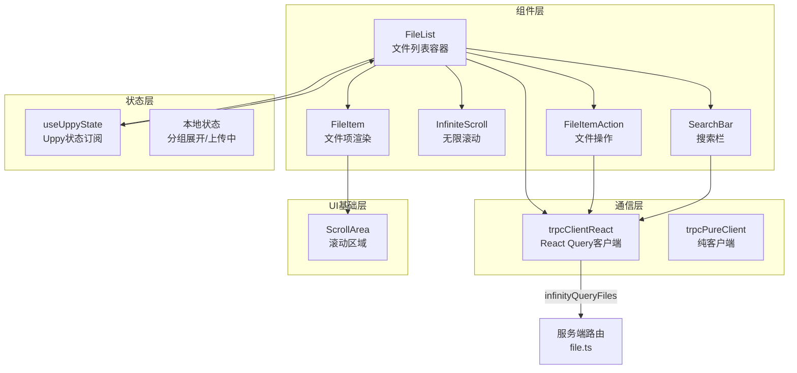
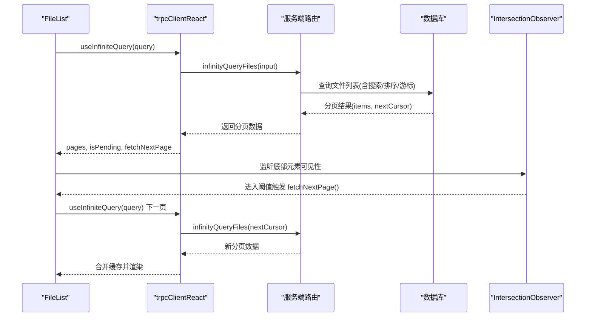
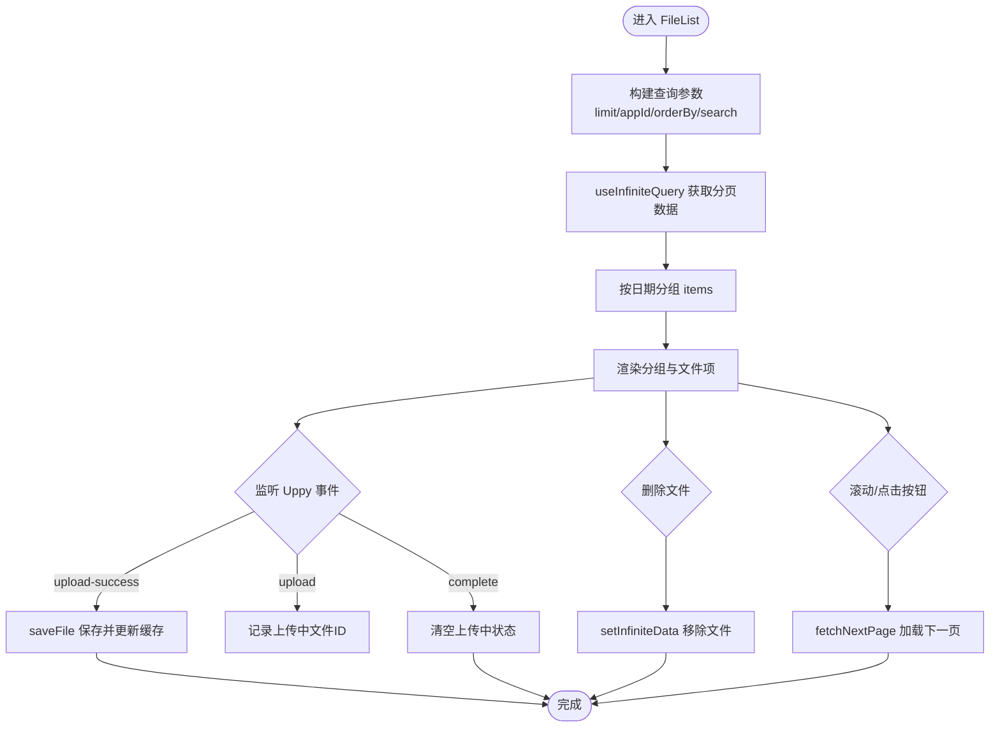
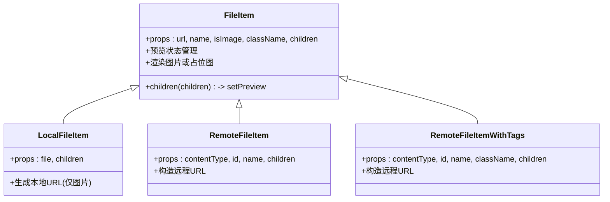
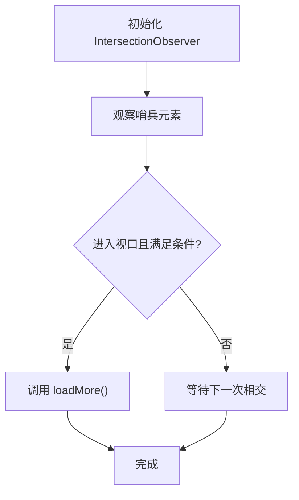
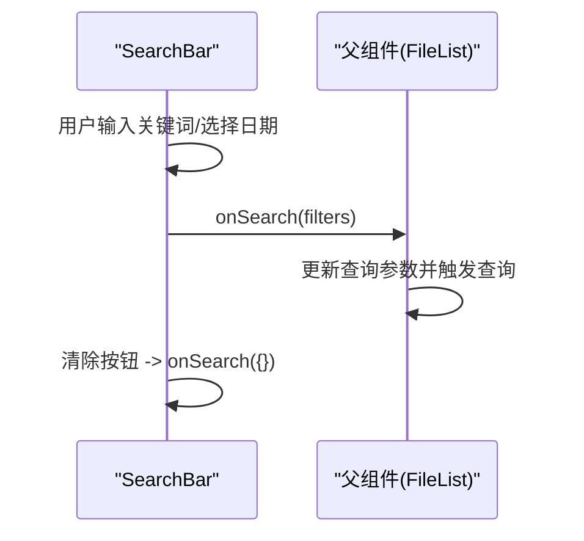
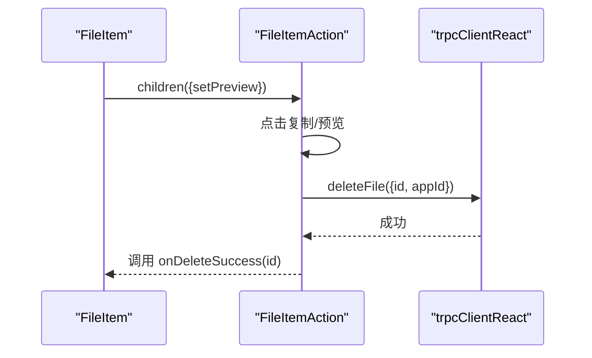
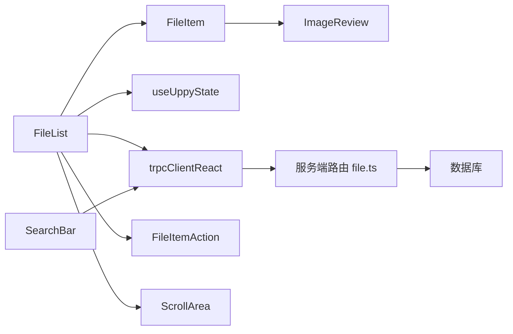

# 数据展示组件

<cite>
**本文引用的文件**
- [FileList.tsx](file://src/components/feature/FileList.tsx)
- [file-list.tsx](file://src/components/feature/file-list.tsx)
- [file-item.tsx](file://src/components/feature/file-item.tsx)
- [infinite-scroll.tsx](file://src/components/feature/infinite-scroll.tsx)
- [search-bar.tsx](file://src/components/feature/search-bar.tsx)
- [file-item-action.tsx](file://src/components/feature/file-item-action.tsx)
- [use-uppy-state.ts](file://src/hooks/use-uppy-state.ts)
- [api.ts](file://src/utils/api.ts)
- [scroll-area.tsx](file://src/components/ui/scroll-area.tsx)
- [page.tsx](file://src/app/dashboard/page.tsx)
- [file.ts](file://src/server/routes/file.ts)
</cite>

## 目录
1. [简介](#简介)
2. [项目结构](#项目结构)
3. [核心组件](#核心组件)
4. [架构总览](#架构总览)
5. [组件详细分析](#组件详细分析)
6. [依赖关系分析](#依赖关系分析)
7. [性能考量](#性能考量)
8. [故障排查指南](#故障排查指南)
9. [结论](#结论)
10. [附录](#附录)

## 简介
本技术文档围绕数据展示组件体系，系统性解析 FileList、FileItem、InfiniteScroll、SearchBar 等组件的设计理念、实现架构与交互流程。重点涵盖：
- 文件列表渲染优化与分组展示
- 虚拟滚动（基于 IntersectionObserver）实现
- 搜索过滤机制与后端 API 集成
- 组件间数据绑定、状态同步与性能优化策略
- 无限滚动加载策略、搜索算法实现与用户体验优化
- 组件配置参数、事件回调与可扩展点
- 组件间通信机制与后端 API 集成模式

## 项目结构
数据展示组件位于前端组件目录，配合上传、状态管理、UI 基础组件与服务端路由共同构成完整的数据流：
- 组件层：FileList、FileItem、InfiniteScroll、SearchBar 及其动作组件
- 状态层：Uppy 状态订阅与本地状态管理
- 通信层：trpc 客户端与服务端 API
- UI 基础层：ScrollArea、Button、Dialog 等基础 UI 组件

图表来源
- [FileList.tsx:28-366](file://src/components/feature/FileList.tsx#L28-L366)
- [file-item.tsx:17-138](file://src/components/feature/file-item.tsx#L17-L138)
- [infinite-scroll.tsx:12-55](file://src/components/feature/infinite-scroll.tsx#L12-L55)
- [search-bar.tsx:27-199](file://src/components/feature/search-bar.tsx#L27-L199)
- [file-item-action.tsx:24-112](file://src/components/feature/file-item-action.tsx#L24-L112)
- [use-uppy-state.ts:4-17](file://src/hooks/use-uppy-state.ts#L4-L17)
- [api.ts:5-17](file://src/utils/api.ts#L5-L17)
- [scroll-area.tsx:8-59](file://src/components/ui/scroll-area.tsx#L8-L59)
- [file.ts:135-220](file://src/server/routes/file.ts#L135-L220)

章节来源
- [FileList.tsx:28-366](file://src/components/feature/FileList.tsx#L28-L366)
- [file-list.tsx:28-373](file://src/components/feature/file-list.tsx#L28-L373)
- [file-item.tsx:17-138](file://src/components/feature/file-item.tsx#L17-L138)
- [infinite-scroll.tsx:12-55](file://src/components/feature/infinite-scroll.tsx#L12-L55)
- [search-bar.tsx:27-199](file://src/components/feature/search-bar.tsx#L27-L199)
- [file-item-action.tsx:24-112](file://src/components/feature/file-item-action.tsx#L24-L112)
- [use-uppy-state.ts:4-17](file://src/hooks/use-uppy-state.ts#L4-L17)
- [api.ts:5-17](file://src/utils/api.ts#L5-L17)
- [scroll-area.tsx:8-59](file://src/components/ui/scroll-area.tsx#L8-L59)
- [file.ts:135-220](file://src/server/routes/file.ts#L135-L220)

## 核心组件
- FileList：聚合查询、分组渲染、无限滚动、上传集成、删除与预览交互
- FileItem：通用文件项渲染，支持本地/远程资源、预览弹窗
- InfiniteScroll：基于 IntersectionObserver 的懒加载哨兵
- SearchBar：关键词与日期范围搜索，过滤器透传至查询
- FileItemAction：复制链接、预览、删除等文件操作
- useUppyState：Uppy 状态订阅 Hook，用于实时感知上传进度
- trpc 客户端：React Query 与纯客户端封装，统一调用后端 API

章节来源
- [FileList.tsx:28-366](file://src/components/feature/FileList.tsx#L28-L366)
- [file-item.tsx:17-138](file://src/components/feature/file-item.tsx#L17-L138)
- [infinite-scroll.tsx:12-55](file://src/components/feature/infinite-scroll.tsx#L12-L55)
- [search-bar.tsx:27-199](file://src/components/feature/search-bar.tsx#L27-L199)
- [file-item-action.tsx:24-112](file://src/components/feature/file-item-action.tsx#L24-L112)
- [use-uppy-state.ts:4-17](file://src/hooks/use-uppy-state.ts#L4-L17)
- [api.ts:5-17](file://src/utils/api.ts#L5-L17)

## 架构总览
数据从服务端通过 trpc 查询返回，前端使用 React Query 缓存与分页游标，结合 IntersectionObserver 触发下一页加载；同时支持搜索过滤与上传集成，实现“所见即所得”的实时更新。

图表来源
- [FileList.tsx:40-49](file://src/components/feature/FileList.tsx#L40-L49)
- [file.ts:135-220](file://src/server/routes/file.ts#L135-L220)

## 组件详细分析

### FileList 组件
职责与特性
- 使用 React Query 的 useInfiniteQuery 获取分页数据，设置游标参数与禁用自动刷新
- 将所有分页 items 扁平化并按创建日期分组（今日/昨日/某月某日/某年某月某日）
- 支持 Collapsible 折叠分组，维护展开状态
- 上传集成：监听 Uppy 事件，保存文件并预热缓存；对图片文件触发 AI 标签识别
- 删除集成：通过 trpc 更新缓存，移除对应文件
- 无限滚动：滚动到底部或点击按钮触发 fetchNextPage

关键实现要点
- 查询构建：limit、appId、orderBy、searchFilters 透传给服务端
- 分组逻辑：基于 createdAt 计算分组键，避免重复计算
- 上传处理：upload-success 时调用 saveFile 并更新缓存；upload 时收集上传中文件 ID
- 删除处理：setInfiniteData 在第一页 items 中过滤目标文件
- 无限滚动：IntersectionObserver 阈值 0.1，底部哨兵触发 fetchNextPage

图表来源
- [FileList.tsx:30-49](file://src/components/feature/FileList.tsx#L30-L49)
- [FileList.tsx:52-90](file://src/components/feature/FileList.tsx#L52-L90)
- [FileList.tsx:106-124](file://src/components/feature/FileList.tsx#L106-L124)
- [FileList.tsx:132-150](file://src/components/feature/FileList.tsx#L132-L150)
- [FileList.tsx:152-235](file://src/components/feature/FileList.tsx#L152-L235)

章节来源
- [FileList.tsx:28-366](file://src/components/feature/FileList.tsx#L28-L366)
- [file-list.tsx:28-373](file://src/components/feature/file-list.tsx#L28-L373)

### FileItem 组件族
职责与特性
- FileItem：通用文件项容器，支持图片与非图片资源；图片支持预览弹窗
- LocalFileItem：本地文件转 URL，仅图片可预览
- RemoteFileItem/RemoteFileItemWithTags：远程文件项，根据 contentType 判断是否图片
- 预览弹窗：ImageReview 提供缩放与全屏预览，支持自定义 imageRender

图表来源
- [file-item.tsx:17-138](file://src/components/feature/file-item.tsx#L17-L138)

章节来源
- [file-item.tsx:17-138](file://src/components/feature/file-item.tsx#L17-L138)

### InfiniteScroll 组件
职责与特性
- 基于 IntersectionObserver 的懒加载哨兵
- 支持 threshold 自定义距离阈值
- hasMore 与 isLoading 控制加载状态显示
- 仅在有更多数据且非加载中时触发 loadMore

图表来源
- [infinite-scroll.tsx:16-37](file://src/components/feature/infinite-scroll.tsx#L16-L37)

章节来源
- [infinite-scroll.tsx:12-55](file://src/components/feature/infinite-scroll.tsx#L12-L55)

### SearchBar 组件
职责与特性
- 输入关键词与日期范围，支持展开高级搜索面板
- Enter 键触发行搜索
- 过滤器对象透传给父组件，由父组件注入到查询参数
- 清除按钮一键清空过滤器并触发空查询

图表来源
- [search-bar.tsx:35-61](file://src/components/feature/search-bar.tsx#L35-L61)
- [search-bar.tsx:168-198](file://src/components/feature/search-bar.tsx#L168-L198)

章节来源
- [search-bar.tsx:27-199](file://src/components/feature/search-bar.tsx#L27-L199)

### FileItemAction 组件
职责与特性
- 复制文件链接：使用 copy-to-clipboard，toast 提示
- 预览：触发父组件传入的 setPreview 回调
- 删除：对话框确认，调用 deleteFile，成功后回调 onDeleteSuccess

图表来源
- [file-item-action.tsx:24-112](file://src/components/feature/file-item-action.tsx#L24-L112)

章节来源
- [file-item-action.tsx:24-112](file://src/components/feature/file-item-action.tsx#L24-L112)

### 状态与通信机制
- Uppy 状态订阅：useUppyState 将 Uppy store 与 React 状态同步，用于实时显示上传中的文件
- 上传事件：upload-success 保存文件并更新缓存；upload 记录上传中文件 ID；complete 清空状态
- 删除事件：通过 trpc 更新缓存，确保 UI 即时反映

章节来源
- [use-uppy-state.ts:4-17](file://src/hooks/use-uppy-state.ts#L4-L17)
- [FileList.tsx:126-129](file://src/components/feature/FileList.tsx#L126-L129)
- [FileList.tsx:152-235](file://src/components/feature/FileList.tsx#L152-L235)
- [file-item-action.tsx:27-38](file://src/components/feature/file-item-action.tsx#L27-L38)

## 依赖关系分析
- 组件耦合
  - FileList 依赖 trpc、Uppy、Collapsible、ScrollArea、FileItemAction
  - FileItem 依赖 ImageReview 与 Image，支持预览与占位
  - InfiniteScroll 仅依赖 IntersectionObserver，低耦合
  - SearchBar 依赖 UI 组件与日期格式化库
- 外部依赖
  - trpc 客户端：React Query 与 httpBatchLink
  - AWS S3：通过 presigned URL 上传
  - Radix UI：ScrollArea 实现滚动条
- 数据流
  - 前端：查询参数 -> React Query -> 分页数据 -> 渲染
  - 后端：查询参数 -> SQL 构造 -> 游标分页 -> 返回数据

图表来源
- [FileList.tsx:28-366](file://src/components/feature/FileList.tsx#L28-L366)
- [file-item.tsx:17-138](file://src/components/feature/file-item.tsx#L17-L138)
- [search-bar.tsx:27-199](file://src/components/feature/search-bar.tsx#L27-L199)
- [api.ts:5-17](file://src/utils/api.ts#L5-L17)
- [file.ts:135-220](file://src/server/routes/file.ts#L135-L220)

章节来源
- [api.ts:5-17](file://src/utils/api.ts#L5-L17)
- [file.ts:135-220](file://src/server/routes/file.ts#L135-L220)

## 性能考量
- 渲染优化
  - useMemo 缓存分组结果与查询参数，减少重复计算
  - 仅在第一页 items 中执行删除与新增，降低缓存写入成本
- 无限滚动
  - IntersectionObserver 阈值 0.1，提前触发加载，提升体验
  - hasMore 与 isLoading 防止重复请求
- 查询与缓存
  - React Query useInfiniteQuery 自动合并分页，设置 getNextPageParam
  - setInfiniteData 直接更新缓存，避免二次网络请求
- 上传与预览
  - 本地图片使用 URL.createObjectURL，避免额外请求
  - 图片上传后触发 AI 标签识别，异步刷新标签缓存

章节来源
- [FileList.tsx:52-90](file://src/components/feature/FileList.tsx#L52-L90)
- [FileList.tsx:106-124](file://src/components/feature/FileList.tsx#L106-L124)
- [infinite-scroll.tsx:16-37](file://src/components/feature/infinite-scroll.tsx#L16-L37)
- [file-item.tsx:77-84](file://src/components/feature/file-item.tsx#L77-L84)

## 故障排查指南
- 无限滚动不触发
  - 检查底部哨兵元素是否存在与可见性
  - 确认 hasMore 与 isLoading 状态
  - 查看 IntersectionObserver 配置与阈值
- 搜索无效
  - 确认 SearchBar 的 onSearch 是否被正确传入父组件
  - 检查查询参数中 searchFilters 是否正确透传
- 删除不生效
  - 确认 onDeleteSuccess 回调是否更新了缓存
  - 检查 appId 与 fileId 是否正确
- 上传后未显示
  - 检查 upload-success 事件是否触发
  - 确认 saveFile 是否成功并更新缓存
  - 非图片文件不会触发 AI 标签识别

章节来源
- [infinite-scroll.tsx:16-37](file://src/components/feature/infinite-scroll.tsx#L16-L37)
- [search-bar.tsx:35-61](file://src/components/feature/search-bar.tsx#L35-L61)
- [file-item-action.tsx:27-38](file://src/components/feature/file-item-action.tsx#L27-L38)
- [FileList.tsx:152-235](file://src/components/feature/FileList.tsx#L152-L235)

## 结论
该数据展示组件体系以 React Query 与 IntersectionObserver 为核心，实现了高性能的文件列表渲染、搜索过滤与无限滚动加载。通过 Uppy 与 trpc 的紧密集成，实现了上传、删除、预览等关键业务流程的实时反馈。组件设计遵循高内聚、低耦合原则，具备良好的可扩展性与可维护性。

## 附录

### 组件配置参数与事件回调
- FileList
  - 参数：uppy, appId, orderBy, searchFilters
  - 事件：onSearch（由父组件传入，透传过滤器）
- FileItem
  - 参数：url, name, isImage, className, children
  - 子组件回调：children({ setPreview })
- InfiniteScroll
  - 参数：children, loadMore, hasMore, isLoading, threshold
- SearchBar
  - 参数：onSearch, className
  - 过滤器：query, startDate, endDate
- FileItemAction
  - 参数：fileId, appId, onDeleteSuccess
  - 事件：复制链接、预览、删除

章节来源
- [FileList.tsx:21-26](file://src/components/feature/FileList.tsx#L21-L26)
- [file-item.tsx:10-16](file://src/components/feature/file-item.tsx#L10-L16)
- [infinite-scroll.tsx:4-10](file://src/components/feature/infinite-scroll.tsx#L4-L10)
- [search-bar.tsx:22-25](file://src/components/feature/search-bar.tsx#L22-L25)
- [file-item-action.tsx:18-22](file://src/components/feature/file-item-action.tsx#L18-L22)

### 后端 API 集成模式
- 查询接口：infinityQueryFiles
  - 输入：cursor、limit、orderBy、appId、search
  - 输出：items、nextCursor
- 上传接口：createPresignedUrl/saveFile
  - createPresignedUrl：生成带签名的上传 URL
  - saveFile：保存文件元信息并返回新文件

章节来源
- [file.ts:135-220](file://src/server/routes/file.ts#L135-L220)
- [page.tsx:31-47](file://src/app/dashboard/page.tsx#L31-L47)