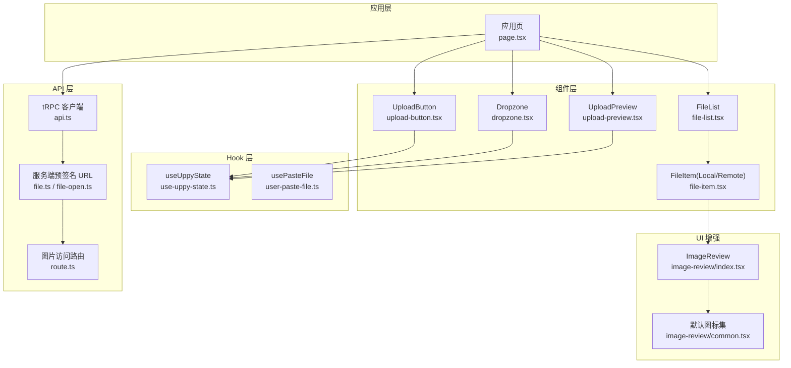
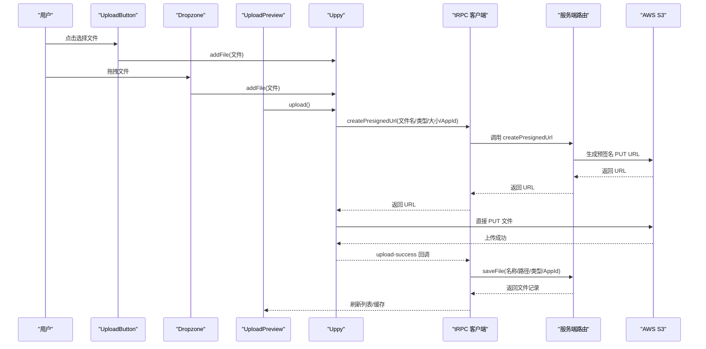
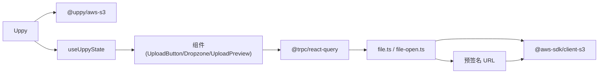

# 文件上传组件

<cite>
**本文引用的文件**
- [upload-button.tsx](file://src/components/feature/upload-button.tsx)
- [dropzone.tsx](file://src/components/feature/dropzone.tsx)
- [upload-preview.tsx](file://src/components/feature/upload-preview.tsx)
- [use-uppy-state.ts](file://src/hooks/use-uppy-state.ts)
- [user-paste-file.ts](file://src/hooks/user-paste-file.ts)
- [file-item.tsx](file://src/components/feature/file-item.tsx)
- [file-list.tsx](file://src/components/feature/file-list.tsx)
- [image-review/index.tsx](file://src/components/ui/image-review/index.tsx)
- [image-review/common.tsx](file://src/components/ui/image-review/common.tsx)
- [page.tsx](file://src/app/dashboard/apps/[appId]/page.tsx)
- [api.ts](file://src/utils/api.ts)
- [file-open.ts](file://src/server/routes/file-open.ts)
- [file.ts](file://src/server/routes/file.ts)
- [route.ts](file://src/app/image/[id]/route.ts)
</cite>

## 目录
1. [简介](#简介)
2. [项目结构](#项目结构)
3. [核心组件](#核心组件)
4. [架构总览](#架构总览)
5. [详细组件分析](#详细组件分析)
6. [依赖关系分析](#依赖关系分析)
7. [性能考量](#性能考量)
8. [故障排查指南](#故障排查指南)
9. [结论](#结论)
10. [附录](#附录)

## 简介
本文件上传组件以 Uppy 为核心引擎，结合 tRPC 客户端与服务端路由，实现从本地文件选择、拖拽上传、预览、到云端存储的完整生命周期。组件包括 UploadButton（选择文件按钮）、Dropzone（拖拽区域）、UploadPreview（上传预览对话框）以及 FileList（文件列表展示与上传进度联动）。同时，系统支持剪贴板粘贴图片、AWS S3 预签名 URL 上传、图片缩略与预览增强、无限滚动加载与标签识别等能力。

## 项目结构
围绕上传功能的关键目录与文件如下：
- 组件层：UploadButton、Dropzone、UploadPreview、FileList、FileItem 及其操作动作
- Hook 层：useUppyState（订阅 Uppy 状态）、usePasteFile（剪贴板监听）
- UI 增强：ImageReview（基于 rc-image 的图片预览增强）
- 应用入口：应用页负责初始化 Uppy、注册 AWS S3 插件、挂载组件
- API 层：tRPC 客户端与服务端路由（文件上传、保存记录、图片访问）

图表来源
- [page.tsx:56-72](file://src/app/dashboard/apps/[appId]/page.tsx#L56-L72)
- [upload-button.tsx:10-43](file://src/components/feature/upload-button.tsx#L10-L43)
- [dropzone.tsx:9-49](file://src/components/feature/dropzone.tsx#L9-L49)
- [upload-preview.tsx:19-116](file://src/components/feature/upload-preview.tsx#L19-L116)
- [file-list.tsx:28-235](file://src/components/feature/file-list.tsx#L28-L235)
- [file-item.tsx:75-137](file://src/components/feature/file-item.tsx#L75-L137)
- [use-uppy-state.ts:4-14](file://src/hooks/use-uppy-state.ts#L4-L14)
- [user-paste-file.ts:3-31](file://src/hooks/user-paste-file.ts#L3-L31)
- [image-review/index.tsx:6-22](file://src/components/ui/image-review/index.tsx#L6-L22)
- [image-review/common.tsx:15-25](file://src/components/ui/image-review/common.tsx#L15-L25)
- [api.ts:5-13](file://src/utils/api.ts#L5-L13)
- [file.ts:26-89](file://src/server/routes/file.ts#L26-L89)
- [file-open.ts:30-87](file://src/server/routes/file-open.ts#L30-L87)
- [route.ts:8-88](file://src/app/image/[id]/route.ts#L8-L88)

章节来源
- [page.tsx:23-265](file://src/app/dashboard/apps/[appId]/page.tsx#L23-L265)

## 核心组件
- UploadButton：封装隐藏的文件输入，点击触发系统文件选择器，并将选中的文件逐一加入 Uppy 队列；清空 input 值避免重复触发。
- Dropzone：包裹可拖拽区域，处理 dragenter/dragleave/dragover/drop 事件，将拖入的文件批量加入 Uppy；通过定时器优化拖拽状态切换体验。
- UploadPreview：基于 Uppy 当前队列显示预览，支持左右切换、删除单个文件、一键上传所有文件；关闭时清理队列。
- FileList：展示远端文件列表，与 Uppy 事件联动，实时显示上传中的本地文件；上传成功后调用 tRPC 保存记录并刷新缓存；支持无限滚动与分组展示。
- useUppyState：基于 useSyncExternalStore 订阅 Uppy Store，按选择器返回片段状态，避免不必要的重渲染。
- usePasteFile：监听剪贴板事件，提取剪贴板中的文件并回调给上层（如直接加入 Uppy）。
- FileItem：统一渲染本地/远端文件项，本地文件使用 URL.createObjectURL 生成预览，远端文件使用 /image/:id 路由；支持图片预览增强与操作按钮。
- ImageReview：对 rc-image 的预览行为进行增强，合并默认图标集，保持一致的交互体验。

章节来源
- [upload-button.tsx:10-43](file://src/components/feature/upload-button.tsx#L10-L43)
- [dropzone.tsx:9-49](file://src/components/feature/dropzone.tsx#L9-L49)
- [upload-preview.tsx:19-116](file://src/components/feature/upload-preview.tsx#L19-L116)
- [file-list.tsx:28-235](file://src/components/feature/file-list.tsx#L28-L235)
- [use-uppy-state.ts:4-14](file://src/hooks/use-uppy-state.ts#L4-L14)
- [user-paste-file.ts:3-31](file://src/hooks/user-paste-file.ts#L3-L31)
- [file-item.tsx:75-137](file://src/components/feature/file-item.tsx#L75-L137)
- [image-review/index.tsx:6-22](file://src/components/ui/image-review/index.tsx#L6-L22)
- [image-review/common.tsx:15-25](file://src/components/ui/image-review/common.tsx#L15-L25)

## 架构总览
整体架构围绕“前端 Uppy + tRPC + AWS S3”展开。Uppy 在客户端收集文件，通过 tRPC 服务端生成预签名 URL，随后直接向 S3 PUT 上传；上传成功后，服务端持久化文件元信息并通知前端更新列表与缓存。

图表来源
- [page.tsx:56-72](file://src/app/dashboard/apps/[appId]/page.tsx#L56-L72)
- [upload-preview.tsx:102-111](file://src/components/feature/upload-preview.tsx#L102-L111)
- [file-list.tsx:163-202](file://src/components/feature/file-list.tsx#L163-L202)
- [file.ts:26-89](file://src/server/routes/file.ts#L26-L89)
- [file-open.ts:30-87](file://src/server/routes/file-open.ts#L30-L87)

## 详细组件分析

### UploadButton 组件
- 设计要点
  - 使用隐藏的原生 input[type=file]，多选模式，onChange 中遍历 FileList 并逐个加入 Uppy。
  - 点击按钮触发 input.click()，实现语义化文件选择。
  - 清空 input.value 避免同文件重复触发。
- 状态与事件
  - 无内部状态，完全受外部 uppy 控制。
  - 事件处理集中在 onChange，保证与 Uppy 生命周期一致。
- 错误与边界
  - 若 e.target.files 为空则跳过处理。
- 扩展建议
  - 支持 accept 与 maxSize 参数，前置校验后再 addFile。
  - 提供 onBeforeAdd 钩子，允许业务侧拦截。

章节来源
- [upload-button.tsx:10-43](file://src/components/feature/upload-button.tsx#L10-L43)

### Dropzone 组件
- 设计要点
  - 捕获 dragenter/dragleave/dragover/drop 事件，阻止默认行为以允许放置。
  - 使用定时器在 dragleave 时延时切换 dragging 状态，避免抖动。
  - 将 dataTransfer.files 转换为数组并逐个加入 Uppy。
- 状态与事件
  - 内部维护 draging 状态，通过 children(draging) 透传给父组件渲染。
- 错误与边界
  - 仅处理文件拖放，非文件拖入不会触发 addFile。
- 扩展建议
  - 支持拖拽区域样式定制与提示文案。
  - 提供 onDragOver 自定义光标或视觉反馈。

章节来源
- [dropzone.tsx:9-49](file://src/components/feature/dropzone.tsx#L9-L49)

### UploadPreview 组件
- 设计要点
  - 基于 useUppyState 获取当前队列，打开条件为队列非空。
  - 左右按钮循环切换当前文件索引；删除当前文件并调整索引；一键上传所有文件并清空队列。
  - 关闭对话框时清理队列，防止残留。
- 状态与事件
  - 内部维护 index 与 open 状态；通过 uppy.upload() 触发上传。
- 错误与边界
  - 若当前文件不存在则不渲染；删除最后一个文件时索引回退至末尾。
- 扩展建议
  - 支持批量删除、全选/反选、预设尺寸缩略图。
  - 提供上传进度条与失败重试。

章节来源
- [upload-preview.tsx:19-116](file://src/components/feature/upload-preview.tsx#L19-L116)
- [use-uppy-state.ts:4-14](file://src/hooks/use-uppy-state.ts#L4-L14)

### FileList 组件
- 设计要点
  - 通过 trpcClientReact.file.infinityQueryFiles.useInfiniteQuery 分页加载远端文件。
  - 使用 useUppyState 订阅 Uppy 文件队列，实时展示上传中的本地文件。
  - 监听 uppy 事件：upload-success、complete、upload，分别用于保存记录、清空上传中标识、收集上传中文件 ID。
  - 上传成功后调用 trpcPureClient.file.saveFile.mutate 持久化记录，并刷新 tRPC 缓存；若为图片类型，触发标签识别并刷新标签分类。
- 状态与事件
  - 上传中文件 ID 数组 uploadingFilesIds，用于渲染本地预览。
  - 通过 IntersectionObserver 实现底部触底加载。
- 错误与边界
  - 上传成功回调中对图片识别异常进行捕获与日志输出。
- 扩展建议
  - 支持文件类型过滤、大小排序、标签筛选。
  - 提供上传暂停/取消与断点续传（需 Uppy 插件支持）。

章节来源
- [file-list.tsx:28-235](file://src/components/feature/file-list.tsx#L28-L235)

### useUppyState Hook
- 设计要点
  - 基于 useSyncExternalStore 订阅 Uppy Store，通过 selector 返回片段状态，避免订阅整棵状态树。
  - 依赖 store 与 selector memo 化，减少订阅绑定次数。
- 性能与复杂度
  - O(1) 订阅与快照读取；按需选择字段降低重渲染成本。
- 扩展建议
  - 支持多选择器组合与深度选择。

章节来源
- [use-uppy-state.ts:4-14](file://src/hooks/use-uppy-state.ts#L4-L14)

### usePasteFile Hook
- 设计要点
  - 监听 document.body 的 paste 事件，从 clipboardData.items 中提取 File 对象并回调上层。
- 错误与边界
  - 若 clipboardData 为空或 items 中无有效文件则忽略。
- 扩展建议
  - 支持图片格式限定与大小限制。

章节来源
- [user-paste-file.ts:3-31](file://src/hooks/user-paste-file.ts#L3-L31)

### FileItem 与 ImageReview
- 设计要点
  - LocalFileItem：根据文件类型判断是否为图片，若是则使用 URL.createObjectURL 生成预览；否则显示占位图。
  - RemoteFileItem：使用 /image/:id 路由访问远端图片，支持缩略参数。
  - ImageReview：对 rc-image 的预览图标进行统一替换，提升一致性。
- 错误与边界
  - URL.createObjectURL 需在组件卸载时释放内存（可在外层统一处理）。
- 扩展建议
  - 支持视频/文档等其他类型文件的缩略图生成。

章节来源
- [file-item.tsx:75-137](file://src/components/feature/file-item.tsx#L75-L137)
- [image-review/index.tsx:6-22](file://src/components/ui/image-review/index.tsx#L6-L22)
- [image-review/common.tsx:15-25](file://src/components/ui/image-review/common.tsx#L15-L25)

### 应用页（Uppy 初始化与集成）
- 设计要点
  - 在 useMemo 中创建 Uppy 实例并注册 AWS S3 插件，通过 trpcPureClient.file.createPresignedUrl 获取预签名 URL。
  - 注册 usePasteFile，将剪贴板中的文件加入 Uppy。
  - 渲染 UploadButton、Dropzone、FileList、UploadPreview，并传递 uppy 实例。
- 错误与边界
  - 若 App 不存在或未配置存储，给出友好提示。
- 扩展建议
  - 支持多 App 切换、并发上传数限制、上传超时与重试策略。

章节来源
- [page.tsx:56-82](file://src/app/dashboard/apps/[appId]/page.tsx#L56-L82)
- [page.tsx:178-260](file://src/app/dashboard/apps/[appId]/page.tsx#L178-L260)

## 依赖关系分析
- 组件耦合
  - UploadButton/Dropzone/UploadPreview 共同依赖 Uppy 与 useUppyState，形成上传入口与预览闭环。
  - FileList 与 Uppy 解耦，通过事件回调与 tRPC 同步状态。
- 外部依赖
  - @uppy/core 与 @uppy/aws-s3：上传核心与 S3 上传插件。
  - @trpc/react-query 与 @trpc/client：前后端通信。
  - @aws-sdk/*：生成预签名 URL 与访问 S3。
  - rc-image：图片预览增强。
- 循环依赖
  - 未发现直接循环依赖；组件间通过 props 与事件解耦。

图表来源
- [page.tsx:56-72](file://src/app/dashboard/apps/[appId]/page.tsx#L56-L72)
- [use-uppy-state.ts:4-14](file://src/hooks/use-uppy-state.ts#L4-L14)
- [file.ts:26-89](file://src/server/routes/file.ts#L26-L89)
- [file-open.ts:30-87](file://src/server/routes/file-open.ts#L30-L87)

章节来源
- [page.tsx:56-72](file://src/app/dashboard/apps/[appId]/page.tsx#L56-L72)
- [file.ts:26-89](file://src/server/routes/file.ts#L26-L89)
- [file-open.ts:30-87](file://src/server/routes/file-open.ts#L30-L87)

## 性能考量
- 状态订阅
  - useUppyState 使用选择器仅订阅所需字段，避免整树重渲染。
- 上传路径
  - 通过预签名 URL 直传 S3，减少中间代理环节，提高吞吐。
- 列表渲染
  - FileList 使用无限滚动与分组展示，降低首屏压力。
- 图片预览
  - 本地图片使用 URL.createObjectURL，远端图片通过 /image/:id 路由按需缩放，避免大图传输。
- 并发控制
  - 当前未显式设置并发数；可在 Uppy 配置中增加限制以避免资源争用。

## 故障排查指南
- 无法上传
  - 检查 App 是否配置存储（服务端会返回 BAD_REQUEST）。
  - 确认预签名 URL 生成是否成功，检查网络与鉴权配置。
- 上传成功但列表不更新
  - 确认 upload-success 事件是否触发，saveFile 是否返回正确记录。
  - 检查 tRPC 缓存刷新逻辑是否执行。
- 图片不显示
  - 检查 /image/:id 路由是否正确解析宽高参数并返回 webp。
  - 确认 S3 存储桶权限与 Key 路径。
- 预览异常
  - 本地文件需确保类型为 image/*，否则不生成预览 URL。
  - 远端图片需确保 contentType 正确且路径存在。

章节来源
- [file-open.ts:30-87](file://src/server/routes/file-open.ts#L30-L87)
- [route.ts:8-88](file://src/app/image/[id]/route.ts#L8-L88)
- [file-list.tsx:163-202](file://src/components/feature/file-list.tsx#L163-L202)

## 结论
该上传组件以 Uppy 为核心，结合 tRPC 与 AWS S3，实现了从文件选择、拖拽、预览到云端存储的完整链路。通过事件驱动与 tRPC 缓存同步，保证了前端状态与后端数据的一致性。组件具备良好的可扩展性，可在不破坏现有架构的前提下增加文件类型校验、大小限制、并发控制与断点续传等功能。

## 附录

### Uppy 集成与配置
- 初始化与插件
  - 在应用页中创建 Uppy 实例并注册 AWS S3 插件，通过 trpcPureClient.file.createPresignedUrl 获取预签名 URL。
- 事件监听
  - 监听 upload-success、complete、upload 事件，分别用于保存记录、清空上传中标识、收集上传中文件 ID。
- 并发与超时
  - 可在 Uppy 配置中增加并发数与超时策略（当前未显式设置）。

章节来源
- [page.tsx:56-72](file://src/app/dashboard/apps/[appId]/page.tsx#L56-L72)
- [file-list.tsx:220-229](file://src/components/feature/file-list.tsx#L220-L229)

### 文件类型验证与大小限制
- 建议在 UploadButton/Dropzone 中增加：
  - accept：限定文件类型（如 image/*）。
  - maxSize：限制文件大小，超过阈值提示或拒绝。
  - 前置校验：在 addFile 前进行类型与大小判断。

### 预览生成机制
- 本地文件：使用 URL.createObjectURL 生成临时 URL，支持图片预览增强。
- 远端文件：通过 /image/:id 路由访问，支持 _width/_height 参数动态缩放。

章节来源
- [file-item.tsx:77-84](file://src/components/feature/file-item.tsx#L77-L84)
- [route.ts:73-76](file://src/app/image/[id]/route.ts#L73-L76)

### 与 tRPC API 的集成模式
- 预签名 URL：createPresignedUrl（文件名、类型、大小、AppId）。
- 保存记录：saveFile（名称、路径、类型、AppId）。
- 图片访问：GET /image/:id（支持 _width/_height 参数）。

章节来源
- [file.ts:26-89](file://src/server/routes/file.ts#L26-L89)
- [file-open.ts:30-87](file://src/server/routes/file-open.ts#L30-L87)
- [route.ts:8-88](file://src/app/image/[id]/route.ts#L8-L88)

### 组件配置选项与自定义样式
- UploadButton
  - uppy：Uppy 实例（必需）
- Dropzone
  - uppy：Uppy 实例（必需）
  - children(draging)：函数，返回渲染内容
- UploadPreview
  - uppy：Uppy 实例（必需）
- FileList
  - uppy：Uppy 实例（必需）
  - appId：应用 ID（必需）
  - orderBy：排序字段与顺序
  - searchFilters：搜索过滤条件
- FileItem
  - LocalFileItem：file（File/Blob 必需），isImage/url/name 由内部推导
  - RemoteFileItem：contentType/id/name（必需），支持缩略图
- ImageReview
  - 支持覆盖默认图标集（icons）

章节来源
- [upload-button.tsx:6-8](file://src/components/feature/upload-button.tsx#L6-L8)
- [dropzone.tsx:4-7](file://src/components/feature/dropzone.tsx#L4-L7)
- [upload-preview.tsx:15-17](file://src/components/feature/upload-preview.tsx#L15-L17)
- [file-list.tsx:21-26](file://src/components/feature/file-list.tsx#L21-L26)
- [file-item.tsx:10-16](file://src/components/feature/file-item.tsx#L10-L16)
- [image-review/common.tsx:15-25](file://src/components/ui/image-review/common.tsx#L15-L25)

### 扩展开发指南
- 新增文件类型支持
  - 在 FileItem 中扩展类型判断与占位图。
  - 在 UploadButton/Dropzone 中增加 accept 与校验。
- 并发上传控制
  - 在 Uppy 配置中设置 concurrent uploads 数量。
- 错误恢复
  - 监听 upload-error 事件，提供重试与错误提示。
- 标签识别
  - 在 upload-success 后调用识别接口并刷新标签缓存。

章节来源
- [file-list.tsx:172-183](file://src/components/feature/file-list.tsx#L172-L183)