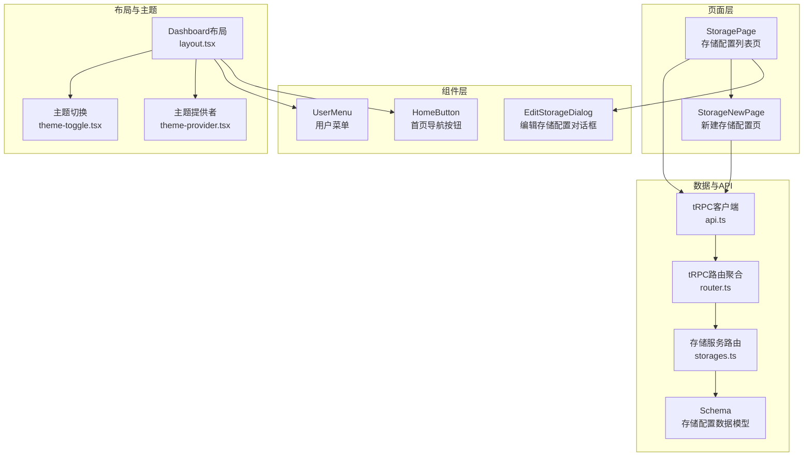
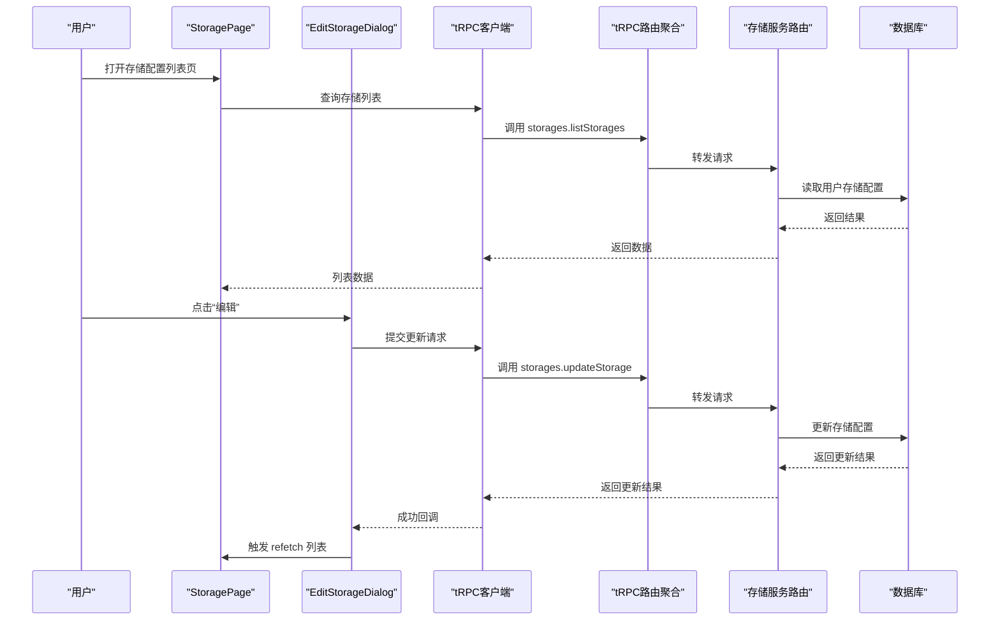
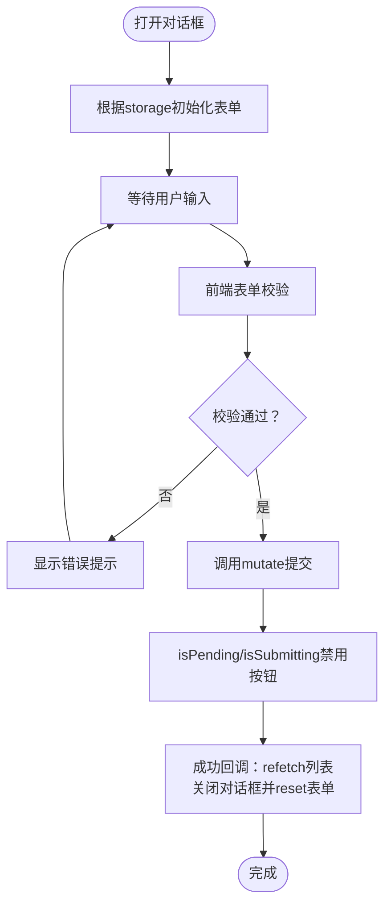
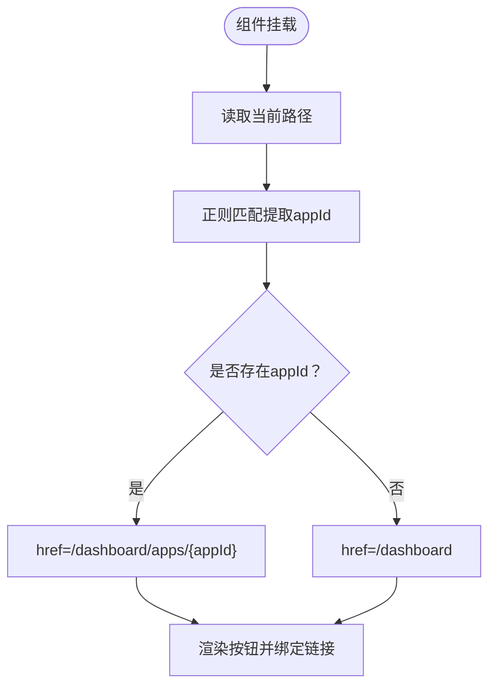
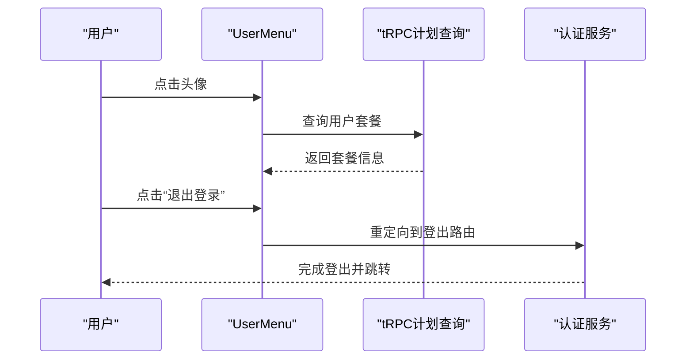
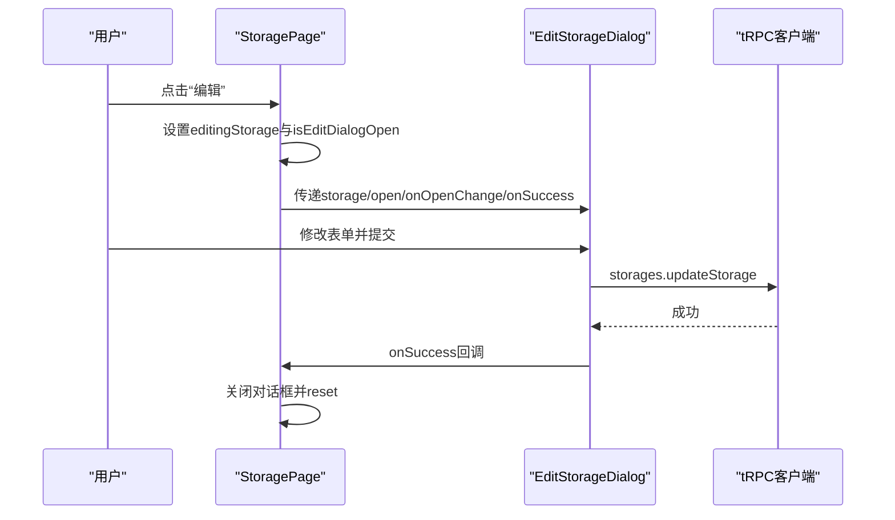
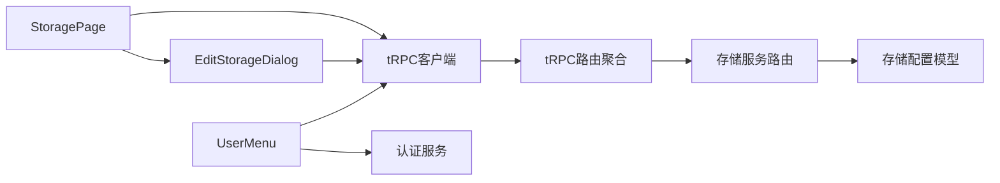

# 配置管理组件

<cite>
**本文档引用的文件**
- [edit-storage-dialog.tsx](file://src/components/feature/edit-storage-dialog.tsx)
- [home-button.tsx](file://src/components/feature/home-button.tsx)
- [user-menu.tsx](file://src/components/feature/user-menu.tsx)
- [storage-page.tsx](file://src/app/dashboard/apps/[appId]/setting/storage/page.tsx)
- [storage-new-page.tsx](file://src/app/dashboard/apps/[appId]/setting/storage/new/page.tsx)
- [schema.ts](file://src/server/db/schema.ts)
- [api.ts](file://src/utils/api.ts)
- [dashboard-layout.tsx](file://src/app/dashboard/layout.tsx)
- [theme-provider.tsx](file://src/app/dashboard/theme-provider.tsx)
- [theme-toggle.tsx](file://src/app/dashboard/theme-toggle.tsx)
- [storages.ts](file://src/server/routes/storages.ts)
- [router.ts](file://src/server/trpc-middlewares/router.ts)
- [auth.ts](file://src/lib/auth.ts)
</cite>

## 目录
1. [简介](#简介)
2. [项目结构](#项目结构)
3. [核心组件](#核心组件)
4. [架构总览](#架构总览)
5. [详细组件分析](#详细组件分析)
6. [依赖关系分析](#依赖关系分析)
7. [性能考虑](#性能考虑)
8. [故障排除指南](#故障排除指南)
9. [结论](#结论)

## 简介
本文件聚焦于配置管理相关组件的实现与集成，包括存储配置对话框（EditStorageDialog）、应用首页导航按钮（HomeButton）以及用户菜单（UserMenu）。文档将深入解析这些组件的功能特性、技术实现、表单处理与验证逻辑、状态管理、权限控制、导航逻辑、响应式设计、样式定制与主题适配、无障碍访问支持，以及与全局状态管理（基于 tRPC 的查询缓存）的数据流。

## 项目结构
配置管理功能主要分布在以下位置：
- 组件层：编辑存储配置对话框、首页按钮、用户菜单位于 `src/components/feature/`
- 页面层：存储配置列表页与新建页位于 `src/app/dashboard/apps/[appId]/setting/storage/`
- 数据模型：存储配置的数据结构定义位于 `src/server/db/schema.ts`
- API 客户端：tRPC 客户端初始化位于 `src/utils/api.ts`
- 路由聚合：tRPC 路由聚合位于 `src/server/trpc-middlewares/router.ts`
- 存储配置后端路由：位于 `src/server/routes/storages.ts`
- 布局与主题：仪表盘布局、主题切换组件位于 `src/app/dashboard/`

**图表来源**
- [edit-storage-dialog.tsx:1-186](file://src/components/feature/edit-storage-dialog.tsx#L1-L186)
- [home-button.tsx:1-29](file://src/components/feature/home-button.tsx#L1-L29)
- [user-menu.tsx:1-65](file://src/components/feature/user-menu.tsx#L1-L65)
- [storage-page.tsx:1-103](file://src/app/dashboard/apps/[appId]/setting/storage/page.tsx#L1-L103)
- [storage-new-page.tsx:1-94](file://src/app/dashboard/apps/[appId]/setting/storage/new/page.tsx#L1-L94)
- [schema.ts:154-173](file://src/server/db/schema.ts#L154-L173)
- [api.ts:1-17](file://src/utils/api.ts#L1-L17)
- [router.ts:1-20](file://src/server/trpc-middlewares/router.ts#L1-L20)
- [storages.ts:1-74](file://src/server/routes/storages.ts#L1-L74)
- [dashboard-layout.tsx:1-49](file://src/app/dashboard/layout.tsx#L1-L49)
- [theme-provider.tsx:1-9](file://src/app/dashboard/theme-provider.tsx#L1-L9)
- [theme-toggle.tsx:1-33](file://src/app/dashboard/theme-toggle.tsx#L1-L33)

**章节来源**
- [storage-page.tsx:1-103](file://src/app/dashboard/apps/[appId]/setting/storage/page.tsx#L1-L103)
- [storage-new-page.tsx:1-94](file://src/app/dashboard/apps/[appId]/setting/storage/new/page.tsx#L1-L94)
- [edit-storage-dialog.tsx:1-186](file://src/components/feature/edit-storage-dialog.tsx#L1-L186)
- [home-button.tsx:1-29](file://src/components/feature/home-button.tsx#L1-L29)
- [user-menu.tsx:1-65](file://src/components/feature/user-menu.tsx#L1-L65)
- [schema.ts:154-173](file://src/server/db/schema.ts#L154-L173)
- [api.ts:1-17](file://src/utils/api.ts#L1-L17)
- [router.ts:1-20](file://src/server/trpc-middlewares/router.ts#L1-L20)
- [storages.ts:1-74](file://src/server/routes/storages.ts#L1-L74)
- [dashboard-layout.tsx:1-49](file://src/app/dashboard/layout.tsx#L1-L49)
- [theme-provider.tsx:1-9](file://src/app/dashboard/theme-provider.tsx#L1-L9)
- [theme-toggle.tsx:1-33](file://src/app/dashboard/theme-toggle.tsx#L1-L33)

## 核心组件
本节对三个核心组件进行概览性分析，涵盖职责、输入输出、关键行为与集成点。

- EditStorageDialog（编辑存储配置对话框）
  - 职责：提供 S3 存储配置的编辑界面，包含名称、Bucket、Region、Access Key ID、Secret Access Key、API Endpoint 等字段；通过表单校验与提交，调用 tRPC 更新接口，并在成功后刷新列表缓存。
  - 关键输入：storage（当前存储配置对象）、open（对话框开关）、onOpenChange（开关回调）、onSuccess（成功回调）。
  - 关键行为：打开时根据 storage 初始化表单；提交时携带 id 进行更新；成功后关闭对话框并重置表单。
  - 集成：依赖 tRPC 客户端、react-hook-form、UI 对话框组件。

- HomeButton（首页导航按钮）
  - 职责：根据当前路径提取 appId，决定返回仪表盘首页或应用详情页。
  - 关键输入：无（内部读取路由状态）。
  - 关键行为：动态计算 href 并渲染为链接按钮。
  - 集成：依赖 Next.js 导航与图标库。

- UserMenu（用户菜单）
  - 职责：显示用户头像与基本信息，展示套餐信息，提供退出登录入口。
  - 关键输入：name、email、image、plan。
  - 关键行为：点击触发浏览器重定向至认证服务的登出接口；同时通过 tRPC 查询当前用户套餐。
  - 集成：依赖 tRPC 客户端、Radix UI 下拉菜单、图标库。

**章节来源**
- [edit-storage-dialog.tsx:18-76](file://src/components/feature/edit-storage-dialog.tsx#L18-L76)
- [home-button.tsx:8-26](file://src/components/feature/home-button.tsx#L8-L26)
- [user-menu.tsx:14-61](file://src/components/feature/user-menu.tsx#L14-L61)

## 架构总览
配置管理组件与数据流的整体关系如下：

**图表来源**
- [storage-page.tsx:34-35](file://src/app/dashboard/apps/[appId]/setting/storage/page.tsx#L34-L35)
- [edit-storage-dialog.tsx:46-55](file://src/components/feature/edit-storage-dialog.tsx#L46-L55)
- [api.ts:5-15](file://src/utils/api.ts#L5-L15)
- [router.ts:9-16](file://src/server/trpc-middlewares/router.ts#L9-L16)
- [storages.ts:7-13](file://src/server/routes/storages.ts#L7-L13)
- [storages.ts:41-72](file://src/server/routes/storages.ts#L41-L72)

## 详细组件分析

### EditStorageDialog 组件分析
- 功能特性
  - 表单字段：名称、Bucket、Region、Access Key ID、Secret Access Key、API Endpoint（可选）。
  - 校验策略：必填字段使用前端表单校验；后端使用 Zod Schema 再次校验。
  - 状态管理：使用 react-hook-form 管理表单状态与错误；使用 tRPC 的 useMutation 与 useUtils 进行提交与缓存刷新。
  - 用户交互：支持取消与提交；提交期间禁用按钮；成功后自动关闭并重置表单。
- 技术实现
  - 表单初始化：当对话框打开且存在 storage 时，使用 reset 将当前值注入表单。
  - 提交流程：handleSubmit 包裹的 onSubmit 中携带 storage.id 与表单数据调用 mutate。
  - 成功回调：refetch 存储列表缓存，触发 onSuccess 与 onOpenChange(false)，并 reset 表单。
- 数据模型
  - S3StorageConfiguration 字段与数据库存储配置一致，确保前后端一致性。
- 错误处理
  - 前端错误：errors.name/bucket/region/accessKeyId/secretAccessKey/apiEndPoint 显示对应提示。
  - 后端错误：由 tRPC 层统一处理，前端通过 isPending/isSubmitting 控制交互状态。
- 无障碍与样式
  - 使用语义化标签与错误提示文本；密码字段使用 type=password；按钮禁用态明确反馈。
  - 支持主题切换与响应式布局，对话框宽度限制为 sm:max-w-md。

**图表来源**
- [edit-storage-dialog.tsx:66-74](file://src/components/feature/edit-storage-dialog.tsx#L66-L74)
- [edit-storage-dialog.tsx:57-64](file://src/components/feature/edit-storage-dialog.tsx#L57-L64)
- [edit-storage-dialog.tsx:46-55](file://src/components/feature/edit-storage-dialog.tsx#L46-L55)

**章节来源**
- [edit-storage-dialog.tsx:1-186](file://src/components/feature/edit-storage-dialog.tsx#L1-L186)
- [schema.ts:154-160](file://src/server/db/schema.ts#L154-L160)
- [storages.ts:41-52](file://src/server/routes/storages.ts#L41-L52)

### HomeButton 组件分析
- 功能特性
  - 路径解析：从当前路径中提取 appId，若不存在则回退到仪表盘首页。
  - 导航逻辑：根据 appId 生成目标链接，保证用户能快速回到应用首页或仪表盘。
- 技术实现
  - 使用 usePathname 获取当前路径；正则匹配提取 appId；根据结果选择 href。
  - 渲染为按钮并包裹 Link，提供无障碍文本 sr-only。
- 响应式设计
  - 使用尺寸与变体控制按钮外观，适配导航栏布局。
- 无障碍访问
  - 提供 sr-only 文本描述“回到应用首页”，提升屏幕阅读器可用性。

**图表来源**
- [home-button.tsx:9-16](file://src/components/feature/home-button.tsx#L9-L16)

**章节来源**
- [home-button.tsx:1-29](file://src/components/feature/home-button.tsx#L1-L29)

### UserMenu 组件分析
- 功能特性
  - 权限控制：所有 tRPC 查询均为受保护过程，仅登录用户可见。
  - 导航逻辑：提供套餐信息展示与退出登录入口。
  - 响应式设计：下拉菜单对齐到右侧，适配导航栏右侧区域。
- 技术实现
  - 用户信息：从父组件接收 name、email、image、plan。
  - 套餐查询：通过 trpcClientReact.plan.getPlan.useQuery 获取用户套餐。
  - 登出流程：直接重定向到 /api/auth/signout，交由认证服务处理。
- 无障碍访问
  - 使用语义化结构与可聚焦元素，确保键盘可达性。
- 主题适配
  - 与全局主题提供者配合，在深色/浅色模式下保持一致的视觉表现。

**图表来源**
- [user-menu.tsx:28-28](file://src/components/feature/user-menu.tsx#L28-L28)
- [user-menu.tsx:24-26](file://src/components/feature/user-menu.tsx#L24-L26)
- [dashboard-layout.tsx:32-37](file://src/app/dashboard/layout.tsx#L32-L37)

**章节来源**
- [user-menu.tsx:1-65](file://src/components/feature/user-menu.tsx#L1-L65)
- [dashboard-layout.tsx:1-49](file://src/app/dashboard/layout.tsx#L1-L49)

### 存储配置页面与新建页面
- StoragePage（列表页）
  - 职责：展示用户所有存储配置，支持编辑与设为当前使用；提供新建入口。
  - 关键交互：点击“编辑”打开 EditStorageDialog；点击“Use”调用 changeStorage 更新应用使用的存储。
  - 状态管理：本地 useState 管理编辑中的 storage 与对话框开关；tRPC useUtils 更新应用列表缓存。
- StorageNewPage（新建页）
  - 职责：提供新建存储配置的表单，包含与编辑页相同的字段。
  - 关键交互：表单提交后 onSuccess 跳转回列表页。

**图表来源**
- [storage-page.tsx:38-46](file://src/app/dashboard/apps/[appId]/setting/storage/page.tsx#L38-L46)
- [edit-storage-dialog.tsx:57-64](file://src/components/feature/edit-storage-dialog.tsx#L57-L64)

**章节来源**
- [storage-page.tsx:1-103](file://src/app/dashboard/apps/[appId]/setting/storage/page.tsx#L1-L103)
- [storage-new-page.tsx:1-94](file://src/app/dashboard/apps/[appId]/setting/storage/new/page.tsx#L1-L94)

## 依赖关系分析
- 组件耦合
  - StoragePage 与 EditStorageDialog 通过 props 传递状态与回调，松耦合设计便于复用。
  - UserMenu 与 Dashboard 布局通过 props 注入用户信息，形成清晰的上下文传递。
- 外部依赖
  - tRPC 客户端负责与后端通信，统一错误处理与缓存管理。
  - Next.js 导航与路由用于路径解析与页面跳转。
  - Radix UI 与 Lucide React 提供基础 UI 与图标。
- 数据模型
  - S3StorageConfiguration 与数据库表 storageConfiguration 字段一一对应，确保类型安全与一致性。

**图表来源**
- [storage-page.tsx:94-99](file://src/app/dashboard/apps/[appId]/setting/storage/page.tsx#L94-L99)
- [edit-storage-dialog.tsx:46-47](file://src/components/feature/edit-storage-dialog.tsx#L46-L47)
- [user-menu.tsx:12-12](file://src/components/feature/user-menu.tsx#L12-L12)
- [api.ts:5-15](file://src/utils/api.ts#L5-L15)
- [router.ts:9-16](file://src/server/trpc-middlewares/router.ts#L9-L16)
- [storages.ts:7-13](file://src/server/routes/storages.ts#L7-L13)
- [schema.ts:164-173](file://src/server/db/schema.ts#L164-L173)

**章节来源**
- [storage-page.tsx:1-103](file://src/app/dashboard/apps/[appId]/setting/storage/page.tsx#L1-L103)
- [edit-storage-dialog.tsx:1-186](file://src/components/feature/edit-storage-dialog.tsx#L1-L186)
- [user-menu.tsx:1-65](file://src/components/feature/user-menu.tsx#L1-L65)
- [api.ts:1-17](file://src/utils/api.ts#L1-L17)
- [router.ts:1-20](file://src/server/trpc-middlewares/router.ts#L1-L20)
- [storages.ts:1-74](file://src/server/routes/storages.ts#L1-L74)
- [schema.ts:154-173](file://src/server/db/schema.ts#L154-L173)

## 性能考虑
- 缓存与增量更新
  - 使用 tRPC 的 useUtils.refetch 与 setData 进行局部缓存更新，避免全量刷新。
  - 在列表页与应用页均采用缓存更新策略，减少网络请求与渲染成本。
- 表单提交优化
  - 提交期间禁用按钮，防止重复提交；利用 isPending/isSubmitting 状态反馈。
- 路由与导航
  - HomeButton 通过正则匹配快速解析 appId，避免复杂计算。
- 主题与样式
  - 使用 next-themes 实现主题切换，配合 SSR 与水合时机控制，减少闪烁。

## 故障排除指南
- 表单校验失败
  - 确认必填字段已填写；检查前端错误提示是否显示；查看 tRPC 后端 Zod 校验规则。
- 提交无响应
  - 检查 isPending/isSubmitting 是否被设置；确认 mutation 回调是否执行；查看网络面板是否有错误。
- 列表未刷新
  - 确认 onSuccess 中是否调用了 refetch 或 setData；检查 useUtils 实例是否正确。
- 登出异常
  - 确认 /api/auth/signout 路由可用；检查认证服务配置；查看浏览器重定向是否正常。
- 路由跳转错误
  - 检查 usePathname 返回的路径格式；确认正则匹配是否正确提取 appId。

**章节来源**
- [edit-storage-dialog.tsx:46-55](file://src/components/feature/edit-storage-dialog.tsx#L46-L55)
- [storage-page.tsx:16-33](file://src/app/dashboard/apps/[appId]/setting/storage/page.tsx#L16-L33)
- [user-menu.tsx:24-26](file://src/components/feature/user-menu.tsx#L24-L26)
- [home-button.tsx:12-13](file://src/components/feature/home-button.tsx#L12-L13)

## 结论
配置管理组件围绕 EditStorageDialog、HomeButton、UserMenu 构建，形成了完整的存储配置编辑、导航与用户管理闭环。通过 tRPC 的强类型 API 与缓存机制，实现了高效、可靠的前后端协作；结合 React Hook Form 的表单处理与校验，提供了良好的用户体验。组件具备完善的权限控制、响应式设计与无障碍访问支持，并可通过主题系统与样式定制满足多样化需求。