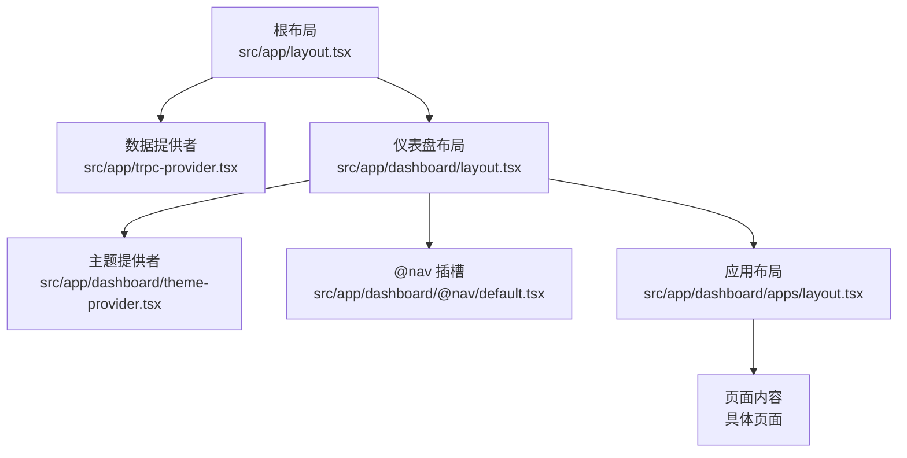
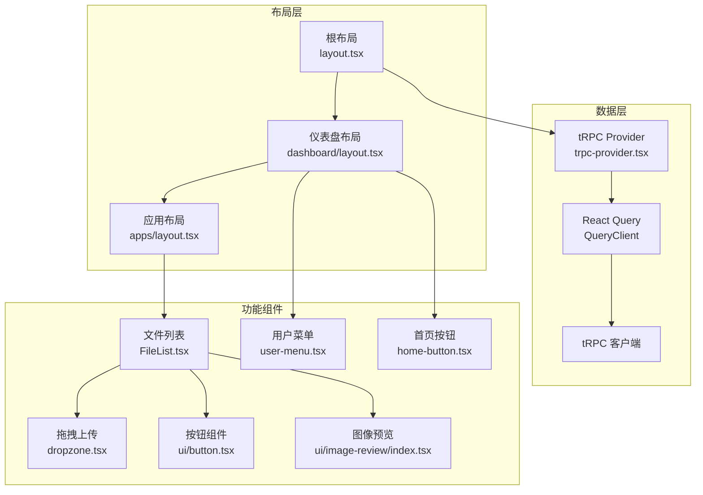
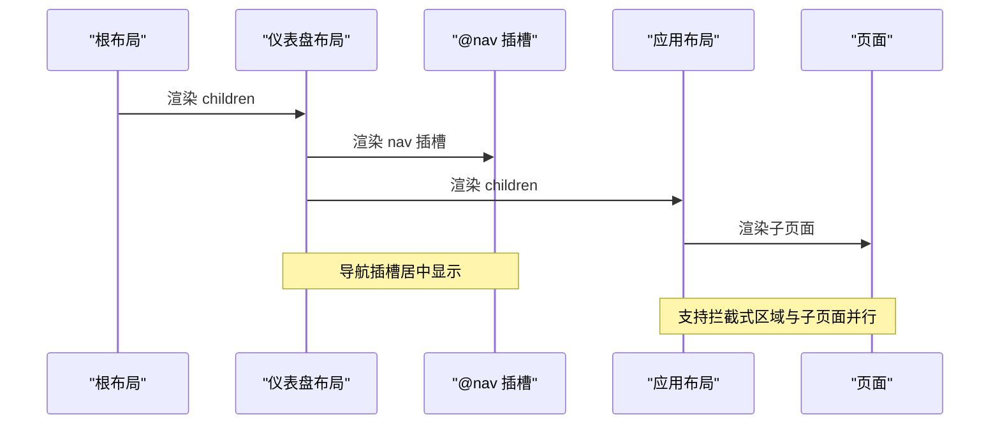
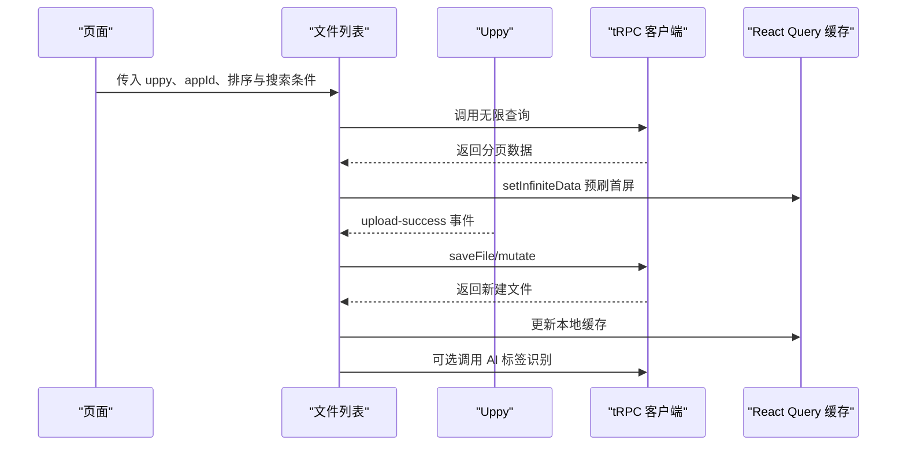
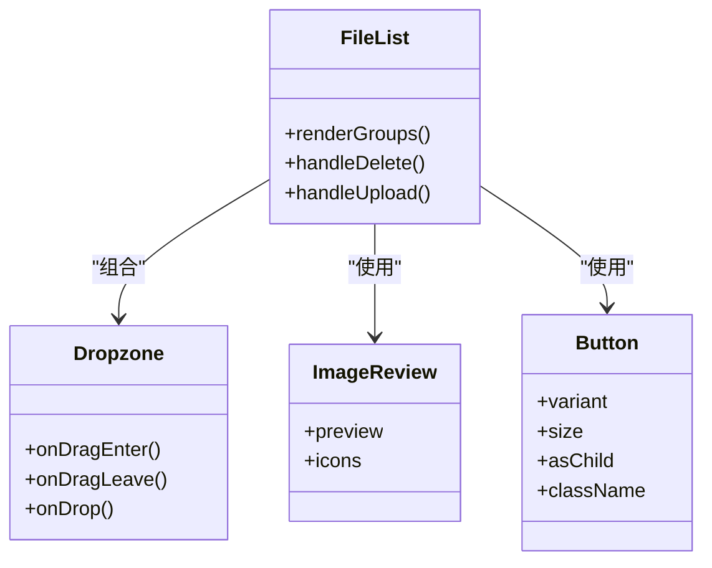
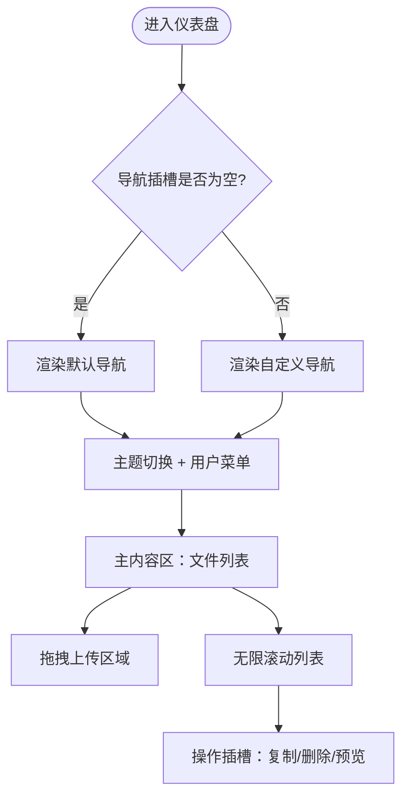
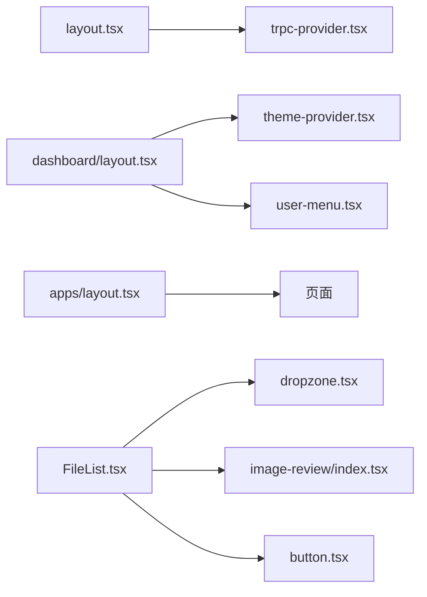

# 组件组合模式

<cite>
**本文引用的文件**
- [src/app/layout.tsx](file://src/app/layout.tsx)
- [src/app/trpc-provider.tsx](file://src/app/trpc-provider.tsx)
- [src/app/dashboard/layout.tsx](file://src/app/dashboard/layout.tsx)
- [src/app/dashboard/theme-provider.tsx](file://src/app/dashboard/theme-provider.tsx)
- [src/app/dashboard/apps/layout.tsx](file://src/app/dashboard/apps/layout.tsx)
- [src/app/dashboard/@nav/default.tsx](file://src/app/dashboard/@nav/default.tsx)
- [src/components/ui/button.tsx](file://src/components/ui/button.tsx)
- [src/components/ui/image-review/index.tsx](file://src/components/ui/image-review/index.tsx)
- [src/components/feature/FileList.tsx](file://src/components/feature/FileList.tsx)
- [src/components/feature/dropzone.tsx](file://src/components/feature/dropzone.tsx)
- [src/hooks/use-uppy-state.ts](file://src/hooks/use-uppy-state.ts)
- [src/components/feature/user-menu.tsx](file://src/components/feature/user-menu.tsx)
- [src/components/feature/home-button.tsx](file://src/components/feature/home-button.tsx)
</cite>

## 目录

1. [引言](#引言)
2. [项目结构](#项目结构)
3. [核心组件](#核心组件)
4. [架构总览](#架构总览)
5. [详细组件分析](#详细组件分析)
6. [依赖分析](#依赖分析)
7. [性能考虑](#性能考虑)
8. [故障排查指南](#故障排查指南)
9. [结论](#结论)
10. [附录](#附录)

## 引言

本文件聚焦于 Image SaaS 项目的“组件组合模式”，系统性阐述页面布局组件的设计与嵌套结构，解释组件层次关系、数据流向与状态共享机制；文档化布局组件的职责划分、边界定义与通信方式；总结组件复用策略、插槽模式与高阶组件的应用；给出复杂页面的组件组织示例与架构模式；并提供生命周期管理、性能优化与调试技巧，为架构师与高级开发者提供组件设计与重构指南。

## 项目结构

该项目采用 Next.js App Router 的多区域（parallel routes）与插槽（slots）布局体系，结合 tRPC 与 React Query 提供的数据层，形成“根布局 -> 仪表盘布局 -> 应用布局 -> 页面”的层级结构。根布局负责全局样式与 Provider 注入；仪表盘布局负责导航栏、主题切换与用户菜单等通用头部区域；应用布局负责拦截式路由与并行区域渲染；页面通过 tRPC 与本地状态实现数据驱动的列表与上传流程。

图表来源

- [src/app/layout.tsx:21-36](file://src/app/layout.tsx#L21-L36)
- [src/app/trpc-provider.tsx:6-15](file://src/app/trpc-provider.tsx#L6-L15)
- [src/app/dashboard/layout.tsx:9-48](file://src/app/dashboard/layout.tsx#L9-L48)
- [src/app/dashboard/theme-provider.tsx:6-8](file://src/app/dashboard/theme-provider.tsx#L6-L8)
- [src/app/dashboard/apps/layout.tsx:8-16](file://src/app/dashboard/apps/layout.tsx#L8-L16)
- [src/app/dashboard/@nav/default.tsx:3-7](file://src/app/dashboard/@nav/default.tsx#L3-L7)

章节来源

- [src/app/layout.tsx:1-37](file://src/app/layout.tsx#L1-L37)
- [src/app/dashboard/layout.tsx:1-49](file://src/app/dashboard/layout.tsx#L1-L49)
- [src/app/dashboard/apps/layout.tsx:1-17](file://src/app/dashboard/apps/layout.tsx#L1-L17)

## 核心组件

- 根布局与数据提供者：根布局注入全局样式与 tRPC Provider，确保全站数据请求可用；Provider 内部创建 QueryClient 并绑定 tRPC 客户端，统一管理缓存与请求。
- 仪表盘布局与头部区域：仪表盘布局负责登录态校验、主题切换、用户菜单与导航插槽渲染；导航区域通过并行插槽实现可替换的导航内容。
- 应用布局与拦截式路由：应用布局负责渲染子页面与拦截式区域，支持在特定路径下插入对话框或新页面。
- 文件列表组件：负责无限滚动加载、分组展示、上传进度与 AI 标签识别联动、删除后的本地缓存更新。
- 上传与拖拽组件：基于 Uppy 的拖拽区域组件，暴露拖拽状态给子组件，实现上传入口的可插拔组合。
- UI 组合与高阶组件：按钮组件通过变体与尺寸系统实现高内聚的视觉与行为组合；图像预览组件以高阶包装的方式扩展 rc-image 的预览能力。

章节来源

- [src/app/trpc-provider.tsx:1-18](file://src/app/trpc-provider.tsx#L1-L18)
- [src/app/dashboard/layout.tsx:1-49](file://src/app/dashboard/layout.tsx#L1-L49)
- [src/app/dashboard/apps/layout.tsx:1-17](file://src/app/dashboard/apps/layout.tsx#L1-L17)
- [src/components/feature/FileList.tsx:1-366](file://src/components/feature/FileList.tsx#L1-L366)
- [src/components/feature/dropzone.tsx:1-52](file://src/components/feature/dropzone.tsx#L1-L52)
- [src/components/ui/button.tsx:1-63](file://src/components/ui/button.tsx#L1-L63)
- [src/components/ui/image-review/index.tsx:1-25](file://src/components/ui/image-review/index.tsx#L1-L25)

## 架构总览

整体架构围绕“布局组合 + 数据流 + 状态共享”展开：

- 布局组合：根布局 -> 仪表盘布局 -> 应用布局 -> 页面，配合并行插槽与拦截式路由，实现灵活的页面组织。
- 数据流：tRPC 客户端通过 Provider 注入，页面与组件通过 React Query 进行缓存与分页；上传事件通过 Uppy 触发，再由 tRPC 同步到远端并回写本地缓存。
- 状态共享：仪表盘布局中的主题提供者与用户菜单共享主题状态与用户信息；上传状态通过自定义 Hook 与 Uppy Store 订阅共享。

图表来源

- [src/app/layout.tsx:21-36](file://src/app/layout.tsx#L21-L36)
- [src/app/dashboard/layout.tsx:9-48](file://src/app/dashboard/layout.tsx#L9-L48)
- [src/app/dashboard/apps/layout.tsx:8-16](file://src/app/dashboard/apps/layout.tsx#L8-L16)
- [src/app/trpc-provider.tsx:6-15](file://src/app/trpc-provider.tsx#L6-L15)
- [src/components/feature/FileList.tsx:28-366](file://src/components/feature/FileList.tsx#L28-L366)
- [src/components/feature/dropzone.tsx:9-52](file://src/components/feature/dropzone.tsx#L9-L52)
- [src/components/feature/user-menu.tsx:21-65](file://src/components/feature/user-menu.tsx#L21-L65)
- [src/components/feature/home-button.tsx:8-29](file://src/components/feature/home-button.tsx#L8-L29)
- [src/components/ui/button.tsx:39-63](file://src/components/ui/button.tsx#L39-L63)
- [src/components/ui/image-review/index.tsx:6-25](file://src/components/ui/image-review/index.tsx#L6-L25)

## 详细组件分析

### 布局组件与插槽模式

- 仪表盘布局通过并行插槽接收导航内容，并将其居中放置于导航栏中央区域；同时渲染主内容区，形成“头部插槽 + 主体内容”的组合模式。
- 应用布局通过并行插槽渲染拦截式区域与子页面，实现“主内容 + 拦截对话框”的复合视图。
- 导航默认插槽提供占位内容，便于在不同路由下注入不同的导航组件。

图表来源

- [src/app/dashboard/layout.tsx:23-47](file://src/app/dashboard/layout.tsx#L23-L47)
- [src/app/dashboard/apps/layout.tsx:8-16](file://src/app/dashboard/apps/layout.tsx#L8-L16)
- [src/app/dashboard/@nav/default.tsx:3-7](file://src/app/dashboard/@nav/default.tsx#L3-L7)

章节来源

- [src/app/dashboard/layout.tsx:1-49](file://src/app/dashboard/layout.tsx#L1-L49)
- [src/app/dashboard/apps/layout.tsx:1-17](file://src/app/dashboard/apps/layout.tsx#L1-L17)
- [src/app/dashboard/@nav/default.tsx:1-8](file://src/app/dashboard/@nav/default.tsx#L1-L8)

### 数据流向与状态共享

- tRPC Provider 在根布局注入，创建 QueryClient 并绑定纯客户端 tRPC 实例，使所有页面与组件可通过 React Query 缓存与分页。
- 文件列表组件使用 tRPC 的无限查询与本地缓存更新，结合 IntersectionObserver 实现懒加载；上传成功后通过本地缓存预刷首屏，提升用户体验。
- 用户菜单组件通过 tRPC 查询当前套餐信息，与仪表盘布局共享用户状态；首页按钮根据路径动态计算返回地址，体现路由感知的状态共享。

图表来源

- [src/app/trpc-provider.tsx:6-15](file://src/app/trpc-provider.tsx#L6-L15)
- [src/components/feature/FileList.tsx:40-235](file://src/components/feature/FileList.tsx#L40-L235)
- [src/hooks/use-uppy-state.ts:4-17](file://src/hooks/use-uppy-state.ts#L4-L17)

章节来源

- [src/app/trpc-provider.tsx:1-18](file://src/app/trpc-provider.tsx#L1-L18)
- [src/components/feature/FileList.tsx:1-366](file://src/components/feature/FileList.tsx#L1-L366)
- [src/hooks/use-uppy-state.ts:1-17](file://src/hooks/use-uppy-state.ts#L1-L17)

### 组件复用策略与高阶组件

- 按钮组件通过变体与尺寸系统实现高内聚的视觉与行为组合，支持 asChild 透传，适配多种语义标签与容器。
- 图像预览组件以高阶包装的方式扩展 rc-image 的预览图标与行为，保持对外接口一致的同时增强可定制性。
- 文件列表组件通过插槽模式将操作项（复制链接、删除、预览）注入到每个文件卡片中，实现“模板 + 插槽”的复用策略。

图表来源

- [src/components/ui/button.tsx:39-63](file://src/components/ui/button.tsx#L39-L63)
- [src/components/ui/image-review/index.tsx:6-25](file://src/components/ui/image-review/index.tsx#L6-L25)
- [src/components/feature/FileList.tsx:28-366](file://src/components/feature/FileList.tsx#L28-L366)
- [src/components/feature/dropzone.tsx:9-52](file://src/components/feature/dropzone.tsx#L9-L52)

章节来源

- [src/components/ui/button.tsx:1-63](file://src/components/ui/button.tsx#L1-L63)
- [src/components/ui/image-review/index.tsx:1-25](file://src/components/ui/image-review/index.tsx#L1-L25)
- [src/components/feature/FileList.tsx:1-366](file://src/components/feature/FileList.tsx#L1-L366)
- [src/components/feature/dropzone.tsx:1-52](file://src/components/feature/dropzone.tsx#L1-L52)

### 复杂页面的组件组织示例

- 仪表盘首页：导航插槽为空时显示默认内容；主题切换与用户菜单位于头部右侧；主内容区为文件列表。
- 应用设置页：应用布局渲染拦截式区域（如新建对话框），同时渲染设置页面主体。
- 文件列表页：文件列表组件内部组合拖拽区域、分组折叠、无限滚动与操作插槽，形成“上传 + 列表 + 操作”的复合页面。

图表来源

- [src/app/dashboard/layout.tsx:23-47](file://src/app/dashboard/layout.tsx#L23-L47)
- [src/app/dashboard/@nav/default.tsx:3-7](file://src/app/dashboard/@nav/default.tsx#L3-L7)
- [src/components/feature/FileList.tsx:28-366](file://src/components/feature/FileList.tsx#L28-L366)
- [src/components/feature/dropzone.tsx:9-52](file://src/components/feature/dropzone.tsx#L9-L52)

章节来源

- [src/app/dashboard/layout.tsx:1-49](file://src/app/dashboard/layout.tsx#L1-L49)
- [src/app/dashboard/apps/layout.tsx:1-17](file://src/app/dashboard/apps/layout.tsx#L1-L17)
- [src/components/feature/FileList.tsx:1-366](file://src/components/feature/FileList.tsx#L1-L366)

## 依赖分析

- 布局层依赖：根布局依赖 tRPC Provider；仪表盘布局依赖主题提供者与用户菜单；应用布局依赖拦截式区域与子页面。
- 数据层依赖：文件列表组件依赖 tRPC 无限查询与 React Query 缓存；上传流程依赖 Uppy 事件与 tRPC 变更。
- UI 组件依赖：按钮组件被多个功能组件复用；图像预览组件被文件列表与预览场景复用。

图表来源

- [src/app/layout.tsx:21-36](file://src/app/layout.tsx#L21-L36)
- [src/app/trpc-provider.tsx:6-15](file://src/app/trpc-provider.tsx#L6-L15)
- [src/app/dashboard/layout.tsx:9-48](file://src/app/dashboard/layout.tsx#L9-L48)
- [src/app/dashboard/theme-provider.tsx:6-8](file://src/app/dashboard/theme-provider.tsx#L6-L8)
- [src/app/dashboard/apps/layout.tsx:8-16](file://src/app/dashboard/apps/layout.tsx#L8-L16)
- [src/components/feature/FileList.tsx:28-366](file://src/components/feature/FileList.tsx#L28-L366)
- [src/components/feature/dropzone.tsx:9-52](file://src/components/feature/dropzone.tsx#L9-L52)
- [src/components/ui/image-review/index.tsx:6-25](file://src/components/ui/image-review/index.tsx#L6-L25)
- [src/components/ui/button.tsx:39-63](file://src/components/ui/button.tsx#L39-L63)

章节来源

- [src/app/layout.tsx:1-37](file://src/app/layout.tsx#L1-L37)
- [src/app/dashboard/layout.tsx:1-49](file://src/app/dashboard/layout.tsx#L1-L49)
- [src/components/feature/FileList.tsx:1-366](file://src/components/feature/FileList.tsx#L1-L366)

## 性能考虑

- 无限滚动与懒加载：文件列表使用 IntersectionObserver 触发分页加载，减少一次性渲染压力；通过本地缓存预刷首屏，避免闪烁。
- 本地缓存更新：删除与上传成功后优先更新本地缓存，再进行远端同步，提升交互响应速度。
- 上传状态订阅：通过自定义 Hook 订阅 Uppy Store，避免不必要的重渲染；仅在需要时触发状态更新。
- 主题与字体：根布局集中注入字体变量与主题提供者，减少重复渲染与样式抖动。

## 故障排查指南

- 登录态问题：仪表盘布局在未登录且非跳过模式下会重定向至登录页；若出现循环重定向，检查环境变量与会话状态。
- 上传不生效：确认 Uppy 事件监听已正确注册与清理；检查上传成功回调中的 tRPC 调用与本地缓存更新逻辑。
- 分页异常：检查分页参数与游标传递；确保本地缓存更新时对首屏数据的处理逻辑正确。
- 主题切换无效：确认主题提供者包裹范围覆盖到目标组件；检查主题变量是否正确注入。

章节来源

- [src/app/dashboard/layout.tsx:16-21](file://src/app/dashboard/layout.tsx#L16-L21)
- [src/components/feature/FileList.tsx:106-124](file://src/components/feature/FileList.tsx#L106-L124)
- [src/app/dashboard/theme-provider.tsx:6-8](file://src/app/dashboard/theme-provider.tsx#L6-L8)

## 结论

本项目通过“布局插槽 + 数据 Provider + 组件组合”的模式，实现了高内聚、低耦合的页面组织方式。仪表盘与应用布局的并行与拦截式区域，配合 tRPC 与 React Query 的数据流，使得复杂页面具备良好的可维护性与扩展性。建议在后续迭代中进一步抽象通用布局与数据钩子，强化插槽与高阶组件的复用策略，持续优化上传与列表的性能表现。

## 附录

- 组件职责速览
  - 根布局：全局样式与 Provider 注入
  - 仪表盘布局：导航插槽、主题与用户菜单、主内容区
  - 应用布局：拦截式区域与子页面并行渲染
  - 文件列表：无限滚动、分组展示、上传与 AI 标签联动
  - 拖拽上传：Uppy 集成与拖拽状态透传
  - UI 组件：按钮与图像预览的高内聚组合
