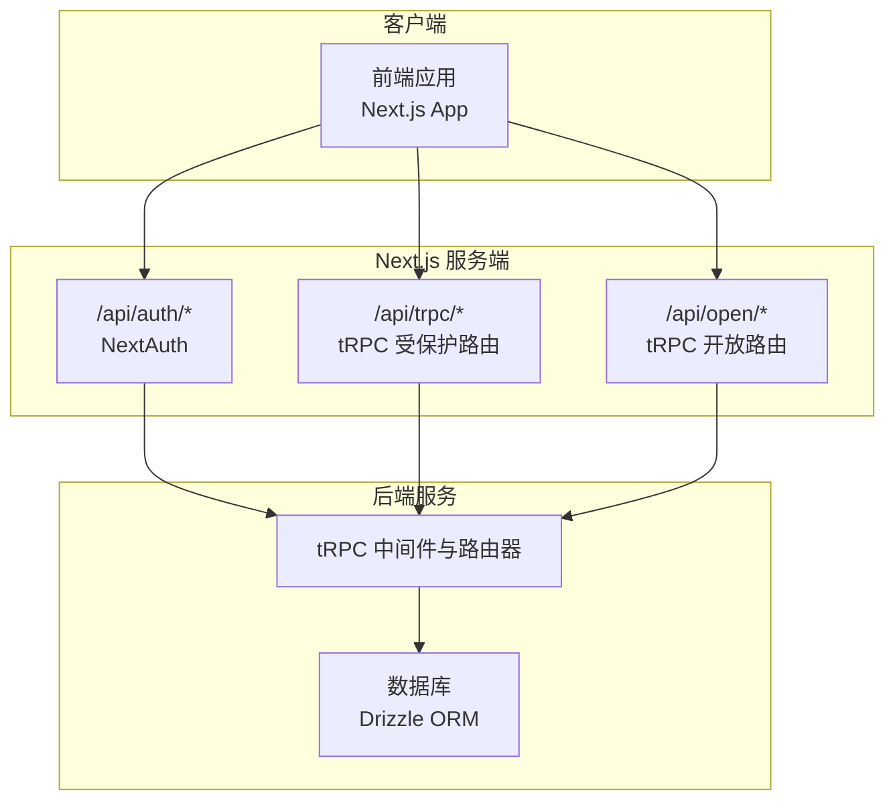
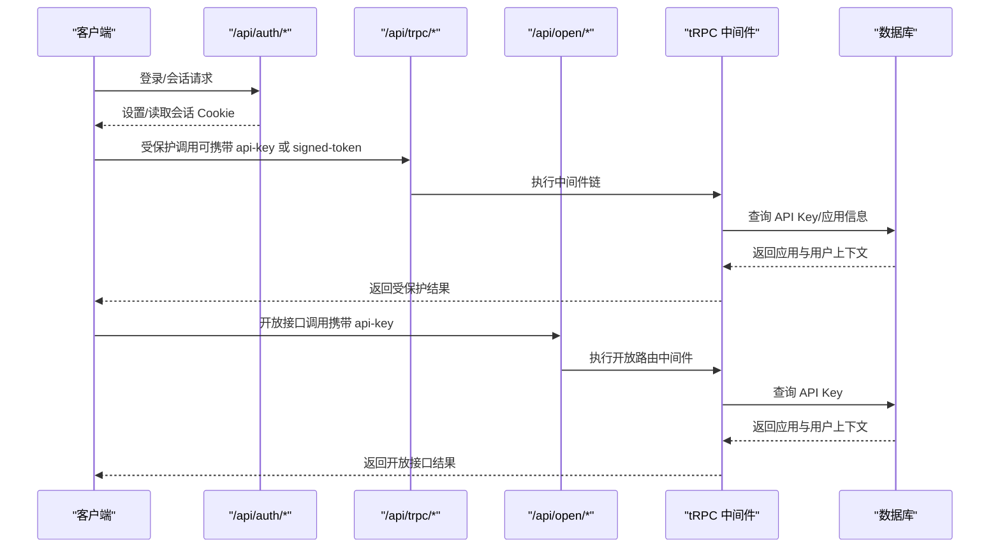
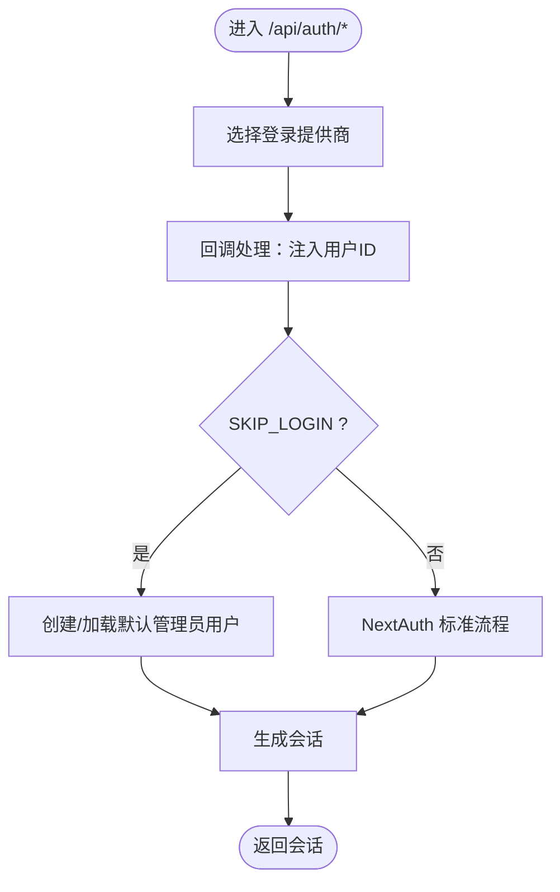
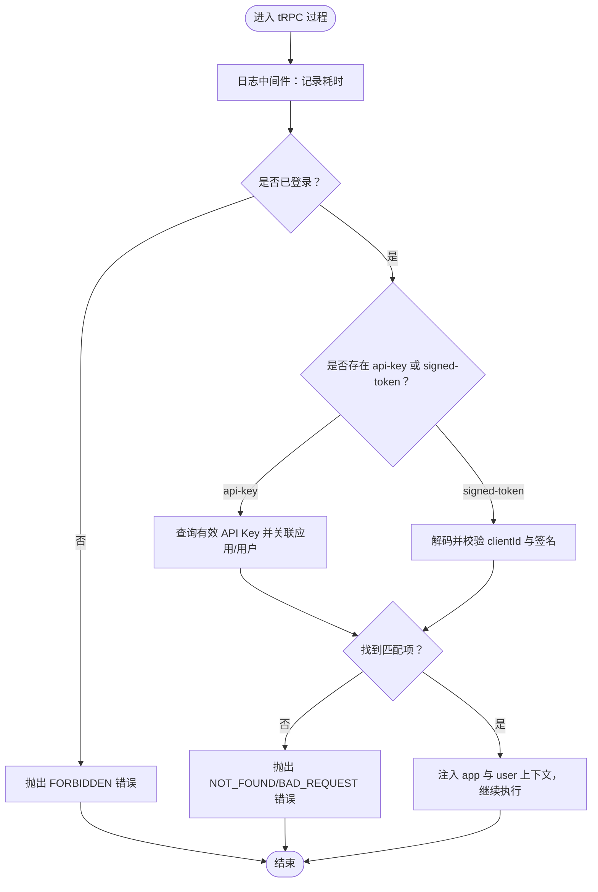
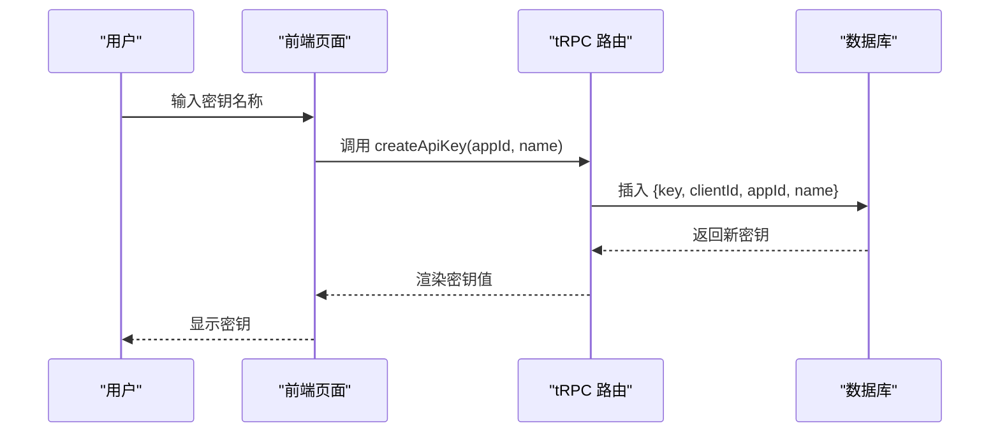
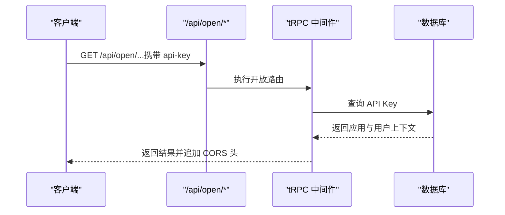
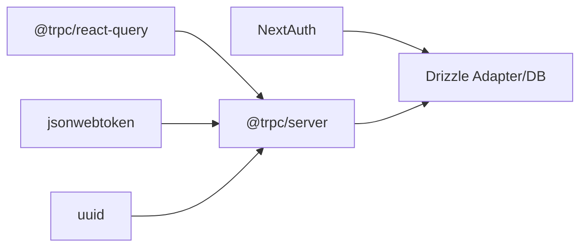

# API 安全

<cite>
**本文引用的文件**
- [src/server/auth/index.ts](file://src/server/auth/index.ts)
- [src/lib/auth.ts](file://src/lib/auth.ts)
- [src/app/api/auth/[...nextauth]/route.ts](file://src/app/api/auth/[...nextauth]/route.ts)
- [src/server/trpc-middlewares/trpc.ts](file://src/server/trpc-middlewares/trpc.ts)
- [src/server/trpc-middlewares/router.ts](file://src/server/trpc-middlewares/router.ts)
- [src/server/routes/api-keys.ts](file://src/server/routes/api-keys.ts)
- [src/server/db/schema.ts](file://src/server/db/schema.ts)
- [src/app/api/trpc/[...trpc]/route.ts](file://src/app/api/trpc/[...trpc]/route.ts)
- [src/app/api/open/[...trpc]/route.ts](file://src/app/api/open/[...trpc]/route.ts)
- [src/server/open-router.ts](file://src/server/open-router.ts)
- [src/utils/trpc.ts](file://src/utils/trpc.ts)
- [src/app/dashboard/apps/[appId]/setting/api-key/page.tsx](file://src/app/dashboard/apps/[appId]/setting/api-key/page.tsx)
- [package.json](file://package.json)
- [next.config.ts](file://next.config.ts)
</cite>

## 目录

1. [简介](#简介)
2. [项目结构](#项目结构)
3. [核心组件](#核心组件)
4. [架构总览](#架构总览)
5. [详细组件分析](#详细组件分析)
6. [依赖分析](#依赖分析)
7. [性能考虑](#性能考虑)
8. [故障排查指南](#故障排查指南)
9. [结论](#结论)
10. [附录](#附录)

## 简介

本文件面向 Image SaaS 项目的 API 安全，系统性梳理 API 密钥生成、验证与管理机制；文档化 tRPC 路由的安全配置、中间件与访问控制策略；详解认证流程、权限校验与速率限制现状；说明请求验证、参数过滤与输出编码的安全措施；解释 API 版本控制、错误处理与安全日志记录；给出 CORS、HSTS 与安全响应头建议；并提供安全开发指南、威胁防护策略与安全测试方法。

## 项目结构

本项目采用 Next.js 16 应用，后端通过 tRPC 提供 GraphQL 风格的 RPC 接口，并使用 NextAuth 实现用户认证。API 分为受保护路由（/api/trpc）与开放接口（/api/open）。开放接口通过 CORS 允许跨域调用，受保护接口通过会话与 API Key/Signed Token 双通道进行鉴权。

图表来源

- [src/app/api/auth/[...nextauth]/route.ts](file://src/app/api/auth/[...nextauth]/route.ts#L1-L7)
- [src/app/api/trpc/[...trpc]/route.ts](file://src/app/api/trpc/[...trpc]/route.ts#L1-L14)
- [src/app/api/open/[...trpc]/route.ts](file://src/app/api/open/[...trpc]/route.ts#L1-L31)
- [src/server/trpc-middlewares/router.ts:1-20](file://src/server/trpc-middlewares/router.ts#L1-L20)
- [src/server/db/schema.ts:1-270](file://src/server/db/schema.ts#L1-L270)

章节来源

- [src/app/api/auth/[...nextauth]/route.ts](file://src/app/api/auth/[...nextauth]/route.ts#L1-L7)
- [src/app/api/trpc/[...trpc]/route.ts](file://src/app/api/trpc/[...trpc]/route.ts#L1-L14)
- [src/app/api/open/[...trpc]/route.ts](file://src/app/api/open/[...trpc]/route.ts#L1-L31)
- [src/server/trpc-middlewares/router.ts:1-20](file://src/server/trpc-middlewares/router.ts#L1-L20)
- [src/server/db/schema.ts:1-270](file://src/server/db/schema.ts#L1-L270)

## 核心组件

- NextAuth 认证：提供多提供商登录、会话管理与 SKIP_LOGIN 模式支持。
- tRPC 中间件：统一注入会话上下文、记录耗时、实现受保护过程与应用级 API Key/Signed Token 鉴权。
- 数据模型：定义用户、应用、存储、标签与 API Key 表结构及关系。
- 受保护路由：/api/trpc 使用 NextAuth 会话与 API Key/Signed Token 双通道鉴权。
- 开放路由：/api/open 仅限公开接口，附加基础 CORS 支持。
- 前端密钥管理页面：提供 API Key 的创建与列表展示。

章节来源

- [src/server/auth/index.ts:1-163](file://src/server/auth/index.ts#L1-L163)
- [src/lib/auth.ts:1-3](file://src/lib/auth.ts#L1-L3)
- [src/server/trpc-middlewares/trpc.ts:1-130](file://src/server/trpc-middlewares/trpc.ts#L1-L130)
- [src/server/db/schema.ts:185-200](file://src/server/db/schema.ts#L185-L200)
- [src/app/api/trpc/[...trpc]/route.ts](file://src/app/api/trpc/[...trpc]/route.ts#L1-L14)
- [src/app/api/open/[...trpc]/route.ts](file://src/app/api/open/[...trpc]/route.ts#L1-L31)
- [src/app/dashboard/apps/[appId]/setting/api-key/page.tsx](file://src/app/dashboard/apps/[appId]/setting/api-key/page.tsx#L1-L80)

## 架构总览

下图展示了从客户端到 tRPC 层再到数据库的整体安全架构，包括认证、授权与数据流。

图表来源

- [src/app/api/auth/[...nextauth]/route.ts](file://src/app/api/auth/[...nextauth]/route.ts#L1-L7)
- [src/app/api/trpc/[...trpc]/route.ts](file://src/app/api/trpc/[...trpc]/route.ts#L1-L14)
- [src/app/api/open/[...trpc]/route.ts](file://src/app/api/open/[...trpc]/route.ts#L1-L31)
- [src/server/trpc-middlewares/trpc.ts:47-127](file://src/server/trpc-middlewares/trpc.ts#L47-L127)
- [src/server/db/schema.ts:185-200](file://src/server/db/schema.ts#L185-L200)

## 详细组件分析

### 认证与会话（NextAuth）

- 多提供商登录：GitHub、Gitee、JiHuLab。
- 会话扩展：在默认会话中注入用户 ID。
- SKIP_LOGIN 模式：在开发环境快速获得管理员会话，便于本地联调。
- 会话获取：封装 getServerSession，兼容 SKIP_LOGIN 与标准 NextAuth。

图表来源

- [src/server/auth/index.ts:111-162](file://src/server/auth/index.ts#L111-L162)
- [src/app/api/auth/[...nextauth]/route.ts](file://src/app/api/auth/[...nextauth]/route.ts#L1-L7)

章节来源

- [src/server/auth/index.ts:1-163](file://src/server/auth/index.ts#L1-L163)
- [src/lib/auth.ts:1-3](file://src/lib/auth.ts#L1-L3)
- [src/app/api/auth/[...nextauth]/route.ts](file://src/app/api/auth/[...nextauth]/route.ts#L1-L7)

### tRPC 路由与中间件安全

- 受保护过程：要求已登录用户（基于 NextAuth 会话），否则返回禁止访问。
- 应用级鉴权：支持两种凭据
  - API Key：通过请求头 api-key 校验，查询未删除的 API Key 并关联应用与用户。
  - Signed Token：通过请求头 signed-token 解码，校验其中的 clientId，再用对应 API Key 秘钥验证签名。
- 日志中间件：记录每个请求耗时，便于审计与性能监控。
- 路由组织：按模块拆分（文件、应用、标签、存储、API Key、计划），统一挂载至根路由器。

图表来源

- [src/server/trpc-middlewares/trpc.ts:30-127](file://src/server/trpc-middlewares/trpc.ts#L30-L127)

章节来源

- [src/server/trpc-middlewares/trpc.ts:1-130](file://src/server/trpc-middlewares/trpc.ts#L1-L130)
- [src/server/trpc-middlewares/router.ts:1-20](file://src/server/trpc-middlewares/router.ts#L1-L20)

### API 密钥生成、验证与管理

- 生成：创建时同时生成随机 key 与 clientId，名称与所属应用写入数据库。
- 列表：按应用筛选未删除的 API Key。
- 验证：支持 api-key 与 signed-token 两种方式；均需未删除状态。
- 前端页面：提供创建与查看密钥列表的交互入口。

图表来源

- [src/server/routes/api-keys.ts:17-36](file://src/server/routes/api-keys.ts#L17-L36)
- [src/server/db/schema.ts:185-200](file://src/server/db/schema.ts#L185-L200)
- [src/app/dashboard/apps/[appId]/setting/api-key/page.tsx](file://src/app/dashboard/apps/[appId]/setting/api-key/page.tsx#L19-L33)

章节来源

- [src/server/routes/api-keys.ts:1-38](file://src/server/routes/api-keys.ts#L1-L38)
- [src/server/db/schema.ts:185-200](file://src/server/db/schema.ts#L185-L200)
- [src/app/dashboard/apps/[appId]/setting/api-key/page.tsx](file://src/app/dashboard/apps/[appId]/setting/api-key/page.tsx#L1-L80)

### 开放接口与 CORS

- 开放路由：仅暴露公开文件相关接口，适合第三方直连场景。
- CORS：对预检与实际请求追加允许来源、方法与头部（api-key），便于前端跨域调用。
- 注意：当前开放接口未启用 HSTS、X-Frame-Options 等安全响应头，建议在生产层网关或边缘层统一添加。

图表来源

- [src/app/api/open/[...trpc]/route.ts](file://src/app/api/open/[...trpc]/route.ts#L5-L16)
- [src/server/open-router.ts:1-10](file://src/server/open-router.ts#L1-L10)
- [src/server/trpc-middlewares/trpc.ts:47-127](file://src/server/trpc-middlewares/trpc.ts#L47-L127)

章节来源

- [src/app/api/open/[...trpc]/route.ts](file://src/app/api/open/[...trpc]/route.ts#L1-L31)
- [src/server/open-router.ts:1-10](file://src/server/open-router.ts#L1-L10)

### 请求验证、参数过滤与输出编码

- 请求输入验证：使用 Zod 对输入进行严格校验（如 API Key 名称长度范围）。
- 参数过滤：中间件在鉴权前完成凭据解析与基本校验，避免无效请求进入业务逻辑。
- 输出编码：tRPC 默认序列化 JSON，建议在边缘层开启自动转义与内容类型校验，防止 XSS。

章节来源

- [src/server/routes/api-keys.ts:18-23](file://src/server/routes/api-keys.ts#L18-L23)
- [src/server/trpc-middlewares/trpc.ts:47-127](file://src/server/trpc-middlewares/trpc.ts#L47-L127)

### 错误处理与安全日志

- 错误码：统一使用 tRPC 的错误码（如 FORBIDDEN、NOT_FOUND、BAD_REQUEST）。
- 日志：中间件记录请求耗时，可用于性能与异常追踪。
- 建议：增加统一错误处理器，屏蔽内部细节，记录敏感字段脱敏后的上下文。

章节来源

- [src/server/trpc-middlewares/trpc.ts:30-45](file://src/server/trpc-middlewares/trpc.ts#L30-L45)
- [src/server/trpc-middlewares/trpc.ts:11-26](file://src/server/trpc-middlewares/trpc.ts#L11-L26)

### 速率限制

- 当前实现：未见显式的速率限制中间件或限流策略。
- 建议：在网关/边缘层或 tRPC 中间件层引入基于 IP/Key 的令牌桶算法限流，结合 Redis 存储状态。

章节来源

- [src/server/trpc-middlewares/trpc.ts:1-130](file://src/server/trpc-middlewares/trpc.ts#L1-L130)

### API 版本控制

- 当前版本：未见明确的 API 版本号路径或查询参数。
- 建议：在路由前缀中加入版本号（如 /api/v1/trpc），并在客户端与文档中固定版本，保证向后兼容。

章节来源

- [src/app/api/trpc/[...trpc]/route.ts](file://src/app/api/trpc/[...trpc]/route.ts#L1-L14)

### 安全响应头与 CORS

- CORS：开放接口已追加允许来源、方法与 api-key 头。
- HSTS：未在 tRPC 层设置，建议在网关/边缘层统一添加。
- 其他安全头：建议添加 X-Frame-Options、X-Content-Type-Options、Referrer-Policy、Permissions-Policy 等。

章节来源

- [src/app/api/open/[...trpc]/route.ts](file://src/app/api/open/[...trpc]/route.ts#L13-L27)

## 依赖分析

- 认证依赖：NextAuth、Drizzle Adapter、数据库。
- tRPC 依赖：@trpc/server、@trpc/react-query、@trpc/tanstack-react-query。
- 加密与标识：jsonwebtoken（用于 JWT 验证）、uuid（生成密钥与客户端 ID）。
- 数据库：PostgreSQL（通过 Drizzle ORM）。

图表来源

- [package.json:14-66](file://package.json#L14-L66)
- [src/server/trpc-middlewares/trpc.ts:5-5](file://src/server/trpc-middlewares/trpc.ts#L5-L5)

章节来源

- [package.json:1-94](file://package.json#L1-L94)
- [src/server/trpc-middlewares/trpc.ts:1-130](file://src/server/trpc-middlewares/trpc.ts#L1-L130)

## 性能考虑

- 中间件日志：记录耗时有助于定位慢请求，但应避免在高并发场景中输出过多调试信息。
- 数据库查询：API Key 查询带索引与关联，建议在高并发场景下引入连接池与缓存。
- 前端调用：使用 React Query 缓存与去重，减少重复请求。

## 故障排查指南

- 403 Forbidden：未登录且未提供有效凭据。
- 404 Not Found：API Key 不存在或已被删除。
- 400 Bad Request：Signed Token 缺少 clientId 或签名无效。
- 会话问题：检查 SKIP_LOGIN 环境变量与 NextAuth Cookie 设置。
- CORS 问题：确认开放接口已追加允许头与来源。

章节来源

- [src/server/trpc-middlewares/trpc.ts:34-45](file://src/server/trpc-middlewares/trpc.ts#L34-L45)
- [src/server/trpc-middlewares/trpc.ts:65-69](file://src/server/trpc-middlewares/trpc.ts#L65-L69)
- [src/server/trpc-middlewares/trpc.ts:79-84](file://src/server/trpc-middlewares/trpc.ts#L79-L84)
- [src/server/trpc-middlewares/trpc.ts:107-114](file://src/server/trpc-middlewares/trpc.ts#L107-L114)
- [src/app/api/open/[...trpc]/route.ts](file://src/app/api/open/[...trpc]/route.ts#L13-L27)

## 结论

本项目在认证与 API Key 鉴权方面具备清晰的双通道策略，tRPC 中间件提供了统一的上下文注入与日志能力。建议在生产环境中补充速率限制、HSTS 与安全响应头、API 版本控制与统一错误处理，以进一步提升整体安全性与可观测性。

## 附录

### API 安全开发指南

- 强制使用 HTTPS 与 HSTS。
- 限制 CORS 来源，避免通配符。
- 对敏感日志脱敏，避免泄露密钥与用户信息。
- 为 API Key 设置最小权限与有效期。
- 在网关层实施速率限制与 WAF。

### 威胁防护策略

- 令牌泄露：定期轮换 API Key 与 Signed Token，启用删除与审计。
- 未授权访问：确保所有外部接口均需凭据，内部接口仅限受信来源。
- 注入攻击：严格输入验证与参数绑定，避免动态 SQL。
- XSS/CSRF：前端渲染与响应头策略配合，确保只在可信域内使用凭据。

### 安全测试方法

- 单元测试：覆盖 API Key 生成、验证与错误分支。
- 集成测试：模拟未登录、凭据缺失、签名错误等场景。
- 渗透测试：验证 CORS、HSTS、安全响应头与速率限制效果。
- 监控告警：对异常错误码与异常耗时建立告警。
