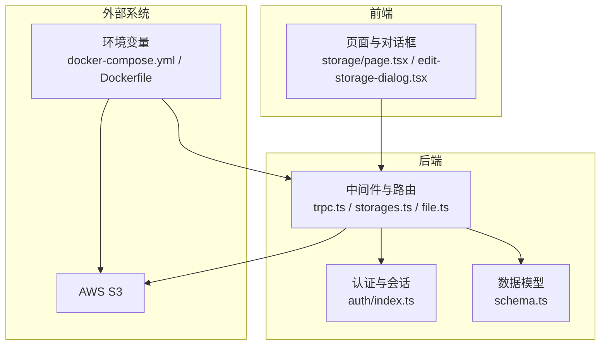
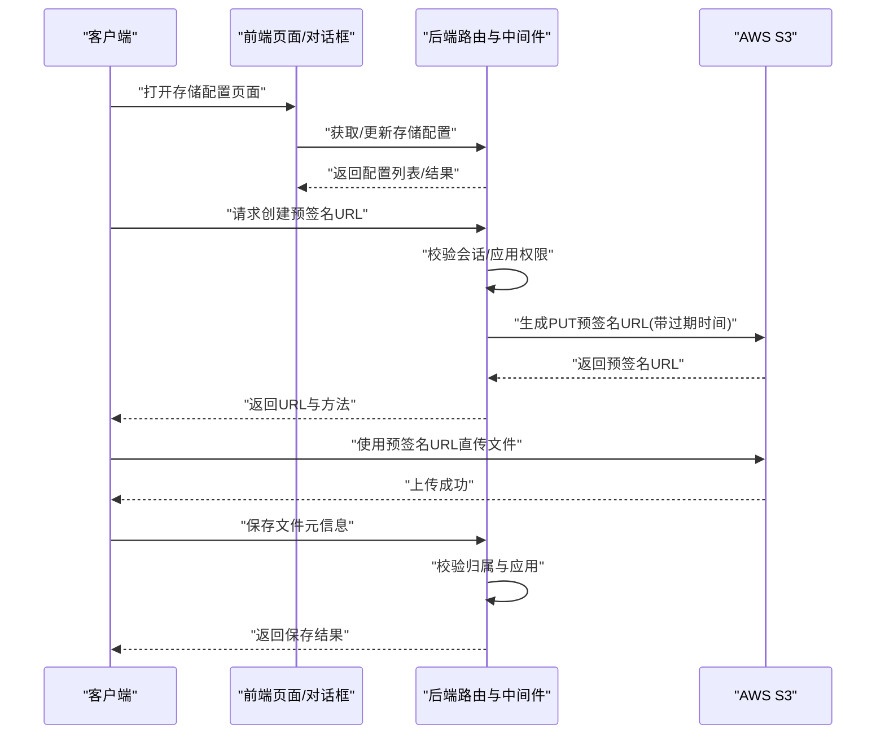
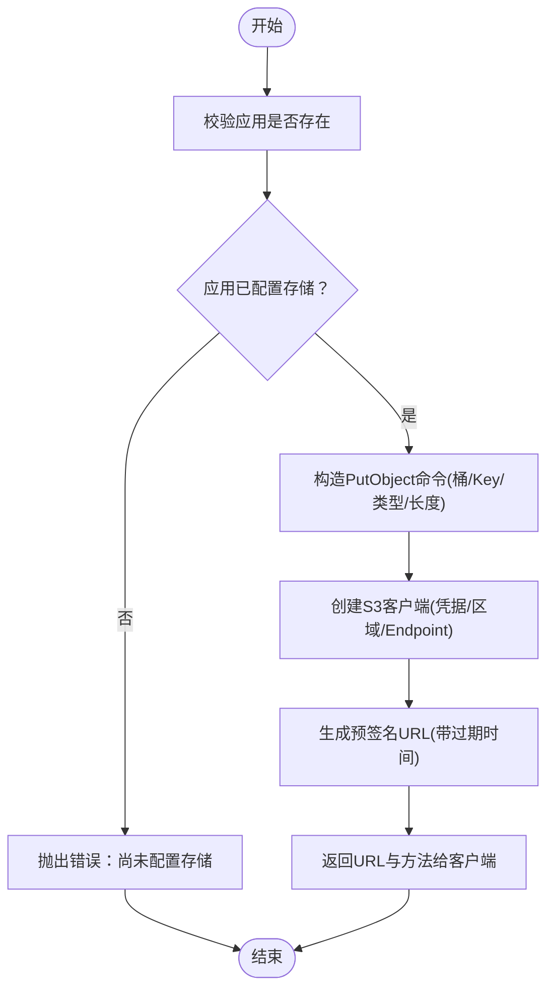
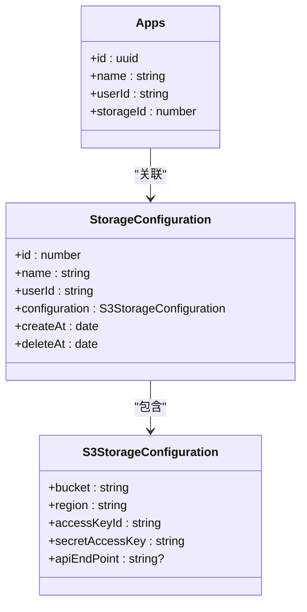
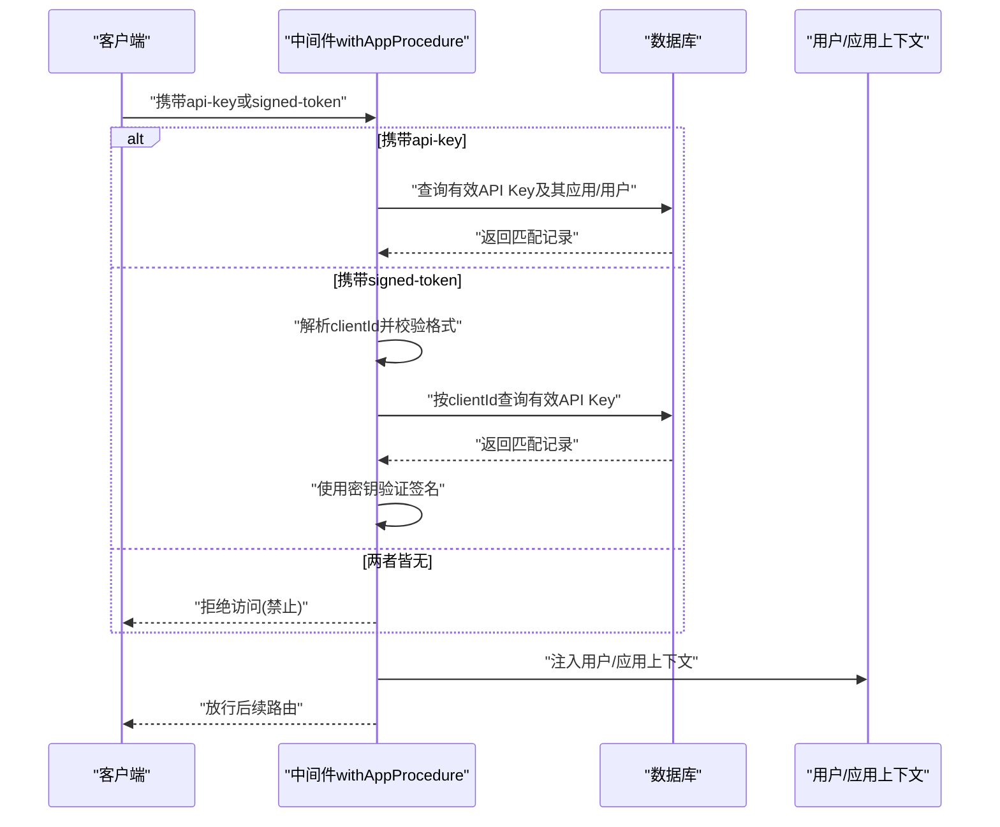
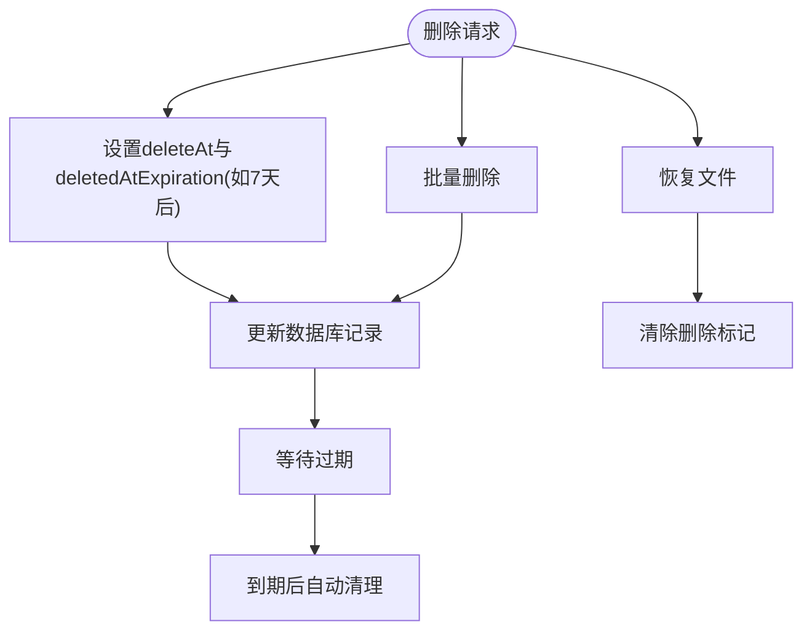
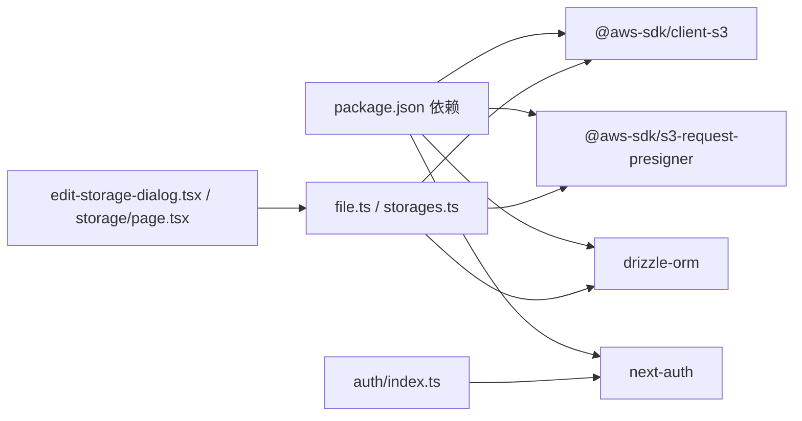

# 存储安全

<cite>
**本文引用的文件**
- [src/server/routes/file.ts](file://src/server/routes/file.ts)
- [src/server/routes/storages.ts](file://src/server/routes/storages.ts)
- [src/server/trpc-middlewares/trpc.ts](file://src/server/trpc-middlewares/trpc.ts)
- [src/server/db/schema.ts](file://src/server/db/schema.ts)
- [src/app/dashboard/apps/[appId]/setting/storage/page.tsx](file://src/app/dashboard/apps/[appId]/setting/storage/page.tsx)
- [src/components/feature/edit-storage-dialog.tsx](file://src/components/feature/edit-storage-dialog.tsx)
- [src/server/auth/index.ts](file://src/server/auth/index.ts)
- [src/utils/api.ts](file://src/utils/api.ts)
- [docker-compose.yml](file://docker-compose.yml)
- [Dockerfile](file://Dockerfile)
- [package.json](file://package.json)
</cite>

## 目录

1. [简介](#简介)
2. [项目结构](#项目结构)
3. [核心组件](#核心组件)
4. [架构总览](#架构总览)
5. [详细组件分析](#详细组件分析)
6. [依赖分析](#依赖分析)
7. [性能考虑](#性能考虑)
8. [故障排查指南](#故障排查指南)
9. [结论](#结论)
10. [附录](#附录)

## 简介

本文件面向 Image SaaS 项目，系统性梳理与 AWS S3 相关的存储安全设计与实现，覆盖以下主题：

- S3 存储的安全配置、访问控制与权限管理
- 预签名 URL 的生成机制、过期时间与访问限制
- 文件上传的安全策略（大小限制、类型验证）、持久化与生命周期管理
- 存储桶策略、IAM 角色与访问密钥管理建议
- 文件访问控制、共享链接安全与权限验证
- 存储加密、传输安全与数据备份策略
- 安全配置示例、威胁防护与安全监控方案
- 开发者存储安全开发指南与云存储最佳实践

## 项目结构

围绕存储安全的关键代码分布在如下模块：

- 路由层：负责生成预签名 URL、保存文件元信息、查询与回收站管理等
- 中间件层：统一鉴权与会话校验，以及基于 API Key 或签名 Token 的应用级授权
- 数据模型层：定义存储配置、应用与文件等实体关系
- 前端页面与对话框：提供存储配置的可视化管理入口
- 认证与运行时：NextAuth 会话、SKIP_LOGIN 模式、环境变量注入
- 容器与部署：Docker 环境变量注入与非 root 运行

**图表来源**

- [src/app/dashboard/apps/[appId]/setting/storage/page.tsx:1-103](file://src/app/dashboard/apps/[appId]/setting/storage/page.tsx#L1-L103)
- [src/components/feature/edit-storage-dialog.tsx:1-186](file://src/components/feature/edit-storage-dialog.tsx#L1-L186)
- [src/server/trpc-middlewares/trpc.ts:1-130](file://src/server/trpc-middlewares/trpc.ts#L1-L130)
- [src/server/routes/storages.ts:1-74](file://src/server/routes/storages.ts#L1-L74)
- [src/server/routes/file.ts:1-561](file://src/server/routes/file.ts#L1-L561)
- [src/server/db/schema.ts:1-270](file://src/server/db/schema.ts#L1-L270)
- [src/server/auth/index.ts:1-163](file://src/server/auth/index.ts#L1-L163)
- [docker-compose.yml:1-72](file://docker-compose.yml#L1-L72)
- [Dockerfile:1-76](file://Dockerfile#L1-L76)

**章节来源**

- [src/server/routes/file.ts:1-561](file://src/server/routes/file.ts#L1-L561)
- [src/server/routes/storages.ts:1-74](file://src/server/routes/storages.ts#L1-L74)
- [src/server/trpc-middlewares/trpc.ts:1-130](file://src/server/trpc-middlewares/trpc.ts#L1-L130)
- [src/server/db/schema.ts:1-270](file://src/server/db/schema.ts#L1-L270)
- [src/app/dashboard/apps/[appId]/setting/storage/page.tsx:1-103](file://src/app/dashboard/apps/[appId]/setting/storage/page.tsx#L1-L103)
- [src/components/feature/edit-storage-dialog.tsx:1-186](file://src/components/feature/edit-storage-dialog.tsx#L1-L186)
- [src/server/auth/index.ts:1-163](file://src/server/auth/index.ts#L1-L163)
- [docker-compose.yml:1-72](file://docker-compose.yml#L1-L72)
- [Dockerfile:1-76](file://Dockerfile#L1-L76)

## 核心组件

- 预签名 URL 生成与上传流程
  - 通过受保护过程生成 PUT 预签名 URL，设置短有效期，避免长期有效链接泄露风险
  - 上传完成后调用保存接口写入数据库记录
- 存储配置管理
  - 支持为应用绑定独立的 S3 存储配置（桶、区域、凭据、可选自定义 Endpoint）
  - 前端提供可视化编辑与切换
- 权限与访问控制
  - 基于 NextAuth 会话的受保护过程；API Key 或签名 Token 的应用级授权
  - 文件操作均进行用户与应用维度的归属校验
- 数据模型与生命周期
  - 文件软删除与过期清理；支持批量恢复与永久删除占位

**章节来源**

- [src/server/routes/file.ts:27-90](file://src/server/routes/file.ts#L27-L90)
- [src/server/routes/file.ts:91-118](file://src/server/routes/file.ts#L91-L118)
- [src/server/routes/storages.ts:15-72](file://src/server/routes/storages.ts#L15-L72)
- [src/server/trpc-middlewares/trpc.ts:30-45](file://src/server/trpc-middlewares/trpc.ts#L30-L45)
- [src/server/trpc-middlewares/trpc.ts:47-127](file://src/server/trpc-middlewares/trpc.ts#L47-L127)
- [src/server/db/schema.ts:120-173](file://src/server/db/schema.ts#L120-L173)

## 架构总览

下图展示从客户端到 S3 的关键交互路径，以及安全控制点。

**图表来源**

- [src/app/dashboard/apps/[appId]/setting/storage/page.tsx:34-35](file://src/app/dashboard/apps/[appId]/setting/storage/page.tsx#L34-L35)
- [src/components/feature/edit-storage-dialog.tsx:47-55](file://src/components/feature/edit-storage-dialog.tsx#L47-L55)
- [src/server/routes/file.ts:27-90](file://src/server/routes/file.ts#L27-L90)
- [src/server/routes/file.ts:91-118](file://src/server/routes/file.ts#L91-L118)
- [src/server/trpc-middlewares/trpc.ts:30-45](file://src/server/trpc-middlewares/trpc.ts#L30-L45)

## 详细组件分析

### 组件一：预签名 URL 生成与上传流程

- 关键行为
  - 生成 PUT 预签名 URL，设置较短有效期（例如 2 分钟），降低泄露风险
  - 上传前对应用存在性、存储配置存在性与归属进行严格校验
  - 上传完成后调用保存接口，持久化文件元信息
- 安全要点
  - 仅在服务端生成预签名 URL，避免前端暴露敏感凭据
  - 通过短有效期与一次性上传约束，限制攻击窗口
  - 上传参数包含内容类型与长度，便于后续校验与审计

**图表来源**

- [src/server/routes/file.ts:27-90](file://src/server/routes/file.ts#L27-L90)

**章节来源**

- [src/server/routes/file.ts:27-90](file://src/server/routes/file.ts#L27-L90)
- [src/server/routes/file.ts:91-118](file://src/server/routes/file.ts#L91-L118)

### 组件二：存储配置管理（S3 凭据与 Endpoint）

- 功能概述
  - 支持为应用绑定多个存储配置，包含桶、区域、Access Key、Secret Key 与可选 API Endpoint
  - 前端提供编辑对话框，输入项包含必填校验与密码字段
- 安全要点
  - Secret Key 以密码输入框提交，避免明文显示
  - 仅允许当前用户修改其拥有的存储配置
  - 建议在生产环境使用最小权限 IAM 角色与只读/写入范围受限的桶策略

**图表来源**

- [src/server/db/schema.ts:164-173](file://src/server/db/schema.ts#L164-L173)
- [src/server/db/schema.ts:154-160](file://src/server/db/schema.ts#L154-L160)
- [src/server/db/schema.ts:18-26](file://src/server/db/schema.ts#L18-L26)

**章节来源**

- [src/server/routes/storages.ts:15-72](file://src/server/routes/storages.ts#L15-L72)
- [src/app/dashboard/apps/[appId]/setting/storage/page.tsx:34-35](file://src/app/dashboard/apps/[appId]/setting/storage/page.tsx#L34-L35)
- [src/components/feature/edit-storage-dialog.tsx:47-55](file://src/components/feature/edit-storage-dialog.tsx#L47-L55)
- [src/server/db/schema.ts:164-173](file://src/server/db/schema.ts#L164-L173)

### 组件三：权限与访问控制（会话、API Key、签名 Token）

- 会话保护
  - 受保护过程要求已登录会话，否则拒绝访问
- 应用级授权
  - 支持两种方式：API Key 或签名 Token（含 clientId 与密钥）
  - 校验 API Key 有效性与未删除状态，并解析绑定的应用与用户
  - 校验签名 Token 的 clientId 与密钥一致性
- 文件操作权限
  - 所有文件操作均校验当前用户与目标应用的归属一致性

**图表来源**

- [src/server/trpc-middlewares/trpc.ts:47-127](file://src/server/trpc-middlewares/trpc.ts#L47-L127)

**章节来源**

- [src/server/trpc-middlewares/trpc.ts:30-45](file://src/server/trpc-middlewares/trpc.ts#L30-L45)
- [src/server/trpc-middlewares/trpc.ts:47-127](file://src/server/trpc-middlewares/trpc.ts#L47-L127)
- [src/server/routes/file.ts:120-133](file://src/server/routes/file.ts#L120-L133)

### 组件四：文件生命周期与回收站

- 软删除与过期
  - 删除文件时写入删除时间与过期时间（例如 7 天后），到期自动清理
- 批量与恢复
  - 支持批量删除与批量恢复
- 永久删除占位
  - 永久删除接口预留 S3 删除逻辑与数据库清理

**图表来源**

- [src/server/routes/file.ts:236-293](file://src/server/routes/file.ts#L236-L293)
- [src/server/routes/file.ts:295-342](file://src/server/routes/file.ts#L295-L342)
- [src/server/routes/file.ts:501-532](file://src/server/routes/file.ts#L501-L532)

**章节来源**

- [src/server/routes/file.ts:236-293](file://src/server/routes/file.ts#L236-L293)
- [src/server/routes/file.ts:295-342](file://src/server/routes/file.ts#L295-L342)
- [src/server/routes/file.ts:501-532](file://src/server/routes/file.ts#L501-L532)

## 依赖分析

- 外部依赖
  - AWS SDK（S3 客户端与预签名生成）
  - NextAuth（会话与登录）
  - Drizzle ORM（PostgreSQL 数据库访问）
- 内部依赖
  - 路由依赖中间件进行会话与应用授权
  - 数据模型定义存储配置与文件实体关系
  - 前端通过 trpc 客户端调用后端接口

**图表来源**

- [package.json:14-66](file://package.json#L14-L66)
- [src/server/routes/file.ts:4-8](file://src/server/routes/file.ts#L4-L8)
- [src/server/routes/storages.ts:1-5](file://src/server/routes/storages.ts#L1-L5)
- [src/server/auth/index.ts:1-10](file://src/server/auth/index.ts#L1-L10)

**章节来源**

- [package.json:14-66](file://package.json#L14-L66)
- [src/server/routes/file.ts:1-16](file://src/server/routes/file.ts#L1-L16)
- [src/server/routes/storages.ts:1-5](file://src/server/routes/storages.ts#L1-L5)
- [src/server/auth/index.ts:1-10](file://src/server/auth/index.ts#L1-L10)

## 性能考虑

- 预签名 URL 有效期
  - 建议保持较短有效期（如 1–5 分钟），减少泄露风险与无效资源占用
- 上传路径
  - 采用直传（客户端直接向 S3 PUT）可显著降低应用服务器带宽与 CPU 压力
- 数据库查询
  - 文件列表与搜索使用索引列与游标分页，避免全表扫描
- 缓存与日志
  - 控制调试日志输出频率，避免在高并发场景产生 I/O 压力

## 故障排查指南

- 预签名 URL 生成失败
  - 检查应用是否配置存储、存储配置是否属于当前用户
  - 校验 S3 凭据与区域是否正确，Endpoint 是否可达
- 上传失败
  - 确认预签名 URL 仍在有效期内
  - 检查文件类型与大小是否符合预期
- 权限错误
  - 确认会话有效；若使用 API Key/签名 Token，确认其有效性与绑定关系
- 回收站与删除
  - 若文件已软删除，确认过期时间与恢复流程

**章节来源**

- [src/server/routes/file.ts:40-61](file://src/server/routes/file.ts#L40-L61)
- [src/server/trpc-middlewares/trpc.ts:30-45](file://src/server/trpc-middlewares/trpc.ts#L30-L45)
- [src/server/trpc-middlewares/trpc.ts:47-127](file://src/server/trpc-middlewares/trpc.ts#L47-L127)

## 结论

本项目在存储安全方面采取了“服务端生成预签名 URL + 短有效期 + 受控直传 + 多层权限校验”的综合策略。结合软删除与过期清理，形成较为完整的文件生命周期管理。建议在生产环境中进一步完善 IAM 最小权限、桶策略与网络 ACL、传输加密与备份策略，以满足更严格的合规与安全要求。

## 附录

### A. AWS S3 存储安全配置清单（建议）

- 存储桶策略
  - 限制来源 IP 或 VPC Endpoint（如适用）
  - 禁止公开读写，仅允许服务端生成的预签名 URL 访问
  - 启用对象锁定与版本控制
- IAM 角色与策略
  - 为每个应用/租户分配最小权限角色
  - 使用条件键限制桶、前缀与操作范围
- 访问密钥管理
  - 使用短期临时凭证或 IAM 角色，避免长期使用主账号密钥
  - 密钥轮换与审计日志开启
- 传输与静态加密
  - 强制 TLS 传输；启用 S3 默认加密（SSE-S3 或 SSE-KMS）
- 备份与恢复
  - 启用跨区复制与生命周期策略，定期快照与离线备份

### B. 预签名 URL 安全最佳实践

- 过期时间
  - 上传类建议 1–5 分钟；下载类可适当延长但需配合其他限制
- URL 参数
  - 明确指定 ContentType 与 ContentLength，防止类型混淆与滥用
- 作用域
  - 限定 Key 前缀与对象名模式，避免越权访问
- 审计
  - 记录预签名 URL 的生成与使用轨迹，异常即刻撤销

### C. 文件上传安全策略

- 大小限制
  - 在前端与后端均设置上限，防止资源滥用
- 类型验证
  - 依据扩展名与 MIME 类型双重校验，必要时进行魔数检测
- 名称与路径
  - 生成随机 Key，避免路径穿越与重复覆盖
- 标签与元数据
  - 通过标签与元数据进行分类与合规追踪

### D. 认证与会话安全

- 会话
  - NextAuth 会话应设置合理过期与刷新策略
  - SKIP_LOGIN 模式仅用于开发测试，严禁用于生产
- API Key 与签名 Token
  - API Key 与密钥应妥善保管，定期轮换
  - 签名 Token 包含 clientId 并使用强密钥验证

**章节来源**

- [src/server/auth/index.ts:65-101](file://src/server/auth/index.ts#L65-L101)
- [src/server/auth/index.ts:140-160](file://src/server/auth/index.ts#L140-L160)
- [src/server/trpc-middlewares/trpc.ts:47-127](file://src/server/trpc-middlewares/trpc.ts#L47-L127)

### E. 部署与运行时安全

- 环境变量
  - 通过 docker-compose 注入数据库、OAuth 与 AWS 凭据
  - 严格控制环境变量可见范围与持久化
- 容器安全
  - 使用非 root 用户运行，最小化镜像层
  - 仅暴露必要端口，启用健康检查与重启策略

**章节来源**

- [docker-compose.yml:11-30](file://docker-compose.yml#L11-L30)
- [Dockerfile:56-69](file://Dockerfile#L56-L69)
