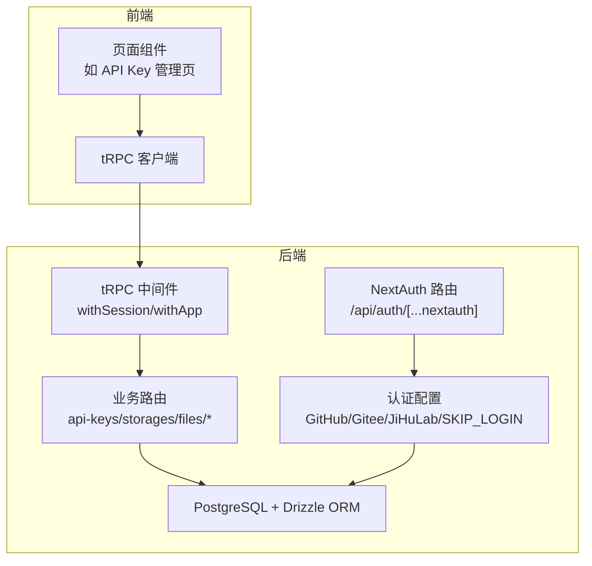
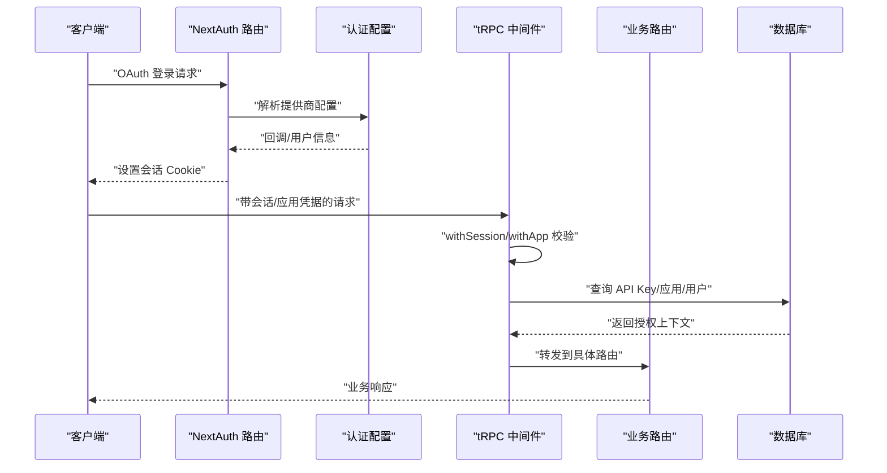
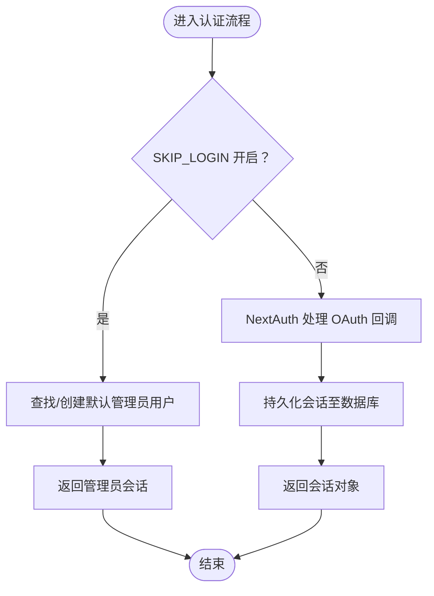
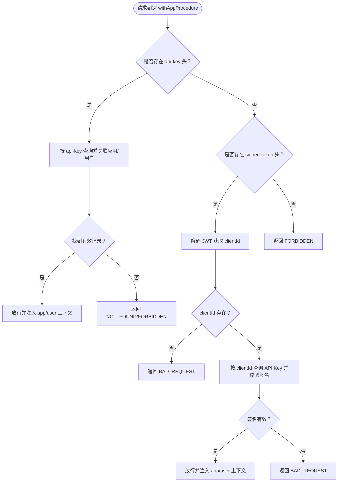
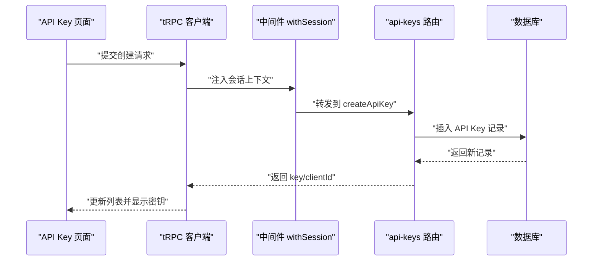
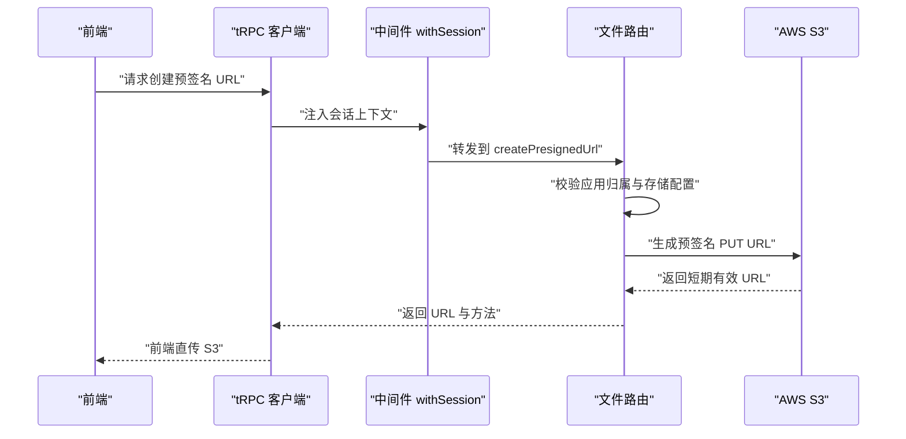
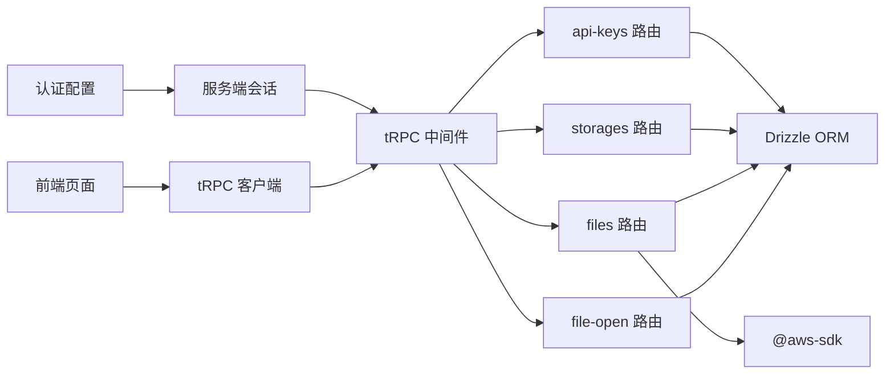

# 安全考虑

<cite>
**本文引用的文件**
- [src/server/auth/index.ts](file://src/server/auth/index.ts)
- [src/lib/auth.ts](file://src/lib/auth.ts)
- [src/app/api/auth/[...nextauth]/route.ts](file://src/app/api/auth/[...nextauth]/route.ts)
- [src/server/trpc-middlewares/trpc.ts](file://src/server/trpc-middlewares/trpc.ts)
- [src/server/routes/api-keys.ts](file://src/server/routes/api-keys.ts)
- [src/server/routes/storages.ts](file://src/server/routes/storages.ts)
- [src/server/routes/file.ts](file://src/server/routes/file.ts)
- [src/server/routes/file-open.ts](file://src/server/routes/file-open.ts)
- [src/server/db/schema.ts](file://src/server/db/schema.ts)
- [src/app/dashboard/apps/[appId]/setting/api-key/page.tsx](file://src/app/dashboard/apps/[appId]/setting/api-key/page.tsx)
- [src/app/dashboard/apps/[appId]/setting/storage/page.tsx](file://src/app/dashboard/apps/[appId]/setting/storage/page.tsx)
- [src/utils/api.ts](file://src/utils/api.ts)
- [package.json](file://package.json)
- [next.config.ts](file://next.config.ts)
</cite>

## 目录
1. [引言](#引言)
2. [项目结构](#项目结构)
3. [核心组件](#核心组件)
4. [架构总览](#架构总览)
5. [详细组件分析](#详细组件分析)
6. [依赖关系分析](#依赖关系分析)
7. [性能与安全权衡](#性能与安全权衡)
8. [故障排查指南](#故障排查指南)
9. [结论](#结论)
10. [附录：安全配置检查清单与应急响应](#附录安全配置检查清单与应急响应)

## 引言
本文件面向 Image SaaS 项目，系统性梳理认证安全、数据安全、API 安全与存储安全的实现策略，并结合现有代码路径进行落地说明。重点覆盖：
- OAuth 认证流程与会话管理
- 权限控制与访问控制（RBAC）
- API 密钥与签名令牌的管理与校验
- 数据与传输安全（含 S3 凭证与预签名 URL）
- 输入验证与输出处理最佳实践
- XSS、CSRF、注入等常见威胁的缓解
- 安全配置检查清单、渗透测试要点与应急响应建议

## 项目结构
项目采用 Next.js + tRPC + Drizzle ORM 的分层架构，安全相关能力主要分布在以下模块：
- 认证与会话：NextAuth 配置与服务端会话封装
- 路由与中间件：tRPC 中间件统一鉴权与应用级访问控制
- 数据模型：用户、应用、存储、API Key 等核心实体
- 前端调用：客户端通过 tRPC 与后端交互，携带 API Key 或会话

图表来源
- [src/app/api/auth/[...nextauth]/route.ts](file://src/app/api/auth/[...nextauth]/route.ts#L1-L7)
- [src/server/auth/index.ts:1-163](file://src/server/auth/index.ts#L1-L163)
- [src/server/trpc-middlewares/trpc.ts:1-130](file://src/server/trpc-middlewares/trpc.ts#L1-L130)
- [src/server/routes/api-keys.ts:1-38](file://src/server/routes/api-keys.ts#L1-L38)
- [src/server/routes/storages.ts:1-74](file://src/server/routes/storages.ts#L1-L74)
- [src/server/routes/file.ts:1-561](file://src/server/routes/file.ts#L1-L561)
- [src/server/routes/file-open.ts:1-197](file://src/server/routes/file-open.ts#L1-L197)
- [src/server/db/schema.ts:1-270](file://src/server/db/schema.ts#L1-L270)

章节来源
- [src/app/api/auth/[...nextauth]/route.ts](file://src/app/api/auth/[...nextauth]/route.ts#L1-L7)
- [src/server/auth/index.ts:1-163](file://src/server/auth/index.ts#L1-L163)
- [src/server/trpc-middlewares/trpc.ts:1-130](file://src/server/trpc-middlewares/trpc.ts#L1-L130)
- [src/server/routes/api-keys.ts:1-38](file://src/server/routes/api-keys.ts#L1-L38)
- [src/server/routes/storages.ts:1-74](file://src/server/routes/storages.ts#L1-L74)
- [src/server/routes/file.ts:1-561](file://src/server/routes/file.ts#L1-L561)
- [src/server/routes/file-open.ts:1-197](file://src/server/routes/file-open.ts#L1-L197)
- [src/server/db/schema.ts:1-270](file://src/server/db/schema.ts#L1-L270)

## 核心组件
- 认证与会话
  - NextAuth 提供 GitHub、Gitee、JiHuLab 多源 OAuth 登录；支持 SKIP_LOGIN 模式下的管理员自动登录与会话生成。
  - 服务端会话封装统一在认证模块导出，便于在 tRPC 中间件中复用。
- tRPC 中间件
  - withSession：注入用户会话上下文，保护基于会话的路由。
  - withApp：支持 API Key 与签名令牌两种应用级访问方式，完成应用维度的权限绑定。
- 数据模型
  - 用户、应用、存储配置、API Key、文件等核心实体，均具备用户维度的归属约束与软删除字段。
- 存储与文件
  - 通过 AWS SDK 生成预签名 URL，避免将长期凭证暴露于前端；上传流程由后端发起，降低凭证泄露风险。

章节来源
- [src/server/auth/index.ts:1-163](file://src/server/auth/index.ts#L1-L163)
- [src/lib/auth.ts:1-3](file://src/lib/auth.ts#L1-L3)
- [src/server/trpc-middlewares/trpc.ts:1-130](file://src/server/trpc-middlewares/trpc.ts#L1-L130)
- [src/server/db/schema.ts:1-270](file://src/server/db/schema.ts#L1-L270)
- [src/server/routes/file.ts:1-561](file://src/server/routes/file.ts#L1-L561)

## 架构总览
下图展示认证、会话、中间件与业务路由之间的交互关系，以及 API Key/签名令牌的应用级访问控制路径。

图表来源
- [src/app/api/auth/[...nextauth]/route.ts](file://src/app/api/auth/[...nextauth]/route.ts#L1-L7)
- [src/server/auth/index.ts:1-163](file://src/server/auth/index.ts#L1-L163)
- [src/server/trpc-middlewares/trpc.ts:1-130](file://src/server/trpc-middlewares/trpc.ts#L1-L130)
- [src/server/routes/api-keys.ts:1-38](file://src/server/routes/api-keys.ts#L1-L38)
- [src/server/routes/storages.ts:1-74](file://src/server/routes/storages.ts#L1-L74)
- [src/server/routes/file.ts:1-561](file://src/server/routes/file.ts#L1-L561)
- [src/server/routes/file-open.ts:1-197](file://src/server/routes/file-open.ts#L1-L197)
- [src/server/db/schema.ts:1-270](file://src/server/db/schema.ts#L1-L270)

## 详细组件分析

### 认证与会话管理
- OAuth 提供商
  - 支持 GitHub、自定义 Gitee、自定义 JiHuLab，均通过 NextAuth Providers 注入。
  - 用户资料映射与样式配置在认证配置中集中维护。
- SKIP_LOGIN 模式
  - 当启用时，系统自动创建/返回默认管理员用户，并生成服务端会话，用于本地开发或演示场景。
- 会话注入
  - tRPC 中间件通过服务端会话函数注入 session 上下文，后续路由可直接读取用户身份。

图表来源
- [src/server/auth/index.ts:66-101](file://src/server/auth/index.ts#L66-L101)
- [src/server/auth/index.ts:141-160](file://src/server/auth/index.ts#L141-L160)

章节来源
- [src/server/auth/index.ts:1-163](file://src/server/auth/index.ts#L1-L163)
- [src/lib/auth.ts:1-3](file://src/lib/auth.ts#L1-L3)
- [src/app/api/auth/[...nextauth]/route.ts](file://src/app/api/auth/[...nextauth]/route.ts#L1-L7)
- [src/server/trpc-middlewares/trpc.ts:11-19](file://src/server/trpc-middlewares/trpc.ts#L11-L19)

### 权限控制与访问控制
- 基于会话的保护
  - protectedProcedure 在中间件中校验 session.user 是否存在，缺失则拒绝访问。
- 应用级访问控制
  - withAppProcedure 支持两种凭据：
    - API Key：从请求头读取 api-key，匹配数据库中的有效 API Key 并关联到应用与用户。
    - 签名令牌：从请求头读取 signed-token，解码后校验其中的 clientId，再与 API Key 的密钥进行 JWT 校验。
  - 两种凭据均需确保 API Key 未被删除且与应用/用户绑定正确。

图表来源
- [src/server/trpc-middlewares/trpc.ts:47-127](file://src/server/trpc-middlewares/trpc.ts#L47-L127)

章节来源
- [src/server/trpc-middlewares/trpc.ts:30-45](file://src/server/trpc-middlewares/trpc.ts#L30-L45)
- [src/server/trpc-middlewares/trpc.ts:47-127](file://src/server/trpc-middlewares/trpc.ts#L47-L127)

### API 密钥管理
- 创建
  - 生成唯一 key 与 clientId，绑定到指定应用，返回给前端。
- 列表
  - 仅列出当前应用的有效 API Key（未删除）。
- 前端展示
  - API Key 页面在创建成功后刷新列表并展示新生成的密钥。

图表来源
- [src/server/routes/api-keys.ts:17-36](file://src/server/routes/api-keys.ts#L17-L36)
- [src/app/dashboard/apps/[appId]/setting/api-key/page.tsx](file://src/app/dashboard/apps/[appId]/setting/api-key/page.tsx#L19-L30)

章节来源
- [src/server/routes/api-keys.ts:1-38](file://src/server/routes/api-keys.ts#L1-L38)
- [src/app/dashboard/apps/[appId]/setting/api-key/page.tsx](file://src/app/dashboard/apps/[appId]/setting/api-key/page.tsx#L1-L80)

### 存储与文件安全
- 存储配置
  - 仅允许当前用户创建/更新其存储配置；更新时按用户 ID 与存储 ID 进行二次校验。
- 预签名上传
  - 后端根据应用绑定的存储配置构造 S3 客户端，生成短期有效的预签名 PUT URL，避免前端持有长期凭证。
- 文件操作
  - 列表、分页、删除、恢复、批量操作均强制基于用户 ID 与应用 ID 的双重校验；软删除保留回收期，防止误删导致不可逆损失。

图表来源
- [src/server/routes/file.ts:27-90](file://src/server/routes/file.ts#L27-L90)

章节来源
- [src/server/routes/storages.ts:15-73](file://src/server/routes/storages.ts#L15-L73)
- [src/server/routes/file.ts:27-90](file://src/server/routes/file.ts#L27-L90)
- [src/server/routes/file.ts:120-234](file://src/server/routes/file.ts#L120-L234)
- [src/server/routes/file.ts:236-342](file://src/server/routes/file.ts#L236-L342)

### 开放接口与签名令牌
- withAppProcedure 同时支持开放接口场景：
  - API Key 直连：适合服务端到服务端调用。
  - 签名令牌：适合前端或第三方客户端，通过后端签发短期 JWT，携带 clientId 与密钥进行校验。
- 关键点
  - 严格校验 API Key 有效性与删除状态。
  - 对签名令牌进行解码与 JWT 校验，确保密钥一致。

章节来源
- [src/server/routes/file-open.ts:31-87](file://src/server/routes/file-open.ts#L31-L87)
- [src/server/routes/file-open.ts:114-194](file://src/server/routes/file-open.ts#L114-L194)
- [src/server/trpc-middlewares/trpc.ts:47-127](file://src/server/trpc-middlewares/trpc.ts#L47-L127)

## 依赖关系分析
- 认证与会话
  - NextAuth 与 Drizzle Adapter 集成，会话持久化至数据库；认证配置集中于服务端模块。
- tRPC 中间件
  - 依赖 NextAuth 服务端会话；同时依赖数据库查询 API Key 与应用关系。
- 业务路由
  - 文件路由依赖 AWS SDK 生成预签名 URL；存储路由依赖数据库写入与更新。
- 前端
  - 通过 tRPC 客户端访问后端接口，URL 来源于环境变量。

图表来源
- [src/server/auth/index.ts:1-163](file://src/server/auth/index.ts#L1-L163)
- [src/server/trpc-middlewares/trpc.ts:1-130](file://src/server/trpc-middlewares/trpc.ts#L1-L130)
- [src/server/routes/api-keys.ts:1-38](file://src/server/routes/api-keys.ts#L1-L38)
- [src/server/routes/storages.ts:1-74](file://src/server/routes/storages.ts#L1-L74)
- [src/server/routes/file.ts:1-561](file://src/server/routes/file.ts#L1-L561)
- [src/server/routes/file-open.ts:1-197](file://src/server/routes/file-open.ts#L1-L197)
- [src/utils/api.ts:1-17](file://src/utils/api.ts#L1-L17)
- [package.json:14-66](file://package.json#L14-L66)

章节来源
- [src/utils/api.ts:1-17](file://src/utils/api.ts#L1-L17)
- [package.json:14-66](file://package.json#L14-L66)

## 性能与安全权衡
- 预签名 URL 的有效期
  - 当前预签名 URL 有效期为约 2 分钟，建议根据实际上传耗时与并发情况评估，必要时缩短以增强安全性。
- 中间件链路
  - withApp 与 withSession 均涉及数据库查询，应关注慢查询与索引优化；对高频接口可考虑缓存策略（谨慎使用）。
- 传输安全
  - 生产环境必须启用 HTTPS；Next.js 配置已限制图片远程来源为 https，有助于减少混合内容风险。

章节来源
- [src/server/routes/file.ts:82-84](file://src/server/routes/file.ts#L82-L84)
- [next.config.ts:11-18](file://next.config.ts#L11-L18)

## 故障排查指南
- OAuth 登录失败
  - 检查提供商的 clientId/clientSecret 是否正确配置；确认回调地址与环境一致。
- 403/401 访问受限
  - 确认请求是否携带有效会话或 API Key/签名令牌；核对 API Key 未被删除且与应用/用户绑定正确。
- 预签名 URL 失效
  - 检查存储配置中的凭证是否正确；确认时间同步与区域配置；适当调整预签名有效期。
- 文件操作异常
  - 确认用户 ID 与应用 ID 的双重校验逻辑是否命中；检查软删除状态与回收期设置。

章节来源
- [src/server/trpc-middlewares/trpc.ts:34-45](file://src/server/trpc-middlewares/trpc.ts#L34-L45)
- [src/server/trpc-middlewares/trpc.ts:52-77](file://src/server/trpc-middlewares/trpc.ts#L52-L77)
- [src/server/routes/file.ts:40-61](file://src/server/routes/file.ts#L40-L61)
- [src/server/routes/file.ts:236-262](file://src/server/routes/file.ts#L236-L262)

## 结论
本项目在认证、会话、API 访问控制与存储安全方面形成了较为完善的闭环：OAuth 多源登录、服务端会话、tRPC 中间件统一鉴权、API Key 与签名令牌双轨制、预签名上传与软删除策略。建议在生产环境中进一步强化传输加密、密钥轮换、审计日志与监控告警，持续完善安全基线。

## 附录：安全配置检查清单与应急响应

### 安全配置检查清单
- 认证与会话
  - 必须启用 HTTPS；NextAuth 回调域名与环境一致；SKIP_LOGIN 仅用于开发环境。
- API 访问控制
  - 所有外部接口必须通过 withAppProcedure；API Key 与签名令牌均需校验有效性与删除状态。
- 数据与传输
  - 预签名 URL 有效期合理；S3 凭证仅在服务端使用；禁止在前端存储敏感密钥。
- 输入与输出
  - 使用 Zod 对所有入参进行严格校验；对输出进行最小化暴露，避免泄露内部结构。
- 日志与审计
  - 记录关键操作（创建/删除 API Key、变更存储配置、文件操作）；设置告警阈值。

### 渗透测试指南
- 认证绕过
  - 测试缺少会话/凭据时的错误码与响应；验证 SKIP_LOGIN 场景的边界。
- 权限提升
  - 尝试使用他人 API Key 或签名令牌访问其他应用资源；验证用户 ID 与应用 ID 的双重校验。
- 上传与存储
  - 上传超大文件、恶意文件类型；验证预签名 URL 的范围限制与过期策略。
- SSRF 与命令注入
  - 检查 S3 endpoint 与 region 参数是否可控；避免拼接不受控输入。

### 应急响应计划
- 密钥泄露
  - 立即禁用受影响的 API Key；撤销签名令牌；轮换 S3 凭证。
- 会话劫持
  - 强制下线受影响用户；检查会话存储与 Cookie 安全属性。
- 数据泄露
  - 回滚到最近备份；审查审计日志；通知受影响用户。
- 服务中断
  - 快速切换备用存储；回滚可疑变更；恢复预签名 URL 服务。