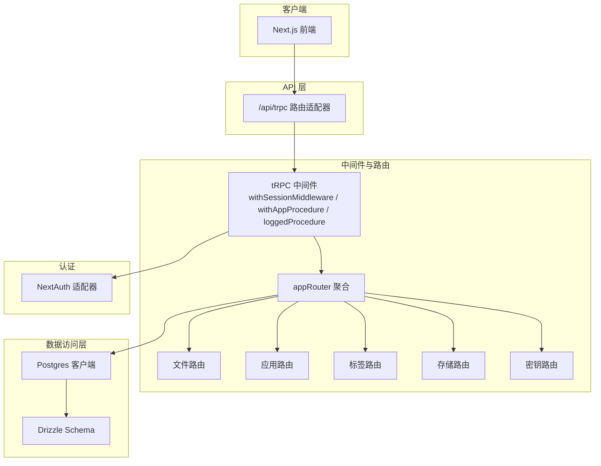
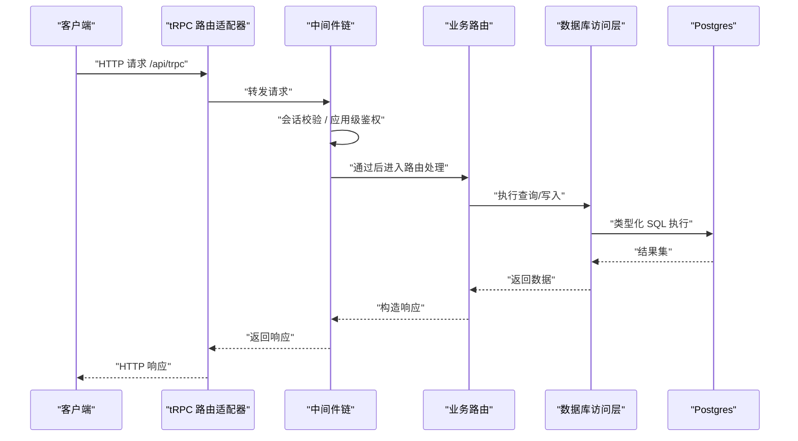
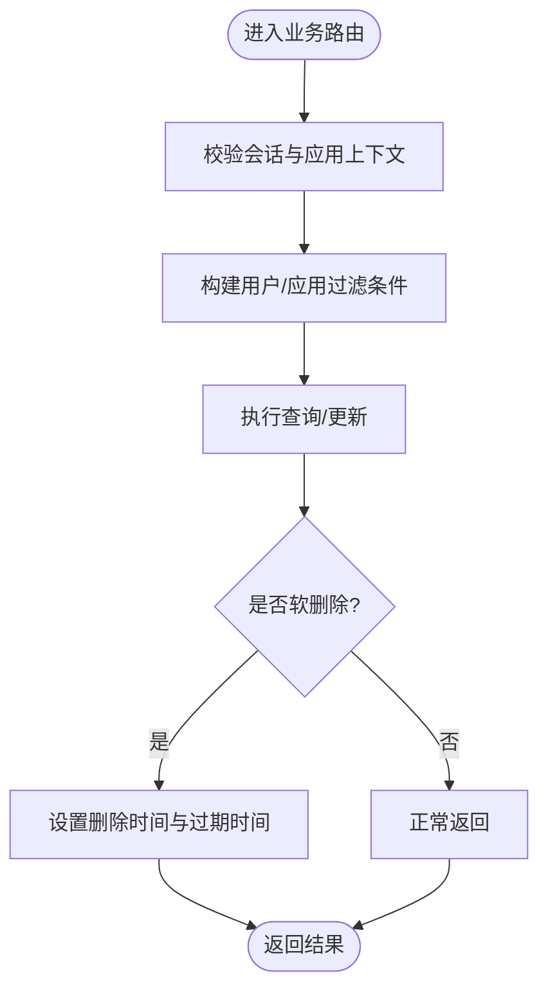
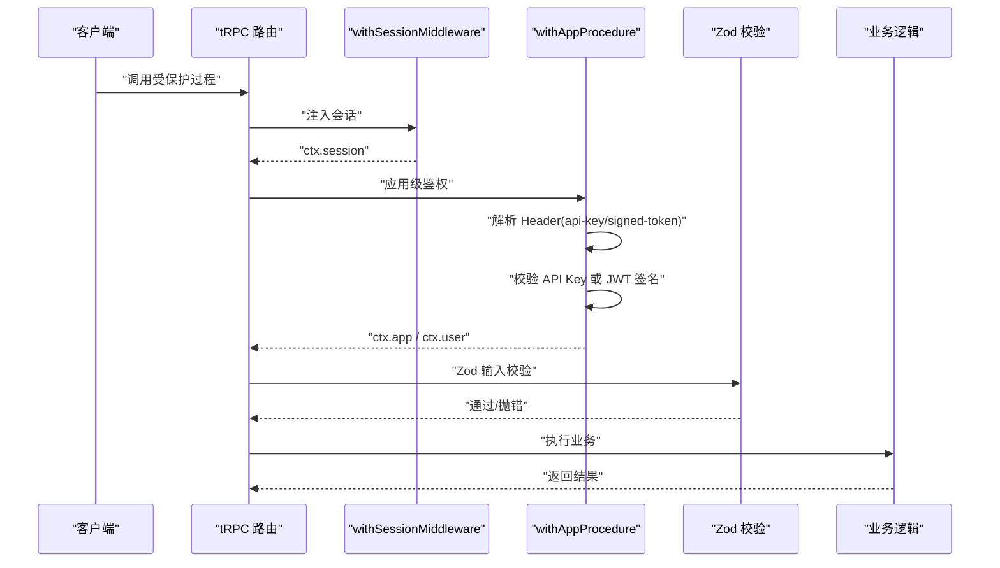
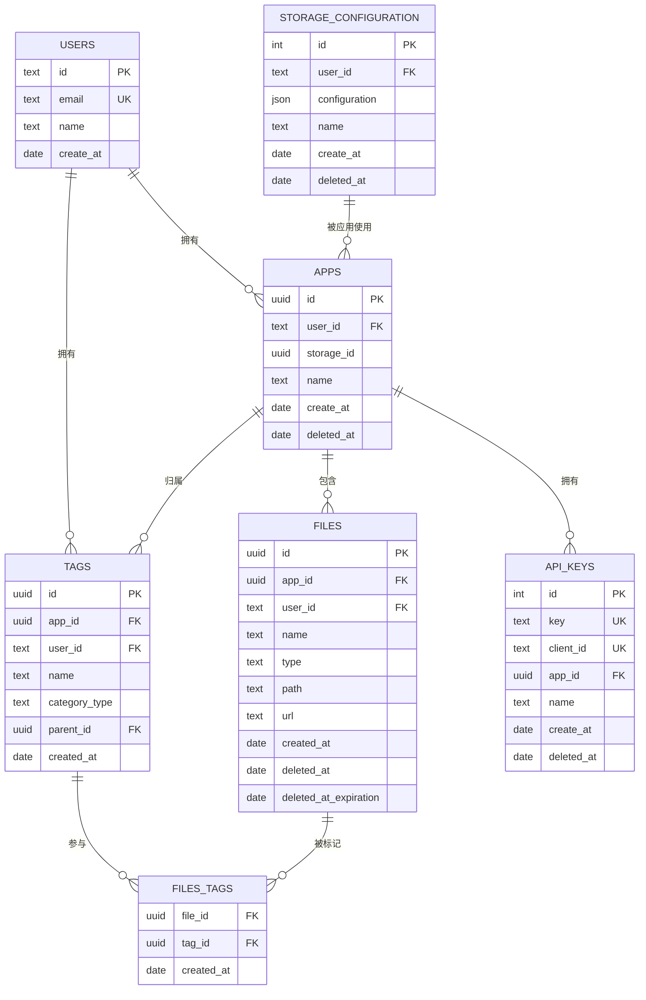
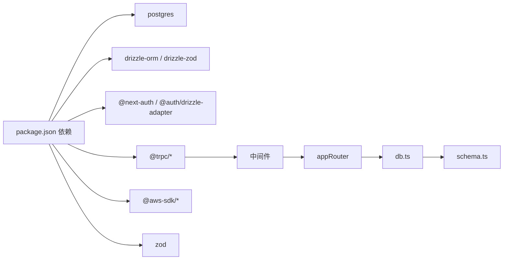

# 数据安全

<cite>
**本文引用的文件**
- [src/server/db/db.ts](file://src/server/db/db.ts)
- [src/server/db/schema.ts](file://src/server/db/schema.ts)
- [src/server/db/validate-schema.ts](file://src/server/db/validate-schema.ts)
- [src/server/auth/index.ts](file://src/server/auth/index.ts)
- [src/lib/auth.ts](file://src/lib/auth.ts)
- [src/server/trpc-middlewares/trpc.ts](file://src/server/trpc-middlewares/trpc.ts)
- [src/server/trpc-middlewares/router.ts](file://src/server/trpc-middlewares/router.ts)
- [src/app/api/trpc/[...trpc]/route.ts](file://src/app/api/trpc/[...trpc]/route.ts)
- [src/utils/trpc.ts](file://src/utils/trpc.ts)
- [src/server/routes/file.ts](file://src/server/routes/file.ts)
- [src/server/routes/api-keys.ts](file://src/server/routes/api-keys.ts)
- [src/server/routes/app.ts](file://src/server/routes/app.ts)
- [src/server/routes/storages.ts](file://src/server/routes/storages.ts)
- [drizzle.config.ts](file://drizzle.config.ts)
- [package.json](file://package.json)
</cite>

## 目录

1. [引言](#引言)
2. [项目结构](#项目结构)
3. [核心组件](#核心组件)
4. [架构总览](#架构总览)
5. [详细组件分析](#详细组件分析)
6. [依赖关系分析](#依赖关系分析)
7. [性能与安全考量](#性能与安全考量)
8. [故障排查指南](#故障排查指南)
9. [结论](#结论)
10. [附录：安全开发指南与最佳实践](#附录安全开发指南与最佳实践)

## 引言

本文件面向 Image SaaS 项目，系统化梳理数据安全设计与实现，覆盖数据库连接安全、查询验证与访问控制、tRPC 中间件与参数校验、数据库模型约束、SQL 注入防护、数据与传输加密、API 安全与访问日志、备份与灾难恢复、数据完整性与审计、以及面向开发者的安全开发指南与最佳实践。内容基于仓库现有实现进行归纳与可视化，帮助开发者在不引入额外依赖的前提下，建立可落地的安全基线。

## 项目结构

项目采用分层组织：前端 Next.js 应用、tRPC 路由适配器、服务端中间件与路由、数据库访问层（Drizzle ORM）、认证与会话（NextAuth）。API 请求通过 tRPC 路由适配器进入，经中间件链路完成会话与访问控制，再调用业务路由与数据库操作。

图表来源

- [src/app/api/trpc/[...trpc]/route.ts](file://src/app/api/trpc/[...trpc]/route.ts#L1-L14)
- [src/server/trpc-middlewares/router.ts:1-20](file://src/server/trpc-middlewares/router.ts#L1-L20)
- [src/server/trpc-middlewares/trpc.ts:1-130](file://src/server/trpc-middlewares/trpc.ts#L1-L130)
- [src/server/db/db.ts:1-9](file://src/server/db/db.ts#L1-L9)
- [src/server/db/schema.ts:1-270](file://src/server/db/schema.ts#L1-L270)
- [src/server/auth/index.ts:1-163](file://src/server/auth/index.ts#L1-L163)

章节来源

- [src/app/api/trpc/[...trpc]/route.ts](file://src/app/api/trpc/[...trpc]/route.ts#L1-L14)
- [src/server/trpc-middlewares/router.ts:1-20](file://src/server/trpc-middlewares/router.ts#L1-L20)
- [src/server/trpc-middlewares/trpc.ts:1-130](file://src/server/trpc-middlewares/trpc.ts#L1-L130)
- [src/server/db/db.ts:1-9](file://src/server/db/db.ts#L1-L9)
- [src/server/db/schema.ts:1-270](file://src/server/db/schema.ts#L1-L270)
- [src/server/auth/index.ts:1-163](file://src/server/auth/index.ts#L1-L163)

## 核心组件

- 数据库连接与访问
  - 使用 Postgres 客户端与 Drizzle ORM 进行类型化查询，连接字符串来自环境变量，避免明文硬编码。
  - 数据库迁移配置通过 drizzle-kit 与环境变量驱动，确保迁移与生产一致。
- 认证与会话
  - NextAuth 集成 Drizzle Adapter，支持多提供商登录；提供服务端会话读取能力，并支持“跳过登录”模式用于本地开发。
- tRPC 中间件与路由
  - 提供会话注入、应用级访问控制（API Key 或签名 Token）、请求耗时日志等中间件；路由按模块聚合，职责清晰。
- 数据模型与约束
  - 使用 Drizzle 的强类型表定义，结合唯一索引、外键、非空约束与复合主键，保障数据一致性。
- 参数验证与输入清理
  - 使用 Zod 对输入进行严格校验，配合 Drizzle-Zod 生成的 Schema，减少越界与异常输入风险。

章节来源

- [src/server/db/db.ts:1-9](file://src/server/db/db.ts#L1-L9)
- [drizzle.config.ts:1-14](file://drizzle.config.ts#L1-L14)
- [src/server/auth/index.ts:1-163](file://src/server/auth/index.ts#L1-L163)
- [src/lib/auth.ts:1-3](file://src/lib/auth.ts#L1-L3)
- [src/server/trpc-middlewares/trpc.ts:1-130](file://src/server/trpc-middlewares/trpc.ts#L1-L130)
- [src/server/trpc-middlewares/router.ts:1-20](file://src/server/trpc-middlewares/router.ts#L1-L20)
- [src/server/db/schema.ts:1-270](file://src/server/db/schema.ts#L1-L270)
- [src/server/db/validate-schema.ts:1-18](file://src/server/db/validate-schema.ts#L1-L18)
- [src/server/routes/file.ts:1-561](file://src/server/routes/file.ts#L1-L561)
- [src/server/routes/api-keys.ts:1-38](file://src/server/routes/api-keys.ts#L1-L38)
- [src/server/routes/app.ts:1-88](file://src/server/routes/app.ts#L1-L88)
- [src/server/routes/storages.ts:1-74](file://src/server/routes/storages.ts#L1-L74)

## 架构总览

下图展示从客户端到数据库的关键路径与安全控制点：

图表来源

- [src/app/api/trpc/[...trpc]/route.ts](file://src/app/api/trpc/[...trpc]/route.ts#L1-L14)
- [src/server/trpc-middlewares/trpc.ts:1-130](file://src/server/trpc-middlewares/trpc.ts#L1-L130)
- [src/server/trpc-middlewares/router.ts:1-20](file://src/server/trpc-middlewares/router.ts#L1-L20)
- [src/server/db/db.ts:1-9](file://src/server/db/db.ts#L1-L9)

## 详细组件分析

### 数据库连接与访问控制

- 连接安全
  - 连接字符串来自环境变量，避免硬编码；Drizzle 初始化时传入 schema，确保类型安全与查询隔离。
- 查询与访问控制
  - 所有路由均在中间件中注入会话上下文；业务路由在执行前对用户 ID、应用 ID 等进行显式校验，防止越权访问。
  - 删除类操作采用软删除字段与过期时间控制，避免误删与数据不可追溯。

图表来源

- [src/server/trpc-middlewares/trpc.ts:30-45](file://src/server/trpc-middlewares/trpc.ts#L30-L45)
- [src/server/routes/file.ts:236-293](file://src/server/routes/file.ts#L236-L293)
- [src/server/routes/file.ts:295-342](file://src/server/routes/file.ts#L295-L342)

章节来源

- [src/server/db/db.ts:1-9](file://src/server/db/db.ts#L1-L9)
- [src/server/trpc-middlewares/trpc.ts:30-45](file://src/server/trpc-middlewares/trpc.ts#L30-L45)
- [src/server/routes/file.ts:236-342](file://src/server/routes/file.ts#L236-L342)

### tRPC 中间件与参数验证

- 中间件链
  - 会话注入：从服务端会话读取用户信息，注入到 ctx。
  - 应用级鉴权：支持 API Key 与签名 Token 两种方式；API Key 直连校验，签名 Token 解码后校验签名与客户端标识。
  - 日志中间件：记录请求耗时，便于性能与安全审计。
- 参数验证
  - 所有输入使用 Zod Schema 校验，结合 Drizzle-Zod 生成的 Select/Insert Schema，保证字段范围与类型一致。
  - 列排序字段白名单限制，避免动态列注入。

图表来源

- [src/server/trpc-middlewares/trpc.ts:11-127](file://src/server/trpc-middlewares/trpc.ts#L11-L127)
- [src/server/db/validate-schema.ts:1-18](file://src/server/db/validate-schema.ts#L1-L18)
- [src/server/routes/file.ts:17-22](file://src/server/routes/file.ts#L17-L22)

章节来源

- [src/server/trpc-middlewares/trpc.ts:1-130](file://src/server/trpc-middlewares/trpc.ts#L1-L130)
- [src/server/db/validate-schema.ts:1-18](file://src/server/db/validate-schema.ts#L1-L18)
- [src/server/routes/file.ts:17-22](file://src/server/routes/file.ts#L17-L22)

### 数据库模型与约束

- 表与关系
  - 用户、应用、文件、标签、存储配置、API Key 等核心实体通过 Drizzle 表定义，明确主键、外键与索引。
  - 关系映射使用 relations，确保关联查询的一致性。
- 约束与索引
  - 唯一约束（如用户邮箱、API Key、客户端 ID）降低重复与冲突风险。
  - 复合主键与索引优化常见查询（如文件游标索引、标签多维索引）。
- 类型安全
  - JSON 字段使用类型别名限定结构，减少运行时错误。

图表来源

- [src/server/db/schema.ts:18-270](file://src/server/db/schema.ts#L18-L270)

章节来源

- [src/server/db/schema.ts:1-270](file://src/server/db/schema.ts#L1-L270)

### SQL 注入防护与输入清理

- 防护策略
  - 使用 Drizzle ORM 的类型化查询与参数绑定，避免原生 SQL 拼接。
  - 列排序字段白名单限制，禁止动态列名注入。
  - 搜索条件使用参数化 SQL 片段，避免用户输入直接拼接到 SQL。
- 输入清理
  - 所有外部输入通过 Zod 校验，长度、格式与枚举值均受控。
  - URL 解析与路径规范化，避免路径穿越与非法字符。

章节来源

- [src/server/routes/file.ts:17-22](file://src/server/routes/file.ts#L17-L22)
- [src/server/routes/file.ts:168-196](file://src/server/routes/file.ts#L168-L196)
- [src/server/routes/file.ts:103-114](file://src/server/routes/file.ts#L103-L114)

### 数据传输加密与 API 安全

- 传输加密
  - 建议在网关/反向代理层启用 TLS 终止；S3 上传使用预签名 URL，避免暴露密钥。
- API 安全
  - API Key 与签名 Token 双通道鉴权，签名 Token 依赖密钥进行签名校验。
  - 会话中间件强制要求已登录用户，拒绝匿名访问。
- 访问日志
  - 日志中间件记录请求耗时，可用于异常追踪与安全审计。

章节来源

- [src/server/trpc-middlewares/trpc.ts:47-127](file://src/server/trpc-middlewares/trpc.ts#L47-L127)
- [src/server/routes/file.ts:64-84](file://src/server/routes/file.ts#L64-L84)

### 认证与会话

- NextAuth 集成
  - Drizzle Adapter 将 NextAuth 的会话、账户、认证器等表与数据库同步。
  - 支持多提供商登录；SKIP_LOGIN 模式用于本地快速启动。
- 服务端会话
  - 提供统一的 getServerSession 封装，兼容 SKIP_LOGIN 场景。

章节来源

- [src/server/auth/index.ts:1-163](file://src/server/auth/index.ts#L1-L163)
- [src/lib/auth.ts:1-3](file://src/lib/auth.ts#L1-L3)

### tRPC 调用与服务端执行

- 服务端调用
  - 提供 serverCaller，便于在服务端直接调用 tRPC 路由，保持与客户端一致的中间件与校验链。

章节来源

- [src/utils/trpc.ts:1-7](file://src/utils/trpc.ts#L1-L7)

## 依赖关系分析

- 外部依赖
  - 数据库：Postgres（postgres 客户端 + Drizzle ORM）
  - 认证：NextAuth + Drizzle Adapter
  - API：tRPC（@trpc/server、@trpc/client、适配器）
  - 存储：AWS S3 SDK（用于预签名 URL）
  - 校验：Zod + drizzle-zod
- 内部耦合
  - 路由聚合于 appRouter，中间件贯穿所有过程，确保一致的安全策略。
  - 数据访问集中在 db.ts，Schema 与验证模块解耦，便于演进。

图表来源

- [package.json:14-66](file://package.json#L14-L66)
- [src/server/db/db.ts:1-9](file://src/server/db/db.ts#L1-L9)
- [src/server/db/schema.ts:1-270](file://src/server/db/schema.ts#L1-L270)
- [src/server/trpc-middlewares/router.ts:1-20](file://src/server/trpc-middlewares/router.ts#L1-L20)
- [src/server/trpc-middlewares/trpc.ts:1-130](file://src/server/trpc-middlewares/trpc.ts#L1-L130)

章节来源

- [package.json:14-66](file://package.json#L14-L66)
- [src/server/db/db.ts:1-9](file://src/server/db/db.ts#L1-L9)
- [src/server/db/schema.ts:1-270](file://src/server/db/schema.ts#L1-L270)
- [src/server/trpc-middlewares/router.ts:1-20](file://src/server/trpc-middlewares/router.ts#L1-L20)
- [src/server/trpc-middlewares/trpc.ts:1-130](file://src/server/trpc-middlewares/trpc.ts#L1-L130)

## 性能与安全考量

- 性能
  - 合理索引：文件游标索引、标签多维索引有助于分页与搜索。
  - 分页与游标：无限滚动使用游标与固定 limit，避免大偏移。
- 安全
  - 仅在必要时记录敏感信息；日志中避免输出密钥、Token。
  - 传输层建议启用 HTTPS；内部网络建议使用 mTLS 或受信网络。
  - 定期轮换 API Key 与签名密钥；对异常访问行为进行告警与限流。

[本节为通用指导，无需列出具体文件来源]

## 故障排查指南

- 无法连接数据库
  - 检查 DATABASE_URL 是否正确；确认容器/云服务可达。
- 403/401 鉴权失败
  - 确认请求头中携带 api-key 或 signed-token；检查签名 Token 的签发方与客户端 ID。
- 业务数据越权
  - 核对 ctx.session.user.id 与资源所属用户是否一致；确认应用 ID 与用户绑定关系。
- 预签名 URL 失败
  - 检查存储配置中的桶、区域、凭据是否正确；确认 IAM 权限与有效期。

章节来源

- [src/server/trpc-middlewares/trpc.ts:47-127](file://src/server/trpc-middlewares/trpc.ts#L47-L127)
- [src/server/routes/file.ts:40-84](file://src/server/routes/file.ts#L40-L84)
- [src/server/routes/storages.ts:26-38](file://src/server/routes/storages.ts#L26-L38)

## 结论

本项目在数据安全方面已具备较为完善的基线：严格的中间件鉴权、类型化数据库访问、Zod 输入校验、白名单列排序与参数化查询，有效降低了越权与注入风险。建议在生产环境中进一步完善传输加密、密钥轮换、访问日志与审计、备份与灾难恢复策略，持续提升整体安全性与合规性。

[本节为总结，无需列出具体文件来源]

## 附录：安全开发指南与最佳实践

- 数据库
  - 使用环境变量管理连接串；定期审查索引与查询计划；对敏感字段增加最小权限访问。
- tRPC
  - 所有输入必须通过 Zod 校验；过程尽量短小内聚；避免在中间件中做重逻辑。
- 认证
  - 优先使用短期 Token；对签名 Token 增加签名校验与过期时间；限制登录提供商数量。
- 存储
  - 预签名 URL 有效期尽量短；对上传路径进行规范化；避免泄露密钥。
- 日志与监控
  - 记录关键事件（登录、鉴权失败、敏感操作）；设置阈值告警与自动封禁。
- 备份与恢复
  - 定期全量与增量备份；验证恢复流程；异地容灾；备份加密与最小权限。
- 合规
  - 明确数据保留与删除策略；提供数据可携与删除请求通道；定期进行安全评估。

[本节为通用指导，无需列出具体文件来源]
