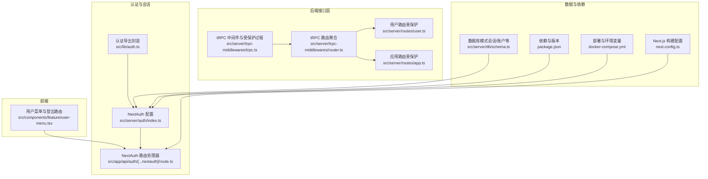
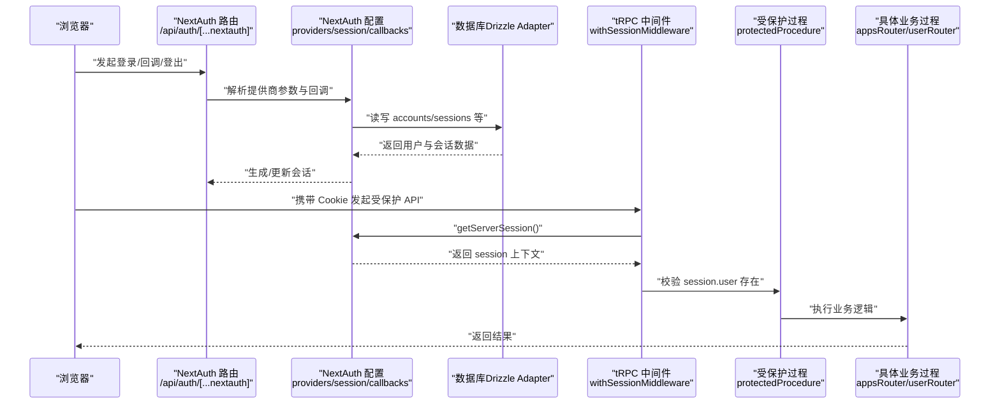
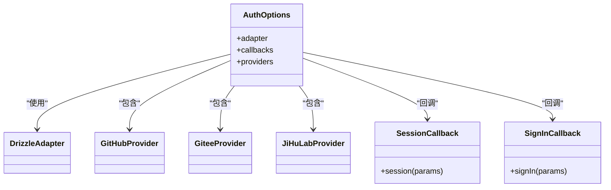
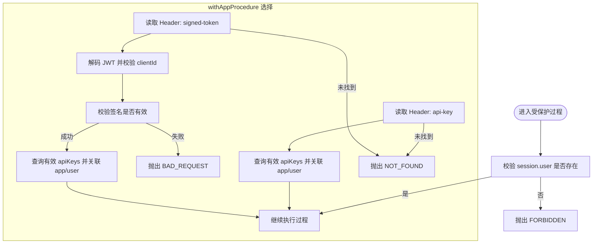
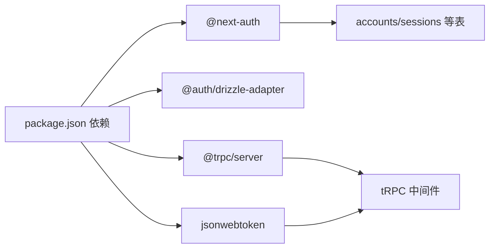
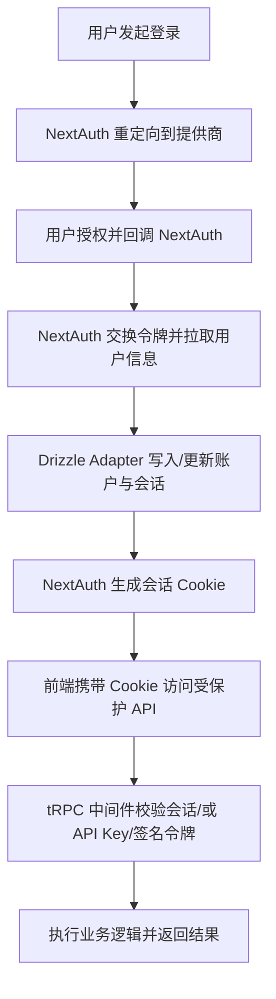

# 认证安全

<cite>
**本文引用的文件**
- [src/server/auth/index.ts](file://src/server/auth/index.ts)
- [src/app/api/auth/[...nextauth]/route.ts](file://src/app/api/auth/[...nextauth]/route.ts)
- [src/lib/auth.ts](file://src/lib/auth.ts)
- [src/server/trpc-middlewares/trpc.ts](file://src/server/trpc-middlewares/trpc.ts)
- [src/server/trpc-middlewares/router.ts](file://src/server/trpc-middlewares/router.ts)
- [src/server/routes/user.ts](file://src/server/routes/user.ts)
- [src/server/routes/app.ts](file://src/server/routes/app.ts)
- [src/components/feature/user-menu.tsx](file://src/components/feature/user-menu.tsx)
- [src/server/db/schema.ts](file://src/server/db/schema.ts)
- [package.json](file://package.json)
- [docker-compose.yml](file://docker-compose.yml)
- [next.config.ts](file://next.config.ts)
</cite>

## 目录

1. [简介](#简介)
2. [项目结构](#项目结构)
3. [核心组件](#核心组件)
4. [架构总览](#架构总览)
5. [详细组件分析](#详细组件分析)
6. [依赖关系分析](#依赖关系分析)
7. [性能考量](#性能考量)
8. [故障排查指南](#故障排查指南)
9. [结论](#结论)
10. [附录](#附录)

## 简介

本文件面向 Image SaaS 项目的认证与安全设计，系统性阐述基于 NextAuth.js 的多提供商 OAuth 集成（GitHub、Gitee、JiHuLab）、会话管理、令牌验证与访问授权策略。文档同时覆盖 tRPC 中间件中的认证与权限控制、API 密钥与签名令牌的鉴权路径、以及前端用户菜单的登出流程。针对部署与运行时安全，给出环境变量配置建议、CSRF 与会话安全要点，并提供常见问题排查与最佳实践。

## 项目结构

认证相关的核心文件分布于以下位置：

- NextAuth 配置与路由：src/server/auth/index.ts、src/app/api/auth/[...nextauth]/route.ts
- 认证导出与重用：src/lib/auth.ts
- tRPC 中间件与受保护过程：src/server/trpc-middlewares/trpc.ts、src/server/trpc-middlewares/router.ts
- 具体业务路由（受保护）：src/server/routes/user.ts、src/server/routes/app.ts
- 前端用户菜单与登出：src/components/feature/user-menu.tsx
- 数据库表结构（会话、账户等）：src/server/db/schema.ts
- 依赖与版本：package.json
- 部署与环境变量：docker-compose.yml
- Next.js 构建配置：next.config.ts

图表来源

- [src/server/auth/index.ts:1-163](file://src/server/auth/index.ts#L1-L163)
- [src/app/api/auth/[...nextauth]/route.ts:1-7](file://src/app/api/auth/[...nextauth]/route.ts#L1-L7)
- [src/lib/auth.ts:1-3](file://src/lib/auth.ts#L1-L3)
- [src/server/trpc-middlewares/trpc.ts:1-129](file://src/server/trpc-middlewares/trpc.ts#L1-L129)
- [src/server/trpc-middlewares/router.ts:1-20](file://src/server/trpc-middlewares/router.ts#L1-L20)
- [src/server/routes/user.ts:1-26](file://src/server/routes/user.ts#L1-L26)
- [src/server/routes/app.ts:1-88](file://src/server/routes/app.ts#L1-L88)
- [src/components/feature/user-menu.tsx:1-65](file://src/components/feature/user-menu.tsx#L1-L65)
- [src/server/db/schema.ts:1-270](file://src/server/db/schema.ts#L1-L270)
- [package.json:1-94](file://package.json#L1-L94)
- [docker-compose.yml:1-51](file://docker-compose.yml#L1-L51)
- [next.config.ts:1-22](file://next.config.ts#L1-L22)

章节来源

- [src/server/auth/index.ts:1-163](file://src/server/auth/index.ts#L1-L163)
- [src/app/api/auth/[...nextauth]/route.ts:1-7](file://src/app/api/auth/[...nextauth]/route.ts#L1-L7)
- [src/lib/auth.ts:1-3](file://src/lib/auth.ts#L1-L3)
- [src/server/trpc-middlewares/trpc.ts:1-129](file://src/server/trpc-middlewares/trpc.ts#L1-L129)
- [src/server/trpc-middlewares/router.ts:1-20](file://src/server/trpc-middlewares/router.ts#L1-L20)
- [src/server/routes/user.ts:1-26](file://src/server/routes/user.ts#L1-L26)
- [src/server/routes/app.ts:1-88](file://src/server/routes/app.ts#L1-L88)
- [src/components/feature/user-menu.tsx:1-65](file://src/components/feature/user-menu.tsx#L1-L65)
- [src/server/db/schema.ts:1-270](file://src/server/db/schema.ts#L1-L270)
- [package.json:1-94](file://package.json#L1-L94)
- [docker-compose.yml:1-51](file://docker-compose.yml#L1-L51)
- [next.config.ts:1-22](file://next.config.ts#L1-L22)

## 核心组件

- NextAuth 配置与提供商
  - GitHub、Gitee、JiHuLab 三类 OAuth 提供商集成，使用 Drizzle Adapter 连接数据库，适配 NextAuth 的会话与账户模型。
  - 支持 SKIP_LOGIN 模式下的“免登录”管理员会话生成与注入。
- NextAuth 路由处理器
  - 将 NextAuth 作为请求处理器暴露为 /api/auth/\*，支持 GET/POST。
- 认证导出封装
  - 对外导出 authOptions 与 getServerSession，便于在服务端任意位置获取当前会话。
- tRPC 中间件与受保护过程
  - withSessionMiddleware 注入会话上下文；protectedProcedure 强制要求已登录；withAppProcedure 支持 API Key 与签名令牌两种后门鉴权。
- 前端用户菜单
  - 展示用户信息并提供登出入口，登出通过 /api/auth/signout 触发。
- 数据库模式
  - accounts、sessions、verificationTokens、authenticator 等表满足 NextAuth 的标准适配需求。

章节来源

- [src/server/auth/index.ts:111-138](file://src/server/auth/index.ts#L111-L138)
- [src/app/api/auth/[...nextauth]/route.ts:1-7](file://src/app/api/auth/[...nextauth]/route.ts#L1-L7)
- [src/lib/auth.ts:1-3](file://src/lib/auth.ts#L1-L3)
- [src/server/trpc-middlewares/trpc.ts:11-45](file://src/server/trpc-middlewares/trpc.ts#L11-L45)
- [src/server/trpc-middlewares/trpc.ts:47-127](file://src/server/trpc-middlewares/trpc.ts#L47-L127)
- [src/components/feature/user-menu.tsx:24-26](file://src/components/feature/user-menu.tsx#L24-L26)
- [src/server/db/schema.ts:47-118](file://src/server/db/schema.ts#L47-L118)

## 架构总览

下图展示从浏览器到 NextAuth、再到 tRPC 受保护过程的整体调用链路，以及 API Key/签名令牌的替代鉴权路径。

图表来源

- [src/app/api/auth/[...nextauth]/route.ts:1-7](file://src/app/api/auth/[...nextauth]/route.ts#L1-L7)
- [src/server/auth/index.ts:111-138](file://src/server/auth/index.ts#L111-L138)
- [src/server/trpc-middlewares/trpc.ts:11-45](file://src/server/trpc-middlewares/trpc.ts#L11-L45)
- [src/server/db/schema.ts:47-79](file://src/server/db/schema.ts#L47-L79)

## 详细组件分析

### NextAuth 配置与提供商

- 提供商定义
  - GitHub：使用官方 provider，读取 GITHUB_ID/GITHUB_SECRET。
  - Gitee：自定义 provider，指定授权、令牌与用户信息端点，映射用户字段。
  - JiHuLab：自定义 provider，指定授权、令牌与用户信息端点，映射用户字段。
- 适配器与会话扩展
  - 使用 DrizzleAdapter 连接数据库，自动维护 accounts、sessions、verificationTokens、authenticator 等表。
  - 通过模块扩充声明，向 Session 注入 user.id 字段。
- 回调与 SKIP_LOGIN
  - session 回调将 user.id 注入到 session.user。
  - signIn 回调在 SKIP_LOGIN=true 时放行登录；getServerSession 在该模式下直接返回默认管理员会话。
- 环境变量与部署
  - NEXTAUTH_URL/NEXTAUTH_SECRET 必须设置；GITHUB/GITEE/JIHLAB 凭据按需启用。

图表来源

- [src/server/auth/index.ts:111-138](file://src/server/auth/index.ts#L111-L138)
- [src/server/db/schema.ts:47-118](file://src/server/db/schema.ts#L47-L118)

章节来源

- [src/server/auth/index.ts:11-63](file://src/server/auth/index.ts#L11-L63)
- [src/server/auth/index.ts:103-109](file://src/server/auth/index.ts#L103-L109)
- [src/server/auth/index.ts:111-138](file://src/server/auth/index.ts#L111-L138)
- [src/server/auth/index.ts:140-160](file://src/server/auth/index.ts#L140-L160)
- [src/server/db/schema.ts:47-118](file://src/server/db/schema.ts#L47-L118)

### NextAuth 路由处理器

- 将 NextAuth(authOption) 作为 GET/POST 处理器，统一暴露 /api/auth/\*。
- 与前端登录按钮、回调页、登出链接配合工作。

章节来源

- [src/app/api/auth/[...nextauth]/route.ts:1-7](file://src/app/api/auth/[...nextauth]/route.ts#L1-L7)

### 认证导出封装

- 对外导出 authOptions 与 getServerSession，便于在服务端任意位置获取当前会话。
- getServerSession 在 SKIP_LOGIN 模式下可直接返回管理员会话，绕过真实登录流程。

章节来源

- [src/lib/auth.ts:1-3](file://src/lib/auth.ts#L1-L3)
- [src/server/auth/index.ts:140-160](file://src/server/auth/index.ts#L140-L160)

### tRPC 中间件与受保护过程

- withSessionMiddleware
  - 通过 getServerSession 注入 ctx.session，供后续中间件与过程使用。
- protectedProcedure
  - 在 withSessionMiddleware 基础上，进一步校验 ctx.session.user 是否存在，不存在则抛出 FORBIDDEN。
- withAppProcedure
  - 支持两种后门鉴权：
    - Header: api-key → 查询 apiKeys 并回填 app 与 user。
    - Header: signed-token → 解析 JWT，校验签名与 clientId，回填 app 与 user。
  - 两者均需 apiKeys 未删除且有效。

图表来源

- [src/server/trpc-middlewares/trpc.ts:30-45](file://src/server/trpc-middlewares/trpc.ts#L30-L45)
- [src/server/trpc-middlewares/trpc.ts:47-127](file://src/server/trpc-middlewares/trpc.ts#L47-L127)

章节来源

- [src/server/trpc-middlewares/trpc.ts:11-19](file://src/server/trpc-middlewares/trpc.ts#L11-L19)
- [src/server/trpc-middlewares/trpc.ts:30-45](file://src/server/trpc-middlewares/trpc.ts#L30-L45)
- [src/server/trpc-middlewares/trpc.ts:47-127](file://src/server/trpc-middlewares/trpc.ts#L47-L127)

### 具体业务路由（受保护）

- 用户路由（受保护）
  - 通过 protectedProcedure 查询用户套餐信息，使用 ctx.session.user.id 限定范围。
- 应用路由（受保护）
  - 创建应用、列出应用、变更存储等操作均受 protectedProcedure 保护；
  - 变更存储时额外校验 storage.userId 与 ctx.session.user.id 一致，防止越权。

章节来源

- [src/server/routes/user.ts:6-24](file://src/server/routes/user.ts#L6-L24)
- [src/server/routes/app.ts:18-48](file://src/server/routes/app.ts#L18-L48)
- [src/server/routes/app.ts:59-86](file://src/server/routes/app.ts#L59-L86)

### 前端用户菜单与登出

- 用户菜单展示用户头像、姓名、邮箱与套餐信息；
- 登出按钮点击后跳转至 /api/auth/signout，触发 NextAuth 的登出流程。

章节来源

- [src/components/feature/user-menu.tsx:24-26](file://src/components/feature/user-menu.tsx#L24-L26)

### 数据库模式与会话存储

- accounts：记录用户在各提供商下的账户信息，主键为 (provider, providerAccountId)。
- sessions：记录会话令牌与过期时间，外键关联 users。
- verificationTokens：验证码令牌表，用于邮箱验证等场景。
- authenticators：WebAuthn/FIDO2 凭据表，支持无密码登录能力。

章节来源

- [src/server/db/schema.ts:47-118](file://src/server/db/schema.ts#L47-L118)

## 依赖关系分析

- NextAuth 依赖
  - next-auth 主包与 @auth/drizzle-adapter 适配器。
- tRPC 与 JWT
  - @trpc/server 提供受保护过程与中间件；jsonwebtoken 用于 API Key 签名令牌的解码与校验。
- 前端与 UI
  - Radix UI 组件用于用户菜单；Next.js 图片优化配置对远端资源放行。

图表来源

- [package.json:14-65](file://package.json#L14-L65)
- [src/server/db/schema.ts:47-118](file://src/server/db/schema.ts#L47-L118)
- [src/server/trpc-middlewares/trpc.ts:1-5](file://src/server/trpc-middlewares/trpc.ts#L1-L5)

章节来源

- [package.json:14-65](file://package.json#L14-L65)
- [src/server/db/schema.ts:47-118](file://src/server/db/schema.ts#L47-L118)
- [src/server/trpc-middlewares/trpc.ts:1-5](file://src/server/trpc-middlewares/trpc.ts#L1-L5)

## 性能考量

- 会话获取成本
  - getServerSession 在 SKIP_LOGIN 模式下避免数据库查询，直接构造管理员会话，降低开销。
- tRPC 中间件链
  - withSessionMiddleware 每次请求都会调用 getServerSession，建议在高并发场景下确保数据库连接池与缓存策略合理配置。
- API Key/签名令牌
  - withAppProcedure 会在每次请求读取 Header 并查询数据库，建议对高频调用场景引入轻量缓存或限流策略。

[本节为通用指导，不涉及具体文件分析]

## 故障排查指南

- 登录后无法获取会话
  - 检查 NEXTAUTH_URL 与 NEXTAUTH_SECRET 是否正确设置；确认浏览器 Cookie 是否被拦截或跨域受限。
  - 确认 getServerSession 在 SKIP_LOGIN 模式下的行为符合预期。
- 受保护 API 返回 FORBIDDEN
  - 确认请求携带正确的会话 Cookie；若使用 API Key/签名令牌，检查 Header 名称与值是否正确。
- API Key 无效或签名令牌校验失败
  - 确认 api-key 对应的 apiKeys 记录未被删除；签名令牌的 clientId 与 apiKeys.clientId 匹配；签名有效。
- 数据库表缺失或字段不匹配
  - 确认 Drizzle Adapter 已正确初始化 accounts/sessions 等表；NextAuth 版本与适配器版本兼容。

章节来源

- [src/server/auth/index.ts:140-160](file://src/server/auth/index.ts#L140-L160)
- [src/server/trpc-middlewares/trpc.ts:30-45](file://src/server/trpc-middlewares/trpc.ts#L30-L45)
- [src/server/trpc-middlewares/trpc.ts:47-127](file://src/server/trpc-middlewares/trpc.ts#L47-L127)
- [src/server/db/schema.ts:47-118](file://src/server/db/schema.ts#L47-L118)

## 结论

本项目采用 NextAuth.js 作为统一认证入口，结合 Drizzle Adapter 实现会话与账户持久化，并通过 tRPC 中间件实现细粒度的访问控制。GitHub、Gitee、JiHuLab 三大提供商均已集成，支持 SKIP_LOGIN 模式下的快速调试。API Key 与签名令牌提供了面向应用的替代鉴权路径。整体架构清晰、职责分离明确，具备良好的可扩展性与安全性基础。

[本节为总结性内容，不涉及具体文件分析]

## 附录

### 环境变量与部署要点

- NextAuth 必需
  - NEXTAUTH_URL：NextAuth 的外部访问地址（含协议与端口）。
  - NEXTAUTH_SECRET：至少 32 位随机字符串，用于加密会话与令牌。
- OAuth 提供商（按需启用）
  - GITHUB_ID/GITHUB_SECRET
  - GITEE_ID/GITEE_SECRET
  - JIHULAB_ID/JIHULAB_SECRET
- 其他
  - SKIP_LOGIN：设为 true 时启用免登录管理员会话。
  - 数据库连接 DATABASE_URL。
  - 可选：AWS S3、OpenRouter 等配置项。

章节来源

- [docker-compose.yml:15-32](file://docker-compose.yml#L15-L32)
- [src/server/auth/index.ts:130-137](file://src/server/auth/index.ts#L130-L137)

### CSRF 与会话安全建议

- CSRF 保护
  - NextAuth 默认对部分敏感操作进行 CSRF 校验；建议在前端表单提交时遵循 NextAuth 的 CSRF 策略，避免跨站请求伪造。
- 会话安全
  - 设置合理的会话过期时间；定期清理过期会话与账户绑定。
  - 使用 HTTPS 传输与安全 Cookie；限制 SameSite/Cross-Site 策略以降低风险。
- 密码策略与账户锁定
  - 当前实现未内置密码登录与账户锁定机制；如需密码登录，建议引入密码登录提供商或自定义流程，并配套密码强度策略、失败次数限制与临时封禁。
- 异常登录检测
  - 可在 signIn 回调中加入 IP/UA/设备指纹等风控逻辑，必要时触发二次验证或阻断登录。

[本节为通用指导，不涉及具体文件分析]

### 认证流程图（概念示意）

[本图为概念示意，不对应具体源码文件]
