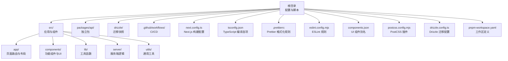
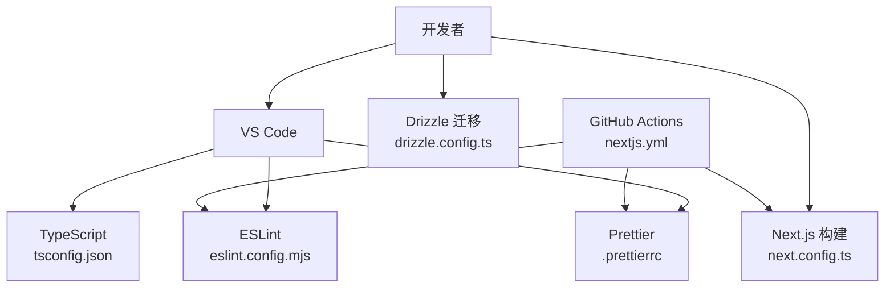
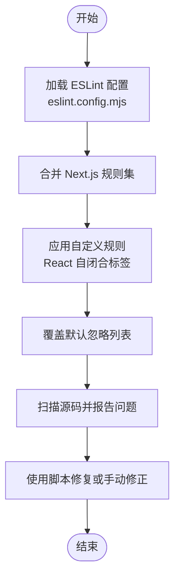
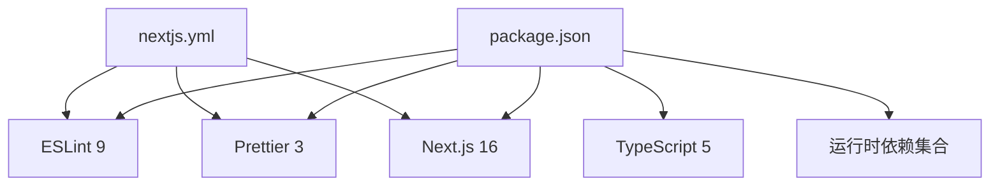

# 代码规范

<cite>
**本文引用的文件**
- [eslint.config.mjs](file://eslint.config.mjs)
- [.prettierrc](file://.prettierrc)
- [tsconfig.json](file://tsconfig.json)
- [global.d.ts](file://global.d.ts)
- [package.json](file://package.json)
- [next.config.ts](file://next.config.ts)
- [components.json](file://components.json)
- [postcss.config.mjs](file://postcss.config.mjs)
- [drizzle.config.ts](file://drizzle.config.ts)
- [pnpm-workspace.yaml](file://pnpm-workspace.yaml)
- [layout.tsx](file://src/app/layout.tsx)
- [button.tsx](file://src/components/ui/button.tsx)
- [utils.ts](file://src/lib/utils.ts)
- [nextjs.yml](file://.github/workflows/nextjs.yml)
</cite>

## 目录
1. [简介](#简介)
2. [项目结构](#项目结构)
3. [核心组件](#核心组件)
4. [架构总览](#架构总览)
5. [详细组件分析](#详细组件分析)
6. [依赖分析](#依赖分析)
7. [性能考虑](#性能考虑)
8. [故障排查指南](#故障排查指南)
9. [结论](#结论)
10. [附录](#附录)

## 简介
本文件为 Image SaaS 项目的代码规范与工具链配置说明，覆盖以下方面：
- ESLint 规则：React 自闭合标签强制、TypeScript 类型检查、Next.js 特定规则
- Prettier 格式化：缩进、引号、分号、打印宽度等
- TypeScript 编译配置：编译选项、路径映射、全局类型声明
- 代码风格指南：命名约定、文件组织、注释规范
- 实际代码示例：展示正确编码实践（通过文件路径引用）
- IDE 集成：自动格式化与代码检查配置建议
- 新人快速上手：统一的编码标准参考

## 项目结构
本项目采用 Next.js 应用结构，配合 pnpm 工作区与 Drizzle ORM 进行数据库迁移管理。关键配置集中在根目录，前端页面与组件位于 src 目录，UI 组件库遵循 shadcn/radix 设计系统。

图表来源
- [tsconfig.json:1-35](file://tsconfig.json#L1-L35)
- [next.config.ts:1-22](file://next.config.ts#L1-L22)
- [components.json:1-23](file://components.json#L1-L23)
- [postcss.config.mjs:1-6](file://postcss.config.mjs#L1-L6)
- [drizzle.config.ts:1-14](file://drizzle.config.ts#L1-L14)
- [pnpm-workspace.yaml:1-6](file://pnpm-workspace.yaml#L1-L6)

章节来源
- [tsconfig.json:1-35](file://tsconfig.json#L1-L35)
- [next.config.ts:1-22](file://next.config.ts#L1-L22)
- [components.json:1-23](file://components.json#L1-L23)
- [postcss.config.mjs:1-6](file://postcss.config.mjs#L1-L6)
- [drizzle.config.ts:1-14](file://drizzle.config.ts#L1-L14)
- [pnpm-workspace.yaml:1-6](file://pnpm-workspace.yaml#L1-L6)

## 核心组件
本节对代码规范相关的核心配置进行深入解析，并给出最佳实践建议。

- ESLint 配置
  - 基于 eslint-config-next 的 Core Web Vitals 与 TypeScript 规则集
  - 强制无子节点的 React 组件使用自闭合标签（支持 React 组件与 HTML 元素）
  - 覆盖默认忽略列表，确保构建产物与临时目录不参与检查
  - 参考路径：[eslint.config.mjs:1-31](file://eslint.config.mjs#L1-L31)

- Prettier 格式化
  - 使用单引号、禁用分号、2 空格缩进、尾随逗号按 ES5 策略
  - 打印宽度 80，行尾 LF，箭头函数括号省略策略为避免不必要的括号
  - JSX 单引号关闭，嵌入语言格式化自动处理
  - 参考路径：[.prettierrc:1-16](file://.prettierrc#L1-L16)

- TypeScript 编译配置
  - 目标 ES2017，模块系统为 esnext，解析器为 bundler
  - 严格模式开启，跳过库检查，禁止输出 JS（仅类型），启用增量编译
  - 路径映射 @/* -> ./src/*
  - 包含 next-env.d.ts 与所有 ts/tsx 文件，排除 node_modules
  - 参考路径：[tsconfig.json:1-35](file://tsconfig.json#L1-L35)

- 全局类型声明
  - 支持 *.css 与 *.scss 模块声明
  - 参考路径：[global.d.ts:1-3](file://global.d.ts#L1-L3)

- Next.js 构建配置
  - 忽略构建阶段的 TypeScript 错误，启用 standalone 输出优化镜像体积
  - 允许远程图片访问（HTTPS 协议）
  - 参考路径：[next.config.ts:1-22](file://next.config.ts#L1-L22)

- UI 组件别名与 Tailwind 集成
  - 组件别名：components -> @/components，utils -> @/lib/utils，ui -> @/components/ui，lib -> @/lib，hooks -> @/hooks
  - Tailwind CSS 配置指向 src/app/globals.css
  - 参考路径：[components.json:1-23](file://components.json#L1-L23)

- PostCSS 与 Drizzle 工作区
  - PostCSS 使用 @tailwindcss/postcss 插件
  - Drizzle 迁移配置指定输出目录、模式与凭证
  - pnpm 工作区包含 packages/api 子包
  - 参考路径：
    - [postcss.config.mjs:1-6](file://postcss.config.mjs#L1-L6)
    - [drizzle.config.ts:1-14](file://drizzle.config.ts#L1-L14)
    - [pnpm-workspace.yaml:1-6](file://pnpm-workspace.yaml#L1-L6)

章节来源
- [eslint.config.mjs:1-31](file://eslint.config.mjs#L1-L31)
- [.prettierrc:1-16](file://.prettierrc#L1-L16)
- [tsconfig.json:1-35](file://tsconfig.json#L1-L35)
- [global.d.ts:1-3](file://global.d.ts#L1-L3)
- [next.config.ts:1-22](file://next.config.ts#L1-L22)
- [components.json:1-23](file://components.json#L1-L23)
- [postcss.config.mjs:1-6](file://postcss.config.mjs#L1-L6)
- [drizzle.config.ts:1-14](file://drizzle.config.ts#L1-L14)
- [pnpm-workspace.yaml:1-6](file://pnpm-workspace.yaml#L1-L6)

## 架构总览
下图展示了代码规范相关工具链在开发流程中的位置与交互关系。

图表来源
- [eslint.config.mjs:1-31](file://eslint.config.mjs#L1-L31)
- [.prettierrc:1-16](file://.prettierrc#L1-L16)
- [tsconfig.json:1-35](file://tsconfig.json#L1-L35)
- [next.config.ts:1-22](file://next.config.ts#L1-L22)
- [drizzle.config.ts:1-14](file://drizzle.config.ts#L1-L14)
- [nextjs.yml:1-70](file://.github/workflows/nextjs.yml#L1-L70)

## 详细组件分析

### ESLint 规则详解
- 规则来源
  - 继承 eslint-config-next 的 Core Web Vitals 与 TypeScript 规则集
  - 自定义规则：强制无子节点的 React 组件使用自闭合标签（React 组件与 HTML 元素均生效）
  - 覆盖默认忽略列表，确保构建产物与临时目录不参与检查
- 影响范围
  - 适用于所有 ts/tsx 文件
  - 在 CI 中同样执行，保证质量一致性
- 推荐实践
  - 在编辑器中启用 ESLint 实时检查
  - 使用 npm 脚本一键修复：[package.json:5-12](file://package.json#L5-L12)

图表来源
- [eslint.config.mjs:1-31](file://eslint.config.mjs#L1-L31)
- [package.json:5-12](file://package.json#L5-L12)

章节来源
- [eslint.config.mjs:1-31](file://eslint.config.mjs#L1-L31)
- [package.json:5-12](file://package.json#L5-L12)

### Prettier 格式化配置
- 关键选项
  - semi: true（分号）
  - singleQuote: true（单引号）
  - tabWidth: 2（缩进宽度）
  - useTabs: false（空格缩进）
  - trailingComma: "es5"（尾随逗号策略）
  - printWidth: 80（打印宽度）
  - endOfLine: "lf"（行尾符）
  - arrowParens: "avoid"（箭头函数括号）
  - quoteProps: "as-needed"（对象属性引号）
  - jsxSingleQuote: false（JSX 使用双引号）
  - embeddedLanguageFormatting: "auto"（嵌入语言格式化）
- 推荐实践
  - 在保存时自动格式化
  - 使用 npm 脚本检查格式：[package.json:5-12](file://package.json#L5-L12)

章节来源
- [.prettierrc:1-16](file://.prettierrc#L1-L16)
- [package.json:5-12](file://package.json#L5-L12)

### TypeScript 编译配置
- 编译选项要点
  - target: ES2017
  - lib: dom、dom.iterable、esnext
  - strict: true
  - skipLibCheck: true
  - noEmit: true（仅类型检查）
  - module: esnext
  - moduleResolution: bundler
  - jsx: "react-jsx"
  - incremental: true
  - paths: "@/*" -> "./src/*"
  - plugins: ["next"]
- 包含与排除
  - include: next-env.d.ts、所有 ts/tsx、Next 类型
  - exclude: node_modules
- 推荐实践
  - 保持严格模式，避免隐式 any
  - 使用路径映射简化导入路径

章节来源
- [tsconfig.json:1-35](file://tsconfig.json#L1-L35)

### 全局类型声明
- 支持 CSS/SCSS 模块声明，便于样式模块化与类型安全
- 参考路径：[global.d.ts:1-3](file://global.d.ts#L1-L3)

章节来源
- [global.d.ts:1-3](file://global.d.ts#L1-L3)

### Next.js 构建配置
- typescript.ignoreBuildErrors: true（构建阶段忽略 TS 错误）
- output: "standalone"（优化 Docker 镜像）
- images.remotePatterns 允许 HTTPS 远程图片
- 参考路径：[next.config.ts:1-22](file://next.config.ts#L1-L22)

章节来源
- [next.config.ts:1-22](file://next.config.ts#L1-L22)

### UI 组件别名与 Tailwind 集成
- 组件别名映射到 @ 前缀，便于统一导入
- Tailwind CSS 配置指向全局样式文件
- 参考路径：[components.json:1-23](file://components.json#L1-L23)

章节来源
- [components.json:1-23](file://components.json#L1-L23)

### PostCSS 与 Drizzle 工作区
- PostCSS 使用 @tailwindcss/postcss 插件
- Drizzle 迁移配置指定输出目录、模式与凭证
- pnpm 工作区包含 packages/api 子包
- 参考路径：
  - [postcss.config.mjs:1-6](file://postcss.config.mjs#L1-L6)
  - [drizzle.config.ts:1-14](file://drizzle.config.ts#L1-L14)
  - [pnpm-workspace.yaml:1-6](file://pnpm-workspace.yaml#L1-L6)

章节来源
- [postcss.config.mjs:1-6](file://postcss.config.mjs#L1-L6)
- [drizzle.config.ts:1-14](file://drizzle.config.ts#L1-L14)
- [pnpm-workspace.yaml:1-6](file://pnpm-workspace.yaml#L1-L6)

### 实际代码示例（正确编码实践）
- 页面布局与元数据
  - 使用类型导入与字体变量设置
  - 布局组件返回自闭合标签
  - 参考路径：[layout.tsx:1-37](file://src/app/layout.tsx#L1-L37)

- UI 组件（Button）
  - 使用 Variants 模式与类名合并工具
  - 组件导出与变体导出分离
  - 参考路径：[button.tsx:1-63](file://src/components/ui/button.tsx#L1-L63)

- 工具函数（cn）
  - 使用 clsx 与 tailwind-merge 合并类名
  - 参考路径：[utils.ts:1-7](file://src/lib/utils.ts#L1-L7)

章节来源
- [layout.tsx:1-37](file://src/app/layout.tsx#L1-L37)
- [button.tsx:1-63](file://src/components/ui/button.tsx#L1-L63)
- [utils.ts:1-7](file://src/lib/utils.ts#L1-L7)

## 依赖分析
- 开发工具链
  - ESLint 9、Prettier 3、TypeScript 5、Next.js 16
  - Jest、TailwindCSS v4、Drizzle Kit
- 运行时依赖
  - Next.js、Next-Auth、Radix UI、TanStack React Query、AWS S3 SDK、Sharp、Lucide Icons、Geist 字体等
- 脚本命令
  - dev、build、start、lint、format、format:check、lint:fix
- 参考路径：
  - [package.json:1-94](file://package.json#L1-L94)
  - [nextjs.yml:1-70](file://.github/workflows/nextjs.yml#L1-L70)

图表来源
- [package.json:1-94](file://package.json#L1-L94)
- [nextjs.yml:1-70](file://.github/workflows/nextjs.yml#L1-L70)

章节来源
- [package.json:1-94](file://package.json#L1-L94)
- [nextjs.yml:1-70](file://.github/workflows/nextjs.yml#L1-L70)

## 性能考虑
- 构建优化
  - Next.js standalone 输出减少容器体积
  - TypeScript 构建阶段忽略错误，缩短 CI 时间
- 代码质量
  - ESLint 与 Prettier 在本地与 CI 中统一执行，降低维护成本
- 样式与资源
  - Tailwind 与 PostCSS 插件提升样式构建效率
  - AWS S3 与 Sharp 用于图片处理，需注意内存与并发限制

## 故障排查指南
- ESLint 报错
  - 使用脚本修复：[package.json:5-12](file://package.json#L5-L12)
  - 检查自闭合标签规则是否违反：[eslint.config.mjs:1-31](file://eslint.config.mjs#L1-L31)
- Prettier 格式冲突
  - 使用检查脚本定位问题：[package.json:5-12](file://package.json#L5-L12)
  - 对照格式化规则：[.prettierrc:1-16](file://.prettierrc#L1-L16)
- TypeScript 类型错误
  - 确认严格模式与路径映射配置：[tsconfig.json:1-35](file://tsconfig.json#L1-L35)
  - 若为构建期错误，可暂时忽略（仅开发）：[next.config.ts:1-22](file://next.config.ts#L1-L22)
- CI 失败
  - 确认 Node.js 与 pnpm 版本一致：[nextjs.yml:1-70](file://.github/workflows/nextjs.yml#L1-L70)
  - 检查工作区与依赖安装顺序：[pnpm-workspace.yaml:1-6](file://pnpm-workspace.yaml#L1-L6)

章节来源
- [package.json:5-12](file://package.json#L5-L12)
- [eslint.config.mjs:1-31](file://eslint.config.mjs#L1-L31)
- [.prettierrc:1-16](file://.prettierrc#L1-L16)
- [tsconfig.json:1-35](file://tsconfig.json#L1-L35)
- [next.config.ts:1-22](file://next.config.ts#L1-L22)
- [nextjs.yml:1-70](file://.github/workflows/nextjs.yml#L1-L70)
- [pnpm-workspace.yaml:1-6](file://pnpm-workspace.yaml#L1-L6)

## 结论
本规范文档基于项目现有配置，明确了 ESLint、Prettier、TypeScript、Next.js、UI 组件别名与构建优化的关键规则与最佳实践。建议团队在本地与 CI 中统一执行这些规则，以确保代码一致性与可维护性。

## 附录

### 代码风格指南
- 命名约定
  - 组件文件使用 PascalCase（如 Button.tsx）
  - 工具函数使用 camelCase（如 cn）
  - 类型与接口使用 PascalCase（如 Metadata）
- 文件组织
  - 页面组件置于 src/app 下，按路由层级组织
  - UI 组件置于 src/components/ui 下，遵循变体导出模式
  - 工具函数置于 src/lib 下
- 注释规范
  - 公共组件与复杂逻辑添加简要注释
  - 导出的变体与配置添加说明
- React 自闭合标签
  - 无子节点的组件与 HTML 元素使用自闭合标签
  - 参考规则：[eslint.config.mjs:1-31](file://eslint.config.mjs#L1-L31)

章节来源
- [eslint.config.mjs:1-31](file://eslint.config.mjs#L1-L31)

### IDE 配置建议（自动格式化与代码检查）
- VS Code 扩展
  - 安装 ESLint、Prettier、Tailwind CSS IntelliSense、TypeScript Importer
- 设置
  - 保存时自动格式化：editor.formatOnSave=true
  - 保存时自动修复 ESLint：editor.codeActionsOnSave
  - 使用 Prettier 作为默认格式化程序
- 脚本快捷方式
  - 在终端使用 npm 脚本 lint、format、format:check、lint:fix
  - 参考路径：[package.json:5-12](file://package.json#L5-L12)

章节来源
- [package.json:5-12](file://package.json#L5-L12)