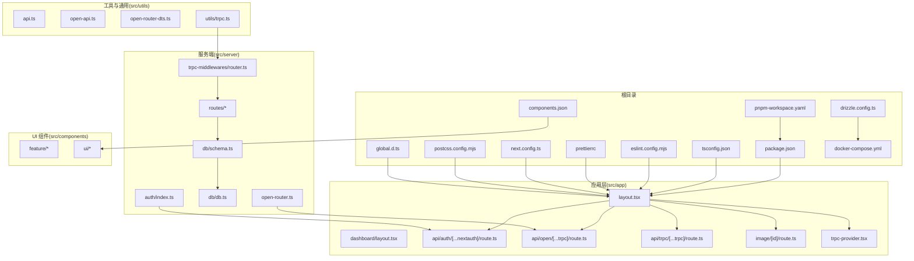
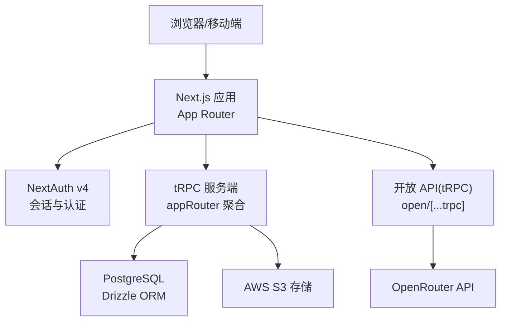
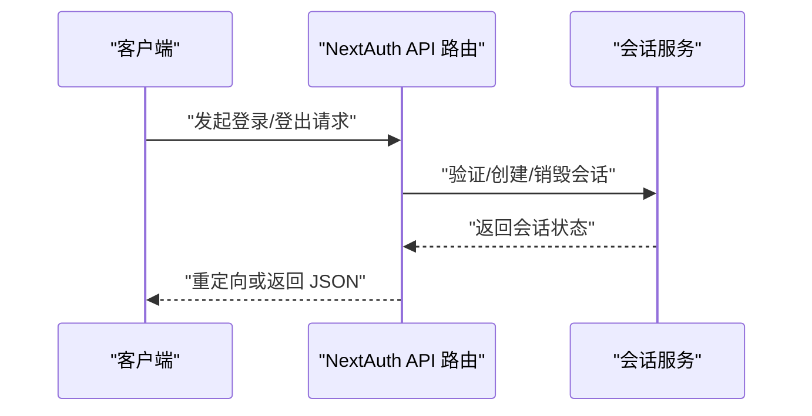
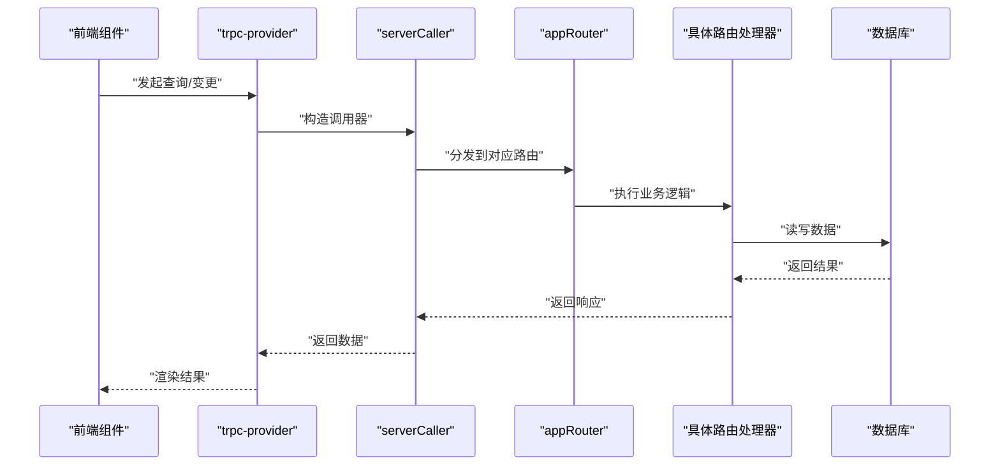
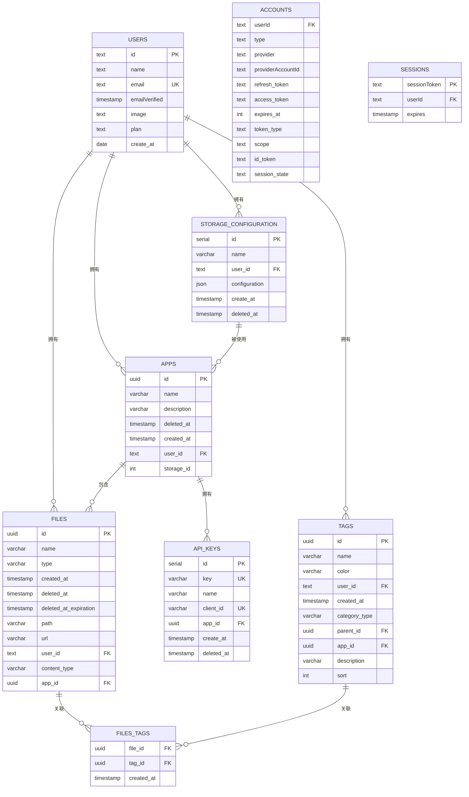
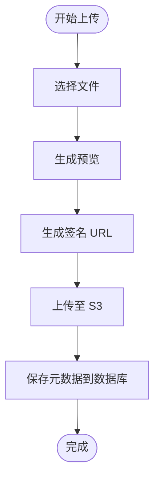
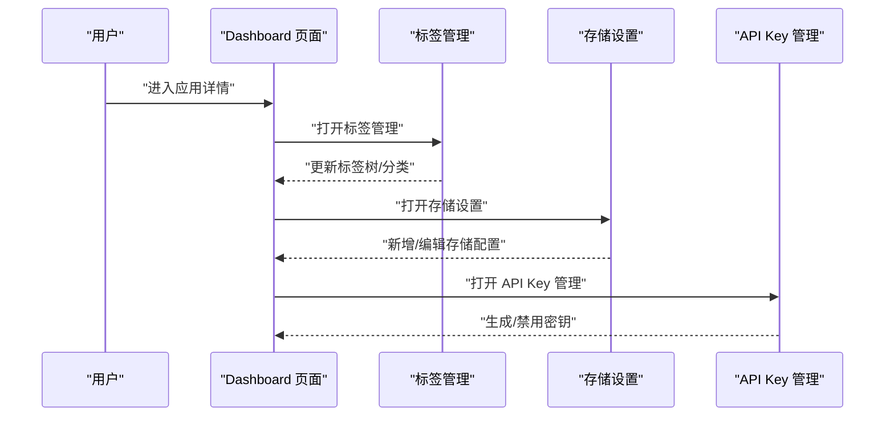
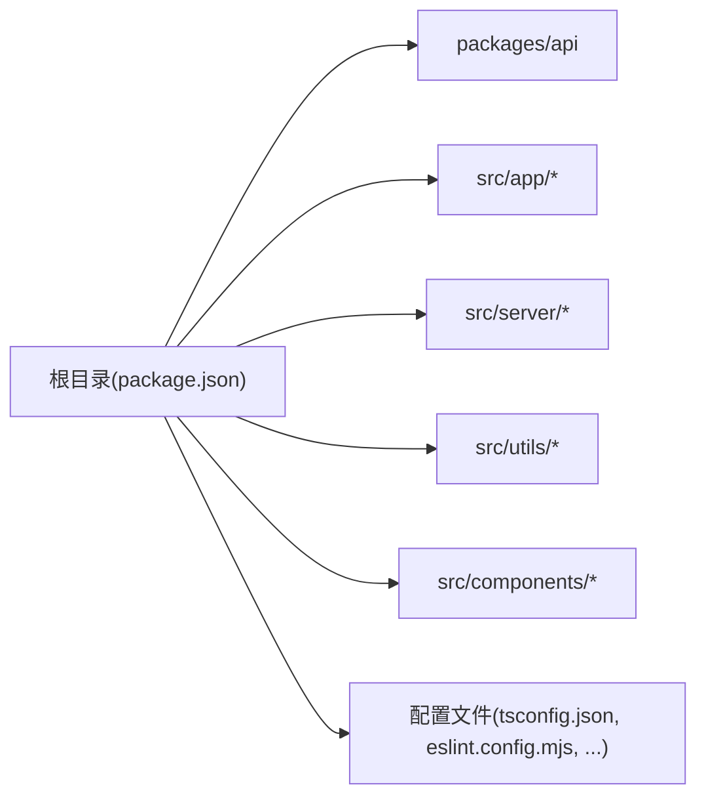

# 开发指南

<cite>
**本文引用的文件**
- [package.json](file://package.json)
- [tsconfig.json](file://tsconfig.json)
- [eslint.config.mjs](file://eslint.config.mjs)
- [.prettierrc](file://.prettierrc)
- [pnpm-workspace.yaml](file://pnpm-workspace.yaml)
- [README.md](file://README.md)
- [next.config.ts](file://next.config.ts)
- [postcss.config.mjs](file://postcss.config.mjs)
- [drizzle.config.ts](file://drizzle.config.ts)
- [global.d.ts](file://global.d.ts)
- [components.json](file://components.json)
- [docker-compose.yml](file://docker-compose.yml)
- [src/server/db/schema.ts](file://src/server/db/schema.ts)
- [src/server/trpc-middlewares/router.ts](file://src/server/trpc-middlewares/router.ts)
- [src/lib/auth.ts](file://src/lib/auth.ts)
- [src/utils/trpc.ts](file://src/utils/trpc.ts)
- [.github/workflows/nextjs.yml](file://.github/workflows/nextjs.yml)
- [scripts/init-default-tags.ts](file://scripts/init-default-tags.ts)
- [src/app/layout.tsx](file://src/app/layout.tsx)
- [src/app/dashboard/layout.tsx](file://src/app/dashboard/layout.tsx)
- [src/app/api/auth/[...nextauth]/route.ts](file://src/app/api/auth/[...nextauth]/route.ts)
- [src/app/api/open/[...trpc]/route.ts](file://src/app/api/open/[...trpc]/route.ts)
- [src/app/api/trpc/[...trpc]/route.ts](file://src/app/api/trpc/[...trpc]/route.ts)
- [src/app/dashboard/apps/[appId]/setting/api-key/page.tsx](file://src/app/dashboard/apps/[appId]/setting/api-key/page.tsx)
- [src/app/dashboard/apps/[appId]/setting/storage/page.tsx](file://src/app/dashboard/apps/[appId]/setting/storage/page.tsx)
- [src/app/dashboard/apps/[appId]/page.tsx](file://src/app/dashboard/apps/[appId]/page.tsx)
- [src/app/dashboard/apps/new/page.tsx](file://src/app/dashboard/apps/new/page.tsx)
- [src/app/dashboard/apps/[appId]/trash/page.tsx](file://src/app/dashboard/apps/[appId]/trash/page.tsx)
- [src/app/dashboard/apps/[appId]/event-page.tsx](file://src/app/dashboard/apps/[appId]/event-page.tsx)
- [src/app/dashboard/apps/[appId]/location-page.tsx](file://src/app/dashboard/apps/[appId]/location-page.tsx)
- [src/app/dashboard/apps/[appId]/people-list.tsx](file://src/app/dashboard/apps/[appId]/people-list.tsx)
- [src/app/dashboard/apps/[appId]/setting/tag-manager/page.tsx](file://src/app/dashboard/apps/[appId]/setting/tag-manager/page.tsx)
- [src/app/dashboard/apps/[appId]/setting/storage/new/page.tsx](file://src/app/dashboard/apps/[appId]/setting/storage/new/page.tsx)
- [src/app/dashboard/apps/[appId]/layout.tsx](file://src/app/dashboard/apps/[appId]/layout.tsx)
- [src/app/dashboard/page.tsx](file://src/app/dashboard/page.tsx)
- [src/app/dashboard/theme-provider.tsx](file://src/app/dashboard/theme-provider.tsx)
- [src/app/dashboard/theme-toggle.tsx](file://src/app/dashboard/theme-toggle.tsx)
- [src/app/image/[id]/route.ts](file://src/app/image/[id]/route.ts)
- [src/app/trpc-provider.tsx](file://src/app/trpc-provider.tsx)
- [src/components/feature/FileList.tsx](file://src/components/feature/FileList.tsx)
- [src/components/feature/dropzone.tsx](file://src/components/feature/dropzone.tsx)
- [src/components/feature/edit-storage-dialog.tsx](file://src/components/feature/edit-storage-dialog.tsx)
- [src/components/feature/file-item-action.tsx](file://src/components/feature/file-item-action.tsx)
- [src/components/feature/file-item.tsx](file://src/components/feature/file-item.tsx)
- [src/components/feature/file-list.tsx](file://src/components/feature/file-list.tsx)
- [src/components/feature/home-button.tsx](file://src/components/feature/home-button.tsx)
- [src/components/feature/infinite-scroll.tsx](file://src/components/feature/infinite-scroll.tsx)
- [src/components/feature/search-bar.tsx](file://src/components/feature/search-bar.tsx)
- [src/components/feature/upload-button.tsx](file://src/components/feature/upload-button.tsx)
- [src/components/feature/upload-preview.tsx](file://src/components/feature/upload-preview.tsx)
- [src/components/feature/user-menu.tsx](file://src/components/feature/user-menu.tsx)
- [src/components/ui/alert-dialog.tsx](file://src/components/ui/alert-dialog.tsx)
- [src/components/ui/alert.tsx](file://src/components/ui/alert.tsx)
- [src/components/ui/avatar.tsx](file://src/components/ui/avatar.tsx)
- [src/components/ui/button.tsx](file://src/components/ui/button.tsx)
- [src/components/ui/calendar.tsx](file://src/components/ui/calendar.tsx)
- [src/components/ui/checkbox.tsx](file://src/components/ui/checkbox.tsx)
- [src/components/ui/collapsible.tsx](file://src/components/ui/collapsible.tsx)
- [src/components/ui/dialog.tsx](file://src/components/ui/dialog.tsx)
- [src/components/ui/dropdown-menu.tsx](file://src/components/ui/dropdown-menu.tsx)
- [src/components/ui/input.tsx](file://src/components/ui/input.tsx)
- [src/components/ui/label.tsx](file://src/components/ui/label.tsx)
- [src/components/ui/popover.tsx](file://src/components/ui/popover.tsx)
- [src/components/ui/scroll-area.tsx](file://src/components/ui/scroll-area.tsx)
- [src/components/ui/sonner.tsx](file://src/components/ui/sonner.tsx)
- [src/components/ui/tabs.tsx](file://src/components/ui/tabs.tsx)
- [src/components/ui/tag-input.tsx](file://src/components/ui/tag-input.tsx)
- [src/components/ui/tag.tsx](file://src/components/ui/tag.tsx)
- [src/components/ui/textarea.tsx](file://src/components/ui/textarea.tsx)
- [src/hooks/use-uppy-state.ts](file://src/hooks/use-uppy-state.ts)
- [src/hooks/user-paste-file.ts](file://src/hooks/user-paste-file.ts)
- [src/lib/utils.ts](file://src/lib/utils.ts)
- [src/server/auth/index.ts](file://src/server/auth/index.ts)
- [src/server/db/db.ts](file://src/server/db/db.ts)
- [src/server/routes/api-keys.ts](file://src/server/routes/api-keys.ts)
- [src/server/routes/app.ts](file://src/server/routes/app.ts)
- [src/server/routes/file-open.ts](file://src/server/routes/file-open.ts)
- [src/server/routes/file.ts](file://src/server/routes/file.ts)
- [src/server/routes/storages.ts](file://src/server/routes/storages.ts)
- [src/server/routes/tags.ts](file://src/server/routes/tags.ts)
- [src/server/routes/user.ts](file://src/server/routes/user.ts)
- [src/server/open-router.ts](file://src/server/open-router.ts)
- [src/utils/api.ts](file://src/utils/api.ts)
- [src/utils/open-api.ts](file://src/utils/open-api.ts)
- [src/utils/open-router-dts.ts](file://src/utils/open-router-dts.ts)
</cite>

## 目录
1. [简介](#简介)
2. [项目结构](#项目结构)
3. [核心组件](#核心组件)
4. [架构总览](#架构总览)
5. [详细组件分析](#详细组件分析)
6. [依赖关系分析](#依赖关系分析)
7. [性能考虑](#性能考虑)
8. [故障排查指南](#故障排查指南)
9. [结论](#结论)
10. [附录](#附录)

## 简介
本指南面向 Image SaaS 项目的开发者，提供从开发环境搭建、代码规范与质量保障、测试策略、调试与性能分析，到 Git 工作流与发布管理的完整实践说明。项目基于 Next.js 16、TypeScript、tRPC、Drizzle ORM、TailwindCSS 以及 AWS S3 存储等技术栈构建，强调类型安全、模块化与可维护性。

## 项目结构
项目采用 monorepo 结构（通过 pnpm workspace），根目录包含应用与共享 API 包；应用层遵循 Next.js App Router 目录约定，服务端包含认证、数据库、路由与中间件；UI 层采用 shadcn/ui 生态并通过 TailwindCSS 进行样式组织。

图表来源
- [package.json](file://package.json)
- [tsconfig.json](file://tsconfig.json)
- [eslint.config.mjs](file://eslint.config.mjs)
- [.prettierrc](file://.prettierrc)
- [pnpm-workspace.yaml](file://pnpm-workspace.yaml)
- [next.config.ts](file://next.config.ts)
- [postcss.config.mjs](file://postcss.config.mjs)
- [drizzle.config.ts](file://drizzle.config.ts)
- [global.d.ts](file://global.d.ts)
- [components.json](file://components.json)
- [docker-compose.yml](file://docker-compose.yml)
- [src/app/layout.tsx](file://src/app/layout.tsx)
- [src/app/dashboard/layout.tsx](file://src/app/dashboard/layout.tsx)
- [src/app/api/auth/[...nextauth]/route.ts](file://src/app/api/auth/[...nextauth]/route.ts)
- [src/app/api/open/[...trpc]/route.ts](file://src/app/api/open/[...trpc]/route.ts)
- [src/app/api/trpc/[...trpc]/route.ts](file://src/app/api/trpc/[...trpc]/route.ts)
- [src/app/image/[id]/route.ts](file://src/app/image/[id]/route.ts)
- [src/app/trpc-provider.tsx](file://src/app/trpc-provider.tsx)
- [src/server/auth/index.ts](file://src/server/auth/index.ts)
- [src/server/db/db.ts](file://src/server/db/db.ts)
- [src/server/db/schema.ts](file://src/server/db/schema.ts)
- [src/server/trpc-middlewares/router.ts](file://src/server/trpc-middlewares/router.ts)
- [src/server/open-router.ts](file://src/server/open-router.ts)
- [src/utils/api.ts](file://src/utils/api.ts)
- [src/utils/open-api.ts](file://src/utils/open-api.ts)
- [src/utils/open-router-dts.ts](file://src/utils/open-router-dts.ts)
- [src/utils/trpc.ts](file://src/utils/trpc.ts)
- [src/components/feature/FileList.tsx](file://src/components/feature/FileList.tsx)
- [src/components/ui/button.tsx](file://src/components/ui/button.tsx)

章节来源
- [pnpm-workspace.yaml](file://pnpm-workspace.yaml)
- [package.json](file://package.json)
- [next.config.ts](file://next.config.ts)
- [drizzle.config.ts](file://drizzle.config.ts)
- [components.json](file://components.json)
- [docker-compose.yml](file://docker-compose.yml)

## 核心组件
- 类型系统与编译：使用 TypeScript 严格模式与 Next bundler 解析器，启用增量编译与 tsbuildinfo 缓存，路径别名统一为 @/*。
- 质量工具链：ESLint 使用 next/core-web-vitals 与 next/typescript 规则集，并自定义 React 自闭合标签规则；Prettier 统一格式化风格。
- 构建与运行：Next.js 16，输出模式为 standalone 以优化容器镜像体积；图片优化允许所有 HTTPS 源。
- 数据层：Drizzle ORM + PostgreSQL，使用 drizzle-kit 管理迁移；数据库凭证来自环境变量。
- 认证与会话：NextAuth v4，适配 Drizzle 适配器，支持多种 OAuth 提供商；服务端会话导出供客户端复用。
- tRPC：服务端路由聚合在 appRouter，客户端通过 trpc-provider 注入；开放接口通过 open/[...trpc] 暴露。
- UI 组件：基于 shadcn/ui，TailwindCSS 配置由 @tailwindcss/postcss 驱动；全局样式与主题切换组件位于 dashboard。
- 存储：默认使用 AWS S3，支持自定义存储配置；文件上传使用 Uppy S3 插件。
- 工具函数：API 封装、OpenRouter DTS 生成与类型同步、通用工具函数。

章节来源
- [tsconfig.json](file://tsconfig.json)
- [eslint.config.mjs](file://eslint.config.mjs)
- [.prettierrc](file://.prettierrc)
- [next.config.ts](file://next.config.ts)
- [drizzle.config.ts](file://drizzle.config.ts)
- [src/server/db/schema.ts](file://src/server/db/schema.ts)
- [src/lib/auth.ts](file://src/lib/auth.ts)
- [src/app/api/auth/[...nextauth]/route.ts](file://src/app/api/auth/[...nextauth]/route.ts)
- [src/server/trpc-middlewares/router.ts](file://src/server/trpc-middlewares/router.ts)
- [src/app/api/open/[...trpc]/route.ts](file://src/app/api/open/[...trpc]/route.ts)
- [src/app/trpc-provider.tsx](file://src/app/trpc-provider.tsx)
- [src/app/dashboard/theme-provider.tsx](file://src/app/dashboard/theme-provider.tsx)
- [src/app/dashboard/theme-toggle.tsx](file://src/app/dashboard/theme-toggle.tsx)
- [src/utils/trpc.ts](file://src/utils/trpc.ts)
- [src/utils/api.ts](file://src/utils/api.ts)
- [src/utils/open-router-dts.ts](file://src/utils/open-router-dts.ts)
- [src/utils/open-api.ts](file://src/utils/open-api.ts)

## 架构总览
下图展示前端、后端、数据与外部服务的整体交互关系。

图表来源
- [src/app/api/auth/[...nextauth]/route.ts](file://src/app/api/auth/[...nextauth]/route.ts)
- [src/app/api/open/[...trpc]/route.ts](file://src/app/api/open/[...trpc]/route.ts)
- [src/app/api/trpc/[...trpc]/route.ts](file://src/app/api/trpc/[...trpc]/route.ts)
- [src/server/db/schema.ts](file://src/server/db/schema.ts)
- [src/server/open-router.ts](file://src/server/open-router.ts)

## 详细组件分析

### 认证与会话（NextAuth）
- 服务端认证入口导出给客户端复用，确保前后端一致的认证配置。
- 支持多种 OAuth 提供商，会话持久化与令牌管理由 NextAuth 负责。
- 在 API 路由中通过 [auth](file://src/app/api/auth/[...nextauth]/route.ts) 暴露认证端点。

图表来源
- [src/lib/auth.ts](file://src/lib/auth.ts)
- [src/app/api/auth/[...nextauth]/route.ts](file://src/app/api/auth/[...nextauth]/route.ts)

章节来源
- [src/lib/auth.ts](file://src/lib/auth.ts)
- [src/app/api/auth/[...nextauth]/route.ts](file://src/app/api/auth/[...nextauth]/route.ts)

### tRPC 服务端与路由聚合
- appRouter 聚合文件、应用、标签、存储、API 密钥与用户计划等子路由。
- 通过 trpc-provider 在客户端注入调用器，开放接口通过 open/[...trpc] 暴露。
- 服务端调用器通过 utils/trpc.ts 创建，便于 SSR/SSG 与服务端直连。

图表来源
- [src/app/trpc-provider.tsx](file://src/app/trpc-provider.tsx)
- [src/utils/trpc.ts](file://src/utils/trpc.ts)
- [src/server/trpc-middlewares/router.ts](file://src/server/trpc-middlewares/router.ts)
- [src/server/routes/file.ts](file://src/server/routes/file.ts)
- [src/server/routes/app.ts](file://src/server/routes/app.ts)
- [src/server/routes/tags.ts](file://src/server/routes/tags.ts)
- [src/server/routes/storages.ts](file://src/server/routes/storages.ts)
- [src/server/routes/api-keys.ts](file://src/server/routes/api-keys.ts)
- [src/server/routes/user.ts](file://src/server/routes/user.ts)

章节来源
- [src/server/trpc-middlewares/router.ts](file://src/server/trpc-middlewares/router.ts)
- [src/utils/trpc.ts](file://src/utils/trpc.ts)
- [src/app/trpc-provider.tsx](file://src/app/trpc-provider.tsx)

### 数据模型与迁移（Drizzle ORM）
- 用户、账户、会话、验证码、生物识别、文件、应用、存储配置、API 密钥、标签及多对多关联表。
- 使用 drizzle-kit 管理迁移，数据库 URL 来自环境变量，严格模式与详细日志便于排错。

图表来源
- [src/server/db/schema.ts](file://src/server/db/schema.ts)

章节来源
- [drizzle.config.ts](file://drizzle.config.ts)
- [src/server/db/schema.ts](file://src/server/db/schema.ts)

### 文件上传与存储（AWS S3）
- 默认存储为 AWS S3，支持自定义端点；文件上传使用 Uppy S3 插件，结合 tRPC 与服务端直传签名。
- 上传预览、无限滚动加载、搜索与列表展示等特性由功能组件与 UI 组件组合实现。

图表来源
- [src/components/feature/upload-preview.tsx](file://src/components/feature/upload-preview.tsx)
- [src/components/feature/dropzone.tsx](file://src/components/feature/dropzone.tsx)
- [src/components/feature/file-list.tsx](file://src/components/feature/file-list.tsx)
- [src/components/feature/infinite-scroll.tsx](file://src/components/feature/infinite-scroll.tsx)
- [src/components/feature/search-bar.tsx](file://src/components/feature/search-bar.tsx)
- [src/hooks/use-uppy-state.ts](file://src/hooks/use-uppy-state.ts)
- [src/server/routes/file.ts](file://src/server/routes/file.ts)

章节来源
- [src/components/feature/upload-preview.tsx](file://src/components/feature/upload-preview.tsx)
- [src/components/feature/dropzone.tsx](file://src/components/feature/dropzone.tsx)
- [src/components/feature/file-list.tsx](file://src/components/feature/file-list.tsx)
- [src/components/feature/infinite-scroll.tsx](file://src/components/feature/infinite-scroll.tsx)
- [src/components/feature/search-bar.tsx](file://src/components/feature/search-bar.tsx)
- [src/hooks/use-uppy-state.ts](file://src/hooks/use-uppy-state.ts)
- [src/server/routes/file.ts](file://src/server/routes/file.ts)

### 应用与标签管理（Dashboard）
- 应用管理包括新建、设置（API Key、存储、标签管理）、回收站、事件与位置页面等。
- 标签管理支持树形父子关系、分类与排序；存储配置支持新增与编辑。

图表来源
- [src/app/dashboard/apps/[appId]/page.tsx](file://src/app/dashboard/apps/[appId]/page.tsx)
- [src/app/dashboard/apps/[appId]/setting/tag-manager/page.tsx](file://src/app/dashboard/apps/[appId]/setting/tag-manager/page.tsx)
- [src/app/dashboard/apps/[appId]/setting/storage/page.tsx](file://src/app/dashboard/apps/[appId]/setting/storage/page.tsx)
- [src/app/dashboard/apps/[appId]/setting/api-key/page.tsx](file://src/app/dashboard/apps/[appId]/setting/api-key/page.tsx)
- [src/app/dashboard/apps/new/page.tsx](file://src/app/dashboard/apps/new/page.tsx)
- [src/app/dashboard/apps/[appId]/trash/page.tsx](file://src/app/dashboard/apps/[appId]/trash/page.tsx)
- [src/app/dashboard/apps/[appId]/event-page.tsx](file://src/app/dashboard/apps/[appId]/event-page.tsx)
- [src/app/dashboard/apps/[appId]/location-page.tsx](file://src/app/dashboard/apps/[appId]/location-page.tsx)
- [src/app/dashboard/apps/[appId]/people-list.tsx](file://src/app/dashboard/apps/[appId]/people-list.tsx)

章节来源
- [src/app/dashboard/apps/[appId]/page.tsx](file://src/app/dashboard/apps/[appId]/page.tsx)
- [src/app/dashboard/apps/[appId]/setting/tag-manager/page.tsx](file://src/app/dashboard/apps/[appId]/setting/tag-manager/page.tsx)
- [src/app/dashboard/apps/[appId]/setting/storage/page.tsx](file://src/app/dashboard/apps/[appId]/setting/storage/page.tsx)
- [src/app/dashboard/apps/[appId]/setting/api-key/page.tsx](file://src/app/dashboard/apps/[appId]/setting/api-key/page.tsx)
- [src/app/dashboard/apps/new/page.tsx](file://src/app/dashboard/apps/new/page.tsx)
- [src/app/dashboard/apps/[appId]/trash/page.tsx](file://src/app/dashboard/apps/[appId]/trash/page.tsx)
- [src/app/dashboard/apps/[appId]/event-page.tsx](file://src/app/dashboard/apps/[appId]/event-page.tsx)
- [src/app/dashboard/apps/[appId]/location-page.tsx](file://src/app/dashboard/apps/[appId]/location-page.tsx)
- [src/app/dashboard/apps/[appId]/people-list.tsx](file://src/app/dashboard/apps/[appId]/people-list.tsx)

### 主题与全局样式
- 主题提供者与切换组件位于 dashboard 目录，TailwindCSS 通过 @tailwindcss/postcss 驱动，全局样式集中于 src/app/globals.css。
- shadcn/ui 配置通过 components.json 管理，支持 TSX、RSC 与别名映射。

章节来源
- [src/app/dashboard/theme-provider.tsx](file://src/app/dashboard/theme-provider.tsx)
- [src/app/dashboard/theme-toggle.tsx](file://src/app/dashboard/theme-toggle.tsx)
- [postcss.config.mjs](file://postcss.config.mjs)
- [components.json](file://components.json)

## 依赖关系分析
- monorepo 与包管理：根目录 package.json 定义脚本与依赖；packages/api 作为独立包；pnpm-workspace.yaml 声明工作区。
- 外部依赖：Next.js、Next-Auth、tRPC、Drizzle ORM、TailwindCSS、AWS SDK、Uppy、Sharp、Zod 等。
- 构建与运行：next.config.ts 设置 typescript 忽略构建错误、standalone 输出与图片远程源；drizzle.config.ts 配置迁移输出与数据库凭证。
- 样式与 UI：postcss.config.mjs 引入 @tailwindcss/postcss；components.json 定义 UI 别名与 tailwind.css 路径。

图表来源
- [package.json](file://package.json)
- [pnpm-workspace.yaml](file://pnpm-workspace.yaml)
- [tsconfig.json](file://tsconfig.json)
- [eslint.config.mjs](file://eslint.config.mjs)
- [drizzle.config.ts](file://drizzle.config.ts)
- [postcss.config.mjs](file://postcss.config.mjs)
- [components.json](file://components.json)

章节来源
- [package.json](file://package.json)
- [pnpm-workspace.yaml](file://pnpm-workspace.yaml)
- [next.config.ts](file://next.config.ts)
- [drizzle.config.ts](file://drizzle.config.ts)
- [postcss.config.mjs](file://postcss.config.mjs)
- [components.json](file://components.json)

## 性能考虑
- 构建优化：启用 Next.js standalone 输出模式，减少容器镜像体积；忽略构建期 TypeScript 错误以提升 CI 速度。
- 图片优化：允许所有 HTTPS 远程源，避免跨域限制；结合 Sharp 进行服务端图像处理（如需）。
- 数据访问：使用 Drizzle ORM 的索引与关系定义，合理设计复合索引与外键约束；避免 N+1 查询。
- tRPC：客户端与服务端直连，减少中间层开销；按需加载与分页（无限滚动）降低首屏压力。
- 样式与资源：TailwindCSS 按需引入，避免未使用类导致的体积膨胀；静态资源放置 public 目录。

章节来源
- [next.config.ts](file://next.config.ts)
- [src/server/db/schema.ts](file://src/server/db/schema.ts)
- [src/app/trpc-provider.tsx](file://src/app/trpc-provider.tsx)

## 故障排查指南
- 环境变量缺失：启动失败时优先检查 DATABASE_URL、NEXTAUTH_SECRET、AWS_*、OPENROUTER_API_KEY 等是否正确设置。
- 数据库连接：确认 DATABASE_URL 可达；如使用本地 Postgres，参考 docker-compose 中注释服务进行联调。
- tRPC 调用异常：检查 appRouter 聚合与具体路由处理器；确认客户端 trpc-provider 注入与 serverCaller 初始化。
- 认证问题：核对 NextAuth 配置与回调地址；OAuth 提供商的 ID/Secret 是否正确。
- 样式与 UI：确认 TailwindCSS 配置与 shadcn/ui 别名映射；全局样式路径与 components.json 保持一致。
- Docker 健康检查：若容器反复重启，查看健康检查命令与端口暴露；必要时开启本地数据库服务。

章节来源
- [docker-compose.yml](file://docker-compose.yml)
- [src/app/api/auth/[...nextauth]/route.ts](file://src/app/api/auth/[...nextauth]/route.ts)
- [src/app/api/open/[...trpc]/route.ts](file://src/app/api/open/[...trpc]/route.ts)
- [src/app/api/trpc/[...trpc]/route.ts](file://src/app/api/trpc/[...trpc]/route.ts)
- [src/app/trpc-provider.tsx](file://src/app/trpc-provider.tsx)
- [components.json](file://components.json)
- [postcss.config.mjs](file://postcss.config.mjs)

## 结论
本指南提供了从开发环境、代码规范、测试策略、调试与性能分析到 Git 工作流与发布管理的完整实践。建议团队在日常开发中严格遵循 TypeScript 与 ESLint 规范，配合 Prettier 统一格式化；在提交前执行 lint 与格式化检查；在合并前进行代码审查与最小化回归测试。通过 tRPC 与 Drizzle ORM 实现类型安全的数据访问，借助 Next.js 与 TailwindCSS 提升开发效率与一致性。

## 附录

### 开发环境设置
- 安装与启动
  - 使用 pnpm 管理依赖与工作区；安装依赖后运行开发服务器。
  - 参考根目录 README 获取基础启动命令与示例。
- 环境变量
  - 数据库：DATABASE_URL
  - NextAuth：NEXTAUTH_URL、NEXTAUTH_SECRET
  - OAuth：GITHUB_ID/GITHUB_SECRET、GOOGLE_ID/GOOGLE_SECRET
  - AWS：AWS_REGION、AWS_ACCESS_KEY_ID、AWS_SECRET_ACCESS_KEY、AWS_S3_BUCKET
  - OpenRouter：OPENROUTER_API_KEY
- Docker
  - 使用 docker-compose 启动应用与可选数据库；健康检查与重启策略已配置。

章节来源
- [README.md](file://README.md)
- [docker-compose.yml](file://docker-compose.yml)

### 代码规范与质量保障
- TypeScript
  - 严格模式、路径别名 @/*、增量编译与 tsbuildinfo。
- ESLint
  - 使用 next/core-web-vitals 与 next/typescript 规则集；自定义 React 自闭合标签规则；覆盖默认忽略项。
- Prettier
  - 统一单引号、尾逗号、缩进宽度与换行符；自动格式化与检查脚本。
- 代码审查
  - 建议每次 PR 至少一名 reviewer；关注类型安全、错误处理与边界条件；优先通过自动化检查。

章节来源
- [tsconfig.json](file://tsconfig.json)
- [eslint.config.mjs](file://eslint.config.mjs)
- [.prettierrc](file://.prettierrc)
- [package.json](file://package.json)

### 测试策略
- 单元测试
  - 使用 Jest 与 ts-jest；建议针对工具函数、纯计算逻辑与边界条件编写测试。
- 集成测试
  - 针对 tRPC 路由与数据库操作编写集成测试；使用内存数据库或测试专用数据库。
- 端到端测试
  - 使用 Playwright/Cypress 等工具；覆盖关键用户流程（登录、上传、标签管理、存储配置）。
- 覆盖率与报告
  - 配置覆盖率阈值与报告输出；在 CI 中强制执行。

章节来源
- [package.json](file://package.json)

### 调试工具与性能分析
- 调试
  - 使用 VS Code 或 WebStorm 的 TypeScript/React 调试配置；在 Next.js 中启用开发模式。
- 性能分析
  - 使用 React DevTools Profiler 分析组件渲染；利用 Next.js Profiling 与 Lighthouse。
- 日志与追踪
  - 在服务端记录关键路径日志；在 tRPC 中捕获错误并返回结构化错误信息。

章节来源
- [src/server/trpc-middlewares/router.ts](file://src/server/trpc-middlewares/router.ts)
- [src/utils/trpc.ts](file://src/utils/trpc.ts)

### Git 工作流程与发布管理
- 分支策略
  - 主分支保护；功能开发在 feature/*；修复在 hotfix/*；版本打 Tag 推送。
- 提交规范
  - 使用 Conventional Commits；描述清晰、包含影响范围与破坏性变更说明。
- CI/CD
  - GitHub Actions 已提供 Next.js 工作流；建议补充测试、构建与部署步骤。
- 发布
  - 使用语义化版本；变更日志与发布说明；Docker 镜像推送至制品库。

章节来源
- [.github/workflows/nextjs.yml](file://.github/workflows/nextjs.yml)

### 团队协作与知识分享
- 文档
  - 重要变更与架构决策记录在仓库文档；API 设计与数据模型保持同步。
- 知识分享
  - 定期进行代码评审与技术分享；建立常见问题与最佳实践清单。
- 沟通
  - 使用即时通讯工具与任务看板；明确角色与责任矩阵。

### 贡献指南
- 新增功能
  - 先设计 API 与数据模型；编写最小可用实现；补充测试与文档。
- 重构与优化
  - 保持向后兼容；拆分大改动为多个小 PR；提供性能对比数据。
- 问题反馈
  - 提供复现步骤、期望行为与实际行为；附带日志与截图。