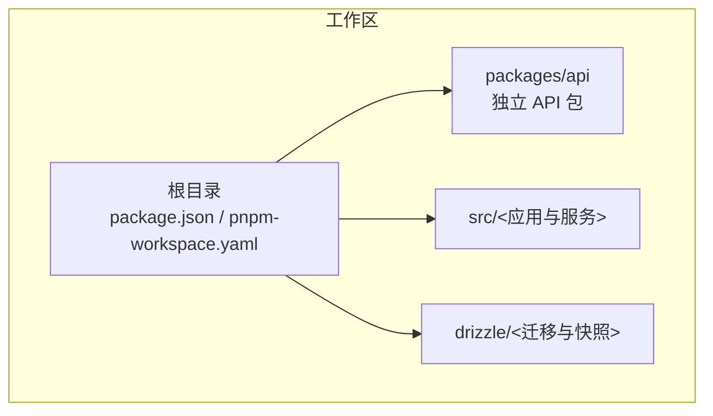
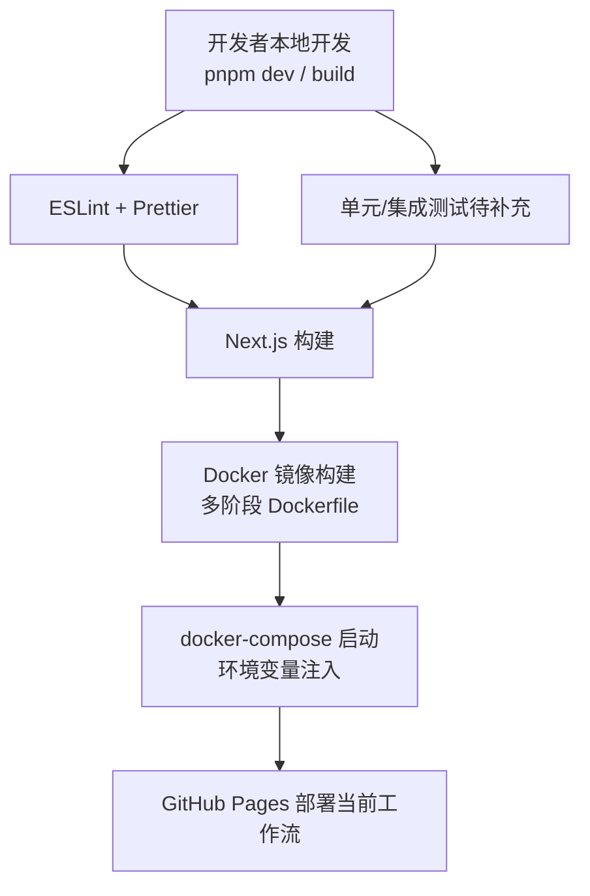
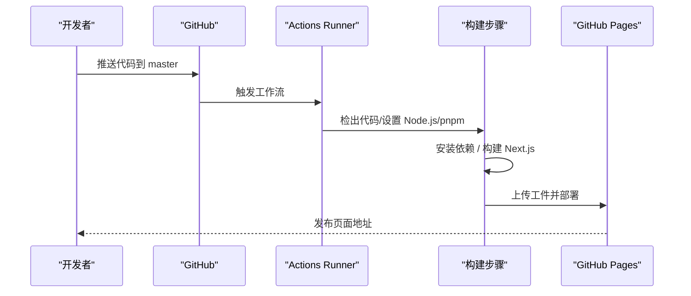
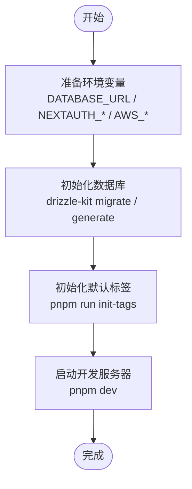
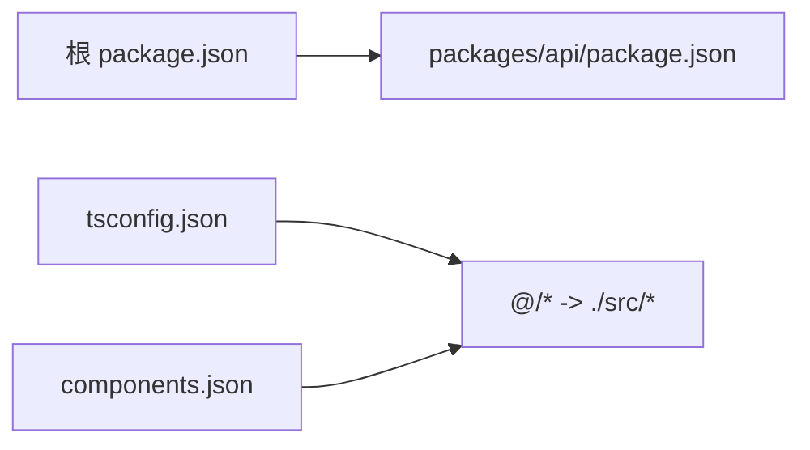
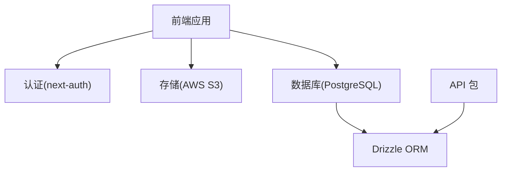

# 开发流程

<cite>
**本文引用的文件**
- [package.json](file://package.json)
- [.github/workflows/nextjs.yml](file://.github/workflows/nextjs.yml)
- [pnpm-workspace.yaml](file://pnpm-workspace.yaml)
- [drizzle.config.ts](file://drizzle.config.ts)
- [scripts/init-default-tags.ts](file://scripts/init-default-tags.ts)
- [docker-compose.yml](file://docker-compose.yml)
- [Dockerfile](file://Dockerfile)
- [start.sh](file://start.sh)
- [eslint.config.mjs](file://eslint.config.mjs)
- [tsconfig.json](file://tsconfig.json)
- [components.json](file://components.json)
- [README.md](file://README.md)
</cite>

## 目录

1. [简介](#简介)
2. [项目结构](#项目结构)
3. [核心组件](#核心组件)
4. [架构总览](#架构总览)
5. [详细组件分析](#详细组件分析)
6. [依赖分析](#依赖分析)
7. [性能考虑](#性能考虑)
8. [故障排查指南](#故障排查指南)
9. [结论](#结论)
10. [附录](#附录)

## 简介

本文件为 Image SaaS 项目的完整开发流程文档，覆盖以下主题：

- Git 工作流程与分支策略、提交规范、合并流程
- 代码审查标准与 PR 模板与审查清单
- 持续集成与持续部署（CI/CD），含 GitHub Actions 配置与自动化测试
- 本地开发环境设置，含依赖安装、环境变量配置、数据库初始化
- 多包工作区管理与依赖关系处理
- 版本发布流程与变更日志维护规范
- 团队协作开发规范与沟通机制

说明：当前仓库未提供明确的 Git 分支策略、PR 模板与审查清单模板；CI/CD 仅包含一个基础的 Pages 部署工作流。本文在这些缺失部分提供通用最佳实践建议，便于团队落地实施。

## 项目结构

项目采用 Monorepo 结构，使用 pnpm workspace 管理多包，根目录包含前端 Next.js 应用与独立的 API 包。数据库迁移与模式由 DrizzleKit/ORM 管理，Docker 与 docker-compose 支持容器化部署。

图表来源

- [pnpm-workspace.yaml:1-6](file://pnpm-workspace.yaml#L1-L6)
- [package.json:1-94](file://package.json#L1-L94)

章节来源

- [pnpm-workspace.yaml:1-6](file://pnpm-workspace.yaml#L1-L6)
- [package.json:1-94](file://package.json#L1-L94)

## 核心组件

- 构建与运行脚本：通过根目录 package.json 中的 scripts 管理开发、构建、格式化与 Lint。
- 代码质量：ESLint 配置基于 next/eslint-config-next，统一规则与忽略项。
- 类型系统：TypeScript 配置启用严格模式与 Bundler 模块解析，支持路径别名。
- UI 组件：使用 shadcn/ui 配置，TSX、RSC 支持，路径别名映射至 @/\*。
- 数据库：Drizzle 配置指向 src/server/db/schema.ts，迁移输出至 drizzle 目录。
- 容器化：Dockerfile 多阶段构建，docker-compose 提供环境变量注入与健康检查。

章节来源

- [package.json:5-12](file://package.json#L5-L12)
- [eslint.config.mjs:1-31](file://eslint.config.mjs#L1-L31)
- [tsconfig.json:1-35](file://tsconfig.json#L1-L35)
- [components.json:1-23](file://components.json#L1-L23)
- [drizzle.config.ts:1-14](file://drizzle.config.ts#L1-L14)
- [Dockerfile:1-76](file://Dockerfile#L1-L76)
- [docker-compose.yml:1-72](file://docker-compose.yml#L1-L72)

## 架构总览

下图展示从本地开发到容器部署的关键流程，以及与 CI/CD 的衔接点。

图表来源

- [package.json:5-12](file://package.json#L5-L12)
- [eslint.config.mjs:1-31](file://eslint.config.mjs#L1-L31)
- [Dockerfile:1-76](file://Dockerfile#L1-L76)
- [.github/workflows/nextjs.yml:1-70](file://.github/workflows/nextjs.yml#L1-L70)

## 详细组件分析

### Git 工作流程与分支策略

- 分支模型建议
  - 主分支：master/main 用于稳定发布，受保护，禁止直接推送。
  - 功能分支：feature/<issue-id>-short-description，从主分支切出，完成后合并回主分支。
  - 预发布分支：release/<version>，用于小范围回归与预热。
  - 热修复分支：hotfix/<issue-id>-short-description，从稳定标签切出，修复后同时合并回主分支与预发布分支。
- 提交规范建议
  - 格式：type(scope): subject
  - 示例：feat(auth): 添加用户登录接口；fix(db): 修复连接池泄漏；docs(readme): 更新部署指引
  - type 取值：feat、fix、docs、style、refactor、perf、test、chore、revert
- 合并流程建议
  - 必须通过 CI 通过与至少一名 Reviewer 同意
  - 使用 Squash Merge 保持提交历史整洁
  - 合并前确保无冲突、无破坏性变更

说明：当前仓库未提供分支策略与提交规范约定，请团队在 Confluence/Wiki 或仓库内新增规范文件以固化流程。

章节来源

- [README.md:1-37](file://README.md#L1-L37)

### 代码审查标准与 PR 模板

- 审查标准
  - 代码可读性：命名清晰、函数短小、注释必要
  - 正确性：边界条件、异常路径、空值处理
  - 性能：避免重复计算、内存泄漏、阻塞操作
  - 安全：输入校验、鉴权、敏感信息脱敏
  - 兼容性：破坏性变更需标注并提供迁移指南
- PR 模板建议
  - 概述：变更目的与影响范围
  - 测试：新增/修改的测试用例与验证方式
  - 风险：潜在风险与回滚方案
  - 变更日志：是否需要更新 CHANGELOG
  - 关联问题：Issue 编号与相关链接
- 审查清单
  - 是否满足需求规格
  - 是否通过 Lint 与格式化
  - 是否通过 CI 与测试
  - 是否有安全与性能隐患
  - 文档与注释是否完善

说明：当前仓库未提供 PR 模板与审查清单，请团队在 .github/PULL_REQUEST_TEMPLATE 或 Wiki 新增模板文件。

章节来源

- [eslint.config.mjs:1-31](file://eslint.config.mjs#L1-L31)
- [package.json:5-12](file://package.json#L5-L12)

### 持续集成与持续部署（CI/CD）

- 当前 CI 工作流
  - 触发：推送到 master 分支或手动触发
  - 步骤：检出代码、设置 Node.js 与 pnpm、安装依赖、构建 Next.js、上传工件、部署到 GitHub Pages
  - 并发控制：同一时间仅允许一次部署，不取消进行中的任务
- 建议增强
  - 增加测试阶段：在构建前执行单元/集成测试
  - 增加 Lint 与格式化检查
  - 增加安全扫描（Secrets、依赖漏洞）
  - 多环境部署：dev/staging/prod 分支对应不同环境
  - 自动化变更日志与版本标记

图表来源

- [.github/workflows/nextjs.yml:1-70](file://.github/workflows/nextjs.yml#L1-L70)

章节来源

- [.github/workflows/nextjs.yml:1-70](file://.github/workflows/nextjs.yml#L1-L70)

### 本地开发环境设置

- 依赖安装
  - 使用 pnpm workspace 安装根与包内依赖
  - 锁定文件一致，避免版本漂移
- 环境变量
  - 数据库：DATABASE_URL（PostgreSQL）
  - NextAuth：NEXTAUTH_URL、NEXTAUTH_SECRET
  - OAuth：GITHUB_ID/GITHUB_SECRET、GOOGLE_ID/GOOGLE_SECRET
  - 存储：AWS\_\*（S3）、OPENROUTER_API_KEY
  - Node 环境：NODE_ENV=development
- 数据库初始化
  - 使用 DrizzleKit 生成迁移与快照
  - 初始化默认标签：执行脚本为每个应用创建默认标签
- 启动应用
  - 开发：pnpm dev
  - 生产：pnpm build + pnpm start
  - Docker：docker-compose up

图表来源

- [drizzle.config.ts:1-14](file://drizzle.config.ts#L1-L14)
- [scripts/init-default-tags.ts:1-74](file://scripts/init-default-tags.ts#L1-L74)
- [docker-compose.yml:1-72](file://docker-compose.yml#L1-L72)

章节来源

- [package.json:5-12](file://package.json#L5-L12)
- [drizzle.config.ts:1-14](file://drizzle.config.ts#L1-L14)
- [scripts/init-default-tags.ts:1-74](file://scripts/init-default-tags.ts#L1-L74)
- [docker-compose.yml:1-72](file://docker-compose.yml#L1-L72)

### 多包工作区管理与依赖关系

- 工作区定义：pnpm-workspace.yaml 声明 packages/api 为独立包
- 依赖管理：根 package.json 管理共享依赖与脚本；API 包独立维护自身依赖
- 路径别名：tsconfig.json 与 components.json 配置 @/\* 路径映射，便于跨包引用
- 注意事项
  - 避免循环依赖
  - 公共工具与类型集中于 API 包或 src/lib
  - 发布前统一版本与锁定文件

图表来源

- [pnpm-workspace.yaml:1-6](file://pnpm-workspace.yaml#L1-L6)
- [package.json:1-94](file://package.json#L1-L94)
- [tsconfig.json:22-24](file://tsconfig.json#L22-L24)
- [components.json:14-20](file://components.json#L14-L20)

章节来源

- [pnpm-workspace.yaml:1-6](file://pnpm-workspace.yaml#L1-L6)
- [package.json:1-94](file://package.json#L1-L94)
- [tsconfig.json:22-24](file://tsconfig.json#L22-L24)
- [components.json:14-20](file://components.json#L14-L20)

### 版本发布流程与变更日志维护

- 版本策略：语义化版本（SemVer），主版本用于破坏性变更，次版本用于新功能，修订版本用于修复
- 发布流程建议
  - 在 release/<version> 分支上进行最终测试与文档校对
  - 合并到 master/main 后打标签并发布
  - 自动生成/更新变更日志，记录重大变更与迁移指南
- 变更日志维护
  - 采用 Keep a Changelog 格式
  - 每个版本条目包含：added、changed、deprecated、removed、fixed、security
  - 与 PR 描述联动，确保信息一致

说明：当前仓库未提供版本发布与变更日志规范，请团队在仓库新增 CHANGELOG.md 与发布流程文档。

章节来源

- [README.md:1-37](file://README.md#L1-L37)

### 团队协作规范与沟通机制

- 沟通渠道：Slack/Teams 讨论，Issue/PR 作为决策记录
- 会议机制：每日站会、迭代回顾、发布评审
- 文档规范：README、设计文档、API 文档、部署手册
- 代码规范：统一 ESLint、Prettier、TypeScript 配置，强制在 CI 中执行

章节来源

- [eslint.config.mjs:1-31](file://eslint.config.mjs#L1-L31)
- [tsconfig.json:1-35](file://tsconfig.json#L1-L35)
- [components.json:1-23](file://components.json#L1-L23)

## 依赖分析

- 外部依赖
  - 前端：Next.js、React、Radix UI、TailwindCSS、Lucide
  - 状态与查询：@tanstack/react-query、@trpc/react-query
  - 数据库：drizzle-orm、postgres、@neondatabase/serverless
  - 存储：@aws-sdk/client-s3、@aws-sdk/s3-request-presigner
  - 认证：next-auth、jsonwebtoken
  - 工具：date-fns、uuid、sharp、zod
- 开发依赖
  - Lint：@next/eslint-config-next、eslint
  - 格式化：prettier
  - 类型：typescript、@types/\*
  - 测试：jest、ts-jest
  - ORM：drizzle-kit、dotenv
- 依赖关系耦合
  - 前端与认证、存储、数据库存在直接耦合
  - API 包与数据库 schema 紧密关联
  - 建议通过抽象层降低耦合，如适配器模式

图表来源

- [package.json:14-66](file://package.json#L14-L66)
- [drizzle.config.ts:1-14](file://drizzle.config.ts#L1-L14)

章节来源

- [package.json:14-66](file://package.json#L14-L66)
- [package.json:67-92](file://package.json#L67-L92)
- [drizzle.config.ts:1-14](file://drizzle.config.ts#L1-L14)

## 性能考虑

- 构建优化
  - 使用 Next.js 内置优化与静态导出（当前工作流）
  - 多阶段 Docker 构建减少镜像体积
- 运行时优化
  - 严格 TypeScript 配置与 ESLint 规则减少运行时错误
  - 使用 React Query 缓存与分页加载
- 数据库优化
  - 使用 Drizzle ORM 生成最小化迁移
  - 合理索引与查询计划，避免 N+1 查询

章节来源

- [Dockerfile:1-76](file://Dockerfile#L1-L76)
- [eslint.config.mjs:1-31](file://eslint.config.mjs#L1-L31)
- [tsconfig.json:1-35](file://tsconfig.json#L1-L35)

## 故障排查指南

- 构建失败
  - 检查 pnpm 锁定文件一致性与 Node.js 版本
  - 确认 Next.js 构建脚本与环境变量
- 数据库连接
  - 校验 DATABASE_URL 与网络连通性
  - 使用 drizzle-kit 生成/应用迁移
- 容器启动失败
  - 查看健康检查与日志
  - 确认环境变量已正确注入
- 默认标签未初始化
  - 执行初始化脚本，确认应用列表与权限

章节来源

- [.github/workflows/nextjs.yml:50-57](file://.github/workflows/nextjs.yml#L50-L57)
- [drizzle.config.ts:8-10](file://drizzle.config.ts#L8-L10)
- [scripts/init-default-tags.ts:14-68](file://scripts/init-default-tags.ts#L14-L68)
- [docker-compose.yml:38-43](file://docker-compose.yml#L38-L43)

## 结论

本文件为 Image SaaS 项目提供了从本地开发到 CI/CD 的全流程指导，并针对当前仓库缺失的 Git 分支策略、PR 模板与审查清单、测试与安全扫描等环节给出了可落地的最佳实践建议。建议团队尽快完善相关规范与模板，以提升协作效率与交付质量。

## 附录

- 快速启动清单
  - 安装 pnpm 与 Node.js
  - 复制 .env.example 为 .env 并填写必要变量
  - pnpm install
  - pnpm run build
  - pnpm run dev
- 常用命令参考
  - 开发：pnpm dev
  - 构建：pnpm build
  - 启动：pnpm start
  - Lint：pnpm lint / pnpm lint:fix
  - 格式化：pnpm format / pnpm format:check
  - 数据库：drizzle-kit migrate / generate
  - 初始化标签：pnpm run init-tags
  - Docker：docker-compose up

章节来源

- [package.json:5-12](file://package.json#L5-L12)
- [drizzle.config.ts:1-14](file://drizzle.config.ts#L1-L14)
- [scripts/init-default-tags.ts:1-74](file://scripts/init-default-tags.ts#L1-L74)
- [docker-compose.yml:1-72](file://docker-compose.yml#L1-L72)
