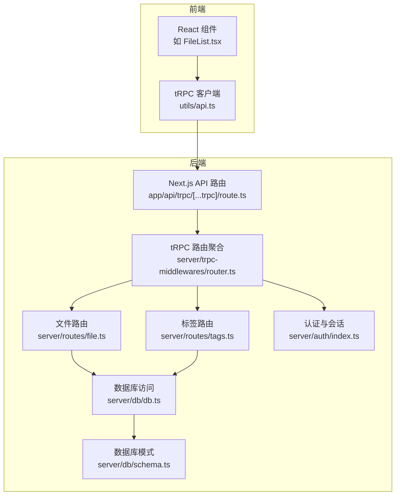
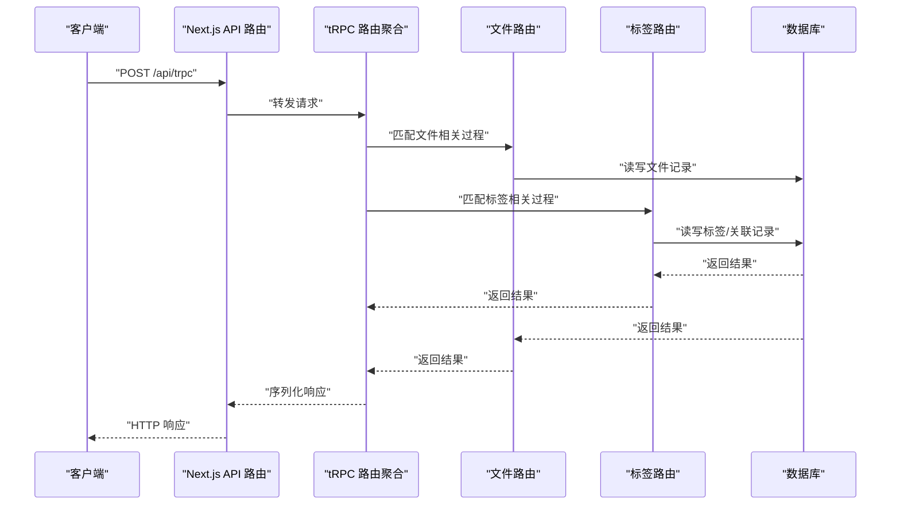
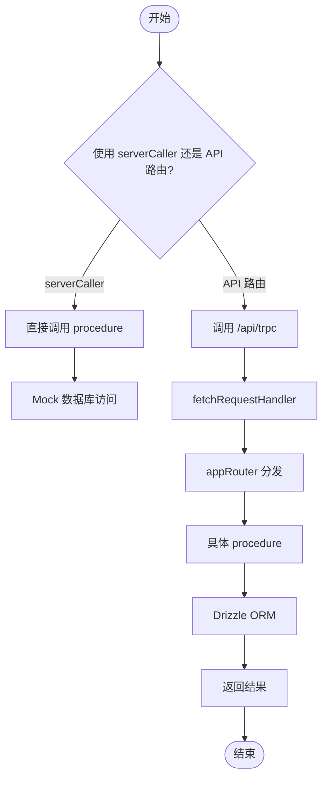
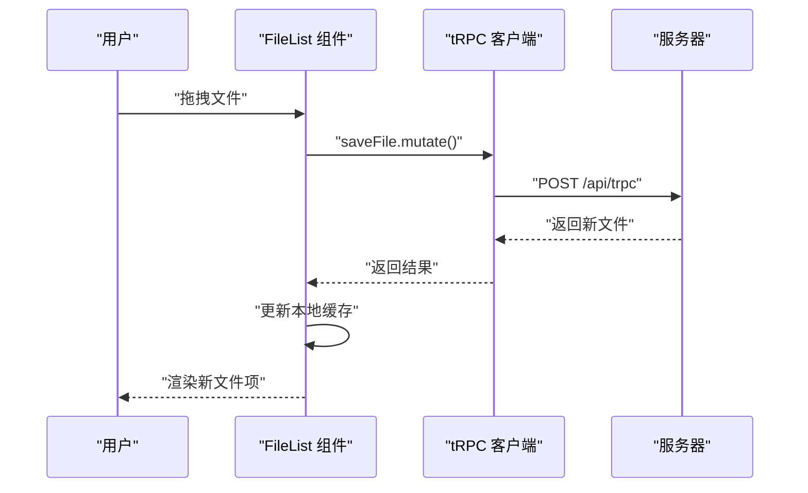
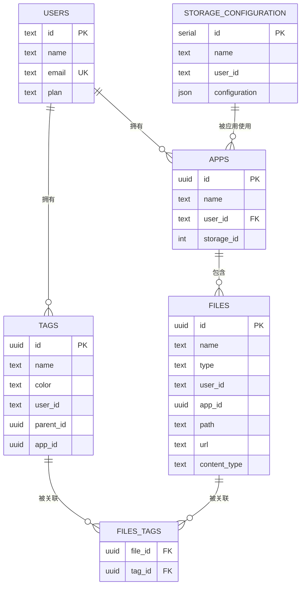
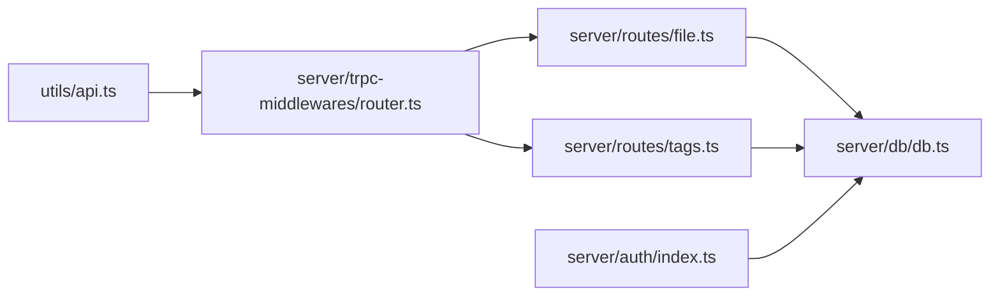

# 测试策略

<cite>
**本文引用的文件**
- [package.json](file://package.json)
- [src/server/trpc-middlewares/router.ts](file://src/server/trpc-middlewares/router.ts)
- [src/app/api/trpc/[...trpc]/route.ts](file://src/app/api/trpc/[...trpc]/route.ts)
- [src/utils/trpc.ts](file://src/utils/trpc.ts)
- [src/utils/api.ts](file://src/utils/api.ts)
- [src/server/routes/file.ts](file://src/server/routes/file.ts)
- [src/server/routes/tags.ts](file://src/server/routes/tags.ts)
- [src/server/db/schema.ts](file://src/server/db/schema.ts)
- [src/server/db/db.ts](file://src/server/db/db.ts)
- [src/server/auth/index.ts](file://src/server/auth/index.ts)
- [src/lib/auth.ts](file://src/lib/auth.ts)
- [src/components/feature/FileList.tsx](file://src/components/feature/FileList.tsx)
- [src/components/feature/dropzone.tsx](file://src/components/feature/dropzone.tsx)
- [src/app/dashboard/apps/[appId]/setting/tag-manager/page.tsx](file://src/app/dashboard/apps/[appId]/setting/tag-manager/page.tsx)
- [src/app/dashboard/apps/[appId]/setting/storage/page.tsx](file://src/app/dashboard/apps/[appId]/setting/storage/page.tsx)
- [src/app/dashboard/apps/[appId]/setting/storage/new/page.tsx](file://src/app/dashboard/apps/[appId]/setting/storage/new/page.tsx)
- [src/app/dashboard/apps/[appId]/setting/api-key/page.tsx](file://src/app/dashboard/apps/[appId]/setting/api-key/page.tsx)
- [.github/workflows/nextjs.yml](file://.github/workflows/nextjs.yml)
</cite>

## 目录

1. [引言](#引言)
2. [项目结构](#项目结构)
3. [核心组件](#核心组件)
4. [架构总览](#架构总览)
5. [详细组件分析](#详细组件分析)
6. [依赖分析](#依赖分析)
7. [性能考虑](#性能考虑)
8. [故障排查指南](#故障排查指南)
9. [结论](#结论)
10. [附录](#附录)

## 引言

本测试策略面向 Image SaaS 项目，目标是建立覆盖单元测试、集成测试与端到端测试的完整测试体系，确保 tRPC 路由、React 组件与数据库操作的稳定性与可维护性。文档将明确测试文件组织结构与命名约定、覆盖率与质量门禁标准、测试环境配置与模拟数据准备、测试运行命令与 CI 流程，以及 TDD 实践建议。

## 项目结构

项目采用 Next.js 应用结构，核心测试关注点包括：

- tRPC 路由层：路由聚合、中间件与业务逻辑
- 数据访问层：Drizzle ORM 与 Postgres
- 前端层：React 组件与 tRPC 客户端
- 认证与会话：NextAuth 配置与服务端会话

**图表来源**

- [src/app/api/trpc/[...trpc]/route.ts](file://src/app/api/trpc/[...trpc]/route.ts#L1-L14)
- [src/server/trpc-middlewares/router.ts:1-20](file://src/server/trpc-middlewares/router.ts#L1-L20)
- [src/server/routes/file.ts:1-561](file://src/server/routes/file.ts#L1-L561)
- [src/server/routes/tags.ts:1-735](file://src/server/routes/tags.ts#L1-L735)
- [src/server/db/db.ts:1-9](file://src/server/db/db.ts#L1-L9)
- [src/server/db/schema.ts:1-270](file://src/server/db/schema.ts#L1-L270)
- [src/server/auth/index.ts:1-163](file://src/server/auth/index.ts#L1-L163)
- [src/utils/api.ts:1-17](file://src/utils/api.ts#L1-L17)

**章节来源**

- [src/app/api/trpc/[...trpc]/route.ts](file://src/app/api/trpc/[...trpc]/route.ts#L1-L14)
- [src/server/trpc-middlewares/router.ts:1-20](file://src/server/trpc-middlewares/router.ts#L1-L20)
- [src/server/db/schema.ts:1-270](file://src/server/db/schema.ts#L1-L270)
- [src/server/db/db.ts:1-9](file://src/server/db/db.ts#L1-L9)
- [src/server/auth/index.ts:1-163](file://src/server/auth/index.ts#L1-L163)
- [src/utils/api.ts:1-17](file://src/utils/api.ts#L1-L17)

## 核心组件

- tRPC 路由聚合：集中导出路由模块，便于统一测试入口
- 文件路由：上传预签名 URL、保存文件、分页查询、软删/恢复、永久删除等
- 标签路由：标签 CRUD、批量创建/获取、文件关联/解绑、AI 识别标签
- 数据库层：Drizzle ORM + Postgres，定义表结构与关系
- 认证层：NextAuth 集成 Drizzle Adapter，支持多提供商与 SKIP_LOGIN 模式
- 前端组件：文件列表、拖拽上传、标签管理、存储配置、API Key 管理

**章节来源**

- [src/server/trpc-middlewares/router.ts:1-20](file://src/server/trpc-middlewares/router.ts#L1-L20)
- [src/server/routes/file.ts:1-561](file://src/server/routes/file.ts#L1-L561)
- [src/server/routes/tags.ts:1-735](file://src/server/routes/tags.ts#L1-L735)
- [src/server/db/schema.ts:1-270](file://src/server/db/schema.ts#L1-L270)
- [src/server/auth/index.ts:1-163](file://src/server/auth/index.ts#L1-L163)
- [src/components/feature/FileList.tsx:1-366](file://src/components/feature/FileList.tsx#L1-L366)
- [src/app/dashboard/apps/[appId]/setting/tag-manager/page.tsx](file://src/app/dashboard/apps/[appId]/setting/tag-manager/page.tsx#L1-L465)

## 架构总览

tRPC 请求在 Next.js API 路由中被处理，随后进入 appRouter，再分发到具体路由模块。数据库通过 Drizzle ORM 访问，认证通过 NextAuth 管理会话。

**图表来源**

- [src/app/api/trpc/[...trpc]/route.ts](file://src/app/api/trpc/[...trpc]/route.ts#L1-L14)
- [src/server/trpc-middlewares/router.ts:1-20](file://src/server/trpc-middlewares/router.ts#L1-L20)
- [src/server/routes/file.ts:1-561](file://src/server/routes/file.ts#L1-L561)
- [src/server/routes/tags.ts:1-735](file://src/server/routes/tags.ts#L1-L735)
- [src/server/db/db.ts:1-9](file://src/server/db/db.ts#L1-L9)

## 详细组件分析

### tRPC 路由测试最佳实践

- 单元测试：针对每个 procedure 的输入校验、权限控制、数据库交互与错误处理
- 集成测试：通过 serverCaller 或 Next.js API 路由发起请求，验证端到端行为
- 模拟策略：
  - 使用 serverCaller 直接调用 procedure，避免网络层干扰
  - 使用 Next.js fetchRequestHandler 包装真实 API 路由
  - 使用内存数据库或测试专用数据库实例隔离
- 覆盖场景：
  - 未登录/权限不足：返回 403/401
  - 输入参数非法：Zod 校验失败
  - 业务异常：如文件不存在、标签冲突等 TRPCError
  - 正常路径：创建预签名 URL、保存文件、分页查询、标签关联/识别

**图表来源**

- [src/utils/trpc.ts:1-7](file://src/utils/trpc.ts#L1-L7)
- [src/app/api/trpc/[...trpc]/route.ts](file://src/app/api/trpc/[...trpc]/route.ts#L1-L14)
- [src/server/trpc-middlewares/router.ts:1-20](file://src/server/trpc-middlewares/router.ts#L1-L20)
- [src/server/db/db.ts:1-9](file://src/server/db/db.ts#L1-L9)

**章节来源**

- [src/utils/trpc.ts:1-7](file://src/utils/trpc.ts#L1-L7)
- [src/app/api/trpc/[...trpc]/route.ts](file://src/app/api/trpc/[...trpc]/route.ts#L1-L14)
- [src/server/trpc-middlewares/router.ts:1-20](file://src/server/trpc-middlewares/router.ts#L1-L20)

### React 组件测试最佳实践

- 单元测试：使用 React Testing Library 或类似工具，渲染组件，断言 DOM、事件与状态变化
- 集成测试：通过 tRPC 客户端桩替换真实调用，验证与 tRPC 的交互
- 模拟策略：
  - 使用 jest.fn 替换 trpcClientReact 的查询/变更方法
  - 使用 MemoryRouter 包裹，模拟 Next.js 路由上下文
  - 使用自定义 Provider 注入 mock 会话与 tRPC 客户端
- 覆盖场景：
  - 文件列表分页加载、分组展示、删除与刷新
  - 拖拽上传触发、上传进度与成功回调
  - 标签管理：创建、更新、删除、从文件移除标签
  - 存储配置：新建、编辑、切换存储
  - API Key 管理：创建、显示

**图表来源**

- [src/components/feature/FileList.tsx:1-366](file://src/components/feature/FileList.tsx#L1-L366)
- [src/utils/api.ts:1-17](file://src/utils/api.ts#L1-L17)

**章节来源**

- [src/components/feature/FileList.tsx:1-366](file://src/components/feature/FileList.tsx#L1-L366)
- [src/app/dashboard/apps/[appId]/setting/tag-manager/page.tsx](file://src/app/dashboard/apps/[appId]/setting/tag-manager/page.tsx#L1-L465)
- [src/app/dashboard/apps/[appId]/setting/storage/page.tsx](file://src/app/dashboard/apps/[appId]/setting/storage/page.tsx#L1-L103)
- [src/app/dashboard/apps/[appId]/setting/storage/new/page.tsx](file://src/app/dashboard/apps/[appId]/setting/storage/new/page.tsx#L1-L94)
- [src/app/dashboard/apps/[appId]/setting/api-key/page.tsx](file://src/app/dashboard/apps/[appId]/setting/api-key/page.tsx#L1-L80)
- [src/utils/api.ts:1-17](file://src/utils/api.ts#L1-L17)

### 数据库操作测试最佳实践

- 单元测试：对 DAO/查询函数进行测试，使用事务隔离与回滚
- 集成测试：连接测试数据库，执行真实 SQL，验证约束与索引
- 模拟策略：
  - 使用 Drizzle Kit 管理迁移，测试前执行迁移，测试后回滚
  - 使用独立测试数据库实例，避免污染生产数据
- 覆盖场景：
  - 文件 CRUD、软删/恢复、分页查询、按标签关联查询
  - 标签 CRUD、去重、批量创建、AI 识别后的关联
  - 用户与应用、存储配置、API Key 的关联一致性

**图表来源**

- [src/server/db/schema.ts:1-270](file://src/server/db/schema.ts#L1-L270)

**章节来源**

- [src/server/db/schema.ts:1-270](file://src/server/db/schema.ts#L1-L270)
- [src/server/db/db.ts:1-9](file://src/server/db/db.ts#L1-L9)

### 认证与会话测试最佳实践

- 单元测试：验证 SKIP_LOGIN 模式、Providers 配置、会话回调
- 集成测试：通过 Next.js API 路由发起登录/登出请求，验证会话持久化
- 模拟策略：
  - 使用 NextAuth 的测试适配器或 mock 会话
  - 使用 Cookie/Headers 模拟登录态
- 覆盖场景：
  - 多提供商登录（GitHub/Gitee/JiHuLab）
  - SKIP_LOGIN 模式下的管理员会话
  - 会话过期与权限拦截

**章节来源**

- [src/server/auth/index.ts:1-163](file://src/server/auth/index.ts#L1-L163)
- [src/lib/auth.ts:1-3](file://src/lib/auth.ts#L1-L3)

## 依赖分析

- tRPC 客户端与服务端通过统一的 AppRouter 类型对接，便于测试时替换客户端实现
- 文件与标签路由依赖数据库访问层，需确保测试中对数据库的隔离与清理
- 认证层依赖 NextAuth 与 Drizzle Adapter，测试中需模拟会话与用户

**图表来源**

- [src/utils/api.ts:1-17](file://src/utils/api.ts#L1-L17)
- [src/server/trpc-middlewares/router.ts:1-20](file://src/server/trpc-middlewares/router.ts#L1-L20)
- [src/server/routes/file.ts:1-561](file://src/server/routes/file.ts#L1-L561)
- [src/server/routes/tags.ts:1-735](file://src/server/routes/tags.ts#L1-L735)
- [src/server/db/db.ts:1-9](file://src/server/db/db.ts#L1-L9)
- [src/server/auth/index.ts:1-163](file://src/server/auth/index.ts#L1-L163)

**章节来源**

- [src/utils/api.ts:1-17](file://src/utils/api.ts#L1-L17)
- [src/server/trpc-middlewares/router.ts:1-20](file://src/server/trpc-middlewares/router.ts#L1-L20)

## 性能考虑

- tRPC 查询缓存：合理使用 React Query 的缓存策略，避免重复请求
- 分页与游标：文件列表使用游标分页，减少大数据集的排序与传输
- 并发与批处理：标签批量创建与关联，减少数据库往返
- 数据库索引：按需建立索引，优化查询性能

## 故障排查指南

- tRPC 错误：捕获 TRPCError，区分 NOT_FOUND、FORBIDDEN、CONFLICT 等
- 数据库异常：捕获 SQL 异常，记录上下文与参数
- 认证失败：检查会话是否过期、Provider 配置是否正确
- 前端状态不一致：确认 React Query 的缓存更新策略与乐观更新

**章节来源**

- [src/server/routes/file.ts:1-561](file://src/server/routes/file.ts#L1-L561)
- [src/server/routes/tags.ts:1-735](file://src/server/routes/tags.ts#L1-L735)

## 结论

通过分层测试策略与清晰的测试职责划分，可以有效保障 Image SaaS 的核心功能稳定可靠。建议优先推进单元测试与集成测试，逐步引入端到端测试，配合严格的覆盖率与质量门禁，持续提升代码质量与交付效率。

## 附录

### 测试文件组织结构与命名约定

- 单元测试目录：packages/_ 与 src/_ 下分别放置对应单元测试，文件命名以 .test.ts 或 .spec.ts 结尾
- 集成测试目录：tests/integration，按模块划分（如 file、tags、auth）
- 端到端测试目录：tests/e2e，按页面或流程划分（如 upload-flow、tag-management）
- 模拟数据：tests/fixtures 或 tests/mocks，按模块存放

### 测试覆盖率与质量门禁

- 行覆盖率：≥80%
- 分支覆盖率：≥70%
- 函数覆盖率：≥85%
- 语句覆盖率：≥80%
- 质量门禁：CI 中失败即阻断合并；覆盖率低于阈值时阻断发布

### 测试环境配置与模拟数据准备

- 数据库：使用独立测试数据库实例，测试前迁移，测试后回滚
- tRPC：使用 serverCaller 或 Next.js API 路由进行集成测试
- 认证：通过 SKIP_LOGIN 或 mock 会话注入测试用户
- 模拟外部服务：S3、AI 识别服务使用桩或本地替代

### 测试运行命令与持续集成

- 单元测试：jest --watchAll（开发）；jest --coverage（CI）
- 集成测试：jest --testPathPattern=integration
- 端到端测试：playwright test 或 cypress run
- CI 流程：安装依赖 → 构建 → 单元测试 → 集成测试 → 覆盖率上报 → 部署

**章节来源**

- [package.json:1-94](file://package.json#L1-L94)
- [.github/workflows/nextjs.yml:1-70](file://.github/workflows/nextjs.yml#L1-L70)

### 具体测试用例编写示例（示例路径）

- tRPC 路由
  - 文件上传预签名 URL：[src/server/routes/file.ts:27-90](file://src/server/routes/file.ts#L27-L90)
  - 保存文件记录：[src/server/routes/file.ts:91-118](file://src/server/routes/file.ts#L91-L118)
  - 分页查询文件：[src/server/routes/file.ts:135-234](file://src/server/routes/file.ts#L135-L234)
  - 标签创建与关联：[src/server/routes/tags.ts:246-353](file://src/server/routes/tags.ts#L246-L353)
  - AI 识别标签：[src/server/routes/tags.ts:416-530](file://src/server/routes/tags.ts#L416-L530)
- React 组件
  - 文件列表渲染与分页：[src/components/feature/FileList.tsx:28-50](file://src/components/feature/FileList.tsx#L28-L50)
  - 拖拽上传触发：[src/components/feature/dropzone.tsx:9-52](file://src/components/feature/dropzone.tsx#L9-L52)
  - 标签管理界面：[src/app/dashboard/apps/[appId]/setting/tag-manager/page.tsx](file://src/app/dashboard/apps/[appId]/setting/tag-manager/page.tsx#L30-L150)
- 数据库
  - 文件与标签关联：[src/server/db/schema.ts:242-270](file://src/server/db/schema.ts#L242-L270)
  - 用户与应用关系：[src/server/db/schema.ts:18-45](file://src/server/db/schema.ts#L18-L45)

### 测试驱动开发（TDD）实践

- 先写失败的测试用例，再实现最小可行逻辑
- 针对边界条件与异常路径优先设计测试
- 保持测试小而快，避免过度耦合
- 使用桩与假对象隔离外部依赖
