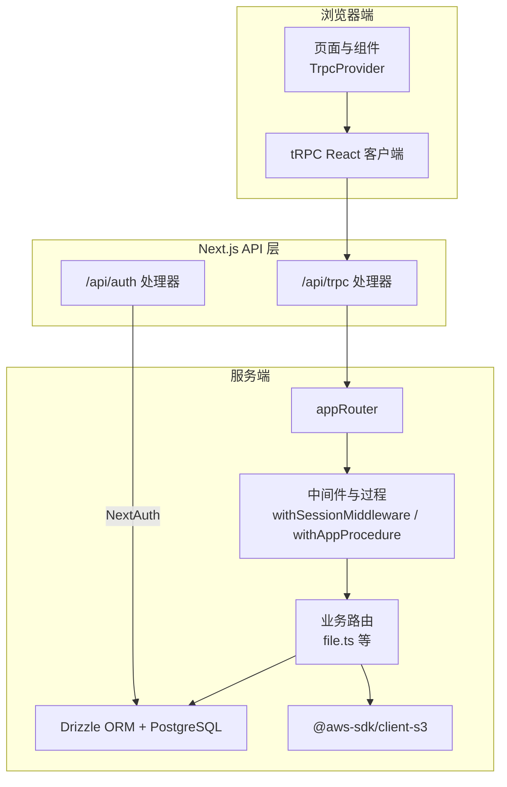
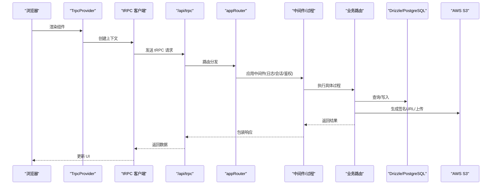
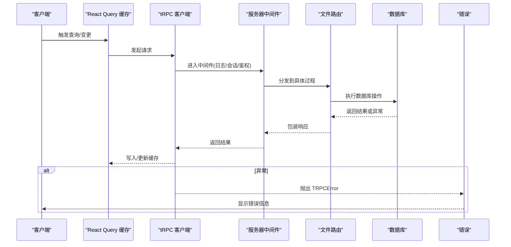
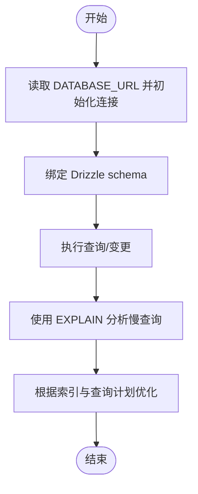
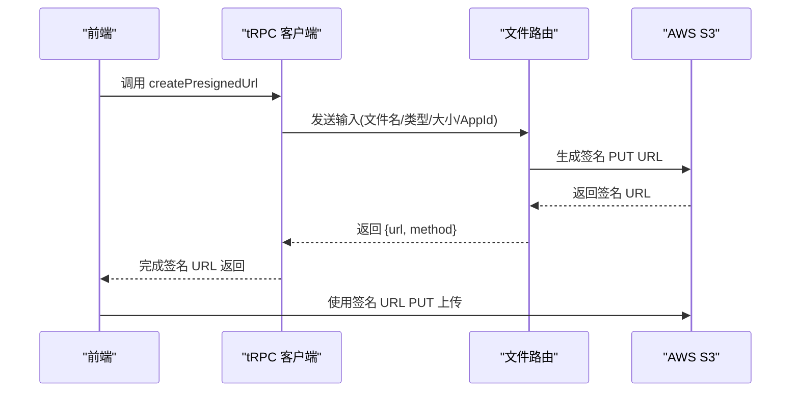
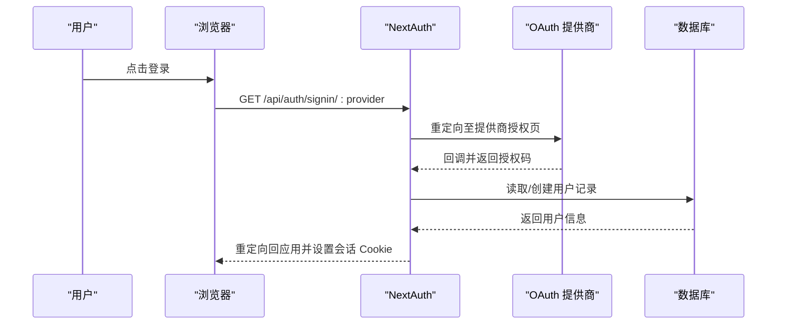
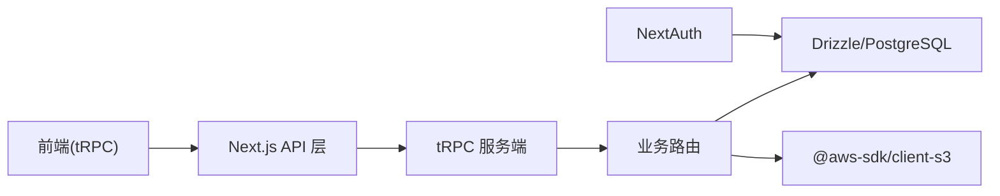

# 调试工具

<cite>
**本文引用的文件**
- [src/app/api/trpc/[...trpc]/route.ts](file://src/app/api/trpc/[...trpc]/route.ts)
- [src/app/api/auth/[...nextauth]/route.ts](file://src/app/api/auth/[...nextauth]/route.ts)
- [src/app/trpc-provider.tsx](file://src/app/trpc-provider.tsx)
- [src/utils/api.ts](file://src/utils/api.ts)
- [src/utils/trpc.ts](file://src/utils/trpc.ts)
- [src/server/trpc-middlewares/router.ts](file://src/server/trpc-middlewares/router.ts)
- [src/server/trpc-middlewares/trpc.ts](file://src/server/trpc-middlewares/trpc.ts)
- [src/server/routes/file.ts](file://src/server/routes/file.ts)
- [src/server/auth/index.ts](file://src/server/auth/index.ts)
- [src/server/db/db.ts](file://src/server/db/db.ts)
- [src/server/db/schema.ts](file://src/server/db/schema.ts)
- [package.json](file://package.json)
- [next.config.ts](file://next.config.ts)
</cite>

## 目录
1. [简介](#简介)
2. [项目结构](#项目结构)
3. [核心组件](#核心组件)
4. [架构总览](#架构总览)
5. [详细组件分析](#详细组件分析)
6. [依赖关系分析](#依赖关系分析)
7. [性能考量](#性能考量)
8. [故障排查指南](#故障排查指南)
9. [结论](#结论)
10. [附录](#附录)

## 简介
本指南面向 Image SaaS 项目的开发者，系统性地介绍如何高效使用各类调试工具与方法，覆盖以下方面：
- 浏览器开发者工具：网络请求监控、React DevTools 使用、性能分析
- tRPC 调试：请求/响应日志、错误追踪、状态管理调试
- 数据库查询调试：SQL 日志与索引优化建议
- AWS S3 上传调试：签名 URL 获取、客户端上传验证
- OAuth 认证调试：NextAuth 配置与回调、SKIP_LOGIN 模式
- 日志记录最佳实践与错误处理机制
- 常见问题诊断与解决方案
- 性能分析工具：内存泄漏检测与渲染性能优化
- 开发者高效调试工作流与工具链配置

## 项目结构
该项目采用 Next.js 应用，前端通过 tRPC 客户端调用后端 API，认证基于 NextAuth，数据访问层使用 Drizzle ORM 连接 PostgreSQL，对象存储使用 AWS S3。

图表来源
- [src/app/trpc-provider.tsx:1-18](file://src/app/trpc-provider.tsx#L1-L18)
- [src/utils/api.ts:1-17](file://src/utils/api.ts#L1-L17)
- [src/app/api/trpc/[...trpc]/route.ts:1-14](file://src/app/api/trpc/[...trpc]/route.ts#L1-L14)
- [src/app/api/auth/[...nextauth]/route.ts:1-7](file://src/app/api/auth/[...nextauth]/route.ts#L1-L7)
- [src/server/trpc-middlewares/router.ts:1-20](file://src/server/trpc-middlewares/router.ts#L1-L20)
- [src/server/trpc-middlewares/trpc.ts:1-130](file://src/server/trpc-middlewares/trpc.ts#L1-L130)
- [src/server/routes/file.ts:1-561](file://src/server/routes/file.ts#L1-L561)
- [src/server/db/db.ts:1-9](file://src/server/db/db.ts#L1-L9)

章节来源
- [src/app/trpc-provider.tsx:1-18](file://src/app/trpc-provider.tsx#L1-L18)
- [src/utils/api.ts:1-17](file://src/utils/api.ts#L1-L17)
- [src/app/api/trpc/[...trpc]/route.ts:1-14](file://src/app/api/trpc/[...trpc]/route.ts#L1-L14)
- [src/app/api/auth/[...nextauth]/route.ts:1-7](file://src/app/api/auth/[...nextauth]/route.ts#L1-L7)
- [src/server/trpc-middlewares/router.ts:1-20](file://src/server/trpc-middlewares/router.ts#L1-L20)
- [src/server/trpc-middlewares/trpc.ts:1-130](file://src/server/trpc-middlewares/trpc.ts#L1-L130)
- [src/server/routes/file.ts:1-561](file://src/server/routes/file.ts#L1-L561)
- [src/server/db/db.ts:1-9](file://src/server/db/db.ts#L1-L9)

## 核心组件
- tRPC 客户端与 Provider
  - 客户端初始化与批量链接配置位于 [src/utils/api.ts:1-17](file://src/utils/api.ts#L1-L17)，在 [src/app/trpc-provider.tsx:1-18](file://src/app/trpc-provider.tsx#L1-L18) 中注入 React Query。
  - 服务端调用工厂位于 [src/utils/trpc.ts:1-7](file://src/utils/trpc.ts#L1-L7)。
- tRPC 路由与中间件
  - 路由聚合位于 [src/server/trpc-middlewares/router.ts:1-20](file://src/server/trpc-middlewares/router.ts#L1-L20)，包含文件、应用、标签、存储、API Key、用户计划等子路由。
  - 中间件与过程定义位于 [src/server/trpc-middlewares/trpc.ts:1-130](file://src/server/trpc-middlewares/trpc.ts#L1-L130)，包含会话校验、日志统计、应用级鉴权（API Key 或签名 Token）。
- 认证与会话
  - NextAuth 配置与多提供商（GitHub、Gitee、JiHuLab）位于 [src/server/auth/index.ts:1-163](file://src/server/auth/index.ts#L1-L163)，支持 SKIP_LOGIN 模式自动创建管理员用户。
- 数据库与模型
  - Drizzle 初始化与连接字符串来自环境变量，位于 [src/server/db/db.ts:1-9](file://src/server/db/db.ts#L1-L9)；表结构定义于 [src/server/db/schema.ts:1-270](file://src/server/db/schema.ts#L1-L270)。
- 文件与 S3
  - 文件路由实现签名 URL 生成、保存记录、分页查询、软删除与恢复等，位于 [src/server/routes/file.ts:1-561](file://src/server/routes/file.ts#L1-L561)。
- Next.js 配置
  - TypeScript 忽略构建错误、Docker 最小化输出、图片远程域名白名单等，位于 [next.config.ts:1-22](file://next.config.ts#L1-L22)。

章节来源
- [src/utils/api.ts:1-17](file://src/utils/api.ts#L1-L17)
- [src/app/trpc-provider.tsx:1-18](file://src/app/trpc-provider.tsx#L1-L18)
- [src/utils/trpc.ts:1-7](file://src/utils/trpc.ts#L1-L7)
- [src/server/trpc-middlewares/router.ts:1-20](file://src/server/trpc-middlewares/router.ts#L1-L20)
- [src/server/trpc-middlewares/trpc.ts:1-130](file://src/server/trpc-middlewares/trpc.ts#L1-L130)
- [src/server/auth/index.ts:1-163](file://src/server/auth/index.ts#L1-L163)
- [src/server/db/db.ts:1-9](file://src/server/db/db.ts#L1-L9)
- [src/server/db/schema.ts:1-270](file://src/server/db/schema.ts#L1-L270)
- [src/server/routes/file.ts:1-561](file://src/server/routes/file.ts#L1-L561)
- [next.config.ts:1-22](file://next.config.ts#L1-L22)

## 架构总览
下图展示从前端到后端、数据库与对象存储的整体交互路径。

图表来源
- [src/app/trpc-provider.tsx:1-18](file://src/app/trpc-provider.tsx#L1-L18)
- [src/utils/api.ts:1-17](file://src/utils/api.ts#L1-L17)
- [src/app/api/trpc/[...trpc]/route.ts:1-L14](file://src/app/api/trpc/[...trpc]/route.ts#L1-L14)
- [src/server/trpc-middlewares/router.ts:1-20](file://src/server/trpc-middlewares/router.ts#L1-L20)
- [src/server/trpc-middlewares/trpc.ts:1-130](file://src/server/trpc-middlewares/trpc.ts#L1-L130)
- [src/server/routes/file.ts:1-561](file://src/server/routes/file.ts#L1-L561)
- [src/server/db/db.ts:1-9](file://src/server/db/db.ts#L1-L9)

## 详细组件分析

### tRPC 调试：请求/响应日志、错误追踪与状态管理
- 请求/响应日志
  - 服务器端已内置过程级日志中间件，用于记录每个过程的执行耗时，便于定位慢过程与异常点。参考 [src/server/trpc-middlewares/trpc.ts:21-26](file://src/server/trpc-middlewares/trpc.ts#L21-L26)。
- 错误追踪
  - 过程抛出的 TRPCError 会被统一捕获并返回相应状态码与消息，便于前端识别与提示。例如文件路由中的“应用不存在”“尚未配置存储空间”等错误处理，参考 [src/server/routes/file.ts:47-61](file://src/server/routes/file.ts#L47-L61)。
- 状态管理调试
  - tRPC 与 React Query 结合使用，Provider 注入 QueryClient，可结合 React DevTools 的 React Query 插件观察缓存状态与重试行为。参考 [src/app/trpc-provider.tsx:1-18](file://src/app/trpc-provider.tsx#L1-L18) 与 [src/utils/api.ts:1-17](file://src/utils/api.ts#L1-L17)。

图表来源
- [src/server/trpc-middlewares/trpc.ts:1-130](file://src/server/trpc-middlewares/trpc.ts#L1-L130)
- [src/server/routes/file.ts:1-561](file://src/server/routes/file.ts#L1-L561)
- [src/app/trpc-provider.tsx:1-18](file://src/app/trpc-provider.tsx#L1-L18)
- [src/utils/api.ts:1-17](file://src/utils/api.ts#L1-L17)

章节来源
- [src/server/trpc-middlewares/trpc.ts:1-130](file://src/server/trpc-middlewares/trpc.ts#L1-L130)
- [src/server/routes/file.ts:1-561](file://src/server/routes/file.ts#L1-L561)
- [src/app/trpc-provider.tsx:1-18](file://src/app/trpc-provider.tsx#L1-L18)
- [src/utils/api.ts:1-17](file://src/utils/api.ts#L1-L17)

### 数据库查询调试：Drizzle ORM 与 PostgreSQL
- 连接与初始化
  - 数据库连接通过环境变量 DATABASE_URL 初始化，Drizzle 绑定 schema，便于类型安全查询。参考 [src/server/db/db.ts:1-9](file://src/server/db/db.ts#L1-L9) 与 [src/server/db/schema.ts:1-270](file://src/server/db/schema.ts#L1-L270)。
- SQL 日志
  - 可在本地开发时启用 SQL 日志输出，观察 tRPC 过程生成的 SQL 语句与参数，定位性能瓶颈与逻辑错误。可在启动脚本或环境变量中开启驱动日志（如 postgres 驱动的日志级别）。
- 索引与查询优化
  - 表结构中已包含常用索引（如 files 的复合索引、tags 的多字段索引），建议结合 EXPLAIN/EXPLAIN ANALYZE 分析复杂查询（如文件列表、按标签分页查询）。参考 [src/server/db/schema.ts:135-224](file://src/server/db/schema.ts#L135-L224)。

图表来源
- [src/server/db/db.ts:1-9](file://src/server/db/db.ts#L1-L9)
- [src/server/db/schema.ts:1-270](file://src/server/db/schema.ts#L1-L270)

章节来源
- [src/server/db/db.ts:1-9](file://src/server/db/db.ts#L1-L9)
- [src/server/db/schema.ts:1-270](file://src/server/db/schema.ts#L1-L270)

### AWS S3 上传调试：签名 URL 生成与客户端上传
- 签名 URL 生成
  - 文件路由提供生成预签名 PUT URL 的过程，包含桶、区域、凭据与过期时间配置。参考 [src/server/routes/file.ts:36-90](file://src/server/routes/file.ts#L36-L90)。
- 客户端上传验证
  - 建议在浏览器网络面板中确认签名 URL 的生成与上传请求头、状态码；若上传失败，检查签名 URL 是否过期、桶策略与跨域配置。
- 对象存储配置
  - 存储配置结构体定义于 [src/server/db/schema.ts:154-162](file://src/server/db/schema.ts#L154-L162)，确保环境变量与配置一致。

图表来源
- [src/server/routes/file.ts:1-561](file://src/server/routes/file.ts#L1-L561)

章节来源
- [src/server/routes/file.ts:1-561](file://src/server/routes/file.ts#L1-L561)
- [src/server/db/schema.ts:154-162](file://src/server/db/schema.ts#L154-L162)

### OAuth 认证调试：NextAuth 与多提供商
- 配置与提供商
  - 支持 GitHub、Gitee、JiHuLab，用户资料映射与样式配置在 [src/server/auth/index.ts:1-163](file://src/server/auth/index.ts#L1-L163)。
- 会话回调与 SKIP_LOGIN
  - 会话扩展用户 ID，登录回调支持 SKIP_LOGIN 模式自动创建管理员用户并返回会话。参考 [src/server/auth/index.ts:111-160](file://src/server/auth/index.ts#L111-L160)。
- 调试步骤
  - 在浏览器网络面板中查看 /api/auth/* 的重定向与回调流程；确认环境变量（GITHUB_ID/SECRET、GITEE_ID/SECRET、JIHULAB_ID/SECRET）正确；必要时临时启用 SKIP_LOGIN 进行快速联调。

图表来源
- [src/app/api/auth/[...nextauth]/route.ts:1-L7](file://src/app/api/auth/[...nextauth]/route.ts#L1-L7)
- [src/server/auth/index.ts:1-163](file://src/server/auth/index.ts#L1-L163)

章节来源
- [src/app/api/auth/[...nextauth]/route.ts:1-L7](file://src/app/api/auth/[...nextauth]/route.ts#L1-L7)
- [src/server/auth/index.ts:1-163](file://src/server/auth/index.ts#L1-L163)

### 日志记录最佳实践与错误处理机制
- 服务器端日志
  - 已在过程层记录耗时，便于性能分析与异常定位。参考 [src/server/trpc-middlewares/trpc.ts:21-26](file://src/server/trpc-middlewares/trpc.ts#L21-L26)。
- 前端日志
  - 建议在 tRPC 客户端配置日志开关（如仅在开发环境打印请求/响应），并结合浏览器控制台与网络面板进行联动分析。
- 错误处理
  - 使用 TRPCError 返回明确的状态码与消息，前端统一拦截并提示。参考 [src/server/routes/file.ts:47-61](file://src/server/routes/file.ts#L47-L61)。

章节来源
- [src/server/trpc-middlewares/trpc.ts:21-26](file://src/server/trpc-middlewares/trpc.ts#L21-L26)
- [src/server/routes/file.ts:47-61](file://src/server/routes/file.ts#L47-L61)

## 依赖关系分析
- 外部依赖概览
  - tRPC 客户端/服务端、React Query、NextAuth、Drizzle ORM、PostgreSQL、AWS SDK、Uppy S3 等。详见 [package.json:1-94](file://package.json#L1-L94)。
- 关键耦合点
  - 前端 tRPC 客户端与后端 appRouter 强耦合；认证层与数据库适配器耦合；文件路由与 S3 SDK 耦合。

图表来源
- [package.json:1-94](file://package.json#L1-L94)
- [src/utils/api.ts:1-17](file://src/utils/api.ts#L1-L17)
- [src/server/trpc-middlewares/router.ts:1-20](file://src/server/trpc-middlewares/router.ts#L1-L20)
- [src/server/routes/file.ts:1-561](file://src/server/routes/file.ts#L1-L561)
- [src/server/db/db.ts:1-9](file://src/server/db/db.ts#L1-L9)
- [src/server/auth/index.ts:1-163](file://src/server/auth/index.ts#L1-L163)

章节来源
- [package.json:1-94](file://package.json#L1-L94)
- [src/utils/api.ts:1-17](file://src/utils/api.ts#L1-L17)
- [src/server/trpc-middlewares/router.ts:1-20](file://src/server/trpc-middlewares/router.ts#L1-L20)
- [src/server/routes/file.ts:1-561](file://src/server/routes/file.ts#L1-L561)
- [src/server/db/db.ts:1-9](file://src/server/db/db.ts#L1-L9)
- [src/server/auth/index.ts:1-163](file://src/server/auth/index.ts#L1-L163)

## 性能考量
- tRPC 性能
  - 利用中间件日志定位慢过程；合理拆分过程与批量请求；避免不必要的重复查询。
- 数据库性能
  - 使用 EXPLAIN 分析复杂查询；为高频查询列建立索引；避免 N+1 查询（可结合 Drizzle 的 relations 预加载）。
- 前端性能
  - 使用 React DevTools Profiler 分析组件渲染；结合 React Query 的缓存策略减少重复请求；对长列表使用虚拟滚动与分页。
- S3 上传性能
  - 使用签名 URL 直传大文件；在客户端使用断点续传（Uppy S3）；监控网络面板中的上传速率与重试次数。

## 故障排查指南
- tRPC 请求无响应
  - 检查 /api/trpc 路由处理器是否正确挂载，参考 [src/app/api/trpc/[...trpc]/route.ts](file://src/app/api/trpc/[...trpc]/route.ts#L1-L14)；确认 NEXT_PUBLIC_API_URL 与服务端路由一致。
- 403/401 未授权
  - 确认会话是否有效；检查中间件 withSessionMiddleware 与 withAppProcedure 的鉴权逻辑，参考 [src/server/trpc-middlewares/trpc.ts:11-45](file://src/server/trpc-middlewares/trpc.ts#L11-L45)。
- 文件上传失败
  - 检查签名 URL 生成过程与 S3 凭据配置，参考 [src/server/routes/file.ts:36-90](file://src/server/routes/file.ts#L36-L90)；确认桶策略与跨域设置。
- OAuth 登录异常
  - 校验环境变量与提供商回调地址；查看 /api/auth/* 的网络请求与响应；必要时启用 SKIP_LOGIN 快速验证，参考 [src/server/auth/index.ts:141-160](file://src/server/auth/index.ts#L141-L160)。
- 数据库查询缓慢
  - 使用 EXPLAIN 分析查询计划；为高频字段添加索引；避免全表扫描与复杂 JOIN。

章节来源
- [src/app/api/trpc/[...trpc]/route.ts:1-L14](file://src/app/api/trpc/[...trpc]/route.ts#L1-L14)
- [src/server/trpc-middlewares/trpc.ts:11-45](file://src/server/trpc-middlewares/trpc.ts#L11-L45)
- [src/server/routes/file.ts:36-90](file://src/server/routes/file.ts#L36-L90)
- [src/server/auth/index.ts:141-160](file://src/server/auth/index.ts#L141-L160)

## 结论
通过结合浏览器开发者工具、tRPC 中间件日志、Drizzle 查询分析与 NextAuth/OAuth 回调调试，可以快速定位并解决 Image SaaS 项目中的常见问题。建议在开发流程中持续关注性能指标与错误日志，形成标准化的调试与优化闭环。

## 附录
- 开发者调试工作流建议
  - 前端：启用 React DevTools Profiler 与 React Query Devtools；在网络面板中观察 tRPC 请求/响应；对关键过程打点记录耗时。
  - 后端：保留过程级日志；对慢查询使用 EXPLAIN；对认证与 S3 上传增加细粒度日志。
  - 环境：严格管理 NEXT_PUBLIC_API_URL、DATABASE_URL、AWS 凭据与 OAuth 客户端密钥；必要时启用 SKIP_LOGIN 进行快速联调。
- 工具链配置参考
  - Next.js 配置项（忽略 TS 构建错误、Docker 最小化输出、图片远程域名白名单）参见 [next.config.ts:1-22](file://next.config.ts#L1-L22)。
  - 依赖清单参见 [package.json:1-94](file://package.json#L1-L94)。

章节来源
- [next.config.ts:1-22](file://next.config.ts#L1-L22)
- [package.json:1-94](file://package.json#L1-L94)