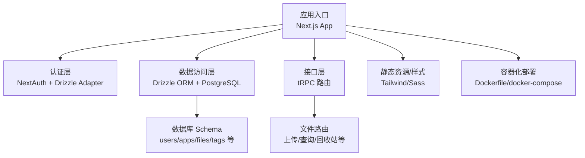
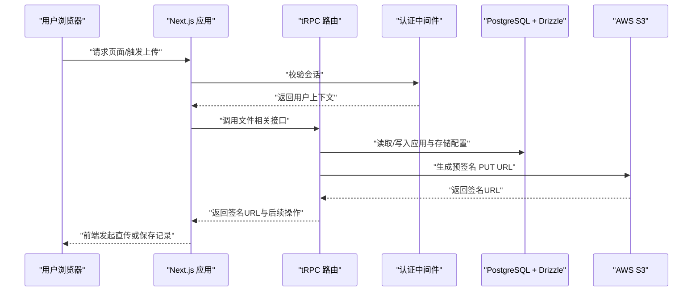
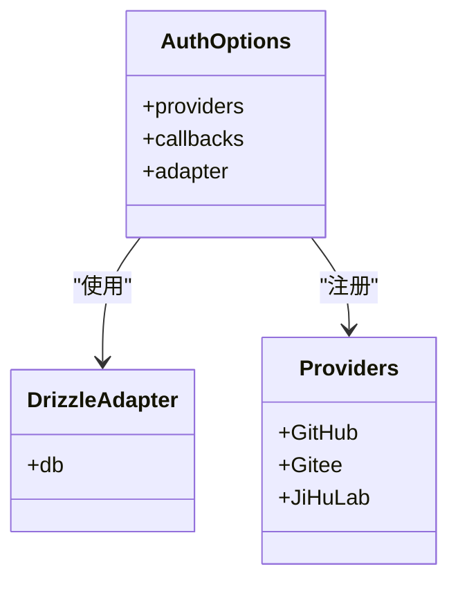
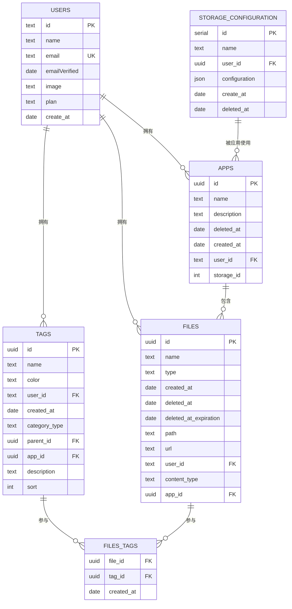
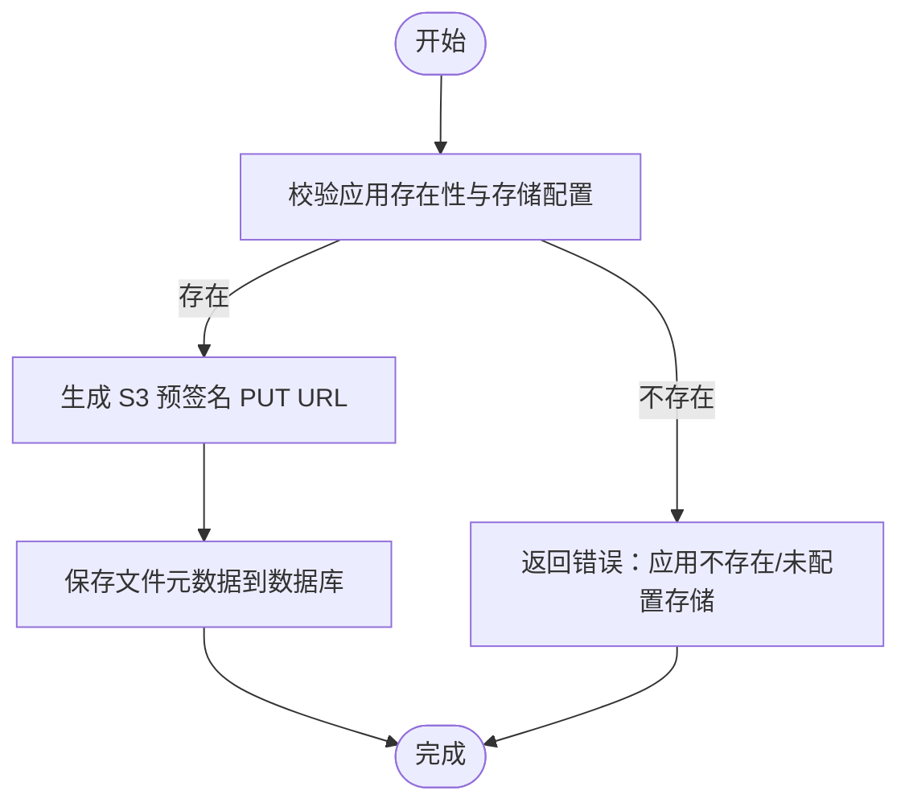
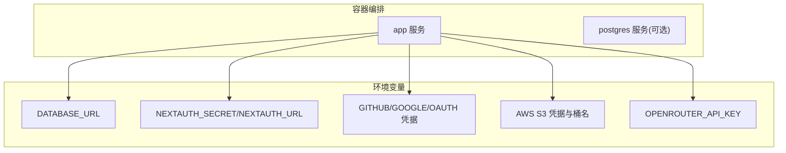

# 快速开始

<cite>
**本文引用的文件**
- [README.md](file://README.md)
- [package.json](file://package.json)
- [drizzle.config.ts](file://drizzle.config.ts)
- [docker-compose.yml](file://docker-compose.yml)
- [Dockerfile](file://Dockerfile)
- [src/lib/auth.ts](file://src/lib/auth.ts)
- [src/server/auth/index.ts](file://src/server/auth/index.ts)
- [src/server/db/schema.ts](file://src/server/db/schema.ts)
- [src/server/db/db.ts](file://src/server/db/db.ts)
- [src/server/routes/file.ts](file://src/server/routes/file.ts)
- [next.config.ts](file://next.config.ts)
- [start.sh](file://start.sh)
- [global.d.ts](file://global.d.ts)
</cite>

## 目录
1. [简介](#简介)
2. [项目结构](#项目结构)
3. [核心组件](#核心组件)
4. [架构总览](#架构总览)
5. [详细组件分析](#详细组件分析)
6. [依赖分析](#依赖分析)
7. [性能考虑](#性能考虑)
8. [故障排除指南](#故障排除指南)
9. [结论](#结论)
10. [附录](#附录)

## 简介
本指南面向希望快速上手 Image SaaS 项目的开发者，覆盖从环境准备、依赖安装、数据库初始化、AWS S3 存储配置与认证系统设置，到本地开发与容器化部署的完整流程。文档同时提供常见问题与排障建议，帮助不同技术背景的读者顺利启动项目。

## 项目结构
该项目基于 Next.js 16 应用，采用 TypeScript、Drizzle ORM、PostgreSQL、NextAuth 认证、AWS S3 存储以及 tRPC 接口层。项目通过 pnpm 工作区组织包，提供 Dockerfile 与 docker-compose.yml 支持容器化部署。

图表来源
- [next.config.ts:1-22](file://next.config.ts#L1-L22)
- [src/server/auth/index.ts:1-163](file://src/server/auth/index.ts#L1-L163)
- [src/server/db/schema.ts:1-270](file://src/server/db/schema.ts#L1-L270)
- [src/server/routes/file.ts:1-561](file://src/server/routes/file.ts#L1-L561)
- [Dockerfile:1-76](file://Dockerfile#L1-L76)
- [docker-compose.yml:1-72](file://docker-compose.yml#L1-L72)

章节来源
- [README.md:1-37](file://README.md#L1-L37)
- [package.json:1-94](file://package.json#L1-L94)
- [next.config.ts:1-22](file://next.config.ts#L1-L22)

## 核心组件
- 认证与会话：NextAuth 集成 GitHub/Gitee/JiHuLab，Drizzle Adapter 管理用户与会话表，支持 SKIP_LOGIN 模式。
- 数据库与 Schema：PostgreSQL + Drizzle ORM，定义用户、应用、存储配置、文件、标签及关联关系。
- 文件上传与存储：tRPC 路由提供预签名 URL 生成与文件记录保存；AWS S3 SDK 生成签名 URL；支持按标签与时间范围检索。
- 部署：Dockerfile 多阶段构建，docker-compose 提供环境变量注入与健康检查。

章节来源
- [src/lib/auth.ts:1-3](file://src/lib/auth.ts#L1-L3)
- [src/server/auth/index.ts:1-163](file://src/server/auth/index.ts#L1-L163)
- [src/server/db/schema.ts:1-270](file://src/server/db/schema.ts#L1-L270)
- [src/server/routes/file.ts:1-561](file://src/server/routes/file.ts#L1-L561)

## 架构总览
下图展示从浏览器到 tRPC、数据库与 S3 的调用链路，以及认证与存储配置的关键交互点。

图表来源
- [src/server/routes/file.ts:26-90](file://src/server/routes/file.ts#L26-L90)
- [src/server/auth/index.ts:111-138](file://src/server/auth/index.ts#L111-L138)
- [src/server/db/db.ts:1-9](file://src/server/db/db.ts#L1-L9)

## 详细组件分析

### 认证系统（NextAuth + Drizzle Adapter）
- 支持 GitHub、Gitee、JiHuLab 多 OAuth 提供商，适配用户资料映射。
- 使用 Drizzle Adapter 将 NextAuth 的用户/会话表映射到数据库。
- 支持 SKIP_LOGIN 模式，自动创建默认管理员用户并返回会话，便于本地快速体验。

图表来源
- [src/server/auth/index.ts:111-138](file://src/server/auth/index.ts#L111-L138)
- [src/server/auth/index.ts:141-160](file://src/server/auth/index.ts#L141-L160)

章节来源
- [src/lib/auth.ts:1-3](file://src/lib/auth.ts#L1-L3)
- [src/server/auth/index.ts:1-163](file://src/server/auth/index.ts#L1-L163)

### 数据库与 Schema（Drizzle ORM + PostgreSQL）
- 定义用户、应用、存储配置、文件、标签及其关系，支持软删除与索引优化。
- 存储配置以 JSON 类型保存 S3 参数，便于按应用维度灵活配置。

图表来源
- [src/server/db/schema.ts:18-270](file://src/server/db/schema.ts#L18-L270)

章节来源
- [src/server/db/schema.ts:1-270](file://src/server/db/schema.ts#L1-L270)
- [src/server/db/db.ts:1-9](file://src/server/db/db.ts#L1-L9)

### 文件上传与 tRPC 路由
- 预签名 URL：根据应用绑定的存储配置生成短期有效的 PUT URL，前端直传至 S3。
- 文件记录：保存文件元数据（名称、路径、URL、类型、所属应用与用户）。
- 分页与检索：支持游标分页、按标签与时间范围检索、排序与批量操作。
- 回收站与恢复：软删除与恢复，带过期时间管理。

图表来源
- [src/server/routes/file.ts:26-90](file://src/server/routes/file.ts#L26-L90)
- [src/server/routes/file.ts:91-118](file://src/server/routes/file.ts#L91-L118)

章节来源
- [src/server/routes/file.ts:1-561](file://src/server/routes/file.ts#L1-L561)

### 部署与容器化
- Dockerfile：多阶段构建，生产镜像最小化，暴露 3000 端口，使用非 root 用户运行。
- docker-compose：注入数据库、认证、S3、OpenRouter 等环境变量，提供健康检查与重启策略。
- next.config.ts：启用 standalone 输出模式，优化 Docker 镜像体积。

图表来源
- [docker-compose.yml:11-35](file://docker-compose.yml#L11-L35)
- [Dockerfile:46-75](file://Dockerfile#L46-L75)
- [next.config.ts:8-18](file://next.config.ts#L8-L18)

章节来源
- [Dockerfile:1-76](file://Dockerfile#L1-L76)
- [docker-compose.yml:1-72](file://docker-compose.yml#L1-L72)
- [next.config.ts:1-22](file://next.config.ts#L1-L22)

## 依赖分析
- 运行时依赖：Next.js、Next-Auth、Drizzle ORM、PostgreSQL 驱动、AWS SDK、tRPC、UI 组件库等。
- 开发依赖：ESLint、Prettier、TypeScript、Drizzle Kit、测试工具等。
- 数据库迁移：通过 drizzle-kit 与 drizzle.config.ts 管理迁移输出目录与模式。

章节来源
- [package.json:14-66](file://package.json#L14-L66)
- [package.json:67-92](file://package.json#L67-L92)
- [drizzle.config.ts:1-14](file://drizzle.config.ts#L1-L14)

## 性能考虑
- 图片优化：remotePatterns 允许加载任意 HTTPS 远程图片，结合 CDN 可提升加载速度。
- 分页与索引：文件表按 id+created_at 建立复合索引，支持游标分页与高效排序。
- 预签名直传：减少应用服务器带宽压力，提升上传吞吐。
- 镜像体积：standalone 输出与多阶段构建降低容器启动与运行成本。

章节来源
- [next.config.ts:11-18](file://next.config.ts#L11-L18)
- [src/server/db/schema.ts:135](file://src/server/db/schema.ts#L135)
- [src/server/routes/file.ts:82-84](file://src/server/routes/file.ts#L82-L84)

## 故障排除指南
- 无法连接数据库
  - 检查 DATABASE_URL 是否正确，确认数据库可达。
  - 若使用本地 Postgres，参考 docker-compose 中注释服务进行联调。
- NextAuth 登录失败
  - 确认 NEXTAUTH_SECRET、NEXTAUTH_URL 设置。
  - 检查 GitHub/Gitee/JiHuLab 的客户端 ID/Secret 是否正确。
  - 如需跳过登录，设置 SKIP_LOGIN=true 并确保管理员用户创建逻辑可用。
- S3 上传失败
  - 确认 AWS_REGION、AWS_ACCESS_KEY_ID、AWS_SECRET_ACCESS_KEY、AWS_S3_BUCKET 正确。
  - 检查存储桶策略与 IAM 权限，确保允许上传对象。
  - 预签名 URL 过期时间短，前端应在生成后尽快发起直传。
- tRPC 调用报错
  - 确保已登录并携带有效会话。
  - 检查应用 ID 与用户权限匹配，避免越权访问。
- Docker 启动异常
  - 查看健康检查日志，确认端口 3000 可用。
  - 使用 start.sh 或直接 npx next start 启动，排查环境变量加载问题。

章节来源
- [docker-compose.yml:11-35](file://docker-compose.yml#L11-L35)
- [src/server/auth/index.ts:141-160](file://src/server/auth/index.ts#L141-L160)
- [src/server/routes/file.ts:26-90](file://src/server/routes/file.ts#L26-L90)
- [start.sh:1-8](file://start.sh#L1-L8)

## 结论
通过本指南，您可以在本地快速搭建 Image SaaS 项目，完成数据库初始化、认证与存储配置，并成功运行应用。建议在生产环境中进一步完善安全策略（如强制 HTTPS、细粒度 IAM 权限、审计日志）与监控告警体系。

## 附录

### 环境要求
- Node.js 20（推荐使用 corepack/pnpm）
- PostgreSQL（可使用云服务或本地 docker-compose）
- AWS S3 存储桶与访问凭据
- Next.js 16 应用

章节来源
- [Dockerfile:2-5](file://Dockerfile#L2-L5)
- [docker-compose.yml:52-68](file://docker-compose.yml#L52-L68)

### 依赖安装与初始配置
- 安装依赖：使用 pnpm 安装工作区依赖。
- 数据库迁移：使用 drizzle-kit 生成迁移脚本并执行。
- 环境变量：复制示例环境文件，填写数据库、认证与 S3 相关变量。
- 初始化默认标签：运行脚本初始化默认标签集合。

章节来源
- [package.json:5-12](file://package.json#L5-L12)
- [drizzle.config.ts:1-14](file://drizzle.config.ts#L1-L14)
- [scripts/init-default-tags.ts](file://scripts/init-default-tags.ts)

### 本地开发环境搭建
- 启动开发服务器：运行 dev 脚本，默认监听 3000 端口。
- 访问应用：打开浏览器访问 http://localhost:3000。
- 编辑页面：修改 src/app 下的页面文件，热更新生效。

章节来源
- [README.md:5-17](file://README.md#L5-L17)

### 数据库初始化
- 生成迁移：使用 drizzle-kit 生成迁移文件。
- 执行迁移：在目标数据库执行迁移脚本。
- 验证 Schema：确认 users、apps、files、tags、storageConfiguration 等表创建成功。

章节来源
- [drizzle.config.ts:4-13](file://drizzle.config.ts#L4-L13)
- [src/server/db/schema.ts:18-270](file://src/server/db/schema.ts#L18-L270)

### AWS S3 配置
- 在应用设置中配置存储：填写桶名、区域、访问密钥等参数。
- 生成预签名 URL：调用 tRPC 接口获取短期 PUT URL。
- 前端直传：使用签名 URL 发起 PUT 请求上传对象。

章节来源
- [src/server/routes/file.ts:26-90](file://src/server/routes/file.ts#L26-L90)
- [src/server/db/schema.ts:164-173](file://src/server/db/schema.ts#L164-L173)

### 认证系统设置
- 注册 OAuth 提供商：在 NextAuth 中配置 GitHub/Gitee/JiHuLab 的客户端 ID/Secret。
- 会话回调：扩展 session 与 signIn 回调，实现自定义逻辑。
- SKIP_LOGIN：本地开发时可启用快速登录模式。

章节来源
- [src/server/auth/index.ts:111-138](file://src/server/auth/index.ts#L111-L138)
- [src/server/auth/index.ts:65-101](file://src/server/auth/index.ts#L65-L101)

### 项目启动流程（从零到运行）
- 克隆仓库并安装依赖。
- 配置数据库与环境变量。
- 执行数据库迁移。
- 启动开发服务器或构建并运行容器。
- 登录应用并创建应用与存储配置。
- 上传图片并验证直传与记录保存。

章节来源
- [README.md:5-17](file://README.md#L5-L17)
- [docker-compose.yml:11-35](file://docker-compose.yml#L11-L35)
- [Dockerfile:46-75](file://Dockerfile#L46-L75)