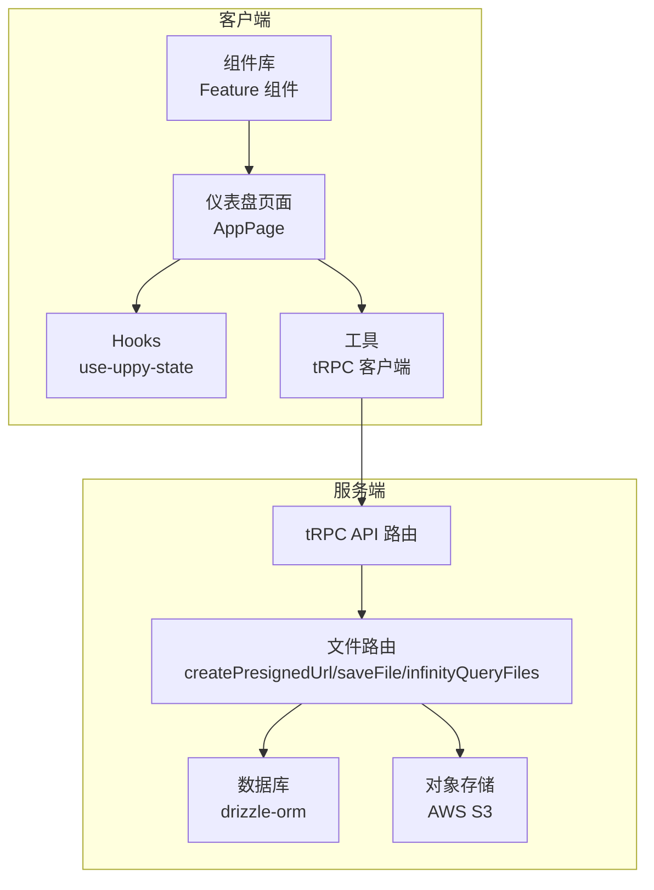
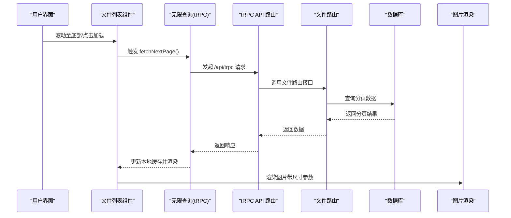
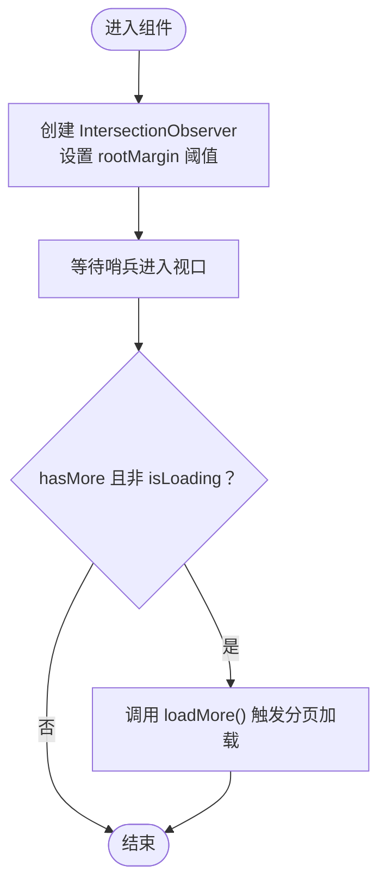
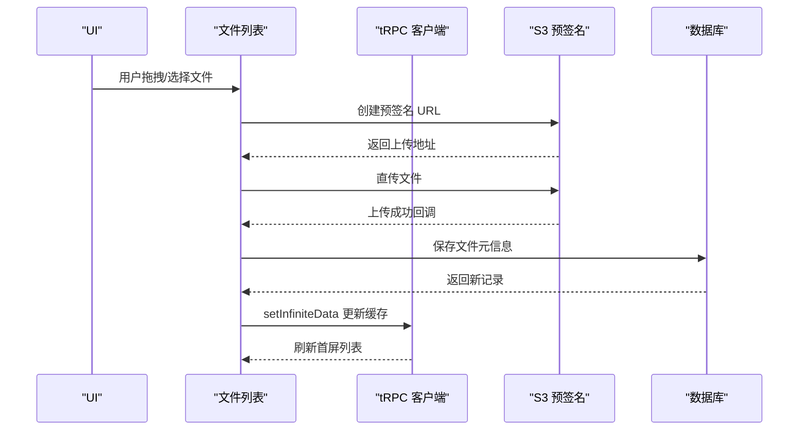
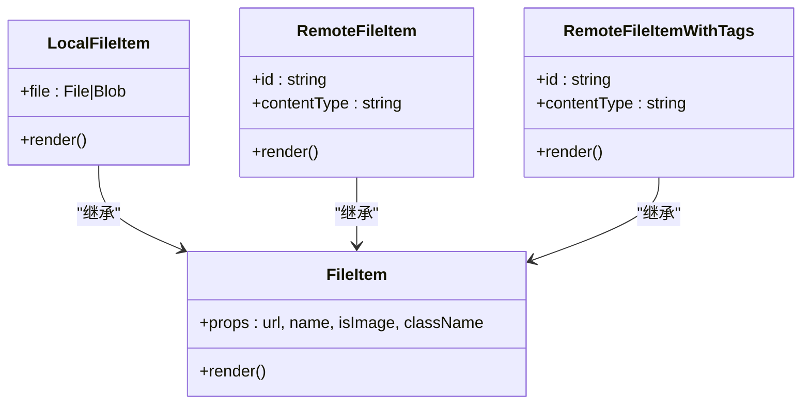
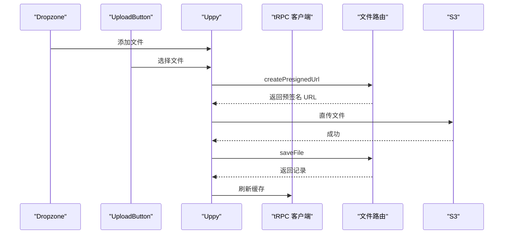
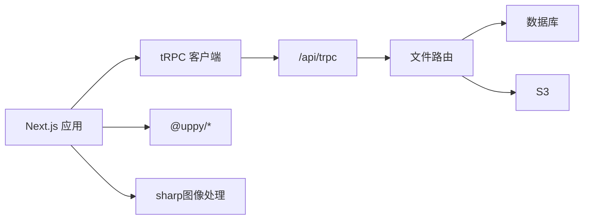

# 性能优化

<cite>
**本文引用的文件**
- [infinite-scroll.tsx](file://src/components/feature/infinite-scroll.tsx)
- [FileList.tsx](file://src/components/feature/FileList.tsx)
- [file-item.tsx](file://src/components/feature/file-item.tsx)
- [page.tsx（仪表盘）](file://src/app/dashboard/apps/[appId]/page.tsx)
- [use-uppy-state.ts](file://src/hooks/use-uppy-state.ts)
- [api.ts](file://src/utils/api.ts)
- [route.ts（trpc）](file://src/app/api/trpc/[...trpc]/route.ts)
- [file.ts（文件路由）](file://src/server/routes/file.ts)
- [next.config.ts](file://next.config.ts)
- [dropzone.tsx](file://src/components/feature/dropzone.tsx)
- [upload-button.tsx](file://src/components/feature/upload-button.tsx)
- [upload-preview.tsx](file://src/components/feature/upload-preview.tsx)
- [package.json](file://package.json)
</cite>

## 目录

1. [简介](#简介)
2. [项目结构](#项目结构)
3. [核心组件](#核心组件)
4. [架构总览](#架构总览)
5. [详细组件分析](#详细组件分析)
6. [依赖关系分析](#依赖关系分析)
7. [性能考量](#性能考量)
8. [故障排查指南](#故障排查指南)
9. [结论](#结论)
10. [附录](#附录)

## 简介

本文件面向 Image SaaS 项目的性能优化，聚焦以下主题：

- 无限滚动实现与数据加载优化
- 缓存策略与图片处理优化
- 前端性能监控与用户体验提升
- 文件上传性能优化、内存管理与垃圾回收
- 代码分割、懒加载与预加载
- 性能基准测试、瓶颈分析与解决方案
- CDN 配置、静态资源与网络传输优化
- 移动端性能、电池续航与带宽限制处理
- 开发者性能调优指南与监控工具使用

## 项目结构

该项目采用 Next.js 应用，前端通过 tRPC 与服务端交互，文件上传基于 Uppy 并经由 AWS S3 预签名 URL 完成直传。核心性能相关模块分布如下：

- 前端 UI 与功能：src/components/feature、src/app/dashboard/apps/[appId]、src/hooks、src/utils
- tRPC 路由与服务端逻辑：src/app/api/trpc、src/server/routes
- 构建与图片优化：next.config.ts
- 依赖与运行时：package.json

图表来源

- [page.tsx（仪表盘）:23-265](file://src/app/dashboard/apps/[appId]/page.tsx#L23-L265)
- [api.ts:1-17](file://src/utils/api.ts#L1-L17)
- [route.ts（trpc）:1-14](file://src/app/api/trpc/[...trpc]/route.ts#L1-L14)
- [file.ts（文件路由）:26-561](file://src/server/routes/file.ts#L26-L561)

章节来源

- [next.config.ts:1-22](file://next.config.ts#L1-L22)
- [package.json:1-94](file://package.json#L1-L94)

## 核心组件

- 无限滚动组件：基于 IntersectionObserver 的哨兵节点触发加载，支持阈值控制与加载状态反馈。
- 文件列表组件：集成 tRPC 无限查询、分组展示、滚动触底加载、上传完成后的本地缓存更新。
- 文件项组件：统一渲染本地/远程图片，支持预览增强与尺寸参数注入。
- 上传链路：Uppy + AWS S3 预签名 URL，批量上传与进度管理。
- tRPC 客户端：批量链接、服务端适配器与查询缓存策略。

章节来源

- [infinite-scroll.tsx:1-55](file://src/components/feature/infinite-scroll.tsx#L1-L55)
- [FileList.tsx:1-366](file://src/components/feature/FileList.tsx#L1-L366)
- [file-item.tsx:1-138](file://src/components/feature/file-item.tsx#L1-L138)
- [use-uppy-state.ts:1-17](file://src/hooks/use-uppy-state.ts#L1-L17)
- [api.ts:1-17](file://src/utils/api.ts#L1-L17)

## 架构总览

下图展示了从前端到后端的关键调用路径与数据流，包括无限滚动触发、tRPC 查询、S3 预签名 URL 获取与图片渲染。

图表来源

- [FileList.tsx:40-49](file://src/components/feature/FileList.tsx#L40-L49)
- [route.ts（trpc）:1-14](file://src/app/api/trpc/[...trpc]/route.ts#L1-L14)
- [file.ts（文件路由）:135-234](file://src/server/routes/file.ts#L135-L234)
- [file-item.tsx:30-60](file://src/components/feature/file-item.tsx#L30-L60)

## 详细组件分析

### 无限滚动实现

- 哨兵节点：在内容末尾放置一个不可见元素，通过 IntersectionObserver 在进入视口前触发加载。
- 加载控制：hasMore 与 isLoading 双重保护，避免重复请求与竞态。
- 阈值控制：rootMargin 的阈值可调，提前触发加载，减少空白等待。

图表来源

- [infinite-scroll.tsx:16-37](file://src/components/feature/infinite-scroll.tsx#L16-L37)

章节来源

- [infinite-scroll.tsx:1-55](file://src/components/feature/infinite-scroll.tsx#L1-L55)

### 文件列表与数据加载优化

- 无限查询：使用 tRPC 的 useInfiniteQuery，结合 getNextPageParam 实现游标分页。
- 分组展示：按日期对文件进行分组，减少单次渲染的数据量。
- 触底加载：同时支持滚动区域触底与按钮点击两种触发方式。
- 本地缓存更新：上传成功后通过 setInfiniteData 原子性更新首屏数据，避免全量刷新。

图表来源

- [page.tsx（仪表盘）:56-72](file://src/app/dashboard/apps/[appId]/page.tsx#L56-L72)
- [FileList.tsx:163-202](file://src/components/feature/FileList.tsx#L163-L202)
- [file.ts（文件路由）:27-90](file://src/server/routes/file.ts#L27-L90)

章节来源

- [FileList.tsx:1-366](file://src/components/feature/FileList.tsx#L1-L366)
- [page.tsx（仪表盘）:1-266](file://src/app/dashboard/apps/[appId]/page.tsx#L1-L266)

### 图片渲染与处理优化

- 统一渲染：通过 FileItem 抽象本地与远程图片，保持一致的尺寸与样式。
- 尺寸参数：在图片 URL 上附加尺寸参数，便于服务端/CDN 进行自适应缩放与裁剪。
- 预览增强：ImageReview 支持弹窗预览，按需加载大图，降低初始渲染压力。

图表来源

- [file-item.tsx:10-138](file://src/components/feature/file-item.tsx#L10-L138)

章节来源

- [file-item.tsx:1-138](file://src/components/feature/file-item.tsx#L1-L138)

### 上传链路与内存管理

- Uppy 状态订阅：通过 useUppyState 订阅 Uppy store，避免手动事件监听泄漏。
- 预签名直传：服务端生成短期有效 URL，客户端直接上传，降低网关压力。
- 上传完成处理：保存元信息并刷新标签与列表缓存；及时清理本地临时 URL。
- 上传预览：UploadPreview 提供多文件浏览与批量上传入口，支持逐个删除与清空。

图表来源

- [dropzone.tsx:1-52](file://src/components/feature/dropzone.tsx#L1-L52)
- [upload-button.tsx:1-46](file://src/components/feature/upload-button.tsx#L1-L46)
- [upload-preview.tsx:1-119](file://src/components/feature/upload-preview.tsx#L1-L119)
- [use-uppy-state.ts:1-17](file://src/hooks/use-uppy-state.ts#L1-L17)
- [file.ts（文件路由）:27-90](file://src/server/routes/file.ts#L27-L90)

章节来源

- [dropzone.tsx:1-52](file://src/components/feature/dropzone.tsx#L1-L52)
- [upload-button.tsx:1-46](file://src/components/feature/upload-button.tsx#L1-L46)
- [upload-preview.tsx:1-119](file://src/components/feature/upload-preview.tsx#L1-L119)
- [use-uppy-state.ts:1-17](file://src/hooks/use-uppy-state.ts#L1-L17)

## 依赖关系分析

- 前端依赖：Next.js、tRPC、@tanstack/react-query、@uppy/\*、rc-image、sharp 等。
- 构建配置：启用 standalone 输出、图片优化与远程图片白名单。
- tRPC 链接：httpBatchLink 批量请求，减少往返次数。

图表来源

- [package.json:14-66](file://package.json#L14-L66)
- [next.config.ts:3-19](file://next.config.ts#L3-L19)
- [api.ts:1-17](file://src/utils/api.ts#L1-L17)
- [route.ts（trpc）:1-14](file://src/app/api/trpc/[...trpc]/route.ts#L1-L14)
- [file.ts（文件路由）:26-561](file://src/server/routes/file.ts#L26-L561)

章节来源

- [package.json:1-94](file://package.json#L1-L94)
- [next.config.ts:1-22](file://next.config.ts#L1-L22)
- [api.ts:1-17](file://src/utils/api.ts#L1-L17)

## 性能考量

### 数据加载优化

- 无限分页：使用游标分页与缓存键组合，避免重复请求与数据错乱。
- 查询去抖：refetchOnWindowFocus/Reconnect/Mount 关闭，减少不必要刷新。
- 本地缓存优先：上传成功后立即更新首屏缓存，保证一致性与即时反馈。

章节来源

- [FileList.tsx:40-49](file://src/components/feature/FileList.tsx#L40-L49)
- [page.tsx（仪表盘）:26-33](file://src/app/dashboard/apps/[appId]/page.tsx#L26-L33)

### 图片处理与缓存

- 图片尺寸参数：在 URL 注入尺寸参数，便于 CDN 缓存不同尺寸版本。
- 远程图片白名单：next.config.ts 配置 remotePatterns，确保图片可被优化。
- 图像处理：sharp 作为依赖存在，可在服务端按需生成缩略图与格式转换。

章节来源

- [file-item.tsx:47-49](file://src/components/feature/file-item.tsx#L47-L49)
- [next.config.ts:10-18](file://next.config.ts#L10-L18)
- [package.json:59-59](file://package.json#L59-L59)

### 上传性能优化

- 预签名直传：缩短上传路径，降低服务端 CPU 与内存占用。
- 批量上传：Uppy 支持多文件并发，结合服务端批量入库。
- 上传预览：本地临时 URL 仅用于预览，上传完成后释放内存。

章节来源

- [page.tsx（仪表盘）:56-72](file://src/app/dashboard/apps/[appId]/page.tsx#L56-L72)
- [upload-preview.tsx:27-33](file://src/components/feature/upload-preview.tsx#L27-L33)

### 内存管理与垃圾回收

- 本地预览 URL：使用 URL.createObjectURL 生成临时地址，渲染完成后应尽快释放。
- Uppy 订阅：通过 useUppyState 自动订阅 store，避免手动解绑导致的内存泄漏。
- 上传完成清理：清空上传队列与索引，防止残留引用。

章节来源

- [file-item.tsx:77-84](file://src/components/feature/file-item.tsx#L77-L84)
- [use-uppy-state.ts:1-17](file://src/hooks/use-uppy-state.ts#L1-L17)
- [upload-preview.tsx:27-33](file://src/components/feature/upload-preview.tsx#L27-L33)

### 代码分割、懒加载与预加载

- 页面级懒加载：Next.js 默认按路由拆分，仪表盘页面按需加载。
- 组件懒加载：图片预览等重型组件可进一步按需引入，减少首屏体积。
- 预加载策略：对即将可见的图片使用 loading="lazy"，对首屏关键图片使用预加载。

章节来源

- [page.tsx（仪表盘）:1-266](file://src/app/dashboard/apps/[appId]/page.tsx#L1-L266)

### 性能基准测试与瓶颈分析

- 基准指标：首屏时间、首次内容绘制、交互就绪时间、无限滚动加载延迟、上传吞吐量。
- 工具建议：Lighthouse、WebPageTest、Browser DevTools Performance、tRPC Profiling。
- 瓶颈定位：网络层（预签名 URL 生成与 S3 上传）、数据库层（分页查询与索引）、渲染层（图片尺寸与数量）。

章节来源

- [file.ts（文件路由）:135-234](file://src/server/routes/file.ts#L135-L234)

### CDN 配置与网络传输优化

- 远程图片白名单：允许 Next.js 对来自任意主机的图片进行优化。
- 缓存策略：为不同尺寸的图片设置独立缓存头，利用 ETag/Last-Modified。
- 传输优化：开启 Gzip/Brotli 压缩，合理设置 TTL，避免不必要的重传。

章节来源

- [next.config.ts:10-18](file://next.config.ts#L10-L18)

### 移动端性能与带宽限制

- 图片尺寸参数：根据设备像素比与屏幕宽度动态选择合适尺寸。
- 上传策略：在弱网环境下降低并发数，启用断点续传（如需）。
- 电池与流量：减少后台渲染任务，合并网络请求，提供“省流量”模式。

章节来源

- [file-item.tsx:47-49](file://src/components/feature/file-item.tsx#L47-L49)

## 故障排查指南

- 无限滚动不触发：检查哨兵元素是否正确挂载、IntersectionObserver 配置与阈值。
- 上传失败：确认预签名 URL 是否过期、S3 凭证是否正确、网络连通性。
- 图片不显示：核对 remotePatterns 配置、URL 参数是否正确、CDN 缓存状态。
- 内存泄漏：检查本地临时 URL 释放、Uppy 事件解绑、组件卸载清理。

章节来源

- [infinite-scroll.tsx:16-37](file://src/components/feature/infinite-scroll.tsx#L16-L37)
- [file.ts（文件路由）:27-90](file://src/server/routes/file.ts#L27-L90)
- [file-item.tsx:77-84](file://src/components/feature/file-item.tsx#L77-L84)

## 结论

通过合理的无限滚动、tRPC 缓存、S3 预签名直传与图片尺寸参数化渲染，Image SaaS 在大数据量场景下仍能保持流畅体验。建议持续关注网络与数据库瓶颈，配合 CDN 与构建优化，进一步提升移动端与弱网环境下的性能表现。

## 附录

- 开发者调优清单
  - 启用 httpBatchLink，减少请求次数
  - 为图片 URL 注入尺寸参数，结合 CDN 缓存
  - 使用 useInfiniteQuery 的游标分页，关闭不必要的 refetch
  - 上传完成后及时清理本地临时 URL
  - 在弱网与移动端启用更保守的并发与缓存策略
