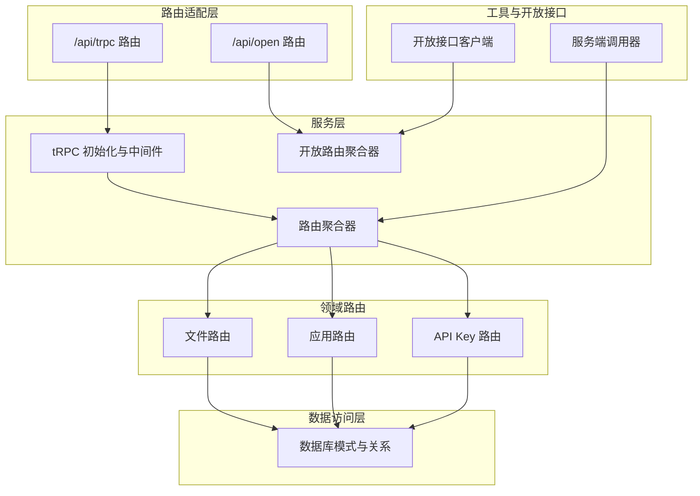
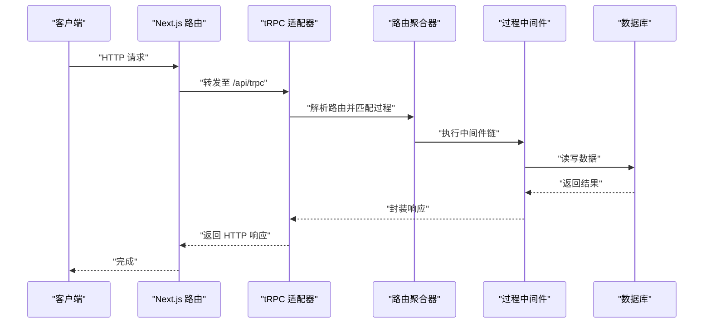
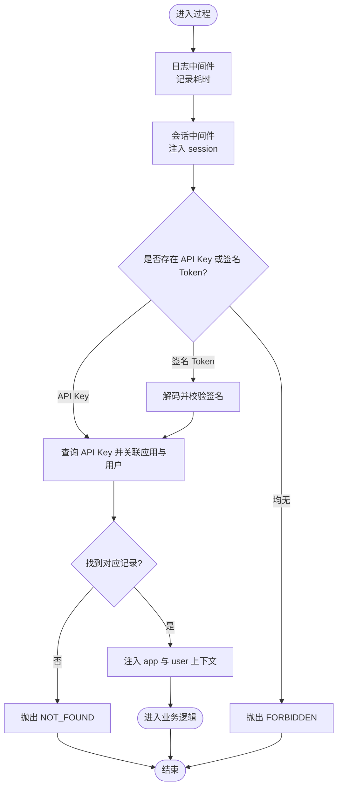
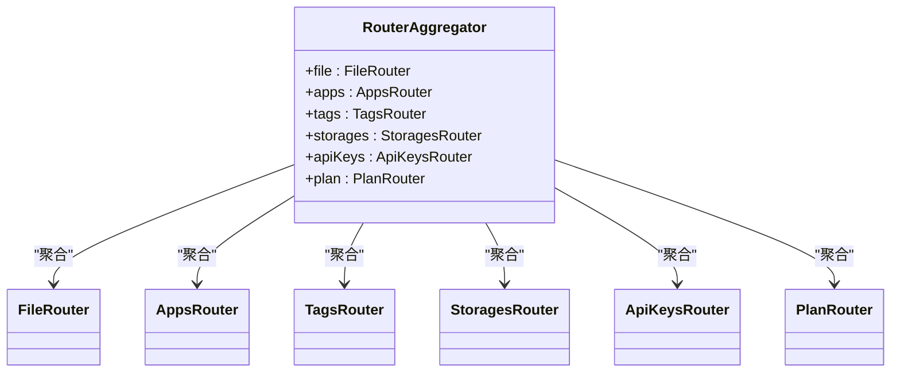
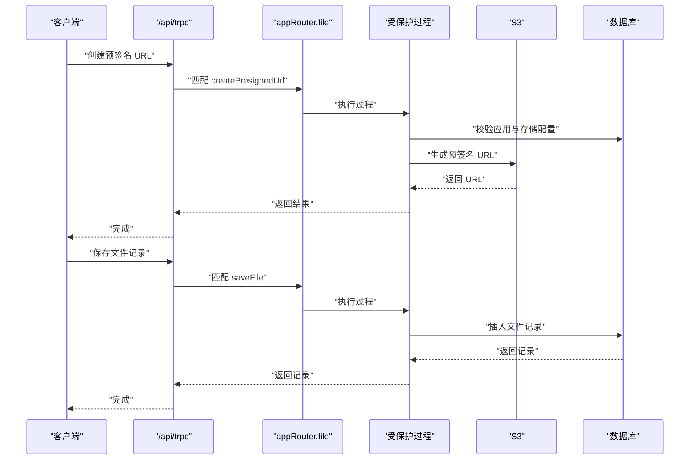
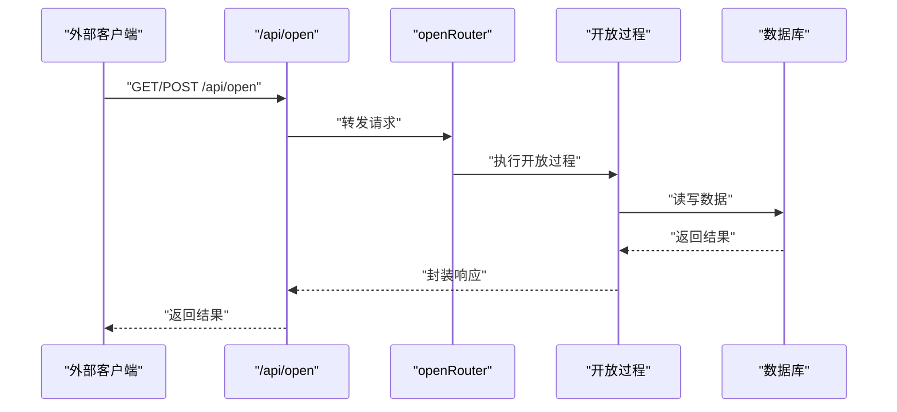
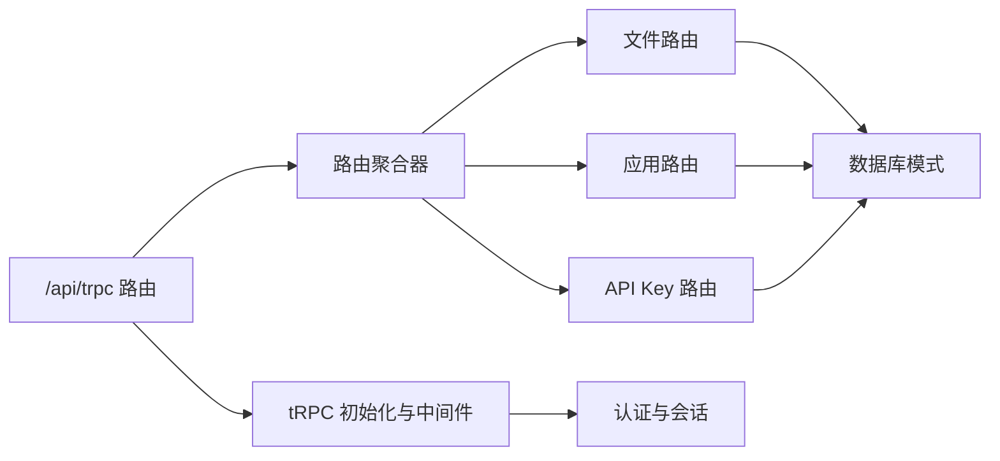

# API 扩展

<cite>
**本文引用的文件**
- [src/app/api/trpc/[...trpc]/route.ts](file://src/app/api/trpc/[...trpc]/route.ts)
- [src/app/api/open/[...trpc]/route.ts](file://src/app/api/open/[...trpc]/route.ts)
- [src/server/trpc-middlewares/router.ts](file://src/server/trpc-middlewares/router.ts)
- [src/server/trpc-middlewares/trpc.ts](file://src/server/trpc-middlewares/trpc.ts)
- [src/server/open-router.ts](file://src/server/open-router.ts)
- [src/server/routes/file.ts](file://src/server/routes/file.ts)
- [src/server/routes/app.ts](file://src/server/routes/app.ts)
- [src/server/routes/api-keys.ts](file://src/server/routes/api-keys.ts)
- [src/server/auth/index.ts](file://src/server/auth/index.ts)
- [src/utils/trpc.ts](file://src/utils/trpc.ts)
- [src/utils/open-api.ts](file://src/utils/open-api.ts)
- [src/utils/open-router-dts.ts](file://src/utils/open-router-dts.ts)
- [src/server/db/schema.ts](file://src/server/db/schema.ts)
- [package.json](file://package.json)
</cite>

## 目录
1. [简介](#简介)
2. [项目结构](#项目结构)
3. [核心组件](#核心组件)
4. [架构总览](#架构总览)
5. [详细组件分析](#详细组件分析)
6. [依赖关系分析](#依赖关系分析)
7. [性能考虑](#性能考虑)
8. [故障排查指南](#故障排查指南)
9. [结论](#结论)
10. [附录](#附录)

## 简介
本文件面向 Image SaaS 项目的 API 扩展开发者，系统性说明如何在现有 tRPC 路由体系上进行扩展：包括新增路由、中间件配置与类型安全、API 版本管理与兼容策略、自定义中间件（认证、授权、错误处理）、OpenAPI 规范扩展、GraphQL 查询扩展思路、实时 API 实现建议、性能监控与限流、缓存机制、文档生成、测试自动化与客户端 SDK 开发等。文档同时提供端到端的开发流程与集成示例，帮助快速、安全地扩展系统能力。

## 项目结构
项目采用按职责分层的组织方式：
- 路由适配层：Next.js App Router 下的 API 路由，负责将请求交由 tRPC 处理。
- 服务层：tRPC 初始化、中间件与路由聚合，统一暴露受保护过程与公开过程。
- 领域路由：按业务模块拆分（如文件、应用、API Key），每个模块内含查询/变更操作。
- 数据访问层：Drizzle ORM 定义表结构与关系，提供类型安全的数据读写。
- 工具与开放接口：内部调用器与开放接口客户端，便于服务端直连与外部集成。

图表来源
- [src/app/api/trpc/[...trpc]/route.ts](file://src/app/api/trpc/[...trpc]/route.ts#L1-L14)
- [src/app/api/open/[...trpc]/route.ts](file://src/app/api/open/[...trpc]/route.ts#L1-L31)
- [src/server/trpc-middlewares/trpc.ts:1-130](file://src/server/trpc-middlewares/trpc.ts#L1-L130)
- [src/server/trpc-middlewares/router.ts:1-20](file://src/server/trpc-middlewares/router.ts#L1-L20)
- [src/server/open-router.ts:1-10](file://src/server/open-router.ts#L1-L10)
- [src/server/routes/file.ts:1-561](file://src/server/routes/file.ts#L1-L561)
- [src/server/routes/app.ts:1-88](file://src/server/routes/app.ts#L1-L88)
- [src/server/routes/api-keys.ts:1-38](file://src/server/routes/api-keys.ts#L1-L38)
- [src/server/db/schema.ts:1-270](file://src/server/db/schema.ts#L1-L270)
- [src/utils/trpc.ts:1-7](file://src/utils/trpc.ts#L1-L7)
- [src/utils/open-api.ts:1-14](file://src/utils/open-api.ts#L1-L14)

章节来源
- [src/app/api/trpc/[...trpc]/route.ts:1-14](file://src/app/api/trpc/[...trpc]/route.ts#L1-L14)
- [src/app/api/open/[...trpc]/route.ts:1-31](file://src/app/api/open/[...trpc]/route.ts#L1-L31)
- [src/server/trpc-middlewares/router.ts:1-20](file://src/server/trpc-middlewares/router.ts#L1-L20)
- [src/server/trpc-middlewares/trpc.ts:1-130](file://src/server/trpc-middlewares/trpc.ts#L1-L130)
- [src/server/open-router.ts:1-10](file://src/server/open-router.ts#L1-L10)
- [src/server/routes/file.ts:1-561](file://src/server/routes/file.ts#L1-L561)
- [src/server/routes/app.ts:1-88](file://src/server/routes/app.ts#L1-L88)
- [src/server/routes/api-keys.ts:1-38](file://src/server/routes/api-keys.ts#L1-L38)
- [src/server/db/schema.ts:1-270](file://src/server/db/schema.ts#L1-L270)
- [src/utils/trpc.ts:1-7](file://src/utils/trpc.ts#L1-L7)
- [src/utils/open-api.ts:1-14](file://src/utils/open-api.ts#L1-L14)

## 核心组件
- tRPC 初始化与中间件
  - 提供受保护过程与公开过程，内置日志中间件与会话中间件，以及基于 API Key 或签名 Token 的应用级上下文注入。
  - 关键路径：[src/server/trpc-middlewares/trpc.ts:1-130](file://src/server/trpc-middlewares/trpc.ts#L1-L130)
- 路由聚合器
  - 将各领域路由组合为应用路由，并导出类型，确保客户端与服务端共享类型安全。
  - 关键路径：[src/server/trpc-middlewares/router.ts:1-20](file://src/server/trpc-middlewares/router.ts#L1-L20)
- 认证与会话
  - 基于 NextAuth 的多提供商认证，支持 SKIP_LOGIN 模式下的管理员模拟登录。
  - 关键路径：[src/server/auth/index.ts:1-163](file://src/server/auth/index.ts#L1-L163)
- 领域路由
  - 文件路由：上传预签名 URL、保存记录、分页查询、软删除/恢复、永久删除等。
  - 应用路由：创建应用、列出应用、切换存储。
  - API Key 路由：列出、创建密钥。
  - 关键路径：
    - [src/server/routes/file.ts:1-561](file://src/server/routes/file.ts#L1-L561)
    - [src/server/routes/app.ts:1-88](file://src/server/routes/app.ts#L1-L88)
    - [src/server/routes/api-keys.ts:1-38](file://src/server/routes/api-keys.ts#L1-L38)
- 数据模型
  - 包含用户、应用、文件、标签、存储配置、API Key 等表及关系，支撑权限与业务逻辑。
  - 关键路径：[src/server/db/schema.ts:1-270](file://src/server/db/schema.ts#L1-L270)
- API 适配层
  - /api/trpc：内部受保护 API。
  - /api/open：开放 API，支持跨域与 API Key。
  - 关键路径：
    - [src/app/api/trpc/[...trpc]/route.ts](file://src/app/api/trpc/[...trpc]/route.ts#L1-L14)
    - [src/app/api/open/[...trpc]/route.ts](file://src/app/api/open/[...trpc]/route.ts#L1-L31)
- 工具与开放接口
  - 服务端调用器：用于服务端直连内部路由。
  - 开放接口客户端：用于外部集成。
  - 关键路径：
    - [src/utils/trpc.ts:1-7](file://src/utils/trpc.ts#L1-L7)
    - [src/utils/open-api.ts:1-14](file://src/utils/open-api.ts#L1-L14)
    - [src/utils/open-router-dts.ts:1-2](file://src/utils/open-router-dts.ts#L1-L2)

章节来源
- [src/server/trpc-middlewares/trpc.ts:1-130](file://src/server/trpc-middlewares/trpc.ts#L1-L130)
- [src/server/trpc-middlewares/router.ts:1-20](file://src/server/trpc-middlewares/router.ts#L1-L20)
- [src/server/auth/index.ts:1-163](file://src/server/auth/index.ts#L1-L163)
- [src/server/routes/file.ts:1-561](file://src/server/routes/file.ts#L1-L561)
- [src/server/routes/app.ts:1-88](file://src/server/routes/app.ts#L1-L88)
- [src/server/routes/api-keys.ts:1-38](file://src/server/routes/api-keys.ts#L1-L38)
- [src/server/db/schema.ts:1-270](file://src/server/db/schema.ts#L1-L270)
- [src/app/api/trpc/[...trpc]/route.ts:1-14](file://src/app/api/trpc/[...trpc]/route.ts#L1-L14)
- [src/app/api/open/[...trpc]/route.ts:1-31](file://src/app/api/open/[...trpc]/route.ts#L1-L31)
- [src/utils/trpc.ts:1-7](file://src/utils/trpc.ts#L1-L7)
- [src/utils/open-api.ts:1-14](file://src/utils/open-api.ts#L1-L14)
- [src/utils/open-router-dts.ts:1-2](file://src/utils/open-router-dts.ts#L1-L2)

## 架构总览
下图展示从客户端到 tRPC 过程、再到数据库的完整链路，以及开放接口与内部接口的差异点。

图表来源
- [src/app/api/trpc/[...trpc]/route.ts](file://src/app/api/trpc/[...trpc]/route.ts#L1-L14)
- [src/server/trpc-middlewares/router.ts:1-20](file://src/server/trpc-middlewares/router.ts#L1-L20)
- [src/server/trpc-middlewares/trpc.ts:1-130](file://src/server/trpc-middlewares/trpc.ts#L1-L130)
- [src/server/db/schema.ts:1-270](file://src/server/db/schema.ts#L1-L270)

## 详细组件分析

### 组件一：tRPC 初始化与中间件
- 设计要点
  - 使用 initTRPC 创建统一过程工厂，提供受保护过程与公开过程。
  - 中间件链：日志中间件 -> 会话中间件 -> 应用级鉴权中间件（API Key 或签名 Token）。
  - 应用级鉴权：优先从请求头读取 API Key；若无则尝试签名 Token 并校验签名，最终注入 app 与 user 上下文。
- 类型安全
  - 通过导出 AppRouter 类型，确保客户端与服务端共享类型定义，避免运行时错误。
- 错误处理
  - 明确抛出 TRPCError，配合状态码与消息，便于前端统一处理。

图表来源
- [src/server/trpc-middlewares/trpc.ts:11-127](file://src/server/trpc-middlewares/trpc.ts#L11-L127)

章节来源
- [src/server/trpc-middlewares/trpc.ts:1-130](file://src/server/trpc-middlewares/trpc.ts#L1-L130)

### 组件二：路由聚合器
- 设计要点
  - 将文件、应用、标签、存储、API Key、计划等子路由聚合为 appRouter，并导出类型。
  - 保持模块化，便于新增路由时仅需在聚合器中注册。
- 类型安全
  - 导出 AppRouter 类型，供客户端与服务端共享。

图表来源
- [src/server/trpc-middlewares/router.ts:1-20](file://src/server/trpc-middlewares/router.ts#L1-L20)

章节来源
- [src/server/trpc-middlewares/router.ts:1-20](file://src/server/trpc-middlewares/router.ts#L1-L20)

### 组件三：文件路由（文件上传、查询、删除）
- 功能概览
  - 上传：生成预签名 URL，支持指定文件名、类型、大小与应用 ID。
  - 保存：将已上传文件信息持久化到数据库。
  - 列表：按应用与用户过滤，支持分页与排序。
  - 删除/恢复：软删除与恢复，带过期时间。
  - 永久删除：清理数据库记录（可选扩展 S3 删除）。
- 类型安全
  - 输入参数使用 Zod 校验，输出类型由返回值推断，确保前后端一致。
- 权限控制
  - 通过受保护过程与会话上下文，确保仅当前用户可见与操作其资源。

图表来源
- [src/server/routes/file.ts:26-118](file://src/server/routes/file.ts#L26-L118)
- [src/app/api/trpc/[...trpc]/route.ts](file://src/app/api/trpc/[...trpc]/route.ts#L1-L14)

章节来源
- [src/server/routes/file.ts:1-561](file://src/server/routes/file.ts#L1-L561)

### 组件四：应用路由（创建、列表、切换存储）
- 功能概览
  - 创建应用：生成唯一 ID，绑定当前用户。
  - 列出应用：按用户过滤，排除软删除。
  - 切换存储：校验存储归属，更新应用存储配置。
- 类型安全
  - 输入使用 Zod 校验，输出类型由 Drizzle 返回推断。

章节来源
- [src/server/routes/app.ts:1-88](file://src/server/routes/app.ts#L1-L88)

### 组件五：API Key 路由（列出、创建）
- 功能概览
  - 列出：按应用过滤，排除软删除。
  - 创建：生成随机 key 与 client ID，绑定应用。
- 类型安全
  - 输入参数严格校验，输出类型由 Drizzle 返回推断。

章节来源
- [src/server/routes/api-keys.ts:1-38](file://src/server/routes/api-keys.ts#L1-L38)

### 组件六：开放接口（/api/open）
- 设计要点
  - 对外开放，支持跨域与 API Key 鉴权。
  - 通过 openRouter 聚合开放能力（当前包含文件相关开放接口）。
- CORS 与鉴权
  - 在响应头设置允许来源、方法与头部；鉴权由过程中间件完成。

图表来源
- [src/app/api/open/[...trpc]/route.ts](file://src/app/api/open/[...trpc]/route.ts#L1-L31)
- [src/server/open-router.ts:1-10](file://src/server/open-router.ts#L1-L10)

章节来源
- [src/app/api/open/[...trpc]/route.ts:1-31](file://src/app/api/open/[...trpc]/route.ts#L1-L31)
- [src/server/open-router.ts:1-10](file://src/server/open-router.ts#L1-L10)

### 组件七：认证与会话（NextAuth）
- 设计要点
  - 支持 GitHub、Gitee、JiHuLab 多提供商。
  - SKIP_LOGIN 模式下自动创建管理员用户并返回会话，便于本地联调。
  - 会话回调注入用户 ID，供过程中间件使用。
- 类型安全
  - 通过模块扩展，确保 Session 类型包含用户 ID 字段。

章节来源
- [src/server/auth/index.ts:1-163](file://src/server/auth/index.ts#L1-L163)

### 组件八：服务端调用器与开放接口客户端
- 服务端调用器
  - 通过 createCallerFactory 生成服务端直连内部路由的客户端，适合后台任务或服务间调用。
- 开放接口客户端
  - 通过 httpBatchLink 调用开放路由，便于外部集成。

章节来源
- [src/utils/trpc.ts:1-7](file://src/utils/trpc.ts#L1-L7)
- [src/utils/open-api.ts:1-14](file://src/utils/open-api.ts#L1-L14)

## 依赖关系分析
- 组件耦合
  - 路由适配层仅负责请求转发，不包含业务逻辑，耦合度低。
  - 路由聚合器集中管理子路由，新增模块只需在聚合器注册即可。
  - 过程中间件链统一处理认证、授权与日志，提升复用性。
- 外部依赖
  - tRPC、NextAuth、Drizzle ORM、AWS S3 SDK、jsonwebtoken 等。
- 可能的循环依赖
  - 当前结构清晰，未发现循环导入；新增模块需遵循“从聚合器引入具体路由”的方向。

图表来源
- [src/app/api/trpc/[...trpc]/route.ts](file://src/app/api/trpc/[...trpc]/route.ts#L1-L14)
- [src/server/trpc-middlewares/router.ts:1-20](file://src/server/trpc-middlewares/router.ts#L1-L20)
- [src/server/trpc-middlewares/trpc.ts:1-130](file://src/server/trpc-middlewares/trpc.ts#L1-L130)
- [src/server/routes/file.ts:1-561](file://src/server/routes/file.ts#L1-L561)
- [src/server/routes/app.ts:1-88](file://src/server/routes/app.ts#L1-L88)
- [src/server/routes/api-keys.ts:1-38](file://src/server/routes/api-keys.ts#L1-L38)
- [src/server/db/schema.ts:1-270](file://src/server/db/schema.ts#L1-L270)

章节来源
- [package.json:14-66](file://package.json#L14-L66)

## 性能考虑
- 日志中间件
  - 已内置过程耗时统计，便于定位慢查询与异常过程。
- 分页与索引
  - 文件表建立复合索引以优化游标分页；建议在高频查询列上增加索引。
- 缓存策略
  - 对热点查询（如应用列表、常用标签）可引入内存缓存；注意缓存失效与一致性。
- 限流与熔断
  - 在网关或边缘层实施请求速率限制；对下游 S3 与数据库调用设置超时与重试。
- 批处理
  - 批量删除/恢复时尽量使用单条 SQL 更新，减少往返次数。
- 监控
  - 结合日志中间件与外部 APM 工具，追踪关键指标（P95/P99、错误率、吞吐）。

## 故障排查指南
- 常见错误与处理
  - FORBIDDEN：会话缺失或应用级鉴权失败（无有效 API Key/签名 Token）。
  - NOT_FOUND：API Key 不存在或资源被软删除。
  - BAD_REQUEST：缺少必要字段或签名无效。
- 排查步骤
  - 检查请求头是否包含正确的 API Key 或签名 Token。
  - 确认应用与用户上下文是否正确注入。
  - 查看日志中间件输出的耗时与错误栈。
  - 核对数据库记录状态（如 deleteAt 与 deletedAtExpiration）。

章节来源
- [src/server/trpc-middlewares/trpc.ts:30-127](file://src/server/trpc-middlewares/trpc.ts#L30-L127)
- [src/server/routes/file.ts:236-394](file://src/server/routes/file.ts#L236-L394)

## 结论
本项目在 tRPC 之上构建了清晰的中间件链与模块化路由体系，结合 NextAuth 与 Drizzle ORM 实现了强类型、可扩展的 API 能力。通过开放接口与服务端调用器，既能满足外部集成，也能支持内部服务间通信。建议在扩展新功能时遵循现有中间件与类型约定，确保一致的安全性与可维护性。

## 附录

### API 版本管理、向后兼容与废弃策略
- 版本策略
  - 采用路径版本化（如 /api/v1/...），或在请求头中携带版本号，便于平滑迁移。
- 向后兼容
  - 新增字段时保持可选；变更字段时保留旧字段一段时间并标记废弃。
- 废弃策略
  - 对废弃字段/接口提供明确的迁移指引与截止日期；在日志与错误信息中提示升级。

### 自定义 tRPC 中间件开发指南
- 认证中间件
  - 在中间件中校验令牌或会话，注入用户上下文。
- 授权中间件
  - 基于用户角色与资源所有权进行细粒度授权。
- 错误处理中间件
  - 捕获异常并转换为 TRPCError，统一错误码与消息格式。

### OpenAPI 规范扩展
- 方案
  - 使用 tRPC 与 OpenAPI 的映射工具（如 @trpc/openapi），将路由元数据导出为 OpenAPI 规范。
  - 在开放接口路由上启用 OpenAPI 文档生成与交互式调试。

### GraphQL 查询扩展
- 方案
  - 若需要复杂查询，可在现有 tRPC 基础上引入 GraphQL 层，或通过 tRPC 过程暴露 GraphQL 风格的查询能力（如嵌套筛选、聚合）。

### 实时 API 实现建议
- 方案
  - 引入 WebSocket 或 Server-Sent Events，在 tRPC 过程中触发事件推送。
  - 对于文件上传进度等场景，可结合 S3 事件与队列异步通知。

### 性能监控、限流与缓存
- 监控
  - 结合日志中间件与 APM 工具，持续观测关键指标。
- 限流
  - 在网关层或边缘层实施速率限制；对下游服务设置超时与重试。
- 缓存
  - 对只读高频数据进行缓存，注意缓存失效策略与一致性。

### API 文档生成、测试自动化与客户端 SDK
- 文档生成
  - 使用 OpenAPI/Swagger 导出规范，生成交互式文档。
- 测试自动化
  - 单元测试覆盖过程输入校验与边界条件；集成测试验证端到端流程。
- 客户端 SDK
  - 基于 tRPC 客户端生成 SDK，确保类型同步与最小依赖。