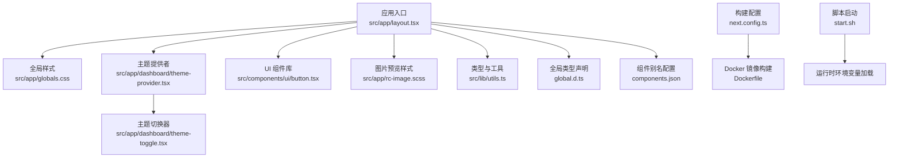
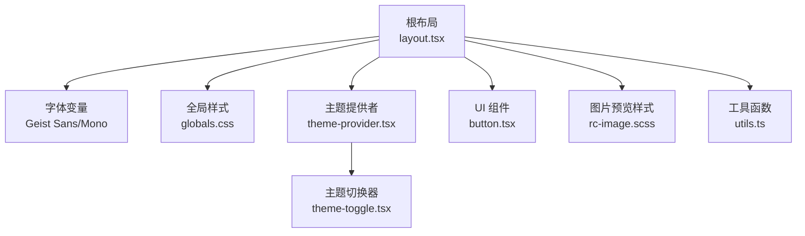
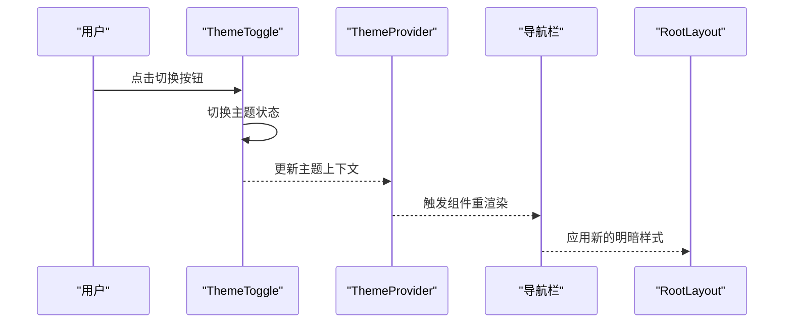
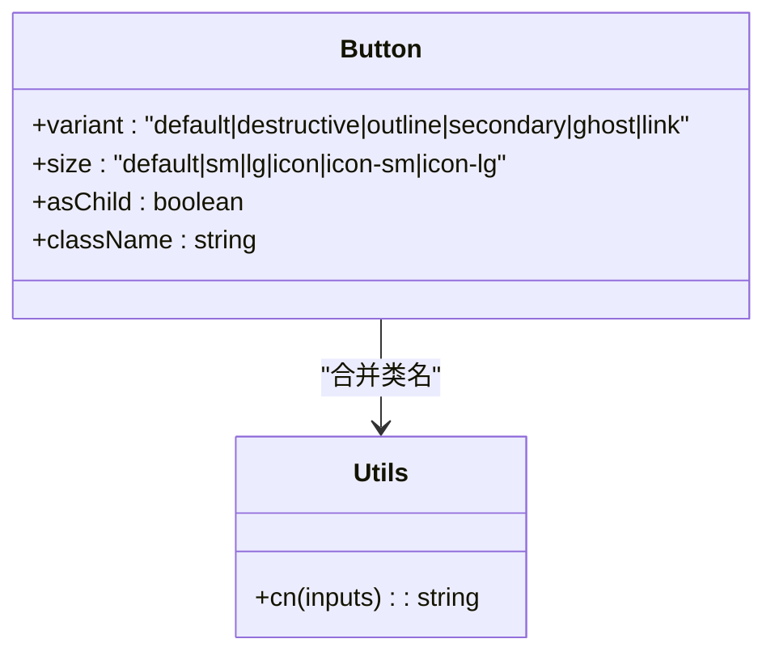
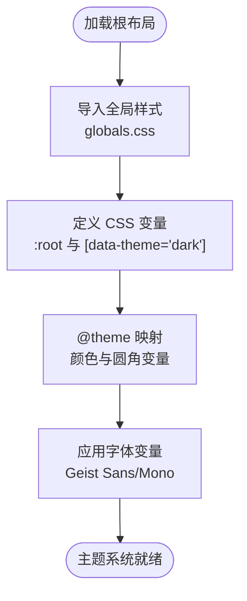
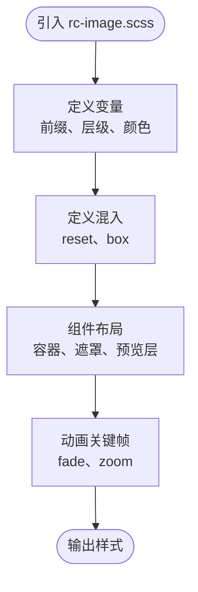
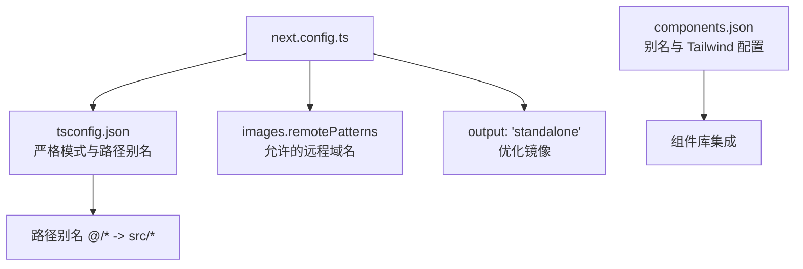
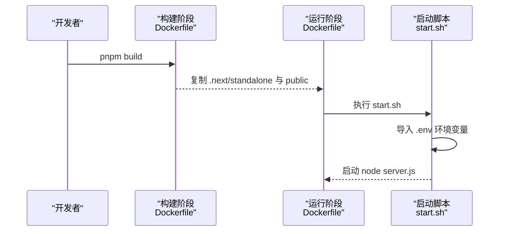
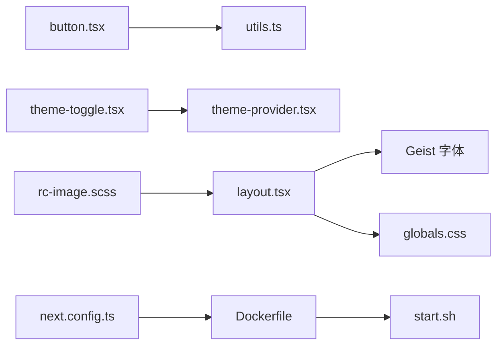

# 定制化指南

<cite>
**本文引用的文件**
- [package.json](file://package.json)
- [next.config.ts](file://next.config.ts)
- [tsconfig.json](file://tsconfig.json)
- [global.d.ts](file://global.d.ts)
- [src/app/layout.tsx](file://src/app/layout.tsx)
- [src/app/globals.css](file://src/app/globals.css)
- [src/app/rc-image.scss](file://src/app/rc-image.scss)
- [src/app/dashboard/layout.tsx](file://src/app/dashboard/layout.tsx)
- [src/app/dashboard/theme-provider.tsx](file://src/app/dashboard/theme-provider.tsx)
- [src/app/dashboard/theme-toggle.tsx](file://src/app/dashboard/theme-toggle.tsx)
- [src/components/ui/button.tsx](file://src/components/ui/button.tsx)
- [src/lib/utils.ts](file://src/lib/utils.ts)
- [components.json](file://components.json)
- [Dockerfile](file://Dockerfile)
- [start.sh](file://start.sh)
- [src/lib/auth.ts](file://src/lib/auth.ts)
</cite>

## 目录
1. [简介](#简介)
2. [项目结构](#项目结构)
3. [核心组件](#核心组件)
4. [架构总览](#架构总览)
5. [详细组件分析](#详细组件分析)
6. [依赖关系分析](#依赖关系分析)
7. [性能考量](#性能考量)
8. [故障排查指南](#故障排查指南)
9. [结论](#结论)
10. [附录](#附录)

## 简介
本指南面向需要对 Image SaaS 项目进行定制化开发的工程师与产品团队，覆盖样式主题定制、品牌标识集成、界面布局调整、TypeScript 类型扩展、全局配置与环境变量定制、构建配置优化与打包策略、部署参数定制、功能开关与 A/B 测试集成、动态配置管理、国际化扩展与本地化定制、企业级定制与私有化部署、功能模块化配置等。文档提供可直接落地的配置模板与实现路径，帮助快速完成从样式到运行时行为的全链路定制。

## 项目结构
项目采用 Next.js 应用结构，核心入口位于 src/app，UI 组件基于 shadcn/ui 与自研组件库，样式使用 Tailwind CSS 与 SCSS 混合方案，主题系统通过 next-themes 实现明暗切换，数据库访问通过 tRPC 与 Drizzle ORM 封装。

图表来源
- [src/app/layout.tsx:1-37](file://src/app/layout.tsx#L1-L37)
- [src/app/globals.css:1-162](file://src/app/globals.css#L1-L162)
- [src/app/dashboard/theme-provider.tsx:1-9](file://src/app/dashboard/theme-provider.tsx#L1-L9)
- [src/app/dashboard/theme-toggle.tsx:1-33](file://src/app/dashboard/theme-toggle.tsx#L1-L33)
- [src/components/ui/button.tsx:1-63](file://src/components/ui/button.tsx#L1-L63)
- [src/app/rc-image.scss:1-388](file://src/app/rc-image.scss#L1-L388)
- [src/lib/utils.ts:1-7](file://src/lib/utils.ts#L1-L7)
- [global.d.ts:1-3](file://global.d.ts#L1-L3)
- [components.json:1-23](file://components.json#L1-L23)
- [next.config.ts:1-22](file://next.config.ts#L1-L22)
- [Dockerfile:1-76](file://Dockerfile#L1-L76)
- [start.sh:1-7](file://start.sh#L1-L7)

章节来源
- [package.json:1-94](file://package.json#L1-L94)
- [next.config.ts:1-22](file://next.config.ts#L1-L22)
- [tsconfig.json:1-35](file://tsconfig.json#L1-L35)
- [components.json:1-23](file://components.json#L1-L23)

## 核心组件
- 主题系统：通过 next-themes 提供明暗主题切换，主题提供者与切换按钮分别在 dashboard 子路由中使用。
- UI 组件：基于 class-variance-authority 的变体系统，统一的 Button 组件支持多种尺寸与风格。
- 全局样式：Tailwind 与 CSS 变量结合，定义了 oklch 色彩空间的主题变量与暗色适配。
- 图片预览：基于 rc-image 的 SCSS 样式，提供预览遮罩、操作区、进度与切换动画。
- 构建与运行：Next.js 构建配置启用 standalone 输出；Dockerfile 多阶段构建；start.sh 支持从 .env 注入环境变量。

章节来源
- [src/app/dashboard/theme-provider.tsx:1-9](file://src/app/dashboard/theme-provider.tsx#L1-L9)
- [src/app/dashboard/theme-toggle.tsx:1-33](file://src/app/dashboard/theme-toggle.tsx#L1-L33)
- [src/components/ui/button.tsx:1-63](file://src/components/ui/button.tsx#L1-L63)
- [src/app/globals.css:1-162](file://src/app/globals.css#L1-L162)
- [src/app/rc-image.scss:1-388](file://src/app/rc-image.scss#L1-L388)
- [next.config.ts:1-22](file://next.config.ts#L1-L22)
- [Dockerfile:1-76](file://Dockerfile#L1-L76)
- [start.sh:1-7](file://start.sh#L1-L7)

## 架构总览
下图展示前端运行时的关键交互：根布局注入字体与全局样式，主题提供者包裹页面，主题切换器控制明暗状态，UI 组件使用变体系统，图片预览样式独立于 Tailwind。

图表来源
- [src/app/layout.tsx:1-37](file://src/app/layout.tsx#L1-L37)
- [src/app/globals.css:1-162](file://src/app/globals.css#L1-L162)
- [src/app/dashboard/theme-provider.tsx:1-9](file://src/app/dashboard/theme-provider.tsx#L1-L9)
- [src/app/dashboard/theme-toggle.tsx:1-33](file://src/app/dashboard/theme-toggle.tsx#L1-L33)
- [src/components/ui/button.tsx:1-63](file://src/components/ui/button.tsx#L1-L63)
- [src/app/rc-image.scss:1-388](file://src/app/rc-image.scss#L1-L388)
- [src/lib/utils.ts:1-7](file://src/lib/utils.ts#L1-L7)

## 详细组件分析

### 主题系统与明暗切换
- 主题提供者：在 dashboard 布局中包裹导航与主内容，确保主题状态在整个子路由生效。
- 主题切换器：使用 next-themes 读取当前主题并切换，配合 useMount 避免首屏闪烁。
- 根布局：在 html 上挂载字体变量类名，保证主题切换时的字体一致性。

图表来源
- [src/app/dashboard/theme-toggle.tsx:1-33](file://src/app/dashboard/theme-toggle.tsx#L1-L33)
- [src/app/dashboard/theme-provider.tsx:1-9](file://src/app/dashboard/theme-provider.tsx#L1-L9)
- [src/app/dashboard/layout.tsx:1-49](file://src/app/dashboard/layout.tsx#L1-L49)
- [src/app/layout.tsx:1-37](file://src/app/layout.tsx#L1-L37)

章节来源
- [src/app/dashboard/theme-provider.tsx:1-9](file://src/app/dashboard/theme-provider.tsx#L1-L9)
- [src/app/dashboard/theme-toggle.tsx:1-33](file://src/app/dashboard/theme-toggle.tsx#L1-L33)
- [src/app/dashboard/layout.tsx:1-49](file://src/app/dashboard/layout.tsx#L1-L49)
- [src/app/layout.tsx:1-37](file://src/app/layout.tsx#L1-L37)

### UI 组件变体系统（Button）
- 变体与尺寸：通过 class-variance-authority 定义多种变体与尺寸，支持 asChild 透传与数据属性标注，便于样式调试与测试。
- 样式合并：使用 cn 工具函数合并 Tailwind 与自定义类名，避免冲突。

图表来源
- [src/components/ui/button.tsx:1-63](file://src/components/ui/button.tsx#L1-L63)
- [src/lib/utils.ts:1-7](file://src/lib/utils.ts#L1-L7)

章节来源
- [src/components/ui/button.tsx:1-63](file://src/components/ui/button.tsx#L1-L63)
- [src/lib/utils.ts:1-7](file://src/lib/utils.ts#L1-L7)

### 全局样式与主题变量
- CSS 变量：定义了背景、前景、卡片、弹出层、输入框、强调色等主题变量，并在 :root 与 [data-theme='dark'] 中分别给出亮/暗两套值。
- Tailwind 主题：通过 @theme inline 将 CSS 变量映射为 Tailwind 可用的颜色与圆角变量，实现与组件库的一致性。
- 字体与动画：引入 Geist 字体与 tw-animate-css 动画库，提升视觉体验。

图表来源
- [src/app/globals.css:1-162](file://src/app/globals.css#L1-L162)
- [src/app/layout.tsx:1-37](file://src/app/layout.tsx#L1-L37)

章节来源
- [src/app/globals.css:1-162](file://src/app/globals.css#L1-L162)
- [src/app/layout.tsx:1-37](file://src/app/layout.tsx#L1-L37)

### 图片预览样式（rc-image）
- SCSS 结构：定义了图片容器、遮罩、预览层、操作区、切换按钮与动画关键帧。
- 变量与混入：通过 $prefixCls、$zindex-preview-mask 等变量集中管理样式命名与层级，便于企业定制。
- 动画：提供淡入淡出与缩放动画，增强交互体验。

图表来源
- [src/app/rc-image.scss:1-388](file://src/app/rc-image.scss#L1-L388)

章节来源
- [src/app/rc-image.scss:1-388](file://src/app/rc-image.scss#L1-L388)

### 构建配置与打包策略
- Next.js 配置：开启 typescript.ignoreBuildErrors 以允许类型错误不影响构建；启用 output: 'standalone' 优化 Docker 镜像体积；配置图片远程域名白名单。
- TypeScript：严格模式、bundler 解析、路径别名 @/* 指向 src/*，便于模块化组织。
- 组件别名：components.json 定义了 shadcn/ui 的样式风格、Tailwind 配置与别名映射。

图表来源
- [next.config.ts:1-22](file://next.config.ts#L1-L22)
- [tsconfig.json:1-35](file://tsconfig.json#L1-L35)
- [components.json:1-23](file://components.json#L1-L23)

章节来源
- [next.config.ts:1-22](file://next.config.ts#L1-L22)
- [tsconfig.json:1-35](file://tsconfig.json#L1-L35)
- [components.json:1-23](file://components.json#L1-L23)

### 部署参数与运行时环境
- Dockerfile：多阶段构建，先安装生产依赖，再复制构建产物至运行阶段，使用 standalone 输出减少镜像体积；设置非 root 用户与端口暴露。
- start.sh：清理 Windows 换行符、从 .env 导入环境变量后启动 Next.js 应用，支持私有化部署时的环境注入。

图表来源
- [Dockerfile:1-76](file://Dockerfile#L1-L76)
- [start.sh:1-7](file://start.sh#L1-L7)

章节来源
- [Dockerfile:1-76](file://Dockerfile#L1-L76)
- [start.sh:1-7](file://start.sh#L1-L7)

## 依赖关系分析
- 组件耦合：UI 组件依赖 cn 工具函数；主题切换器依赖 next-themes；根布局依赖字体与全局样式。
- 外部依赖：next、react、tailwindcss、@radix-ui/*、lucide-react、next-themes、drizzle-orm、@trpc/* 等。
- 构建与运行：Next.js 构建产物通过 standalone 输出，Dockerfile 仅复制必要文件，降低运行时依赖。

图表来源
- [src/components/ui/button.tsx:1-63](file://src/components/ui/button.tsx#L1-L63)
- [src/lib/utils.ts:1-7](file://src/lib/utils.ts#L1-L7)
- [src/app/dashboard/theme-toggle.tsx:1-33](file://src/app/dashboard/theme-toggle.tsx#L1-L33)
- [src/app/dashboard/theme-provider.tsx:1-9](file://src/app/dashboard/theme-provider.tsx#L1-L9)
- [src/app/layout.tsx:1-37](file://src/app/layout.tsx#L1-L37)
- [src/app/globals.css:1-162](file://src/app/globals.css#L1-L162)
- [src/app/rc-image.scss:1-388](file://src/app/rc-image.scss#L1-L388)
- [next.config.ts:1-22](file://next.config.ts#L1-L22)
- [Dockerfile:1-76](file://Dockerfile#L1-L76)
- [start.sh:1-7](file://start.sh#L1-L7)

章节来源
- [package.json:1-94](file://package.json#L1-L94)
- [next.config.ts:1-22](file://next.config.ts#L1-L22)
- [Dockerfile:1-76](file://Dockerfile#L1-L76)

## 性能考量
- 构建优化：启用 output: 'standalone'，减少运行时依赖拷贝；多阶段 Docker 构建降低镜像体积。
- 样式优化：Tailwind 与 CSS 变量结合，避免重复样式；SCSS 变量集中管理，便于裁剪与替换。
- 组件优化：Button 使用变体系统与数据属性，利于按需渲染与样式调试。
- 图片优化：next.config.ts 中配置 remotePatterns，确保外部图片资源安全与缓存友好。

## 故障排查指南
- 主题不生效或闪烁
  - 检查 ThemeProvider 是否包裹到导航与主内容区域。
  - 确认 useMount 初始化后再渲染切换按钮。
  - 参考路径：[src/app/dashboard/theme-provider.tsx:1-9](file://src/app/dashboard/theme-provider.tsx#L1-L9)，[src/app/dashboard/theme-toggle.tsx:1-33](file://src/app/dashboard/theme-toggle.tsx#L1-L33)，[src/app/dashboard/layout.tsx:1-49](file://src/app/dashboard/layout.tsx#L1-L49)
- 样式变量未生效
  - 确认根布局已注入字体变量类名。
  - 检查 CSS 变量是否在 :root 与 [data-theme='dark'] 中正确声明。
  - 参考路径：[src/app/layout.tsx:1-37](file://src/app/layout.tsx#L1-L37)，[src/app/globals.css:1-162](file://src/app/globals.css#L1-L162)
- Docker 启动失败
  - 确保 .env 文件无 Windows 换行符，start.sh 正常导出环境变量。
  - 检查 Dockerfile 是否正确复制 .next/standalone 与 public。
  - 参考路径：[Dockerfile:1-76](file://Dockerfile#L1-L76)，[start.sh:1-7](file://start.sh#L1-L7)
- 图片无法显示
  - 检查 next.config.ts 中 images.remotePatterns 是否包含目标域名。
  - 参考路径：[next.config.ts:1-22](file://next.config.ts#L1-L22)

章节来源
- [src/app/dashboard/theme-provider.tsx:1-9](file://src/app/dashboard/theme-provider.tsx#L1-L9)
- [src/app/dashboard/theme-toggle.tsx:1-33](file://src/app/dashboard/theme-toggle.tsx#L1-L33)
- [src/app/dashboard/layout.tsx:1-49](file://src/app/dashboard/layout.tsx#L1-L49)
- [src/app/layout.tsx:1-37](file://src/app/layout.tsx#L1-L37)
- [src/app/globals.css:1-162](file://src/app/globals.css#L1-L162)
- [Dockerfile:1-76](file://Dockerfile#L1-L76)
- [start.sh:1-7](file://start.sh#L1-L7)
- [next.config.ts:1-22](file://next.config.ts#L1-L22)

## 结论
本指南提供了从样式主题、品牌集成、布局调整到构建与部署的完整定制路径。通过主题提供者与切换器、变体组件系统、Tailwind/CSS 变量与 SCSS 混合方案，以及多阶段 Docker 构建与环境变量注入，能够满足企业级定制与私有化部署的需求。建议在定制过程中优先从样式变量与组件变体入手，逐步扩展到运行时配置与国际化。

## 附录

### 样式主题定制清单
- 修改主题变量：在 [src/app/globals.css:1-162](file://src/app/globals.css#L1-L162) 中调整 :root 与 [data-theme='dark'] 的 oklch 值。
- 自定义字体：在 [src/app/layout.tsx:1-37](file://src/app/layout.tsx#L1-L37) 中替换或新增字体变量。
- 组件变体：在 [src/components/ui/button.tsx:1-63](file://src/components/ui/button.tsx#L1-L63) 中扩展 variant/size 或新增组件。
- 图片预览样式：在 [src/app/rc-image.scss:1-388](file://src/app/rc-image.scss#L1-L388) 中调整变量与动画。

### 品牌标识集成
- Logo 位置：导航栏中心区域预留品牌位，参考 [src/app/dashboard/layout.tsx:40-42](file://src/app/dashboard/layout.tsx#L40-L42)。
- 品牌色板：通过 CSS 变量统一品牌主色与辅助色，参考 [src/app/globals.css:6-40](file://src/app/globals.css#L6-L40)。

### 界面布局调整
- 导航栏结构：在 [src/app/dashboard/layout.tsx:24-46](file://src/app/dashboard/layout.tsx#L24-L46) 中增删元素或调整对齐方式。
- 侧边栏/抽屉：如需扩展，可在现有布局基础上增加 slot 区域并引入对应组件。

### TypeScript 类型扩展
- 路径别名：在 [tsconfig.json:22-24](file://tsconfig.json#L22-L24) 中维护 @/* 别名，确保 IDE 与编译器识别。
- 全局类型：在 [global.d.ts:1-3](file://global.d.ts#L1-L3) 中声明模块类型，避免样式文件类型报错。

### 全局配置与环境变量定制
- 构建配置：在 [next.config.ts:1-22](file://next.config.ts#L1-L22) 中调整 images.remotePatterns、output 等选项。
- 运行时变量：在 [start.sh:3-5](file://start.sh#L3-L5) 中确保 .env 正确注入；在 [Dockerfile:50-54](file://Dockerfile#L50-L54) 中设置默认环境变量。

### 构建配置优化与打包策略
- 启用 standalone：参考 [next.config.ts](file://next.config.ts#L9)。
- 多阶段构建：参考 [Dockerfile:1-76](file://Dockerfile#L1-L76) 的 stage 分离与文件复制。

### 部署参数定制
- 端口与主机：在 [Dockerfile:53-54](file://Dockerfile#L53-L54) 中设置默认端口与绑定地址。
- 非 root 用户：参考 [Dockerfile:56-69](file://Dockerfile#L56-L69) 的用户创建与权限变更。

### 功能开关与 A/B 测试集成
- 登录跳转控制：在 [src/app/dashboard/layout.tsx:18-21](file://src/app/dashboard/layout.tsx#L18-L21) 中通过环境变量 SKIP_LOGIN 控制登录流程。
- 运行时开关：建议在服务端或 tRPC 中读取环境变量，返回不同功能开关状态给前端。

### 国际化扩展与本地化定制
- 字体与文本：在 [src/app/layout.tsx:27-29](file://src/app/layout.tsx#L27-L29) 中保持多语言字体支持。
- 文案与格式：建议在 i18n 层统一管理文案与日期/数字格式化，避免硬编码。

### 企业级定制与私有化部署
- 私有化部署：通过 [Dockerfile:1-76](file://Dockerfile#L1-L76) 与 [start.sh:1-7](file://start.sh#L1-L7) 实现环境注入与最小化运行时。
- 功能模块化：在 [components.json:1-23](file://components.json#L1-L23) 中统一组件别名与 Tailwind 配置，便于按需替换组件库。

### 动态配置管理
- 运行时配置：建议在服务端提供配置接口，前端通过 tRPC 获取动态配置（如品牌色、开关、文案等），并在根布局或主题提供者处应用。
- 配置缓存：在客户端使用内存缓存或持久化存储，避免频繁请求。