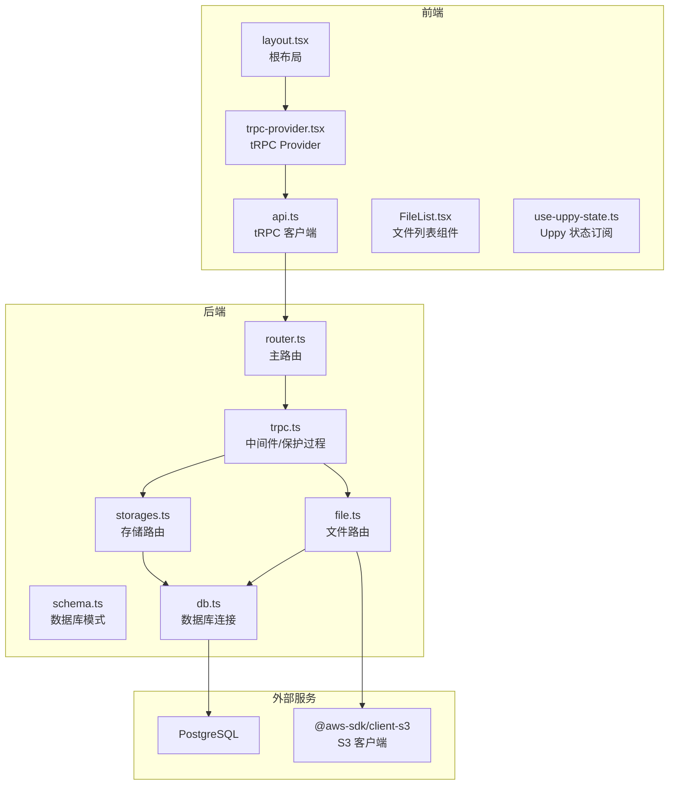
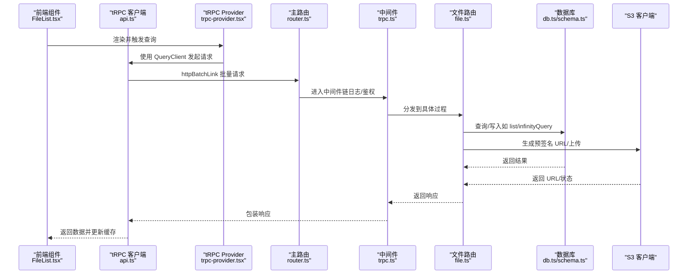
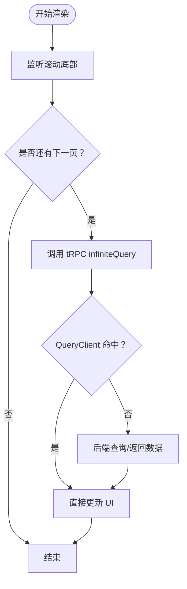
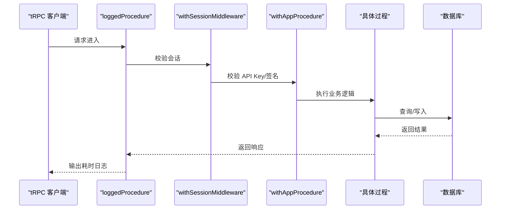
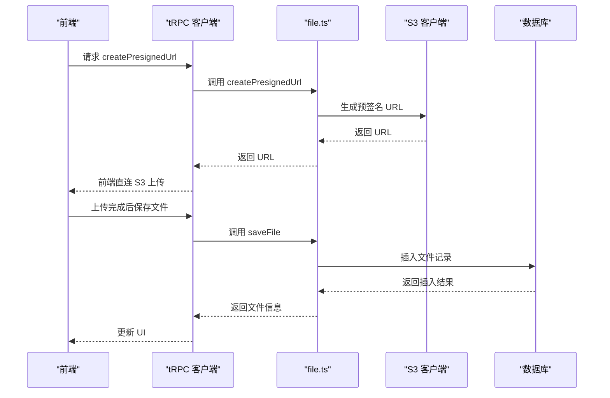
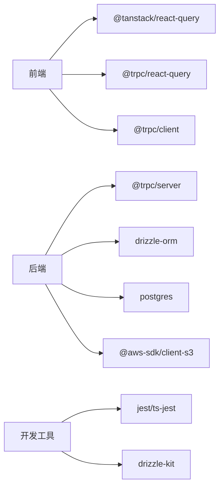

# 性能监控

<cite>
**本文引用的文件**
- [package.json](file://package.json)
- [src/app/layout.tsx](file://src/app/layout.tsx)
- [src/app/trpc-provider.tsx](file://src/app/trpc-provider.tsx)
- [src/utils/api.ts](file://src/utils/api.ts)
- [src/server/trpc-middlewares/trpc.ts](file://src/server/trpc-middlewares/trpc.ts)
- [src/server/trpc-middlewares/router.ts](file://src/server/trpc-middlewares/router.ts)
- [src/server/routes/file.ts](file://src/server/routes/file.ts)
- [src/server/routes/storages.ts](file://src/server/routes/storages.ts)
- [src/server/db/db.ts](file://src/server/db/db.ts)
- [src/server/db/schema.ts](file://src/server/db/schema.ts)
- [src/components/feature/FileList.tsx](file://src/components/feature/FileList.tsx)
- [src/hooks/use-uppy-state.ts](file://src/hooks/use-uppy-state.ts)
- [.codebuddy/rules/trpc-api-structure.mdc](file://.codebuddy/rules/trpc-api-structure.mdc)
</cite>

## 目录

1. [引言](#引言)
2. [项目结构](#项目结构)
3. [核心组件](#核心组件)
4. [架构总览](#架构总览)
5. [详细组件分析](#详细组件分析)
6. [依赖分析](#依赖分析)
7. [性能考虑](#性能考虑)
8. [故障排查指南](#故障排查指南)
9. [结论](#结论)
10. [附录](#附录)

## 引言

本文件面向 Image SaaS 项目的性能监控扩展，目标是帮助开发者在现有架构上构建完善的性能监控体系，覆盖前端性能、网络请求、用户体验指标、服务器端性能、数据库查询优化、缓存命中率统计、APM 集成、分布式追踪与告警机制，并提供性能分析工具、调试技术、瓶颈识别方法以及性能数据的可视化、报告与趋势分析方案。

## 项目结构

该项目采用 Next.js + tRPC + Drizzle ORM 的前后端一体化架构。前端通过 tRPC 客户端发起批量 HTTP 请求，后端通过 tRPC 中间件链路进行会话校验、日志记录与权限控制，数据库使用 PostgreSQL 并通过 Drizzle ORM 访问。文件上传流程涉及 AWS S3 客户端与预签名 URL 生成。

**图表来源**

- [src/app/layout.tsx:1-37](file://src/app/layout.tsx#L1-L37)
- [src/app/trpc-provider.tsx:1-18](file://src/app/trpc-provider.tsx#L1-L18)
- [src/utils/api.ts:1-17](file://src/utils/api.ts#L1-L17)
- [src/server/trpc-middlewares/router.ts:1-20](file://src/server/trpc-middlewares/router.ts#L1-L20)
- [src/server/trpc-middlewares/trpc.ts:1-130](file://src/server/trpc-middlewares/trpc.ts#L1-L130)
- [src/server/routes/file.ts:1-561](file://src/server/routes/file.ts#L1-L561)
- [src/server/routes/storages.ts:1-74](file://src/server/routes/storages.ts#L1-L74)
- [src/server/db/db.ts:1-9](file://src/server/db/db.ts#L1-L9)
- [src/server/db/schema.ts:1-270](file://src/server/db/schema.ts#L1-L270)

**章节来源**

- [src/app/layout.tsx:1-37](file://src/app/layout.tsx#L1-L37)
- [src/app/trpc-provider.tsx:1-18](file://src/app/trpc-provider.tsx#L1-L18)
- [src/utils/api.ts:1-17](file://src/utils/api.ts#L1-L17)
- [src/server/trpc-middlewares/router.ts:1-20](file://src/server/trpc-middlewares/router.ts#L1-L20)
- [src/server/trpc-middlewares/trpc.ts:1-130](file://src/server/trpc-middlewares/trpc.ts#L1-L130)
- [src/server/routes/file.ts:1-561](file://src/server/routes/file.ts#L1-L561)
- [src/server/routes/storages.ts:1-74](file://src/server/routes/storages.ts#L1-L74)
- [src/server/db/db.ts:1-9](file://src/server/db/db.ts#L1-L9)
- [src/server/db/schema.ts:1-270](file://src/server/db/schema.ts#L1-L270)

## 核心组件

- 前端 tRPC Provider：在根布局注入 tRPC Provider，统一管理 QueryClient 与客户端实例，便于全局缓存与重用。
- tRPC 客户端：通过 httpBatchLink 批量发送请求，降低网络往返次数，提升吞吐。
- tRPC 中间件：内置日志中间件用于粗粒度耗时统计；会话中间件与受保护过程用于鉴权与上下文注入。
- 数据库层：Drizzle ORM + PostgreSQL，配合索引与查询优化策略。
- 文件路由：支持预签名 URL 生成与文件持久化，涉及 S3 交互。
- 存储路由：管理 S3 配置，为文件路由提供存储凭证。

**章节来源**

- [src/app/trpc-provider.tsx:1-18](file://src/app/trpc-provider.tsx#L1-L18)
- [src/utils/api.ts:1-17](file://src/utils/api.ts#L1-L17)
- [src/server/trpc-middlewares/trpc.ts:21-46](file://src/server/trpc-middlewares/trpc.ts#L21-L46)
- [src/server/db/db.ts:1-9](file://src/server/db/db.ts#L1-L9)
- [src/server/routes/file.ts:26-90](file://src/server/routes/file.ts#L26-L90)
- [src/server/routes/storages.ts:7-74](file://src/server/routes/storages.ts#L7-L74)

## 架构总览

下图展示了从前端到后端再到数据库与外部存储的整体调用链，以及可扩展的性能监控点位。

**图表来源**

- [src/components/feature/FileList.tsx:1-366](file://src/components/feature/FileList.tsx#L1-L366)
- [src/utils/api.ts:1-17](file://src/utils/api.ts#L1-L17)
- [src/app/trpc-provider.tsx:1-18](file://src/app/trpc-provider.tsx#L1-L18)
- [src/server/trpc-middlewares/router.ts:1-20](file://src/server/trpc-middlewares/router.ts#L1-L20)
- [src/server/trpc-middlewares/trpc.ts:1-130](file://src/server/trpc-middlewares/trpc.ts#L1-L130)
- [src/server/routes/file.ts:120-234](file://src/server/routes/file.ts#L120-L234)
- [src/server/db/db.ts:1-9](file://src/server/db/db.ts#L1-L9)
- [src/server/db/schema.ts:120-136](file://src/server/db/schema.ts#L120-L136)

## 详细组件分析

### 前端性能监控与用户体验指标

- 组件渲染与滚动加载
  - FileList 使用无限滚动与分页游标，结合 IntersectionObserver 与 QueryClient 缓存，减少重复请求与重绘。
  - 用户体验指标建议：首屏渲染时间、滚动触底延迟、分页加载耗时、上传预览首帧时间。
- tRPC 客户端与批处理
  - httpBatchLink 可显著降低请求次数与 RTT，适合高频小请求场景。
  - 建议：对频繁查询启用 refetch 控制与缓存失效策略，避免不必要的重拉取。
- Uppy 状态订阅
  - use-uppy-state 基于 useSyncExternalStore 订阅 Uppy 状态，避免手动订阅导致的性能问题。

**图表来源**

- [src/components/feature/FileList.tsx:132-150](file://src/components/feature/FileList.tsx#L132-L150)
- [src/components/feature/FileList.tsx:40-49](file://src/components/feature/FileList.tsx#L40-L49)
- [src/app/trpc-provider.tsx:6-15](file://src/app/trpc-provider.tsx#L6-L15)
- [src/utils/api.ts:7-13](file://src/utils/api.ts#L7-L13)

**章节来源**

- [src/components/feature/FileList.tsx:1-366](file://src/components/feature/FileList.tsx#L1-L366)
- [src/hooks/use-uppy-state.ts:1-17](file://src/hooks/use-uppy-state.ts#L1-L17)
- [src/app/trpc-provider.tsx:1-18](file://src/app/trpc-provider.tsx#L1-L18)
- [src/utils/api.ts:1-17](file://src/utils/api.ts#L1-L17)

### 服务器端性能监控与数据库优化

- 中间件与日志
  - loggedProcedure 在每次过程执行前后记录时间差，可用于粗粒度 API 耗时统计。
  - 建议：将耗时指标输出至指标系统（如 Prometheus），并按路由/过程维度聚合。
- 受保护过程与鉴权
  - withSessionMiddleware 与 withAppProcedure 提供统一鉴权入口，避免重复校验逻辑。
- 数据库访问与索引
  - schema 定义了多处索引（如 files 的复合索引、tags 的多维索引），有助于排序与过滤性能。
  - 建议：对高频查询字段建立合适索引，定期分析慢查询日志，结合 EXPLAIN 分析执行计划。

**图表来源**

- [src/server/trpc-middlewares/trpc.ts:21-46](file://src/server/trpc-middlewares/trpc.ts#L21-L46)
- [src/server/trpc-middlewares/trpc.ts:30-45](file://src/server/trpc-middlewares/trpc.ts#L30-L45)
- [src/server/trpc-middlewares/trpc.ts:47-127](file://src/server/trpc-middlewares/trpc.ts#L47-L127)
- [src/server/db/schema.ts:120-136](file://src/server/db/schema.ts#L120-L136)

**章节来源**

- [src/server/trpc-middlewares/trpc.ts:1-130](file://src/server/trpc-middlewares/trpc.ts#L1-L130)
- [src/server/db/schema.ts:1-270](file://src/server/db/schema.ts#L1-L270)

### 文件路由与 S3 集成的性能要点

- 预签名 URL 生成
  - createPresignedUrl 通过 S3 客户端生成短期有效 URL，避免后端中转大文件，降低带宽与 CPU 开销。
  - 建议：根据文件大小与并发上传量调整过期时间与并发上限，结合 CDN 加速。
- 文件持久化与 AI 标签识别
  - saveFile 将文件元信息写入数据库；上传成功后触发 AI 标签识别，建议异步化以避免阻塞主流程。
- 无限分页与搜索
  - infinityQueryFiles 支持游标分页与多条件过滤，建议对搜索条件与排序字段建立索引，避免全表扫描。

**图表来源**

- [src/server/routes/file.ts:26-90](file://src/server/routes/file.ts#L26-L90)
- [src/server/routes/file.ts:91-118](file://src/server/routes/file.ts#L91-L118)
- [src/server/routes/file.ts:135-234](file://src/server/routes/file.ts#L135-L234)

**章节来源**

- [src/server/routes/file.ts:1-561](file://src/server/routes/file.ts#L1-L561)

### tRPC API 结构规范与扩展指引

- 统一路由注册：所有功能模块路由需在主路由中注册，保证类型安全与一致性。
- 规范化过程：查询/变更过程应遵循受保护过程与输入校验，便于中间件统一处理。

**章节来源**

- [.codebuddy/rules/trpc-api-structure.mdc:1-112](file://.codebuddy/rules/trpc-api-structure.mdc#L1-L112)
- [src/server/trpc-middlewares/router.ts:1-20](file://src/server/trpc-middlewares/router.ts#L1-L20)

## 依赖分析

- 前端依赖
  - @tanstack/react-query：提供 QueryClient 与缓存管理，建议配置合理的缓存时间与失效策略。
  - @trpc/react-query 与 @trpc/client：统一前后端通信协议与类型安全。
- 后端依赖
  - @trpc/server：中间件与过程封装。
  - drizzle-orm 与 postgres：ORM 与数据库驱动。
  - @aws-sdk/client-s3：S3 客户端，用于预签名 URL 与上传。
- 开发与工具
  - jest、ts-jest：单元测试与类型检查。
  - drizzle-kit：迁移与快照管理。

**图表来源**

- [package.json:14-66](file://package.json#L14-L66)
- [package.json:67-92](file://package.json#L67-L92)

**章节来源**

- [package.json:1-94](file://package.json#L1-L94)

## 性能考虑

- 自定义指标收集
  - 前端：基于 React Query 的查询状态（isPending、isFetching）与错误计数，结合浏览器 Performance API 记录首屏与交互延迟。
  - 后端：在 loggedProcedure 中输出耗时与路径维度指标，结合请求头标识用户/应用维度。
- 性能基准测试
  - 使用 Lighthouse、Web Vitals、Browser DevTools Performance 面板进行前端基准；使用 pg_stat_statements 分析 SQL 耗时。
- 内存泄漏检测
  - 前端：使用 React DevTools Profiler 与浏览器内存快照，关注组件卸载与事件解绑；避免在 useEffect 中累积引用。
  - 后端：使用 Node.js heapdump 与 heap analysis 工具，定位长生命周期对象。
- 数据库查询优化
  - 为高频查询字段建立索引；避免 N+1 查询；使用 LIMIT 与游标分页；对复杂 JOIN 与子查询进行 EXPLAIN 分析。
- 缓存命中率统计
  - 前端：QueryClient 缓存命中/失效计数；后端：Redis/Memcached 命中率（如引入）。
- APM 工具集成
  - 前端：Sentry/LogRocket；后端：DataDog/NewRelic 或 OpenTelemetry + Jaeger/Tempo。
- 分布式追踪
  - 通过请求头传递 trace-id，在 tRPC 中间件中注入上下文，跨服务串联链路。
- 告警机制
  - 设置阈值告警（P95/P99、错误率、队列长度等），结合邮件/IM 通知。

[本节为通用指导，不直接分析具体文件，故无“章节来源”]

## 故障排查指南

- tRPC 调用异常
  - 检查 loggedProcedure 输出的耗时与错误栈；确认受保护过程中的鉴权中间件是否正确传递上下文。
- 数据库慢查询
  - 使用 EXPLAIN 分析查询计划；核对索引是否生效；必要时拆分查询或引入物化视图。
- S3 上传失败
  - 校验预签名 URL 过期时间与权限；检查区域与端点配置；观察网络抖动与超时重试。
- 前端卡顿
  - 关注组件重渲染频率与无效重算；使用 React Profiler 与浏览器 Performance 面板定位热点。

**章节来源**

- [src/server/trpc-middlewares/trpc.ts:21-46](file://src/server/trpc-middlewares/trpc.ts#L21-L46)
- [src/server/routes/file.ts:26-90](file://src/server/routes/file.ts#L26-L90)

## 结论

通过在现有 tRPC + Drizzle + Next.js 架构基础上引入细粒度的性能监控与优化策略，可以在前端渲染、网络请求、数据库查询与外部存储等多个层面实现可观测性与稳定性保障。建议优先落地中间件日志、QueryClient 缓存策略与数据库索引优化，再逐步引入 APM、分布式追踪与告警体系，最终形成闭环的性能治理能力。

## 附录

- 性能数据可视化与报告
  - 指标面板：API 耗时分布、错误率、缓存命中率、数据库慢查询 TopN。
  - 报告周期：日/周/月趋势分析，对比基线版本变化。
- 调试技术
  - 前端：React DevTools Profiler、Performance 面板、Network 面板。
  - 后端：pprof、火焰图、慢查询日志。
- 瓶颈识别方法
  - 前端：首屏时间、交互延迟、重渲染热点。
  - 后端：CPU 占用、GC 次数与停顿、数据库锁等待、网络 I/O。

[本节为通用指导，不直接分析具体文件，故无“章节来源”]
