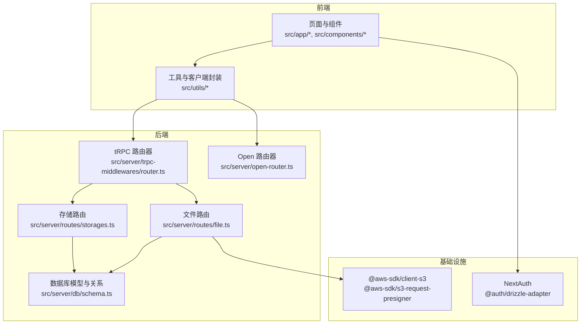
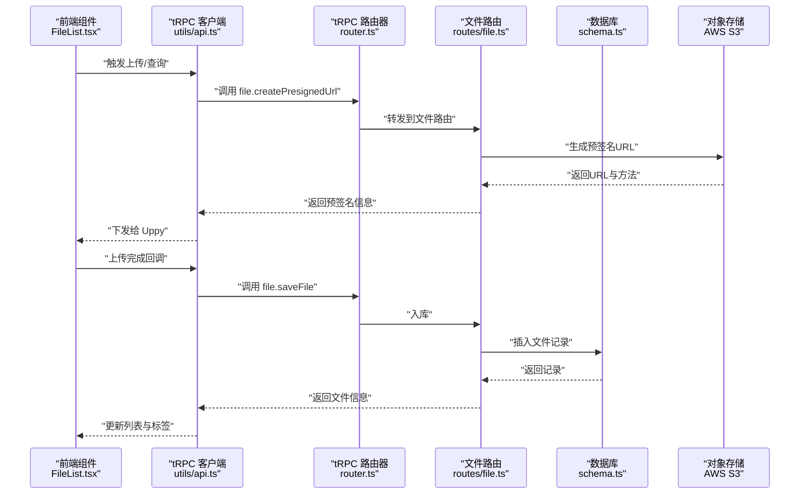
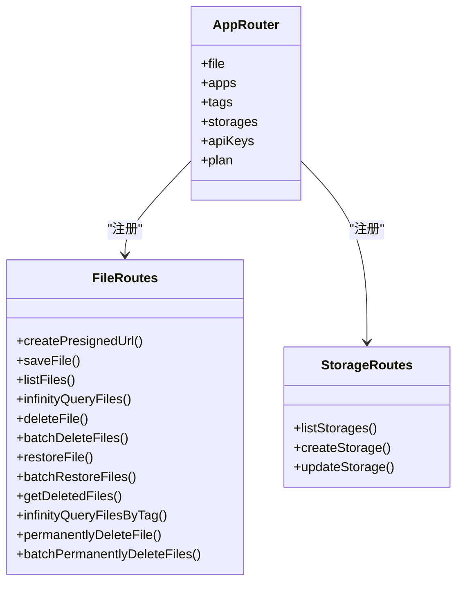
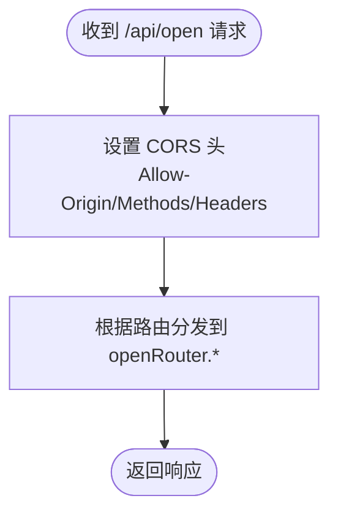
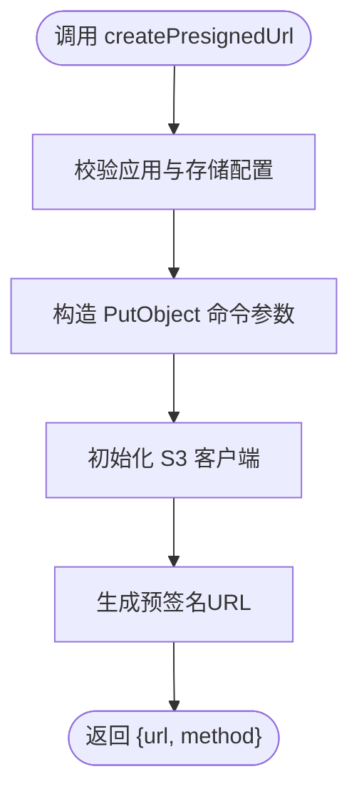
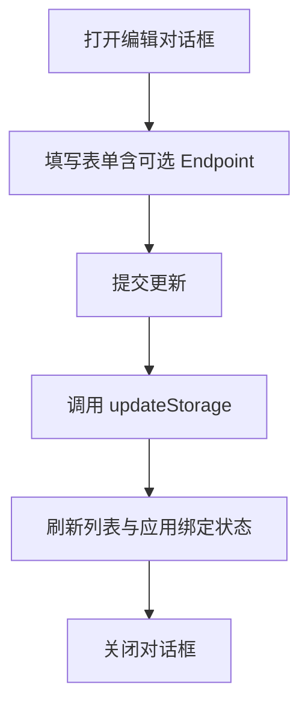
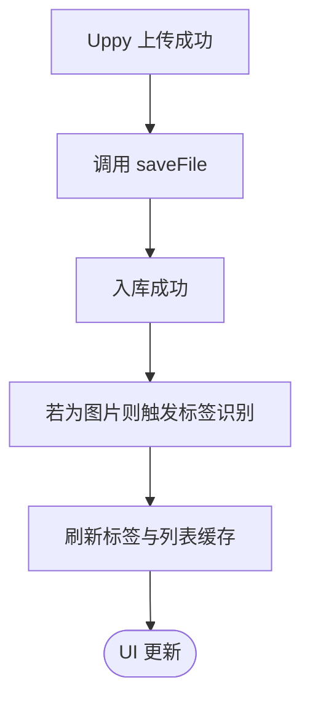
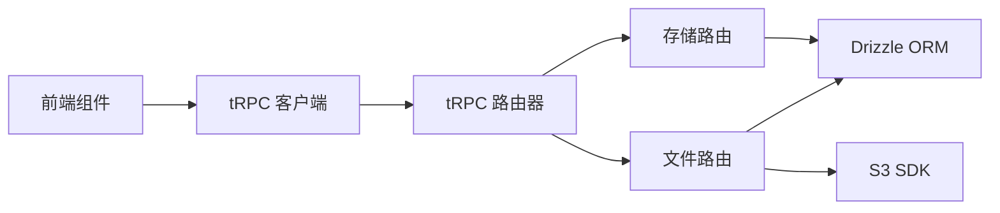

# 扩展开发

<cite>
**本文引用的文件**
- [package.json](file://package.json)
- [src/app/layout.tsx](file://src/app/layout.tsx)
- [src/lib/utils.ts](file://src/lib/utils.ts)
- [src/utils/trpc.ts](file://src/utils/trpc.ts)
- [src/server/open-router.ts](file://src/server/open-router.ts)
- [src/server/trpc-middlewares/router.ts](file://src/server/trpc-middlewares/router.ts)
- [src/server/routes/file.ts](file://src/server/routes/file.ts)
- [src/server/routes/storages.ts](file://src/server/routes/storages.ts)
- [src/components/feature/FileList.tsx](file://src/components/feature/FileList.tsx)
- [src/app/dashboard/apps/[appId]/setting/storage/page.tsx](file://src/app/dashboard/apps/[appId]/setting/storage/page.tsx)
- [src/server/db/schema.ts](file://src/server/db/schema.ts)
- [src/utils/api.ts](file://src/utils/api.ts)
- [src/app/api/trpc/[...trpc]/route.ts](file://src/app/api/trpc/[...trpc]/route.ts)
- [src/app/api/open/[...trpc]/route.ts](file://src/app/api/open/[...trpc]/route.ts)
- [src/components/feature/edit-storage-dialog.tsx](file://src/components/feature/edit-storage-dialog.tsx)
</cite>

## 目录
1. [简介](#简介)
2. [项目结构](#项目结构)
3. [核心组件](#核心组件)
4. [架构总览](#架构总览)
5. [详细组件分析](#详细组件分析)
6. [依赖分析](#依赖分析)
7. [性能考量](#性能考量)
8. [故障排查指南](#故障排查指南)
9. [结论](#结论)
10. [附录](#附录)

## 简介
本文件面向扩展开发者，系统化说明 Image SaaS 项目的扩展点、插件化与模块化开发方式、API 扩展与 OpenAPI 集成、第三方存储后端接入、数据格式转换、性能监控与日志记录、错误处理策略，以及社区贡献与版本兼容建议。目标是帮助你在不破坏现有架构的前提下，安全地添加新功能、集成外部服务，并保持良好的可维护性。

## 项目结构
项目采用 Next.js 应用结构，结合 tRPC 进行前后端统一类型安全的 RPC 调用；数据库通过 Drizzle ORM 访问 PostgreSQL；前端 UI 使用 Radix UI 组件库与 TailwindCSS 样式；上传链路基于 Uppy 与 AWS S3 SDK（可替换为其他对象存储）。

图表来源
- [src/server/trpc-middlewares/router.ts:1-20](file://src/server/trpc-middlewares/router.ts#L1-L20)
- [src/server/open-router.ts:1-10](file://src/server/open-router.ts#L1-L10)
- [src/server/routes/file.ts:1-561](file://src/server/routes/file.ts#L1-L561)
- [src/server/routes/storages.ts:1-74](file://src/server/routes/storages.ts#L1-L74)
- [src/server/db/schema.ts:1-270](file://src/server/db/schema.ts#L1-L270)
- [package.json:14-66](file://package.json#L14-L66)

章节来源
- [package.json:1-94](file://package.json#L1-L94)
- [src/app/layout.tsx:1-37](file://src/app/layout.tsx#L1-L37)

## 核心组件
- tRPC 路由器与中间件：集中注册业务路由，提供类型安全的调用入口。
- Open 路由器：开放接口，支持跨域与 API Key 校验，便于第三方集成。
- 文件路由：上传预签名 URL 生成、文件入库、分页查询、软删除与批量操作等。
- 存储路由：存储配置的增删改查，支持多存储后端抽象。
- 数据模型：apps、files、storageConfiguration、apiKeys、tags 等，定义了应用、文件、标签与存储配置的关系。
- 前端客户端：统一的 tRPC 客户端封装，负责与后端交互。
- 上传链路：Uppy + tRPC + S3 SDK，支持直传与入库联动。

章节来源
- [src/server/trpc-middlewares/router.ts:1-20](file://src/server/trpc-middlewares/router.ts#L1-L20)
- [src/server/open-router.ts:1-10](file://src/server/open-router.ts#L1-L10)
- [src/server/routes/file.ts:1-561](file://src/server/routes/file.ts#L1-L561)
- [src/server/routes/storages.ts:1-74](file://src/server/routes/storages.ts#L1-L74)
- [src/server/db/schema.ts:1-270](file://src/server/db/schema.ts#L1-L270)
- [src/utils/api.ts:1-17](file://src/utils/api.ts#L1-L17)
- [src/components/feature/FileList.tsx:1-366](file://src/components/feature/FileList.tsx#L1-L366)

## 架构总览
下图展示了从前端到后端、再到存储系统的端到端调用路径与扩展点：

图表来源
- [src/components/feature/FileList.tsx:160-235](file://src/components/feature/FileList.tsx#L160-L235)
- [src/utils/api.ts:1-17](file://src/utils/api.ts#L1-L17)
- [src/server/trpc-middlewares/router.ts:1-20](file://src/server/trpc-middlewares/router.ts#L1-L20)
- [src/server/routes/file.ts:26-90](file://src/server/routes/file.ts#L26-L90)
- [src/server/db/schema.ts:120-173](file://src/server/db/schema.ts#L120-L173)

## 详细组件分析

### tRPC 路由器与中间件
- 职责：聚合各业务路由（文件、应用、标签、存储、API Key、用户计划），作为统一入口。
- 扩展点：新增业务模块时，在路由器中注册新的命名空间；在对应路由文件中实现 CRUD 或业务逻辑。
- 类关系示意：

图表来源
- [src/server/trpc-middlewares/router.ts:1-20](file://src/server/trpc-middlewares/router.ts#L1-L20)
- [src/server/routes/file.ts:26-558](file://src/server/routes/file.ts#L26-L558)
- [src/server/routes/storages.ts:7-73](file://src/server/routes/storages.ts#L7-L73)

章节来源
- [src/server/trpc-middlewares/router.ts:1-20](file://src/server/trpc-middlewares/router.ts#L1-L20)

### Open 路由器与跨域/鉴权
- 职责：开放接口，允许第三方直接访问；设置跨域头与 API Key 请求头白名单。
- 扩展点：在 openRouter 中新增命名空间，按需开启鉴权或匿名访问。
- 流程图：

图表来源
- [src/app/api/open/[...trpc]/route.ts:1-31](file://src/app/api/open/[...trpc]/route.ts#L1-L31)
- [src/server/open-router.ts:1-10](file://src/server/open-router.ts#L1-L10)

章节来源
- [src/app/api/open/[...trpc]/route.ts:1-31](file://src/app/api/open/[...trpc]/route.ts#L1-L31)
- [src/server/open-router.ts:1-10](file://src/server/open-router.ts#L1-L10)

### 文件路由与存储后端抽象
- 关键能力：
  - 生成上传预签名 URL（支持自定义过期时间）。
  - 保存文件元信息至数据库。
  - 分页查询、按标签过滤、软删除与恢复、批量操作。
  - 删除文件时预留 S3 清理位置（待实现）。
- 存储后端抽象：
  - 存储配置以 JSON 结构保存，字段包括 bucket、region、accessKeyId、secretAccessKey、apiEndPoint。
  - 可替换为其他对象存储（如 MinIO、阿里云 OSS、七牛等），只需在路由中适配 SDK 即可。
- 流程图（上传预签名 URL）：

图表来源
- [src/server/routes/file.ts:26-90](file://src/server/routes/file.ts#L26-L90)

章节来源
- [src/server/routes/file.ts:1-561](file://src/server/routes/file.ts#L1-L561)
- [src/server/db/schema.ts:154-173](file://src/server/db/schema.ts#L154-L173)

### 存储路由与 UI 配置
- 能力：列出、创建、更新存储配置；应用选择存储。
- UI：提供对话框编辑存储配置，支持必填项校验与提交状态反馈。
- 流程图（编辑存储配置）：

图表来源
- [src/app/dashboard/apps/[appId]/setting/storage/page.tsx:16-33](file://src/app/dashboard/apps/[appId]/setting/storage/page.tsx#L16-L33)
- [src/components/feature/edit-storage-dialog.tsx:33-74](file://src/components/feature/edit-storage-dialog.tsx#L33-L74)
- [src/server/routes/storages.ts:41-73](file://src/server/routes/storages.ts#L41-L73)

章节来源
- [src/app/dashboard/apps/[appId]/setting/storage/page.tsx:1-103](file://src/app/dashboard/apps/[appId]/setting/storage/page.tsx#L1-L103)
- [src/components/feature/edit-storage-dialog.tsx:1-186](file://src/components/feature/edit-storage-dialog.tsx#L1-L186)
- [src/server/routes/storages.ts:1-74](file://src/server/routes/storages.ts#L1-L74)

### 前端上传与列表展示
- Uppy 事件监听：监听上传成功事件，调用后端保存文件并刷新列表；对图片文件触发标签识别。
- 列表分页与分组：按日期分组、无限滚动加载、搜索与排序。
- 流程图（上传成功回调）：

图表来源
- [src/components/feature/FileList.tsx:160-235](file://src/components/feature/FileList.tsx#L160-L235)

章节来源
- [src/components/feature/FileList.tsx:1-366](file://src/components/feature/FileList.tsx#L1-L366)

### tRPC 客户端与 Provider
- 客户端：统一创建 tRPC React 客户端，指向后端 /api/trpc。
- Provider：在根布局中注入 Provider，使组件树内可使用 hooks。
- 路由器：导出 AppRouter 类型，确保前后端类型一致。

章节来源
- [src/utils/api.ts:1-17](file://src/utils/api.ts#L1-L17)
- [src/utils/trpc.ts:1-7](file://src/utils/trpc.ts#L1-L7)
- [src/app/layout.tsx:1-37](file://src/app/layout.tsx#L1-L37)
- [src/app/api/trpc/[...trpc]/route.ts:1-14](file://src/app/api/trpc/[...trpc]/route.ts#L1-L14)

## 依赖分析
- 核心依赖：Next.js、tRPC、Drizzle ORM、PostgreSQL、AWS S3 SDK、Uppy、Radix UI、TailwindCSS。
- 扩展建议：
  - 新增第三方服务时，优先通过 tRPC 路由器暴露接口，避免直接在 UI 层耦合。
  - 存储后端替换：仅需修改路由中的 SDK 初始化与命令构造，保持对外接口不变。
  - 前端 UI：通过组件化与 hooks 抽象，降低对具体实现的依赖。

图表来源
- [package.json:14-66](file://package.json#L14-L66)
- [src/utils/api.ts:1-17](file://src/utils/api.ts#L1-L17)
- [src/server/trpc-middlewares/router.ts:1-20](file://src/server/trpc-middlewares/router.ts#L1-L20)
- [src/server/routes/file.ts:1-561](file://src/server/routes/file.ts#L1-L561)
- [src/server/routes/storages.ts:1-74](file://src/server/routes/storages.ts#L1-L74)

章节来源
- [package.json:1-94](file://package.json#L1-L94)

## 性能考量
- 无限分页与游标：文件列表与按标签查询均使用游标分页，减少全表扫描与内存占用。
- 查询优化：使用索引与条件拼接，避免 N+1 查询；对搜索条件使用 SQL 原生表达式。
- 缓存与乐观更新：前端对查询结果进行乐观更新，提升交互流畅度。
- 上传链路：预签名直传减少网关压力；对图片文件异步触发标签识别，避免阻塞主流程。
- 存储后端：通过配置化支持不同对象存储，按需选择低延迟或低成本方案。

章节来源
- [src/server/routes/file.ts:135-234](file://src/server/routes/file.ts#L135-L234)
- [src/server/routes/file.ts:396-500](file://src/server/routes/file.ts#L396-L500)
- [src/components/feature/FileList.tsx:30-49](file://src/components/feature/FileList.tsx#L30-L49)

## 故障排查指南
- 上传失败
  - 检查应用是否已绑定存储配置，确认存储配置字段完整。
  - 校验预签名 URL 是否过期，必要时重新生成。
  - 查看 S3 凭证与 Endpoint 设置是否正确。
- 文件入库异常
  - 确认请求参数与类型校验通过；检查用户会话与应用归属。
  - 查看数据库写入日志与事务回滚情况。
- Open 接口跨域问题
  - 确认响应头已设置 Allow-Origin/Methods/Headers；检查 OPTIONS 预检是否通过。
- 标签识别失败
  - 检查识别服务可用性与网络连通性；查看前端控制台错误输出。

章节来源
- [src/server/routes/file.ts:26-90](file://src/server/routes/file.ts#L26-L90)
- [src/app/api/open/[...trpc]/route.ts:13-16](file://src/app/api/open/[...trpc]/route.ts#L13-L16)
- [src/components/feature/FileList.tsx:170-183](file://src/components/feature/FileList.tsx#L170-L183)

## 结论
本项目提供了清晰的扩展点与模块化架构：通过 tRPC 路由器聚合业务、通过 Open 路由器对接第三方、通过 Drizzle ORM 与数据库模型抽象存储后端。遵循本文的扩展方法与最佳实践，你可以安全地添加新功能、集成外部服务，并在保证性能与可维护性的前提下持续演进。

## 附录

### 插件开发与模块化建议
- 新增业务模块步骤
  1) 在路由器中注册新命名空间。
  2) 在对应路由文件中实现 CRUD/业务逻辑。
  3) 在前端使用 tRPC hooks 调用，必要时增加本地缓存与乐观更新。
  4) 如涉及存储，通过配置化字段抽象，避免硬编码。
- 钩子与中间件
  - 可在路由器层增加通用中间件（如鉴权、限流、审计日志）。
  - 对 Open 路由器可按需启用 API Key 校验。
- 配置接口
  - 使用 JSON 字段保存可扩展配置，便于未来新增参数而不破坏接口。
- 第三方集成
  - 优先通过 tRPC 路由器封装外部服务，统一错误处理与日志记录。
  - 对于实时通信，可引入 WebSocket 支持并在 tRPC 中扩展。

章节来源
- [src/server/trpc-middlewares/router.ts:1-20](file://src/server/trpc-middlewares/router.ts#L1-L20)
- [src/server/open-router.ts:1-10](file://src/server/open-router.ts#L1-L10)
- [src/server/db/schema.ts:164-173](file://src/server/db/schema.ts#L164-L173)

### API 扩展与 OpenAPI 集成
- 当前 API 通过 tRPC 提供类型安全的 RPC 接口；如需 OpenAPI 文档，可在路由层导出 OpenAPI 规范（例如通过第三方工具生成）。
- 对外开放接口建议：
  - 明确鉴权方式（API Key 或 OAuth）。
  - 统一错误码与响应结构。
  - 对敏感操作增加速率限制与审计日志。

章节来源
- [src/app/api/open/[...trpc]/route.ts:1-31](file://src/app/api/open/[...trpc]/route.ts#L1-L31)

### 存储后端集成指南
- 接入步骤
  1) 在存储配置中新增后端字段（如 endpoint、endpointType 等）。
  2) 在文件路由中根据配置选择对应 SDK 初始化。
  3) 保持对外接口不变，内部适配不同 SDK 的命令与错误处理。
- 最佳实践
  - 将凭证与 Endpoint 保存在安全的密钥管理服务中。
  - 对不同后端提供默认值与降级策略。

章节来源
- [src/server/routes/storages.ts:15-39](file://src/server/routes/storages.ts#L15-L39)
- [src/server/routes/file.ts:64-84](file://src/server/routes/file.ts#L64-L84)
- [src/server/db/schema.ts:154-173](file://src/server/db/schema.ts#L154-L173)

### 自定义组件开发
- 建议
  - 组件尽量无状态或少状态，通过 props 与 hooks 注入行为。
  - 使用 cn 工具类合并样式，保持主题一致性。
  - 对复杂交互拆分为多个小组件，提升复用性。
- 示例参考
  - FileList：分页、分组、上传回调与标签识别。
  - EditStorageDialog：表单校验、乐观更新与状态反馈。

章节来源
- [src/lib/utils.ts:1-7](file://src/lib/utils.ts#L1-L7)
- [src/components/feature/FileList.tsx:1-366](file://src/components/feature/FileList.tsx#L1-L366)
- [src/components/feature/edit-storage-dialog.tsx:1-186](file://src/components/feature/edit-storage-dialog.tsx#L1-L186)

### 性能监控、日志记录与错误处理
- 性能监控
  - 前端：记录 tRPC 请求耗时与错误率，结合浏览器性能面板定位瓶颈。
  - 后端：对关键路由埋点统计 QPS、P95/P99 时延与错误分布。
- 日志记录
  - 统一日志格式与级别，区分业务日志与调试日志。
  - 对敏感信息脱敏（如凭证、URL）。
- 错误处理
  - 使用 TRPCError 返回明确错误码与消息。
  - 对外部服务失败进行重试与熔断保护。

章节来源
- [src/server/routes/file.ts:47-61](file://src/server/routes/file.ts#L47-L61)
- [src/app/api/open/[...trpc]/route.ts:13-16](file://src/app/api/open/[...trpc]/route.ts#L13-L16)

### 社区贡献与版本兼容
- 贡献流程
  - Fork 仓库 -> 创建分支 -> 编写功能/修复 -> 提交 PR -> 代码评审 -> 合并。
- 版本兼容
  - 保持 tRPC 类型与数据库迁移脚本同步。
  - 对外部依赖升级进行回归测试，关注 API 变更与弃用提示。
- 功能请求
  - 在 Issue 中描述背景、期望行为与验收标准，必要时附带草图或原型链接。

章节来源
- [package.json:1-94](file://package.json#L1-L94)