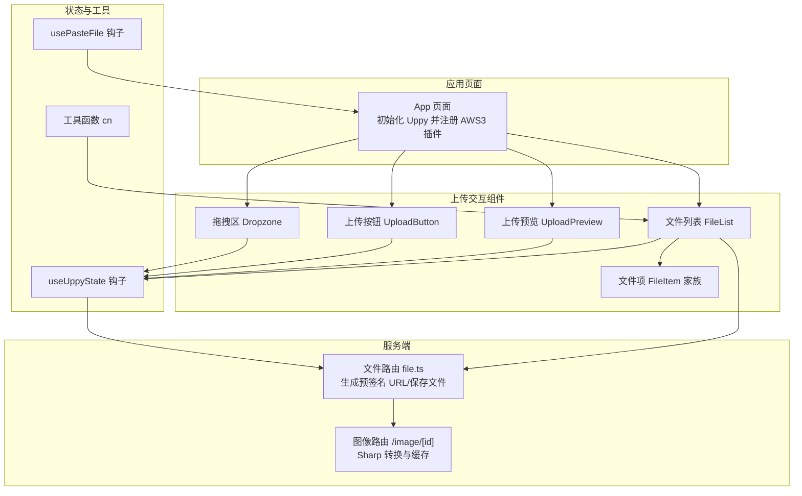
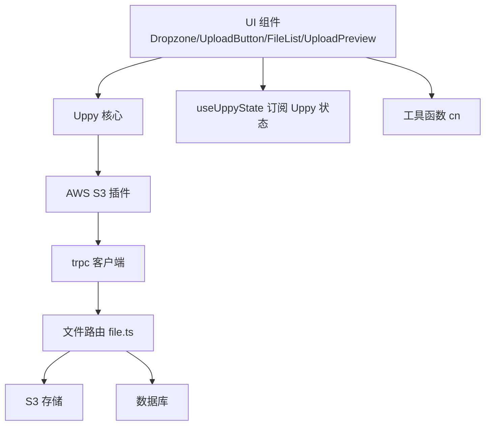
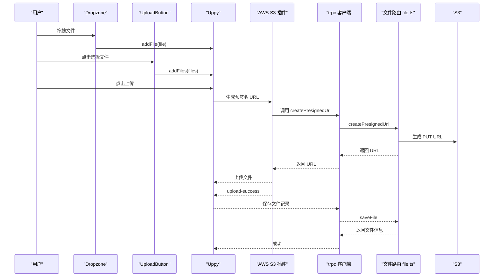
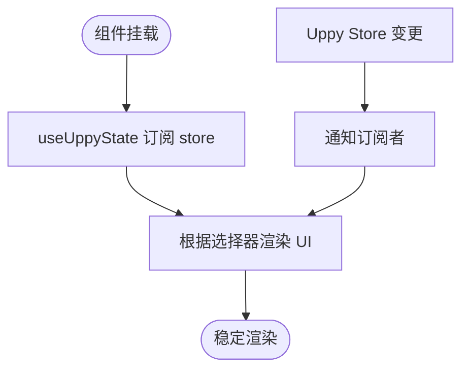

# 插件开发

<cite>
**本文引用的文件**
- [package.json](file://package.json)
- [src/app/dashboard/apps/[appId]/page.tsx](file://src/app/dashboard/apps/[appId]/page.tsx)
- [src/components/feature/dropzone.tsx](file://src/components/feature/dropzone.tsx)
- [src/components/feature/upload-button.tsx](file://src/components/feature/upload-button.tsx)
- [src/components/feature/upload-preview.tsx](file://src/components/feature/upload-preview.tsx)
- [src/components/feature/file-list.tsx](file://src/components/feature/file-list.tsx)
- [src/components/feature/file-item.tsx](file://src/components/feature/file-item.tsx)
- [src/hooks/use-uppy-state.ts](file://src/hooks/use-uppy-state.ts)
- [src/hooks/user-paste-file.ts](file://src/hooks/user-paste-file.ts)
- [src/server/routes/file.ts](file://src/server/routes/file.ts)
- [src/app/image/[id]/route.ts](file://src/app/image/[id]/route.ts)
- [src/components/feature/search-bar.tsx](file://src/components/feature/search-bar.tsx)
- [src/lib/utils.ts](file://src/lib/utils.ts)
</cite>

## 目录
1. [简介](#简介)
2. [项目结构](#项目结构)
3. [核心组件](#核心组件)
4. [架构总览](#架构总览)
5. [组件详解](#组件详解)
6. [依赖关系分析](#依赖关系分析)
7. [性能考量](#性能考量)
8. [故障排查指南](#故障排查指南)
9. [结论](#结论)
10. [附录：开发模板与最佳实践](#附录开发模板与最佳实践)

## 简介
本文件面向 Image SaaS 项目的插件开发者，系统化阐述如何基于现有架构开发自定义 React 组件插件，涵盖组件架构设计、Props 接口定义、事件处理机制、生命周期与状态管理、与主应用的通信方式、Uppy 插件扩展与自定义上传处理器、文件处理插件实现、测试策略、调试技巧、性能优化、打包发布与版本管理、向后兼容性保障等。文档以仓库中的真实代码为依据，提供可操作的开发模板与最佳实践。

## 项目结构
项目采用 Next.js 应用结构，前端组件位于 src/components/feature 与 src/app 下，围绕 Uppy 上传流程与 trpc 数据层构建。关键模块包括：
- 应用页面：负责 Uppy 实例初始化、插件注册与全局状态联动
- 上传交互组件：拖拽区、文件列表、上传预览、按钮等
- 状态订阅钩子：基于 useSyncExternalStore 订阅 Uppy store
- 服务端路由：生成预签名 URL、保存文件记录、分页查询、标签识别等

图表来源
- [src/app/dashboard/apps/[appId]/page.tsx](file://src/app/dashboard/apps/[appId]/page.tsx#L56-L72)
- [src/components/feature/dropzone.tsx:1-52](file://src/components/feature/dropzone.tsx#L1-L52)
- [src/components/feature/upload-button.tsx:1-46](file://src/components/feature/upload-button.tsx#L1-L46)
- [src/components/feature/upload-preview.tsx:1-119](file://src/components/feature/upload-preview.tsx#L1-L119)
- [src/components/feature/file-list.tsx:1-373](file://src/components/feature/file-list.tsx#L1-L373)
- [src/components/feature/file-item.tsx:1-138](file://src/components/feature/file-item.tsx#L1-L138)
- [src/hooks/use-uppy-state.ts:1-17](file://src/hooks/use-uppy-state.ts#L1-L17)
- [src/hooks/user-paste-file.ts:1-34](file://src/hooks/user-paste-file.ts#L1-L34)
- [src/server/routes/file.ts:26-118](file://src/server/routes/file.ts#L26-L118)
- [src/app/image/[id]/route.ts](file://src/app/image/[id]/route.ts#L47-L91)

章节来源
- [package.json:14-66](file://package.json#L14-L66)
- [src/app/dashboard/apps/[appId]/page.tsx:56-L72](file://src/app/dashboard/apps/[appId]/page.tsx#L56-L72)

## 核心组件
- Uppy 实例与插件注册：在应用页面中创建 Uppy 实例并注册 AWS S3 插件，通过 trpc 生成预签名 URL，完成直传。
- 拖拽上传 Dropzone：监听拖拽事件，将文件加入 Uppy 队列。
- 本地文件选择 UploadButton：触发原生文件输入，批量添加到 Uppy。
- 上传预览 UploadPreview：展示待上传队列，支持切换、删除与一键上传。
- 文件列表 FileList：订阅 Uppy 状态，监听上传事件，调用 trpc 保存文件记录并刷新 UI。
- 状态订阅 useUppyState：基于 useSyncExternalStore 订阅 Uppy store，实现响应式渲染。
- 剪贴板粘贴 usePasteFile：监听剪贴板事件，自动将图片粘贴为文件源。
- 工具函数 cn：Tailwind 合并类名，提升样式复用性。

章节来源
- [src/app/dashboard/apps/[appId]/page.tsx:56-L72](file://src/app/dashboard/apps/[appId]/page.tsx#L56-L72)
- [src/components/feature/dropzone.tsx:1-52](file://src/components/feature/dropzone.tsx#L1-L52)
- [src/components/feature/upload-button.tsx:1-46](file://src/components/feature/upload-button.tsx#L1-L46)
- [src/components/feature/upload-preview.tsx:1-119](file://src/components/feature/upload-preview.tsx#L1-L119)
- [src/components/feature/file-list.tsx:1-373](file://src/components/feature/file-list.tsx#L1-L373)
- [src/hooks/use-uppy-state.ts:1-17](file://src/hooks/use-uppy-state.ts#L1-L17)
- [src/hooks/user-paste-file.ts:1-34](file://src/hooks/user-paste-file.ts#L1-L34)
- [src/lib/utils.ts:1-7](file://src/lib/utils.ts#L1-L7)

## 架构总览
下图展示了插件（组件）与主应用、Uppy、trpc 以及 S3 的交互关系：

图表来源
- [src/app/dashboard/apps/[appId]/page.tsx:56-L72](file://src/app/dashboard/apps/[appId]/page.tsx#L56-L72)
- [src/components/feature/file-list.tsx:152-235](file://src/components/feature/file-list.tsx#L152-L235)
- [src/server/routes/file.ts:26-118](file://src/server/routes/file.ts#L26-L118)

## 组件详解

### 组件架构与 Props 设计
- 通用 Props 接口
  - uppy: Uppy 实例，用于文件添加、上传控制与状态订阅
  - children: 函数式子节点，用于向上传递内部状态（如拖拽状态）
  - 其他 HTML 属性透传，确保样式与事件可配置
- 典型组件
  - Dropzone：接收 uppy 与 children 回调，暴露拖拽状态给父组件渲染
  - UploadButton：接收 uppy，内部维护隐藏 input，点击触发文件选择
  - UploadPreview：接收 uppy，读取队列并提供切换、删除、上传操作
  - FileList：接收 uppy、appId、排序与搜索过滤，订阅 Uppy 状态并监听上传事件
  - FileItem 家族：封装本地/远程文件渲染与预览逻辑

章节来源
- [src/components/feature/dropzone.tsx:4-7](file://src/components/feature/dropzone.tsx#L4-L7)
- [src/components/feature/upload-button.tsx:6-8](file://src/components/feature/upload-button.tsx#L6-L8)
- [src/components/feature/upload-preview.tsx:15-17](file://src/components/feature/upload-preview.tsx#L15-L17)
- [src/components/feature/file-list.tsx:21-26](file://src/components/feature/file-list.tsx#L21-L26)
- [src/components/feature/file-item.tsx:6-16](file://src/components/feature/file-item.tsx#L6-L16)

### 事件处理机制
- 拖拽事件
  - onDragEnter/onDragLeave/onDragOver/onDrop：控制拖拽高亮与文件加入队列
- 上传事件
  - upload-success：保存文件记录、触发标签识别、刷新分页缓存
  - complete：清空上传中标识
  - upload：收集上传中文件 ID
- 剪贴板事件
  - 监听 paste，提取 clipboardData 中的文件，交由 onFilePaste 处理

章节来源
- [src/components/feature/dropzone.tsx:17-44](file://src/components/feature/dropzone.tsx#L17-L44)
- [src/components/feature/file-list.tsx:152-235](file://src/components/feature/file-list.tsx#L152-L235)
- [src/hooks/user-paste-file.ts:8-30](file://src/hooks/user-paste-file.ts#L8-L30)

### 生命周期管理与状态管理
- Uppy 生命周期
  - 初始化：在应用页面创建 Uppy 实例并注册 AWS S3 插件
  - 文件添加：通过 uppy.addFile/addFiles 加入队列
  - 上传控制：通过 uppy.upload 触发上传；uppy.removeFile 移除
- 状态订阅
  - useUppyState(selector)：基于 useSyncExternalStore 订阅 store，返回选择器结果
  - 在组件中使用 uppy.store.getState() 与 store.subscribe 实现细粒度响应式渲染
- 组件内状态
  - FileList 维护分组展开状态、上传中文件 ID 列表
  - UploadPreview 维护当前索引与对话框开关

章节来源
- [src/app/dashboard/apps/[appId]/page.tsx:56-L72](file://src/app/dashboard/apps/[appId]/page.tsx#L56-L72)
- [src/hooks/use-uppy-state.ts:4-14](file://src/hooks/use-uppy-state.ts#L4-L14)
- [src/components/feature/file-list.tsx:92-102](file://src/components/feature/file-list.tsx#L92-L102)
- [src/components/feature/upload-preview.tsx:21-25](file://src/components/feature/upload-preview.tsx#L21-L25)

### 与主应用的通信方式
- 通过 props 注入 Uppy 实例，避免全局单例耦合
- 通过 trpc 客户端进行服务端交互（生成预签名 URL、保存文件、分页查询）
- 通过事件回调（onSearch、onFilePaste）与父组件解耦通信

章节来源
- [src/app/dashboard/apps/[appId]/page.tsx:56-L72](file://src/app/dashboard/apps/[appId]/page.tsx#L56-L72)
- [src/components/feature/search-bar.tsx:22-25](file://src/components/feature/search-bar.tsx#L22-L25)
- [src/hooks/user-paste-file.ts:3-7](file://src/hooks/user-paste-file.ts#L3-L7)

### Uppy 插件扩展与自定义上传处理器
- 插件注册
  - 在应用页面中通过 uppy.use(AWS3, options) 注册 AWS S3 插件
  - options.getUploadParameters 返回 Promise，内部调用 trpc.file.createPresignedUrl 生成预签名 URL
- 自定义上传处理器
  - 可替换 AWS S3 插件为其他上传方案（如分片、断点续传），保持 getUploadParameters 接口一致
  - 通过 uppy.upload() 触发上传，监听 upload-success 事件保存文件记录

章节来源
- [src/app/dashboard/apps/[appId]/page.tsx:59-L69](file://src/app/dashboard/apps/[appId]/page.tsx#L59-L69)
- [src/server/routes/file.ts:26-118](file://src/server/routes/file.ts#L26-L118)

### 文件处理插件实现指南
- 图像预览与缩放
  - 使用 UploadPreview 与 FileItem 家族渲染本地/远程图像
  - 通过 /image/[id] 路由结合 Sharp 进行尺寸调整与格式转换，返回缓存友好响应
- 标签识别与缓存刷新
  - 在 upload-success 后调用 trpc.tags.recognizeImageTags.mutate
  - 使用 trpcClientReact.utils.tags.getTagsByCategory.refetch 刷新标签缓存

章节来源
- [src/components/feature/upload-preview.tsx:19-119](file://src/components/feature/upload-preview.tsx#L19-L119)
- [src/components/feature/file-item.tsx:17-73](file://src/components/feature/file-item.tsx#L17-L73)
- [src/app/image/[id]/route.ts:47-L91](file://src/app/image/[id]/route.ts#L47-L91)
- [src/components/feature/file-list.tsx:170-183](file://src/components/feature/file-list.tsx#L170-L183)

### 上传流程时序图

图表来源
- [src/components/feature/dropzone.tsx:37-44](file://src/components/feature/dropzone.tsx#L37-L44)
- [src/components/feature/upload-button.tsx:21-28](file://src/components/feature/upload-button.tsx#L21-L28)
- [src/app/dashboard/apps/[appId]/page.tsx:59-L69](file://src/app/dashboard/apps/[appId]/page.tsx#L59-L69)
- [src/server/routes/file.ts:26-118](file://src/server/routes/file.ts#L26-L118)

### 状态订阅与渲染流程

图表来源
- [src/hooks/use-uppy-state.ts:4-14](file://src/hooks/use-uppy-state.ts#L4-L14)

## 依赖关系分析
- 外部依赖
  - @uppy/core：核心上传引擎
  - @uppy/aws-s3：AWS S3 上传插件
  - @aws-sdk/*：S3 客户端与预签名 URL 生成
  - @trpc/*：前后端 RPC 通信
  - sharp：图像处理与格式转换
- 内部依赖
  - 组件间通过 props 传递 uppy 实例，避免全局状态耦合
  - FileList 与 UploadPreview 依赖 useUppyState 订阅状态
  - 应用页面集中管理 Uppy 生命周期与插件注册

章节来源
- [package.json:14-66](file://package.json#L14-L66)
- [src/app/dashboard/apps/[appId]/page.tsx:56-L72](file://src/app/dashboard/apps/[appId]/page.tsx#L56-L72)

## 性能考量
- 无限滚动与分页
  - FileList 使用 IntersectionObserver 与 trpc 的分页参数实现懒加载
- 本地预览与对象 URL
  - 本地文件使用 URL.createObjectURL，避免重复读取
- 图像处理
  - /image/[id] 路由使用 Sharp 进行尺寸调整与编码，设置强缓存头
- 状态订阅
  - useUppyState 仅订阅必要字段，减少重渲染
- 上传批处理
  - UploadPreview 支持批量上传与移除，降低频繁请求开销

章节来源
- [src/components/feature/file-list.tsx:132-150](file://src/components/feature/file-list.tsx#L132-L150)
- [src/components/feature/file-item.tsx:75-95](file://src/components/feature/file-item.tsx#L75-L95)
- [src/app/image/[id]/route.ts:71-L88](file://src/app/image/[id]/route.ts#L71-L88)
- [src/hooks/use-uppy-state.ts:4-14](file://src/hooks/use-uppy-state.ts#L4-L14)
- [src/components/feature/upload-preview.tsx:27-33](file://src/components/feature/upload-preview.tsx#L27-L33)

## 故障排查指南
- 上传失败
  - 检查 trpc.file.createPresignedUrl 是否返回有效 URL
  - 确认 AWS S3 凭据与桶配置正确
- 无法显示图像
  - 检查 /image/[id] 路由的 Sharp 处理链与缓存头
- 上传成功但 UI 未更新
  - 确认 upload-success 事件已触发并调用 trpc.file.saveFile
  - 检查 trpc 缓存更新逻辑（setInfiniteData/refetch）
- 剪贴板粘贴无效
  - 确认 usePasteFile 的事件绑定与 onFilePaste 回调

章节来源
- [src/server/routes/file.ts:26-118](file://src/server/routes/file.ts#L26-L118)
- [src/app/image/[id]/route.ts:47-L91](file://src/app/image/[id]/route.ts#L47-L91)
- [src/components/feature/file-list.tsx:152-235](file://src/components/feature/file-list.tsx#L152-L235)
- [src/hooks/user-paste-file.ts:8-30](file://src/hooks/user-paste-file.ts#L8-L30)

## 结论
本项目以 Uppy 为核心，结合 trpc 与 AWS S3 实现了可扩展的上传体系。通过 props 注入 Uppy 实例、useUppyState 订阅状态、事件驱动的上传流程，开发者可以快速扩展自定义插件（拖拽、选择、预览、处理）。建议在扩展新插件时遵循“低耦合、高内聚”的原则，保持与主应用的接口契约稳定，确保向后兼容与可测试性。

## 附录：开发模板与最佳实践

### 插件开发模板（步骤）
- 定义 Props 接口
  - 必需：uppy: Uppy
  - 可选：其他 UI 或行为参数
- 实现组件
  - 通过 uppy.addFile/addFiles 添加文件
  - 通过 uppy.upload 触发上传
  - 通过 uppy.removeFile 移除文件
- 订阅状态
  - 使用 useUppyState 选择所需字段，避免全量订阅
- 事件处理
  - 监听 upload-success、complete、upload 等事件，更新 UI 与缓存
- 与主应用通信
  - 通过 onSearch、onFilePaste 等回调与父组件解耦

章节来源
- [src/components/feature/dropzone.tsx:4-7](file://src/components/feature/dropzone.tsx#L4-L7)
- [src/components/feature/upload-button.tsx:6-8](file://src/components/feature/upload-button.tsx#L6-L8)
- [src/hooks/use-uppy-state.ts:4-14](file://src/hooks/use-uppy-state.ts#L4-L14)
- [src/components/feature/file-list.tsx:152-235](file://src/components/feature/file-list.tsx#L152-L235)

### 最佳实践
- 保持 Props 精简：仅传递必要参数，避免过度耦合
- 使用事件驱动：通过 Uppy 事件与 trpc 事件统一处理上传结果
- 合理拆分组件：将渲染与逻辑分离，便于测试与复用
- 缓存与性能：利用 trpc 缓存与本地 URL、Sharp 缓存头优化性能
- 可测试性：为事件回调与状态选择器提供清晰的测试入口

### 测试策略
- 单元测试
  - 组件 Props 与渲染：验证不同 Props 下的 UI 行为
  - 钩子 useUppyState：模拟 store.getState 与 subscribe
- 集成测试
  - 上传流程：模拟拖拽/选择、触发上传、校验 upload-success 事件
  - trpc 交互：mock trpc.client.file.*，验证保存与缓存更新
- E2E 测试
  - 端到端上传路径：从拖拽到 S3 与数据库落库

### 调试技巧
- 在浏览器控制台监听 Uppy 事件：uppy.on('upload-success', ...)
- 使用 React DevTools 检查组件重渲染次数
- 通过 trpc 日志与网络面板定位问题

### 打包发布与版本管理
- 包管理：使用 pnpm，统一依赖版本
- 版本策略：语义化版本，变更日志记录破坏性改动
- 向后兼容：新增 Props 时提供默认值，避免破坏既有调用方

章节来源
- [package.json:14-66](file://package.json#L14-L66)