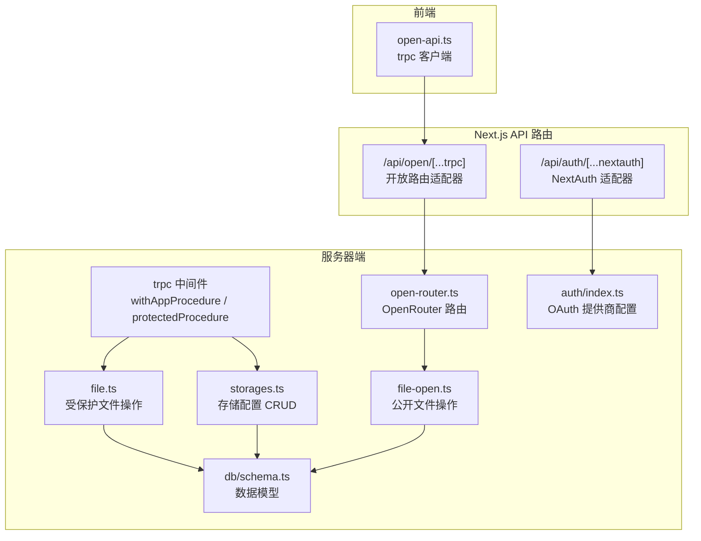
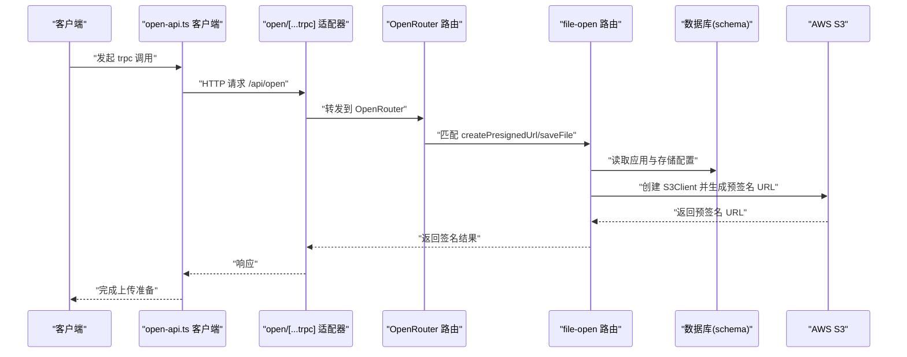
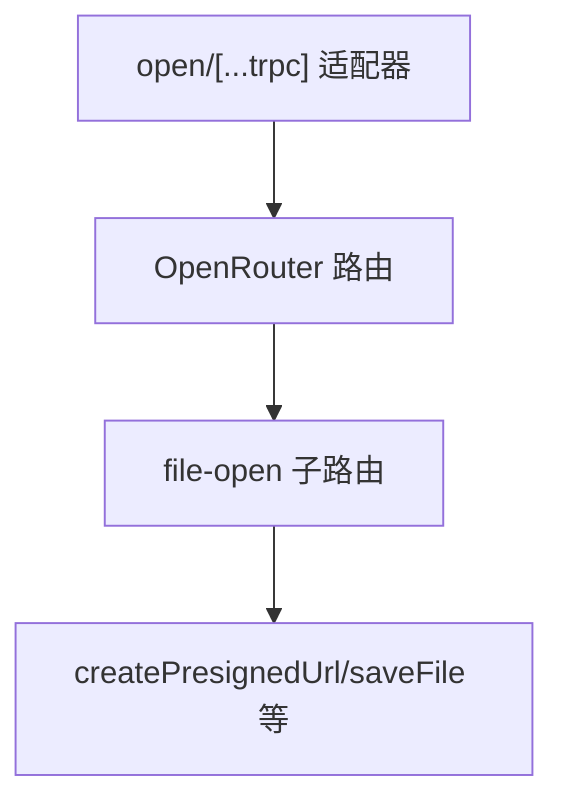
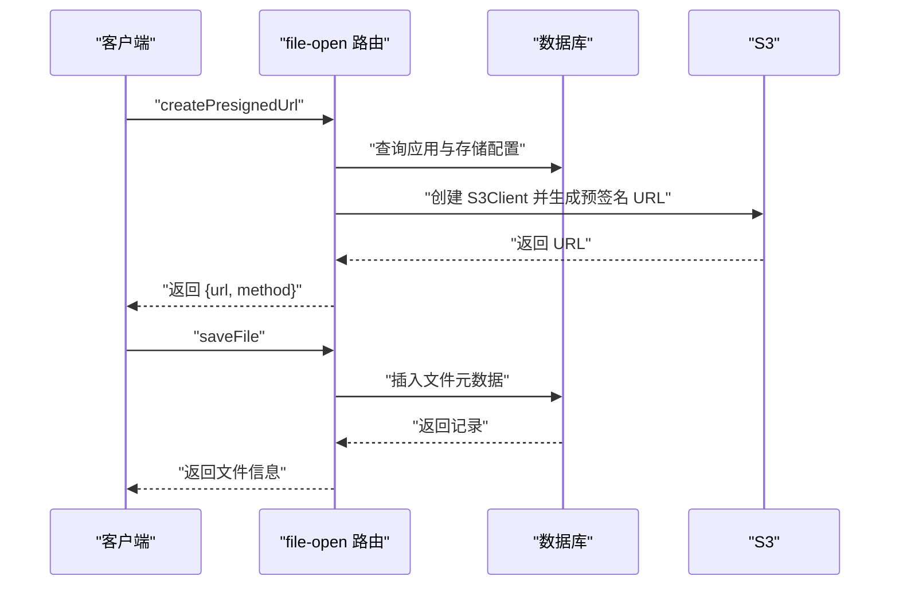
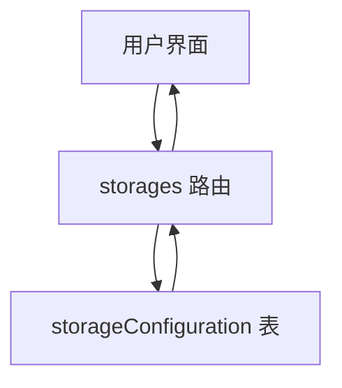
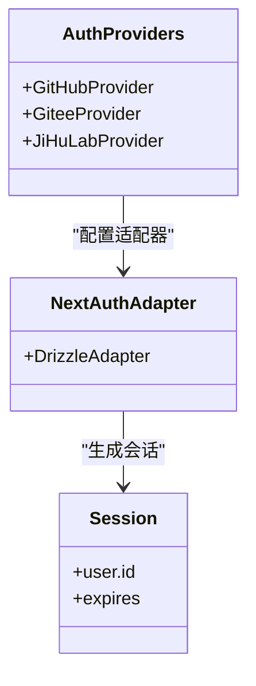
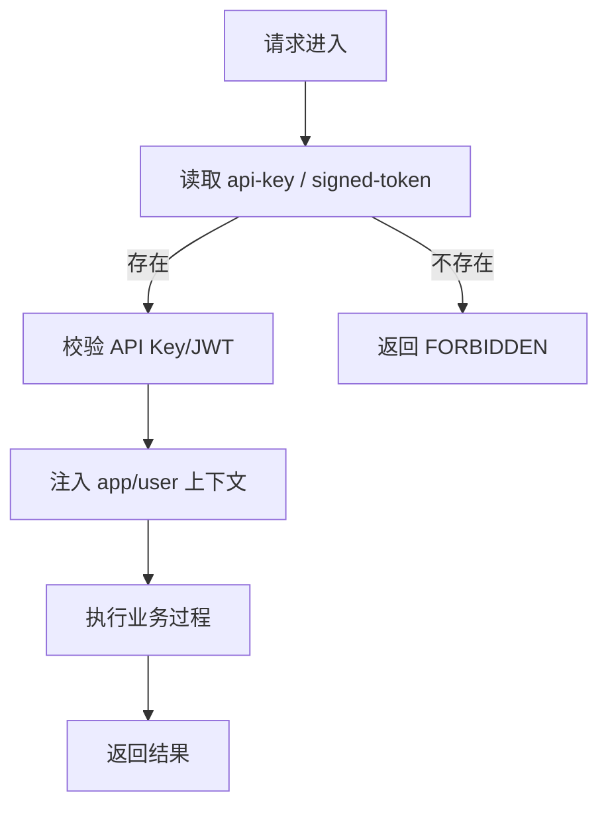
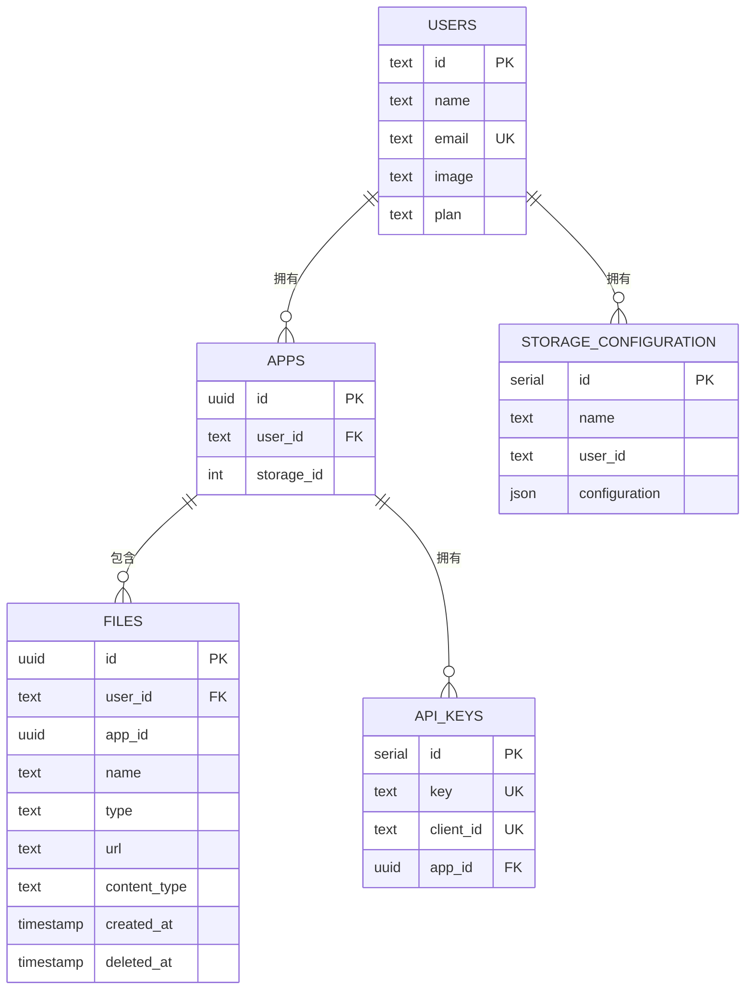
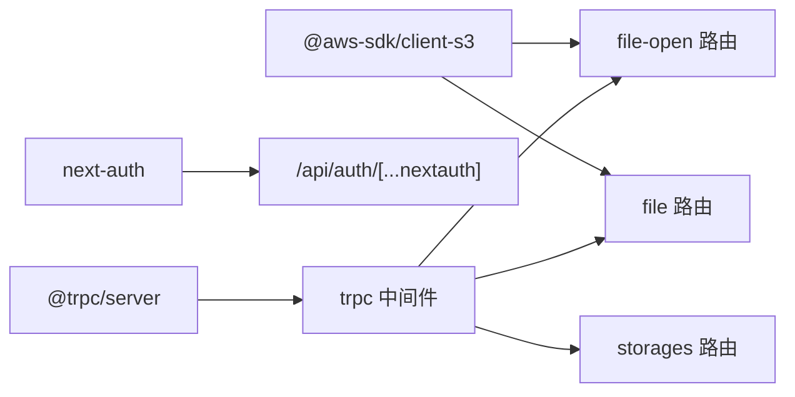

# 第三方集成

<cite>
**本文引用的文件**
- [src/server/open-router.ts](file://src/server/open-router.ts)
- [src/server/routes/file-open.ts](file://src/server/routes/file-open.ts)
- [src/server/routes/file.ts](file://src/server/routes/file.ts)
- [src/server/routes/storages.ts](file://src/server/routes/storages.ts)
- [src/server/trpc-middlewares/trpc.ts](file://src/server/trpc-middlewares/trpc.ts)
- [src/server/auth/index.ts](file://src/server/auth/index.ts)
- [src/app/api/auth/[...nextauth]/route.ts](file://src/app/api/auth/[...nextauth]/route.ts)
- [src/app/api/open/[...trpc]/route.ts](file://src/app/api/open/[...trpc]/route.ts)
- [src/utils/open-api.ts](file://src/utils/open-api.ts)
- [src/utils/open-router-dts.ts](file://src/utils/open-router-dts.ts)
- [src/server/db/schema.ts](file://src/server/db/schema.ts)
- [package.json](file://package.json)
- [README.Docker.md](file://README.Docker.md)
</cite>

## 目录

1. [简介](#简介)
2. [项目结构](#项目结构)
3. [核心组件](#核心组件)
4. [架构总览](#架构总览)
5. [详细组件分析](#详细组件分析)
6. [依赖关系分析](#依赖关系分析)
7. [性能考虑](#性能考虑)
8. [故障排查指南](#故障排查指南)
9. [结论](#结论)
10. [附录](#附录)

## 简介

本文件面向 Image SaaS 项目的第三方集成开发者，系统化说明如何集成外部服务与 API，包括：

- AWS S3 SDK 的客户端初始化、签名上传 URL 生成与文件元数据持久化
- 认证提供商（GitHub、Gitee、JiHuLab）的扩展配置与会话管理
- OpenRouter 路由与跨域访问控制的开放接口设计
- API 协议适配（trpc）、数据格式转换与错误处理策略
- 凭据安全、配置管理与连接池优化建议
- 监控指标、日志记录与故障恢复机制
- 服务发现、负载均衡与高可用部署建议
- 提供可复用的集成模板与安全最佳实践

## 项目结构

项目采用基于功能模块的组织方式，第三方集成主要分布在以下层次：

- 服务器端路由层：负责与外部服务交互（S3、认证）
- 中间件层：统一处理会话、鉴权与请求上下文
- 数据模型层：定义存储配置、API Key、文件元数据等结构
- 前端工具层：封装 trpc 客户端与类型导出

**图表来源**

- [src/utils/open-api.ts:1-14](file://src/utils/open-api.ts#L1-L14)
- [src/app/api/open/[...trpc]/route.ts](file://src/app/api/open/[...trpc]/route.ts#L1-L31)
- [src/app/api/auth/[...nextauth]/route.ts](file://src/app/api/auth/[...nextauth]/route.ts#L1-L7)
- [src/server/open-router.ts:1-10](file://src/server/open-router.ts#L1-L10)
- [src/server/routes/file-open.ts:1-197](file://src/server/routes/file-open.ts#L1-L197)
- [src/server/routes/file.ts:1-561](file://src/server/routes/file.ts#L1-L561)
- [src/server/routes/storages.ts:1-74](file://src/server/routes/storages.ts#L1-L74)
- [src/server/trpc-middlewares/trpc.ts:1-130](file://src/server/trpc-middlewares/trpc.ts#L1-L130)
- [src/server/auth/index.ts:1-163](file://src/server/auth/index.ts#L1-L163)
- [src/server/db/schema.ts:1-270](file://src/server/db/schema.ts#L1-L270)

**章节来源**

- [src/utils/open-api.ts:1-14](file://src/utils/open-api.ts#L1-L14)
- [src/app/api/open/[...trpc]/route.ts](file://src/app/api/open/[...trpc]/route.ts#L1-L31)
- [src/app/api/auth/[...nextauth]/route.ts](file://src/app/api/auth/[...nextauth]/route.ts#L1-L7)
- [src/server/open-router.ts:1-10](file://src/server/open-router.ts#L1-L10)
- [src/server/routes/file-open.ts:1-197](file://src/server/routes/file-open.ts#L1-L197)
- [src/server/routes/file.ts:1-561](file://src/server/routes/file.ts#L1-L561)
- [src/server/routes/storages.ts:1-74](file://src/server/routes/storages.ts#L1-L74)
- [src/server/trpc-middlewares/trpc.ts:1-130](file://src/server/trpc-middlewares/trpc.ts#L1-L130)
- [src/server/auth/index.ts:1-163](file://src/server/auth/index.ts#L1-L163)
- [src/server/db/schema.ts:1-270](file://src/server/db/schema.ts#L1-L270)

## 核心组件

- OpenRouter 路由：聚合公开文件操作子路由，作为开放 API 的入口。
- 文件操作路由（受保护/公开）：提供预签名 URL 生成、文件列表、分页查询、软删除与永久删除等能力。
- 存储配置路由：提供用户维度的存储配置 CRUD，用于保存 S3 凭据与端点。
- trpc 中间件：统一注入会话与应用上下文，支持 API Key 与 JWT 签名令牌两种鉴权模式。
- 认证与 OAuth：集成 GitHub、Gitee、JiHuLab，并支持 SKIP_LOGIN 管理员快速登录。
- 数据模型：定义存储配置、API Key、文件元数据等表结构及关系。

**章节来源**

- [src/server/open-router.ts:1-10](file://src/server/open-router.ts#L1-L10)
- [src/server/routes/file-open.ts:1-197](file://src/server/routes/file-open.ts#L1-L197)
- [src/server/routes/file.ts:1-561](file://src/server/routes/file.ts#L1-L561)
- [src/server/routes/storages.ts:1-74](file://src/server/routes/storages.ts#L1-L74)
- [src/server/trpc-middlewares/trpc.ts:1-130](file://src/server/trpc-middlewares/trpc.ts#L1-L130)
- [src/server/auth/index.ts:1-163](file://src/server/auth/index.ts#L1-L163)
- [src/server/db/schema.ts:154-200](file://src/server/db/schema.ts#L154-L200)

## 架构总览

下图展示从客户端到开放 API、再到 S3 的调用链路与鉴权流程。

**图表来源**

- [src/utils/open-api.ts:1-14](file://src/utils/open-api.ts#L1-L14)
- [src/app/api/open/[...trpc]/route.ts](file://src/app/api/open/[...trpc]/route.ts#L1-L31)
- [src/server/open-router.ts:1-10](file://src/server/open-router.ts#L1-L10)
- [src/server/routes/file-open.ts:30-87](file://src/server/routes/file-open.ts#L30-L87)
- [src/server/db/schema.ts:164-173](file://src/server/db/schema.ts#L164-L173)

## 详细组件分析

### 组件一：OpenRouter 与开放 API 适配

- 职责：聚合公开文件操作路由，暴露为开放 API；在适配器中设置跨域头，允许携带 api-key。
- 关键点：
  - 路由聚合：将 file-open 子路由挂载至 openRouter。
  - 适配器：使用 fetchRequestHandler 处理 trpc 请求，追加 CORS 头部。
  - 类型导出：通过 open-router-dts.ts 导出 OpenRouter 类型，便于客户端强类型使用。

**图表来源**

- [src/app/api/open/[...trpc]/route.ts](file://src/app/api/open/[...trpc]/route.ts#L1-L31)
- [src/server/open-router.ts:1-10](file://src/server/open-router.ts#L1-L10)
- [src/server/routes/file-open.ts:30-87](file://src/server/routes/file-open.ts#L30-L87)
- [src/utils/open-router-dts.ts:1-2](file://src/utils/open-router-dts.ts#L1-L2)

**章节来源**

- [src/server/open-router.ts:1-10](file://src/server/open-router.ts#L1-L10)
- [src/app/api/open/[...trpc]/route.ts](file://src/app/api/open/[...trpc]/route.ts#L1-L31)
- [src/utils/open-router-dts.ts:1-2](file://src/utils/open-router-dts.ts#L1-L2)

### 组件二：文件操作（公开与受保护）

- 公开文件操作（file-open）：
  - 生成预签名 URL：根据应用绑定的存储配置创建 S3Client，生成 PUT 预签名 URL，有效期约 2 分钟。
  - 保存文件元数据：解析上传路径，写入数据库 files 表。
- 受保护文件操作（file）：
  - 增强校验：当应用未绑定存储或用户无权限时抛出明确错误。
  - 列表与分页：支持游标分页、排序与多维搜索（名称、标签、时间范围）。
  - 软删除与批量操作：支持删除、批量删除、恢复与永久删除（含待清理过期时间）。

**图表来源**

- [src/server/routes/file-open.ts:30-87](file://src/server/routes/file-open.ts#L30-L87)
- [src/server/routes/file-open.ts:88-112](file://src/server/routes/file-open.ts#L88-L112)
- [src/server/db/schema.ts:120-142](file://src/server/db/schema.ts#L120-L142)

**章节来源**

- [src/server/routes/file-open.ts:1-197](file://src/server/routes/file-open.ts#L1-L197)
- [src/server/routes/file.ts:26-90](file://src/server/routes/file.ts#L26-L90)
- [src/server/routes/file.ts:120-234](file://src/server/routes/file.ts#L120-L234)
- [src/server/routes/file.ts:235-342](file://src/server/routes/file.ts#L235-L342)
- [src/server/db/schema.ts:120-142](file://src/server/db/schema.ts#L120-L142)

### 组件三：存储配置与 S3 凭据管理

- 存储配置 CRUD：支持按用户维度列出、创建、更新存储配置，字段包含 bucket、region、accessKeyId、secretAccessKey、apiEndPoint。
- 数据模型：storageConfiguration 表存储 JSON 配置，与用户建立一对多关系。
- 安全建议：
  - secretAccessKey 仅在服务端使用，不回传给前端。
  - 建议在生产环境使用 IAM 角色或临时凭证，避免长期密钥泄露风险。

**图表来源**

- [src/server/routes/storages.ts:1-74](file://src/server/routes/storages.ts#L1-L74)
- [src/server/db/schema.ts:164-183](file://src/server/db/schema.ts#L164-L183)

**章节来源**

- [src/server/routes/storages.ts:1-74](file://src/server/routes/storages.ts#L1-L74)
- [src/server/db/schema.ts:154-183](file://src/server/db/schema.ts#L154-L183)

### 组件四：认证与 OAuth 提供商扩展

- NextAuth 配置：集成 GitHub、Gitee、JiHuLab 三大 OAuth 提供商，支持自定义授权、令牌与用户信息端点。
- 会话扩展：在 SKIP_LOGIN 模式下可直接返回管理员会话，便于本地开发与测试。
- 适配器：/api/auth/[...nextauth] 路由统一暴露 NextAuth 处理器，支持 GET/POST。

**图表来源**

- [src/server/auth/index.ts:1-163](file://src/server/auth/index.ts#L1-L163)
- [src/app/api/auth/[...nextauth]/route.ts](file://src/app/api/auth/[...nextauth]/route.ts#L1-L7)

**章节来源**

- [src/server/auth/index.ts:1-163](file://src/server/auth/index.ts#L1-L163)
- [src/app/api/auth/[...nextauth]/route.ts](file://src/app/api/auth/[...nextauth]/route.ts#L1-L7)

### 组件五：trpc 中间件与鉴权策略

- withAppProcedure：优先从请求头读取 api-key 或 signed-token，校验通过后注入 app 与 user 上下文。
- protectedProcedure：强制要求已登录会话，否则拒绝访问。
- 日志中间件：记录每次请求耗时，便于性能分析与定位慢查询。

**图表来源**

- [src/server/trpc-middlewares/trpc.ts:47-127](file://src/server/trpc-middlewares/trpc.ts#L47-L127)
- [src/server/trpc-middlewares/trpc.ts:30-45](file://src/server/trpc-middlewares/trpc.ts#L30-L45)

**章节来源**

- [src/server/trpc-middlewares/trpc.ts:1-130](file://src/server/trpc-middlewares/trpc.ts#L1-L130)

### 组件六：数据模型与关系

- 文件表 files：存储文件元数据（名称、类型、URL、内容类型、所属用户与应用），支持软删除与游标索引。
- 存储配置表 storageConfiguration：JSON 字段保存 S3 凭据与端点，与用户建立一对多关系。
- API Key 表 apiKeys：存储服务端 API Key 与客户端 ID，用于开放 API 鉴权。

**图表来源**

- [src/server/db/schema.ts:18-26](file://src/server/db/schema.ts#L18-L26)
- [src/server/db/schema.ts:120-142](file://src/server/db/schema.ts#L120-L142)
- [src/server/db/schema.ts:164-183](file://src/server/db/schema.ts#L164-L183)
- [src/server/db/schema.ts:185-200](file://src/server/db/schema.ts#L185-L200)

**章节来源**

- [src/server/db/schema.ts:1-270](file://src/server/db/schema.ts#L1-L270)

## 依赖关系分析

- 外部依赖：
  - AWS S3 SDK：用于创建 S3Client 与生成预签名 URL。
  - NextAuth：用于 OAuth 登录与会话管理。
  - trpc：用于前后端通信与中间件链路。
- 内部耦合：
  - file-open 与 file 路由共享 S3 凭据读取与预签名 URL 生成逻辑。
  - trpc 中间件为所有受保护路由提供统一鉴权与上下文注入。
  - 数据模型为存储配置、API Key 与文件元数据提供一致的数据契约。

**图表来源**

- [package.json:14-66](file://package.json#L14-L66)
- [src/server/routes/file-open.ts:3-8](file://src/server/routes/file-open.ts#L3-L8)
- [src/server/routes/file.ts:3-8](file://src/server/routes/file.ts#L3-L8)
- [src/app/api/auth/[...nextauth]/route.ts](file://src/app/api/auth/[...nextauth]/route.ts#L1-L7)
- [src/server/trpc-middlewares/trpc.ts:1-130](file://src/server/trpc-middlewares/trpc.ts#L1-L130)

**章节来源**

- [package.json:14-66](file://package.json#L14-L66)
- [src/server/routes/file-open.ts:1-197](file://src/server/routes/file-open.ts#L1-L197)
- [src/server/routes/file.ts:1-561](file://src/server/routes/file.ts#L1-L561)
- [src/server/trpc-middlewares/trpc.ts:1-130](file://src/server/trpc-middlewares/trpc.ts#L1-L130)

## 性能考虑

- 预签名 URL 有效期：当前为约 2 分钟，建议根据上传规模与网络状况调整，避免频繁重建客户端。
- S3Client 生命周期：当前在每次请求中创建新客户端，建议在进程内复用或使用连接池（如通过 SDK 默认行为）以减少握手开销。
- 查询优化：文件表已建立游标索引，分页查询应结合游标与排序字段，避免大偏移扫描。
- 中间件日志：调试阶段开启耗时日志，生产环境建议降级或集中化输出，避免 I/O 抖动。

[本节为通用指导，无需“章节来源”]

## 故障排查指南

- 预签名 URL 失败：
  - 检查应用是否绑定有效存储配置（bucket、region、凭据）。
  - 核对 apiEndPoint 是否正确，以及网络可达性。
- 文件保存失败：
  - 确认请求头中携带正确的 api-key 或 signed-token。
  - 校验用户与应用权限，确保用户对目标应用有访问权。
- OAuth 登录异常：
  - 检查各提供商的 clientId 与 clientSecret 是否正确配置。
  - 在 SKIP_LOGIN 模式下确认管理员用户创建成功。
- CORS 问题：
  - 确认开放 API 适配器已设置 Access-Control-Allow-Origin、Methods、Headers。

**章节来源**

- [src/server/routes/file-open.ts:40-58](file://src/server/routes/file-open.ts#L40-L58)
- [src/server/routes/file.ts:36-61](file://src/server/routes/file.ts#L36-L61)
- [src/server/trpc-middlewares/trpc.ts:47-127](file://src/server/trpc-middlewares/trpc.ts#L47-L127)
- [src/server/auth/index.ts:65-101](file://src/server/auth/index.ts#L65-L101)
- [src/app/api/open/[...trpc]/route.ts](file://src/app/api/open/[...trpc]/route.ts#L13-L28)

## 结论

本项目通过清晰的路由分层、统一的 trpc 中间件与严谨的数据模型，实现了对 AWS S3 与 OAuth 提供商的稳健集成。开放 API 与受保护 API 的分离设计，既满足了外部调用场景，又保证了内部资源的安全访问。建议在生产环境中进一步完善凭据轮换、连接池复用与监控告警体系，以提升整体稳定性与可观测性。

[本节为总结，无需“章节来源”]

## 附录

### A. OpenRouter 集成模板（步骤说明）

- 步骤 1：在前端引入 open-api.ts 客户端，配置 NEXT_PUBLIC_API_URL。
- 步骤 2：在后端定义 openRouter 并挂载 file-open 子路由。
- 步骤 3：在 /api/open/[...trpc] 适配器中启用 CORS 并转发请求。
- 步骤 4：在 file-open 路由中读取应用与存储配置，生成预签名 URL 并保存文件元数据。

**章节来源**

- [src/utils/open-api.ts:1-14](file://src/utils/open-api.ts#L1-L14)
- [src/server/open-router.ts:1-10](file://src/server/open-router.ts#L1-L10)
- [src/app/api/open/[...trpc]/route.ts](file://src/app/api/open/[...trpc]/route.ts#L1-L31)
- [src/server/routes/file-open.ts:30-87](file://src/server/routes/file-open.ts#L30-L87)

### B. S3 凭据安全与配置管理

- 凭据存储：将 accessKeyId 与 secretAccessKey 存入 storageConfiguration 配置 JSON，仅在服务端使用。
- 环境变量：在部署时通过环境变量注入各提供商的 clientId/clientSecret。
- 最小权限：为 S3 凭据授予最小必要权限，避免全局写入权限。
- 轮换策略：定期轮换密钥，配合过期时间与审计日志追踪变更。

**章节来源**

- [src/server/routes/storages.ts:15-39](file://src/server/routes/storages.ts#L15-L39)
- [src/server/db/schema.ts:164-183](file://src/server/db/schema.ts#L164-L183)
- [src/server/auth/index.ts:130-137](file://src/server/auth/index.ts#L130-L137)

### C. OAuth 提供商扩展配置

- 新增提供商：仿照 Gitee/JiHuLab 的 Provider 对象，填写 authorization、token、userinfo 端点与 profile 映射。
- 环境变量：为新增提供商配置 clientId 与 clientSecret。
- 会话回调：可在 callbacks.session 中扩展用户属性或计划状态。

**章节来源**

- [src/server/auth/index.ts:11-63](file://src/server/auth/index.ts#L11-L63)
- [src/server/auth/index.ts:130-137](file://src/server/auth/index.ts#L130-L137)

### D. Webhook 与实时同步（扩展建议）

- 当前未实现 Webhook 处理与实时同步，建议：
  - 在存储配置中增加 webhookEndpoint 与密钥字段。
  - 在文件保存后触发异步任务，向 webhookEndpoint 发送事件。
  - 引入消息队列（如 SQS/RabbitMQ）解耦与重试。

[本节为概念性建议，无需“章节来源”]

### E. 监控指标、日志与故障恢复

- 指标建议：S3 请求成功率/延迟、trpc 请求耗时、OAuth 登录成功率、API Key 使用次数。
- 日志：集中化输出请求上下文与错误栈，区分 DEBUG/INFO/WARN/ERROR 级别。
- 故障恢复：对 S3 请求增加指数退避重试；对数据库与外部 API 调用设置超时与熔断。

**章节来源**

- [README.Docker.md:162-230](file://README.Docker.md#L162-L230)

### F. 服务发现、负载均衡与高可用

- 多实例部署：使用 Docker Swarm/Kubernetes 部署多副本，配置健康检查与滚动升级。
- 负载均衡：在网关层（Nginx/云 LB）分发请求，开启会话亲和或无状态会话。
- 数据高可用：PostgreSQL 使用主从复制与备份策略；S3 使用跨区域复制与版本控制。

**章节来源**

- [README.Docker.md:197-225](file://README.Docker.md#L197-L225)
