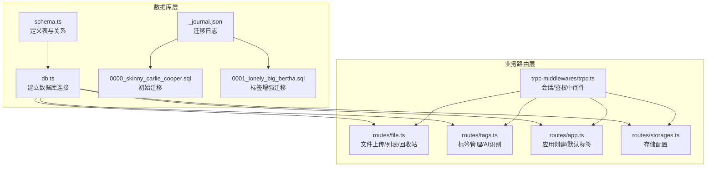
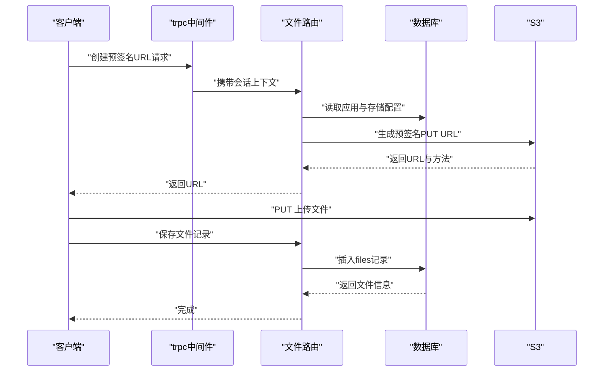
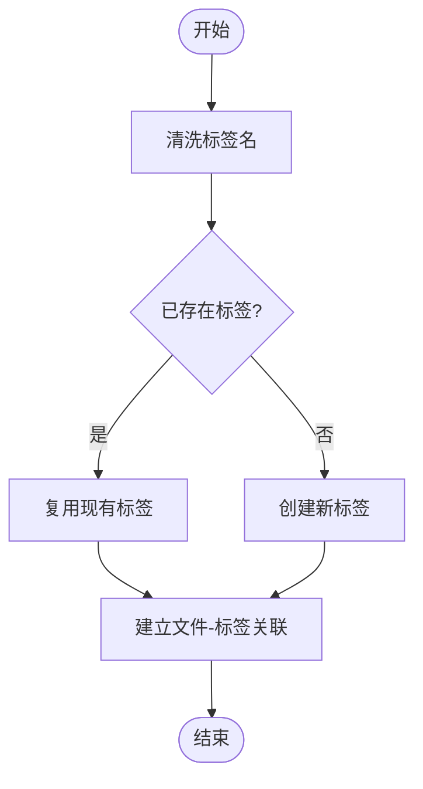
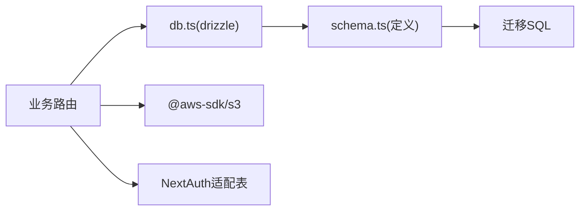

# 数据库设计

<cite>
**本文引用的文件**
- [schema.ts](file://src/server/db/schema.ts)
- [db.ts](file://src/server/db/db.ts)
- [validate-schema.ts](file://src/server/db/validate-schema.ts)
- [drizzle.config.ts](file://drizzle.config.ts)
- [0000_skinny_carlie_cooper.sql](file://drizzle/0000_skinny_carlie_cooper.sql)
- [0001_lonely_big_bertha.sql](file://drizzle/0001_lonely_big_bertha.sql)
- [0000_snapshot.json](file://drizzle/meta/0000_snapshot.json)
- [0001_snapshot.json](file://drizzle/meta/0001_snapshot.json)
- [file.ts](file://src/server/routes/file.ts)
- [app.ts](file://src/server/routes/app.ts)
- [tags.ts](file://src/server/routes/tags.ts)
- [storages.ts](file://src/server/routes/storages.ts)
- [trpc.ts](file://src/server/trpc-middlewares/trpc.ts)
- [_journal.json](file://drizzle/meta/_journal.json)
</cite>

## 目录

1. [简介](#简介)
2. [项目结构](#项目结构)
3. [核心组件](#核心组件)
4. [架构总览](#架构总览)
5. [详细组件分析](#详细组件分析)
6. [依赖分析](#依赖分析)
7. [性能考量](#性能考量)
8. [故障排查指南](#故障排查指南)
9. [结论](#结论)
10. [附录](#附录)

## 简介

本文件为 Image SaaS 项目的数据库设计文档，聚焦于数据模型关系、表结构与字段定义、实体间关系与主外键约束、索引策略、数据验证与业务规则、数据完整性保障、数据访问模式、缓存策略与性能优化、数据生命周期与归档、迁移路径与版本管理、备份恢复策略，以及数据安全与隐私、访问控制等主题。文档基于仓库中的 Drizzle ORM 定义、SQL 迁移脚本与业务路由实现进行系统性梳理与可视化呈现。

## 项目结构

数据库层采用 Drizzle ORM + PostgreSQL，通过 schema.ts 定义表结构与关系，drizzle.config.ts 配置迁移输出目录与方言，迁移脚本位于 drizzle/ 目录，运行时通过 db.ts 建立连接并注入 schema。



图表来源

- [schema.ts:1-270](file://src/server/db/schema.ts#L1-L270)
- [db.ts:1-9](file://src/server/db/db.ts#L1-L9)
- [drizzle.config.ts:1-14](file://drizzle.config.ts#L1-L14)
- [0000_skinny_carlie_cooper.sql:1-116](file://drizzle/0000_skinny_carlie_cooper.sql#L1-L116)
- [0001_lonely_big_bertha.sql:1-8](file://drizzle/0001_lonely_big_bertha.sql#L1-L8)
- [\_journal.json:1-20](file://drizzle/meta/_journal.json#L1-L20)
- [file.ts:1-561](file://src/server/routes/file.ts#L1-L561)
- [tags.ts:1-735](file://src/server/routes/tags.ts#L1-L735)
- [app.ts:1-88](file://src/server/routes/app.ts#L1-L88)
- [storages.ts:1-74](file://src/server/routes/storages.ts#L1-L74)
- [trpc.ts:1-130](file://src/server/trpc-middlewares/trpc.ts#L1-L130)

章节来源

- [schema.ts:1-270](file://src/server/db/schema.ts#L1-L270)
- [db.ts:1-9](file://src/server/db/db.ts#L1-L9)
- [drizzle.config.ts:1-14](file://drizzle.config.ts#L1-L14)
- [0000_skinny_carlie_cooper.sql:1-116](file://drizzle/0000_skinny_caroper.sql#L1-L116)
- [0001_lonely_big_bertha.sql:1-8](file://drizzle/0001_lonely_big_bertha.sql#L1-L8)
- [\_journal.json:1-20](file://drizzle/meta/_journal.json#L1-L20)

## 核心组件

- 用户与认证：users、accounts、sessions、verificationTokens、authenticator
- 应用与存储：apps、storageConfiguration、apiKeys
- 文件与标签：files、tags、files_tags
- 数据校验：validate-schema.ts 基于 drizzle-zod 的插入/查询 Schema

章节来源

- [schema.ts:28-38](file://src/server/db/schema.ts#L28-L38)
- [schema.ts:47-118](file://src/server/db/schema.ts#L47-L118)
- [schema.ts:18-26](file://src/server/db/schema.ts#L18-L26)
- [schema.ts:164-173](file://src/server/db/schema.ts#L164-L173)
- [schema.ts:185-200](file://src/server/db/schema.ts#L185-L200)
- [schema.ts:120-136](file://src/server/db/schema.ts#L120-L136)
- [schema.ts:202-224](file://src/server/db/schema.ts#L202-L224)
- [schema.ts:242-258](file://src/server/db/schema.ts#L242-L258)
- [validate-schema.ts:1-18](file://src/server/db/validate-schema.ts#L1-L18)

## 架构总览

下图展示数据库实体与关系，包括主键、外键、索引与业务约束。

```mermaid
erDiagram
USER {
text id PK
text name
text email UK
timestamp emailVerified
text image
text plan
date create_at
}
ACCOUNT {
text userId FK
text type
text provider
text providerAccountId
text refresh_token
text access_token
integer expires_at
text token_type
text scope
text id_token
text session_state
pk provider,providerAccountId
}
SESSION {
text sessionToken PK
text userId FK
timestamp expires
}
AUTHENTICATOR {
text credentialID UK
text userId FK
text providerAccountId
text credentialPublicKey
integer counter
text credentialDeviceType
boolean credentialBackedUp
text transports
pk userId,credentialID
}
APP {
uuid id PK
varchar name
varchar description
timestamp deleted_at
timestamp created_at
text user_id FK
integer storage_id
}
STORAGE_CONFIGURATION {
serial id PK
varchar name
uuid user_id FK
json configuration
timestamp create_at
timestamp deleted_at
}
APIKEYS {
serial id PK
varchar key UK
varchar name
varchar client_id UK
uuid appId FK
timestamp create_at
timestamp deleted_at
}
FILES {
uuid id PK
varchar name
varchar type
timestamp created_at
timestamp deleted_at
timestamp deleted_at_expiration
varchar path
varchar url
text user_id FK
varchar content_type
uuid appId FK
}
TAGS {
uuid id PK
varchar name UK
varchar color
text user_id FK
timestamp created_at
varchar category_type
uuid parent_id FK
uuid app_id
varchar description
integer sort
}
FILES_TAGS {
uuid file_id FK
uuid tag_id FK
timestamp created_at
pk file_id,tag_id
}
USER ||--o{ APP : "拥有"
USER ||--o{ STORAGE_CONFIGURATION : "拥有"
USER ||--o{ FILES : "拥有"
USER ||--o{ TAGS : "拥有"
APP ||--o{ FILES : "包含"
APP ||--o{ APIKEYS : "拥有"
STORAGE_CONFIGURATION ||--o{ APP : "被应用引用"
FILES ||--o{ FILES_TAGS : "被标记"
TAGS ||--o{ FILES_TAGS : "标记"
TAGS }o--|| TAGS : "父子关系"
ACCOUNT }o--|| USER : "由用户持有"
SESSION }o--|| USER : "由用户持有"
AUTHENTICATOR }o--|| USER : "由用户持有"
```

图表来源

- [schema.ts:18-26](file://src/server/db/schema.ts#L18-L26)
- [schema.ts:28-38](file://src/server/db/schema.ts#L28-L38)
- [schema.ts:47-118](file://src/server/db/schema.ts#L47-L118)
- [schema.ts:120-136](file://src/server/db/schema.ts#L120-L136)
- [schema.ts:164-173](file://src/server/db/schema.ts#L164-L173)
- [schema.ts:185-200](file://src/server/db/schema.ts#L185-L200)
- [schema.ts:202-224](file://src/server/db/schema.ts#L202-L224)
- [schema.ts:242-258](file://src/server/db/schema.ts#L242-L258)

## 详细组件分析

### 用户与认证模块

- 表结构要点
  - users：主键 id，email 唯一；带 plan、create_at 等字段
  - accounts/sessions/authenticator：NextAuth 适配表，复合主键与外键约束
  - verificationTokens：标识符+令牌唯一组合
- 关系
  - users 与 accounts/session/authenticator 一对一/多对一
  - 外键 onDelete cascade，确保级联清理
- 安全与隐私
  - 仅存储必要字段，敏感凭据不落库；令牌有效期与刷新机制由上游处理

章节来源

- [schema.ts:28-38](file://src/server/db/schema.ts#L28-L38)
- [schema.ts:47-118](file://src/server/db/schema.ts#L47-L118)

### 应用与存储模块

- 表结构要点
  - apps：应用基本信息，关联用户与存储配置
  - storageConfiguration：JSON 存储 S3 配置，含桶、区域、密钥等
  - apiKeys：应用级 API 密钥与客户端 ID，支持签名令牌访问
- 关系
  - apps 与 storageConfiguration 多对一
  - apps 与 apiKeys 一对多
- 业务规则
  - 应用创建时自动为用户生成默认分类标签
  - 更改存储需校验归属

章节来源

- [schema.ts:18-26](file://src/server/db/schema.ts#L18-L26)
- [schema.ts:164-173](file://src/server/db/schema.ts#L164-L173)
- [schema.ts:185-200](file://src/server/db/schema.ts#L185-L200)
- [app.ts:17-48](file://src/server/routes/app.ts#L17-L48)
- [storages.ts:7-74](file://src/server/routes/storages.ts#L7-L74)
- [trpc.ts:30-127](file://src/server/trpc-middlewares/trpc.ts#L30-L127)

### 文件与标签模块

- 表结构要点
  - files：文件元数据、路径、URL、内容类型、软删除与过期时间
  - tags：标签树形结构（父子）、分类类型、排序、描述
  - files_tags：多对多关联，防止重复插入
- 关系
  - files 与 users/apps 多对一
  - tags 与用户/应用/父标签多对一
  - files_tags 与 files/tags 多对多
- 索引策略
  - files 上 cursor_idx（id, created_at）用于游标分页
  - files_tags/tag 上复合索引加速关联与查询
  - tags 上 user/name/category/parent 索引

章节来源

- [schema.ts:120-136](file://src/server/db/schema.ts#L120-L136)
- [schema.ts:202-224](file://src/server/db/schema.ts#L202-L224)
- [schema.ts:242-258](file://src/server/db/schema.ts#L242-L258)
- [0000_skinny_carlie_cooper.sql:112-116](file://drizzle/0000_skinny_carlie_cooper.sql#L112-L116)
- [0001_lonely_big_bertha.sql:6-8](file://drizzle/0001_lonely_big_bertha.sql#L6-L8)

### 数据访问模式与业务流程

- 文件上传与持久化
  - 生成预签名 URL -> 上传到 S3 -> 回写数据库记录
- 列表与分页
  - 支持游标分页、排序、搜索（文件名/标签名）、时间范围
- 软删除与回收站
  - 删除设置 deleteAt 与 deletedAtExpiration，回收站按删除时间倒序
- 标签管理
  - 创建/更新/删除标签；批量关联文件；AI 识别标签



图表来源

- [file.ts:27-90](file://src/server/routes/file.ts#L27-L90)
- [file.ts:91-118](file://src/server/routes/file.ts#L91-L118)
- [trpc.ts:30-45](file://src/server/trpc-middlewares/trpc.ts#L30-L45)

章节来源

- [file.ts:120-234](file://src/server/routes/file.ts#L120-L234)
- [file.ts:236-394](file://src/server/routes/file.ts#L236-L394)
- [file.ts:501-557](file://src/server/routes/file.ts#L501-L557)

### 标签与 AI 识别流程



图表来源

- [tags.ts:246-288](file://src/server/routes/tags.ts#L246-L288)
- [tags.ts:416-531](file://src/server/routes/tags.ts#L416-L531)

章节来源

- [tags.ts:47-114](file://src/server/routes/tags.ts#L47-L114)
- [tags.ts:290-398](file://src/server/routes/tags.ts#L290-L398)
- [tags.ts:400-413](file://src/server/routes/tags.ts#L400-L413)

## 依赖分析

- 组件耦合
  - 路由层依赖 db.ts 提供的 drizzle 实例
  - schema.ts 定义的 relations 与索引在迁移中落地
  - trpc 中间件统一注入会话与 API Key/签名令牌鉴权
- 外部依赖
  - AWS S3 SDK 用于生成预签名 URL
  - NextAuth 适配表用于认证



图表来源

- [db.ts:1-9](file://src/server/db/db.ts#L1-L9)
- [schema.ts:1-270](file://src/server/db/schema.ts#L1-L270)
- [file.ts:1-16](file://src/server/routes/file.ts#L1-L16)
- [trpc.ts:1-130](file://src/server/trpc-middlewares/trpc.ts#L1-L130)

章节来源

- [db.ts:1-9](file://src/server/db/db.ts#L1-L9)
- [schema.ts:1-270](file://src/server/db/schema.ts#L1-L270)
- [file.ts:1-16](file://src/server/routes/file.ts#L1-L16)
- [trpc.ts:1-130](file://src/server/trpc-middlewares/trpc.ts#L1-L130)

## 性能考量

- 查询路径
  - 文件列表与分页：利用 cursor_idx（id, created_at）实现高效游标翻页
  - 标签查询：tags_user_idx、tags_name_idx、tags_category_idx、tags_parent_idx
  - 多表关联：files_tags_file_idx、files_tags_tag_idx
- 写入路径
  - 批量插入标签-文件关联时使用“忽略重复”策略，避免重复约束开销
- 缓存策略
  - 当前代码未见显式缓存层；建议对高频标签聚合结果与应用配置做进程内缓存，结合失效策略
- 索引与分区
  - 建议对 files.created_at 增加覆盖索引以优化时间范围查询
  - 对大表可考虑按用户维度分区或物化视图加速统计

章节来源

- [0000_skinny_carlie_cooper.sql:112-116](file://drizzle/0000_skinny_carlie_cooper.sql#L112-L116)
- [0001_lonely_big_bertha.sql:6-8](file://drizzle/0001_lonely_big_bertha.sql#L6-L8)
- [tags.ts:342-350](file://src/server/routes/tags.ts#L342-L350)

## 故障排查指南

- 认证与授权
  - 无会话或无效签名令牌：抛出 FORBIDDEN/BAD_REQUEST
  - API Key 不存在或已删除：NOT_FOUND
- 文件操作
  - 软删除/恢复：检查 deleteAt 与 deletedAtExpiration 字段
  - 回收站查询：deleted_at 非空且按删除时间倒序
- 标签管理
  - 名称冲突：标签名在用户维度唯一
  - 未使用标签清理：基于 files_tags 关联的清理

章节来源

- [trpc.ts:30-127](file://src/server/trpc-middlewares/trpc.ts#L30-L127)
- [file.ts:236-394](file://src/server/routes/file.ts#L236-L394)
- [tags.ts:117-243](file://src/server/routes/tags.ts#L117-L243)

## 结论

本数据库设计围绕用户、应用、存储、文件与标签五大域展开，采用 Drizzle ORM 明确的表结构与关系定义，并通过迁移脚本固化到 PostgreSQL。配合路由层的业务逻辑与中间件鉴权，实现了从文件上传、标签管理到软删除与回收站的完整闭环。建议后续在缓存、索引与分区方面进一步优化，并完善归档与备份策略以满足生产环境可靠性要求。

## 附录

### 数据模型与字段定义

- users
  - 主键：id
  - 唯一：email
  - 字段：name、email、emailVerified、image、plan、create_at
- accounts
  - 复合主键：provider、providerAccountId
  - 外键：userId → users(id)（级联删除）
- sessions
  - 主键：sessionToken
  - 外键：userId → users(id)（级联删除）
- authenticator
  - 复合主键：userId、credentialID
  - 唯一：credentialID
  - 外键：userId → users(id)（级联删除）
- apps
  - 主键：id
  - 外键：user_id → users(id)
  - 外键：storage_id → storageConfiguration(id)
- storageConfiguration
  - 主键：id
  - 外键：user_id → users(id)
- apiKeys
  - 主键：id
  - 唯一：key、client_id
  - 外键：appId → apps(id)
- files
  - 主键：id
  - 外键：user_id → users(id)
  - 外键：appId → apps(id)
  - 软删除：deleted_at、deletedAtExpiration
- tags
  - 主键：id
  - 唯一：name（用户维度）
  - 外键：parent_id → tags(id)（自引用，允许空）
- files_tags
  - 复合主键：file_id、tag_id
  - 外键：file_id → files(id)（级联删除）
  - 外键：tag_id → tags(id)（级联删除）

章节来源

- [schema.ts:28-38](file://src/server/db/schema.ts#L28-L38)
- [schema.ts:47-118](file://src/server/db/schema.ts#L47-L118)
- [schema.ts:18-26](file://src/server/db/schema.ts#L18-L26)
- [schema.ts:164-173](file://src/server/db/schema.ts#L164-L173)
- [schema.ts:185-200](file://src/server/db/schema.ts#L185-L200)
- [schema.ts:120-136](file://src/server/db/schema.ts#L120-L136)
- [schema.ts:202-224](file://src/server/db/schema.ts#L202-L224)
- [schema.ts:242-258](file://src/server/db/schema.ts#L242-L258)

### 索引策略

- files：cursor_idx（id, created_at）
- files_tags：file_id、tag_id 索引
- tags：user_id、name、category_type、parent_id 索引

章节来源

- [0000_skinny_carlie_cooper.sql:112-116](file://drizzle/0000_skinny_carlie_cooper.sql#L112-L116)
- [0001_lonely_big_bertha.sql:6-8](file://drizzle/0001_lonely_big_bertha.sql#L6-L8)

### 数据验证与业务规则

- 用户创建：基于 drizzle-zod 的插入 Schema
- 应用创建：名称最小长度校验
- 存储配置：必填桶、区域、密钥等
- 标签：名称长度限制、唯一性、分类类型默认值、父子关系
- 文件：软删除与过期时间、游标分页与搜索条件

章节来源

- [validate-schema.ts:1-18](file://src/server/db/validate-schema.ts#L1-L18)
- [app.ts:18-48](file://src/server/routes/app.ts#L18-L48)
- [storages.ts:15-73](file://src/server/routes/storages.ts#L15-L73)
- [tags.ts:117-243](file://src/server/routes/tags.ts#L117-L243)
- [file.ts:120-234](file://src/server/routes/file.ts#L120-L234)

### 数据生命周期、保留与归档

- 软删除：删除时写入 deleteAt 与 deletedAtExpiration（7 天后过期）
- 回收站：按删除时间倒序列出
- 归档建议：对超过保留期的文件记录与 S3 对象进行归档或清理，结合审计日志追踪

章节来源

- [file.ts:236-394](file://src/server/routes/file.ts#L236-L394)

### 迁移路径、版本管理与备份恢复

- 迁移版本
  - 0000：初始表与索引
  - 0001：tags 表新增分类类型、父子关系、应用关联与索引
- 版本管理
  - drizzle.meta/\_journal.json 记录迁移历史与断点
- 备份恢复
  - 建议定期导出数据库快照并验证恢复流程；对 S3 中的对象独立备份策略

章节来源

- [\_journal.json:1-20](file://drizzle/meta/_journal.json#L1-20)
- [0000_skinny_carlie_cooper.sql:1-116](file://drizzle/0000_skinny_carlie_cooper.sql#L1-L116)
- [0001_lonely_big_bertha.sql:1-8](file://drizzle/0001_lonely_big_bertha.sql#L1-L8)

### 数据安全、隐私与访问控制

- 访问控制
  - 会话中间件强制登录
  - API Key/签名令牌中间件校验与解码
  - 所有操作均绑定用户与应用上下文
- 隐私保护
  - 不存储明文敏感信息；令牌与密钥通过环境变量管理
  - 删除与回收站机制支持合规删除

章节来源

- [trpc.ts:30-127](file://src/server/trpc-middlewares/trpc.ts#L30-L127)
- [file.ts:27-90](file://src/server/routes/file.ts#L27-L90)
