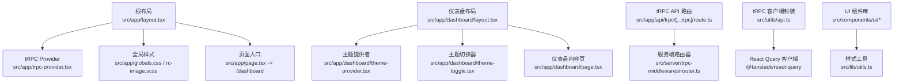
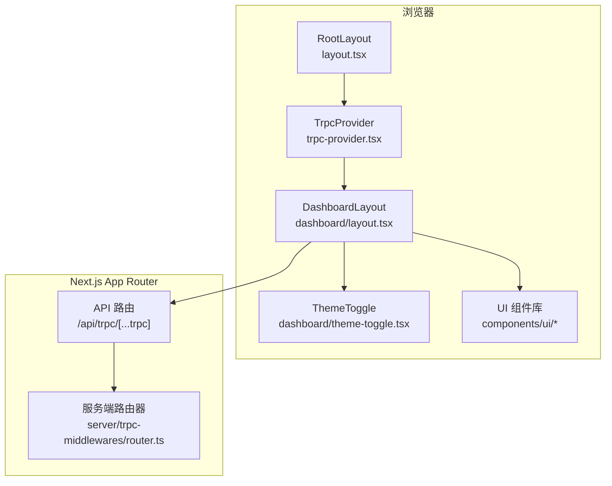
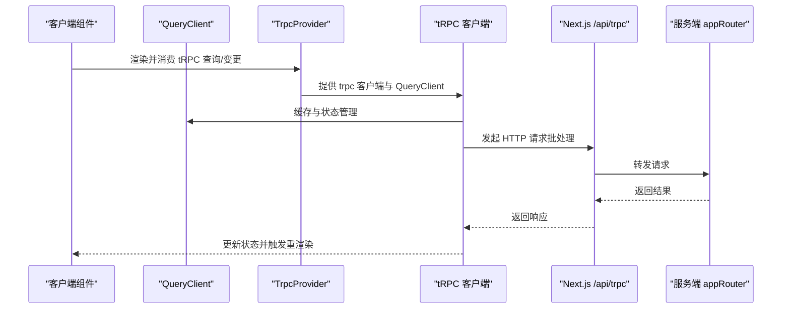
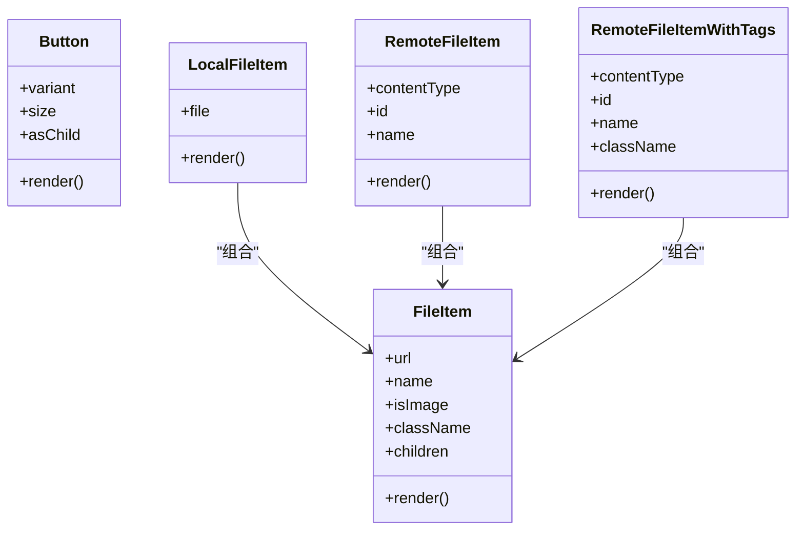
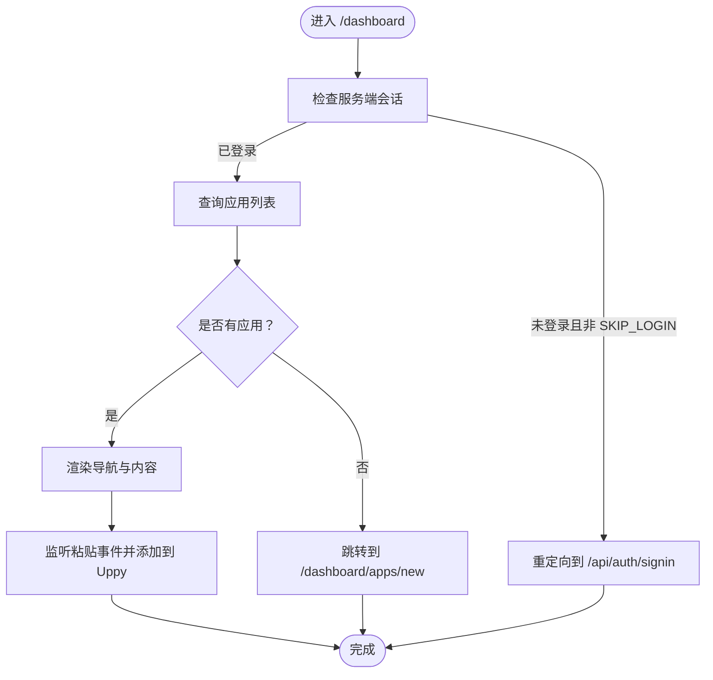
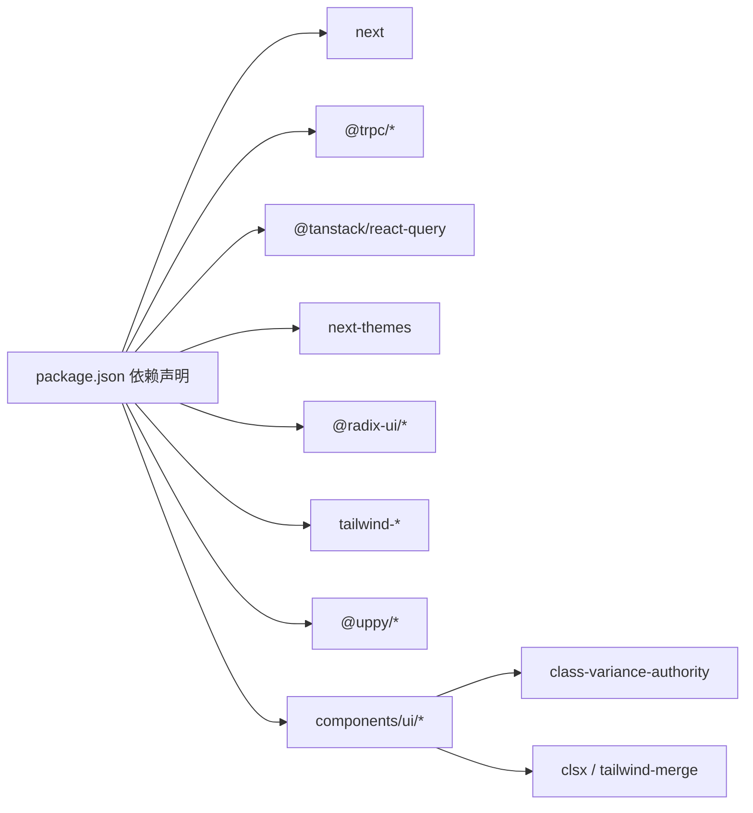

# 前端架构

<cite>
**本文引用的文件**
- [src/app/layout.tsx](file://src/app/layout.tsx)
- [src/app/trpc-provider.tsx](file://src/app/trpc-provider.tsx)
- [src/app/page.tsx](file://src/app/page.tsx)
- [src/app/dashboard/layout.tsx](file://src/app/dashboard/layout.tsx)
- [src/app/dashboard/page.tsx](file://src/app/dashboard/page.tsx)
- [src/app/dashboard/theme-provider.tsx](file://src/app/dashboard/theme-provider.tsx)
- [src/app/dashboard/theme-toggle.tsx](file://src/app/dashboard/theme-toggle.tsx)
- [src/app/api/trpc/[...trpc]/route.ts](file://src/app/api/trpc/[...trpc]/route.ts)
- [src/server/trpc-middlewares/router.ts](file://src/server/trpc-middlewares/router.ts)
- [src/utils/api.ts](file://src/utils/api.ts)
- [src/lib/utils.ts](file://src/lib/utils.ts)
- [src/components/ui/button.tsx](file://src/components/ui/button.tsx)
- [src/components/feature/file-item.tsx](file://src/components/feature/file-item.tsx)
- [package.json](file://package.json)
</cite>

## 目录

1. [引言](#引言)
2. [项目结构](#项目结构)
3. [核心组件](#核心组件)
4. [架构总览](#架构总览)
5. [组件与页面详解](#组件与页面详解)
6. [依赖关系分析](#依赖关系分析)
7. [性能与体验优化](#性能与体验优化)
8. [故障排查指南](#故障排查指南)
9. [结论](#结论)
10. [附录：最佳实践与示例路径](#附录最佳实践与示例路径)

## 引言

本文件面向 Image SaaS 项目的前端团队与技术读者，系统性梳理基于 Next.js App Router 的前端架构设计、路由策略与页面组织方式；文档化 tRPC Provider 的实现原理与数据流管理；说明 UI 组件库的设计模式、层次结构与样式系统；解释响应式设计原则、主题切换机制与状态管理模式；并提供性能优化策略、缓存机制与用户体验设计建议。文中所有技术细节均以仓库源码为依据，并通过“章节来源”与“图表来源”进行精确溯源。

## 项目结构

项目采用 Next.js App Router 的目录约定组织页面与布局，根布局负责注入全局样式与 tRPC Provider；仪表盘区域通过多插槽布局（navigation slot）承载导航与内容；tRPC API 通过 App Router 的 API 路由统一接入；UI 组件库采用基于 class-variance-authority 的变体模式与 Tailwind 工具类组合；主题切换基于 next-themes；工具函数集中于 lib/utils 中统一处理样式合并。

图表来源

- [src/app/layout.tsx:1-37](file://src/app/layout.tsx#L1-L37)
- [src/app/trpc-provider.tsx:1-18](file://src/app/trpc-provider.tsx#L1-L18)
- [src/app/page.tsx:1-8](file://src/app/page.tsx#L1-L8)
- [src/app/dashboard/layout.tsx:1-49](file://src/app/dashboard/layout.tsx#L1-L49)
- [src/app/dashboard/theme-provider.tsx:1-9](file://src/app/dashboard/theme-provider.tsx#L1-L9)
- [src/app/dashboard/theme-toggle.tsx:1-33](file://src/app/dashboard/theme-toggle.tsx#L1-L33)
- [src/app/api/trpc/[...trpc]/route.ts:1-14](file://src/app/api/trpc/[...trpc]/route.ts#L1-L14)
- [src/server/trpc-middlewares/router.ts:1-20](file://src/server/trpc-middlewares/router.ts#L1-L20)
- [src/utils/api.ts:1-17](file://src/utils/api.ts#L1-L17)
- [src/lib/utils.ts:1-7](file://src/lib/utils.ts#L1-L7)

章节来源

- [src/app/layout.tsx:1-37](file://src/app/layout.tsx#L1-L37)
- [src/app/page.tsx:1-8](file://src/app/page.tsx#L1-L8)
- [src/app/dashboard/layout.tsx:1-49](file://src/app/dashboard/layout.tsx#L1-L49)

## 核心组件

- 根布局与全局注入
  - 根布局负责注入全局字体变量、全局样式与 Toaster 通知组件，并在 <body> 内包裹 tRPC Provider，确保整个应用具备 tRPC 与 React Query 的上下文能力。
  - 参考：[src/app/layout.tsx:21-36](file://src/app/layout.tsx#L21-L36)

- tRPC Provider
  - 使用 createTRPCReact 创建客户端代理，并通过 Provider 将 trpc 客户端与 QueryClient 注入子树；QueryClient 在组件挂载时按需创建，避免重复实例化。
  - 参考：[src/app/trpc-provider.tsx:6-15](file://src/app/trpc-provider.tsx#L6-L15)，[src/utils/api.ts:5-15](file://src/utils/api.ts#L5-L15)

- 页面入口与重定向
  - 首页直接重定向至 /dashboard，保证用户进入主功能区。
  - 参考：[src/app/page.tsx:5-7](file://src/app/page.tsx#L5-L7)

- 仪表盘布局与导航
  - 仪表盘布局通过异步获取服务端会话，未登录且非 SKIP_LOGIN 模式下重定向至登录；顶部导航包含主题切换、用户菜单与插槽 nav 区域用于渲染子路由导航。
  - 参考：[src/app/dashboard/layout.tsx:9-48](file://src/app/dashboard/layout.tsx#L9-L48)

- 主题系统
  - ThemeProvider 包装应用，ThemeToggle 基于 next-themes 切换明暗主题，并在挂载后才渲染按钮，避免 SSR 与 CSR 不一致导致的闪烁。
  - 参考：[src/app/dashboard/theme-provider.tsx:6-8](file://src/app/dashboard/theme-provider.tsx#L6-L8)，[src/app/dashboard/theme-toggle.tsx:8-32](file://src/app/dashboard/theme-toggle.tsx#L8-L32)

章节来源

- [src/app/layout.tsx:1-37](file://src/app/layout.tsx#L1-L37)
- [src/app/trpc-provider.tsx:1-18](file://src/app/trpc-provider.tsx#L1-L18)
- [src/app/page.tsx:1-8](file://src/app/page.tsx#L1-L8)
- [src/app/dashboard/layout.tsx:1-49](file://src/app/dashboard/layout.tsx#L1-L49)
- [src/app/dashboard/theme-provider.tsx:1-9](file://src/app/dashboard/theme-provider.tsx#L1-L9)
- [src/app/dashboard/theme-toggle.tsx:1-33](file://src/app/dashboard/theme-toggle.tsx#L1-L33)

## 架构总览

前端整体采用“布局-页面-组件”的分层组织，数据流通过 tRPC 与 React Query 管理，UI 组件遵循变体模式与原子化样式组合，主题系统基于 next-themes 实现。

图表来源

- [src/app/layout.tsx:21-36](file://src/app/layout.tsx#L21-L36)
- [src/app/trpc-provider.tsx:6-15](file://src/app/trpc-provider.tsx#L6-L15)
- [src/app/dashboard/layout.tsx:9-48](file://src/app/dashboard/layout.tsx#L9-L48)
- [src/app/api/trpc/[...trpc]/route.ts:5-11](file://src/app/api/trpc/[...trpc]/route.ts#L5-L11)
- [src/server/trpc-middlewares/router.ts:9-16](file://src/server/trpc-middlewares/router.ts#L9-L16)

## 组件与页面详解

### tRPC Provider 与数据流

- 客户端代理与链接
  - 通过 createTRPCReact 创建客户端代理，使用 httpBatchLink 指向 /api/trpc 端点，支持批处理请求提升网络效率。
  - 参考：[src/utils/api.ts:5-13](file://src/utils/api.ts#L5-L13)

- Provider 注入与 QueryClient
  - TrpcProvider 将 trpc 客户端与 QueryClient 绑定，QueryClient 在 useMemo 中惰性创建，避免重复实例化带来的副作用。
  - 参考：[src/app/trpc-provider.tsx:8-14](file://src/app/trpc-provider.tsx#L8-L14)

- 服务端路由聚合
  - 服务端 appRouter 将 file、apps、tags、storages、apiKeys、plan 等子路由聚合，形成统一入口。
  - 参考：[src/server/trpc-middlewares/router.ts:9-16](file://src/server/trpc-middlewares/router.ts#L9-L16)

- API 路由适配
  - Next.js API 路由通过 fetchRequestHandler 将请求交由 appRouter 处理，统一 endpoint 与请求对象。
  - 参考：[src/app/api/trpc/[...trpc]/route.ts:5-11](file://src/app/api/trpc/[...trpc]/route.ts#L5-L11)

图表来源

- [src/app/trpc-provider.tsx:6-15](file://src/app/trpc-provider.tsx#L6-L15)
- [src/utils/api.ts:5-13](file://src/utils/api.ts#L5-L13)
- [src/app/api/trpc/[...trpc]/route.ts:5-11](file://src/app/api/trpc/[...trpc]/route.ts#L5-L11)
- [src/server/trpc-middlewares/router.ts:9-16](file://src/server/trpc-middlewares/router.ts#L9-L16)

章节来源

- [src/app/trpc-provider.tsx:1-18](file://src/app/trpc-provider.tsx#L1-L18)
- [src/utils/api.ts:1-17](file://src/utils/api.ts#L1-L17)
- [src/app/api/trpc/[...trpc]/route.ts:1-14](file://src/app/api/trpc/[...trpc]/route.ts#L1-L14)
- [src/server/trpc-middlewares/router.ts:1-20](file://src/server/trpc-middlewares/router.ts#L1-L20)

### UI 组件库与样式系统

- Button 组件
  - 采用 class-variance-authority 的变体模式，支持 variant 与 size 两类变体；通过 asChild 支持语义标签或自定义容器；结合 cn 工具类合并样式。
  - 参考：[src/components/ui/button.tsx:7-37](file://src/components/ui/button.tsx#L7-L37)，[src/lib/utils.ts:4-6](file://src/lib/utils.ts#L4-L6)

- 文件项组件族
  - FileItem 抽象图像/文件展示逻辑，支持本地预览与远程图片；LocalFileItem/RemoteFileItem/RemoteFileItemWithTags 分别处理不同来源与附加行为。
  - 参考：[src/components/feature/file-item.tsx:17-73](file://src/components/feature/file-item.tsx#L17-L73)，[src/components/feature/file-item.tsx:75-95](file://src/components/feature/file-item.tsx#L75-L95)，[src/components/feature/file-item.tsx:97-135](file://src/components/feature/file-item.tsx#L97-L135)

图表来源

- [src/components/ui/button.tsx:39-60](file://src/components/ui/button.tsx#L39-L60)
- [src/components/feature/file-item.tsx:17-73](file://src/components/feature/file-item.tsx#L17-L73)
- [src/components/feature/file-item.tsx:75-95](file://src/components/feature/file-item.tsx#L75-L95)
- [src/components/feature/file-item.tsx:97-135](file://src/components/feature/file-item.tsx#L97-L135)

章节来源

- [src/components/ui/button.tsx:1-63](file://src/components/ui/button.tsx#L1-L63)
- [src/components/feature/file-item.tsx:1-138](file://src/components/feature/file-item.tsx#L1-L138)
- [src/lib/utils.ts:1-7](file://src/lib/utils.ts#L1-L7)

### 仪表盘页面与路由策略

- 仪表盘布局
  - 异步获取服务端会话，未登录则重定向；顶部导航包含 HomeButton、ThemeToggle、UserMenu；nav 插槽用于子路由导航。
  - 参考：[src/app/dashboard/layout.tsx:9-48](file://src/app/dashboard/layout.tsx#L9-L48)

- 仪表盘首页
  - 使用 trpcClientReact.apps.listApps 获取应用列表；根据当前 appId 渲染子页面；无应用时跳转新建页；粘贴文件自动注入 Uppy。
  - 参考：[src/app/dashboard/page.tsx:12-89](file://src/app/dashboard/page.tsx#L12-L89)

图表来源

- [src/app/dashboard/layout.tsx:16-21](file://src/app/dashboard/layout.tsx#L16-L21)
- [src/app/dashboard/page.tsx:15-22](file://src/app/dashboard/page.tsx#L15-L22)
- [src/app/dashboard/page.tsx:60-64](file://src/app/dashboard/page.tsx#L60-L64)

章节来源

- [src/app/dashboard/layout.tsx:1-49](file://src/app/dashboard/layout.tsx#L1-L49)
- [src/app/dashboard/page.tsx:1-90](file://src/app/dashboard/page.tsx#L1-L90)

## 依赖关系分析

- 核心依赖
  - Next.js 16、Next-Auth、tRPC、React Query、Radix UI、Tailwind、next-themes、Uppy 等。
  - 参考：[package.json:14-66](file://package.json#L14-L66)

- 组件与工具
  - UI 组件依赖 class-variance-authority、clsx、tailwind-merge；工具函数统一处理样式合并。
  - 参考：[src/components/ui/button.tsx:1-63](file://src/components/ui/button.tsx#L1-L63)，[src/lib/utils.ts:1-7](file://src/lib/utils.ts#L1-L7)

图表来源

- [package.json:14-66](file://package.json#L14-L66)
- [src/components/ui/button.tsx:1-63](file://src/components/ui/button.tsx#L1-L63)
- [src/lib/utils.ts:1-7](file://src/lib/utils.ts#L1-L7)

章节来源

- [package.json:1-94](file://package.json#L1-L94)
- [src/components/ui/button.tsx:1-63](file://src/components/ui/button.tsx#L1-L63)
- [src/lib/utils.ts:1-7](file://src/lib/utils.ts#L1-L7)

## 性能与体验优化

- tRPC 批处理与缓存
  - 使用 httpBatchLink 对请求进行批处理，减少往返次数；QueryClient 默认缓存策略可降低重复请求成本。
  - 参考：[src/utils/api.ts:8-12](file://src/utils/api.ts#L8-L12)，[src/app/trpc-provider.tsx:8](file://src/app/trpc-provider.tsx#L8)

- 网络与焦点策略
  - 应用侧查询禁用“窗口聚焦/在线重连”自动刷新，避免不必要的网络抖动与资源消耗。
  - 参考：[src/app/dashboard/page.tsx:17-22](file://src/app/dashboard/page.tsx#L17-L22)

- 图片与预览
  - 远程图片通过 /image/:id 访问；预览组件支持缩放参数，避免大图全量加载。
  - 参考：[src/components/feature/file-item.tsx:105](file://src/components/feature/file-item.tsx#L105)，[src/components/feature/file-item.tsx:47-50](file://src/components/feature/file-item.tsx#L47-L50)

- 主题切换防闪烁
  - ThemeToggle 在 useMount 后再渲染，避免 SSR 与 CSR 字体不一致导致的闪烁。
  - 参考：[src/app/dashboard/theme-toggle.tsx:13-15](file://src/app/dashboard/theme-toggle.tsx#L13-L15)

- 样式合并
  - 使用 cn 工具类合并条件样式，避免冗余类名与重复覆盖。
  - 参考：[src/lib/utils.ts:4-6](file://src/lib/utils.ts#L4-L6)

章节来源

- [src/utils/api.ts:1-17](file://src/utils/api.ts#L1-L17)
- [src/app/dashboard/page.tsx:1-90](file://src/app/dashboard/page.tsx#L1-L90)
- [src/components/feature/file-item.tsx:1-138](file://src/components/feature/file-item.tsx#L1-L138)
- [src/app/dashboard/theme-toggle.tsx:1-33](file://src/app/dashboard/theme-toggle.tsx#L1-L33)
- [src/lib/utils.ts:1-7](file://src/lib/utils.ts#L1-L7)

## 故障排查指南

- 登录态异常
  - 若未登录被重定向至登录页，请确认服务端会话是否正确传递，以及 SKIP_LOGIN 环境变量设置。
  - 参考：[src/app/dashboard/layout.tsx:16-21](file://src/app/dashboard/layout.tsx#L16-L21)

- tRPC 请求失败
  - 检查 NEXT_PUBLIC_API_URL 是否正确，确认 /api/trpc 端点可达；查看服务端 appRouter 是否正确注册。
  - 参考：[src/utils/api.ts:10](file://src/utils/api.ts#L10)，[src/app/api/trpc/[...trpc]/route.ts:5-11](file://src/app/api/trpc/[...trpc]/route.ts#L5-L11)，[src/server/trpc-middlewares/router.ts:9-16](file://src/server/trpc-middlewares/router.ts#L9-L16)

- 主题切换无效
  - 确认 ThemeProvider 包裹范围与 ThemeToggle 使用位置；检查 next-themes 配置与存储键值。
  - 参考：[src/app/dashboard/theme-provider.tsx:6-8](file://src/app/dashboard/theme-provider.tsx#L6-L8)，[src/app/dashboard/theme-toggle.tsx:8-32](file://src/app/dashboard/theme-toggle.tsx#L8-L32)

章节来源

- [src/app/dashboard/layout.tsx:1-49](file://src/app/dashboard/layout.tsx#L1-L49)
- [src/utils/api.ts:1-17](file://src/utils/api.ts#L1-L17)
- [src/app/api/trpc/[...trpc]/route.ts:1-14](file://src/app/api/trpc/[...trpc]/route.ts#L1-L14)
- [src/server/trpc-middlewares/router.ts:1-20](file://src/server/trpc-middlewares/router.ts#L1-L20)
- [src/app/dashboard/theme-provider.tsx:1-9](file://src/app/dashboard/theme-provider.tsx#L1-L9)
- [src/app/dashboard/theme-toggle.tsx:1-33](file://src/app/dashboard/theme-toggle.tsx#L1-L33)

## 结论

本项目前端以 Next.js App Router 为核心，结合 tRPC 与 React Query 构建高效的数据流；UI 组件采用变体模式与原子化样式，具备良好的扩展性与一致性；主题系统与响应式设计保障了跨设备体验。通过批处理请求、缓存策略与防闪烁优化，整体性能与用户体验得到显著提升。后续可在路由懒加载、图片懒加载与服务端渲染细节上进一步完善。

## 附录：最佳实践与示例路径

- 使用 tRPC 查询/变更的最佳实践
  - 在页面中使用 trpcClientReact.xxx.useQuery 并合理配置 refetch 策略。
  - 示例路径：[src/app/dashboard/page.tsx:15-22](file://src/app/dashboard/page.tsx#L15-L22)

- 自定义 UI 组件的变体与尺寸
  - 基于 class-variance-authority 定义变体，使用 cn 合并样式。
  - 示例路径：[src/components/ui/button.tsx:7-37](file://src/components/ui/button.tsx#L7-L37)，[src/lib/utils.ts:4-6](file://src/lib/utils.ts#L4-L6)

- 主题切换的最小可用实现
  - 使用 next-themes 的 useTheme，并在挂载后渲染按钮。
  - 示例路径：[src/app/dashboard/theme-toggle.tsx:8-32](file://src/app/dashboard/theme-toggle.tsx#L8-L32)

- 仪表盘导航与内容分离
  - 使用插槽 nav 承载子路由导航，保持布局清晰。
  - 示例路径：[src/app/dashboard/layout.tsx:40-42](file://src/app/dashboard/layout.tsx#L40-L42)
