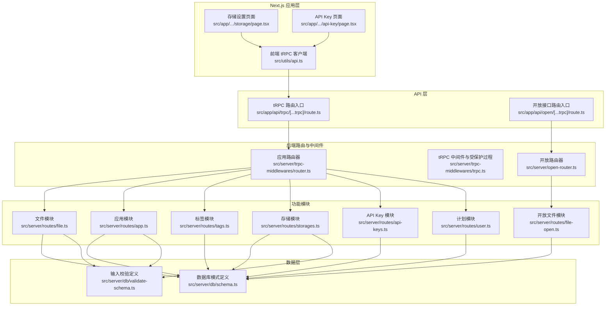
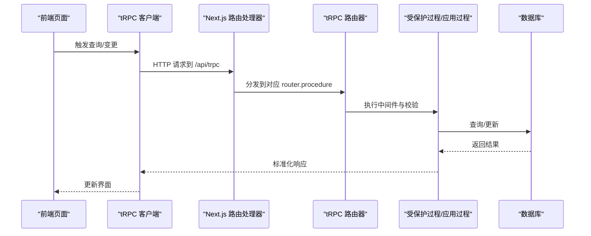
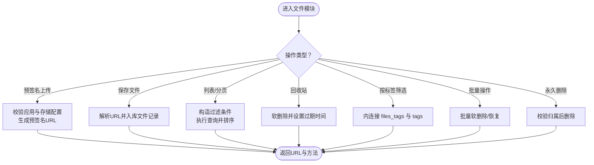
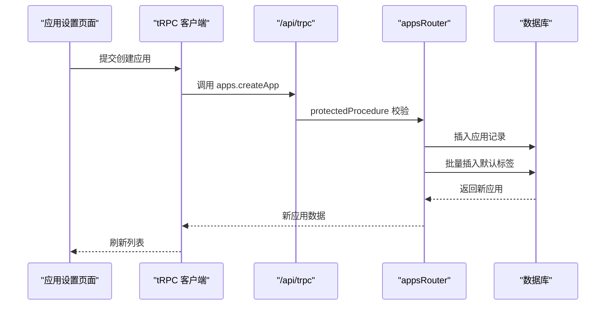
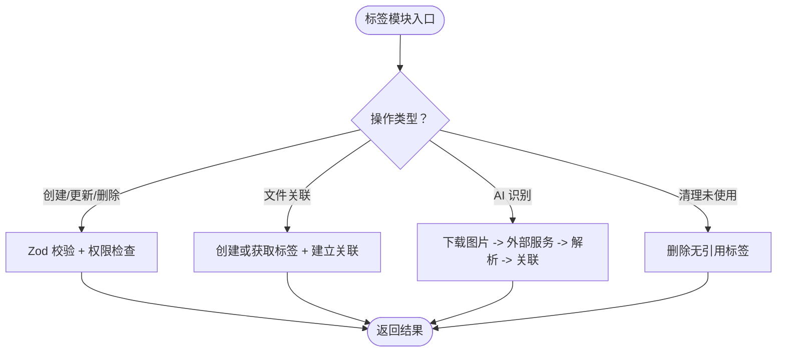
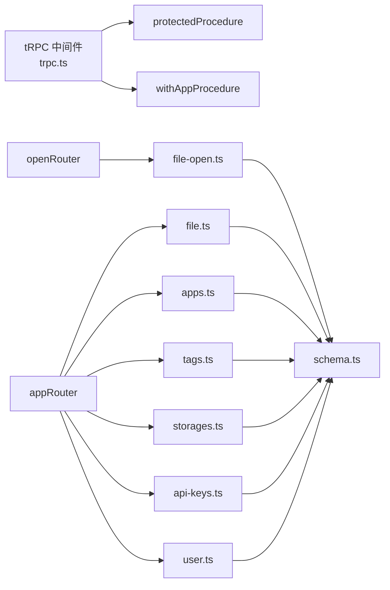

# API 路由组织

<cite>
**本文引用的文件**
- [src/server/trpc-middlewares/router.ts](file://src/server/trpc-middlewares/router.ts)
- [src/server/trpc-middlewares/trpc.ts](file://src/server/trpc-middlewares/trpc.ts)
- [src/server/routes/file.ts](file://src/server/routes/file.ts)
- [src/server/routes/file-open.ts](file://src/server/routes/file-open.ts)
- [src/server/routes/app.ts](file://src/server/routes/app.ts)
- [src/server/routes/tags.ts](file://src/server/routes/tags.ts)
- [src/server/routes/storages.ts](file://src/server/routes/storages.ts)
- [src/server/routes/api-keys.ts](file://src/server/routes/api-keys.ts)
- [src/server/routes/user.ts](file://src/server/routes/user.ts)
- [src/server/open-router.ts](file://src/server/open-router.ts)
- [src/server/db/schema.ts](file://src/server/db/schema.ts)
- [src/server/db/validate-schema.ts](file://src/server/db/validate-schema.ts)
- [src/app/api/trpc/[...trpc]/route.ts](file://src/app/api/trpc/[...trpc]/route.ts)
- [src/app/api/open/[...trpc]/route.ts](file://src/app/api/open/[...trpc]/route.ts)
- [src/utils/api.ts](file://src/utils/api.ts)
- [src/app/dashboard/apps/[appId]/setting/storage/page.tsx](file://src/app/dashboard/apps/[appId]/setting/storage/page.tsx)
- [src/app/dashboard/apps/[appId]/setting/api-key/page.tsx](file://src/app/dashboard/apps/[appId]/setting/api-key/page.tsx)
</cite>

## 目录
1. [引言](#引言)
2. [项目结构](#项目结构)
3. [核心组件](#核心组件)
4. [架构总览](#架构总览)
5. [详细组件分析](#详细组件分析)
6. [依赖关系分析](#依赖关系分析)
7. [性能考量](#性能考量)
8. [故障排查指南](#故障排查指南)
9. [结论](#结论)
10. [附录](#附录)

## 引言
本文件系统性梳理本项目的 API 路由组织与实现，覆盖文件管理、应用管理、标签系统、存储配置以及开放接口等模块。文档重点说明：
- 路由设计与控制器模式（procedure + router）
- 数据校验与输入参数验证（Zod Schema）
- 请求处理流程与响应格式标准化
- API 版本控制策略与错误处理规范
- 中间件、权限检查与鉴权策略
- CRUD 与复杂业务场景的实现路径
- 如何新增路由模块、扩展 CRUD 与处理复杂业务

## 项目结构
项目采用基于“模块化路由 + 中间件”的组织方式，后端通过 tRPC 路由器聚合各功能模块，前端通过 React Query 客户端发起请求。

图表来源
- [src/app/api/trpc/[...trpc]/route.ts:1-14](file://src/app/api/trpc/[...trpc]/route.ts#L1-L14)
- [src/app/api/open/[...trpc]/route.ts:1-31](file://src/app/api/open/[...trpc]/route.ts#L1-L31)
- [src/server/trpc-middlewares/router.ts:1-20](file://src/server/trpc-middlewares/router.ts#L1-L20)
- [src/server/open-router.ts:1-10](file://src/server/open-router.ts#L1-L10)
- [src/server/trpc-middlewares/trpc.ts:1-130](file://src/server/trpc-middlewares/trpc.ts#L1-L130)
- [src/server/routes/file.ts:1-561](file://src/server/routes/file.ts#L1-L561)
- [src/server/routes/file-open.ts:1-197](file://src/server/routes/file-open.ts#L1-L197)
- [src/server/routes/app.ts:1-88](file://src/server/routes/app.ts#L1-L88)
- [src/server/routes/tags.ts:1-735](file://src/server/routes/tags.ts#L1-L735)
- [src/server/routes/storages.ts:1-74](file://src/server/routes/storages.ts#L1-L74)
- [src/server/routes/api-keys.ts:1-38](file://src/server/routes/api-keys.ts#L1-L38)
- [src/server/routes/user.ts:1-26](file://src/server/routes/user.ts#L1-L26)
- [src/server/db/schema.ts:1-270](file://src/server/db/schema.ts#L1-L270)
- [src/server/db/validate-schema.ts:1-18](file://src/server/db/validate-schema.ts#L1-L18)

章节来源
- [src/server/trpc-middlewares/router.ts:1-20](file://src/server/trpc-middlewares/router.ts#L1-L20)
- [src/server/open-router.ts:1-10](file://src/server/open-router.ts#L1-L10)
- [src/server/trpc-middlewares/trpc.ts:1-130](file://src/server/trpc-middlewares/trpc.ts#L1-L130)
- [src/server/db/schema.ts:1-270](file://src/server/db/schema.ts#L1-L270)
- [src/server/db/validate-schema.ts:1-18](file://src/server/db/validate-schema.ts#L1-L18)

## 核心组件
- 应用路由器（appRouter）：聚合文件、应用、标签、存储、API Key、计划等模块，统一暴露给 /api/trpc。
- 开放路由器（openRouter）：聚合开放文件模块，暴露给 /api/open，支持 API Key 或签名 Token 鉴权。
- tRPC 中间件与受保护过程：
  - withSessionMiddleware：注入会话上下文。
  - loggedProcedure：统一日志计时。
  - protectedProcedure：组合 loggedProcedure 与会话校验，确保登录态。
  - withAppProcedure：支持 API Key 或签名 Token 的应用级鉴权，注入 app 与 user 上下文。
- 各功能模块路由：
  - 文件模块：预签名上传、保存文件、分页查询、回收站、按标签筛选、批量操作、永久删除等。
  - 应用模块：创建应用、列出应用、绑定存储。
  - 标签模块：标签 CRUD、按分类分组、AI 识别、清理未使用标签等。
  - 存储模块：列出/创建/更新存储配置。
  - API Key 模块：列出/创建应用级 API Key。
  - 计划模块：获取用户计划信息。

章节来源
- [src/server/trpc-middlewares/router.ts:1-20](file://src/server/trpc-middlewares/router.ts#L1-L20)
- [src/server/open-router.ts:1-10](file://src/server/open-router.ts#L1-L10)
- [src/server/trpc-middlewares/trpc.ts:1-130](file://src/server/trpc-middlewares/trpc.ts#L1-L130)
- [src/server/routes/file.ts:1-561](file://src/server/routes/file.ts#L1-L561)
- [src/server/routes/file-open.ts:1-197](file://src/server/routes/file-open.ts#L1-L197)
- [src/server/routes/app.ts:1-88](file://src/server/routes/app.ts#L1-L88)
- [src/server/routes/tags.ts:1-735](file://src/server/routes/tags.ts#L1-L735)
- [src/server/routes/storages.ts:1-74](file://src/server/routes/storages.ts#L1-L74)
- [src/server/routes/api-keys.ts:1-38](file://src/server/routes/api-keys.ts#L1-L38)
- [src/server/routes/user.ts:1-26](file://src/server/routes/user.ts#L1-L26)

## 架构总览
- 前端通过 tRPC React 客户端访问 /api/trpc；开放接口通过 /api/open 访问。
- 受保护过程（protectedProcedure）依赖会话；应用级过程（withAppProcedure）依赖 API Key 或签名 Token。
- 各模块通过 Zod Schema 进行输入校验，返回标准化结构（如 items + nextCursor 的分页结构）。
- 错误通过 TRPCError 统一抛出，状态码与消息由 tRPC 适配器映射。

图表来源
- [src/app/api/trpc/[...trpc]/route.ts:1-14](file://src/app/api/trpc/[...trpc]/route.ts#L1-L14)
- [src/server/trpc-middlewares/router.ts:1-20](file://src/server/trpc-middlewares/router.ts#L1-L20)
- [src/server/trpc-middlewares/trpc.ts:1-130](file://src/server/trpc-middlewares/trpc.ts#L1-L130)

## 详细组件分析

### 文件管理路由（file.ts）
- 功能要点
  - 预签名上传：根据应用绑定的存储配置生成 PUT 预签名 URL。
  - 保存文件：入库文件元数据（名称、路径、URL、类型、用户与应用归属）。
  - 列表与无限滚动分页：支持按列排序、游标分页、搜索（文件名或标签名）、时间范围。
  - 回收站：软删除标记与过期时间，支持批量恢复与永久删除。
  - 按标签筛选：通过 files_tags 关联查询。
- 输入校验
  - createPresignedUrl/saveFile/listFiles/infinityQueryFiles/deleteFile/batchDeleteFiles/restoreFile/batchRestoreFiles/getDeletedFiles/infinityQueryFilesByTag/permanentlyDeleteFile 等均使用 Zod Schema 校验。
- 错误处理
  - 未找到应用/存储、权限不足、非法输入等场景抛出 TRPCError，状态码由 tRPC 映射。
- 响应格式
  - 分页查询返回 items 与 nextCursor；批量操作返回 { success, count }；单条删除返回影响行数。

图表来源
- [src/server/routes/file.ts:1-561](file://src/server/routes/file.ts#L1-L561)

章节来源
- [src/server/routes/file.ts:1-561](file://src/server/routes/file.ts#L1-L561)
- [src/server/db/validate-schema.ts:1-18](file://src/server/db/validate-schema.ts#L1-L18)

### 应用管理路由（app.ts）
- 功能要点
  - 创建应用：生成唯一 ID，写入用户 ID，并为新应用初始化默认标签。
  - 列出应用：按用户与非删除状态排序。
  - 绑定存储：校验存储归属后更新应用的 storageId。
- 输入校验
  - createAppSchema 用于创建应用时的字段长度与最小值约束。
- 错误处理
  - 存储不属于当前用户时拒绝绑定。

图表来源
- [src/server/routes/app.ts:1-88](file://src/server/routes/app.ts#L1-L88)
- [src/app/dashboard/apps/[appId]/setting/storage/page.tsx:1-103](file://src/app/dashboard/apps/[appId]/setting/storage/page.tsx#L1-L103)

章节来源
- [src/server/routes/app.ts:1-88](file://src/server/routes/app.ts#L1-L88)
- [src/app/dashboard/apps/[appId]/setting/storage/page.tsx:1-103](file://src/app/dashboard/apps/[appId]/setting/storage/page.tsx#L1-L103)

### 标签系统路由（tags.ts）
- 功能要点
  - 标签 CRUD：创建、更新、删除、列表（按使用次数与分类分组）。
  - 文件标签：为文件创建或获取标签并建立关联，支持批量添加/移除。
  - AI 识别：调用外部服务识别图片类别并自动创建标签。
  - 清理未使用标签：删除无引用的标签。
- 输入校验
  - 标签名称长度限制、颜色格式、文件 ID 与标签 ID 集合等。
- 错误处理
  - 标签冲突、不存在、权限不足等场景抛出 TRPCError。
- 响应格式
  - 列表返回 { id, name, color, count }；批量添加返回 addedTags；AI 识别返回识别结果与消息。

图表来源
- [src/server/routes/tags.ts:1-735](file://src/server/routes/tags.ts#L1-L735)

章节来源
- [src/server/routes/tags.ts:1-735](file://src/server/routes/tags.ts#L1-L735)

### 存储配置路由（storages.ts）
- 功能要点
  - 列出用户可用存储配置。
  - 创建/更新存储配置：写入 JSON 配置（bucket、region、凭证等）。
- 输入校验
  - 名称长度、必填字段、可选端点等。
- 错误处理
  - 仅允许当前用户操作自身存储。

章节来源
- [src/server/routes/storages.ts:1-74](file://src/server/routes/storages.ts#L1-L74)

### API Key 路由（api-keys.ts）
- 功能要点
  - 列出应用下的 API Key。
  - 创建 API Key：生成 key 与 clientId。
- 输入校验
  - 名称长度与应用 ID。
- 错误处理
  - 仅允许当前用户访问应用下的 Key。

章节来源
- [src/server/routes/api-keys.ts:1-38](file://src/server/routes/api-keys.ts#L1-L38)
- [src/app/dashboard/apps/[appId]/setting/api-key/page.tsx:1-80](file://src/app/dashboard/apps/[appId]/setting/api-key/page.tsx#L1-L80)

### 计划模块（user.ts）
- 功能要点
  - 获取用户计划信息（从用户表读取 planId 并查询 plan）。
- 错误处理
  - 用户不存在或 planId 为空时返回空计划。

章节来源
- [src/server/routes/user.ts:1-26](file://src/server/routes/user.ts#L1-L26)

### 开放接口路由（file-open.ts）
- 功能要点
  - 与 file.ts 类似的文件操作，但使用 withAppProcedure 鉴权（API Key 或签名 Token）。
  - 适合第三方或公开场景调用。
- 鉴权差异
  - 不强制登录态，仅需 API Key 或有效签名 Token。

章节来源
- [src/server/routes/file-open.ts:1-197](file://src/server/routes/file-open.ts#L1-L197)
- [src/server/open-router.ts:1-10](file://src/server/open-router.ts#L1-L10)

## 依赖关系分析
- 路由聚合
  - appRouter 聚合 file、apps、tags、storages、apiKeys、plan。
  - openRouter 聚合 file-open。
- 中间件链路
  - protectedProcedure：loggedProcedure → withSessionMiddleware → 会话校验。
  - withAppProcedure：API Key 或签名 Token 校验，注入 app 与 user。
- 数据模型
  - apps、files、tags、files_tags、storageConfiguration、apiKeys、users 等通过 relations 建立关联。

图表来源
- [src/server/trpc-middlewares/trpc.ts:1-130](file://src/server/trpc-middlewares/trpc.ts#L1-L130)
- [src/server/trpc-middlewares/router.ts:1-20](file://src/server/trpc-middlewares/router.ts#L1-L20)
- [src/server/open-router.ts:1-10](file://src/server/open-router.ts#L1-L10)
- [src/server/routes/file.ts:1-561](file://src/server/routes/file.ts#L1-L561)
- [src/server/routes/file-open.ts:1-197](file://src/server/routes/file-open.ts#L1-L197)
- [src/server/routes/app.ts:1-88](file://src/server/routes/app.ts#L1-L88)
- [src/server/routes/tags.ts:1-735](file://src/server/routes/tags.ts#L1-L735)
- [src/server/routes/storages.ts:1-74](file://src/server/routes/storages.ts#L1-L74)
- [src/server/routes/api-keys.ts:1-38](file://src/server/routes/api-keys.ts#L1-L38)
- [src/server/routes/user.ts:1-26](file://src/server/routes/user.ts#L1-L26)
- [src/server/db/schema.ts:1-270](file://src/server/db/schema.ts#L1-L270)

章节来源
- [src/server/trpc-middlewares/router.ts:1-20](file://src/server/trpc-middlewares/router.ts#L1-L20)
- [src/server/trpc-middlewares/trpc.ts:1-130](file://src/server/trpc-middlewares/trpc.ts#L1-L130)
- [src/server/db/schema.ts:1-270](file://src/server/db/schema.ts#L1-L270)

## 性能考量
- 分页与游标
  - 文件模块使用游标分页（items + nextCursor），避免大偏移导致的性能问题。
- SQL 优化
  - 在 files 与 tags 上建立索引（如 cursor_idx、tags_user_idx 等），提升排序与过滤效率。
- 事务与批量
  - 标签创建与文件关联在事务中进行，减少并发冲突；批量操作返回 count，便于前端增量更新。
- 预签名上传
  - 通过 S3 预签名直传，降低服务端带宽与 CPU 压力。

章节来源
- [src/server/routes/file.ts:120-234](file://src/server/routes/file.ts#L120-L234)
- [src/server/routes/tags.ts:290-353](file://src/server/routes/tags.ts#L290-L353)
- [src/server/db/schema.ts:135](file://src/server/db/schema.ts#L135)
- [src/server/db/schema.ts:218-224](file://src/server/db/schema.ts#L218-L224)

## 故障排查指南
- 常见错误与状态码
  - FORBIDDEN：未登录或越权（如非应用拥有者操作）。
  - NOT_FOUND：资源不存在（应用、存储、文件、标签、API Key）。
  - BAD_REQUEST：缺少必要参数或非法输入（如未配置存储、缺失签名 Token）。
  - CONFLICT：标签名称冲突。
  - INTERNAL_SERVER_ERROR：AI 识别服务异常。
- 排查步骤
  - 确认请求头是否携带 api-key 或 signed-token（开放接口）。
  - 检查 appId 与用户上下文是否匹配。
  - 校验 Zod Schema 字段长度与类型。
  - 查看 tRPC 日志（中间件 loggedProcedure 输出）定位耗时环节。
- 前端调试
  - 使用 React Query DevTools 观察缓存与错误状态。
  - 在页面中打印请求参数与响应结构，确认 items/nextCursor 是否正确。

章节来源
- [src/server/trpc-middlewares/trpc.ts:30-127](file://src/server/trpc-middlewares/trpc.ts#L30-L127)
- [src/server/routes/file.ts:46-61](file://src/server/routes/file.ts#L46-L61)
- [src/server/routes/file-open.ts:50-58](file://src/server/routes/file-open.ts#L50-L58)
- [src/server/routes/tags.ts:135-140](file://src/server/routes/tags.ts#L135-L140)

## 结论
本项目通过 tRPC 将路由组织为模块化、可复用的过程（procedure），配合中间件实现统一的鉴权与日志策略。文件、应用、标签、存储与 API Key 等模块职责清晰，输入输出通过 Zod 严格约束，错误处理统一化。开放接口通过 withAppProcedure 支持 API Key 与签名 Token 鉴权，满足多场景接入需求。建议后续在复杂查询上引入更细粒度的索引与缓存策略，进一步提升性能与稳定性。

## 附录

### API 版本控制与路由组织最佳实践
- 版本控制建议
  - 通过子目录或查询参数区分版本（如 /api/v1/trpc），逐步迁移旧接口。
  - 对外开放接口（/api/open）保持向后兼容，新增能力以新端点或参数形式提供。
- 路由组织建议
  - 每个领域模块独立文件，router 聚合，避免跨模块耦合。
  - 将公共中间件抽象为链式 use，保证一致性。
- 错误与状态码规范
  - 使用 TRPCError.code 映射标准 HTTP 状态码，前端统一处理。
  - 为每类错误定义明确的消息与上下文（如 appId、userId）。

### 如何创建新的路由模块
- 步骤
  - 在 src/server/routes 下新建模块文件（如 src/server/routes/example.ts），导出 router。
  - 在 src/server/trpc-middlewares/router.ts 中引入并挂载到 appRouter。
  - 在 src/app/api/trpc/[...trpc]/route.ts 中确认 appRouter 已被使用。
  - 在 src/utils/api.ts 中无需修改即可通过 tRPC React 客户端访问。
- 示例参考
  - [src/server/routes/file.ts:26-561](file://src/server/routes/file.ts#L26-L561)
  - [src/server/routes/app.ts:17-88](file://src/server/routes/app.ts#L17-L88)
  - [src/server/trpc-middlewares/router.ts:9-16](file://src/server/trpc-middlewares/router.ts#L9-L16)

### 实现 CRUD 与复杂业务
- CRUD 模板
  - 使用 protectedProcedure 或 withAppProcedure 包裹 mutation/query。
  - 输入使用 Zod Schema 校验，返回标准化结构（如 items + nextCursor）。
- 复杂业务
  - 事务：在需要一致性的地方使用 db.transaction。
  - 批量：使用 inArray 与批量返回 count。
  - AI 集成：对外部服务调用进行超时与降级处理，返回结构化结果。

章节来源
- [src/server/routes/file.ts:26-561](file://src/server/routes/file.ts#L26-L561)
- [src/server/routes/tags.ts:290-353](file://src/server/routes/tags.ts#L290-L353)
- [src/server/routes/storages.ts:15-73](file://src/server/routes/storages.ts#L15-L73)
- [src/server/routes/api-keys.ts:7-37](file://src/server/routes/api-keys.ts#L7-L37)
- [src/server/trpc-middlewares/router.ts:9-16](file://src/server/trpc-middlewares/router.ts#L9-L16)