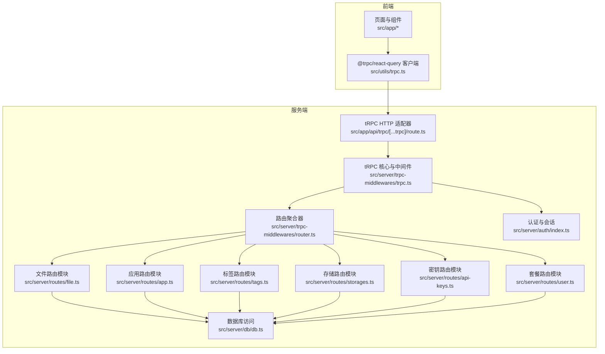
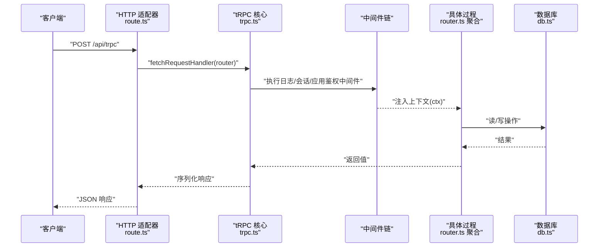
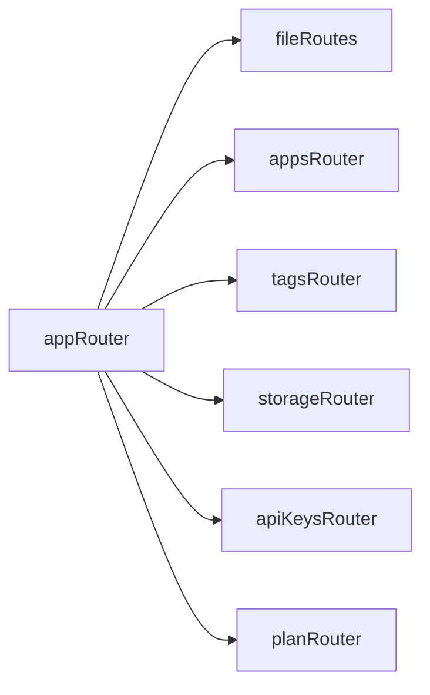
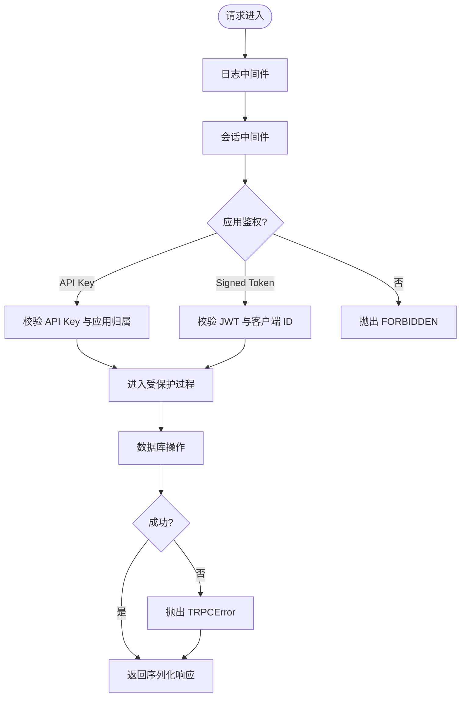
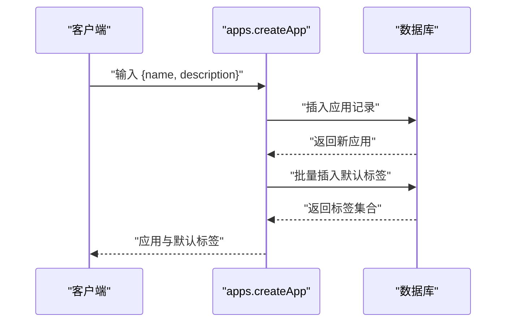
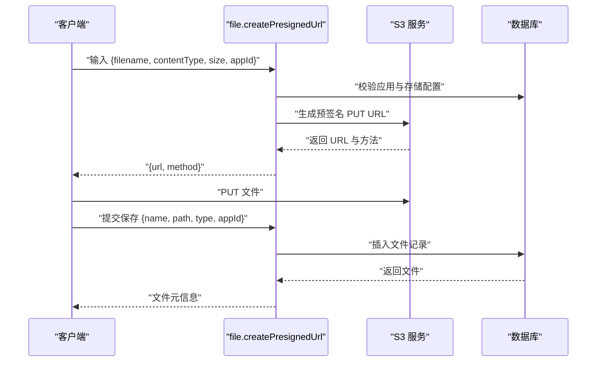
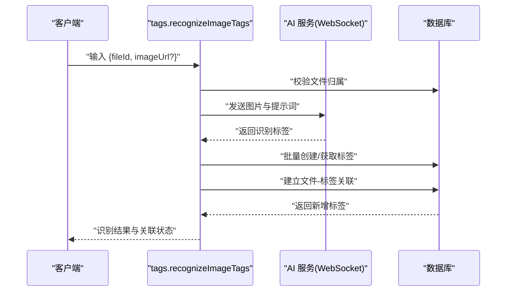
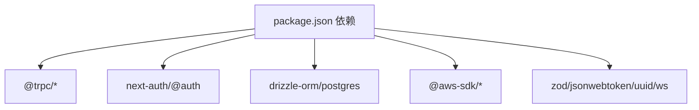

# tRPC 微服务架构

<cite>
**本文引用的文件**
- [src/server/trpc-middlewares/router.ts](file://src/server/trpc-middlewares/router.ts)
- [src/server/trpc-middlewares/trpc.ts](file://src/server/trpc-middlewares/trpc.ts)
- [src/app/api/trpc/[...trpc]/route.ts](file://src/app/api/trpc/[...trpc]/route.ts)
- [src/utils/trpc.ts](file://src/utils/trpc.ts)
- [src/server/routes/file.ts](file://src/server/routes/file.ts)
- [src/server/routes/app.ts](file://src/server/routes/app.ts)
- [src/server/routes/api-keys.ts](file://src/server/routes/api-keys.ts)
- [src/server/routes/user.ts](file://src/server/routes/user.ts)
- [src/server/routes/storages.ts](file://src/server/routes/storages.ts)
- [src/server/routes/tags.ts](file://src/server/routes/tags.ts)
- [src/server/auth/index.ts](file://src/server/auth/index.ts)
- [src/server/db/db.ts](file://src/server/db/db.ts)
- [package.json](file://package.json)
- [README.md](file://README.md)
</cite>

## 目录
1. [简介](#简介)
2. [项目结构](#项目结构)
3. [核心组件](#核心组件)
4. [架构总览](#架构总览)
5. [详细组件分析](#详细组件分析)
6. [依赖关系分析](#依赖关系分析)
7. [性能考虑](#性能考虑)
8. [故障排查指南](#故障排查指南)
9. [结论](#结论)
10. [附录](#附录)

## 简介
本项目基于 Next.js App Router 与 tRPC 构建的图像管理 SaaS 平台，采用端到端类型安全的设计理念，通过 tRPC 的过程（procedure）与中间件链实现严格的请求输入校验、上下文注入与权限控制。系统以“路由分层 + 模块化设计 + 中间件链”的方式组织微服务功能，覆盖应用管理、存储配置、文件上传与归档、标签体系与 AI 识别、以及用户套餐计划等能力。

## 项目结构
项目采用“按功能域划分”的模块化组织方式，核心入口位于 Next.js 的 App Router 路由约定路径，tRPC 路由在服务端聚合并通过适配器暴露为 HTTP 接口；数据访问统一通过 Drizzle ORM；认证采用 NextAuth，提供多源 OAuth 与本地 SKIP_LOGIN 模式。

图表来源
- [src/app/api/trpc/[...trpc]/route.ts](file://src/app/api/trpc/[...trpc]/route.ts#L1-L14)
- [src/server/trpc-middlewares/router.ts:1-20](file://src/server/trpc-middlewares/router.ts#L1-L20)
- [src/server/trpc-middlewares/trpc.ts:1-130](file://src/server/trpc-middlewares/trpc.ts#L1-L130)
- [src/server/routes/file.ts:1-561](file://src/server/routes/file.ts#L1-L561)
- [src/server/routes/app.ts:1-88](file://src/server/routes/app.ts#L1-L88)
- [src/server/routes/tags.ts:1-735](file://src/server/routes/tags.ts#L1-L735)
- [src/server/routes/storages.ts:1-74](file://src/server/routes/storages.ts#L1-L74)
- [src/server/routes/api-keys.ts:1-38](file://src/server/routes/api-keys.ts#L1-L38)
- [src/server/routes/user.ts:1-26](file://src/server/routes/user.ts#L1-L26)
- [src/server/auth/index.ts:1-163](file://src/server/auth/index.ts#L1-L163)
- [src/server/db/db.ts:1-9](file://src/server/db/db.ts#L1-L9)

章节来源
- [src/app/api/trpc/[...trpc]/route.ts](file://src/app/api/trpc/[...trpc]/route.ts#L1-L14)
- [src/server/trpc-middlewares/router.ts:1-20](file://src/server/trpc-middlewares/router.ts#L1-L20)
- [src/server/trpc-middlewares/trpc.ts:1-130](file://src/server/trpc-middlewares/trpc.ts#L1-L130)
- [src/server/auth/index.ts:1-163](file://src/server/auth/index.ts#L1-L163)
- [src/server/db/db.ts:1-9](file://src/server/db/db.ts#L1-L9)

## 核心组件
- tRPC 核心与中间件
  - 初始化 tRPC 核心，定义通用中间件与受保护过程（procedure）链，包括日志中间件、会话注入中间件与应用级鉴权中间件。
  - 应用级鉴权支持两种凭据：API Key 或带签名的客户端 ID（signed-token），并进行 JWT 校验，确保调用方归属正确应用与用户。
- 路由聚合器
  - 将文件、应用、标签、存储、API Key、套餐等子路由聚合为统一的 appRouter，供 HTTP 适配器使用。
- HTTP 适配器
  - 基于 Next.js App Router 的动态路由约定，将请求交由 fetchRequestHandler 处理，暴露 /api/trpc 端点。
- 数据访问层
  - 使用 Drizzle ORM + Postgres，提供类型安全的查询与写入。
- 认证与会话
  - NextAuth 提供多 OAuth 供应商接入，支持 SKIP_LOGIN 模式下的管理员快速登录。

章节来源
- [src/server/trpc-middlewares/trpc.ts:1-130](file://src/server/trpc-middlewares/trpc.ts#L1-L130)
- [src/server/trpc-middlewares/router.ts:1-20](file://src/server/trpc-middlewares/router.ts#L1-L20)
- [src/app/api/trpc/[...trpc]/route.ts](file://src/app/api/trpc/[...trpc]/route.ts#L1-L14)
- [src/server/db/db.ts:1-9](file://src/server/db/db.ts#L1-L9)
- [src/server/auth/index.ts:1-163](file://src/server/auth/index.ts#L1-L163)

## 架构总览
tRPC 在本项目中承担“类型安全的 RPC 层”，贯穿请求进入、参数校验、上下文注入、业务处理、错误传播与响应返回的全链路。前端通过 @trpc/react-query 客户端发起调用，服务端通过适配器将请求映射到具体 procedure，中间件链负责权限与审计，Drizzle ORM 提供数据库访问。

图表来源
- [src/app/api/trpc/[...trpc]/route.ts](file://src/app/api/trpc/[...trpc]/route.ts#L1-L14)
- [src/server/trpc-middlewares/trpc.ts:1-130](file://src/server/trpc-middlewares/trpc.ts#L1-L130)
- [src/server/trpc-middlewares/router.ts:1-20](file://src/server/trpc-middlewares/router.ts#L1-L20)
- [src/server/db/db.ts:1-9](file://src/server/db/db.ts#L1-L9)

## 详细组件分析

### 路由分层与模块化设计
- 聚合器
  - appRouter 将多个子路由（文件、应用、标签、存储、API Key、套餐）组合，形成统一入口。
- 子路由模块
  - 文件路由：上传预签名 URL、保存文件元信息、分页/无限滚动查询、软删除/批量操作、回收站查询、按标签筛选等。
  - 应用路由：创建应用、列出应用、切换存储。
  - 标签路由：标签 CRUD、批量创建/获取、文件关联/解绑、清理未使用标签、AI 图片标签识别。
  - 存储路由：列出/创建/更新存储配置。
  - API Key 路由：列出/创建应用级 API Key。
  - 套餐路由：查询用户当前套餐。

图表来源
- [src/server/trpc-middlewares/router.ts:1-20](file://src/server/trpc-middlewares/router.ts#L1-L20)
- [src/server/routes/file.ts:1-561](file://src/server/routes/file.ts#L1-L561)
- [src/server/routes/app.ts:1-88](file://src/server/routes/app.ts#L1-L88)
- [src/server/routes/tags.ts:1-735](file://src/server/routes/tags.ts#L1-L735)
- [src/server/routes/storages.ts:1-74](file://src/server/routes/storages.ts#L1-L74)
- [src/server/routes/api-keys.ts:1-38](file://src/server/routes/api-keys.ts#L1-L38)
- [src/server/routes/user.ts:1-26](file://src/server/routes/user.ts#L1-L26)

章节来源
- [src/server/trpc-middlewares/router.ts:1-20](file://src/server/trpc-middlewares/router.ts#L1-L20)
- [src/server/routes/file.ts:1-561](file://src/server/routes/file.ts#L1-L561)
- [src/server/routes/app.ts:1-88](file://src/server/routes/app.ts#L1-L88)
- [src/server/routes/tags.ts:1-735](file://src/server/routes/tags.ts#L1-L735)
- [src/server/routes/storages.ts:1-74](file://src/server/routes/storages.ts#L1-L74)
- [src/server/routes/api-keys.ts:1-38](file://src/server/routes/api-keys.ts#L1-L38)
- [src/server/routes/user.ts:1-26](file://src/server/routes/user.ts#L1-L26)

### 中间件链与请求生命周期
- 中间件链
  - 日志中间件：记录每个请求耗时。
  - 会话中间件：注入 NextAuth 会话到 ctx。
  - 应用级鉴权中间件：优先尝试 API Key，其次尝试 signed-token（含 JWT 校验），否则拒绝。
  - 受保护过程：在日志与会话基础上再强制要求已登录用户。
- 生命周期
  - 输入校验：Zod Schema 在 procedure.input 中声明，自动进行类型与业务规则校验。
  - 上下文注入：根据中间件链注入 session、app、user 等上下文。
  - 业务处理：调用 Drizzle ORM 执行数据库操作。
  - 错误传播：抛出 TRPCError，由 tRPC 自动序列化为 HTTP 错误码与消息。
  - 响应返回：序列化返回值。

图表来源
- [src/server/trpc-middlewares/trpc.ts:1-130](file://src/server/trpc-middlewares/trpc.ts#L1-L130)

章节来源
- [src/server/trpc-middlewares/trpc.ts:1-130](file://src/server/trpc-middlewares/trpc.ts#L1-L130)

### 错误传播机制
- 统一错误类型：使用 TRPCError，结合 code（如 FORBIDDEN、NOT_FOUND、BAD_REQUEST、INTERNAL_SERVER_ERROR）与 message，确保前后端一致的错误语义。
- 中间件拦截：在应用级鉴权与受保护过程处集中抛错，避免分散处理。
- HTTP 映射：tRPC 适配器将 TRPCError 映射为对应 HTTP 状态码，便于客户端统一处理。

章节来源
- [src/server/trpc-middlewares/trpc.ts:30-45](file://src/server/trpc-middlewares/trpc.ts#L30-L45)
- [src/server/routes/file.ts:47-61](file://src/server/routes/file.ts#L47-L61)
- [src/server/routes/tags.ts:136-204](file://src/server/routes/tags.ts#L136-L204)

### 客户端-服务器通信协议
- 协议形态：REST 风格的 HTTP 接口，路径为 /api/trpc，由 tRPC 适配器统一处理。
- 客户端集成：通过 @trpc/react-query 与 @trpc/client，自动生成类型安全的客户端调用与缓存策略。
- 会话与鉴权：
  - 浏览端：通过 NextAuth 会话注入，受保护过程自动校验。
  - 应用侧：通过请求头携带 api-key 或 signed-token，中间件链完成鉴权与上下文注入。

章节来源
- [src/app/api/trpc/[...trpc]/route.ts](file://src/app/api/trpc/[...trpc]/route.ts#L1-L14)
- [src/server/trpc-middlewares/trpc.ts:47-127](file://src/server/trpc-middlewares/trpc.ts#L47-L127)
- [src/utils/trpc.ts:1-7](file://src/utils/trpc.ts#L1-L7)

### 缓存策略与实时更新
- 前端缓存：使用 @trpc/tanstack-react-query，默认启用查询缓存与失效策略，适合分页/列表场景。
- 无限滚动：在文件与标签查询中提供 cursor 与 nextCursor，结合本地缓存实现平滑增量加载。
- 实时更新：标签 AI 识别使用 WebSocket 与签名认证，但当前实现主要在服务端内部调用，未见对外公开的实时推送通道。建议后续可在需要时引入订阅/推送机制。

章节来源
- [src/server/routes/file.ts:135-234](file://src/server/routes/file.ts#L135-L234)
- [src/server/routes/tags.ts:416-531](file://src/server/routes/tags.ts#L416-L531)
- [package.json:32-35](file://package.json#L32-L35)

### 典型流程示例

#### 创建应用并初始化默认标签

图表来源
- [src/server/routes/app.ts:18-48](file://src/server/routes/app.ts#L18-L48)

章节来源
- [src/server/routes/app.ts:1-88](file://src/server/routes/app.ts#L1-L88)

#### 上传文件：预签名 URL 与保存元信息

图表来源
- [src/server/routes/file.ts:27-90](file://src/server/routes/file.ts#L27-L90)
- [src/server/routes/file.ts:91-118](file://src/server/routes/file.ts#L91-L118)

章节来源
- [src/server/routes/file.ts:1-561](file://src/server/routes/file.ts#L1-L561)

#### 标签 AI 识别与关联

图表来源
- [src/server/routes/tags.ts:416-531](file://src/server/routes/tags.ts#L416-L531)
- [src/server/routes/tags.ts:534-735](file://src/server/routes/tags.ts#L534-L735)

章节来源
- [src/server/routes/tags.ts:1-735](file://src/server/routes/tags.ts#L1-L735)

## 依赖关系分析
- 运行时依赖
  - tRPC 生态：@trpc/server、@trpc/client、@trpc/react-query、@trpc/tanstack-react-query。
  - 认证：next-auth、@auth/drizzle-adapter。
  - 数据库：drizzle-orm、postgres、@neondatabase/serverless。
  - 对象存储：@aws-sdk/client-s3、@aws-sdk/s3-request-presigner。
  - 工具：zod、jsonwebtoken、uuid、ws。
- 开发依赖
  - 构建与测试：jest、tsup、tsx、drizzle-kit 等。

图表来源
- [package.json:14-66](file://package.json#L14-L66)

章节来源
- [package.json:1-94](file://package.json#L1-L94)

## 性能考虑
- 中间件开销控制
  - 日志中间件仅记录耗时，避免重 IO；会话与鉴权中间件尽量短路失败。
- 查询优化
  - 分页/无限滚动使用 cursor 与索引友好的排序字段，减少全表扫描。
  - 复杂查询使用原生 SQL 与 JOIN，配合 LIMIT 控制结果集大小。
- 缓存策略
  - 启用 @trpc/tanstack-react-query 的默认缓存与失效策略，合理设置查询键与失效时间。
- 外部服务
  - S3 预签名 URL 有效期较短（2 分钟），降低并发与重放风险。
  - AI 识别使用 WebSocket，注意超时与错误处理，避免阻塞主流程。

## 故障排查指南
- 403/401 权限问题
  - 检查请求头是否包含正确的 api-key 或 signed-token；确认 JWT 签名与客户端 ID 匹配。
  - 确认应用与用户归属一致。
- 404 资源缺失
  - 应用、存储、文件、标签等资源需归属当前用户；检查 appId 与 userId。
- 400 参数错误
  - 输入 Schema 不满足约束（长度、枚举、必填等）；查看 TRPCError message。
- 500 服务器错误
  - 数据库异常、AI 识别服务不可用或网络超时；查看服务端日志与环境变量配置。

章节来源
- [src/server/trpc-middlewares/trpc.ts:101-127](file://src/server/trpc-middlewares/trpc.ts#L101-L127)
- [src/server/routes/file.ts:46-61](file://src/server/routes/file.ts#L46-L61)
- [src/server/routes/tags.ts:423-446](file://src/server/routes/tags.ts#L423-L446)

## 结论
本项目以 tRPC 为核心，实现了端到端类型安全的微服务架构：清晰的路由分层、模块化的业务域、可扩展的中间件链、完善的错误传播与缓存策略。通过 NextAuth 与 Drizzle ORM 的集成，系统具备良好的开发体验与运行效率。建议后续在需要的场景引入实时推送与更细粒度的缓存策略，进一步提升用户体验与性能表现。

## 附录

### 如何创建一个新的 tRPC 路由
- 新建子路由文件（如 src/server/routes/new-feature.ts），导出 router({ ... })。
- 在聚合器 src/server/trpc-middlewares/router.ts 中注册新路由。
- 在 src/app/api/trpc/[...trpc]/route.ts 中确保 appRouter 已包含新路由。
- 在前端通过 src/utils/trpc.ts 导出的 caller 或客户端生成工具使用新过程。

章节来源
- [src/server/trpc-middlewares/router.ts:1-20](file://src/server/trpc-middlewares/router.ts#L1-L20)
- [src/app/api/trpc/[...trpc]/route.ts](file://src/app/api/trpc/[...trpc]/route.ts#L1-L14)
- [src/utils/trpc.ts:1-7](file://src/utils/trpc.ts#L1-L7)

### 参数验证与业务逻辑实现要点
- 使用 Zod Schema 在 procedure.input 中声明输入约束，确保类型安全与边界条件。
- 在中间件链中尽早校验与注入上下文，避免在业务层重复处理。
- 使用 Drizzle ORM 的事务与条件查询，保证数据一致性与性能。

章节来源
- [src/server/routes/file.ts:27-35](file://src/server/routes/file.ts#L27-L35)
- [src/server/routes/app.ts:18-28](file://src/server/routes/app.ts#L18-L28)
- [src/server/routes/tags.ts:246-288](file://src/server/routes/tags.ts#L246-L288)