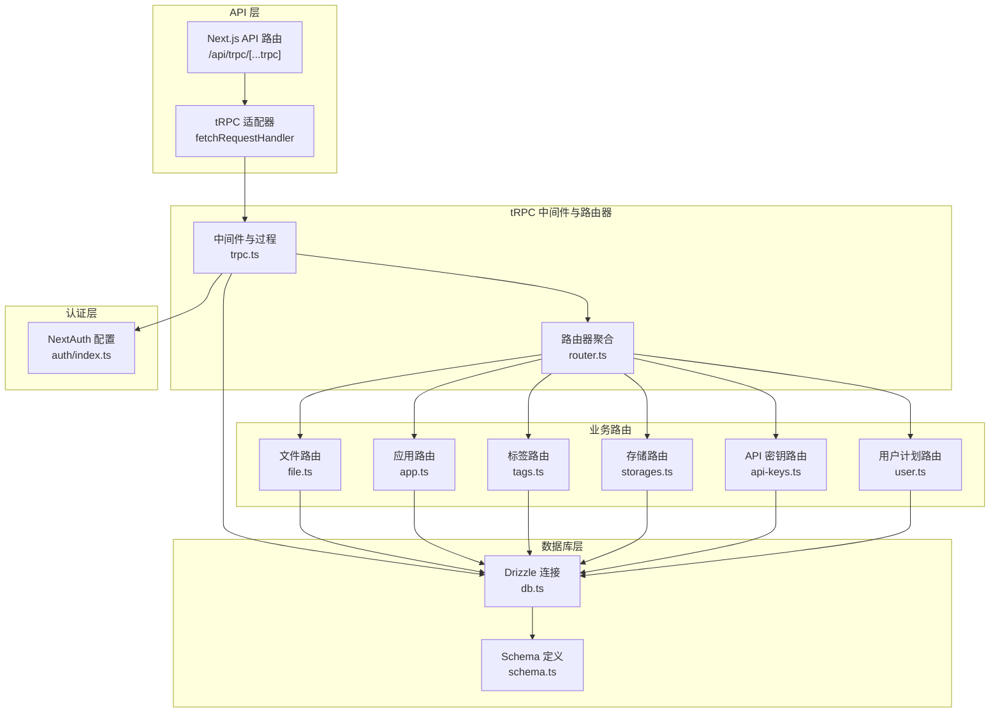
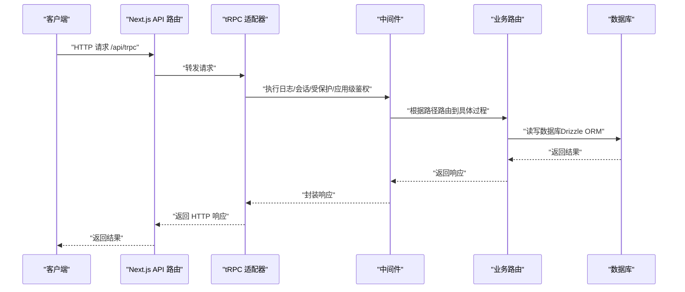
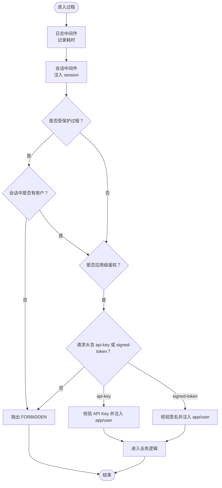
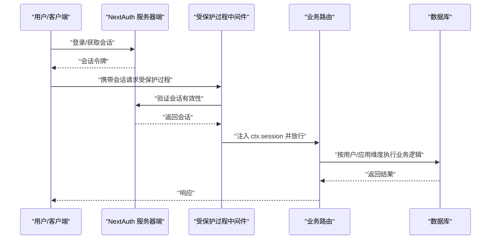
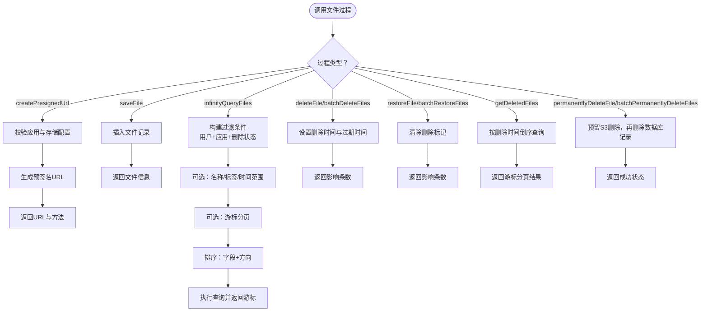
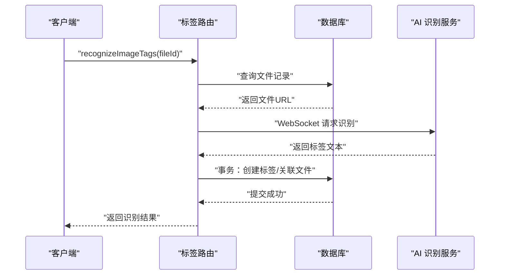
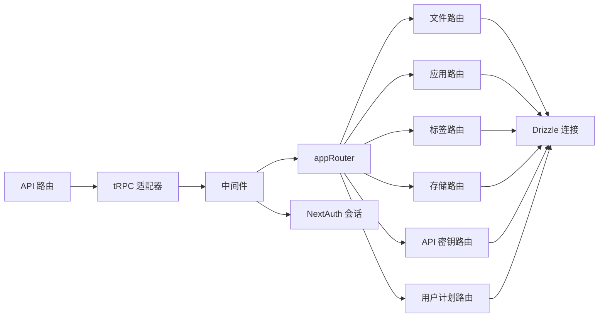

# 后端架构

<cite>
**本文引用的文件**
- [router.ts](file://src/server/trpc-middlewares/router.ts)
- [trpc.ts](file://src/server/trpc-middlewares/trpc.ts)
- [route.ts](file://src/app/api/trpc/[...trpc]/route.ts)
- [schema.ts](file://src/server/db/schema.ts)
- [db.ts](file://src/server/db/db.ts)
- [file.ts](file://src/server/routes/file.ts)
- [app.ts](file://src/server/routes/app.ts)
- [api-keys.ts](file://src/server/routes/api-keys.ts)
- [storages.ts](file://src/server/routes/storages.ts)
- [tags.ts](file://src/server/routes/tags.ts)
- [user.ts](file://src/server/routes/user.ts)
- [index.ts](file://src/server/auth/index.ts)
- [package.json](file://package.json)
- [trpc.ts](file://src/utils/trpc.ts)
- [drizzle.config.ts](file://drizzle.config.ts)
</cite>

## 目录

1. [引言](#引言)
2. [项目结构](#项目结构)
3. [核心组件](#核心组件)
4. [架构总览](#架构总览)
5. [组件详解](#组件详解)
6. [依赖关系分析](#依赖关系分析)
7. [性能考量](#性能考量)
8. [故障排查指南](#故障排查指南)
9. [结论](#结论)
10. [附录](#附录)

## 引言

本文件系统性梳理 Image SaaS 项目的后端架构，重点覆盖以下方面：

- tRPC 微服务架构的设计理念、路由组织与中间件机制
- 数据库层的设计模式、ORM 抽象与数据访问层
- 认证系统架构、会话管理与权限控制
- API 层职责分离、错误处理与性能优化
- 后端服务的扩展性设计、负载均衡与监控策略
- 架构图与组件交互示例

## 项目结构

后端采用 Next.js 应用内的 API 路由与 tRPC 集成方式，核心目录如下：

- 路由适配器：Next.js API 路由对接 tRPC 适配器
- tRPC 中间件与路由器：集中定义中间件、受保护过程与子路由
- 业务路由模块：按功能拆分的子路由（文件、应用、标签、存储、API 密钥、用户计划）
- 数据库层：Drizzle ORM + PostgreSQL，统一 schema 与连接
- 认证层：NextAuth 配置与自定义会话扩展
- 工具与配置：本地调用工厂、Drizzle 配置

**图表来源**

- [route.ts:1-14](file://src/app/api/trpc/[...trpc]/route.ts#L1-L14)
- [trpc.ts:1-130](file://src/server/trpc-middlewares/trpc.ts#L1-L130)
- [router.ts:1-20](file://src/server/trpc-middlewares/router.ts#L1-L20)
- [file.ts:1-561](file://src/server/routes/file.ts#L1-L561)
- [app.ts:1-88](file://src/server/routes/app.ts#L1-L88)
- [tags.ts:1-735](file://src/server/routes/tags.ts#L1-L735)
- [storages.ts:1-74](file://src/server/routes/storages.ts#L1-L74)
- [api-keys.ts:1-38](file://src/server/routes/api-keys.ts#L1-L38)
- [user.ts:1-26](file://src/server/routes/user.ts#L1-L26)
- [db.ts:1-9](file://src/server/db/db.ts#L1-L9)
- [schema.ts:1-270](file://src/server/db/schema.ts#L1-L270)
- [index.ts:1-163](file://src/server/auth/index.ts#L1-L163)

**章节来源**

- [route.ts:1-14](file://src/app/api/trpc/[...trpc]/route.ts#L1-L14)
- [router.ts:1-20](file://src/server/trpc-middlewares/router.ts#L1-L20)
- [trpc.ts:1-130](file://src/server/trpc-middlewares/trpc.ts#L1-L130)
- [db.ts:1-9](file://src/server/db/db.ts#L1-L9)
- [schema.ts:1-270](file://src/server/db/schema.ts#L1-L270)
- [index.ts:1-163](file://src/server/auth/index.ts#L1-L163)

## 核心组件

- tRPC 适配器与入口
  - Next.js API 路由将请求交由 tRPC 适配器处理，统一 endpoint 为 /api/trpc
  - 通过 appRouter 聚合所有子路由，实现模块化组织
- 中间件体系
  - 日志中间件：记录每个过程的执行耗时
  - 会话中间件：注入服务器端会话到 ctx
  - 受保护过程：强制校验会话有效性
  - 应用级鉴权过程：支持 API Key 与签名 Token 两种模式，自动注入 app 与 user 上下文
- 数据库层
  - Drizzle ORM + PostgreSQL，通过单一连接实例与 schema 绑定
  - schema 定义清晰的实体关系与索引，支持复杂查询与事务
- 认证系统
  - NextAuth 集成多提供商（GitHub、Gitee、JiHuLab），Drizzle Adapter 提供持久化
  - 自定义 getServerSession 支持 SKIP_LOGIN 模式，便于开发测试
- 业务路由
  - 文件：预签名上传、保存记录、分页查询、软删除、批量操作、回收站等
  - 应用：创建、列表、绑定存储
  - 标签：增删改查、批量创建或获取、文件关联、AI 识别
  - 存储：列表、创建、更新
  - API 密钥：列表、创建
  - 用户计划：查询用户计划

**章节来源**

- [route.ts:1-14](file://src/app/api/trpc/[...trpc]/route.ts#L1-L14)
- [trpc.ts:1-130](file://src/server/trpc-middlewares/trpc.ts#L1-L130)
- [router.ts:1-20](file://src/server/trpc-middlewares/router.ts#L1-L20)
- [db.ts:1-9](file://src/server/db/db.ts#L1-L9)
- [schema.ts:1-270](file://src/server/db/schema.ts#L1-L270)
- [index.ts:1-163](file://src/server/auth/index.ts#L1-L163)
- [file.ts:1-561](file://src/server/routes/file.ts#L1-L561)
- [app.ts:1-88](file://src/server/routes/app.ts#L1-L88)
- [tags.ts:1-735](file://src/server/routes/tags.ts#L1-L735)
- [storages.ts:1-74](file://src/server/routes/storages.ts#L1-L74)
- [api-keys.ts:1-38](file://src/server/routes/api-keys.ts#L1-L38)
- [user.ts:1-26](file://src/server/routes/user.ts#L1-L26)

## 架构总览

下图展示从客户端到 tRPC、中间件、业务路由与数据库的完整调用链路。

**图表来源**

- [route.ts:1-14](file://src/app/api/trpc/[...trpc]/route.ts#L1-L14)
- [trpc.ts:1-130](file://src/server/trpc-middlewares/trpc.ts#L1-L130)
- [router.ts:1-20](file://src/server/trpc-middlewares/router.ts#L1-L20)
- [db.ts:1-9](file://src/server/db/db.ts#L1-L9)

## 组件详解

### tRPC 中间件与路由器

- 中间件职责
  - 日志中间件：记录过程执行时间，便于性能观测
  - 会话中间件：从服务器端获取 NextAuth 会话并注入 ctx.session
  - 受保护过程：在会话基础上校验用户登录状态，未登录抛出 FORBIDDEN
  - 应用级鉴权过程：优先支持 API Key；若无则尝试签名 Token，校验签名有效性并注入 app 与 user 上下文
- 路由器聚合
  - 聚合 file、apps、tags、storages、apiKeys、plan 子路由，形成统一入口

**图表来源**

- [trpc.ts:11-127](file://src/server/trpc-middlewares/trpc.ts#L11-L127)

**章节来源**

- [trpc.ts:1-130](file://src/server/trpc-middlewares/trpc.ts#L1-L130)
- [router.ts:1-20](file://src/server/trpc-middlewares/router.ts#L1-L20)

### 数据库层设计与 ORM 抽象

- 连接与适配
  - 单一 Postgres 客户端连接，通过 Drizzle 初始化数据库实例
  - schema 作为类型安全的 ORM 映射，统一实体与关系
- Schema 设计要点
  - 用户、会话、账户、认证器、验证码等 NextAuth 相关表
  - 应用、存储配置、文件、标签、文件-标签关联等业务表
  - 复合索引与关系定义，支撑高效查询与事务一致性
- 查询与事务
  - 业务路由广泛使用 Drizzle 的查询构造器与原生 SQL，满足复杂筛选、排序与分页
  - 事务用于标签创建与文件关联的原子性保障

```mermaid
erDiagram
USERS {
text id PK
text name
text email UK
date create_at
text plan
}
ACCOUNTS {
text userId FK
text type
text provider
text providerAccountId
text refresh_token
text access_token
int expires_at
text token_type
text scope
text id_token
text session_state
}
SESSIONS {
text sessionToken PK
text userId FK
timestamp expires
}
AUTHENTICATORS {
text credentialID UK
text userId FK
text providerAccountId
text credentialPublicKey
int counter
text credentialDeviceType
boolean credentialBackedUp
text transports
}
VERIFICATIONTOKENS {
text identifier
text token
timestamp expires
}
APPS {
uuid id PK
text name
text description
text user_id FK
int storage_id
timestamp created_at
timestamp deleted_at
}
STORAGECONFIGURATION {
int id PK
text name
text user_id FK
json configuration
timestamp created_at
timestamp deleted_at
}
FILES {
uuid id PK
text name
text type
text content_type
text user_id FK
uuid app_id FK
text path
text url
timestamp created_at
timestamp deleted_at
timestamp deleted_at_expiration
}
TAGS {
uuid id PK
text name
text color
text user_id FK
text category_type
uuid parent_id FK
uuid app_id FK
int sort
timestamp created_at
}
FILESTAGS {
uuid file_id FK
uuid tag_id FK
timestamp created_at
}
APIKEYS {
int id PK
text key UK
text client_id UK
text name
uuid app_id FK
timestamp created_at
timestamp deleted_at
}
USERS ||--o{ APPS : "拥有"
USERS ||--o{ STORAGECONFIGURATION : "拥有"
USERS ||--o{ FILES : "拥有"
USERS ||--o{ TAGS : "拥有"
APPS ||--o{ FILES : "包含"
APPS ||--o{ APIKEYS : "拥有"
STORAGECONFIGURATION ||--o{ APPS : "被应用使用"
TAGS ||--o{ FILESTAGS : "被关联"
FILES ||--o{ FILESTAGS : "被关联"
```

**图表来源**

- [schema.ts:1-270](file://src/server/db/schema.ts#L1-L270)

**章节来源**

- [db.ts:1-9](file://src/server/db/db.ts#L1-L9)
- [schema.ts:1-270](file://src/server/db/schema.ts#L1-L270)

### 认证系统与权限控制

- NextAuth 配置
  - Drizzle Adapter 持久化会话与账户
  - 多 OAuth 提供商集成，支持 GitHub、Gitee、JiHuLab
  - 自定义回调：扩展 session 注入用户 ID；SKIP_LOGIN 模式下自动创建管理员用户
- 会话与权限
  - 受保护过程强制要求 ctx.session.user 存在
  - 应用级鉴权支持 API Key 与签名 Token，确保第三方调用的安全性
  - 业务路由在执行前进行用户与应用维度的权限校验（如文件所属用户与应用）

**图表来源**

- [index.ts:1-163](file://src/server/auth/index.ts#L1-L163)
- [trpc.ts:30-45](file://src/server/trpc-middlewares/trpc.ts#L30-L45)

**章节来源**

- [index.ts:1-163](file://src/server/auth/index.ts#L1-L163)
- [trpc.ts:1-130](file://src/server/trpc-middlewares/trpc.ts#L1-L130)

### API 层职责分离与错误处理

- 职责分离
  - API 路由仅负责请求转发与 endpoint 对接
  - 中间件负责通用横切关注点（日志、会话、鉴权）
  - 业务路由聚焦领域逻辑（文件、应用、标签、存储、密钥、计划）
- 错误处理
  - 使用 TRPCError 抛出语义化错误码（如 FORBIDDEN、NOT_FOUND、BAD_REQUEST、CONFLICT、INTERNAL_SERVER_ERROR）
  - 应用级鉴权在缺少凭据或校验失败时快速失败
  - 标签路由在 AI 识别失败时降级并返回友好提示

**章节来源**

- [route.ts:1-14](file://src/app/api/trpc/[...trpc]/route.ts#L1-L14)
- [trpc.ts:1-130](file://src/server/trpc-middlewares/trpc.ts#L1-L130)
- [tags.ts:523-529](file://src/server/routes/tags.ts#L523-L529)

### 文件路由（核心流程）

- 预签名上传：根据应用配置生成短期有效签名 URL，避免服务端直传压力
- 保存文件：将文件元信息入库，建立用户与应用维度的归属
- 分页查询：支持游标分页、多字段排序、多维搜索（文件名、标签名、时间范围）
- 软删除与恢复：标记删除时间与过期时间，支持批量操作
- 回收站：按删除时间倒序列出已删除文件
- 批量永久删除：预留 S3 删除步骤，随后清理数据库

**图表来源**

- [file.ts:26-561](file://src/server/routes/file.ts#L26-L561)

**章节来源**

- [file.ts:1-561](file://src/server/routes/file.ts#L1-L561)

### 标签路由（AI 识别与事务）

- 标签生命周期：创建、更新、删除、批量清理未使用标签
- 文件关联：支持批量创建或获取标签并一次性关联到文件
- AI 识别：通过 WebSocket 调用第三方视觉识别服务，清洗输出并回写标签与关联
- 事务保证：标签创建与文件关联在单事务内完成，避免不一致

**图表来源**

- [tags.ts:415-531](file://src/server/routes/tags.ts#L415-L531)

**章节来源**

- [tags.ts:1-735](file://src/server/routes/tags.ts#L1-L735)

### 应用与存储路由

- 应用：创建时自动初始化默认分类标签；列表按创建时间倒序；变更存储需校验所有权
- 存储：支持创建、更新、列表；配置包含桶、区域、凭证与可选 Endpoint

**章节来源**

- [app.ts:1-88](file://src/server/routes/app.ts#L1-L88)
- [storages.ts:1-74](file://src/server/routes/storages.ts#L1-L74)

### API 密钥路由

- 列表与创建：按应用维度管理密钥，支持唯一性约束（key 与 client_id）

**章节来源**

- [api-keys.ts:1-38](file://src/server/routes/api-keys.ts#L1-L38)

### 用户计划路由

- 查询用户计划：从用户表读取 plan 字段（注：schema 中存在 plans 表但此处按用户表 plan 字段返回）

**章节来源**

- [user.ts:1-26](file://src/server/routes/user.ts#L1-L26)

## 依赖关系分析

- 组件耦合
  - API 路由仅依赖 tRPC 适配器与 appRouter，低耦合
  - 中间件与业务路由通过 ctx 传递上下文，解耦鉴权与业务
  - 数据库层通过 schema 与连接实例统一抽象，业务路由仅依赖 db 实例
- 外部依赖
  - tRPC、NextAuth、Drizzle ORM、PostgreSQL、AWS S3 SDK、WebSocket（AI 识别）
- 潜在循环依赖
  - 当前结构清晰，无明显循环导入

**图表来源**

- [route.ts:1-14](file://src/app/api/trpc/[...trpc]/route.ts#L1-L14)
- [trpc.ts:1-130](file://src/server/trpc-middlewares/trpc.ts#L1-L130)
- [router.ts:1-20](file://src/server/trpc-middlewares/router.ts#L1-L20)
- [db.ts:1-9](file://src/server/db/db.ts#L1-L9)
- [index.ts:1-163](file://src/server/auth/index.ts#L1-L163)

**章节来源**

- [package.json:1-94](file://package.json#L1-L94)
- [drizzle.config.ts:1-14](file://drizzle.config.ts#L1-L14)

## 性能考量

- tRPC 优势
  - 类型安全的客户端-服务端通信，减少序列化开销
  - 过程级中间件可按需启用日志与鉴权，避免全局拦截
- 数据库优化
  - schema 定义复合索引（如文件游标索引、标签多字段索引），提升分页与搜索性能
  - 复杂查询使用原生 SQL 与条件拼装，结合 LIMIT 控制结果集大小
- 上传与存储
  - 预签名上传将大流量转至 S3，降低服务端带宽与 CPU 压力
- 事务与一致性
  - 标签创建与文件关联使用事务，避免脏数据
- 建议
  - 引入缓存层（如 Redis）缓存热点标签与应用配置
  - 对高频查询增加物化视图或汇总表
  - 监控慢查询与中间件耗时，定位瓶颈

[本节为通用指导，无需特定文件来源]

## 故障排查指南

- 403 Forbidden
  - 受保护过程未携带有效会话；检查 NextAuth 会话与 Cookie
  - 应用级鉴权缺少 api-key 或 signed-token；确认请求头设置
- 404 Not Found
  - API Key 或 Token 无效；确认 key 与 client_id 未被删除
  - 文件/标签/存储不存在或不属于当前用户
- 400 Bad Request
  - 预签名上传缺少存储配置；确认应用绑定了有效存储
  - AI 识别服务凭证缺失或网络异常
- 500 Internal Server Error
  - AI 识别服务调用失败；检查环境变量与网络连通性
  - 数据库事务异常；查看日志定位具体 SQL

**章节来源**

- [trpc.ts:30-127](file://src/server/trpc-middlewares/trpc.ts#L30-L127)
- [file.ts:46-58](file://src/server/routes/file.ts#L46-L58)
- [tags.ts:523-529](file://src/server/routes/tags.ts#L523-L529)

## 结论

本架构以 tRPC 为核心，结合 Next.js API 路由与 Drizzle ORM，实现了高内聚、低耦合的微服务式后端。通过中间件体系统一处理日志、会话与鉴权，业务路由按功能模块化组织，数据库层以 schema 与索引保障性能与一致性。认证系统支持多提供商与 SKIP_LOGIN 开发模式，API 层具备良好的扩展性与可观测性。建议后续引入缓存、物化视图与监控告警，进一步提升性能与稳定性。

[本节为总结，无需特定文件来源]

## 附录

- 本地调用工厂：通过 serverCaller 在服务端直接调用 tRPC 过程，便于内部工具与定时任务
- Drizzle 配置：统一 schema 与数据库凭证，支持迁移与类型推导

**章节来源**

- [trpc.ts:1-7](file://src/utils/trpc.ts#L1-L7)
- [drizzle.config.ts:1-14](file://drizzle.config.ts#L1-L14)
