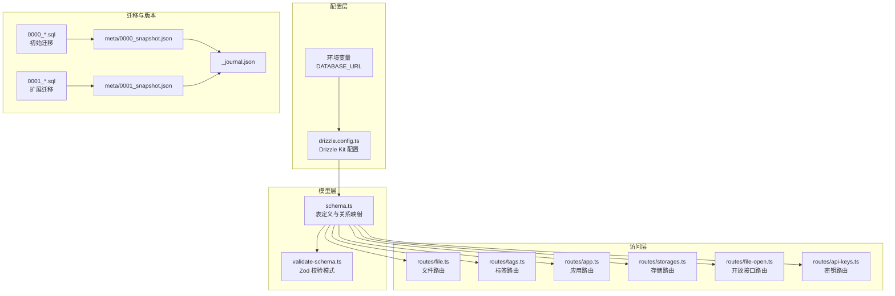
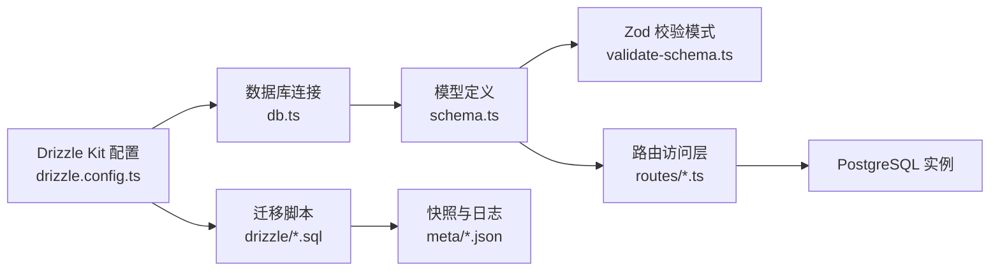
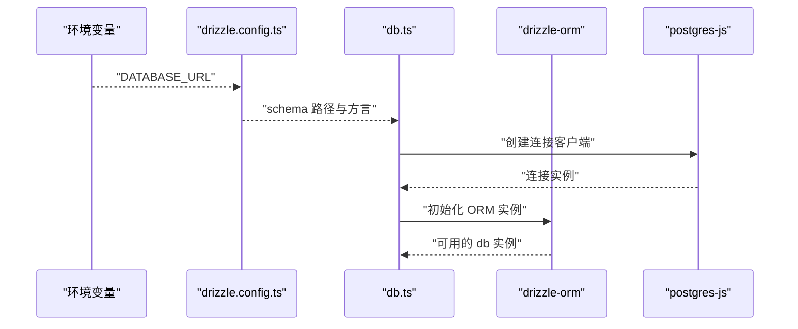
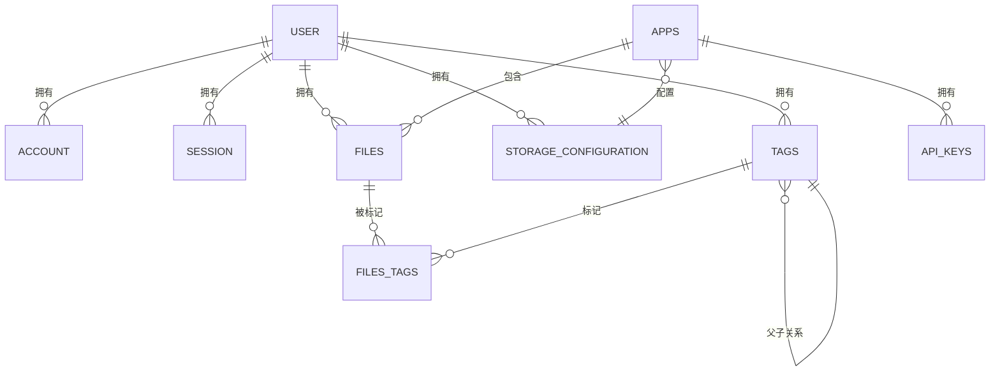
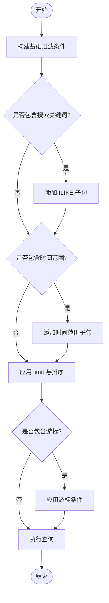
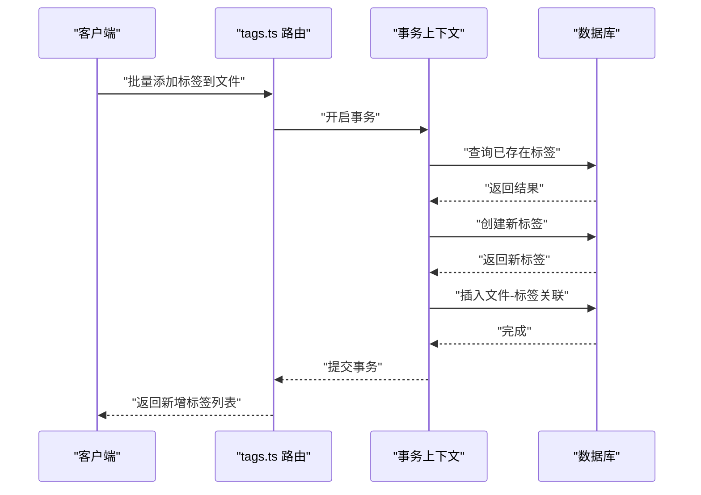
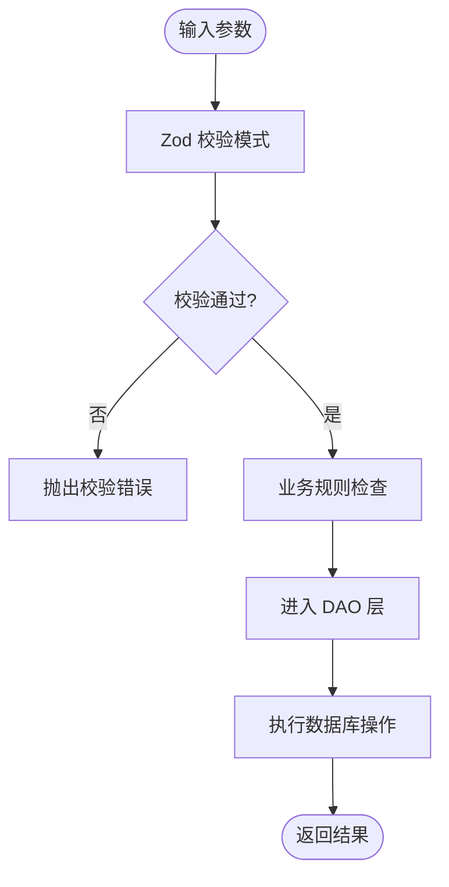
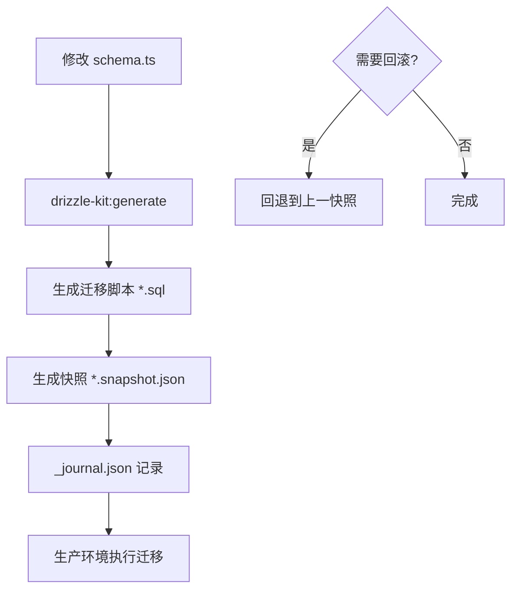
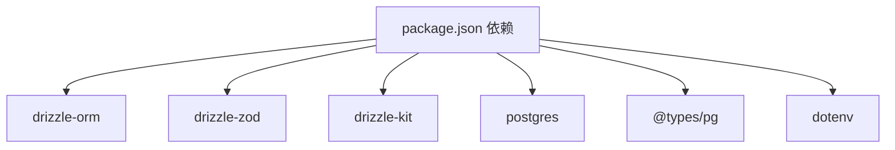

# 数据库层设计

<cite>
**本文引用的文件**
- [drizzle.config.ts](file://drizzle.config.ts)
- [db.ts](file://src/server/db/db.ts)
- [schema.ts](file://src/server/db/schema.ts)
- [validate-schema.ts](file://src/server/db/validate-schema.ts)
- [0000_skinny_carlie_cooper.sql](file://drizzle/0000_skinny_carlie_cooper.sql)
- [0001_lonely_big_bertha.sql](file://drizzle/0001_lonely_big_bertha.sql)
- [meta/0000_snapshot.json](file://drizzle/meta/0000_snapshot.json)
- [meta/0001_snapshot.json](file://drizzle/meta/0001_snapshot.json)
- [meta/_journal.json](file://drizzle/meta/_journal.json)
- [file.ts](file://src/server/routes/file.ts)
- [app.ts](file://src/server/routes/app.ts)
- [storages.ts](file://src/server/routes/storages.ts)
- [tags.ts](file://src/server/routes/tags.ts)
- [api-keys.ts](file://src/server/routes/api-keys.ts)
- [file-open.ts](file://src/server/routes/file-open.ts)
- [package.json](file://package.json)
</cite>

## 目录

1. [简介](#简介)
2. [项目结构](#项目结构)
3. [核心组件](#核心组件)
4. [架构总览](#架构总览)
5. [详细组件分析](#详细组件分析)
6. [依赖分析](#依赖分析)
7. [性能考虑](#性能考虑)
8. [故障排查指南](#故障排查指南)
9. [结论](#结论)
10. [附录](#附录)

## 简介

本文件系统性梳理图像存储与管理系统的数据库层设计，围绕 Drizzle ORM 的配置与使用模式、数据库连接与事务处理、数据模型设计与关系映射、迁移策略与版本控制、查询优化与索引策略、数据验证与业务封装、以及数据访问层抽象进行深入说明。文档同时提供面向开发者的实践建议与排障指引。

## 项目结构

数据库层由三层组成：

- 配置层：Drizzle Kit 配置与环境变量驱动的数据库连接初始化
- 模型层：基于 Drizzle-ORM 的表结构定义与关系映射
- 访问层：通过路由封装的 CRUD 与复杂查询，统一数据访问入口

图表来源

- [drizzle.config.ts:1-14](file://drizzle.config.ts#L1-L14)
- [db.ts:1-9](file://src/server/db/db.ts#L1-L9)
- [schema.ts:1-270](file://src/server/db/schema.ts#L1-L270)
- [validate-schema.ts:1-18](file://src/server/db/validate-schema.ts#L1-L18)
- [0000_skinny_carlie_cooper.sql:1-116](file://drizzle/0000_skinny_carlie_cooper.sql#L1-L116)
- [0001_lonely_big_bertha.sql:1-8](file://drizzle/0001_lonely_big_bertha.sql#L1-L8)
- [meta/0000_snapshot.json](file://drizzle/meta/0000_snapshot.json)
- [meta/0001_snapshot.json](file://drizzle/meta/0001_snapshot.json)
- [meta/\_journal.json](file://drizzle/meta/_journal.json)

章节来源

- [drizzle.config.ts:1-14](file://drizzle.config.ts#L1-L14)
- [db.ts:1-9](file://src/server/db/db.ts#L1-L9)
- [schema.ts:1-270](file://src/server/db/schema.ts#L1-L270)
- [validate-schema.ts:1-18](file://src/server/db/validate-schema.ts#L1-L18)
- [0000_skinny_carlie_cooper.sql:1-116](file://drizzle/0000_skinny_carlie_cooper.sql#L1-L116)
- [0001_lonely_big_bertha.sql:1-8](file://drizzle/0001_lonely_big_bertha.sql#L1-L8)
- [meta/0000_snapshot.json](file://drizzle/meta/0000_snapshot.json)
- [meta/0001_snapshot.json](file://drizzle/meta/0001_snapshot.json)
- [meta/\_journal.json](file://drizzle/meta/_journal.json)

## 核心组件

- Drizzle 配置与连接
  - 使用 Drizzle Kit 生成迁移与同步元数据，通过 DATABASE_URL 初始化 PostgreSQL 连接，采用 postgres-js 作为底层客户端
  - 配置启用严格模式与详细日志，便于开发与生产环境一致性
- 数据模型与关系
  - 用户、会话、第三方账号、认证器等身份相关表，以及应用、存储配置、文件、标签、文件-标签关联等业务表
  - 通过 relations 明确一对多/多对多关系，外键约束与复合主键保障数据完整性
- 数据访问与校验
  - 基于 drizzle-zod 自动生成插入/选择校验模式，结合路由层输入参数进行强类型校验
  - 复杂查询通过原生 SQL 与 ORM 组合实现，兼顾性能与可读性

章节来源

- [drizzle.config.ts:1-14](file://drizzle.config.ts#L1-L14)
- [db.ts:1-9](file://src/server/db/db.ts#L1-L9)
- [schema.ts:1-270](file://src/server/db/schema.ts#L1-L270)
- [validate-schema.ts:1-18](file://src/server/db/validate-schema.ts#L1-L18)

## 架构总览

数据库层遵循“配置-模型-访问”分层，配合 Drizzle Kit 的迁移与版本控制，形成可演进的数据架构。

图表来源

- [drizzle.config.ts:1-14](file://drizzle.config.ts#L1-L14)
- [db.ts:1-9](file://src/server/db/db.ts#L1-L9)
- [schema.ts:1-270](file://src/server/db/schema.ts#L1-L270)
- [validate-schema.ts:1-18](file://src/server/db/validate-schema.ts#L1-L18)
- [0000_skinny_carlie_cooper.sql:1-116](file://drizzle/0000_skinny_carlie_cooper.sql#L1-L116)
- [0001_lonely_big_bertha.sql:1-8](file://drizzle/0001_lonely_big_bertha.sql#L1-L8)
- [meta/0000_snapshot.json](file://drizzle/meta/0000_snapshot.json)
- [meta/0001_snapshot.json](file://drizzle/meta/0001_snapshot.json)
- [meta/\_journal.json](file://drizzle/meta/_journal.json)

## 详细组件分析

### Drizzle 配置与连接管理

- 配置要点
  - 输出目录、模式路径、方言与凭据均来自环境变量，确保部署一致性
  - 严格模式与详细日志提升开发体验与问题定位效率
- 连接管理
  - 通过 postgres-js 创建连接池客户端，再交由 drizzle-orm 初始化 ORM 实例
  - 在路由层统一导入 db 实例，避免分散连接管理

图表来源

- [drizzle.config.ts:1-14](file://drizzle.config.ts#L1-L14)
- [db.ts:1-9](file://src/server/db/db.ts#L1-L9)

章节来源

- [drizzle.config.ts:1-14](file://drizzle.config.ts#L1-L14)
- [db.ts:1-9](file://src/server/db/db.ts#L1-L9)

### 数据模型设计与关系映射

- 用户与身份
  - users 主键自增 id；accounts/session/verificationToken/authenticator 与用户建立外键关系，支持多种登录方式
- 应用与存储
  - apps 与 users 多对一；apps 与 storageConfiguration 多对一；apiKeys 与 apps 多对一
- 文件与标签
  - files 与 users/apps 多对一；files_tags 为文件-标签的多对多关联，含唯一联合主键与级联删除
  - tags 支持父子层级（self-referencing）与分类类型字段，便于树形结构与分类检索

图表来源

- [schema.ts:1-270](file://src/server/db/schema.ts#L1-L270)

章节来源

- [schema.ts:1-270](file://src/server/db/schema.ts#L1-L270)

### 查询优化与索引策略

- 索引设计
  - files 表针对 (id, created_at) 的复合索引用于游标分页排序
  - files_tags 对 file_id/tag_id 建有索引，加速关联查询
  - tags 对 user_id/name/category_type/parent_id 建有索引，支撑用户维度与分类检索
- 查询模式
  - 分页游标：通过复合条件比较实现高性能翻页
  - 搜索组合：文件名模糊匹配与标签名关联查询，结合时间范围过滤
  - 聚合统计：使用原生 SQL 统计标签使用次数，减少 ORM 层开销

图表来源

- [file.ts:168-233](file://src/server/routes/file.ts#L168-L233)
- [tags.ts:53-73](file://src/server/routes/tags.ts#L53-L73)
- [tags.ts:87-114](file://src/server/routes/tags.ts#L87-L114)

章节来源

- [file.ts:168-233](file://src/server/routes/file.ts#L168-L233)
- [tags.ts:53-73](file://src/server/routes/tags.ts#L53-L73)
- [tags.ts:87-114](file://src/server/routes/tags.ts#L87-L114)

### 事务处理与数据一致性

- 事务场景
  - 标签批量创建与关联：在单事务内完成标签查询/创建与关联写入，避免中间状态不一致
  - 批量删除与恢复：使用 inArray 条件与 returning 返回受影响记录数，保证幂等与可观测性
- 一致性保障
  - 外键约束与级联删除确保删除文件时清理关联标签
  - 软删除字段 deleteAt 与过期时间 deletedAtExpiration 提供可恢复能力

图表来源

- [tags.ts:304-352](file://src/server/routes/tags.ts#L304-L352)

章节来源

- [tags.ts:304-352](file://src/server/routes/tags.ts#L304-L352)
- [file.ts:271-292](file://src/server/routes/file.ts#L271-L292)
- [file.ts:318-342](file://src/server/routes/file.ts#L318-L342)

### 数据验证规则与业务封装

- 校验模式
  - 基于 drizzle-zod 自动生成插入/选择模式，结合 Zod Schema 对输入进行强类型校验
  - 文件排序字段白名单限制，仅允许受控列参与排序
- 业务封装
  - 路由层统一处理鉴权、参数校验、业务规则与错误码，DAO 层专注数据存取
  - 复杂查询通过原生 SQL 与 ORM 组合，既保证性能又保持可维护性

图表来源

- [validate-schema.ts:1-18](file://src/server/db/validate-schema.ts#L1-L18)
- [file.ts:17-22](file://src/server/routes/file.ts#L17-L22)
- [app.ts:18-48](file://src/server/routes/app.ts#L18-L48)

章节来源

- [validate-schema.ts:1-18](file://src/server/db/validate-schema.ts#L1-L18)
- [file.ts:17-22](file://src/server/routes/file.ts#L17-L22)
- [app.ts:18-48](file://src/server/routes/app.ts#L18-L48)

### 数据访问层抽象

- 统一入口
  - 所有路由通过 db 实例访问数据库，避免在各模块重复初始化连接
- 抽象层次
  - DAO 层：封装 CRUD 与复杂查询
  - 路由层：封装鉴权、校验与业务编排
  - 模型层：定义表结构与关系，提供类型安全的查询 DSL

章节来源

- [db.ts:1-9](file://src/server/db/db.ts#L1-L9)
- [file.ts:10-15](file://src/server/routes/file.ts#L10-L15)
- [tags.ts:2-5](file://src/server/routes/tags.ts#L2-L5)

### 数据库迁移策略、版本控制与回滚

- 迁移生成与同步
  - 使用 Drizzle Kit 从 schema.ts 生成迁移脚本，输出至 drizzle 目录
  - 迁移脚本包含表结构、索引与约束定义，确保数据库结构可追溯
- 版本控制
  - 快照文件记录每次迁移后的数据库状态，\_journal.json 记录迁移历史
  - 通过快照与日志可快速比对与回滚
- 回滚机制
  - 建议在变更前保留快照，必要时回退到上一快照
  - 对于破坏性变更，优先采用新增列/新表的方式，逐步替换旧结构

图表来源

- [drizzle.config.ts:1-14](file://drizzle.config.ts#L1-L14)
- [0000_skinny_carlie_cooper.sql:1-116](file://drizzle/0000_skinny_carlie_cooper.sql#L1-L116)
- [0001_lonely_big_bertha.sql:1-8](file://drizzle/0001_lonely_big_bertha.sql#L1-L8)
- [meta/0000_snapshot.json](file://drizzle/meta/0000_snapshot.json)
- [meta/0001_snapshot.json](file://drizzle/meta/0001_snapshot.json)
- [meta/\_journal.json](file://drizzle/meta/_journal.json)

章节来源

- [drizzle.config.ts:1-14](file://drizzle.config.ts#L1-L14)
- [0000_skinny_carlie_cooper.sql:1-116](file://drizzle/0000_skinny_carlie_cooper.sql#L1-L116)
- [0001_lonely_big_bertha.sql:1-8](file://drizzle/0001_lonely_big_bertha.sql#L1-L8)
- [meta/0000_snapshot.json](file://drizzle/meta/0000_snapshot.json)
- [meta/0001_snapshot.json](file://drizzle/meta/0001_snapshot.json)
- [meta/\_journal.json](file://drizzle/meta/_journal.json)

### 典型用例与最佳实践

- 定义实体
  - 使用 pgTable 定义表结构，relations 声明关系，index 定义索引
  - 示例参考：[schema.ts:18-270](file://src/server/db/schema.ts#L18-L270)
- 执行复杂查询
  - 结合原生 SQL 与 ORM DSL，实现游标分页、多表关联与聚合统计
  - 示例参考：[file.ts:168-233](file://src/server/routes/file.ts#L168-L233)、[tags.ts:53-114](file://src/server/routes/tags.ts#L53-L114)
- 处理数据一致性
  - 使用事务包裹标签创建与关联，软删除与过期时间保障可恢复性
  - 示例参考：[tags.ts:304-352](file://src/server/routes/tags.ts#L304-L352)、[file.ts:271-292](file://src/server/routes/file.ts#L271-L292)

章节来源

- [schema.ts:18-270](file://src/server/db/schema.ts#L18-L270)
- [file.ts:168-233](file://src/server/routes/file.ts#L168-L233)
- [tags.ts:53-114](file://src/server/routes/tags.ts#L53-L114)
- [tags.ts:304-352](file://src/server/routes/tags.ts#L304-L352)
- [file.ts:271-292](file://src/server/routes/file.ts#L271-L292)

## 依赖分析

- 核心依赖
  - drizzle-orm/postgres-js：ORM 与 PostgreSQL 客户端
  - drizzle-zod：基于模式生成 Zod 校验
  - drizzle-kit：迁移生成与版本管理
- 开发依赖
  - @types/pg、pg、postgres：类型与驱动
  - dotenv：环境变量加载

图表来源

- [package.json:14-94](file://package.json#L14-L94)

章节来源

- [package.json:14-94](file://package.json#L14-L94)

## 性能考虑

- 索引策略
  - 为高频查询列建立单列/复合索引，如 files 的 (id, created_at)、files_tags 的 (file_id, tag_id)
  - 为用户维度与分类维度建立索引，降低过滤成本
- 查询优化
  - 使用游标分页避免深层 offset
  - 合理裁剪 select 字段，减少网络与序列化开销
  - 对聚合统计使用原生 SQL，避免 ORM 层嵌套
- 连接与并发
  - 使用连接池复用连接，避免频繁创建销毁
  - 控制单事务时长，避免长时间持有锁

## 故障排查指南

- 连接问题
  - 检查 DATABASE_URL 是否正确，确认网络可达与权限
  - 查看 drizzle-kit 生成的迁移脚本与快照是否一致
- 迁移失败
  - 对比 \_journal.json 与本地快照，确认迁移顺序
  - 若需回滚，使用上一快照进行回退
- 查询异常
  - 核对索引是否存在，确认 where 条件是否命中索引
  - 检查游标分页条件与排序列是否一致
- 事务异常
  - 确认事务边界是否完整，避免部分提交
  - 对批量操作使用 returning 获取受影响记录数

章节来源

- [meta/\_journal.json](file://drizzle/meta/_journal.json)
- [meta/0000_snapshot.json](file://drizzle/meta/0000_snapshot.json)
- [meta/0001_snapshot.json](file://drizzle/meta/0001_snapshot.json)

## 结论

本数据库层设计以 Drizzle ORM 为核心，结合严格的迁移与版本控制、完善的索引策略与事务处理，实现了高一致性与可演进的数据架构。通过路由层的业务封装与 Zod 校验，进一步提升了系统的健壮性与可维护性。建议在后续迭代中持续完善监控与告警，强化慢查询与连接池使用情况的观测。

## 附录

- 关键文件清单
  - 配置与连接：[drizzle.config.ts](file://drizzle.config.ts)、[db.ts](file://src/server/db/db.ts)
  - 模型与关系：[schema.ts](file://src/server/db/schema.ts)、[validate-schema.ts](file://src/server/db/validate-schema.ts)
  - 迁移与版本：[0000_skinny_carlie_cooper.sql](file://drizzle/0000_skinny_carlie_cooper.sql)、[0001_lonely_big_bertha.sql](file://drizzle/0001_lonely_big_bertha.sql)、[meta/\*.json](file://drizzle/meta/_journal.json)
  - 访问层示例：[file.ts](file://src/server/routes/file.ts)、[tags.ts](file://src/server/routes/tags.ts)、[app.ts](file://src/server/routes/app.ts)、[storages.ts](file://src/server/routes/storages.ts)、[api-keys.ts](file://src/server/routes/api-keys.ts)、[file-open.ts](file://src/server/routes/file-open.ts)
