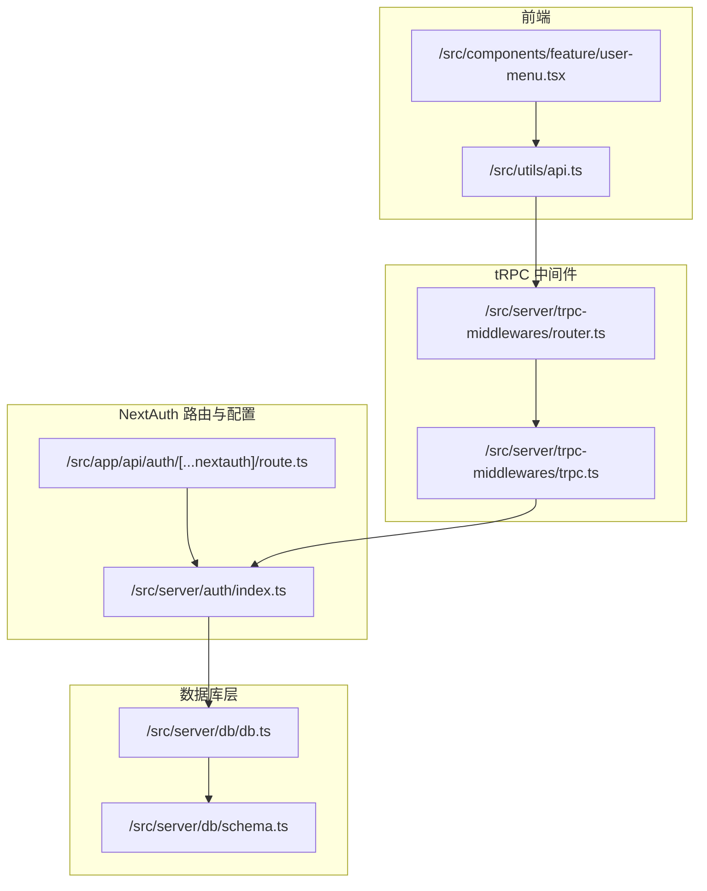
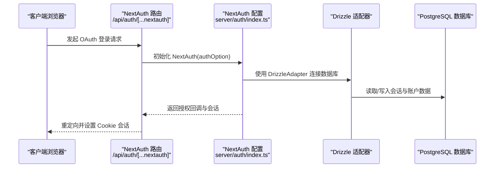
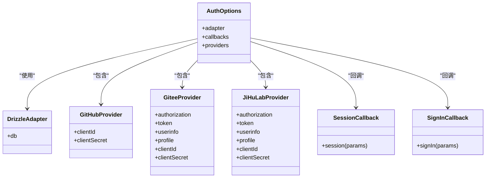
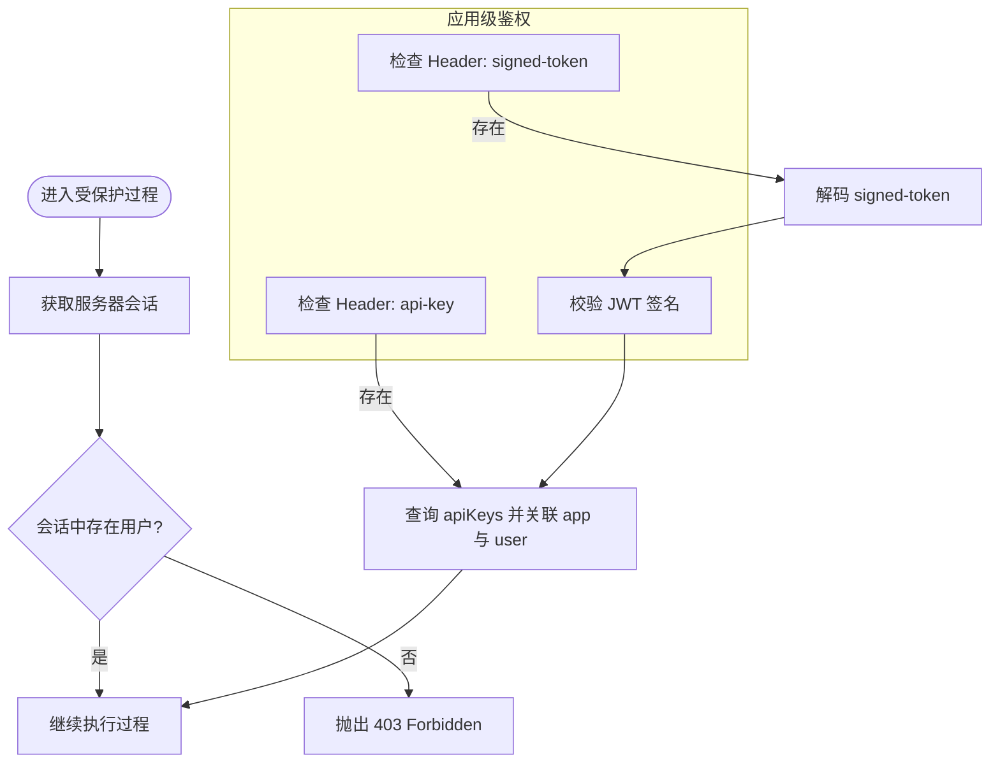
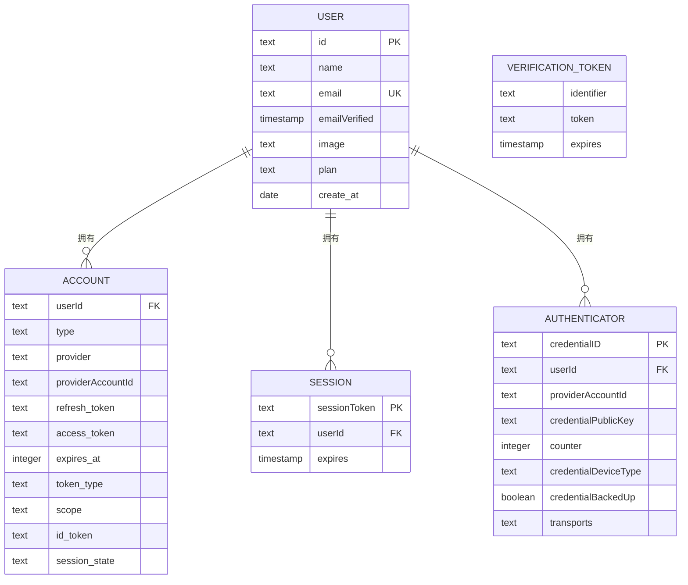
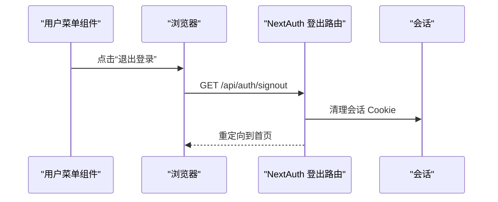
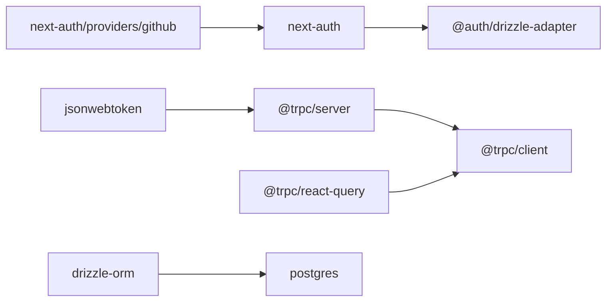

# 认证系统架构

<cite>
**本文档引用的文件**
- [src/server/auth/index.ts](file://src/server/auth/index.ts)
- [src/lib/auth.ts](file://src/lib/auth.ts)
- [src/app/api/auth/[...nextauth]/route.ts](file://src/app/api/auth/[...nextauth]/route.ts)
- [src/server/db/schema.ts](file://src/server/db/schema.ts)
- [src/server/db/db.ts](file://src/server/db/db.ts)
- [src/server/trpc-middlewares/trpc.ts](file://src/server/trpc-middlewares/trpc.ts)
- [src/server/trpc-middlewares/router.ts](file://src/server/trpc-middlewares/router.ts)
- [src/server/routes/user.ts](file://src/server/routes/user.ts)
- [src/components/feature/user-menu.tsx](file://src/components/feature/user-menu.tsx)
- [src/utils/api.ts](file://src/utils/api.ts)
- [package.json](file://package.json)
</cite>

## 目录
1. [简介](#简介)
2. [项目结构](#项目结构)
3. [核心组件](#核心组件)
4. [架构总览](#架构总览)
5. [详细组件分析](#详细组件分析)
6. [依赖关系分析](#依赖关系分析)
7. [性能考虑](#性能考虑)
8. [故障排除指南](#故障排除指南)
9. [结论](#结论)
10. [附录](#附录)

## 简介
本文件系统性梳理认证系统的架构与实现，重点覆盖以下方面：
- NextAuth.js 集成方案与 OAuth 提供者配置
- 会话管理机制与 JWT 处理策略
- 用户模型设计与权限控制策略
- 认证中间件与安全策略
- 多平台认证支持（GitHub、Gitee、JiHuLab）
- 用户注册流程与密码重置机制现状说明
- 安全最佳实践、会话过期处理与并发登录控制
- 具体代码示例路径：如何配置新认证提供者、实现自定义验证逻辑与处理认证异常

## 项目结构
认证相关代码主要分布在以下模块：
- NextAuth 路由与配置：`src/app/api/auth/[...nextauth]/route.ts`、`src/server/auth/index.ts`
- 数据库适配与模式：`src/server/db/db.ts`、`src/server/db/schema.ts`
- tRPC 中间件与受保护路由：`src/server/trpc-middlewares/trpc.ts`、`src/server/trpc-middlewares/router.ts`
- 前端用户菜单与登出：`src/components/feature/user-menu.tsx`
- API 客户端封装：`src/utils/api.ts`
- 依赖与版本：`package.json`

**图表来源**
- [src/app/api/auth/[...nextauth]/route.ts](file://src/app/api/auth/[...nextauth]/route.ts#L1-L7)
- [src/server/auth/index.ts:1-163](file://src/server/auth/index.ts#L1-L163)
- [src/server/db/db.ts:1-9](file://src/server/db/db.ts#L1-L9)
- [src/server/db/schema.ts:1-270](file://src/server/db/schema.ts#L1-L270)
- [src/server/trpc-middlewares/trpc.ts:1-130](file://src/server/trpc-middlewares/trpc.ts#L1-L130)
- [src/server/trpc-middlewares/router.ts:1-20](file://src/server/trpc-middlewares/router.ts#L1-L20)
- [src/components/feature/user-menu.tsx:1-65](file://src/components/feature/user-menu.tsx#L1-L65)
- [src/utils/api.ts:1-17](file://src/utils/api.ts#L1-L17)

**章节来源**
- [src/app/api/auth/[...nextauth]/route.ts](file://src/app/api/auth/[...nextauth]/route.ts#L1-L7)
- [src/server/auth/index.ts:1-163](file://src/server/auth/index.ts#L1-L163)
- [src/server/db/db.ts:1-9](file://src/server/db/db.ts#L1-L9)
- [src/server/db/schema.ts:1-270](file://src/server/db/schema.ts#L1-L270)
- [src/server/trpc-middlewares/trpc.ts:1-130](file://src/server/trpc-middlewares/trpc.ts#L1-L130)
- [src/server/trpc-middlewares/router.ts:1-20](file://src/server/trpc-middlewares/router.ts#L1-L20)
- [src/components/feature/user-menu.tsx:1-65](file://src/components/feature/user-menu.tsx#L1-L65)
- [src/utils/api.ts:1-17](file://src/utils/api.ts#L1-L17)

## 核心组件
- NextAuth 配置与提供者
  - 使用 Drizzle 适配器对接数据库，提供 GitHub、Gitee、JiHuLab 三种 OAuth 提供者
  - 自定义回调扩展会话字段，注入用户 ID
  - 支持 SKIP_LOGIN 模式自动创建默认管理员并返回会话
- tRPC 中间件
  - 通过 withSessionMiddleware 注入会话上下文
  - protectedProcedure 强制校验会话有效性，未登录返回 403
  - withAppProcedure 支持基于 API Key 或签名 Token 的应用级访问控制
- 数据库模式
  - users、accounts、sessions、verificationTokens、authenticators 等表支撑 NextAuth 会话与账户体系
  - users 表包含 plan 字段用于套餐查询
- 前端交互
  - 用户菜单组件展示用户信息并触发登出请求至 /api/auth/signout

**章节来源**
- [src/server/auth/index.ts:11-163](file://src/server/auth/index.ts#L11-L163)
- [src/server/trpc-middlewares/trpc.ts:11-127](file://src/server/trpc-middlewares/trpc.ts#L11-L127)
- [src/server/db/schema.ts:28-118](file://src/server/db/schema.ts#L28-L118)
- [src/server/routes/user.ts:1-26](file://src/server/routes/user.ts#L1-L26)
- [src/components/feature/user-menu.tsx:24-26](file://src/components/feature/user-menu.tsx#L24-L26)

## 架构总览
认证系统采用“NextAuth + Drizzle + tRPC”的组合：
- NextAuth 负责 OAuth 登录、会话持久化与回调扩展
- Drizzle 作为适配器连接 PostgreSQL，存储会话与账户数据
- tRPC 中间件在服务端统一注入会话上下文，提供受保护过程与应用级鉴权
- 前端通过 NextAuth 提供的路由与 tRPC 客户端进行交互

**图表来源**
- [src/app/api/auth/[...nextauth]/route.ts](file://src/app/api/auth/[...nextauth]/route.ts#L1-L7)
- [src/server/auth/index.ts:111-138](file://src/server/auth/index.ts#L111-L138)
- [src/server/db/db.ts:1-9](file://src/server/db/db.ts#L1-L9)

## 详细组件分析

### NextAuth 配置与提供者
- 提供者配置
  - GitHub：使用标准 GitHubProvider，参数来自环境变量
  - Gitee：自定义提供者，包含授权、令牌交换与用户信息接口
  - JiHuLab：自定义提供者，包含授权、令牌交换与用户信息接口
- 回调与会话扩展
  - session 回调：将用户 ID 写入会话对象
  - signIn 回调：在 SKIP_LOGIN 模式下允许登录
- SKIP_LOGIN 模式
  - 当启用时，自动查找或创建默认管理员用户，并返回长期有效会话

**图表来源**
- [src/server/auth/index.ts:111-138](file://src/server/auth/index.ts#L111-L138)
- [src/server/auth/index.ts:113-129](file://src/server/auth/index.ts#L113-L129)

**章节来源**
- [src/server/auth/index.ts:11-163](file://src/server/auth/index.ts#L11-L163)

### 会话管理与 tRPC 中间件
- 会话注入
  - withSessionMiddleware 从 NextAuth 获取服务器端会话并注入到 tRPC 上下文
- 受保护过程
  - protectedProcedure 在中间件链中校验 ctx.session.user 是否存在，不存在则抛出 403
- 应用级鉴权
  - withAppProcedure 支持两种方式：
    - Header 中携带 api-key，查询 apiKeys 并关联 app 与 user
    - Header 中携带 signed-token，解码后校验签名与 clientId 对应的密钥
- 用户套餐查询
  - planRouter 通过 ctx.session.user.id 查询用户 plan 信息

**图表来源**
- [src/server/trpc-middlewares/trpc.ts:11-45](file://src/server/trpc-middlewares/trpc.ts#L11-L45)
- [src/server/trpc-middlewares/trpc.ts:47-127](file://src/server/trpc-middlewares/trpc.ts#L47-L127)
- [src/server/routes/user.ts:5-25](file://src/server/routes/user.ts#L5-L25)

**章节来源**
- [src/server/trpc-middlewares/trpc.ts:11-127](file://src/server/trpc-middlewares/trpc.ts#L11-L127)
- [src/server/routes/user.ts:1-26](file://src/server/routes/user.ts#L1-L26)

### 数据库模式与用户模型
- 用户表 users
  - 主键 id、唯一 email、可选 name、emailVerified、image、plan（枚举 free/payed）、createAt
- 会话表 sessions
  - 主键 sessionToken、外键 userId 指向 users、expires
- 账户表 accounts
  - 复合主键(provider, providerAccountId)、外键 userId 指向 users
- 验证令牌 verificationTokens
  - 复合主键(identifier, token)、expires
- FIDO 认证器 authenticators
  - 复合主键(userId, credentialID)、唯一 credentialID

**图表来源**
- [src/server/db/schema.ts:28-118](file://src/server/db/schema.ts#L28-L118)

**章节来源**
- [src/server/db/schema.ts:1-270](file://src/server/db/schema.ts#L1-L270)

### 前端交互与登出流程
- 用户菜单组件
  - 展示头像、姓名、邮箱与当前套餐
  - 触发登出：跳转到 /api/auth/signout
- tRPC 客户端
  - 通过 createTRPCReact 创建客户端，请求 /api/trpc

**图表来源**
- [src/components/feature/user-menu.tsx:24-26](file://src/components/feature/user-menu.tsx#L24-L26)
- [src/utils/api.ts:1-17](file://src/utils/api.ts#L1-L17)

**章节来源**
- [src/components/feature/user-menu.tsx:1-65](file://src/components/feature/user-menu.tsx#L1-L65)
- [src/utils/api.ts:1-17](file://src/utils/api.ts#L1-L17)

## 依赖关系分析
- NextAuth 依赖
  - next-auth 与 @auth/drizzle-adapter
  - GitHubProvider 来自 next-auth/providers
- tRPC 依赖
  - @trpc/server、@trpc/client、@trpc/react-query
- 数据库依赖
  - drizzle-orm、postgres、@neondatabase/serverless
- JWT 依赖
  - jsonwebtoken 用于应用级鉴权中的签名验证

**图表来源**
- [package.json:14-66](file://package.json#L14-L66)

**章节来源**
- [package.json:14-66](file://package.json#L14-L66)

## 性能考虑
- 会话缓存与数据库访问
  - 使用 DrizzleAdapter 将 NextAuth 会话与账户数据持久化到 PostgreSQL，建议在数据库层面开启索引优化（如 users.email、accounts.provider+providerAccountId、sessions.expires）
- tRPC 中间件开销
  - withSessionMiddleware 每次请求都会调用 getServerSession，建议在生产环境确保数据库连接池与查询性能
- JWT 验证成本
  - withAppProcedure 中的 jwt.verify 为 O(1)，但需注意密钥轮换与过期时间设置

[本节为通用指导，无需特定文件来源]

## 故障排除指南
- 无法登录或会话无效
  - 检查 NextAuth 路由是否正确导出 GET/POST
  - 确认环境变量 GITHUB_ID/GITHUB_SECRET、GITEE_ID/GITEE_SECRET、JIHULAB_ID/JIHULAB_SECRET 已配置
  - 若启用 SKIP_LOGIN，请确认默认管理员用户已创建且会话未过期
- tRPC 403 Forbidden
  - 确认请求已携带有效会话；若使用应用级鉴权，检查 api-key 或 signed-token 是否正确
- 登出后仍显示登录态
  - 确认前端跳转到 /api/auth/signout；检查浏览器 Cookie 设置与 SameSite 策略

**章节来源**
- [src/app/api/auth/[...nextauth]/route.ts](file://src/app/api/auth/[...nextauth]/route.ts#L1-L7)
- [src/server/auth/index.ts:141-160](file://src/server/auth/index.ts#L141-L160)
- [src/server/trpc-middlewares/trpc.ts:30-45](file://src/server/trpc-middlewares/trpc.ts#L30-L45)

## 结论
该认证系统通过 NextAuth + Drizzle + tRPC 实现了完整的多平台 OAuth 登录、会话管理与受保护路由能力。系统具备良好的扩展性：新增 OAuth 提供者只需在 authOption.providers 中添加；应用级鉴权可通过 withAppProcedure 继续增强。建议在生产环境中完善会话过期策略、并发登录控制与安全审计日志。

[本节为总结性内容，无需特定文件来源]

## 附录

### 如何配置新的认证提供者
- 在 NextAuth 配置中添加新的提供者对象，包含授权、令牌、用户信息接口与回调函数
- 在环境变量中配置对应的 clientId 与 clientSecret
- 在 SKIP_LOGIN 模式下，如需自动放行新用户提供者，可在 signIn 回调中增加条件

参考路径
- [src/server/auth/index.ts:130-137](file://src/server/auth/index.ts#L130-L137)
- [src/server/auth/index.ts:122-128](file://src/server/auth/index.ts#L122-L128)

**章节来源**
- [src/server/auth/index.ts:11-163](file://src/server/auth/index.ts#L11-L163)

### 实现自定义验证逻辑
- 在 signIn 回调中实现业务规则（如白名单、封禁用户等）
- 在 session 回调中扩展会话字段（如用户 plan）

参考路径
- [src/server/auth/index.ts:122-128](file://src/server/auth/index.ts#L122-L128)
- [src/server/auth/index.ts:114-121](file://src/server/auth/index.ts#L114-L121)

**章节来源**
- [src/server/auth/index.ts:111-138](file://src/server/auth/index.ts#L111-L138)

### 处理认证异常
- tRPC 中使用 protectedProcedure 抛出 403，前端可根据错误类型提示
- 应用级鉴权失败时，withAppProcedure 会根据场景抛出 NOT_FOUND/BAD_REQUEST/FORBIDDEN

参考路径
- [src/server/trpc-middlewares/trpc.ts:30-45](file://src/server/trpc-middlewares/trpc.ts#L30-L45)
- [src/server/trpc-middlewares/trpc.ts:124-127](file://src/server/trpc-middlewares/trpc.ts#L124-L127)

**章节来源**
- [src/server/trpc-middlewares/trpc.ts:1-130](file://src/server/trpc-middlewares/trpc.ts#L1-L130)

### 多平台认证支持与用户注册流程
- 多平台：GitHub、Gitee、JiHuLab
- 用户注册：NextAuth 通过 OAuth 回调自动创建用户记录；SKIP_LOGIN 模式下自动创建默认管理员

参考路径
- [src/server/auth/index.ts:130-137](file://src/server/auth/index.ts#L130-L137)
- [src/server/auth/index.ts:75-101](file://src/server/auth/index.ts#L75-L101)

**章节来源**
- [src/server/auth/index.ts:11-163](file://src/server/auth/index.ts#L11-L163)

### 密码重置机制现状说明
- 当前代码库未发现内置的邮箱密码重置流程；如需实现，可在 NextAuth 配置中引入邮件适配器与 verificationTokens 表配合使用

参考路径
- [src/server/db/schema.ts:81-95](file://src/server/db/schema.ts#L81-L95)

**章节来源**
- [src/server/db/schema.ts:1-270](file://src/server/db/schema.ts#L1-L270)

### 安全最佳实践
- 会话过期处理
  - 使用 NextAuth 的 expires 字段与数据库会话表管理过期时间
  - 在 SKIP_LOGIN 模式下合理设置会话有效期
- 并发登录控制
  - 可在 accounts 表中引入 last_login 与 device 信息，结合会话表进行并发控制
- JWT 签名策略
  - 使用强密钥与短有效期；定期轮换密钥；对 signed-token 进行严格校验

参考路径
- [src/server/auth/index.ts:154-155](file://src/server/auth/index.ts#L154-L155)
- [src/server/trpc-middlewares/trpc.ts:107-114](file://src/server/trpc-middlewares/trpc.ts#L107-L114)

**章节来源**
- [src/server/auth/index.ts:141-160](file://src/server/auth/index.ts#L141-L160)
- [src/server/trpc-middlewares/trpc.ts:77-127](file://src/server/trpc-middlewares/trpc.ts#L77-L127)