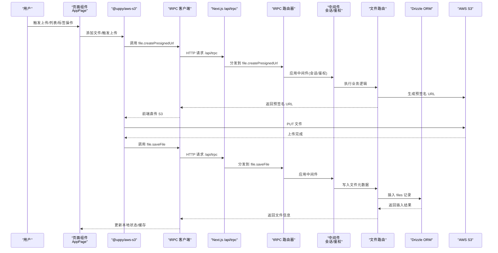
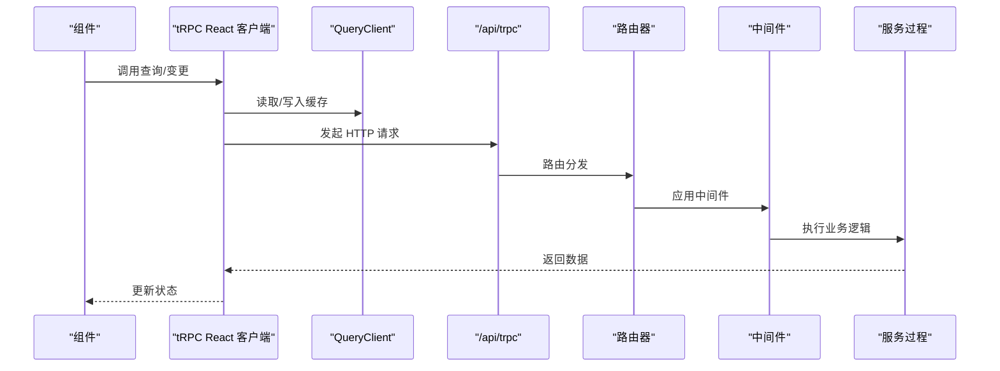
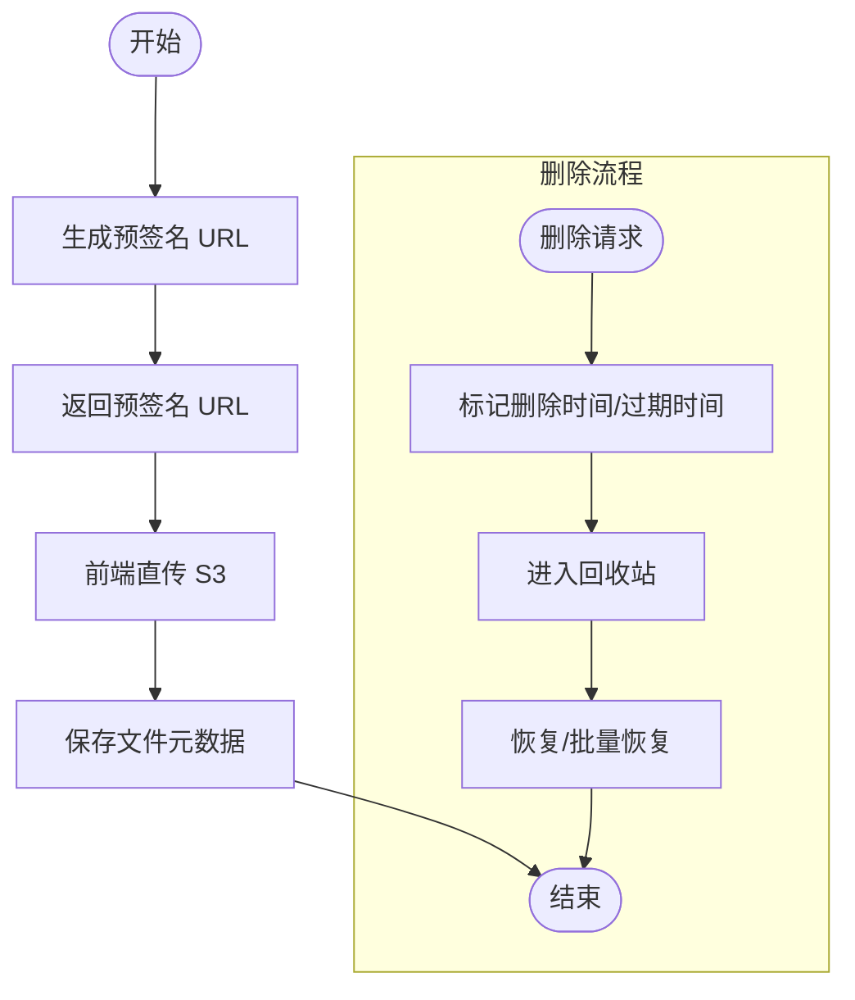
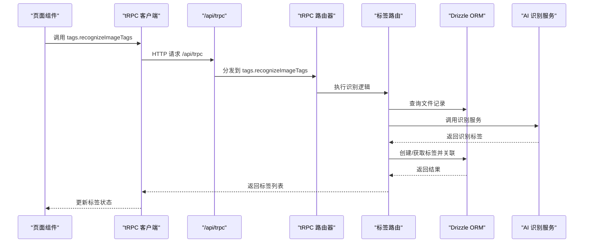
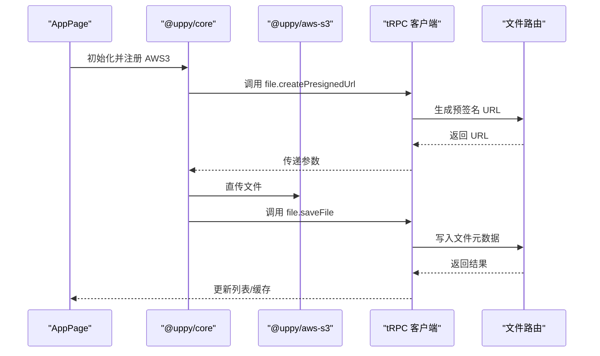
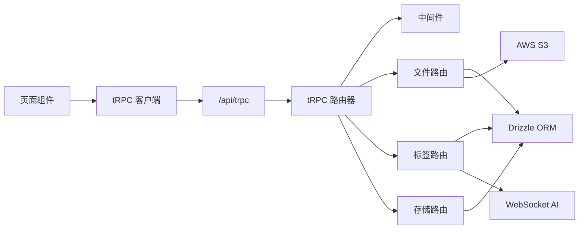

# 数据流设计

<cite>
**本文引用的文件**
- [src/app/trpc-provider.tsx](file://src/app/trpc-provider.tsx)
- [src/utils/api.ts](file://src/utils/api.ts)
- [src/server/trpc-middlewares/router.ts](file://src/server/trpc-middlewares/router.ts)
- [src/server/trpc-middlewares/trpc.ts](file://src/server/trpc-middlewares/trpc.ts)
- [src/app/api/trpc/[...trpc]/route.ts](file://src/app/api/trpc/[...trpc]/route.ts)
- [src/server/routes/file.ts](file://src/server/routes/file.ts)
- [src/server/routes/tags.ts](file://src/server/routes/tags.ts)
- [src/server/routes/storages.ts](file://src/server/routes/storages.ts)
- [src/server/db/schema.ts](file://src/server/db/schema.ts)
- [src/app/dashboard/apps/[appId]/page.tsx](file://src/app/dashboard/apps/[appId]/page.tsx)
- [src/components/feature/dropzone.tsx](file://src/components/feature/dropzone.tsx)
- [src/components/feature/upload-preview.tsx](file://src/components/feature/upload-preview.tsx)
- [src/components/feature/file-item.tsx](file://src/components/feature/file-item.tsx)
- [src/hooks/use-uppy-state.ts](file://src/hooks/use-uppy-state.ts)
</cite>

## 目录
1. [引言](#引言)
2. [项目结构](#项目结构)
3. [核心组件](#核心组件)
4. [架构总览](#架构总览)
5. [详细组件分析](#详细组件分析)
6. [依赖关系分析](#依赖关系分析)
7. [性能考量](#性能考量)
8. [故障排查指南](#故障排查指南)
9. [结论](#结论)
10. [附录](#附录)

## 引言
本文件面向 Image SaaS 项目，系统性梳理从前端用户操作到后端数据库的完整数据流，重点覆盖：
- tRPC 客户端与服务器端的数据同步机制、缓存策略与状态管理
- 文件上传数据流、AWS S3 集成与文件元数据处理
- 标签系统数据流转、AI 识别服务集成与数据更新机制
- 数据验证、错误传播与性能优化策略

目标是帮助开发者与产品人员快速理解数据在系统内的流动路径与关键节点。

## 项目结构
项目采用 Next.js App Router + tRPC + Drizzle ORM + PostgreSQL 的前后端一体化架构。前端通过 tRPC React Query 客户端发起请求，后端通过 tRPC 路由器聚合各模块路由，Drizzle ORM 访问数据库，文件上传通过 AWS S3 预签名 URL 直传，标签系统支持 AI 识别与自动标注。

```mermaid
graph TB
subgraph "前端"
UI["页面组件<br/>AppPage / FileList / UploadPreview"]
Uppy["@uppy/core + @uppy/aws-s3"]
TRPCR["tRPC React 客户端"]
Provider["TrpcProvider<br/>QueryClient"]
end
subgraph "后端"
API["Next.js API 路由<br/>/api/trpc"]
Router["tRPC 路由器<br/>router.ts"]
Proc["中间件与过程<br/>trpc.ts"]
Files["文件路由<br/>file.ts"]
Tags["标签路由<br/>tags.ts"]
Storages["存储路由<br/>storages.ts"]
DB["Drizzle ORM<br/>schema.ts"]
S3["AWS S3"]
end
UI --> Uppy
Uppy --> TRPCR
Provider --> TRPCR
TRPCR --> API
API --> Router
Router --> Proc
Router --> Files
Router --> Tags
Router --> Storages
Files --> DB
Tags --> DB
Storages --> DB
Files --> S3
```

图示来源
- [src/app/trpc-provider.tsx:1-18](file://src/app/trpc-provider.tsx#L1-L18)
- [src/utils/api.ts:1-17](file://src/utils/api.ts#L1-L17)
- [src/server/trpc-middlewares/router.ts:1-20](file://src/server/trpc-middlewares/router.ts#L1-L20)
- [src/server/trpc-middlewares/trpc.ts:1-130](file://src/server/trpc-middlewares/trpc.ts#L1-L130)
- [src/app/api/trpc/[...trpc]/route.ts:1-14](file://src/app/api/trpc/[...trpc]/route.ts#L1-L14)
- [src/server/routes/file.ts:1-561](file://src/server/routes/file.ts#L1-L561)
- [src/server/routes/tags.ts:1-735](file://src/server/routes/tags.ts#L1-L735)
- [src/server/routes/storages.ts:1-74](file://src/server/routes/storages.ts#L1-L74)
- [src/server/db/schema.ts:1-270](file://src/server/db/schema.ts#L1-L270)

章节来源
- [src/app/trpc-provider.tsx:1-18](file://src/app/trpc-provider.tsx#L1-L18)
- [src/utils/api.ts:1-17](file://src/utils/api.ts#L1-L17)
- [src/server/trpc-middlewares/router.ts:1-20](file://src/server/trpc-middlewares/router.ts#L1-L20)
- [src/server/trpc-middlewares/trpc.ts:1-130](file://src/server/trpc-middlewares/trpc.ts#L1-L130)
- [src/app/api/trpc/[...trpc]/route.ts:1-14](file://src/app/api/trpc/[...trpc]/route.ts#L1-L14)

## 核心组件
- tRPC 客户端与 Provider
  - 前端通过 tRPC React 客户端发起请求，配合 QueryClient 实现缓存与状态管理。
  - Provider 在根部注入客户端与 QueryClient，确保全局一致的状态与缓存行为。
- tRPC 路由器与中间件
  - 路由器聚合文件、标签、存储等模块路由；中间件负责会话校验、日志与 API Key/签名鉴权。
- 数据层
  - Drizzle ORM 定义表结构与关系，提供类型安全的查询与事务支持。
- 文件上传与标签系统
  - 上传通过预签名 URL 直传 S3；标签系统支持手动与 AI 自动识别，统一写入文件-标签关联表。

章节来源
- [src/app/trpc-provider.tsx:1-18](file://src/app/trpc-provider.tsx#L1-L18)
- [src/utils/api.ts:1-17](file://src/utils/api.ts#L1-L17)
- [src/server/trpc-middlewares/router.ts:1-20](file://src/server/trpc-middlewares/router.ts#L1-L20)
- [src/server/trpc-middlewares/trpc.ts:1-130](file://src/server/trpc-middlewares/trpc.ts#L1-L130)
- [src/server/db/schema.ts:1-270](file://src/server/db/schema.ts#L1-L270)

## 架构总览
下图展示从用户操作到数据库与 S3 的整体数据流，包括 tRPC 同步、缓存与鉴权链路。

图示来源
- [src/app/dashboard/apps/[appId]/page.tsx:56-72](file://src/app/dashboard/apps/[appId]/page.tsx#L56-L72)
- [src/server/routes/file.ts:27-90](file://src/server/routes/file.ts#L27-L90)
- [src/server/routes/file.ts:91-118](file://src/server/routes/file.ts#L91-L118)
- [src/app/api/trpc/[...trpc]/route.ts:1-14](file://src/app/api/trpc/[...trpc]/route.ts#L1-L14)
- [src/server/trpc-middlewares/router.ts:1-20](file://src/server/trpc-middlewares/router.ts#L1-L20)
- [src/server/trpc-middlewares/trpc.ts:11-45](file://src/server/trpc-middlewares/trpc.ts#L11-L45)

## 详细组件分析

### 组件一：tRPC 客户端与 Provider
- 客户端
  - 通过 createTRPCReact 创建 React 客户端，httpBatchLink 指向 /api/trpc。
  - 支持批量请求，减少往返开销。
- Provider
  - 注入 QueryClient，统一缓存策略与失效策略。
  - 通过 trpcClientReact.Provider 提供上下文给子组件。

图示来源
- [src/utils/api.ts:1-17](file://src/utils/api.ts#L1-L17)
- [src/app/trpc-provider.tsx:1-18](file://src/app/trpc-provider.tsx#L1-L18)
- [src/app/api/trpc/[...trpc]/route.ts:1-14](file://src/app/api/trpc/[...trpc]/route.ts#L1-L14)
- [src/server/trpc-middlewares/router.ts:1-20](file://src/server/trpc-middlewares/router.ts#L1-L20)
- [src/server/trpc-middlewares/trpc.ts:11-45](file://src/server/trpc-middlewares/trpc.ts#L11-L45)

章节来源
- [src/utils/api.ts:1-17](file://src/utils/api.ts#L1-L17)
- [src/app/trpc-provider.tsx:1-18](file://src/app/trpc-provider.tsx#L1-L18)

### 组件二：文件上传数据流（含 S3 集成）
- 预签名 URL 生成
  - 客户端调用 file.createPresignedUrl，后端根据应用配置生成 S3 预签名 URL。
  - 生成 Key 时按日期目录组织，便于后续归档与清理。
- 直传与入库
  - 前端使用 @uppy/aws-s3 直接上传至 S3，完成后调用 file.saveFile 写入数据库。
- 删除与回收站
  - 删除文件不立即物理删除，而是设置删除时间与过期时间，支持恢复与批量恢复。
- 回收站与永久删除
  - 支持查询回收站、批量恢复与批量永久删除；永久删除处预留 S3 文件删除占位。

图示来源
- [src/server/routes/file.ts:27-90](file://src/server/routes/file.ts#L27-L90)
- [src/server/routes/file.ts:91-118](file://src/server/routes/file.ts#L91-L118)
- [src/server/routes/file.ts:236-342](file://src/server/routes/file.ts#L236-L342)
- [src/server/routes/file.ts:501-557](file://src/server/routes/file.ts#L501-L557)

章节来源
- [src/server/routes/file.ts:1-561](file://src/server/routes/file.ts#L1-L561)

### 组件三：标签系统与 AI 识别
- 标签 CRUD 与关联
  - 支持创建、更新、删除标签；为文件添加/移除标签；清理未使用标签。
  - 通过 files_tags 表维护文件与标签的多对多关系。
- 标签分类与统计
  - 支持按分类类型(person/location/event)分组查询与统计使用次数。
- AI 识别
  - 调用 AI 服务识别图片标签，清洗与去重后创建或获取标签并关联到文件。
  - 识别服务目前实现为 OpenAI/讯飞星火 WebSocket 方案，具备超时与错误处理。

图示来源
- [src/server/routes/tags.ts:415-531](file://src/server/routes/tags.ts#L415-L531)
- [src/server/routes/tags.ts:534-735](file://src/server/routes/tags.ts#L534-L735)
- [src/server/routes/tags.ts:46-74](file://src/server/routes/tags.ts#L46-L74)

章节来源
- [src/server/routes/tags.ts:1-735](file://src/server/routes/tags.ts#L1-L735)
- [src/server/db/schema.ts:202-270](file://src/server/db/schema.ts#L202-L270)

### 组件四：前端上传与状态管理
- Uppy 集成
  - 页面初始化 Uppy 并注册 @uppy/aws-s3，通过 createPresignedUrl 获取上传参数。
  - 通过 useUppyState 订阅 Uppy 状态，驱动 UI 展示与交互。
- 上传预览与批量操作
  - UploadPreview 展示待上传文件，支持切换、删除与一键上传。
  - Dropzone 支持拖拽添加文件，结合 Paste 事件支持粘贴上传。

图示来源
- [src/app/dashboard/apps/[appId]/page.tsx:56-72](file://src/app/dashboard/apps/[appId]/page.tsx#L56-L72)
- [src/hooks/use-uppy-state.ts:1-17](file://src/hooks/use-uppy-state.ts#L1-L17)
- [src/components/feature/upload-preview.tsx:1-119](file://src/components/feature/upload-preview.tsx#L1-L119)
- [src/components/feature/dropzone.tsx:1-52](file://src/components/feature/dropzone.tsx#L1-L52)
- [src/components/feature/file-item.tsx:1-138](file://src/components/feature/file-item.tsx#L1-L138)

章节来源
- [src/app/dashboard/apps/[appId]/page.tsx:1-266](file://src/app/dashboard/apps/[appId]/page.tsx#L1-L266)
- [src/hooks/use-uppy-state.ts:1-17](file://src/hooks/use-uppy-state.ts#L1-L17)
- [src/components/feature/upload-preview.tsx:1-119](file://src/components/feature/upload-preview.tsx#L1-L119)
- [src/components/feature/dropzone.tsx:1-52](file://src/components/feature/dropzone.tsx#L1-L52)
- [src/components/feature/file-item.tsx:1-138](file://src/components/feature/file-item.tsx#L1-L138)

## 依赖关系分析
- 组件耦合
  - 前端组件依赖 tRPC 客户端与 Uppy；tRPC 客户端依赖 Next.js API 路由与 tRPC 路由器。
  - 后端路由依赖中间件进行鉴权与日志；文件路由依赖 S3 SDK；标签路由依赖 AI 服务。
- 外部依赖
  - AWS S3：用于文件直传与存储。
  - WebSocket：用于 AI 识别服务通信。
- 数据模型
  - files、tags、files_tags、storageConfiguration 等表通过 relations 建立关联，支持复杂查询与事务。

图示来源
- [src/server/db/schema.ts:1-270](file://src/server/db/schema.ts#L1-L270)
- [src/server/routes/file.ts:1-561](file://src/server/routes/file.ts#L1-L561)
- [src/server/routes/tags.ts:1-735](file://src/server/routes/tags.ts#L1-L735)
- [src/server/routes/storages.ts:1-74](file://src/server/routes/storages.ts#L1-L74)

章节来源
- [src/server/db/schema.ts:1-270](file://src/server/db/schema.ts#L1-L270)

## 性能考量
- 批量请求与缓存
  - tRPC httpBatchLink 合并请求，降低网络开销；QueryClient 提供缓存与失效策略，避免重复请求。
- 分页与游标
  - 文件列表与按标签查询均支持游标分页，减少大数据集传输与排序成本。
- 数据库索引
  - files 与 tags 表建立复合索引，提升查询与排序性能。
- 上传优化
  - 预签名 URL 直传 S3，避免应用服务器成为瓶颈；前端并发控制与断点续传能力可进一步增强。

## 故障排查指南
- 鉴权失败
  - 若出现 FORBIDDEN 或 NOT_FOUND，检查会话与 API Key/签名是否正确，确认中间件是否正确注入上下文。
- 文件上传失败
  - 检查预签名 URL 生成是否成功、S3 凭证是否正确、Bucket/Region 是否匹配。
- 标签识别异常
  - 检查 AI 服务凭证与网络连通性；关注 WebSocket 超时与错误日志。
- 回收站与删除
  - 确认删除时间与过期时间字段是否正确设置；批量操作需确保用户与应用 ID 匹配。

章节来源
- [src/server/trpc-middlewares/trpc.ts:30-45](file://src/server/trpc-middlewares/trpc.ts#L30-L45)
- [src/server/routes/file.ts:236-342](file://src/server/routes/file.ts#L236-L342)
- [src/server/routes/tags.ts:415-531](file://src/server/routes/tags.ts#L415-L531)

## 结论
本项目通过 tRPC 实现前后端高效协同，结合 Drizzle ORM 与 PostgreSQL 提供强类型数据访问，文件上传采用 S3 预签名直传模式，标签系统支持手动与 AI 自动识别。整体数据流清晰、可扩展性强，建议在生产环境中进一步完善上传并发控制、回收站清理任务与 AI 识别降级策略。

## 附录
- 关键流程路径参考
  - tRPC 客户端初始化与 Provider 注入：[src/utils/api.ts:1-17](file://src/utils/api.ts#L1-L17)，[src/app/trpc-provider.tsx:1-18](file://src/app/trpc-provider.tsx#L1-L18)
  - API 路由入口：[src/app/api/trpc/[...trpc]/route.ts:1-14](file://src/app/api/trpc/[...trpc]/route.ts#L1-L14)
  - tRPC 路由器与中间件：[src/server/trpc-middlewares/router.ts:1-20](file://src/server/trpc-middlewares/router.ts#L1-L20)，[src/server/trpc-middlewares/trpc.ts:1-130](file://src/server/trpc-middlewares/trpc.ts#L1-L130)
  - 文件上传与入库：[src/server/routes/file.ts:27-118](file://src/server/routes/file.ts#L27-L118)
  - 标签识别与关联：[src/server/routes/tags.ts:415-531](file://src/server/routes/tags.ts#L415-L531)
  - 存储配置：[src/server/routes/storages.ts:1-74](file://src/server/routes/storages.ts#L1-L74)
  - 数据模型定义：[src/server/db/schema.ts:1-270](file://src/server/db/schema.ts#L1-L270)
  - 前端上传与状态：[src/app/dashboard/apps/[appId]/page.tsx:56-72](file://src/app/dashboard/apps/[appId]/page.tsx#L56-L72)，[src/hooks/use-uppy-state.ts:1-17](file://src/hooks/use-uppy-state.ts#L1-L17)