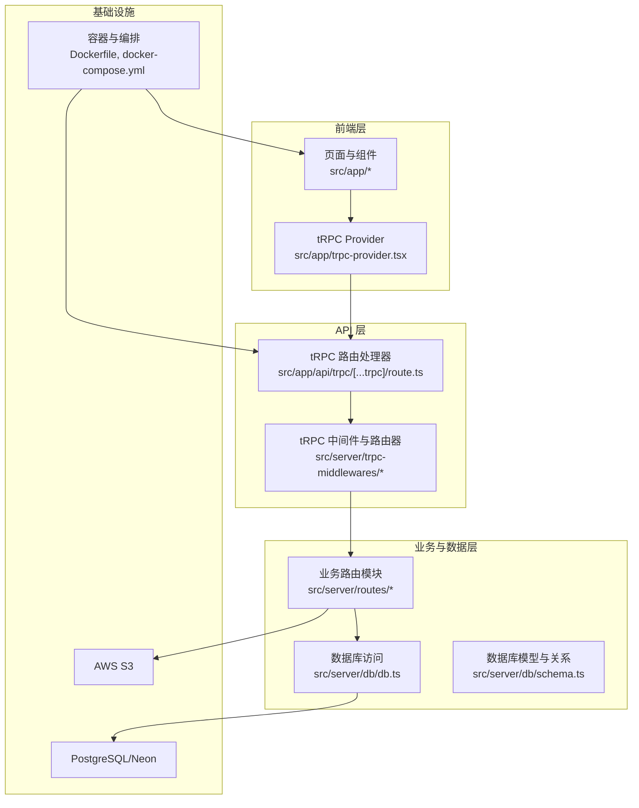
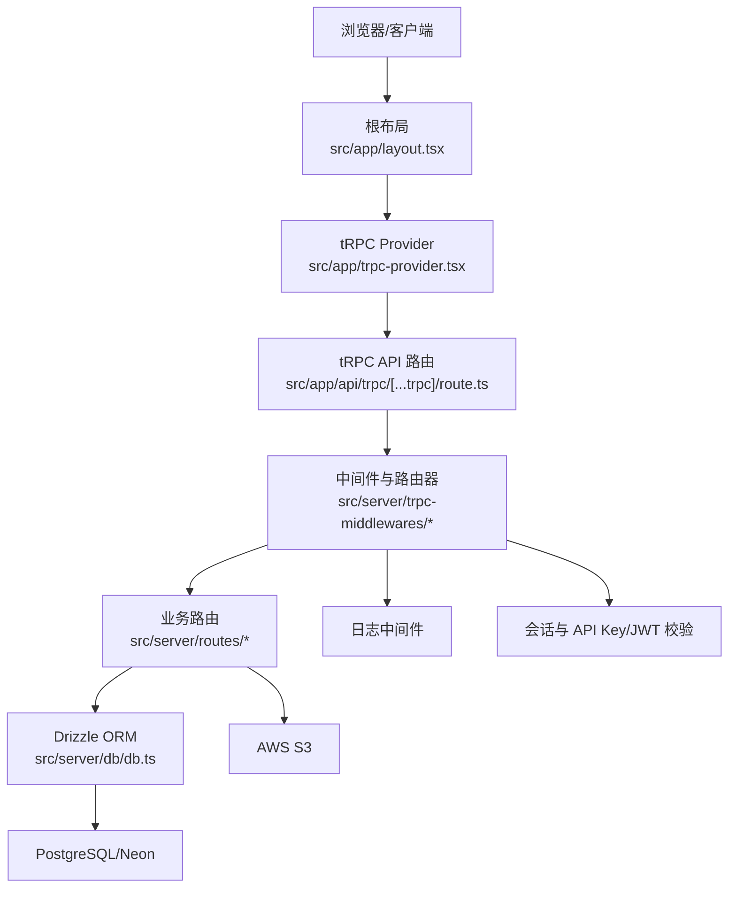
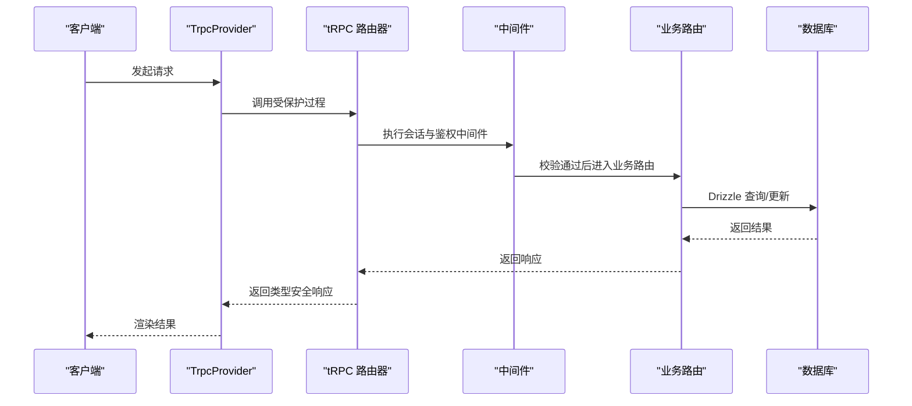
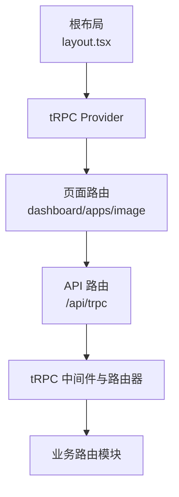
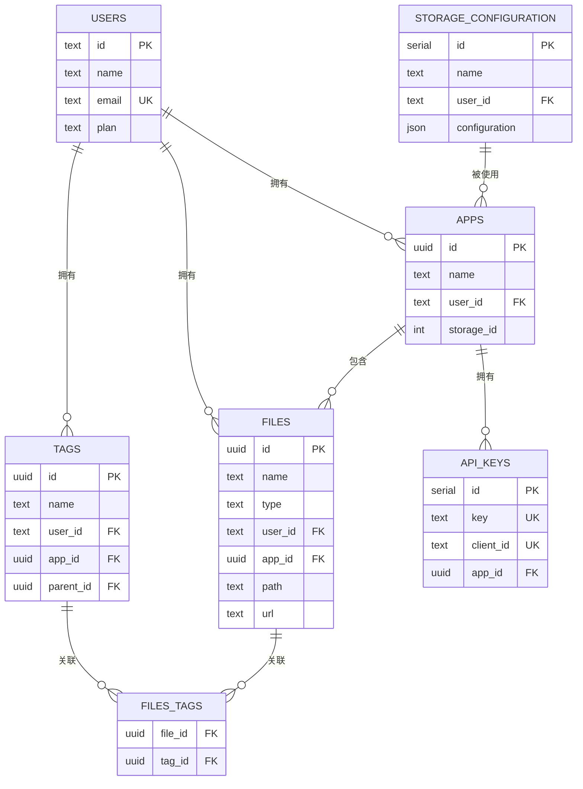
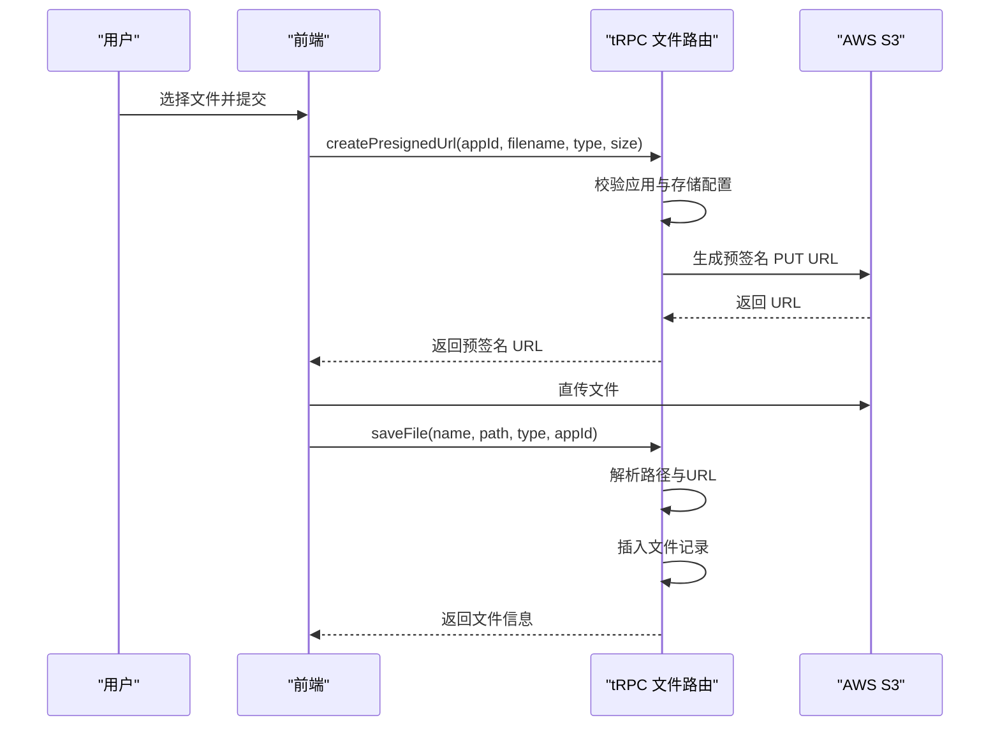
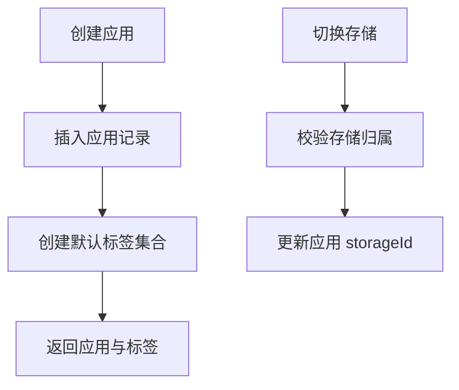
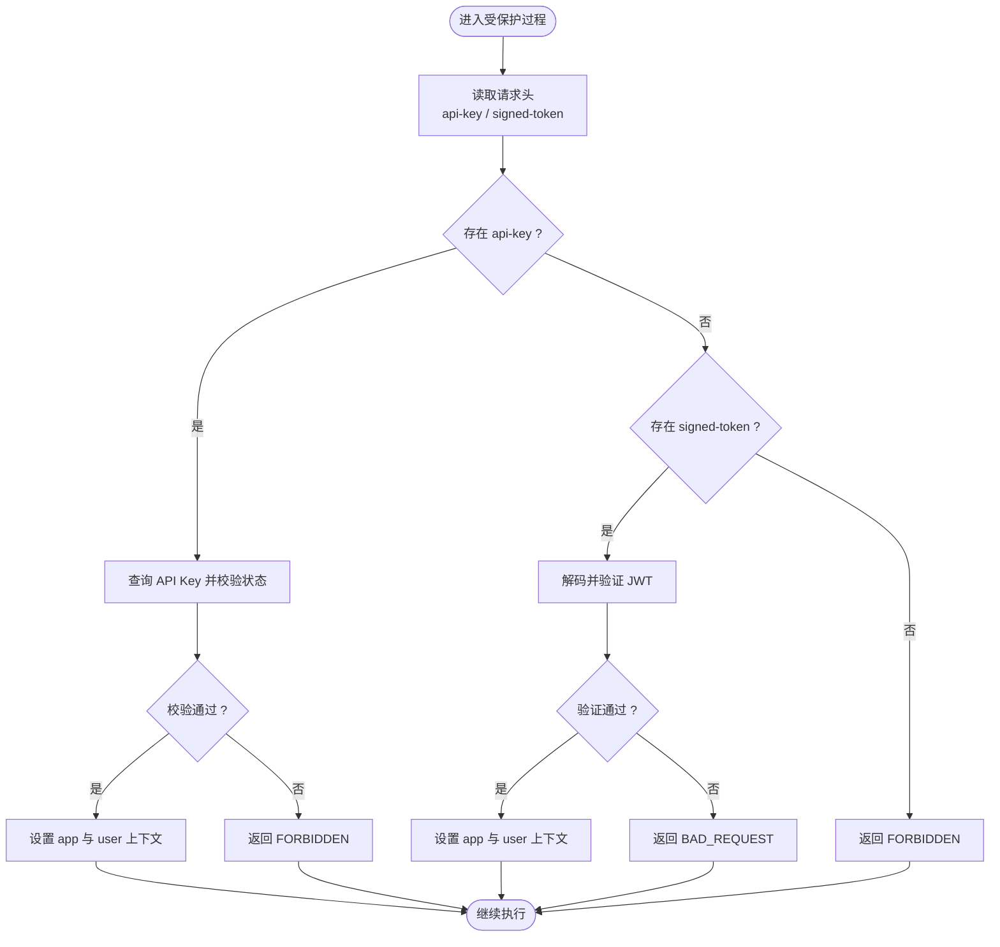
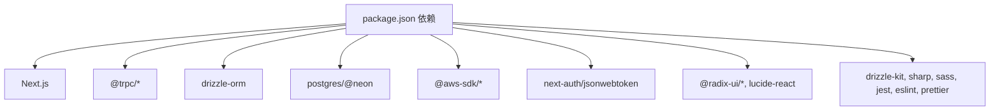

# 架构设计

<cite>
**本文档引用的文件**
- [package.json](file://package.json)
- [next.config.ts](file://next.config.ts)
- [Dockerfile](file://Dockerfile)
- [docker-compose.yml](file://docker-compose.yml)
- [drizzle.config.ts](file://drizzle.config.ts)
- [src/app/layout.tsx](file://src/app/layout.tsx)
- [src/app/trpc-provider.tsx](file://src/app/trpc-provider.tsx)
- [src/app/api/trpc/[...trpc]/route.ts](file://src/app/api/trpc/[...trpc]/route.ts)
- [src/server/trpc-middlewares/trpc.ts](file://src/server/trpc-middlewares/trpc.ts)
- [src/server/trpc-middlewares/router.ts](file://src/server/trpc-middlewares/router.ts)
- [src/utils/trpc.ts](file://src/utils/trpc.ts)
- [src/server/db/db.ts](file://src/server/db/db.ts)
- [src/server/db/schema.ts](file://src/server/db/schema.ts)
- [src/server/routes/file.ts](file://src/server/routes/file.ts)
- [src/server/routes/app.ts](file://src/server/routes/app.ts)
- [src/components/ui/image-review/index.tsx](file://src/components/ui/image-review/index.tsx)
</cite>

## 目录

1. [引言](#引言)
2. [项目结构](#项目结构)
3. [核心组件](#核心组件)
4. [架构总览](#架构总览)
5. [详细组件分析](#详细组件分析)
6. [依赖分析](#依赖分析)
7. [性能考虑](#性能考虑)
8. [故障排查指南](#故障排查指南)
9. [结论](#结论)
10. [附录](#附录)

## 引言

本项目是一个基于 Next.js App Router 的 Image SaaS 应用，采用分层架构与微服务化思想，结合 tRPC 实现端到端类型安全，Drizzle ORM 提供数据库抽象，AWS S3 作为对象存储后端。系统通过 Next.js 的路由策略组织前端页面与 API 路由，配合 tRPC 中间件实现鉴权与日志，Drizzle 抽象数据库访问，形成清晰的职责边界与可扩展的架构。

## 项目结构

项目采用按功能域划分的目录结构，前端页面与 API 路由位于 src/app 下，业务逻辑与数据访问位于 src/server 与 src/utils，数据库模型与迁移位于 drizzle 目录。

**图示来源**

- [src/app/layout.tsx:1-37](file://src/app/layout.tsx#L1-L37)
- [src/app/trpc-provider.tsx:1-18](file://src/app/trpc-provider.tsx#L1-L18)
- [src/app/api/trpc/[...trpc]/route.ts:1-14](file://src/app/api/trpc/[...trpc]/route.ts#L1-L14)
- [src/server/trpc-middlewares/router.ts:1-20](file://src/server/trpc-middlewares/router.ts#L1-L20)
- [src/server/db/db.ts:1-9](file://src/server/db/db.ts#L1-L9)
- [src/server/db/schema.ts:1-270](file://src/server/db/schema.ts#L1-L270)
- [Dockerfile:1-76](file://Dockerfile#L1-L76)
- [docker-compose.yml:1-72](file://docker-compose.yml#L1-L72)

**章节来源**

- [package.json:1-94](file://package.json#L1-L94)
- [next.config.ts:1-22](file://next.config.ts#L1-L22)
- [drizzle.config.ts:1-14](file://drizzle.config.ts#L1-L14)

## 核心组件

- tRPC 类型安全 API：在服务端定义路由器与过程，在客户端通过类型推断调用，确保前后端一致。
- Next.js App Router：页面路由、布局与 API 路由统一管理，支持并行加载与拦截路由。
- Drizzle ORM：PostgreSQL 抽象，提供类型安全的查询与迁移工具链。
- AWS S3 集成：通过预签名 URL 支持直传，提升上传性能与安全性。
- 认证与授权：NextAuth 管理会话，tRPC 中间件校验 API Key 或 JWT Token。

**章节来源**

- [src/server/trpc-middlewares/router.ts:1-20](file://src/server/trpc-middlewares/router.ts#L1-L20)
- [src/server/trpc-middlewares/trpc.ts:1-130](file://src/server/trpc-middlewares/trpc.ts#L1-L130)
- [src/server/db/schema.ts:1-270](file://src/server/db/schema.ts#L1-L270)
- [src/server/routes/file.ts:1-561](file://src/server/routes/file.ts#L1-L561)

## 架构总览

系统采用“前端页面 + tRPC API + 数据层”的三层架构，API 层通过中间件实现鉴权与日志，业务路由模块封装具体领域操作，数据层通过 Drizzle ORM 与 PostgreSQL 交互，并通过 S3 存储图片资源。

**图示来源**

- [src/app/layout.tsx:1-37](file://src/app/layout.tsx#L1-L37)
- [src/app/trpc-provider.tsx:1-18](file://src/app/trpc-provider.tsx#L1-L18)
- [src/app/api/trpc/[...trpc]/route.ts:1-14](file://src/app/api/trpc/[...trpc]/route.ts#L1-L14)
- [src/server/trpc-middlewares/trpc.ts:1-130](file://src/server/trpc-middlewares/trpc.ts#L1-L130)
- [src/server/db/db.ts:1-9](file://src/server/db/db.ts#L1-L9)

## 详细组件分析

### tRPC 类型安全 API

- 路由器聚合：将文件、应用、标签、存储、API Key、用户计划等子路由聚合为统一 appRouter。
- 过程保护：提供受保护过程与应用级过程，分别处理用户会话与 API Key/JWT Token 验证。
- 客户端集成：在客户端通过 Provider 注入 QueryClient 与纯客户端实例，实现 React Query 缓存与刷新。

**图示来源**

- [src/app/trpc-provider.tsx:1-18](file://src/app/trpc-provider.tsx#L1-L18)
- [src/server/trpc-middlewares/router.ts:1-20](file://src/server/trpc-middlewares/router.ts#L1-L20)
- [src/server/trpc-middlewares/trpc.ts:1-130](file://src/server/trpc-middlewares/trpc.ts#L1-L130)
- [src/server/db/db.ts:1-9](file://src/server/db/db.ts#L1-L9)

**章节来源**

- [src/server/trpc-middlewares/router.ts:1-20](file://src/server/trpc-middlewares/router.ts#L1-L20)
- [src/server/trpc-middlewares/trpc.ts:1-130](file://src/server/trpc-middlewares/trpc.ts#L1-L130)
- [src/app/trpc-provider.tsx:1-18](file://src/app/trpc-provider.tsx#L1-L18)

### Next.js App Router 路由策略

- 页面路由：dashboard、apps、image 等页面按功能域组织，支持并行加载与拦截路由。
- API 路由：/api/trpc 统一接入 tRPC，/api/auth 与 /api/open 用于认证与开放接口。
- 布局与提供者：根布局注入 tRPC Provider 与全局样式，保证全站类型安全与主题一致性。

**图示来源**

- [src/app/layout.tsx:1-37](file://src/app/layout.tsx#L1-L37)
- [src/app/api/trpc/[...trpc]/route.ts:1-14](file://src/app/api/trpc/[...trpc]/route.ts#L1-L14)

**章节来源**

- [src/app/layout.tsx:1-37](file://src/app/layout.tsx#L1-L37)
- [src/app/api/trpc/[...trpc]/route.ts:1-14](file://src/app/api/trpc/[...trpc]/route.ts#L1-L14)

### Drizzle ORM 数据库抽象

- 模型定义：用户、应用、文件、标签、存储配置、API Key 等表结构与关系。
- 查询与迁移：通过 drizzle-orm 与 postgres-js 提供类型安全查询；drizzle-kit 管理迁移。
- 关系映射：使用 relations 定义一对多/多对多关系，便于跨表查询。

**图示来源**

- [src/server/db/schema.ts:1-270](file://src/server/db/schema.ts#L1-L270)

**章节来源**

- [src/server/db/schema.ts:1-270](file://src/server/db/schema.ts#L1-L270)
- [drizzle.config.ts:1-14](file://drizzle.config.ts#L1-L14)
- [src/server/db/db.ts:1-9](file://src/server/db/db.ts#L1-L9)

### 文件上传与存储流程

- 预签名 URL：生成短期有效的 PUT 请求 URL，客户端直传至 S3，降低服务器负载。
- 元数据入库：直传完成后调用保存接口，写入文件元数据与用户、应用上下文。
- 分页与检索：支持游标分页、按标签过滤、时间范围与名称模糊检索。

**图示来源**

- [src/server/routes/file.ts:1-561](file://src/server/routes/file.ts#L1-L561)

**章节来源**

- [src/server/routes/file.ts:1-561](file://src/server/routes/file.ts#L1-L561)

### 应用与标签管理

- 应用创建：为新应用初始化默认标签（人物、地点、事务），便于后续图片标注与检索。
- 存储绑定：将应用与存储配置关联，确保上传路径与权限正确。
- 标签体系：支持层级标签与分类类型，便于复杂内容管理。

**图示来源**

- [src/server/routes/app.ts:1-88](file://src/server/routes/app.ts#L1-L88)

**章节来源**

- [src/server/routes/app.ts:1-88](file://src/server/routes/app.ts#L1-L88)

### 认证与授权中间件

- 会话校验：通过 NextAuth 获取当前会话，确保用户登录状态。
- API Key 校验：支持通过请求头 api-key 快速校验，适用于第三方集成。
- JWT 校验：支持带签名的客户端 ID，验证签名与密钥匹配，增强安全性。

**图示来源**

- [src/server/trpc-middlewares/trpc.ts:1-130](file://src/server/trpc-middlewares/trpc.ts#L1-L130)

**章节来源**

- [src/server/trpc-middlewares/trpc.ts:1-130](file://src/server/trpc-middlewares/trpc.ts#L1-L130)

## 依赖分析

- 前端运行时：Next.js 16、React 19、TailwindCSS、Radix UI、Lucide Icons。
- tRPC 生态：@trpc/server、@trpc/client、@trpc/react-query、@trpc/tanstack-react-query。
- 数据库：drizzle-orm、postgres、@neondatabase/serverless。
- 存储：@aws-sdk/client-s3、@aws-sdk/s3-request-presigner。
- 认证：next-auth、jsonwebtoken。
- 工具链：drizzle-kit、sharp、sass、jest、eslint、prettier。

**图示来源**

- [package.json:1-94](file://package.json#L1-L94)

**章节来源**

- [package.json:1-94](file://package.json#L1-L94)

## 性能考虑

- 上传性能：通过 S3 预签名 URL 直传，减少服务器带宽与 CPU 占用。
- 分页与索引：文件表建立复合索引，支持游标分页与多维排序，降低查询延迟。
- 缓存与并发：React Query 缓存与并发请求控制，减少重复网络请求。
- 构建优化：Next.js standalone 输出与多阶段 Docker 构建，减小镜像体积与启动时间。

**章节来源**

- [src/server/routes/file.ts:1-561](file://src/server/routes/file.ts#L1-L561)
- [next.config.ts:1-22](file://next.config.ts#L1-L22)
- [Dockerfile:1-76](file://Dockerfile#L1-L76)

## 故障排查指南

- tRPC 错误码定位：中间件在会话缺失或鉴权失败时抛出 FORBIDDEN/BAD_REQUEST/NOT_FOUND，优先检查会话与 API Key/JWT。
- 数据库连接：确认 DATABASE_URL 环境变量与数据库可达性；迁移脚本需与 schema 对齐。
- S3 权限：检查存储配置中的桶、区域、凭据与端点，确保预签名 URL 生成与上传成功。
- 日志与监控：中间件输出请求耗时日志，便于定位慢查询与异常路径。

**章节来源**

- [src/server/trpc-middlewares/trpc.ts:1-130](file://src/server/trpc-middlewares/trpc.ts#L1-L130)
- [src/server/db/db.ts:1-9](file://src/server/db/db.ts#L1-L9)
- [src/server/routes/file.ts:1-561](file://src/server/routes/file.ts#L1-L561)

## 结论

本项目通过 tRPC 实现端到端类型安全，结合 Next.js App Router 的路由策略与 Drizzle ORM 的数据库抽象，构建了清晰的分层架构。配合 S3 直传与游标分页等性能优化，满足图片管理场景的高可用与可扩展需求。建议持续完善 S3 文件删除与定时清理任务，强化数据生命周期管理。

## 附录

- 部署建议：使用 Docker 多阶段构建，结合 docker-compose 管理环境变量与健康检查。
- 开发工具：drizzle-kit 管理迁移，Jest 与 ESLint/Prettier 保障代码质量。
- 可扩展点：引入消息队列处理异步任务（如标签识别、缩略图生成），按需拆分微服务。

**章节来源**

- [Dockerfile:1-76](file://Dockerfile#L1-L76)
- [docker-compose.yml:1-72](file://docker-compose.yml#L1-L72)
- [drizzle.config.ts:1-14](file://drizzle.config.ts#L1-L14)
