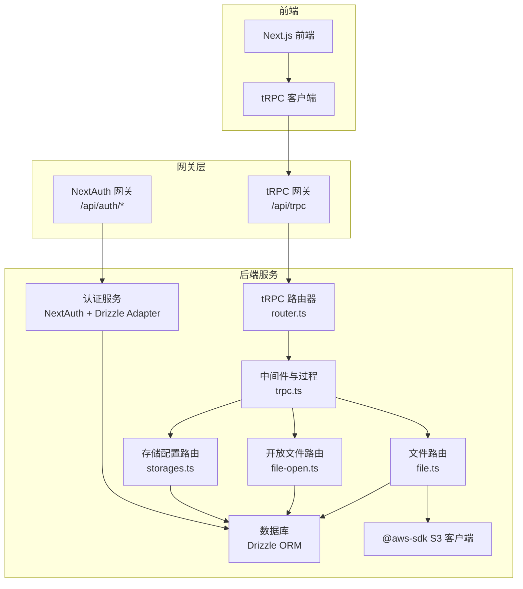
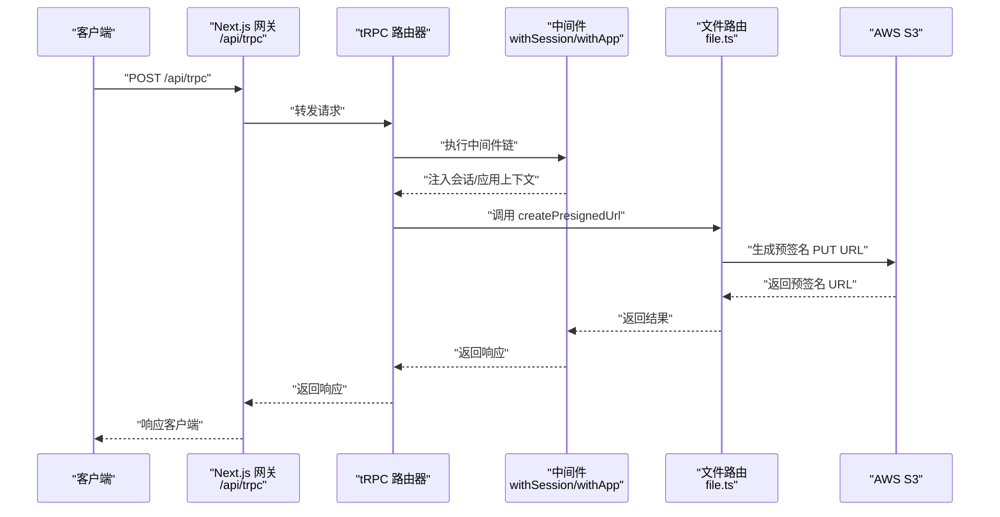
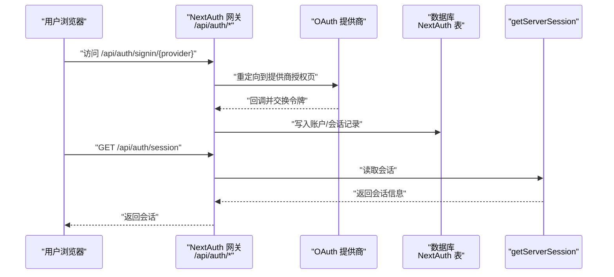
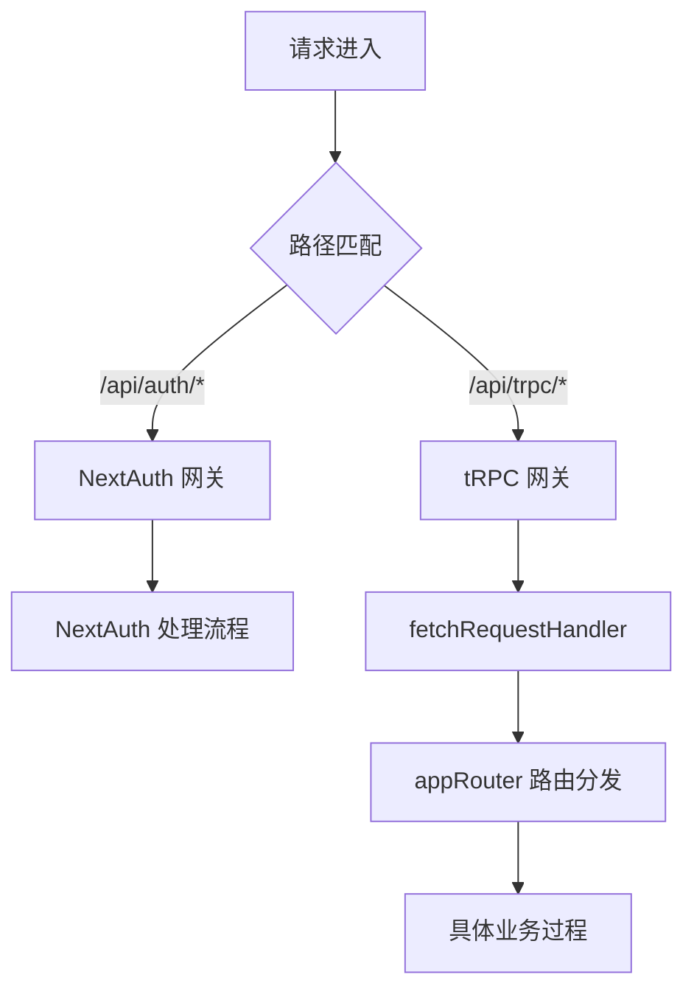
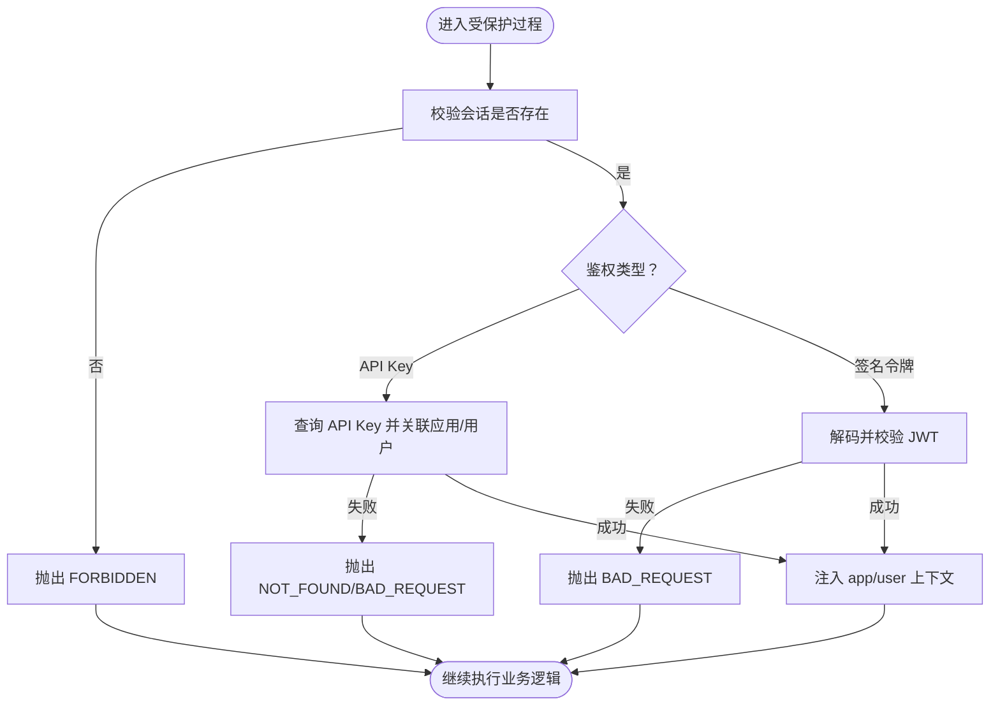
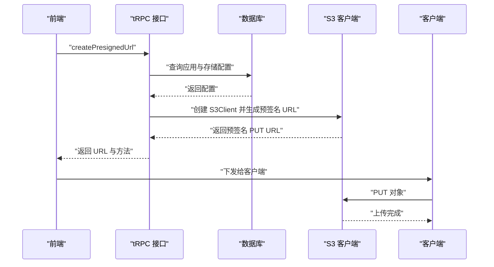
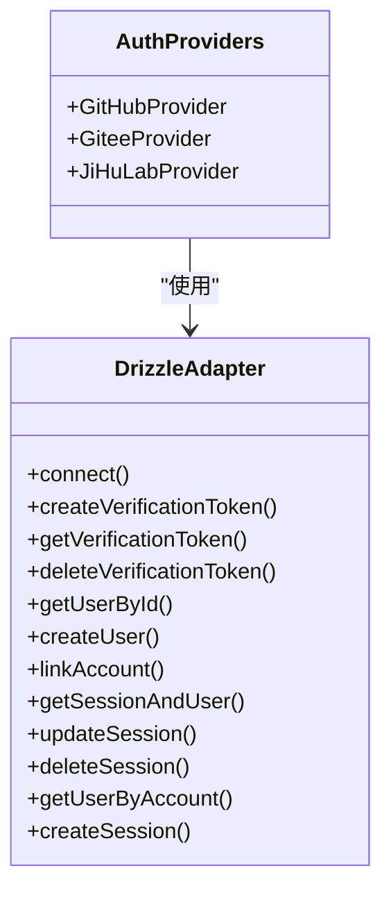
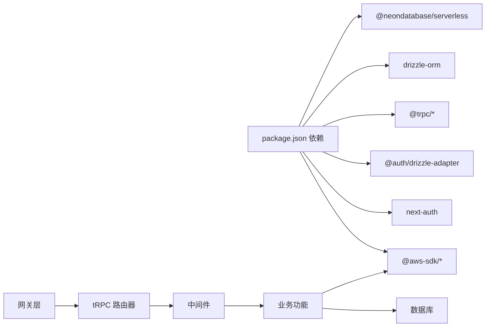

# 集成模式

<cite>
**本文引用的文件**   
- [src/lib/auth.ts](file://src/lib/auth.ts)
- [src/server/auth/index.ts](file://src/server/auth/index.ts)
- [src/app/api/auth/[...nextauth]/route.ts](file://src/app/api/auth/[...nextauth]/route.ts)
- [src/server/trpc-middlewares/trpc.ts](file://src/server/trpc-middlewares/trpc.ts)
- [src/server/trpc-middlewares/router.ts](file://src/server/trpc-middlewares/router.ts)
- [src/app/api/trpc/[...trpc]/route.ts](file://src/app/api/trpc/[...trpc]/route.ts)
- [src/server/routes/file.ts](file://src/server/routes/file.ts)
- [src/server/routes/file-open.ts](file://src/server/routes/file-open.ts)
- [src/server/routes/storages.ts](file://src/server/routes/storages.ts)
- [src/server/db/schema.ts](file://src/server/db/schema.ts)
- [src/utils/api.ts](file://src/utils/api.ts)
- [package.json](file://package.json)
- [docker-compose.yml](file://docker-compose.yml)
- [README.Docker.md](file://README.Docker.md)
</cite>

## 目录
1. [简介](#简介)
2. [项目结构](#项目结构)
3. [核心组件](#核心组件)
4. [架构总览](#架构总览)
5. [详细组件分析](#详细组件分析)
6. [依赖关系分析](#依赖关系分析)
7. [性能考量](#性能考量)
8. [故障排除指南](#故障排除指南)
9. [结论](#结论)
10. [附录](#附录)

## 简介
本文件面向 Image SaaS 项目的系统集成模式，聚焦以下第三方服务与平台的集成设计与实现：
- AWS S3 对象存储：通过预签名 URL 实现客户端直传，结合应用级鉴权与权限控制。
- OAuth 认证提供商：基于 NextAuth 的多源 OAuth 集成（GitHub、Gitee、JiHuLab），并支持 SKIP_LOGIN 管理员快速登录。
- AI 识别服务：通过 OpenRouter API 提供的接口能力进行图像标签识别（按需启用）。
同时，文档阐述认证系统的集成架构、会话管理与权限传递机制；说明 API 网关模式、服务发现与负载均衡策略；并给出安全、错误处理与监控方案，以及集成示例、配置指南与故障排除方法。

## 项目结构
项目采用 Next.js 应用与 tRPC 后端路由的分层组织方式，认证与数据库适配由 NextAuth 与 Drizzle ORM 提供，API 请求统一经由 tRPC 路由器集中处理，并在网关层进行请求转发。

**图表来源**
- [src/app/api/auth/[...nextauth]/route.ts](file://src/app/api/auth/[...nextauth]/route.ts#L1-L7)
- [src/app/api/trpc/[...trpc]/route.ts](file://src/app/api/trpc/[...trpc]/route.ts#L1-L14)
- [src/server/trpc-middlewares/router.ts:1-20](file://src/server/trpc-middlewares/router.ts#L1-L20)
- [src/server/trpc-middlewares/trpc.ts:1-130](file://src/server/trpc-middlewares/trpc.ts#L1-L130)
- [src/server/routes/file.ts:1-561](file://src/server/routes/file.ts#L1-L561)
- [src/server/routes/file-open.ts:1-197](file://src/server/routes/file-open.ts#L1-L197)
- [src/server/routes/storages.ts:1-74](file://src/server/routes/storages.ts#L1-L74)
- [src/server/db/schema.ts:1-270](file://src/server/db/schema.ts#L1-L270)

**章节来源**
- [src/app/api/auth/[...nextauth]/route.ts](file://src/app/api/auth/[...nextauth]/route.ts#L1-L7)
- [src/app/api/trpc/[...trpc]/route.ts](file://src/app/api/trpc/[...trpc]/route.ts#L1-L14)
- [src/server/trpc-middlewares/router.ts:1-20](file://src/server/trpc-middlewares/router.ts#L1-L20)

## 核心组件
- 认证与会话
  - NextAuth 配置与多 OAuth 提供商注册，Drizzle 适配器对接数据库，支持 SKIP_LOGIN 快速管理员登录。
  - 服务端会话获取封装，兼容 SKIP_LOGIN 场景。
- API 网关与路由
  - Next.js App Router 的 API 路由作为网关，转发至 tRPC 服务器端处理器。
  - tRPC 路由器聚合业务模块（文件、应用、标签、存储、API Key、用户套餐）。
- 中间件与权限
  - 会话中间件注入上下文；受保护过程强制校验会话；应用级 API Key 与签名令牌校验。
- 第三方集成
  - AWS S3：生成预签名 URL，客户端直传对象；支持自定义 S3 兼容端点。
  - OAuth：GitHub、Gitee、JiHuLab；可扩展更多提供商。
  - AI 识别：OpenRouter API（按需启用）。

**章节来源**
- [src/server/auth/index.ts:1-163](file://src/server/auth/index.ts#L1-L163)
- [src/lib/auth.ts:1-3](file://src/lib/auth.ts#L1-L3)
- [src/server/trpc-middlewares/trpc.ts:1-130](file://src/server/trpc-middlewares/trpc.ts#L1-L130)
- [src/server/trpc-middlewares/router.ts:1-20](file://src/server/trpc-middlewares/router.ts#L1-L20)
- [src/server/routes/file.ts:1-561](file://src/server/routes/file.ts#L1-L561)
- [src/server/routes/file-open.ts:1-197](file://src/server/routes/file-open.ts#L1-L197)
- [src/server/routes/storages.ts:1-74](file://src/server/routes/storages.ts#L1-L74)
- [src/server/db/schema.ts:154-183](file://src/server/db/schema.ts#L154-L183)

## 架构总览
Image SaaS 的系统集成采用“前端 tRPC 客户端 + Next.js API 网关 + tRPC 中间件 + 业务路由”的分层架构。认证通过 NextAuth 统一入口，会话信息在 tRPC 中间件中注入，业务路由在受保护上下文中执行。文件上传采用 S3 预签名 URL，避免服务端中转，提升吞吐与成本效率。

**图表来源**
- [src/app/api/trpc/[...trpc]/route.ts](file://src/app/api/trpc/[...trpc]/route.ts#L1-L14)
- [src/server/trpc-middlewares/router.ts:1-20](file://src/server/trpc-middlewares/router.ts#L1-L20)
- [src/server/trpc-middlewares/trpc.ts:1-130](file://src/server/trpc-middlewares/trpc.ts#L1-L130)
- [src/server/routes/file.ts:27-90](file://src/server/routes/file.ts#L27-L90)

## 详细组件分析

### 认证系统与会话管理
- 多 OAuth 提供商
  - GitHub、Gitee、JiHuLab 已注册，支持授权、令牌交换与用户资料拉取。
  - 可通过环境变量注入客户端 ID 与密钥。
- Drizzle 适配器
  - NextAuth 使用 Drizzle Adapter 将账户、会话、验证码等表与数据库关联。
- SKIP_LOGIN 管理员模式
  - 当启用时，自动创建默认管理员用户并返回固定会话，便于开发与演示。
- 服务端会话获取
  - 封装 getServerSession，兼容 SKIP_LOGIN 与标准 NextAuth 流程。

**图表来源**
- [src/app/api/auth/[...nextauth]/route.ts](file://src/app/api/auth/[...nextauth]/route.ts#L1-L7)
- [src/server/auth/index.ts:1-163](file://src/server/auth/index.ts#L1-L163)

**章节来源**
- [src/server/auth/index.ts:1-163](file://src/server/auth/index.ts#L1-L163)
- [src/app/api/auth/[...nextauth]/route.ts](file://src/app/api/auth/[...nextauth]/route.ts#L1-L7)
- [src/lib/auth.ts:1-3](file://src/lib/auth.ts#L1-L3)

### API 网关与服务发现
- Next.js App Router API
  - /api/auth/[...nextauth] 与 /api/trpc/[...trpc] 分别作为认证与 tRPC 网关入口。
- tRPC 服务器端适配
  - 使用 fetchRequestHandler 将请求交由 appRouter 处理，统一 endpoint 为 /api/trpc。
- 服务发现与负载均衡
  - 通过容器编排与外部负载均衡器（如 Nginx、云 LB）对多实例进行分发。
  - 健康检查确保实例可用性。

**图表来源**
- [src/app/api/auth/[...nextauth]/route.ts](file://src/app/api/auth/[...nextauth]/route.ts#L1-L7)
- [src/app/api/trpc/[...trpc]/route.ts](file://src/app/api/trpc/[...trpc]/route.ts#L1-L14)
- [src/server/trpc-middlewares/router.ts:1-20](file://src/server/trpc-middlewares/router.ts#L1-L20)

**章节来源**
- [src/app/api/trpc/[...trpc]/route.ts](file://src/app/api/trpc/[...trpc]/route.ts#L1-L14)
- [src/server/trpc-middlewares/router.ts:1-20](file://src/server/trpc-middlewares/router.ts#L1-L20)
- [docker-compose.yml:37-46](file://docker-compose.yml#L37-L46)

### 权限传递与中间件
- 会话中间件
  - 从 getServerSession 注入 ctx.session，后续受保护过程可读取用户身份。
- 应用级鉴权
  - 支持两种方式：
    - API Key：校验唯一键与应用归属。
    - 签名令牌：校验 JWT 并解析客户端标识，验证签名与有效性。
- 错误处理
  - 使用 TRPCError 返回标准化错误码（如 FORBIDDEN、NOT_FOUND、BAD_REQUEST）。

**图表来源**
- [src/server/trpc-middlewares/trpc.ts:30-127](file://src/server/trpc-middlewares/trpc.ts#L30-L127)

**章节来源**
- [src/server/trpc-middlewares/trpc.ts:1-130](file://src/server/trpc-middlewares/trpc.ts#L1-L130)

### AWS S3 对象存储集成
- 预签名 URL 生成
  - 依据应用绑定的存储配置（桶、区域、凭据、可选端点）生成 PUT 预签名 URL，有效期约 2 分钟。
  - 客户端直接向 S3 PUT 对象，绕过应用服务器，降低带宽与延迟。
- 存储配置管理
  - 用户可在仪表板创建/更新存储配置，每个应用可绑定一个存储。
- 数据库模型
  - 存储配置以 JSON 形式保存，包含桶、区域、凭据与可选端点字段。

**图表来源**
- [src/server/routes/file.ts:27-90](file://src/server/routes/file.ts#L27-L90)
- [src/server/routes/storages.ts:15-39](file://src/server/routes/storages.ts#L15-L39)
- [src/server/db/schema.ts:164-183](file://src/server/db/schema.ts#L164-L183)

**章节来源**
- [src/server/routes/file.ts:1-561](file://src/server/routes/file.ts#L1-L561)
- [src/server/routes/storages.ts:1-74](file://src/server/routes/storages.ts#L1-L74)
- [src/server/db/schema.ts:154-183](file://src/server/db/schema.ts#L154-L183)

### OAuth 认证提供商集成
- 已集成
  - GitHub、Gitee、JiHuLab，均通过 NextAuth Provider 配置授权、令牌与用户信息端点。
- 扩展方式
  - 新增 Provider 时，需提供授权、令牌与用户信息端点，以及 clientId/clientSecret。
- 环境变量
  - 通过 NEXTAUTH_SECRET、各提供商的 ID/Secret 等环境变量进行配置。

**图表来源**
- [src/server/auth/index.ts:8-63](file://src/server/auth/index.ts#L8-L63)
- [src/server/auth/index.ts:112-138](file://src/server/auth/index.ts#L112-L138)

**章节来源**
- [src/server/auth/index.ts:1-163](file://src/server/auth/index.ts#L1-L163)

### AI 识别服务集成（OpenRouter）
- 集成点
  - 项目包含 OpenRouter 相关类型与工具文件，表明具备接入能力。
- 使用建议
  - 在文件上传后触发识别流程，将图片元数据与预签名 URL 传入 AI 服务，异步回写标签结果。
- 安全与限流
  - 通过 API Key 与速率限制保障服务稳定与成本可控。

**章节来源**
- [src/utils/open-api.ts](file://src/utils/open-api.ts)
- [src/utils/open-router-dts.ts](file://src/utils/open-router-dts.ts)
- [package.json:14-65](file://package.json#L14-L65)

## 依赖关系分析
- 外部依赖
  - @aws-sdk/client-s3 与 @aws-sdk/s3-request-presigner：S3 客户端与预签名生成。
  - next-auth 与 @auth/drizzle-adapter：认证与数据库适配。
  - @trpc/server、@trpc/client、@trpc/react-query：API 网关与前端客户端。
  - drizzle-orm 与 @neondatabase/serverless：数据库 ORM 与驱动。
- 内部依赖
  - 网关层依赖 tRPC 路由器；路由器聚合业务模块；业务模块依赖中间件与数据库。

**图表来源**
- [package.json:14-65](file://package.json#L14-L65)
- [src/server/trpc-middlewares/router.ts:1-20](file://src/server/trpc-middlewares/router.ts#L1-L20)

**章节来源**
- [package.json:14-65](file://package.json#L14-L65)

## 性能考量
- 客户端直传
  - 通过预签名 URL 直接上传至 S3，减少应用服务器带宽与 CPU 开销，适合高并发场景。
- 中间件开销
  - 日志中间件会增加少量耗时，建议生产环境按需开启或采样。
- 数据库查询
  - 文件列表与分页查询使用索引与游标，建议保持索引完整性以维持查询性能。
- 缓存与 CDN
  - 对于公开资源，建议配合 CDN 与缓存策略优化访问速度。

## 故障排除指南
- 认证相关
  - NextAuth 回调失败：检查 NEXTAUTH_URL、NEXTAUTH_SECRET 是否正确；确认提供商的 ID/Secret。
  - SKIP_LOGIN 无效：确认环境变量 SKIP_LOGIN=true 且数据库中管理员用户存在或可被创建。
- tRPC 与权限
  - FORBIDDEN：检查会话是否有效；确认用户已登录。
  - NOT_FOUND：API Key 或签名令牌对应的记录不存在。
  - BAD_REQUEST：签名令牌缺少 clientId 或签名验证失败。
- S3 上传
  - 预签名 URL 失败：检查存储配置（桶、区域、凭据、端点）是否正确；确认 IAM 凭据具有 PutObject 权限。
  - 上传失败：检查网络连通性与防火墙设置；确认预签名 URL 未过期。
- 日志与健康检查
  - 使用 docker-compose logs 查看应用日志；健康检查失败时检查端口映射与进程状态。

**章节来源**
- [src/server/trpc-middlewares/trpc.ts:30-127](file://src/server/trpc-middlewares/trpc.ts#L30-L127)
- [src/server/routes/file.ts:27-90](file://src/server/routes/file.ts#L27-L90)
- [docker-compose.yml:37-46](file://docker-compose.yml#L37-L46)
- [README.Docker.md:162-226](file://README.Docker.md#L162-L226)

## 结论
本项目通过 NextAuth 实现多源 OAuth 认证，借助 tRPC 网关与中间件实现统一的权限控制与上下文注入；文件上传采用 S3 预签名 URL 客户端直传，兼顾性能与成本。结合可扩展的 Provider 体系与 OpenRouter 能力，系统具备良好的第三方服务集成弹性。建议在生产环境中完善监控、限流与安全加固，并持续优化数据库索引与缓存策略。

## 附录

### 配置指南
- 环境变量（示例）
  - 认证：NEXTAUTH_URL、NEXTAUTH_SECRET、GITHUB_ID/GITHUB_SECRET、GOOGLE_ID/GOOGLE_SECRET
  - 数据库：DATABASE_URL
  - S3：AWS_REGION、AWS_ACCESS_KEY_ID、AWS_SECRET_ACCESS_KEY、AWS_S3_BUCKET
  - OpenRouter：OPENROUTER_API_KEY
- Docker Compose
  - 通过环境变量注入上述配置；容器暴露 3000 端口；内置健康检查与重启策略。

**章节来源**
- [docker-compose.yml:11-35](file://docker-compose.yml#L11-L35)
- [README.Docker.md:162-226](file://README.Docker.md#L162-L226)

### 集成示例（步骤指引）
- 配置 OAuth 提供商
  - 在 NextAuth 中注册 Provider，设置授权、令牌与用户信息端点，填入 clientId/clientSecret。
- 创建存储配置
  - 在仪表板填写桶、区域、凭据与可选端点，保存后绑定到应用。
- 生成预签名 URL
  - 调用 createPresignedUrl 获取 PUT URL，客户端直接上传。
- 使用 API Key 或签名令牌
  - 在请求头中携带 api-key 或 signed-token，服务端进行校验并注入应用/用户上下文。

**章节来源**
- [src/server/auth/index.ts:11-63](file://src/server/auth/index.ts#L11-L63)
- [src/server/routes/storages.ts:15-39](file://src/server/routes/storages.ts#L15-L39)
- [src/server/routes/file.ts:27-90](file://src/server/routes/file.ts#L27-L90)
- [src/server/trpc-middlewares/trpc.ts:47-127](file://src/server/trpc-middlewares/trpc.ts#L47-L127)