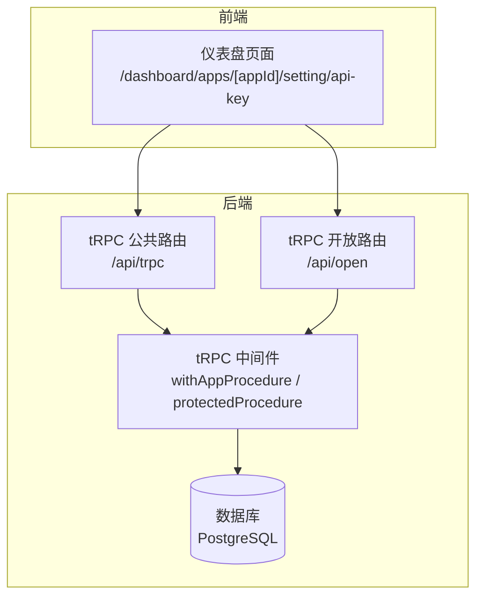
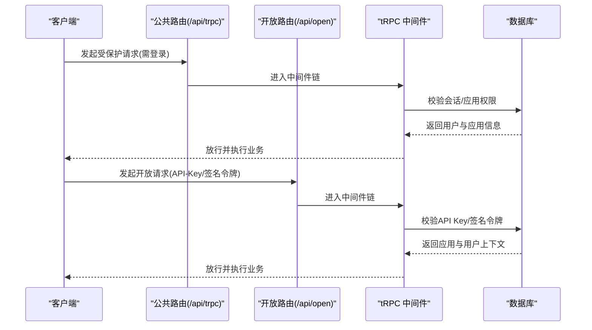
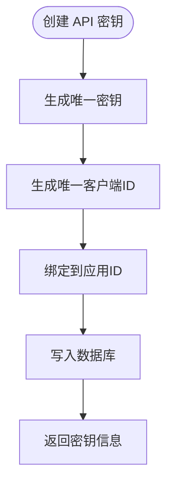
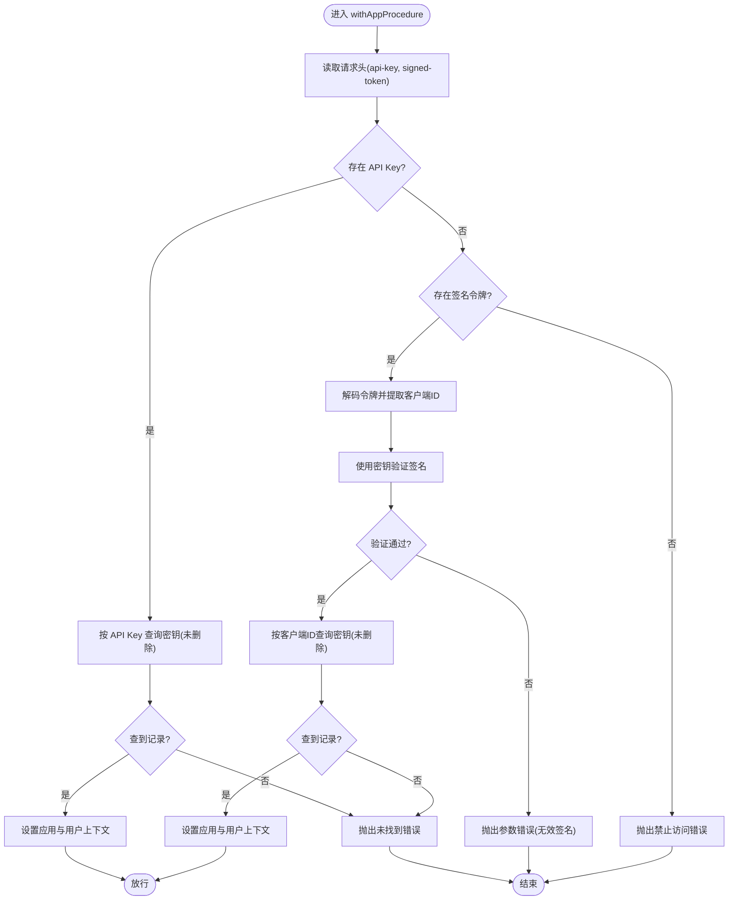
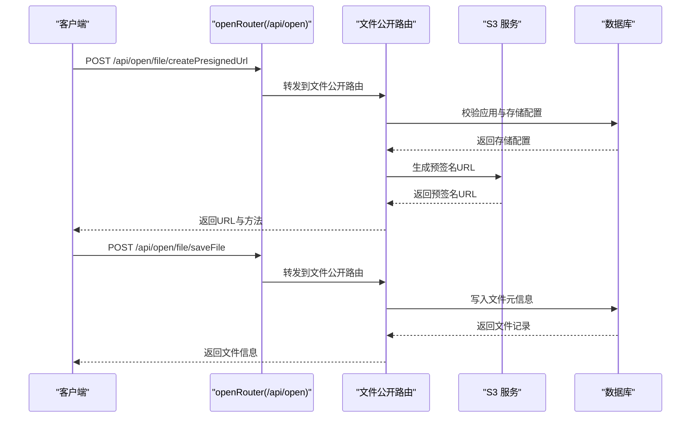
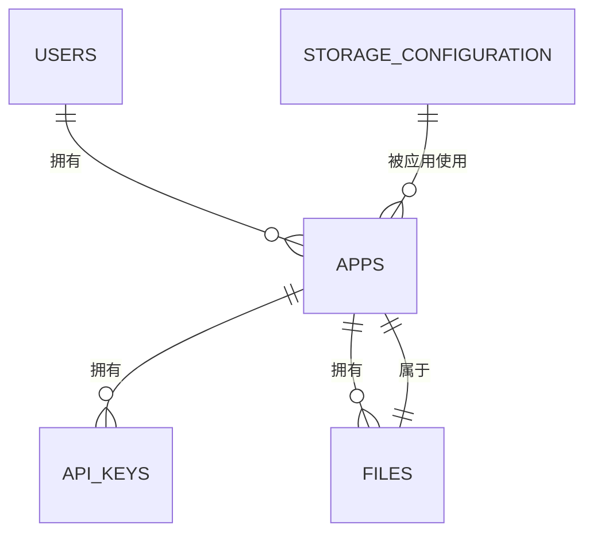
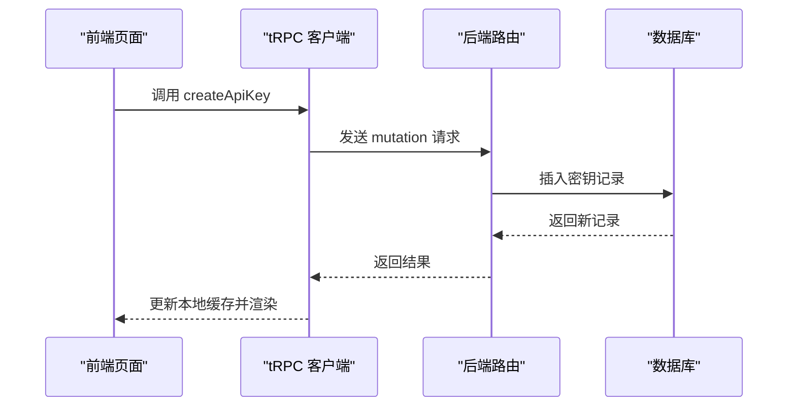
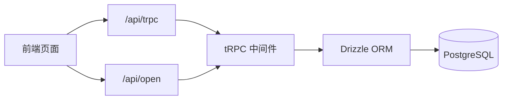

# API 管理系统

<cite>
**本文引用的文件**
- [src/server/routes/api-keys.ts](file://src/server/routes/api-keys.ts)
- [src/server/trpc-middlewares/trpc.ts](file://src/server/trpc-middlewares/trpc.ts)
- [src/server/trpc-middlewares/router.ts](file://src/server/trpc-middlewares/router.ts)
- [src/app/api/trpc/[...trpc]/route.ts](file://src/app/api/trpc/[...trpc]/route.ts)
- [src/app/api/open/[...trpc]/route.ts](file://src/app/api/open/[...trpc]/route.ts)
- [src/server/open-router.ts](file://src/server/open-router.ts)
- [src/server/routes/file-open.ts](file://src/server/routes/file-open.ts)
- [src/server/db/schema.ts](file://src/server/db/schema.ts)
- [src/server/db/db.ts](file://src/server/db/db.ts)
- [src/app/dashboard/apps/[appId]/setting/api-key/page.tsx](file://src/app/dashboard/apps/[appId]/setting/api-key/page.tsx)
- [src/server/auth/index.ts](file://src/server/auth/index.ts)
- [src/lib/auth.ts](file://src/lib/auth.ts)
- [src/utils/open-api.ts](file://src/utils/open-api.ts)
- [package.json](file://package.json)
- [drizzle.config.ts](file://drizzle.config.ts)
</cite>

## 目录
1. [简介](#简介)
2. [项目结构](#项目结构)
3. [核心组件](#核心组件)
4. [架构总览](#架构总览)
5. [详细组件分析](#详细组件分析)
6. [依赖关系分析](#依赖关系分析)
7. [性能考虑](#性能考虑)
8. [故障排除指南](#故障排除指南)
9. [结论](#结论)
10. [附录](#附录)

## 简介
本系统是一个基于 tRPC 的 API 管理平台，提供 API 密钥的生成、管理与使用，支持开放 API（无需登录）与受保护 API（需要登录）两类访问路径。系统通过 tRPC 路由中间件实现统一的安全控制与访问限制，结合数据库模型与前端页面完成密钥的创建、展示与使用。

## 项目结构
系统采用分层与按功能模块组织的结构：
- 前端页面：Next.js App Router 页面，负责密钥管理界面与调用示例
- 后端路由：tRPC 路由与中间件，统一处理认证、授权与请求
- 数据层：Drizzle ORM + PostgreSQL，定义表结构与查询
- 开放 API：独立的 openRouter，用于无需登录的公开接口

图表来源
- [src/app/api/trpc/[...trpc]/route.ts](file://src/app/api/trpc/[...trpc]/route.ts#L1-L14)
- [src/app/api/open/[...trpc]/route.ts](file://src/app/api/open/[...trpc]/route.ts#L1-L31)
- [src/server/trpc-middlewares/trpc.ts:1-130](file://src/server/trpc-middlewares/trpc.ts#L1-L130)
- [src/server/db/db.ts:1-9](file://src/server/db/db.ts#L1-L9)

章节来源
- [src/app/api/trpc/[...trpc]/route.ts](file://src/app/api/trpc/[...trpc]/route.ts#L1-L14)
- [src/app/api/open/[...trpc]/route.ts](file://src/app/api/open/[...trpc]/route.ts#L1-L31)
- [src/server/trpc-middlewares/router.ts:1-20](file://src/server/trpc-middlewares/router.ts#L1-L20)
- [src/server/open-router.ts:1-10](file://src/server/open-router.ts#L1-L10)

## 核心组件
- API 密钥路由：提供列出与创建 API 密钥的能力，仅限已登录用户使用
- tRPC 中间件：统一处理会话校验与 API 密钥/签名令牌校验
- 开放路由：面向公开接口，支持通过 API Key 或签名令牌访问
- 数据模型：定义应用、用户、存储与 API 密钥等核心实体
- 前端页面：提供密钥创建与展示的交互界面

章节来源
- [src/server/routes/api-keys.ts:1-38](file://src/server/routes/api-keys.ts#L1-L38)
- [src/server/trpc-middlewares/trpc.ts:1-130](file://src/server/trpc-middlewares/trpc.ts#L1-L130)
- [src/server/routes/file-open.ts:1-197](file://src/server/routes/file-open.ts#L1-L197)
- [src/server/db/schema.ts:185-200](file://src/server/db/schema.ts#L185-L200)
- [src/app/dashboard/apps/[appId]/setting/api-key/page.tsx](file://src/app/dashboard/apps/[appId]/setting/api-key/page.tsx#L1-L80)

## 架构总览
系统通过两条主要路径提供 API 服务：
- 受保护路径：/api/trpc，需要登录态；内部可选使用 API Key 或签名令牌进行应用级鉴权
- 开放路径：/api/open，无需登录；通过 API Key 或签名令牌进行应用级鉴权

图表来源
- [src/app/api/trpc/[...trpc]/route.ts](file://src/app/api/trpc/[...trpc]/route.ts#L1-L14)
- [src/app/api/open/[...trpc]/route.ts](file://src/app/api/open/[...trpc]/route.ts#L1-L31)
- [src/server/trpc-middlewares/trpc.ts:30-127](file://src/server/trpc-middlewares/trpc.ts#L30-L127)
- [src/server/db/db.ts:1-9](file://src/server/db/db.ts#L1-L9)

## 详细组件分析

### API 密钥管理
- 列出密钥：按应用 ID 查询未删除的 API 密钥
- 创建密钥：生成唯一密钥与客户端 ID，绑定到指定应用
- 安全要点：密钥与客户端 ID 均具备唯一性约束，便于快速定位与校验

图表来源
- [src/server/routes/api-keys.ts:17-36](file://src/server/routes/api-keys.ts#L17-L36)

章节来源
- [src/server/routes/api-keys.ts:1-38](file://src/server/routes/api-keys.ts#L1-L38)
- [src/server/db/schema.ts:185-193](file://src/server/db/schema.ts#L185-L193)

### tRPC 中间件与安全控制
- 会话中间件：注入当前会话上下文
- 受保护过程：要求已登录，否则拒绝
- 应用级鉴权过程 withAppProcedure：
  - 优先读取请求头中的 API Key，查询数据库匹配且未删除的密钥，解析应用与用户上下文
  - 若无 API Key，则尝试读取签名令牌（signed-token），解码其中的客户端 ID 并校验签名（使用密钥作为密钥进行验证）
  - 若均不满足，抛出禁止访问错误

图表来源
- [src/server/trpc-middlewares/trpc.ts:47-127](file://src/server/trpc-middlewares/trpc.ts#L47-L127)

章节来源
- [src/server/trpc-middlewares/trpc.ts:1-130](file://src/server/trpc-middlewares/trpc.ts#L1-L130)

### 开放 API 设计与实现
- 开放路由入口：/api/open，使用 openRouter 聚合公开功能
- 当前公开功能：文件上传预签名 URL 生成与保存文件元信息
- CORS 处理：统一追加允许来源与头部，明确允许 api-key 请求头
- 访问控制：通过 withAppProcedure 实现 API Key 或签名令牌校验

图表来源
- [src/app/api/open/[...trpc]/route.ts](file://src/app/api/open/[...trpc]/route.ts#L1-L31)
- [src/server/open-router.ts:1-10](file://src/server/open-router.ts#L1-L10)
- [src/server/routes/file-open.ts:30-197](file://src/server/routes/file-open.ts#L30-L197)

章节来源
- [src/app/api/open/[...trpc]/route.ts](file://src/app/api/open/[...trpc]/route.ts#L1-L31)
- [src/server/open-router.ts:1-10](file://src/server/open-router.ts#L1-L10)
- [src/server/routes/file-open.ts:1-197](file://src/server/routes/file-open.ts#L1-L197)

### 数据模型与关系
- 应用、用户、存储与 API 密钥之间存在清晰的关联关系
- API 密钥表包含密钥、客户端 ID、应用 ID 以及软删除字段，支持密钥轮换与撤销

图表来源
- [src/server/db/schema.ts:18-270](file://src/server/db/schema.ts#L18-L270)

章节来源
- [src/server/db/schema.ts:185-200](file://src/server/db/schema.ts#L185-L200)

### 前端密钥管理页面
- 提供创建新密钥的弹窗输入与列表展示
- 使用 React Query 客户端缓存与更新列表

图表来源
- [src/app/dashboard/apps/[appId]/setting/api-key/page.tsx](file://src/app/dashboard/apps/[appId]/setting/api-key/page.tsx#L19-L30)
- [src/server/routes/api-keys.ts:17-36](file://src/server/routes/api-keys.ts#L17-L36)

章节来源
- [src/app/dashboard/apps/[appId]/setting/api-key/page.tsx](file://src/app/dashboard/apps/[appId]/setting/api-key/page.tsx#L1-L80)
- [src/server/routes/api-keys.ts:1-38](file://src/server/routes/api-keys.ts#L1-L38)

## 依赖关系分析
- tRPC 路由通过中间件统一接入，受保护路由依赖登录态，开放路由依赖 API Key 或签名令牌
- 数据访问通过 Drizzle ORM 封装，统一在数据库连接中执行
- 开放 API 与受保护 API 共用同一套中间件与数据模型，实现一致的安全策略

图表来源
- [src/server/trpc-middlewares/router.ts:1-20](file://src/server/trpc-middlewares/router.ts#L1-L20)
- [src/server/trpc-middlewares/trpc.ts:1-130](file://src/server/trpc-middlewares/trpc.ts#L1-L130)
- [src/server/db/db.ts:1-9](file://src/server/db/db.ts#L1-L9)

章节来源
- [src/server/trpc-middlewares/router.ts:1-20](file://src/server/trpc-middlewares/router.ts#L1-L20)
- [src/server/db/db.ts:1-9](file://src/server/db/db.ts#L1-L9)

## 性能考虑
- 日志中间件：在中间件中记录请求耗时，便于定位慢查询与异常
- 分页查询：文件列表支持游标分页，减少一次性加载大量数据
- 预签名 URL：上传阶段将签名计算移至服务端，降低客户端复杂度与网络开销
- 缓存策略：前端使用 React Query 缓存，减少重复请求

章节来源
- [src/server/trpc-middlewares/trpc.ts:21-26](file://src/server/trpc-middlewares/trpc.ts#L21-L26)
- [src/server/routes/file-open.ts:126-184](file://src/server/routes/file-open.ts#L126-L184)

## 故障排除指南
- 403 禁止访问
  - 可能原因：缺少登录态且未提供有效 API Key/签名令牌
  - 排查步骤：确认请求头是否包含 api-key 或 signed-token；检查密钥是否被软删除
- 404 未找到
  - 可能原因：提供的 API Key 或客户端 ID 不存在
  - 排查步骤：核对密钥值与客户端 ID；确认密钥状态未被撤销
- 400 参数错误
  - 可能原因：签名令牌缺少客户端 ID 或签名验证失败
  - 排查步骤：确认令牌生成时使用正确的密钥；检查令牌是否被篡改
- CORS 问题
  - 可能原因：跨域请求未携带允许的头部或方法
  - 排查步骤：确认请求头包含 api-key；检查响应头是否正确设置

章节来源
- [src/server/trpc-middlewares/trpc.ts:30-127](file://src/server/trpc-middlewares/trpc.ts#L30-L127)
- [src/app/api/open/[...trpc]/route.ts](file://src/app/api/open/[...trpc]/route.ts#L13-L16)

## 结论
该 API 管理系统通过 tRPC 中间件实现了统一的安全控制与访问限制，结合 API Key 与签名令牌两种鉴权方式，既满足受保护场景的登录态需求，又支持开放 API 的无感访问。数据库模型清晰，前端页面直观，具备良好的扩展性与维护性。

## 附录

### API 密钥生命周期与安全最佳实践
- 生成：创建时同时生成密钥与客户端 ID，并绑定到应用
- 使用：通过请求头 api-key 或 signed-token 进行鉴权
- 轮换：建议定期更换密钥，避免长期不变导致的风险
- 撤销：通过软删除字段标记密钥失效，立即停止使用
- 审计：建议在中间件中增加审计日志记录（如请求时间、来源 IP、应用 ID）

章节来源
- [src/server/routes/api-keys.ts:17-36](file://src/server/routes/api-keys.ts#L17-L36)
- [src/server/trpc-middlewares/trpc.ts:47-127](file://src/server/trpc-middlewares/trpc.ts#L47-L127)

### 调用频率限制与配额管理
- 当前实现未包含显式的速率限制与配额控制
- 建议在中间件中引入速率限制器（如基于内存或 Redis 的计数器）与配额检查，结合应用计划进行差异化限制

章节来源
- [src/server/trpc-middlewares/trpc.ts:1-130](file://src/server/trpc-middlewares/trpc.ts#L1-L130)

### 开放 API 的设计思路
- 通过 openRouter 聚合公开功能，统一 CORS 处理
- 与受保护 API 共用中间件，保证一致的鉴权策略
- 文件上传采用预签名 URL，简化客户端实现并提升安全性

章节来源
- [src/server/open-router.ts:1-10](file://src/server/open-router.ts#L1-L10)
- [src/app/api/open/[...trpc]/route.ts](file://src/app/api/open/[...trpc]/route.ts#L1-L31)
- [src/server/routes/file-open.ts:30-87](file://src/server/routes/file-open.ts#L30-L87)

### 集成示例与扩展开发
- 前端集成：通过 tRPC 客户端调用受保护与开放 API
- 新增公开功能：在 openRouter 下新增路由模块，遵循现有中间件与鉴权策略
- 新增受保护功能：在 appRouter 下新增路由模块，使用受保护过程

章节来源
- [src/utils/open-api.ts:1-14](file://src/utils/open-api.ts#L1-L14)
- [src/server/trpc-middlewares/router.ts:1-20](file://src/server/trpc-middlewares/router.ts#L1-L20)
- [src/server/open-router.ts:1-10](file://src/server/open-router.ts#L1-L10)