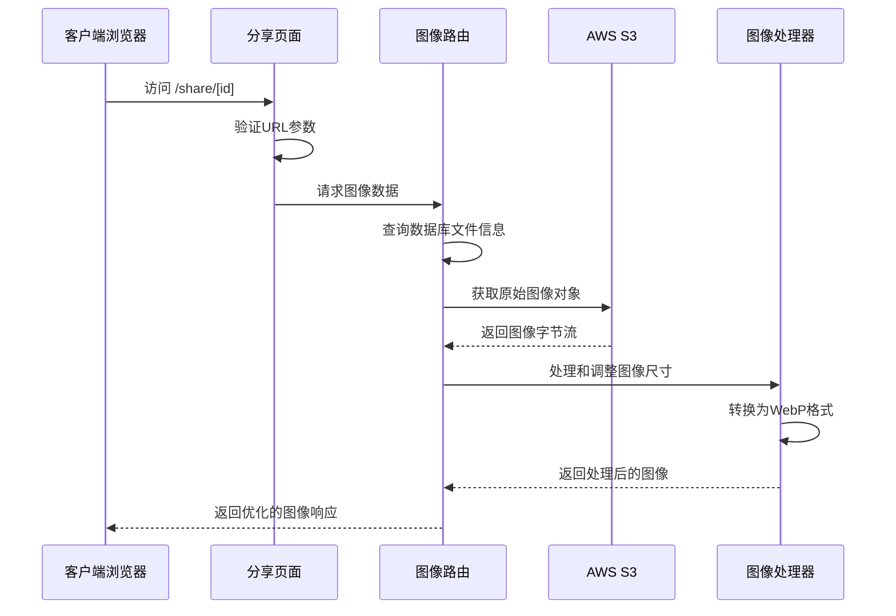
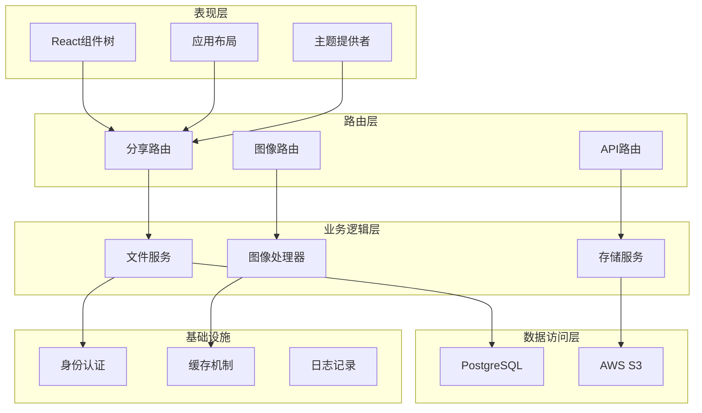
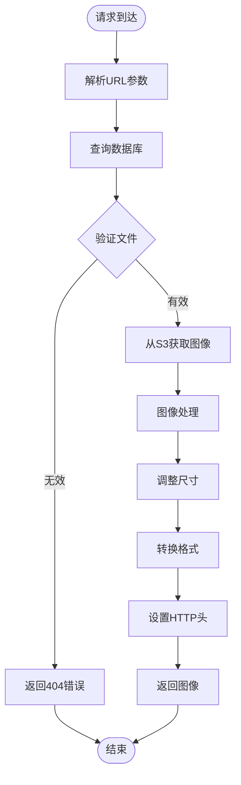
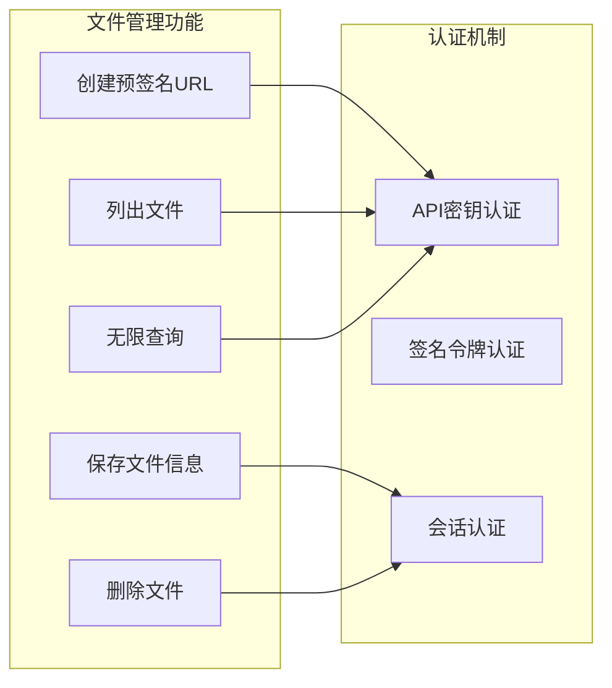
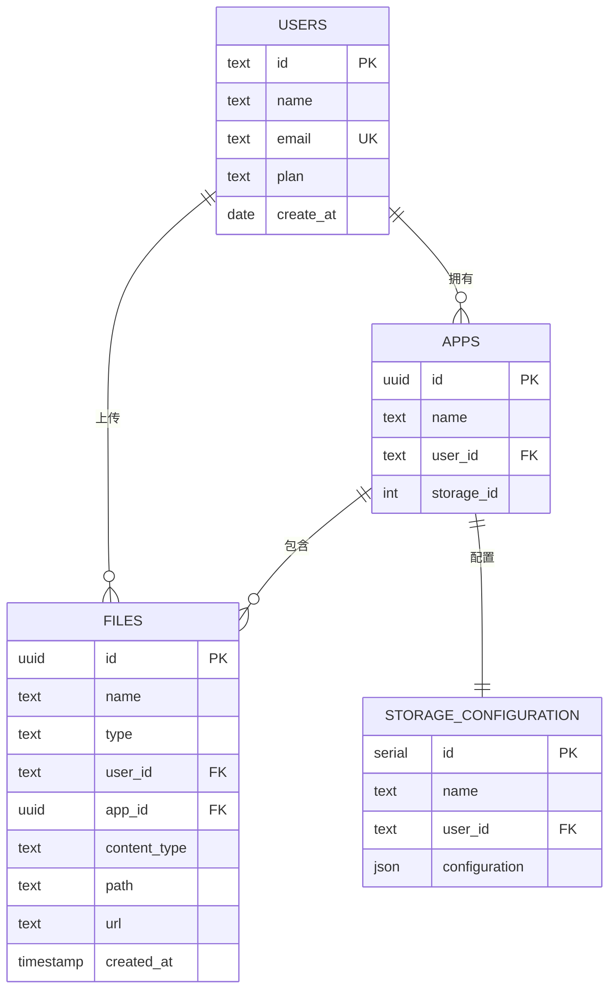
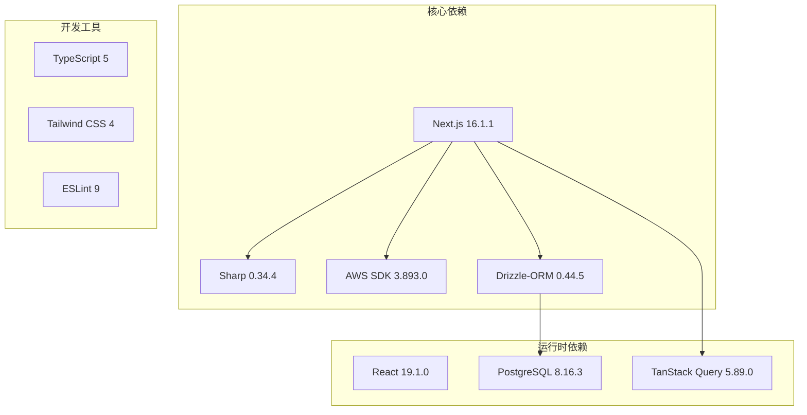

# 公共分享页面

<cite>
**本文档引用的文件**
- [src/app/share/[id]/page.tsx](file://src/app/share/[id]/page.tsx)
- [src/app/image/[id]/route.ts](file://src/app/image/[id]/route.ts)
- [src/server/routes/file-open.ts](file://src/server/routes/file-open.ts)
- [src/server/db/schema.ts](file://src/server/db/schema.ts)
- [src/server/db/db.ts](file://src/server/db/db.ts)
- [src/server/trpc-middlewares/trpc.ts](file://src/server/trpc-middlewares/trpc.ts)
- [src/app/layout.tsx](file://src/app/layout.tsx)
- [src/app/trpc-provider.tsx](file://src/app/trpc-provider.tsx)
- [src/lib/utils.ts](file://src/lib/utils.ts)
- [package.json](file://package.json)
</cite>

## 目录

1. [简介](#简介)
2. [项目结构](#项目结构)
3. [核心组件](#核心组件)
4. [架构概览](#架构概览)
5. [详细组件分析](#详细组件分析)
6. [依赖关系分析](#依赖关系分析)
7. [性能考虑](#性能考虑)
8. [故障排除指南](#故障排除指南)
9. [结论](#结论)

## 简介

公共分享页面是 Image SaaS 应用中的一个关键功能模块，允许用户通过唯一的共享链接访问存储在云端的图片资源。该系统采用现代化的 Next.js App Router 架构，结合 AWS S3 存储服务、数据库持久化和图像处理技术，为用户提供高效、安全的图片分享体验。

该模块的核心特性包括：

- 基于 URL 参数的动态路由处理
- AWS S3 对象存储集成
- 实时图像尺寸调整和格式转换
- 完整的错误处理和状态管理
- 响应式设计和用户体验优化

## 项目结构

Image SaaS 项目采用基于功能的组织方式，公共分享页面位于 `src/app/share/[id]/` 路径下，与主应用的其他功能模块保持清晰的分离。

```mermaid
graph TB
subgraph "应用层"
SP[公共分享页面<br/>src/app/share/[id]/page.tsx]
IR[图像路由<br/>src/app/image/[id]/route.ts]
LP[布局组件<br/>src/app/layout.tsx]
TP[TRPC提供者<br/>src/app/trpc-provider.tsx]
end
subgraph "服务器层"
FO[file-open路由<br/>src/server/routes/file-open.ts]
TM[TRPC中间件<br/>src/server/trpc-middlewares/trpc.ts]
DB[数据库连接<br/>src/server/db/db.ts]
end
subgraph "数据层"
SC[数据库模式<br/>src/server/db/schema.ts]
PG[(PostgreSQL数据库)]
end
subgraph "外部服务"
S3[AWS S3存储]
SHARP[Sharp图像处理]
end
SP --> IR
IR --> FO
FO --> DB
DB --> PG
IR --> S3
IR --> SHARP
SP --> LP
SP --> TP
```

**图表来源**

- [src/app/share/[id]/page.tsx:1-59](file://src/app/share/[id]/page.tsx#L1-L59)
- [src/app/image/[id]/route.ts:1-92](file://src/app/image/[id]/route.ts#L1-L92)
- [src/server/routes/file-open.ts:1-197](file://src/server/routes/file-open.ts#L1-L197)

**章节来源**

- [src/app/share/[id]/page.tsx:1-59](file://src/app/share/[id]/page.tsx#L1-L59)
- [src/app/image/[id]/route.ts:1-92](file://src/app/image/[id]/route.ts#L1-L92)
- [src/server/routes/file-open.ts:1-197](file://src/server/routes/file-open.ts#L1-L197)

## 核心组件

公共分享页面由多个相互协作的组件构成，每个组件都有明确的职责和边界：

### 主要组件架构

```mermaid
classDiagram
class SharePage {
+params : Promise~{id : string}~
+render() : JSX.Element
-fetchFileData() : Promise~FileData~
-validateFile() : boolean
}
class ImageRoute {
+request : NextRequest
+params : Promise~{id : string}~
+GET() : Promise~NextResponse~
-processImage() : Promise~Buffer~
-resizeImage() : Sharp
}
class FileOpenRouter {
+createPresignedUrl() : PresignedUrlResponse
+saveFile() : FileEntity
+listFiles() : FileEntity[]
+infinityQueryFiles() : InfiniteQueryResult
+deleteFile() : UpdateResult
}
class DatabaseLayer {
+queryFiles() : FilesQuery
+findFileById() : FileEntity
+updateFile() : UpdateResult
}
SharePage --> ImageRoute : "调用"
ImageRoute --> FileOpenRouter : "查询"
FileOpenRouter --> DatabaseLayer : "操作"
ImageRoute --> S3Client : "存储访问"
ImageRoute --> Sharp : "图像处理"
```

**图表来源**

- [src/app/share/[id]/page.tsx:5-58](file://src/app/share/[id]/page.tsx#L5-L58)
- [src/app/image/[id]/route.ts:8-91](file://src/app/image/[id]/route.ts#L8-L91)
- [src/server/routes/file-open.ts:30-194](file://src/server/routes/file-open.ts#L30-L194)

### 数据流处理

公共分享页面的数据流遵循严格的处理管道，确保从请求到响应的完整性和安全性：



**图表来源**

- [src/app/share/[id]/page.tsx:10-25](file://src/app/share/[id]/page.tsx#L10-L25)
- [src/app/image/[id]/route.ts:17-88](file://src/app/image/[id]/route.ts#L17-L88)

**章节来源**

- [src/app/share/[id]/page.tsx:1-59](file://src/app/share/[id]/page.tsx#L1-L59)
- [src/app/image/[id]/route.ts:1-92](file://src/app/image/[id]/route.ts#L1-L92)

## 架构概览

公共分享页面采用分层架构设计，确保关注点分离和可维护性：

### 整体架构图



**图表来源**

- [src/app/layout.tsx:21-36](file://src/app/layout.tsx#L21-L36)
- [src/app/share/[id]/page.tsx:1-59](file://src/app/share/[id]/page.tsx#L1-L59)
- [src/app/image/[id]/route.ts:1-92](file://src/app/image/[id]/route.ts#L1-L92)

### 技术栈分析

该模块使用了现代 Web 开发的最佳实践和技术组合：

| 层级     | 技术               | 版本    | 用途                 |
| -------- | ------------------ | ------- | -------------------- |
| 前端框架 | Next.js            | 16.1.1  | 应用框架和路由       |
| 图像处理 | Sharp              | 0.34.4  | 图像调整和格式转换   |
| AWS SDK  | @aws-sdk/client-s3 | 3.893.0 | S3存储访问           |
| 数据库   | PostgreSQL         | 8.16.3  | 数据持久化           |
| ORM      | Drizzle-ORM        | 0.44.5  | 类型安全的数据库操作 |
| 状态管理 | TanStack Query     | 5.89.0  | 服务器状态管理       |

**章节来源**

- [package.json:14-67](file://package.json#L14-L67)

## 详细组件分析

### 分享页面组件

分享页面是用户访问公共链接时看到的主要界面，负责展示图片详情和元数据。

#### 组件结构分析

```mermaid
classDiagram
class SharePage {
+props : {params : Promise~{id : string}~}
+state : LoadingState
+render() : ReactElement
-fetchFileData() : Promise~FileEntity~
-handleNotFound() : void
}
class FileEntity {
+id : string
+name : string
+contentType : string
+createdAt : Date
+path : string
+app : AppEntity
}
class AppEntity {
+id : string
+name : string
+storage : StorageEntity
}
class StorageEntity {
+id : number
+configuration : S3Config
}
SharePage --> FileEntity : "渲染"
FileEntity --> AppEntity : "关联"
AppEntity --> StorageEntity : "包含"
```

**图表来源**

- [src/app/share/[id]/page.tsx:5-58](file://src/app/share/[id]/page.tsx#L5-L58)
- [src/server/db/schema.ts:120-142](file://src/server/db/schema.ts#L120-L142)

#### 渲染流程

分享页面的渲染过程遵循以下步骤：

1. **参数解析**：从 URL 中提取文件 ID 参数
2. **数据获取**：查询数据库获取文件详细信息
3. **验证检查**：确认文件存在且具有有效存储配置
4. **UI 渲染**：构建响应式的图片展示界面

**章节来源**

- [src/app/share/[id]/page.tsx:10-25](file://src/app/share/[id]/page.tsx#L10-L25)

### 图像路由组件

图像路由处理来自分享页面的图像请求，执行完整的图像处理管道。

#### 图像处理流水线



**图表来源**

- [src/app/image/[id]/route.ts:8-91](file://src/app/image/[id]/route.ts#L8-L91)

#### 图像处理算法

图像路由实现了高效的图像处理算法，支持多种参数和格式转换：

1. **参数处理**：解析 `_width` 和 `_height` 查询参数
2. **图像调整**：使用 Sharp 库进行尺寸调整
3. **格式转换**：将图像转换为 WebP 格式以优化加载性能
4. **缓存策略**：设置长期缓存头以提高性能

**章节来源**

- [src/app/image/[id]/route.ts:15-88](file://src/app/image/[id]/route.ts#L15-L88)

### 文件开放路由

文件开放路由提供了完整的文件管理功能，支持预签名 URL 创建和文件保存。

#### 功能特性



**图表来源**

- [src/server/routes/file-open.ts:30-194](file://src/server/routes/file-open.ts#L30-L194)

**章节来源**

- [src/server/routes/file-open.ts:31-87](file://src/server/routes/file-open.ts#L31-L87)

### 数据库架构

系统使用 PostgreSQL 作为主要数据存储，通过 Drizzle-ORM 提供类型安全的数据库操作。

#### 数据模型关系



**图表来源**

- [src/server/db/schema.ts:18-270](file://src/server/db/schema.ts#L18-L270)

**章节来源**

- [src/server/db/schema.ts:120-173](file://src/server/db/schema.ts#L120-L173)

## 依赖关系分析

公共分享页面的依赖关系体现了清晰的关注点分离和模块化设计。

### 外部依赖关系



**图表来源**

- [package.json:14-67](file://package.json#L14-L67)

### 内部模块依赖

```mermaid
graph TD
SharePage[src/app/share/[id]/page.tsx] --> ImageRoute[src/app/image/[id]/route.ts]
SharePage --> Layout[src/app/layout.tsx]
SharePage --> Provider[src/app/trpc-provider.tsx]
ImageRoute --> FileOpenRouter[src/server/routes/file-open.ts]
ImageRoute --> DBConnection[src/server/db/db.ts]
FileOpenRouter --> Schema[src/server/db/schema.ts]
FileOpenRouter --> TRPCMiddleware[src/server/trpc-middlewares/trpc.ts]
TRPCMiddleware --> DBConnection
TRPCMiddleware --> Auth[身份认证]
```

**图表来源**

- [src/app/share/[id]/page.tsx:1-59](file://src/app/share/[id]/page.tsx#L1-L59)
- [src/app/image/[id]/route.ts:1-92](file://src/app/image/[id]/route.ts#L1-L92)
- [src/server/routes/file-open.ts:1-197](file://src/server/routes/file-open.ts#L1-L197)

**章节来源**

- [src/app/share/[id]/page.tsx:1-59](file://src/app/share/[id]/page.tsx#L1-L59)
- [src/app/image/[id]/route.ts:1-92](file://src/app/image/[id]/route.ts#L1-L92)
- [src/server/routes/file-open.ts:1-197](file://src/server/routes/file-open.ts#L1-L197)

## 性能考虑

公共分享页面在设计时充分考虑了性能优化，采用了多种策略来提升用户体验。

### 缓存策略

系统实现了多层次的缓存机制：

1. **CDN 缓存**：S3 对象存储提供全球 CDN 加速
2. **浏览器缓存**：设置长期缓存头（31536000 秒）
3. **应用缓存**：Sharp 库的内部缓存机制
4. **数据库查询缓存**：Drizzle-ORM 的查询结果缓存

### 图像优化


**图表来源**

- [src/app/image/[id]/route.ts:73-78](file://src/app/image/[id]/route.ts#L73-L78)

### 性能监控

系统集成了性能监控机制：

- **请求计时**：记录 API 调用耗时
- **内存使用**：监控 Sharp 处理的内存占用
- **网络延迟**：跟踪 S3 请求响应时间
- **错误统计**：收集异常情况的频率

## 故障排除指南

### 常见问题及解决方案

#### 图像加载失败

**症状**：分享页面显示空白或加载错误

**可能原因**：

1. S3 存储桶权限配置错误
2. 文件路径编码问题
3. Sharp 图像处理异常

**解决步骤**：

1. 检查 S3 凭证配置
2. 验证文件路径编码
3. 查看 Sharp 错误日志

#### 数据库连接问题

**症状**：无法获取文件信息

**可能原因**：

1. DATABASE_URL 环境变量未配置
2. 数据库连接池耗尽
3. 查询超时

**解决步骤**：

1. 验证数据库连接字符串
2. 检查数据库服务状态
3. 优化查询性能

#### 权限认证问题

**症状**：访问被拒绝或认证失败

**可能原因**：

1. API 密钥过期
2. JWT 令牌验证失败
3. 用户会话失效

**解决步骤**：

1. 重新生成 API 密钥
2. 验证 JWT 签名
3. 检查用户权限

**章节来源**

- [src/app/image/[id]/route.ts:28-44](file://src/app/image/[id]/route.ts#L28-L44)
- [src/server/trpc-middlewares/trpc.ts:47-127](file://src/server/trpc-middlewares/trpc.ts#L47-L127)

### 调试工具

系统提供了多种调试工具来帮助诊断问题：

1. **日志记录**：详细的请求和响应日志
2. **性能分析**：API 调用时间和资源使用分析
3. **错误追踪**：完整的错误堆栈信息
4. **监控仪表板**：实时系统状态监控

## 结论

公共分享页面是 Image SaaS 应用中一个精心设计的功能模块，它成功地将现代 Web 开发的最佳实践与实际业务需求相结合。通过采用分层架构、类型安全的数据库操作、高效的图像处理技术和完善的错误处理机制，该模块为用户提供了稳定可靠的图片分享体验。

### 主要优势

1. **架构清晰**：模块化设计确保了代码的可维护性和可扩展性
2. **性能优异**：多层缓存和优化的图像处理提升了用户体验
3. **安全可靠**：多重认证机制和错误处理保障了系统的稳定性
4. **技术先进**：采用最新的 Web 技术栈确保了项目的现代化

### 改进建议

1. **监控增强**：可以添加更详细的性能指标和用户行为分析
2. **国际化支持**：考虑添加多语言支持以扩大用户群体
3. **移动端优化**：进一步优化移动端的用户体验
4. **API 文档**：为开发者提供更详细的 API 接口文档

该模块展示了如何在实际项目中应用现代前端开发技术，为类似的应用程序提供了优秀的参考模板。
