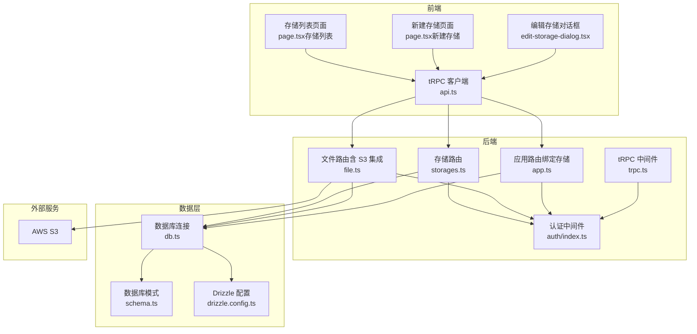
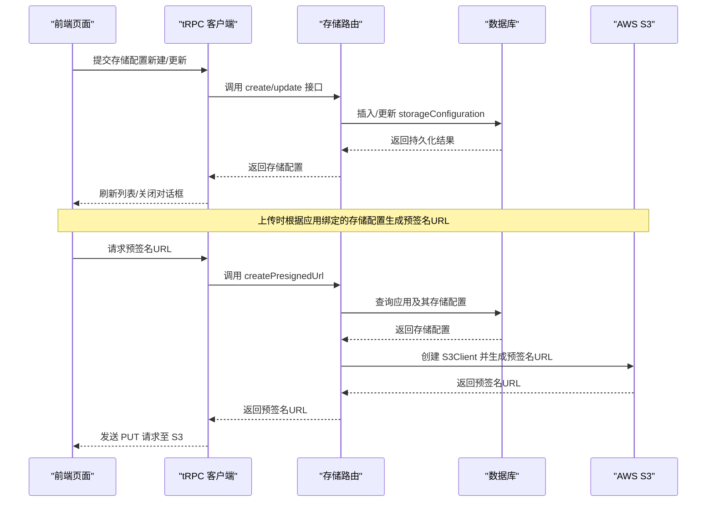
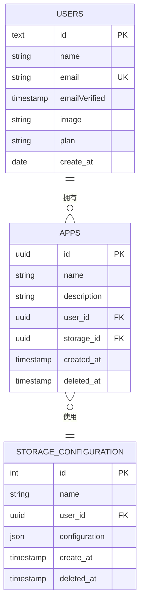
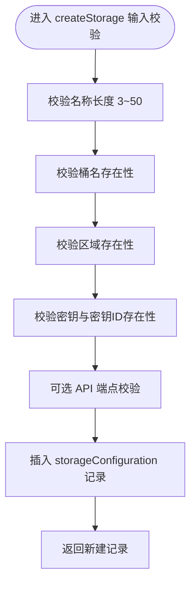
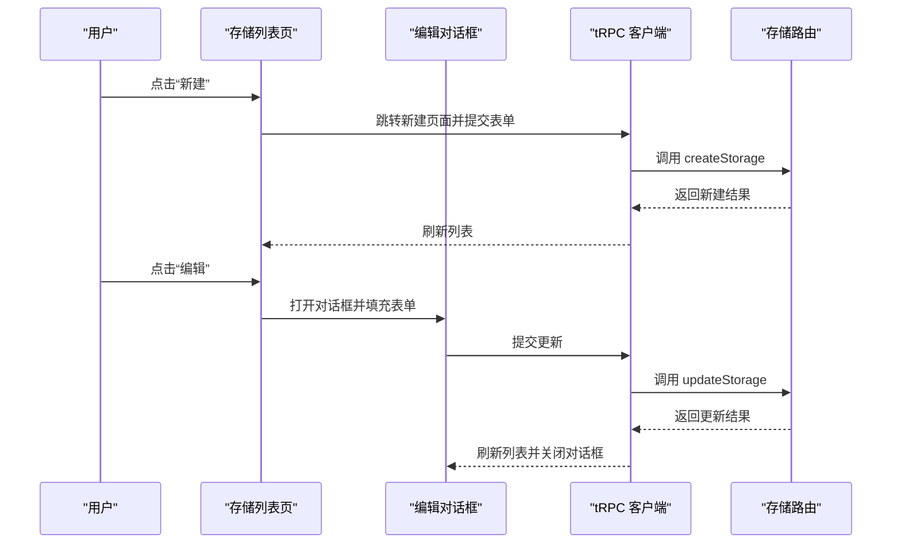
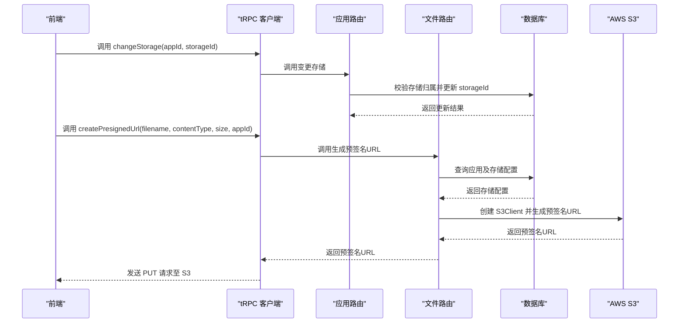
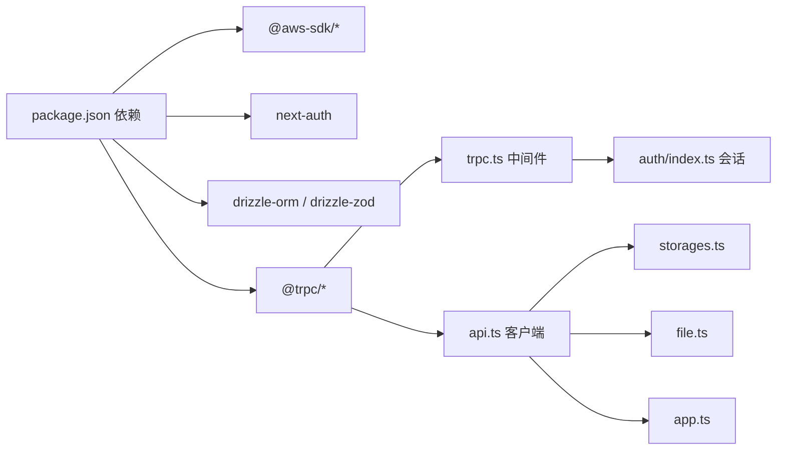

# 存储配置系统

<cite>
**本文档引用的文件**
- [storages.ts](file://src/server/routes/storages.ts)
- [schema.ts](file://src/server/db/schema.ts)
- [db.ts](file://src/server/db/db.ts)
- [page.tsx（存储列表）](file://src/app/dashboard/apps/[appId]/setting/storage/page.tsx)
- [edit-storage-dialog.tsx](file://src/components/feature/edit-storage-dialog.tsx)
- [page.tsx（新建存储）](file://src/app/dashboard/apps/[appId]/setting/storage/new/page.tsx)
- [file.ts](file://src/server/routes/file.ts)
- [app.ts](file://src/server/routes/app.ts)
- [trpc.ts](file://src/server/trpc-middlewares/trpc.ts)
- [auth/index.ts](file://src/server/auth/index.ts)
- [api.ts](file://src/utils/api.ts)
- [drizzle.config.ts](file://drizzle.config.ts)
- [package.json](file://package.json)
</cite>

## 目录
1. [简介](#简介)
2. [项目结构](#项目结构)
3. [核心组件](#核心组件)
4. [架构总览](#架构总览)
5. [详细组件分析](#详细组件分析)
6. [依赖关系分析](#依赖关系分析)
7. [性能考量](#性能考量)
8. [故障排查指南](#故障排查指南)
9. [结论](#结论)
10. [附录](#附录)

## 简介
本技术文档围绕存储配置系统展开，重点覆盖以下方面：
- AWS S3 存储配置的实现：存储桶连接、访问密钥管理与权限设置
- 存储配置的数据模型、配置验证与安全性考虑
- 存储空间监控、配额管理与成本控制机制
- 存储配置的动态更新、热重载与配置回滚能力
- 性能优化策略、备份恢复方案与故障转移机制
- 开发者最佳实践、安全加固与扩展开发指南

## 项目结构
存储配置系统由前端页面、客户端 SDK、后端 tRPC 路由、数据库模式与 AWS S3 集成构成。整体采用 Next.js + tRPC + Drizzle ORM + PostgreSQL 的技术栈。

图表来源
- [storages.ts:1-74](file://src/server/routes/storages.ts#L1-L74)
- [file.ts:1-561](file://src/server/routes/file.ts#L1-L561)
- [app.ts:1-88](file://src/server/routes/app.ts#L1-L88)
- [schema.ts:1-270](file://src/server/db/schema.ts#L1-L270)
- [db.ts:1-9](file://src/server/db/db.ts#L1-L9)
- [api.ts:1-17](file://src/utils/api.ts#L1-L17)
- [drizzle.config.ts:1-14](file://drizzle.config.ts#L1-L14)

章节来源
- [storages.ts:1-74](file://src/server/routes/storages.ts#L1-L74)
- [schema.ts:154-183](file://src/server/db/schema.ts#L154-L183)
- [db.ts:1-9](file://src/server/db/db.ts#L1-L9)
- [api.ts:1-17](file://src/utils/api.ts#L1-L17)
- [drizzle.config.ts:1-14](file://drizzle.config.ts#L1-L14)

## 核心组件
- 存储配置数据模型：在数据库中以 JSON 类型存储 S3 配置，包含桶名、区域、访问密钥 ID、密钥、可选 API 端点等字段，并通过 Drizzle ORM 的类型化 JSON 字段进行约束。
- tRPC 存储路由：提供列出、创建、更新存储配置的受保护接口；创建与更新时对输入进行 Zod 校验。
- 前端交互：提供新建与编辑存储配置的页面与对话框，使用 React Hook Form 进行表单校验与提交。
- 应用绑定：应用与存储配置通过外键关联，支持在应用层面切换当前使用的存储。
- S3 集成：在上传流程中，根据应用绑定的存储配置动态构造 S3 客户端并生成预签名 URL。

章节来源
- [schema.ts:154-183](file://src/server/db/schema.ts#L154-L183)
- [storages.ts:15-72](file://src/server/routes/storages.ts#L15-L72)
- [page.tsx（存储列表）:1-103](file://src/app/dashboard/apps/[appId]/setting/storage/page.tsx#L1-L103)
- [edit-storage-dialog.tsx:1-186](file://src/components/feature/edit-storage-dialog.tsx#L1-L186)
- [page.tsx（新建存储）:1-94](file://src/app/dashboard/apps/[appId]/setting/storage/new/page.tsx#L1-L94)
- [app.ts:59-86](file://src/server/routes/app.ts#L59-L86)
- [file.ts:27-90](file://src/server/routes/file.ts#L27-L90)

## 架构总览
存储配置系统遵循“前端表单 -> tRPC 路由 -> 数据库 -> S3”的调用链路。认证通过 tRPC 中间件与 NextAuth 集成，确保每个请求具备有效会话。

图表来源
- [storages.ts:15-72](file://src/server/routes/storages.ts#L15-L72)
- [file.ts:27-90](file://src/server/routes/file.ts#L27-L90)
- [db.ts:1-9](file://src/server/db/db.ts#L1-L9)
- [api.ts:1-17](file://src/utils/api.ts#L1-L17)

## 详细组件分析

### 数据模型与存储配置实体
- 存储配置实体定义于数据库模式中，包含自增主键、名称、用户标识、JSON 类型的配置对象以及创建时间与软删除时间。
- 配置对象类型化为 S3StorageConfiguration，包含桶名、区域、访问密钥 ID、密钥与可选 API 端点。
- 应用与存储配置通过外键关联，应用表中的 storageId 指向存储配置表。

图表来源
- [schema.ts:164-183](file://src/server/db/schema.ts#L164-L183)
- [schema.ts:18-26](file://src/server/db/schema.ts#L18-L26)
- [schema.ts:40-45](file://src/server/db/schema.ts#L40-L45)

章节来源
- [schema.ts:154-183](file://src/server/db/schema.ts#L154-L183)
- [schema.ts:164-183](file://src/server/db/schema.ts#L164-L183)

### tRPC 存储路由与配置验证
- 列出存储：按当前用户的会话过滤，仅返回未软删除的存储配置。
- 新建存储：输入通过 Zod 校验，包含名称长度、桶名、区域、访问密钥 ID、密钥与可选 API 端点；成功后写入数据库并返回记录。
- 更新存储：同样进行输入校验，更新指定记录的名称与配置对象，并按用户与软删除状态进行条件过滤。

图表来源
- [storages.ts:15-39](file://src/server/routes/storages.ts#L15-L39)

章节来源
- [storages.ts:8-72](file://src/server/routes/storages.ts#L8-L72)

### 前端交互与表单校验
- 存储列表页：展示用户的所有存储配置，支持编辑与选择为当前应用使用。
- 新建存储页：使用 React Hook Form 进行表单校验，提交后跳转回存储列表。
- 编辑存储对话框：打开时自动填充当前配置，提交后刷新列表并关闭对话框。

图表来源
- [page.tsx（存储列表）:14-46](file://src/app/dashboard/apps/[appId]/setting/storage/page.tsx#L14-L46)
- [edit-storage-dialog.tsx:33-74](file://src/components/feature/edit-storage-dialog.tsx#L33-L74)
- [page.tsx（新建存储）:12-33](file://src/app/dashboard/apps/[appId]/setting/storage/new/page.tsx#L12-L33)
- [storages.ts:15-72](file://src/server/routes/storages.ts#L15-L72)

章节来源
- [page.tsx（存储列表）:1-103](file://src/app/dashboard/apps/[appId]/setting/storage/page.tsx#L1-L103)
- [edit-storage-dialog.tsx:1-186](file://src/components/feature/edit-storage-dialog.tsx#L1-L186)
- [page.tsx（新建存储）:1-94](file://src/app/dashboard/apps/[appId]/setting/storage/new/page.tsx#L1-L94)

### 应用与存储配置的绑定
- 应用路由提供切换存储的功能：校验目标存储是否属于当前用户，再更新应用的 storageId 字段。
- 文件路由在生成预签名 URL 时，会读取应用绑定的存储配置，动态创建 S3 客户端并生成可上传的 URL。

图表来源
- [app.ts:59-86](file://src/server/routes/app.ts#L59-L86)
- [file.ts:27-90](file://src/server/routes/file.ts#L27-L90)
- [db.ts:1-9](file://src/server/db/db.ts#L1-L9)

章节来源
- [app.ts:59-86](file://src/server/routes/app.ts#L59-L86)
- [file.ts:27-90](file://src/server/routes/file.ts#L27-L90)

### S3 集成与权限设置
- 预签名 URL 生成：根据应用绑定的存储配置创建 S3 客户端，设置区域、可选端点与凭据，生成带有效期的 PUT 预签名 URL。
- 权限建议：在实际部署中，应为 S3 凭据授予最小权限原则（如仅允许 PutObject），并通过 IAM 角色或临时凭证降低泄露风险。
- 区域与端点：支持自定义 API 端点，便于兼容 S3 兼容服务（如 MinIO）。

章节来源
- [file.ts:64-84](file://src/server/routes/file.ts#L64-L84)

## 依赖关系分析
- 外部依赖：AWS SDK for JavaScript v3（S3 客户端与预签名工具）、NextAuth（会话与认证）、Drizzle ORM（PostgreSQL 访问）。
- 内部依赖：tRPC 中间件负责认证与日志；前端通过 tRPC React Query 客户端发起请求；数据库通过 Drizzle 配置连接。

图表来源
- [package.json:14-66](file://package.json#L14-L66)
- [trpc.ts:1-130](file://src/server/trpc-middlewares/trpc.ts#L1-L130)
- [auth/index.ts:1-163](file://src/server/auth/index.ts#L1-L163)
- [api.ts:1-17](file://src/utils/api.ts#L1-L17)

章节来源
- [package.json:14-66](file://package.json#L14-L66)
- [trpc.ts:1-130](file://src/server/trpc-middlewares/trpc.ts#L1-L130)
- [auth/index.ts:1-163](file://src/server/auth/index.ts#L1-L163)
- [api.ts:1-17](file://src/utils/api.ts#L1-L17)

## 性能考量
- 预签名 URL 有效期：当前设置为 2 分钟，建议根据上传规模与网络状况调整，避免频繁重建客户端。
- S3 客户端复用：在高并发场景下，建议在进程内缓存已创建的 S3 客户端实例，减少初始化开销。
- 数据库查询优化：存储列表与应用查询均使用软删除过滤与索引列，建议在高频查询上增加复合索引以提升性能。
- 前端缓存：tRPC React Query 已内置缓存与乐观更新，可在编辑对话框成功回调中触发 refetch，减少重复请求。

## 故障排查指南
- 会话缺失：若出现“禁止访问”错误，检查 tRPC 中间件与 NextAuth 会话是否正确注入。
- 存储未配置：当应用未绑定存储时，生成预签名 URL 将返回“尚未配置存储空间”的错误，需先在应用设置中绑定存储。
- 权限不足：S3 凭据权限过宽或不匹配区域/端点会导致上传失败，需核对访问密钥与桶策略。
- 数据一致性：更新存储配置后，确认前端已刷新列表；若仍显示旧值，检查 tRPC 客户端缓存与 refetch 调用。

章节来源
- [trpc.ts:30-45](file://src/server/trpc-middlewares/trpc.ts#L30-L45)
- [file.ts:52-57](file://src/server/routes/file.ts#L52-L57)
- [storages.ts:41-72](file://src/server/routes/storages.ts#L41-L72)

## 结论
存储配置系统通过 tRPC 与 Drizzle ORM 实现了对 S3 存储的灵活配置与动态绑定，前端提供直观的表单体验，后端保障数据安全与一致性。结合最小权限原则与合理的预签名策略，可在保证安全的同时获得良好的性能表现。后续可进一步引入配额与成本控制、监控告警与故障转移机制，以满足生产级需求。

## 附录

### 存储配置数据模型定义
- 存储配置实体：包含自增主键、名称、用户标识、JSON 配置对象、创建时间与软删除时间。
- S3 配置对象：包含桶名、区域、访问密钥 ID、密钥与可选 API 端点。

章节来源
- [schema.ts:164-183](file://src/server/db/schema.ts#L164-L183)
- [schema.ts:154-160](file://src/server/db/schema.ts#L154-L160)

### tRPC 路由与认证流程
- 受保护过程：统一注入会话上下文，未登录用户将被拒绝访问。
- 应用级鉴权：支持基于 API Key 或签名 Token 的调用方识别与校验。

章节来源
- [trpc.ts:30-45](file://src/server/trpc-middlewares/trpc.ts#L30-L45)
- [trpc.ts:47-127](file://src/server/trpc-middlewares/trpc.ts#L47-L127)

### 前端集成要点
- 使用 tRPC React Query 客户端发起请求，自动处理加载态与错误。
- 表单校验与提交：新建与编辑页面分别使用独立的提交逻辑与成功回调。

章节来源
- [api.ts:1-17](file://src/utils/api.ts#L1-L17)
- [page.tsx（新建存储）:12-33](file://src/app/dashboard/apps/[appId]/setting/storage/new/page.tsx#L12-L33)
- [edit-storage-dialog.tsx:33-74](file://src/components/feature/edit-storage-dialog.tsx#L33-L74)