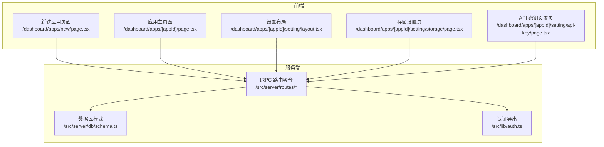
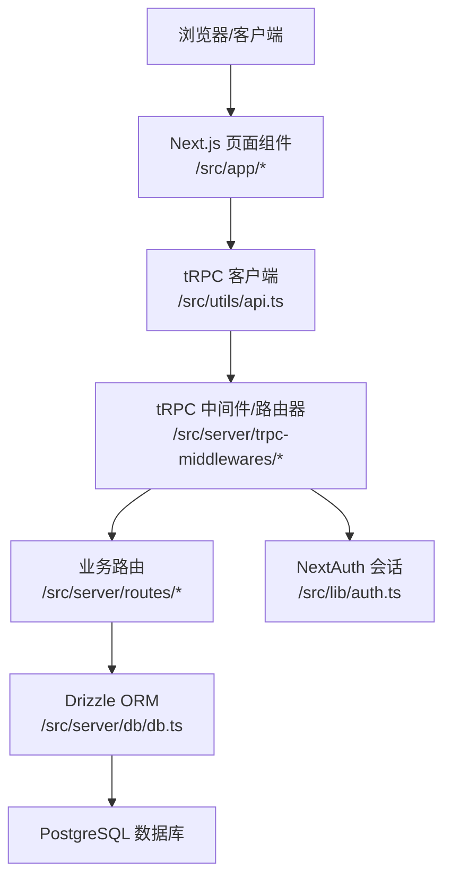
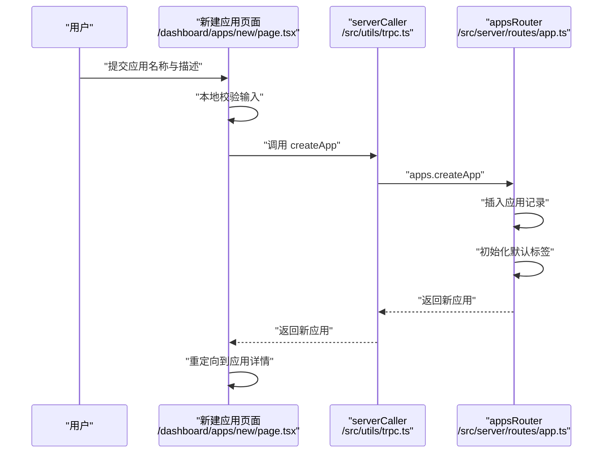
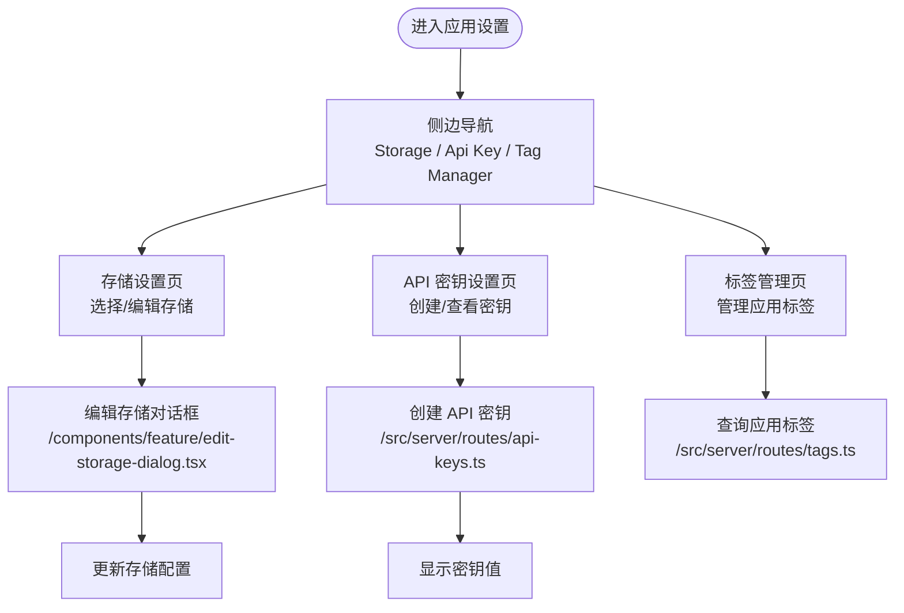
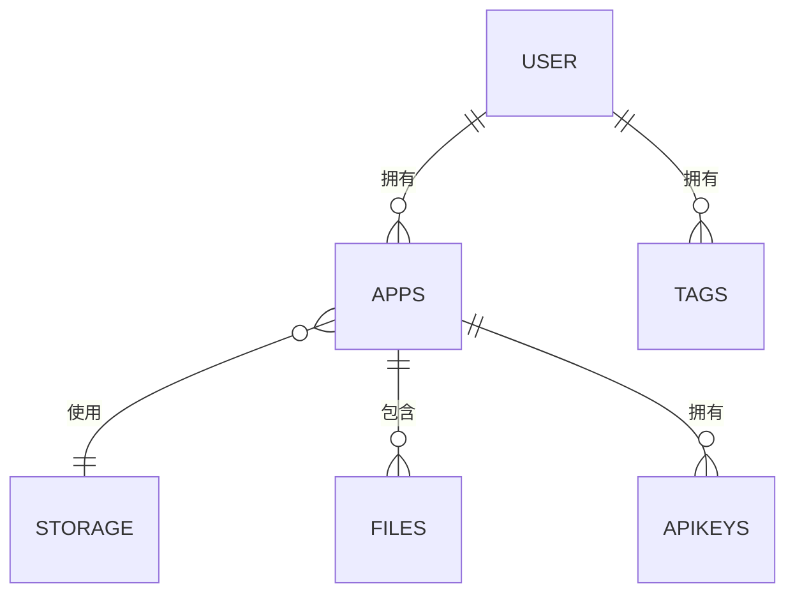
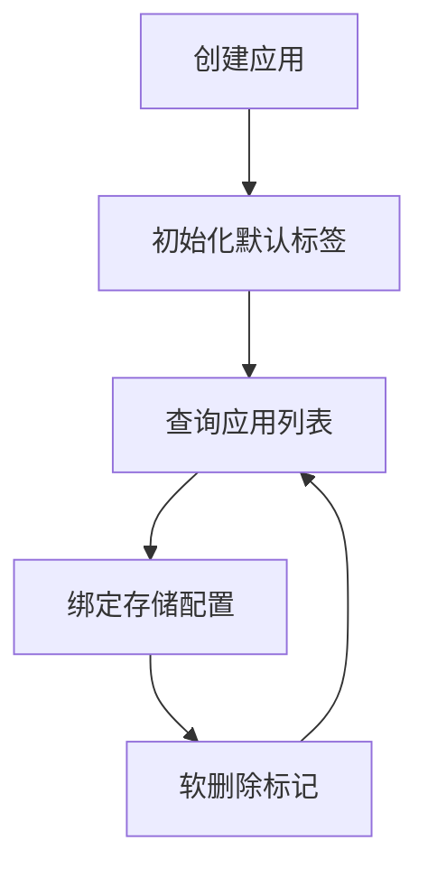
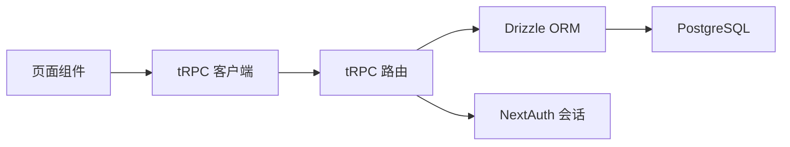

# 应用管理系统

<cite>
**本文引用的文件**
- [src/app/dashboard/apps/layout.tsx](file://src/app/dashboard/apps/layout.tsx)
- [src/server/routes/app.ts](file://src/server/routes/app.ts)
- [src/server/db/schema.ts](file://src/server/db/schema.ts)
- [src/lib/auth.ts](file://src/lib/auth.ts)
- [src/server/routes/api-keys.ts](file://src/server/routes/api-keys.ts)
- [src/server/routes/storages.ts](file://src/server/routes/storages.ts)
- [src/app/dashboard/apps/new/page.tsx](file://src/app/dashboard/apps/new/page.tsx)
- [src/app/dashboard/apps/[appId]/setting/api-key/page.tsx](file://src/app/dashboard/apps/[appId]/setting/api-key/page.tsx)
- [src/app/dashboard/apps/[appId]/setting/storage/page.tsx](file://src/app/dashboard/apps/[appId]/setting/storage/page.tsx)
- [src/server/db/validate-schema.ts](file://src/server/db/validate-schema.ts)
- [src/utils/trpc.ts](file://src/utils/trpc.ts)
- [src/app/dashboard/apps/[appId]/page.tsx](file://src/app/dashboard/apps/[appId]/page.tsx)
- [src/app/dashboard/apps/[appId]/setting/layout.tsx](file://src/app/dashboard/apps/[appId]/setting/layout.tsx)
- [src/components/feature/edit-storage-dialog.tsx](file://src/components/feature/edit-storage-dialog.tsx)
</cite>

## 目录
1. [简介](#简介)
2. [项目结构](#项目结构)
3. [核心组件](#核心组件)
4. [架构总览](#架构总览)
5. [详细组件分析](#详细组件分析)
6. [依赖分析](#依赖分析)
7. [性能考虑](#性能考虑)
8. [故障排除指南](#故障排除指南)
9. [结论](#结论)
10. [附录](#附录)

## 简介
本技术文档面向“应用管理系统”，围绕多应用架构的设计理念与实现原理展开，涵盖应用创建、配置管理、应用隔离、应用与用户的关系模型、权限控制与资源分配策略、应用设置页面与切换导航、应用生命周期管理、统计与监控、最佳实践、性能优化与扩展开发指南，并提供完整的实现方案与故障排除方法。

## 项目结构
系统采用 Next.js App Router 的目录化组织方式，前端页面位于 src/app 下，服务端路由与数据库访问位于 src/server，工具与类型定义位于 src/utils 与 src/lib。应用管理相关的核心路径如下：
- 应用列表与创建：/dashboard/apps/new
- 应用主界面：/dashboard/apps/[appId]
- 应用设置页：/dashboard/apps/[appId]/setting/*
- tRPC 路由：/src/server/routes/*
- 数据库模式：/src/server/db/schema.ts
- 认证入口：/src/lib/auth.ts

图表来源
- [src/app/dashboard/apps/new/page.tsx:1-38](file://src/app/dashboard/apps/new/page.tsx#L1-L38)
- [src/app/dashboard/apps/[appId]/page.tsx](file://src/app/dashboard/apps/[appId]/page.tsx#L1-L266)
- [src/app/dashboard/apps/[appId]/setting/layout.tsx](file://src/app/dashboard/apps/[appId]/setting/layout.tsx#L1-L49)
- [src/app/dashboard/apps/[appId]/setting/storage/page.tsx](file://src/app/dashboard/apps/[appId]/setting/storage/page.tsx#L1-L103)
- [src/app/dashboard/apps/[appId]/setting/api-key/page.tsx](file://src/app/dashboard/apps/[appId]/setting/api-key/page.tsx#L1-L80)
- [src/server/routes/app.ts:1-88](file://src/server/routes/app.ts#L1-L88)
- [src/server/routes/storages.ts:1-74](file://src/server/routes/storages.ts#L1-L74)
- [src/server/routes/api-keys.ts:1-38](file://src/server/routes/api-keys.ts#L1-L38)
- [src/server/db/schema.ts:1-270](file://src/server/db/schema.ts#L1-L270)
- [src/lib/auth.ts:1-3](file://src/lib/auth.ts#L1-L3)

章节来源
- [src/app/dashboard/apps/layout.tsx:1-17](file://src/app/dashboard/apps/layout.tsx#L1-L17)
- [src/app/dashboard/apps/new/page.tsx:1-38](file://src/app/dashboard/apps/new/page.tsx#L1-L38)
- [src/app/dashboard/apps/[appId]/page.tsx](file://src/app/dashboard/apps/[appId]/page.tsx#L1-L266)
- [src/app/dashboard/apps/[appId]/setting/layout.tsx](file://src/app/dashboard/apps/[appId]/setting/layout.tsx#L1-L49)
- [src/app/dashboard/apps/[appId]/setting/storage/page.tsx](file://src/app/dashboard/apps/[appId]/setting/storage/page.tsx#L1-L103)
- [src/app/dashboard/apps/[appId]/setting/api-key/page.tsx](file://src/app/dashboard/apps/[appId]/setting/api-key/page.tsx#L1-L80)
- [src/server/routes/app.ts:1-88](file://src/server/routes/app.ts#L1-L88)
- [src/server/routes/storages.ts:1-74](file://src/server/routes/storages.ts#L1-L74)
- [src/server/routes/api-keys.ts:1-38](file://src/server/routes/api-keys.ts#L1-L38)
- [src/server/db/schema.ts:1-270](file://src/server/db/schema.ts#L1-L270)
- [src/lib/auth.ts:1-3](file://src/lib/auth.ts#L1-L3)

## 核心组件
- 应用路由与业务逻辑：负责应用创建、应用列表查询、应用与存储绑定等。
- 存储配置路由：负责存储配置的增删改查与校验。
- API 密钥路由：负责应用级 API 密钥的创建与查询。
- 前端页面与设置页：负责用户交互、状态管理与 tRPC 客户端调用。
- 数据库模式：定义应用、用户、文件、存储配置、标签、API 密钥等实体及关系。
- 认证与会话：通过 NextAuth 配置导出，确保受保护过程的鉴权。

章节来源
- [src/server/routes/app.ts:1-88](file://src/server/routes/app.ts#L1-L88)
- [src/server/routes/storages.ts:1-74](file://src/server/routes/storages.ts#L1-L74)
- [src/server/routes/api-keys.ts:1-38](file://src/server/routes/api-keys.ts#L1-L38)
- [src/server/db/schema.ts:1-270](file://src/server/db/schema.ts#L1-L270)
- [src/lib/auth.ts:1-3](file://src/lib/auth.ts#L1-L3)

## 架构总览
系统采用前后端分离的 tRPC 架构：前端通过 trpcClientReact 发起请求，后端通过 trpcMiddlewares 聚合路由，路由层基于 Drizzle ORM 访问 Postgres 数据库。认证通过 NextAuth 提供的会话上下文注入到 tRPC 上下文中，实现受保护过程。

图表来源
- [src/app/dashboard/apps/[appId]/page.tsx](file://src/app/dashboard/apps/[appId]/page.tsx#L1-L266)
- [src/app/dashboard/apps/[appId]/setting/storage/page.tsx](file://src/app/dashboard/apps/[appId]/setting/storage/page.tsx#L1-L103)
- [src/app/dashboard/apps/[appId]/setting/api-key/page.tsx](file://src/app/dashboard/apps/[appId]/setting/api-key/page.tsx#L1-L80)
- [src/server/routes/app.ts:1-88](file://src/server/routes/app.ts#L1-L88)
- [src/server/routes/storages.ts:1-74](file://src/server/routes/storages.ts#L1-L74)
- [src/server/routes/api-keys.ts:1-38](file://src/server/routes/api-keys.ts#L1-L38)
- [src/server/db/schema.ts:1-270](file://src/server/db/schema.ts#L1-L270)
- [src/lib/auth.ts:1-3](file://src/lib/auth.ts#L1-L3)

## 详细组件分析

### 应用创建流程（新建应用）
- 前端页面接收表单输入，进行本地校验后调用服务端 caller 创建应用。
- 服务端在事务中插入应用记录，并为新应用初始化三类默认标签（人物、地点、事务）。
- 成功后重定向至新应用详情页。

图表来源
- [src/app/dashboard/apps/new/page.tsx:1-38](file://src/app/dashboard/apps/new/page.tsx#L1-L38)
- [src/utils/trpc.ts:1-7](file://src/utils/trpc.ts#L1-L7)
- [src/server/routes/app.ts:1-88](file://src/server/routes/app.ts#L1-L88)

章节来源
- [src/app/dashboard/apps/new/page.tsx:1-38](file://src/app/dashboard/apps/new/page.tsx#L1-L38)
- [src/server/routes/app.ts:1-88](file://src/server/routes/app.ts#L1-L88)
- [src/server/db/validate-schema.ts:1-18](file://src/server/db/validate-schema.ts#L1-L18)

### 应用设置页面与导航
- 设置布局提供侧边导航，支持跳转到存储设置、API 密钥设置与标签管理。
- 存储设置页展示用户可用的存储配置，支持编辑与选择当前应用使用的存储。
- API 密钥设置页展示并创建应用级 API 密钥，密钥值仅在创建时可见。

图表来源
- [src/app/dashboard/apps/[appId]/setting/layout.tsx](file://src/app/dashboard/apps/[appId]/setting/layout.tsx#L1-L49)
- [src/app/dashboard/apps/[appId]/setting/storage/page.tsx](file://src/app/dashboard/apps/[appId]/setting/storage/page.tsx#L1-L103)
- [src/app/dashboard/apps/[appId]/setting/api-key/page.tsx](file://src/app/dashboard/apps/[appId]/setting/api-key/page.tsx#L1-L80)
- [src/components/feature/edit-storage-dialog.tsx:1-186](file://src/components/feature/edit-storage-dialog.tsx#L1-L186)
- [src/server/routes/api-keys.ts:1-38](file://src/server/routes/api-keys.ts#L1-L38)

章节来源
- [src/app/dashboard/apps/[appId]/setting/layout.tsx](file://src/app/dashboard/apps/[appId]/setting/layout.tsx#L1-L49)
- [src/app/dashboard/apps/[appId]/setting/storage/page.tsx](file://src/app/dashboard/apps/[appId]/setting/storage/page.tsx#L1-L103)
- [src/app/dashboard/apps/[appId]/setting/api-key/page.tsx](file://src/app/dashboard/apps/[appId]/setting/api-key/page.tsx#L1-L80)
- [src/components/feature/edit-storage-dialog.tsx:1-186](file://src/components/feature/edit-storage-dialog.tsx#L1-L186)
- [src/server/routes/api-keys.ts:1-38](file://src/server/routes/api-keys.ts#L1-L38)

### 应用与用户的关系模型、权限控制与资源分配
- 用户与应用：一对多关系，应用记录包含 userId 字段，确保应用归属与隔离。
- 应用与存储：一对一关系，应用记录包含 storageId 字段，用于指定存储配置。
- 权限控制：所有受保护过程均通过受保护中间件与 NextAuth 会话上下文校验，防止越权操作。
- 资源分配：每个应用拥有独立的标签体系与文件集合，避免跨应用数据污染。

图表来源
- [src/server/db/schema.ts:1-270](file://src/server/db/schema.ts#L1-L270)

章节来源
- [src/server/db/schema.ts:1-270](file://src/server/db/schema.ts#L1-L270)
- [src/server/routes/app.ts:1-88](file://src/server/routes/app.ts#L1-L88)
- [src/server/routes/storages.ts:1-74](file://src/server/routes/storages.ts#L1-L74)

### 应用生命周期管理
- 创建：创建应用并初始化默认标签。
- 列表：按用户过滤并按创建时间倒序列出未删除的应用。
- 存储绑定：将应用绑定到指定存储配置，同时进行用户权限校验。
- 删除：应用记录包含删除时间字段，查询时按未删除条件过滤，实现软删除语义。

图表来源
- [src/server/routes/app.ts:1-88](file://src/server/routes/app.ts#L1-L88)
- [src/server/routes/storages.ts:1-74](file://src/server/routes/storages.ts#L1-L74)
- [src/server/db/schema.ts:1-270](file://src/server/db/schema.ts#L1-L270)

章节来源
- [src/server/routes/app.ts:1-88](file://src/server/routes/app.ts#L1-L88)
- [src/server/routes/storages.ts:1-74](file://src/server/routes/storages.ts#L1-L74)
- [src/server/db/schema.ts:1-270](file://src/server/db/schema.ts#L1-L270)

### 应用统计信息与使用情况监控
- 文件上传与预签名 URL：前端通过 Uppy 与 tRPC 创建预签名 URL，实现直传与进度管理。
- 标签分类统计：按类别类型聚合标签并统计数量，用于界面展示与筛选。
- 查询缓存与刷新策略：应用主页面对应用列表与标签查询设置合理的缓存与刷新策略，减少不必要的网络请求。

章节来源
- [src/app/dashboard/apps/[appId]/page.tsx](file://src/app/dashboard/apps/[appId]/page.tsx#L1-L266)
- [src/server/routes/app.ts:1-88](file://src/server/routes/app.ts#L1-L88)

## 依赖分析
- 组件耦合与内聚：页面组件通过 tRPC 客户端与服务端路由解耦；路由层与数据库层通过 Drizzle ORM 解耦。
- 外部依赖：NextAuth 提供认证与会话；Uppy 用于文件上传；Drizzle ORM 进行数据库访问。
- 接口契约：tRPC 路由定义清晰的输入输出契约，前端通过类型安全的客户端调用。

图表来源
- [src/app/dashboard/apps/[appId]/page.tsx](file://src/app/dashboard/apps/[appId]/page.tsx#L1-L266)
- [src/server/routes/app.ts:1-88](file://src/server/routes/app.ts#L1-L88)
- [src/server/db/schema.ts:1-270](file://src/server/db/schema.ts#L1-L270)
- [src/lib/auth.ts:1-3](file://src/lib/auth.ts#L1-L3)

章节来源
- [src/app/dashboard/apps/[appId]/page.tsx](file://src/app/dashboard/apps/[appId]/page.tsx#L1-L266)
- [src/server/routes/app.ts:1-88](file://src/server/routes/app.ts#L1-L88)
- [src/server/db/schema.ts:1-270](file://src/server/db/schema.ts#L1-L270)
- [src/lib/auth.ts:1-3](file://src/lib/auth.ts#L1-L3)

## 性能考虑
- 缓存策略：对应用列表与标签查询设置合理的缓存与刷新策略，避免频繁请求。
- 分页与索引：文件表建立游标索引以提升分页查询性能；标签表建立多列索引以加速过滤与排序。
- 传输优化：通过预签名 URL 实现直传，降低服务器带宽压力。
- 并发控制：在创建应用时使用原子性写入与初始化默认标签，避免重复或遗漏。

## 故障排除指南
- 应用创建失败：检查输入校验与会话有效性；确认 serverCaller 调用链是否正确。
- 存储绑定失败：确认存储配置属于当前用户，检查 changeStorage 路由的权限判断。
- API 密钥不可见：确认仅在创建时可见，后续无法再次查看密钥值。
- 页面无数据：检查 tRPC 客户端缓存与刷新策略，必要时手动触发 refetch。

章节来源
- [src/app/dashboard/apps/new/page.tsx:1-38](file://src/app/dashboard/apps/new/page.tsx#L1-L38)
- [src/app/dashboard/apps/[appId]/setting/storage/page.tsx](file://src/app/dashboard/apps/[appId]/setting/storage/page.tsx#L1-L103)
- [src/server/routes/api-keys.ts:1-38](file://src/server/routes/api-keys.ts#L1-L38)
- [src/app/dashboard/apps/[appId]/page.tsx](file://src/app/dashboard/apps/[appId]/page.tsx#L1-L266)

## 结论
该应用管理系统以 tRPC 为核心，结合 NextAuth 与 Drizzle ORM，实现了多应用架构下的应用创建、配置管理、应用隔离与权限控制。通过清晰的路由职责划分与数据库关系设计，系统具备良好的可维护性与扩展性。建议在生产环境中进一步完善监控指标、错误追踪与安全审计，持续优化查询性能与用户体验。

## 附录
- 最佳实践
  - 使用受保护中间件统一鉴权，避免绕过。
  - 对高频查询建立合适索引，优化分页与过滤。
  - 在前端合理使用缓存与 refetch 策略，减少请求次数。
  - 对敏感配置（如密钥）仅在创建时暴露，后续通过管理页查看。
- 扩展开发指南
  - 新增路由：在 /src/server/routes 下新增模块，并在路由器中注册。
  - 新增页面：在 /src/app 下新增页面目录，遵循 App Router 约定。
  - 数据库变更：通过 Drizzle Schema 定义实体与关系，配合迁移脚本执行。
- 典型问题排查
  - 403 Forbidden：检查当前用户与资源所属用户是否一致。
  - 404 Not Found：确认路由参数与数据库记录是否存在。
  - 500 Internal Error：查看 tRPC 错误栈与数据库日志。