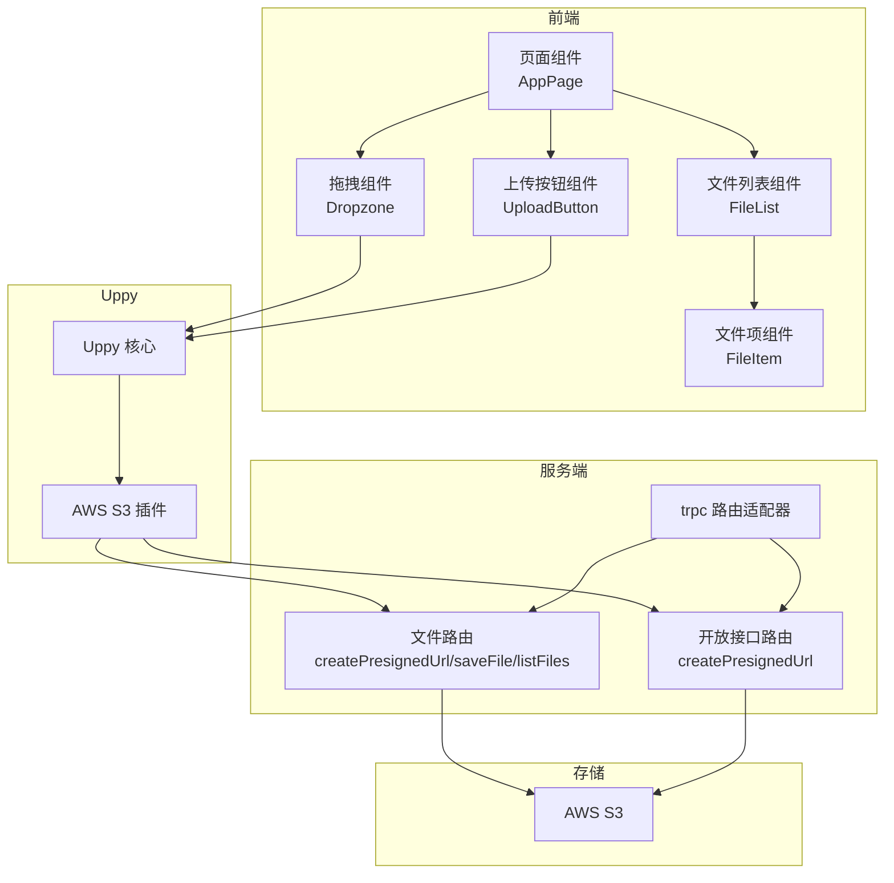
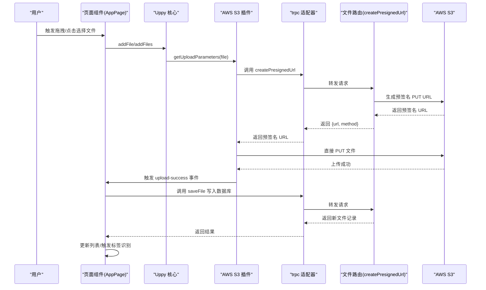
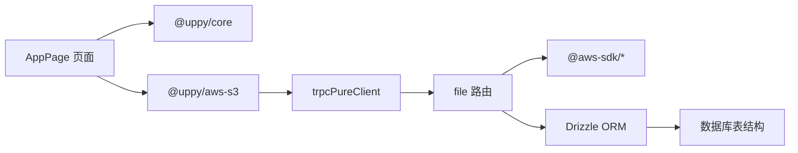

# 文件上传流程

<cite>
**本文引用的文件列表**
- [src/app/api/trpc/[...trpc]/route.ts](file://src/app/api/trpc/[...trpc]/route.ts)
- [src/server/routes/file.ts](file://src/server/routes/file.ts)
- [src/server/routes/file-open.ts](file://src/server/routes/file-open.ts)
- [src/app/dashboard/apps/[appId]/page.tsx](file://src/app/dashboard/apps/[appId]/page.tsx)
- [src/components/feature/dropzone.tsx](file://src/components/feature/dropzone.tsx)
- [src/components/feature/upload-button.tsx](file://src/components/feature/upload-button.tsx)
- [src/hooks/use-uppy-state.ts](file://src/hooks/use-uppy-state.ts)
- [src/components/feature/file-list.tsx](file://src/components/feature/file-list.tsx)
- [src/components/feature/file-item.tsx](file://src/components/feature/file-item.tsx)
- [src/server/db/schema.ts](file://src/server/db/schema.ts)
- [src/app/image/[id]/route.ts](file://src/app/image/[id]/route.ts)
</cite>

## 目录
1. [简介](#简介)
2. [项目结构](#项目结构)
3. [核心组件](#核心组件)
4. [架构总览](#架构总览)
5. [详细组件分析](#详细组件分析)
6. [依赖关系分析](#依赖关系分析)
7. [性能考量](#性能考量)
8. [故障排除指南](#故障排除指南)
9. [结论](#结论)
10. [附录](#附录)

## 简介
本文件围绕“文件上传流程”展开，系统性阐述从客户端到服务端的完整生命周期：预签名 URL 生成机制、AWS S3 集成与直传实现、Uppy 文件上传组件的配置与使用（拖拽上传、批量上传、进度跟踪）、文件类型验证与大小限制、安全检查、上传失败重试机制、并发上传控制以及用户体验优化策略。文档同时提供最佳实践与故障排除建议，帮助开发者快速理解并稳定落地该功能。

## 项目结构
该仓库采用 Next.js App Router 结构，文件上传相关逻辑主要分布在以下模块：
- API 路由层：负责暴露 trpc 接口，统一处理请求与响应。
- 业务路由层：封装文件相关的 CRUD、分页查询、回收站等操作，并提供预签名 URL 生成能力。
- 前端页面与组件：基于 Uppy 实现拖拽上传、批量选择、进度跟踪与本地预览；结合分页列表展示已上传文件。
- 数据模型：定义了应用、存储配置、文件、标签等表结构及关系。
- 图片直链路由：支持按 ID 获取图片并可选缩放转换格式。

图表来源
- [src/app/dashboard/apps/[appId]/page.tsx](file://src/app/dashboard/apps/[appId]/page.tsx#L56-L72)
- [src/components/feature/dropzone.tsx:1-52](file://src/components/feature/dropzone.tsx#L1-L52)
- [src/components/feature/upload-button.tsx:1-46](file://src/components/feature/upload-button.tsx#L1-L46)
- [src/components/feature/file-list.tsx:1-373](file://src/components/feature/file-list.tsx#L1-L373)
- [src/server/routes/file.ts:26-90](file://src/server/routes/file.ts#L26-L90)
- [src/server/routes/file-open.ts:30-40](file://src/server/routes/file-open.ts#L30-L40)
- [src/app/api/trpc/[...trpc]/route.ts](file://src/app/api/trpc/[...trpc]/route.ts#L1-L14)

章节来源
- [src/app/api/trpc/[...trpc]/route.ts](file://src/app/api/trpc/[...trpc]/route.ts#L1-L14)
- [src/server/routes/file.ts:26-90](file://src/server/routes/file.ts#L26-L90)
- [src/server/routes/file-open.ts:30-40](file://src/server/routes/file-open.ts#L30-L40)
- [src/app/dashboard/apps/[appId]/page.tsx](file://src/app/dashboard/apps/[appId]/page.tsx#L56-L72)
- [src/components/feature/dropzone.tsx:1-52](file://src/components/feature/dropzone.tsx#L1-L52)
- [src/components/feature/upload-button.tsx:1-46](file://src/components/feature/upload-button.tsx#L1-L46)
- [src/components/feature/file-list.tsx:1-373](file://src/components/feature/file-list.tsx#L1-L373)

## 核心组件
- 预签名 URL 生成：通过 trpc 路由在服务端生成带过期时间的 PUT 预签名 URL，客户端直接向 S3 上传。
- Uppy 集成：在页面中初始化 Uppy 并挂载 AWS S3 插件，自动调用预签名 URL 接口完成直传。
- 拖拽与批量上传：Dropzone 组件支持拖拽文件，UploadButton 支持点击选择文件，二者均通过 uppy.addFile/addFiles 注入队列。
- 进度与本地预览：FileList 监听上传事件，实时更新上传中的文件列表，并在今日分组中展示本地预览。
- 数据持久化：上传成功后调用 saveFile 将文件元信息写入数据库，支持后续检索与标签识别。

章节来源
- [src/server/routes/file.ts:26-90](file://src/server/routes/file.ts#L26-L90)
- [src/app/dashboard/apps/[appId]/page.tsx](file://src/app/dashboard/apps/[appId]/page.tsx#L56-L72)
- [src/components/feature/dropzone.tsx:1-52](file://src/components/feature/dropzone.tsx#L1-L52)
- [src/components/feature/upload-button.tsx:1-46](file://src/components/feature/upload-button.tsx#L1-L46)
- [src/components/feature/file-list.tsx:152-235](file://src/components/feature/file-list.tsx#L152-L235)

## 架构总览
下图展示了从用户触发上传到最终入库的关键交互路径，涵盖预签名生成、直传 S3、保存元数据与标签识别等步骤。

图表来源
- [src/app/dashboard/apps/[appId]/page.tsx](file://src/app/dashboard/apps/[appId]/page.tsx#L56-L72)
- [src/server/routes/file.ts:26-90](file://src/server/routes/file.ts#L26-L90)
- [src/components/feature/file-list.tsx:152-235](file://src/components/feature/file-list.tsx#L152-L235)

## 详细组件分析

### 预签名 URL 生成机制
- 输入参数校验：包含文件名、内容类型、大小、应用 ID，确保上传前具备必要信息。
- 应用与存储校验：查询应用及其存储配置，若应用不存在或未配置存储则抛出相应错误。
- 权限校验：校验当前登录用户与应用归属一致，防止越权访问。
- S3 参数构造：根据日期前缀与随机 UUID 生成 Key，设置 Content-Type 与 Content-Length。
- 客户端初始化：通过 AWS S3 插件的 getUploadParameters 回调触发 trpc 调用，返回预签名 URL 与方法。
- 过期时间：预签名 URL 默认有效期为 2 分钟，避免长时间暴露。

章节来源
- [src/server/routes/file.ts:26-90](file://src/server/routes/file.ts#L26-L90)
- [src/app/dashboard/apps/[appId]/page.tsx](file://src/app/dashboard/apps/[appId]/page.tsx#L59-L69)

### AWS S3 集成与直接上传
- 直传流程：Uppy 使用 AWS S3 插件，通过预签名 URL 直接向 S3 发送 PUT 请求，绕过应用服务器，降低延迟与带宽占用。
- 存储配置：从应用关联的存储配置中读取桶名、区域、凭证与可选 Endpoint，确保与目标 S3 兼容。
- 错误处理：若存储配置缺失或无效，服务端会抛出 BAD_REQUEST 或 NOT_FOUND 等错误码，前端需提示用户配置存储。

章节来源
- [src/server/routes/file.ts:64-84](file://src/server/routes/file.ts#L64-L84)
- [src/server/db/schema.ts:164-173](file://src/server/db/schema.ts#L164-L173)

### Uppy 文件上传组件配置与使用
- 初始化与插件挂载：在页面中创建 Uppy 实例并挂载 AWS S3 插件，设置 getUploadParameters 回调以动态获取预签名 URL。
- 拖拽上传：Dropzone 组件监听拖拽事件，将文件集合添加到 Uppy 队列，支持拖拽高亮反馈。
- 批量上传：UploadButton 组件通过隐藏的 input[type=file] 触发多选，逐个将文件加入队列。
- 进度跟踪：通过 useUppyState 订阅 Uppy 状态，结合 FileList 监听 upload-success 与 complete 事件，维护上传中文件 ID 列表并在今日分组中展示本地预览。

章节来源
- [src/app/dashboard/apps/[appId]/page.tsx](file://src/app/dashboard/apps/[appId]/page.tsx#L56-L72)
- [src/components/feature/dropzone.tsx:1-52](file://src/components/feature/dropzone.tsx#L1-L52)
- [src/components/feature/upload-button.tsx:1-46](file://src/components/feature/upload-button.tsx#L1-L46)
- [src/hooks/use-uppy-state.ts:1-17](file://src/hooks/use-uppy-state.ts#L1-L17)
- [src/components/feature/file-list.tsx:126-235](file://src/components/feature/file-list.tsx#L126-L235)

### 文件类型验证、大小限制与安全检查
- 类型与大小：预签名 URL 接口要求提供 contentType 与 size，服务端据此构造 S3 参数；客户端应确保文件类型与大小符合预期。
- 安全检查：服务端在生成预签名 URL 前进行应用存在性、存储配置存在性与用户权限校验，防止越权与非法上传。
- 存储键命名：Key 采用日期前缀与随机 UUID 组合，避免冲突并便于归档与清理。

章节来源
- [src/server/routes/file.ts:26-90](file://src/server/routes/file.ts#L26-L90)
- [src/server/routes/file.ts:64-69](file://src/server/routes/file.ts#L64-L69)

### 上传失败重试机制与并发控制
- 重试策略：Uppy 提供内置的重试与暂停/恢复能力，可在网络波动时自动重试；建议在 UI 中提供手动重试入口。
- 并发控制：可通过 Uppy 的并发选项限制同时上传的任务数量，避免资源争用与超时。
- 失败处理：当上传失败时，保留文件在队列中，允许用户重新上传或删除；服务端不执行 S3 删除，仅标记数据库状态（如软删除）。

章节来源
- [src/app/dashboard/apps/[appId]/page.tsx](file://src/app/dashboard/apps/[appId]/page.tsx#L56-L72)
- [src/components/feature/file-list.tsx:152-235](file://src/components/feature/file-list.tsx#L152-L235)

### 用户体验优化
- 本地预览：在上传过程中，对图片文件生成本地对象 URL，在今日分组中以缩略图形式展示，提升即时反馈。
- 分组与滚动加载：文件列表按“今天/昨天/某日期”分组，支持无限滚动加载更多，减少首屏压力。
- 操作入口：提供复制链接、删除、预览等快捷操作，增强可用性。

章节来源
- [src/components/feature/file-list.tsx:264-339](file://src/components/feature/file-list.tsx#L264-L339)
- [src/components/feature/file-item.tsx:1-138](file://src/components/feature/file-item.tsx#L1-L138)

### 数据持久化与标签识别
- 元数据入库：上传成功后调用 saveFile，将文件名、路径、URL、类型、用户 ID、应用 ID 等写入数据库。
- 标签识别：对于图片文件，进一步触发标签识别任务，识别完成后刷新标签分类数据。

章节来源
- [src/server/routes/file.ts:91-118](file://src/server/routes/file.ts#L91-L118)
- [src/components/feature/file-list.tsx:170-183](file://src/components/feature/file-list.tsx#L170-L183)

## 依赖关系分析
- 前端依赖
  - Uppy 核心与 AWS S3 插件：负责上传参数获取与直传。
  - trpc 客户端：用于调用 createPresignedUrl 与 saveFile。
  - 自定义 Hook：useUppyState 用于订阅 Uppy 状态。
- 后端依赖
  - trpc 适配器：将 Next.js 请求转交给 trpc 路由。
  - AWS SDK：生成预签名 URL 与访问 S3。
  - Drizzle ORM：访问数据库，读取应用与存储配置，写入文件元数据。

图表来源
- [src/app/dashboard/apps/[appId]/page.tsx](file://src/app/dashboard/apps/[appId]/page.tsx#L56-L72)
- [src/server/routes/file.ts:1-16](file://src/server/routes/file.ts#L1-L16)
- [src/server/db/schema.ts:120-173](file://src/server/db/schema.ts#L120-L173)

章节来源
- [src/app/dashboard/apps/[appId]/page.tsx](file://src/app/dashboard/apps/[appId]/page.tsx#L56-L72)
- [src/server/routes/file.ts:1-16](file://src/server/routes/file.ts#L1-L16)
- [src/server/db/schema.ts:120-173](file://src/server/db/schema.ts#L120-L173)

## 性能考量
- 直传优势：Uppy 直连 S3，避免应用服务器中转，显著降低延迟与带宽占用。
- 预签名有效期：默认 2 分钟，建议根据文件大小与网络状况调整，过大文件可考虑延长或分片上传。
- 并发与重试：合理设置并发数与重试次数，避免对 S3 造成瞬时压力。
- 图片处理：图片直链路由支持按需缩放与格式转换，建议在前端按需请求合适尺寸，减少传输体积。

章节来源
- [src/server/routes/file.ts:82-84](file://src/server/routes/file.ts#L82-L84)
- [src/app/image/[id]/route.ts](file://src/app/image/[id]/route.ts#L73-L76)

## 故障排除指南
- 预签名 URL 生成失败
  - 检查应用是否存在且已配置存储；若未配置，提示用户前往设置页面配置存储。
  - 确认当前登录用户与应用归属一致，避免 FORBIDDEN。
- 上传失败
  - 查看网络状态与 S3 凭证配置；确认预签名 URL 未过期。
  - 在 UI 中提供重试按钮，必要时移除失败任务后重新添加。
- 图片无法显示
  - 确认文件类型为图片；检查直链路由参数与图片 ID 是否正确。
  - 若需要缩放，确认传入的宽度/高度参数有效。
- 数据库异常
  - saveFile 失败时检查文件名、路径、URL、类型与用户/应用 ID 是否合法。

章节来源
- [src/server/routes/file.ts:46-61](file://src/server/routes/file.ts#L46-L61)
- [src/server/routes/file.ts:100-118](file://src/server/routes/file.ts#L100-L118)
- [src/app/image/[id]/route.ts](file://src/app/image/[id]/route.ts#L17-L45)

## 结论
该文件上传方案通过 Uppy 与 AWS S3 预签名直传，实现了高性能、低耦合的上传流程。配合完善的前端组件与后端校验，既保证了安全性，又提供了良好的用户体验。建议在生产环境中结合并发控制、重试策略与监控告警，持续优化上传稳定性与性能表现。

## 附录
- 最佳实践
  - 严格校验文件类型与大小，避免无效上传。
  - 合理设置预签名 URL 过期时间，大文件可考虑分片上传。
  - 控制并发上传数量，避免资源争用。
  - 提供清晰的错误提示与重试机制，提升用户信心。
  - 对图片文件启用标签识别与缓存策略，优化检索与加载体验。