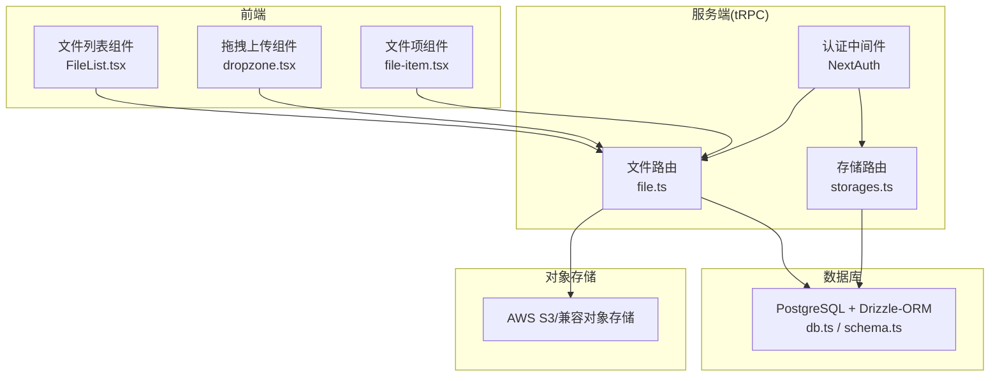
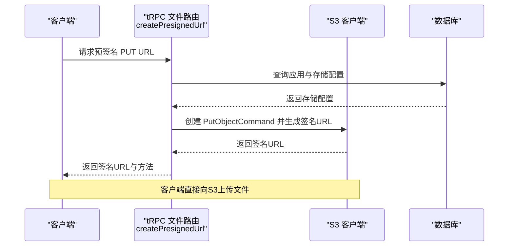
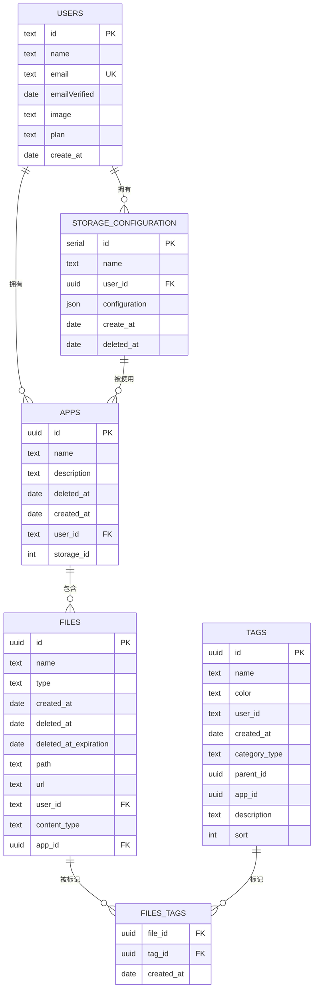
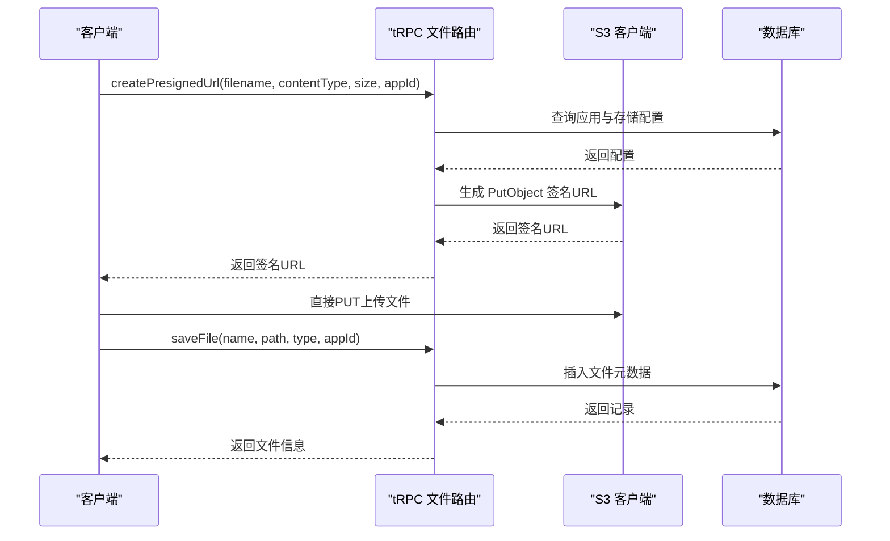
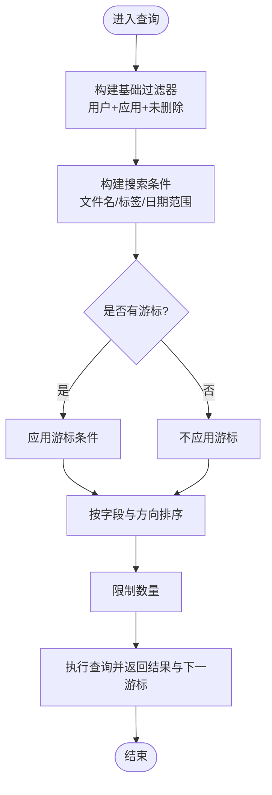
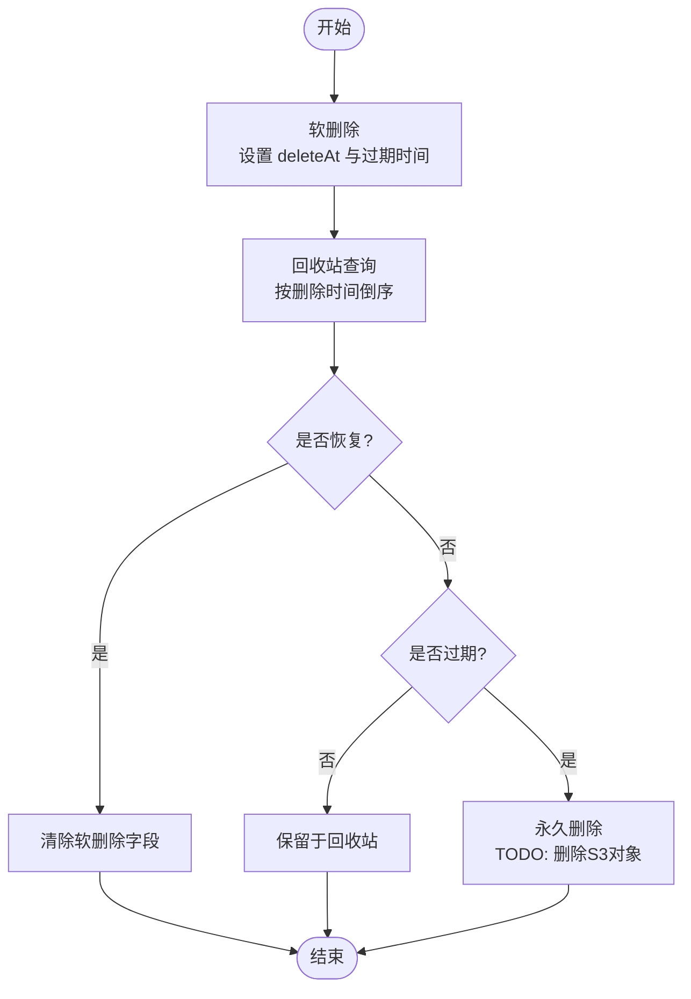
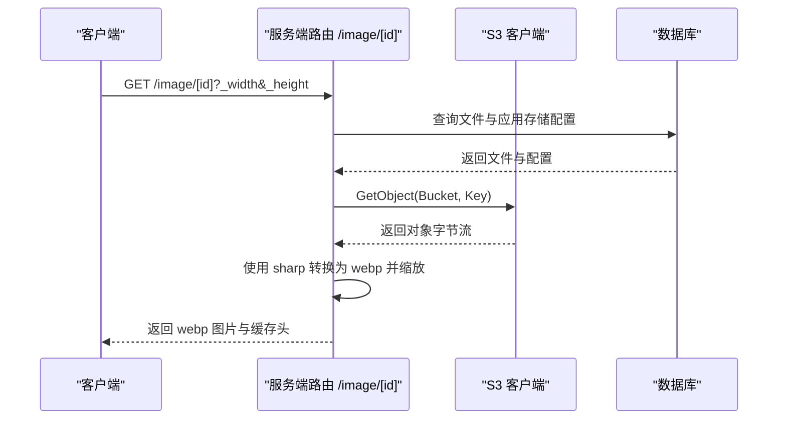
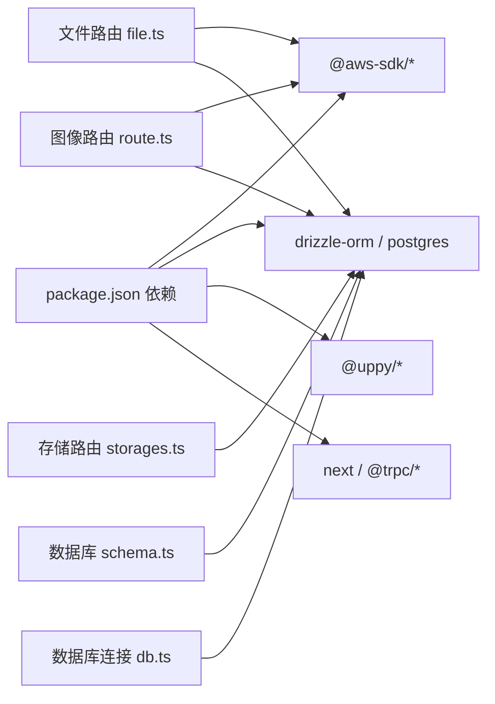

# 文件存储架构

<cite>
**本文引用的文件**
- [schema.ts](file://src/server/db/schema.ts)
- [file.ts](file://src/server/routes/file.ts)
- [storages.ts](file://src/server/routes/storages.ts)
- [db.ts](file://src/server/db/db.ts)
- [drizzle.config.ts](file://drizzle.config.ts)
- [route.ts](file://src/app/image/[id]/route.ts)
- [FileList.tsx](file://src/components/feature/FileList.tsx)
- [file-item.tsx](file://src/components/feature/file-item.tsx)
- [dropzone.tsx](file://src/components/feature/dropzone.tsx)
- [auth/index.ts](file://src/server/auth/index.ts)
- [package.json](file://package.json)
</cite>

## 目录

1. [简介](#简介)
2. [项目结构](#项目结构)
3. [核心组件](#核心组件)
4. [架构总览](#架构总览)
5. [详细组件分析](#详细组件分析)
6. [依赖关系分析](#依赖关系分析)
7. [性能考量](#性能考量)
8. [故障排查指南](#故障排查指南)
9. [结论](#结论)
10. [附录](#附录)

## 简介

本文件存储架构围绕“数据库 + 对象存储（AWS S3）”的设计展开，提供文件上传、预签名 URL 生成、文件元数据持久化、按标签与时间检索、软删除与回收站、以及通过服务端路由实现的缩略图与缓存控制。系统通过 tRPC 提供前后端交互，NextAuth 实现认证与会话，Drizzle-ORM 进行数据库建模与查询。

## 项目结构

- 数据库层：PostgreSQL + Drizzle-ORM，定义了文件、应用、存储配置、标签等核心表及关系。
- 业务层：tRPC 路由，负责文件 CRUD、回收站、批量操作、存储配置管理等。
- 对象存储：AWS S3（兼容 S3 的对象存储），通过预签名 URL 上传与 GetObject 下载。
- 前端展示：Next.js 页面与组件，负责拖拽上传、无限滚动列表、图片预览与复制链接。
- 认证与授权：NextAuth + Drizzle Adapter，结合 tRPC 中间件保护路由。

图表来源

- [file.ts:1-561](file://src/server/routes/file.ts#L1-L561)
- [storages.ts:1-74](file://src/server/routes/storages.ts#L1-L74)
- [schema.ts:120-173](file://src/server/db/schema.ts#L120-L173)
- [db.ts:1-9](file://src/server/db/db.ts#L1-L9)
- [route.ts:1-92](file://src/app/image/[id]/route.ts#L1-L92)

章节来源

- [schema.ts:120-173](file://src/server/db/schema.ts#L120-L173)
- [file.ts:1-561](file://src/server/routes/file.ts#L1-L561)
- [storages.ts:1-74](file://src/server/routes/storages.ts#L1-L74)
- [db.ts:1-9](file://src/server/db/db.ts#L1-L9)
- [drizzle.config.ts:1-14](file://drizzle.config.ts#L1-L14)

## 核心组件

- 文件表与关系
  - 表结构包含文件 ID、名称、类型、创建时间、软删除时间与过期时间、存储路径、完整 URL、所属用户与应用、内容类型等字段，并建立与用户、应用、标签的关联。
- 存储配置表
  - 存放每个用户的 S3 配置（桶名、区域、凭证、可选自定义 Endpoint），并与用户建立一对一关系。
- tRPC 文件路由
  - 提供预签名 URL 创建、保存已上传文件元数据、分页查询、软删除、批量软删除、恢复、回收站查询、永久删除等能力。
- tRPC 存储路由
  - 提供列出、创建、更新存储配置的能力。
- 服务端图像路由
  - 通过 GetObject 读取对象，使用 sharp 进行缩放与转码为 webp，设置缓存头，返回给客户端。
- 前端组件
  - 文件列表、文件项、拖拽上传，配合 Uppy 完成上传流程；列表支持无限滚动与分组展示。

章节来源

- [schema.ts:120-173](file://src/server/db/schema.ts#L120-L173)
- [file.ts:26-394](file://src/server/routes/file.ts#L26-L394)
- [storages.ts:7-73](file://src/server/routes/storages.ts#L7-L73)
- [route.ts:1-92](file://src/app/image/[id]/route.ts#L1-L92)
- [FileList.tsx:1-366](file://src/components/feature/FileList.tsx#L1-L366)
- [file-item.tsx:1-138](file://src/components/feature/file-item.tsx#L1-L138)
- [dropzone.tsx:1-52](file://src/components/feature/dropzone.tsx#L1-L52)

## 架构总览

系统采用“数据库 + 对象存储”的分离架构：

- 数据库存储文件元数据与索引，确保快速检索与权限控制。
- 对象存储负责实际文件内容，通过预签名 URL 实现客户端直传，降低服务端带宽压力。
- tRPC 路由作为统一入口，完成鉴权、参数校验、数据库写入与对象存储交互。
- 服务端图像路由负责按需缩放与格式转换，提升加载性能与节省带宽。

图表来源

- [file.ts:27-90](file://src/server/routes/file.ts#L27-L90)

章节来源

- [file.ts:27-90](file://src/server/routes/file.ts#L27-L90)

## 详细组件分析

### 数据模型与表结构

- 文件表（files）
  - 关键字段：id、name、type、createdAt、deleteAt、deletedAtExpiration、path、url、userId、contentType、appId。
  - 索引：基于 (id, createdAt) 的复合索引，用于分页与排序。
  - 关系：与 users（多对一）、apps（多对一）、files_tags（多对多）关联。
- 应用表（apps）
  - 关键字段：id、name、description、deleteAt、createAt、userId、storageId。
  - 关系：与 users（多对一）、storageConfiguration（多对一）关联。
- 存储配置表（storageConfiguration）
  - 关键字段：id、name、userId、configuration（JSON，包含 bucket、region、accessKeyId、secretAccessKey、apiEndPoint）、createAt、deleteAt。
  - 关系：与 users（多对一）。
- 标签与文件标签关联表
  - tags：标签主表，含分类、颜色、父子关系等。
  - files_tags：多对多关联，维护文件与标签的绑定及创建时间。

图表来源

- [schema.ts:18-270](file://src/server/db/schema.ts#L18-L270)

章节来源

- [schema.ts:18-270](file://src/server/db/schema.ts#L18-L270)

### 文件上传与元数据保存

- 预签名 URL 流程
  - 客户端请求 createPresignedUrl，服务端根据 appId 获取应用与存储配置，构造 PutObject 命令，生成 2 分钟有效期的签名 PUT URL 返回给客户端。
  - 客户端直接向 S3 上传，完成后调用 saveFile 将文件元数据写入数据库。
- 保存文件元数据
  - saveFile 接口接收 name、path、type、appId，解析 path 为 pathname 与完整 URL，写入数据库并返回新记录。

图表来源

- [file.ts:27-118](file://src/server/routes/file.ts#L27-L118)

章节来源

- [file.ts:27-118](file://src/server/routes/file.ts#L27-L118)

### 文件检索与分页

- 列表查询
  - listFiles：按用户与应用过滤，按创建时间倒序返回文件列表。
- 无限滚动查询
  - infinityQueryFiles：支持游标分页、排序字段与方向、搜索（文件名或标签名）、日期范围过滤，仅返回未软删除的文件。
- 标签筛选查询
  - infinityQueryFilesByTag：通过 files_tags 关联查询，支持标签筛选与搜索。

图表来源

- [file.ts:135-234](file://src/server/routes/file.ts#L135-L234)
- [file.ts:396-500](file://src/server/routes/file.ts#L396-L500)

章节来源

- [file.ts:120-234](file://src/server/routes/file.ts#L120-L234)
- [file.ts:396-500](file://src/server/routes/file.ts#L396-L500)

### 文件生命周期管理（软删除、回收站、永久删除）

- 软删除
  - deleteFile/batchDeleteFiles：设置 deleteAt 与 deletedAtExpiration（默认 7 天后过期），同时保留文件在对象存储中。
- 恢复
  - restoreFile/batchRestoreFiles：清除 deleteAt 与 deletedAtExpiration。
- 回收站
  - getDeletedFiles：查询 deleteAt 非空且按删除时间倒序的文件，支持游标分页。
- 永久删除
  - permanentlyDeleteFile/batchPermanentlyDeleteFiles：当前实现仅删除数据库记录，对象存储文件删除为 TODO，建议在生产环境补充 S3 删除逻辑。

图表来源

- [file.ts:236-394](file://src/server/routes/file.ts#L236-L394)
- [file.ts:501-557](file://src/server/routes/file.ts#L501-L557)

章节来源

- [file.ts:236-394](file://src/server/routes/file.ts#L236-L394)
- [file.ts:501-557](file://src/server/routes/file.ts#L501-L557)

### URL 生成与访问控制

- 预签名 URL
  - 通过 createPresignedUrl 生成 PUT URL，有效期 2 分钟，避免服务端中转大文件。
- 图片访问路由
  - /image/[id] 路由：根据文件 contentType 判断是否为图片，读取 S3 对象，使用 sharp 缩放与转码为 webp，设置缓存头，返回响应。
- 访问控制
  - tRPC 路由均受 protectedProcedure 保护，结合 NextAuth 会话验证用户身份；查询时严格按 userId 与 appId 过滤，防止越权访问。

图表来源

- [route.ts:1-92](file://src/app/image/[id]/route.ts#L1-L92)

章节来源

- [route.ts:1-92](file://src/app/image/[id]/route.ts#L1-L92)
- [file.ts:27-90](file://src/server/routes/file.ts#L27-L90)

### 前端上传与展示

- 拖拽上传
  - dropzone.tsx 监听拖拽事件，将文件加入 Uppy 队列。
- 文件列表
  - FileList.tsx 使用 tRPC 的无限查询与分页游标，支持按日期分组、搜索、排序；上传成功后通过 saveFile 写入数据库并更新本地缓存。
- 文件项
  - file-item.tsx 渲染图片或占位图，支持预览、复制链接、删除操作。

章节来源

- [dropzone.tsx:1-52](file://src/components/feature/dropzone.tsx#L1-L52)
- [FileList.tsx:1-366](file://src/components/feature/FileList.tsx#L1-L366)
- [file-item.tsx:1-138](file://src/components/feature/file-item.tsx#L1-L138)

## 依赖关系分析

- 外部依赖
  - @aws-sdk/client-s3、@aws-sdk/s3-request-presigner：S3 客户端与签名工具。
  - drizzle-orm、postgres：数据库 ORM 与驱动。
  - @uppy/\*：上传客户端。
  - next、@trpc/\*：框架与远程过程调用。
- 内部模块
  - 路由依赖数据库 schema 与 db 实例；图像路由依赖存储配置；文件列表依赖 tRPC 客户端与 Uppy。

图表来源

- [package.json:14-65](file://package.json#L14-L65)
- [file.ts:1-16](file://src/server/routes/file.ts#L1-L16)
- [route.ts:1-6](file://src/app/image/[id]/route.ts#L1-L6)
- [schema.ts:1-16](file://src/server/db/schema.ts#L1-L16)
- [db.ts:1-9](file://src/server/db/db.ts#L1-L9)

章节来源

- [package.json:14-65](file://package.json#L14-L65)
- [file.ts:1-16](file://src/server/routes/file.ts#L1-L16)
- [route.ts:1-6](file://src/app/image/[id]/route.ts#L1-L6)
- [schema.ts:1-16](file://src/server/db/schema.ts#L1-L16)
- [db.ts:1-9](file://src/server/db/db.ts#L1-L9)

## 性能考量

- 上传性能
  - 使用预签名 URL 直传，减少服务端带宽与 CPU 开销；建议在客户端限制并发上传数量，避免 S3 限速。
- 查询性能
  - files 表的 (id, createdAt) 复合索引有助于分页与排序；建议在高频查询字段上增加合适索引（如 appId、userId）。
- 图像处理
  - 服务端路由使用 sharp 进行缩放与转码，建议缓存转换后的图片，减少重复计算；可结合 CDN 与对象存储的缓存头策略。
- 数据库与对象存储一致性
  - 软删除与回收站机制避免误删；建议定期清理过期的软删除记录与对应对象存储文件，保持成本可控。

[本节为通用性能建议，无需特定文件来源]

## 故障排查指南

- 预签名 URL 失败
  - 检查应用是否存在且已配置存储；确认存储配置中的桶名、区域、凭证正确；检查签名有效期与网络环境。
- 上传成功但无法显示
  - 确认 saveFile 已被调用且 path/url 字段正确；检查数据库中文件记录与对象存储 Key 是否一致。
- 图片无法加载或尺寸异常
  - 检查 /image/[id] 路由是否正确读取存储配置；确认 contentType 以 image 开头；验证 sharp 转码链路与缓存头设置。
- 权限问题
  - 确认 tRPC 路由受保护且会话有效；查询时按 userId 与 appId 过滤是否生效。
- 回收站与永久删除
  - 检查 deleteAt 与 deletedAtExpiration 字段；确认回收站查询条件；永久删除需补充 S3 对象删除逻辑。

章节来源

- [file.ts:27-90](file://src/server/routes/file.ts#L27-L90)
- [file.ts:236-394](file://src/server/routes/file.ts#L236-L394)
- [file.ts:501-557](file://src/server/routes/file.ts#L501-L557)
- [route.ts:1-92](file://src/app/image/[id]/route.ts#L1-L92)
- [auth/index.ts:111-162](file://src/server/auth/index.ts#L111-L162)

## 结论

该文件存储架构通过数据库与对象存储的清晰分工，实现了高扩展性与高性能的文件管理能力。tRPC 提供了强类型的接口与完善的权限控制，前端组件与 Uppy 协作完成高效上传体验。建议在生产环境中完善对象存储的批量清理与监控告警，持续优化查询索引与图像处理链路，以进一步提升稳定性与成本效益。

[本节为总结性内容，无需特定文件来源]

## 附录

### 存储成本优化策略

- 分层存储与生命周期规则
  - 对象存储启用分层存储（如 IA/智能分层），对长期未访问的文件自动降级到低频层。
  - 设置生命周期规则：软删除后自动清理过期对象，避免冗余存储。
- 传输与编码优化
  - 使用 webp 或 AVIF 等现代格式；按需缩放，避免传输超大分辨率图片。
  - 启用对象存储的压缩与缓存头，减少带宽消耗。
- 上传策略
  - 控制并发与重试次数，避免重复上传与网络抖动导致的冗余对象。

[本节为通用优化建议，无需特定文件来源]

### 文件备份与灾难恢复

- 数据库备份
  - 使用托管数据库的自动备份策略，定期导出 schema 与数据快照，Drizzle Kit 可用于迁移与回滚。
- 对象存储备份
  - 启用跨区域复制或多账户归档；定期校验备份对象完整性。
- 灾难恢复演练
  - 定期进行恢复演练，验证从备份重建应用与数据的可用性。

章节来源

- [drizzle.config.ts:1-14](file://drizzle.config.ts#L1-L14)

### 安全考虑与访问日志

- 凭证管理
  - 使用最小权限原则的 IAM 角色与只读/写入策略；定期轮换密钥；避免硬编码凭证。
- 访问控制
  - tRPC 路由与 NextAuth 会话双重保护；查询严格按用户与应用维度过滤。
- 日志与监控
  - 记录 S3 访问日志与 tRPC 调用日志；设置对象存储与数据库的告警阈值（如错误率、延迟、存储用量）。

[本节为通用安全与监控建议，无需特定文件来源]

### 扩展指南与最佳实践

- 新增存储提供商
  - 在存储配置表中扩展 JSON 字段以适配不同对象存储；在路由中增加条件分支以选择对应 SDK。
- 标签与元数据
  - 建议在对象存储层面增加对象标签，便于计费与治理；数据库中维护标签与文件的多对多关系。
- 性能优化
  - 前端：使用 IntersectionObserver 与虚拟滚动优化长列表；服务端：缓存热点对象与查询结果。
- 可观测性
  - 增加埋点统计上传成功率、平均处理时延、对象存储错误率等指标。

[本节为通用扩展建议，无需特定文件来源]
