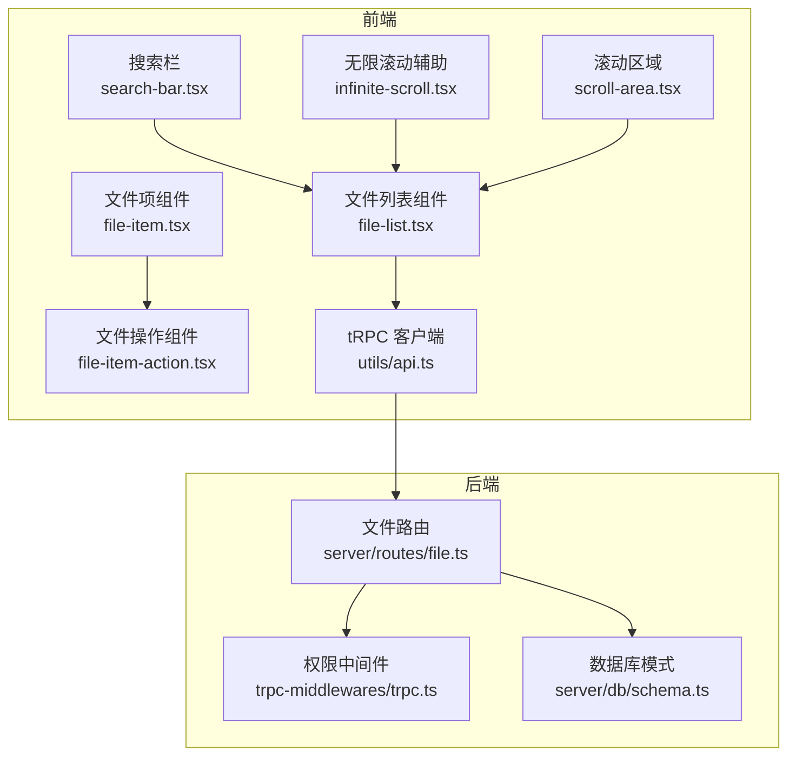
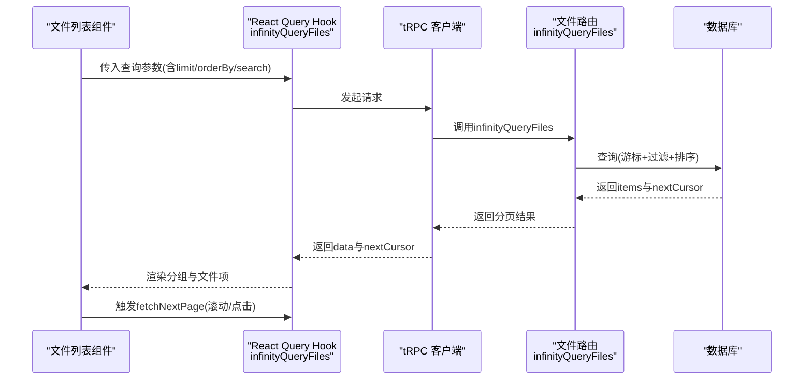
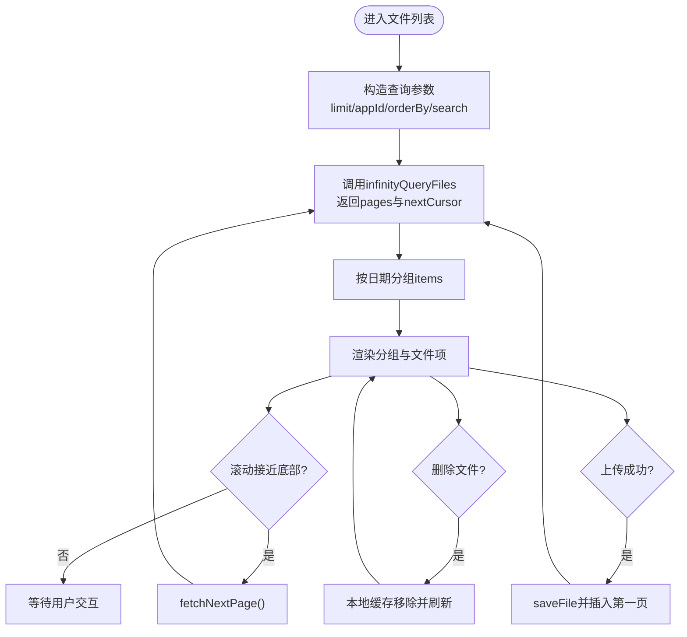
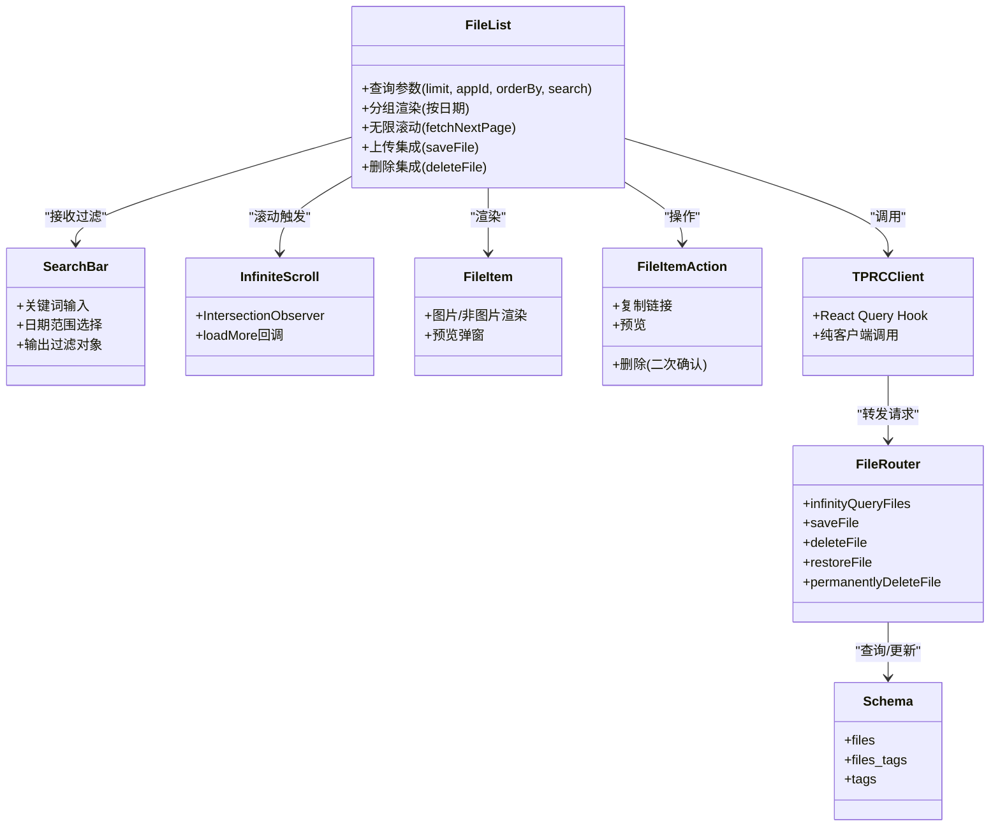

# 文件检索系统

<cite>
**本文引用的文件**
- [src/components/feature/file-list.tsx](file://src/components/feature/file-list.tsx)
- [src/components/feature/FileList.tsx](file://src/components/feature/FileList.tsx)
- [src/components/feature/infinite-scroll.tsx](file://src/components/feature/infinite-scroll.tsx)
- [src/components/feature/search-bar.tsx](file://src/components/feature/search-bar.tsx)
- [src/components/feature/file-item.tsx](file://src/components/feature/file-item.tsx)
- [src/components/feature/file-item-action.tsx](file://src/components/feature/file-item-action.tsx)
- [src/components/ui/scroll-area.tsx](file://src/components/ui/scroll-area.tsx)
- [src/server/routes/file.ts](file://src/server/routes/file.ts)
- [src/server/db/schema.ts](file://src/server/db/schema.ts)
- [src/server/db/validate-schema.ts](file://src/server/db/validate-schema.ts)
- [src/server/trpc-middlewares/trpc.ts](file://src/server/trpc-middlewares/trpc.ts)
- [src/utils/api.ts](file://src/utils/api.ts)
- [src/app/dashboard/page.tsx](file://src/app/dashboard/page.tsx)
</cite>

## 目录

1. [简介](#简介)
2. [项目结构](#项目结构)
3. [核心组件](#核心组件)
4. [架构总览](#架构总览)
5. [详细组件分析](#详细组件分析)
6. [依赖关系分析](#依赖关系分析)
7. [性能考量](#性能考量)
8. [故障排查指南](#故障排查指南)
9. [结论](#结论)
10. [附录：扩展与调优指南](#附录扩展与调优指南)

## 简介

本文件检索系统围绕“文件列表查询、无限滚动加载、搜索过滤”三大能力构建，采用 tRPC 进行前后端交互，使用 Drizzle ORM 访问 PostgreSQL 数据库，结合 Radix UI 组件与自定义 UI 提供良好的用户体验。系统支持按文件名、标签名以及创建日期范围进行搜索；支持按字段排序与游标分页；前端通过 React Query 的无限查询模式实现懒加载与缓存；后端通过游标翻页保证分页一致性与性能。

## 项目结构

系统主要由以下层次构成：

- 前端展示层：文件列表组件、搜索栏、无限滚动辅助组件、文件项与操作按钮等
- 前端网络层：tRPC 客户端封装，统一暴露 React Query Hook 与纯客户端调用
- 后端路由层：文件相关的 tRPC 路由，包含无限查询、保存文件、删除/恢复、永久删除等接口
- 数据层：PostgreSQL 表结构与索引设计，包含 files、files_tags、tags 等表
- 权限与中间件：基于会话与 API Key/Signed Token 的访问控制

图表来源

- [src/components/feature/file-list.tsx:28-49](file://src/components/feature/file-list.tsx#L28-L49)
- [src/components/feature/search-bar.tsx:27-51](file://src/components/feature/search-bar.tsx#L27-L51)
- [src/components/feature/infinite-scroll.tsx:12-37](file://src/components/feature/infinite-scroll.tsx#L12-L37)
- [src/components/feature/file-item.tsx:10-137](file://src/components/feature/file-item.tsx#L10-137)
- [src/components/feature/file-item-action.tsx:18-80](file://src/components/feature/file-item-action.tsx#L18-L80)
- [src/components/ui/scroll-area.tsx:8-29](file://src/components/ui/scroll-area.tsx#L8-L29)
- [src/utils/api.ts:1-17](file://src/utils/api.ts#L1-L17)
- [src/server/routes/file.ts:135-234](file://src/server/routes/file.ts#L135-L234)
- [src/server/trpc-middlewares/trpc.ts:30-45](file://src/server/trpc-middlewares/trpc.ts#L30-L45)
- [src/server/db/schema.ts:120-142](file://src/server/db/schema.ts#L120-L142)

章节来源

- [src/components/feature/file-list.tsx:28-49](file://src/components/feature/file-list.tsx#L28-L49)
- [src/server/routes/file.ts:135-234](file://src/server/routes/file.ts#L135-L234)

## 核心组件

- 文件列表组件：负责发起无限查询、分组显示、处理删除与上传后的数据更新、触发无限滚动
- 搜索栏组件：提供关键词与日期范围输入，输出标准化的搜索过滤对象
- 无限滚动辅助：通用的 IntersectionObserver 包装，用于懒加载
- 文件项与操作：文件卡片渲染、预览、复制链接、删除等
- tRPC 客户端：统一的 React Query Hook 与纯客户端调用入口

章节来源

- [src/components/feature/file-list.tsx:28-49](file://src/components/feature/file-list.tsx#L28-L49)
- [src/components/feature/search-bar.tsx:27-51](file://src/components/feature/search-bar.tsx#L27-L51)
- [src/components/feature/infinite-scroll.tsx:12-37](file://src/components/feature/infinite-scroll.tsx#L12-L37)
- [src/components/feature/file-item.tsx:10-137](file://src/components/feature/file-item.tsx#L10-137)
- [src/components/feature/file-item-action.tsx:18-80](file://src/components/feature/file-item-action.tsx#L18-L80)
- [src/utils/api.ts:1-17](file://src/utils/api.ts#L1-L17)

## 架构总览

系统采用“前端 React + tRPC + 后端 Drizzle + PostgreSQL”的经典分层架构。前端通过 React Query 的 useInfiniteQuery 获取分页数据，后端通过游标（cursor）实现稳定、可重复的分页；搜索与排序在后端完成，确保一致性与性能。

图表来源

- [src/components/feature/file-list.tsx:40-49](file://src/components/feature/file-list.tsx#L40-L49)
- [src/server/routes/file.ts:135-234](file://src/server/routes/file.ts#L135-L234)
- [src/utils/api.ts:1-17](file://src/utils/api.ts#L1-L17)

## 详细组件分析

### 文件列表组件（无限滚动与分组）

- 查询参数与分页
  - 查询参数包含：limit、appId、orderBy（字段与方向）、search（关键词/日期范围）
  - 使用 React Query 的 useInfiniteQuery，getNextPageParam 返回 nextCursor
  - 禁用窗口焦点/挂载/重连时的自动 refetch，避免不必要的重复请求
- 分组渲染
  - 将所有分页结果扁平化后按创建日期分组（今日/昨日/当年某月某日/跨年）
  - 支持展开/折叠各分组
- 无限滚动
  - 滚动到底部时触发 fetchNextPage
  - 另外提供一个可见的“加载下一页”按钮作为兜底
  - 使用 IntersectionObserver 在接近底部时提前触发加载
- 上传集成
  - 监听 Uppy 上传成功事件，调用保存接口并将新文件插入第一页
  - 图片上传后可触发标签识别，随后刷新标签分类缓存
- 删除集成
  - 删除成功后，本地缓存中移除对应文件，保持 UI 一致

图表来源

- [src/components/feature/file-list.tsx:28-49](file://src/components/feature/file-list.tsx#L28-L49)
- [src/components/feature/file-list.tsx:132-150](file://src/components/feature/file-list.tsx#L132-L150)
- [src/components/feature/file-list.tsx:152-235](file://src/components/feature/file-list.tsx#L152-L235)
- [src/components/feature/file-list.tsx:106-124](file://src/components/feature/file-list.tsx#L106-L124)

章节来源

- [src/components/feature/file-list.tsx:28-49](file://src/components/feature/file-list.tsx#L28-L49)
- [src/components/feature/file-list.tsx:132-150](file://src/components/feature/file-list.tsx#L132-L150)
- [src/components/feature/file-list.tsx:152-235](file://src/components/feature/file-list.tsx#L152-L235)
- [src/components/feature/file-list.tsx:106-124](file://src/components/feature/file-list.tsx#L106-L124)

### 搜索栏组件（关键词与日期范围）

- 输入能力
  - 文本关键词：支持回车触发搜索
  - 日期范围：起止日期选择器，格式化为“yyyy-MM-dd”
- 输出规范
  - 仅当值存在时才放入过滤对象
  - 清除按钮清空全部过滤条件并触发空过滤
- 与文件列表联动
  - 通过回调函数将过滤对象传递给文件列表组件，从而重建查询

章节来源

- [src/components/feature/search-bar.tsx:27-51](file://src/components/feature/search-bar.tsx#L27-L51)
- [src/components/feature/search-bar.tsx:53-59](file://src/components/feature/search-bar.tsx#L53-L59)
- [src/components/feature/search-bar.tsx:66-99](file://src/components/feature/search-bar.tsx#L66-L99)

### 无限滚动辅助组件

- 通用化封装：通过 IntersectionObserver 监听“哨兵元素”，在阈值内触发 loadMore
- 参数：children、loadMore、hasMore、isLoading、threshold（默认 100px）
- 适用场景：可复用在其他列表组件中

章节来源

- [src/components/feature/infinite-scroll.tsx:12-37](file://src/components/feature/infinite-scroll.tsx#L12-L37)

### 文件项与操作组件

- 文件项渲染：根据内容类型决定是否渲染图片预览
- 操作按钮：复制链接、删除（带二次确认）、预览弹窗
- 删除流程：调用后端删除接口，成功后本地缓存失效并移除对应项

章节来源

- [src/components/feature/file-item.tsx:10-137](file://src/components/feature/file-item.tsx#L10-137)
- [src/components/feature/file-item-action.tsx:18-80](file://src/components/feature/file-item-action.tsx#L18-L80)

### tRPC 客户端与路由

- 客户端：统一导出 createTRPCReact 与纯客户端实例，便于直接调用 mutation
- 路由：文件相关接口集中在文件路由中，包含无限查询、保存、删除/恢复、永久删除、按标签查询等

章节来源

- [src/utils/api.ts:1-17](file://src/utils/api.ts#L1-L17)
- [src/server/routes/file.ts:135-234](file://src/server/routes/file.ts#L135-L234)

## 依赖关系分析

图表来源

- [src/components/feature/file-list.tsx:28-49](file://src/components/feature/file-list.tsx#L28-L49)
- [src/components/feature/search-bar.tsx:27-51](file://src/components/feature/search-bar.tsx#L27-L51)
- [src/components/feature/infinite-scroll.tsx:12-37](file://src/components/feature/infinite-scroll.tsx#L12-L37)
- [src/components/feature/file-item.tsx:10-137](file://src/components/feature/file-item.tsx#L10-137)
- [src/components/feature/file-item-action.tsx:18-80](file://src/components/feature/file-item-action.tsx#L18-L80)
- [src/utils/api.ts:1-17](file://src/utils/api.ts#L1-L17)
- [src/server/routes/file.ts:135-234](file://src/server/routes/file.ts#L135-L234)
- [src/server/db/schema.ts:120-142](file://src/server/db/schema.ts#L120-L142)

## 性能考量

- 分页与游标
  - 后端使用游标（cursor）分页，避免“跳页”问题；游标由 createdAt 与 id 组成，确保排序字段稳定
  - 前端 getNextPageParam 返回 nextCursor，React Query 自动缓存分页数据
- 查询过滤
  - 搜索关键词同时匹配文件名与标签名，使用 ILIKE 并配合 EXISTS 子查询
  - 日期范围精确到毫秒级字符串比较，避免额外转换成本
- 排序
  - 支持 createdAt、deleteAt 等字段升/降序排序，后端通过 ORDER BY 动态拼接
- 本地缓存与乐观更新
  - 删除/上传成功后，前端通过 setInfiniteData 乐观更新第一页，减少闪烁
- 渲染优化
  - 分组渲染减少 DOM 数量；仅在需要时渲染上传中的预览
  - 使用 IntersectionObserver 提前触发加载，降低滚动抖动
- 数据库索引
  - files 表上建立复合索引以加速游标查询与过滤
  - tags 表上建立多列索引以加速标签查询

章节来源

- [src/server/routes/file.ts:135-234](file://src/server/routes/file.ts#L135-L234)
- [src/server/db/schema.ts:135-136](file://src/server/db/schema.ts#L135-L136)
- [src/server/db/schema.ts:218-223](file://src/server/db/schema.ts#L218-L223)
- [src/components/feature/file-list.tsx:106-124](file://src/components/feature/file-list.tsx#L106-L124)
- [src/components/feature/file-list.tsx:152-235](file://src/components/feature/file-list.tsx#L152-L235)

## 故障排查指南

- 无限查询不生效
  - 检查查询参数是否包含 appId、orderBy、search
  - 确认 getNextPageParam 是否正确返回 nextCursor
  - 确保未开启 refetchOnWindowFocus/refetchOnMount/refetchOnReconnect 导致频繁刷新
- 搜索无结果
  - 确认搜索关键词是否为空；日期格式是否为“yyyy-MM-dd”
  - 检查后端 SQL 是否正确拼接 ILIKE 与 EXISTS 子查询
- 删除无效
  - 确认删除成功回调是否执行 setInfiniteData 移除对应项
  - 检查权限中间件是否正确注入用户上下文
- 权限错误
  - 确认已登录且会话有效
  - 若使用 API Key 或 Signed Token，检查头部传递与签名验证

章节来源

- [src/components/feature/file-list.tsx:40-49](file://src/components/feature/file-list.tsx#L40-L49)
- [src/components/feature/search-bar.tsx:35-51](file://src/components/feature/search-bar.tsx#L35-L51)
- [src/server/routes/file.ts:168-196](file://src/server/routes/file.ts#L168-L196)
- [src/server/trpc-middlewares/trpc.ts:30-45](file://src/server/trpc-middlewares/trpc.ts#L30-L45)

## 结论

该文件检索系统通过清晰的分层设计与完善的权限控制，实现了稳定的文件列表查询、灵活的搜索过滤与高效的无限滚动加载。后端游标分页与前端缓存策略共同保障了性能与一致性；搜索与排序在服务端完成，确保结果准确可靠。整体架构易于扩展，适合进一步引入标签筛选、全文索引与更丰富的统计分析。

## 附录：扩展与调优指南

- 搜索索引优化
  - 为 files.name、files_tags.tag_id、tags.name 建立合适索引，提升关键词与标签搜索性能
  - 如需全文检索，可在 PostgreSQL 中引入 TSVECTOR/TSQUERY 或外部搜索引擎
- 查询缓存
  - 利用 React Query 的缓存策略，合理设置 staleTime/persistency
  - 对高频查询（如最近文件）可考虑本地持久化
- 结果排序
  - 除 createdAt/deleteAt 外，可扩展支持文件大小、类型等字段排序
  - 注意排序字段需与游标索引协同，避免排序字段缺失导致性能下降
- 权限与安全
  - 严格校验 appId 与 userId 的绑定关系
  - 对批量操作（删除/恢复/永久删除）增加幂等性与审计日志
- 访问统计
  - 在文件路由中记录访问行为（如预览次数、下载次数），并提供统计接口
- 性能调优
  - 适当调整 limit 与阈值，平衡首屏速度与滚动体验
  - 对大图预览启用懒加载与缩略图策略，减少带宽占用
- 扩展开发
  - 新增筛选维度（如文件类型、标签集合）时，保持搜索过滤对象的向后兼容
  - 为每个新路由补充权限中间件与输入校验，确保安全与稳定性
